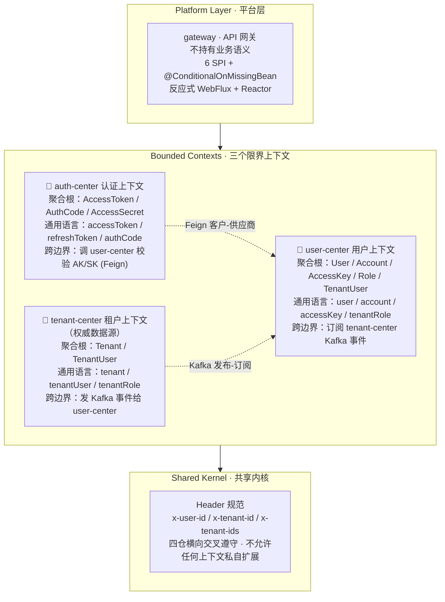

上一篇我们陪 AI 一起把三件乐器认清楚了——DDD、TDD、SDD，再加上"焊边界、放选择"那层留白。

你可能在想：道理我都懂，可真到工厂里，它们是怎么落到一份具体代码、一次具体调试、一条具体协议上的？

这一篇我们不去抽象地讨论，我们到 ArchAIHarness 工厂里那条最常见、最容易被低估、却最容易被 AI 写崩的链路——**多租户认证**——去看一份完整的乐谱长什么样。看 AI 在这份乐谱里，怎么不越界地自主开发。

我先把核心判断亮出来，免得你读到一半还在想"他到底想说什么"：

> **AI 不是 AI 写代码，是 AI 在秩序内写代码。**

听起来像废话对不对？但你接着往下看，你会发现这件事在工程上、在一行行代码里、在一次次 PR 合并里，是怎么变成真东西的。


## 一、你以为的"AI 自主开发"，不是真的自主开发

先从一个挺常见的现场说起。

你最近让 AI 接手了一个 Spring Cloud 多租户项目。你跟它说："去 auth-center 里加个新接口，按 AK/SK 换 accessToken。"AI 吭哧吭哧干完了，PR 合上去。你看了一眼，代码挺干净，测试也写了，CI 也过了。

可三天后线上出了个怪事：某个租户的成员调 `updateProfile` 一直 403。

你打开 PR 一看，AI 是这样写的——它把租户权限校验放在 `auth-center` 里了，因为它"觉得"认证就该管权限。但你打开 `tenant-center` 的 AGENTS.md，发现里面白纸黑字写着：**租户成员的可见性，必须由 tenant-center 实时查 `t_tenant_user` 表判定**，不能依赖任何从请求头里透传过来的缓存。

AI 没看过那份文档。它不知道"租户成员"这四个字在 `tenant-center` 和 `user-center` 里指的不是同一个东西。它把这两件事硬塞进一个 `UserAuthService` 里，写完还挺自信——名字起得特别通用，看起来"非常合理"。

你回头看那条 PR，每一行都"看起来合理"。每一行都没触发 P0 红线。每一行都通过 CI。但合起来，**架构已经悄悄腐化到了你想重构都不知从哪下手的地步**。

这事根子在哪？

AI 没有"业务直觉"。你看到"租户成员"四个字，脑子里立刻会跳出"这是 `tenant-center` 的领域，校验要走实时查表，user-center 的 `TenantUser` 只是同步缓存"——这一整套判断，是多年业务建模经验堆出来的。AI 没有这堆经验。它看到的是字符、命名、文件位置、上下文里出现的提示。它能写出语法正确的代码，但它写不出"业务上的对"。

上一篇我们把它叫**"业务边界 = AI 边界"**。这一篇我们把它落到一份具体代码、一条具体链路上，看它怎么从一句口号变成一行行代码、一次次合并。

这件事的本质，我先把金句亮出来——后面我们还会反复回到它：

> **AI 不是不自由，AI 是在赛道里自由——边界焊死、选择放开。**

## 二、先看一眼工厂的全貌：三个限界上下文 + 一个平台层

先把整张地图画出来。先把这次登场的四个角色讲清楚：

- **auth-center** 是认证中心——管登录、管令牌、管授权码、也管单点登录跳转。简单说就是"谁进来、用什么身份进来、进来的凭证怎么验"。
- **user-center** 是用户中心——管用户账号、管访问密钥（AK/SK）、管用户能看见的租户角色视图。简单说就是"用户是谁、他的钥匙是什么、他在每个租户里是什么身份"。
- **tenant-center** 是租户中心——管租户本身、管租户里的成员名单、管成员的角色。简单说就是"谁是这个组织、这个组织里有谁、每个人在组织里干什么角色"。
- **gateway** 是 API 网关——所有外部请求的入口，负责校验令牌、校验租户权限、把上下文透传给下游业务服务。简单说就是"大门+门卫"，谁敲门先盘一下。

这四个组件是 ArchAIHarness 团队在 GitHub 上开源的真实工程资产——三个业务仓（auth-center / user-center / tenant-center）都是基于一个叫 **framework** 的 DDD 骨架搭建的（framework 仓库本身是工程底座）。这一篇的所有"代码层证据"都来自这四个仓库公开的代码与文档，不是凭空构造的术语。

但这四个组件**不是四个微服务**——这句话得先讲清楚。

按 DDD 的战略设计，**auth-center、user-center、tenant-center 是三个限界上下文（Bounded Context）**，每个有自己的业务语言、核心模型、不变量；它们之间的关系用上下文映射（Context Mapping）讲，不是"服务调用"——部署形态是工程选择，限界上下文是建模选择。

而 gateway **不是任何业务限界上下文的一部分**，它是**平台层（Platform / Infrastructure Layer）**，和 framework 骨架的"基础设施"模块同级——业务无关、不承载业务规则、不在 DDD 的战略设计里扮演角色。你可以把它想成"大堂经理"——他不是任何业务部门的人，他是物业的人，负责"谁来、登记、走哪"。

把这件事钉死，整张分层图就清晰了：



我特别想让你注意 gateway 在这张图里的位置——它**在最上面、独立一层**。

gateway 跟下面那三个不一样。三个业务仓都按"领域六模块"搭（domain 管模型、application 管用例、interfaces 管接入、infra 管持久化……），这是 DDD 的标准分层。**gateway 不这么搭**——它不分"领域 / 应用 / 接入"这种层，它是按"职责"切的：处理 token 的、处理缓存的、处理配置的、处理过滤器的、处理续期的、处理租户的。一个文件干一件具体事，不做"领域建模"。

这不是偶然——这是平台层的硬证据：**平台层不做业务领域建模**。平台层只管"怎么把请求接进来、转出去、附加上下文"，不思考"用户是什么、租户是什么"这些业务问题。所以它不分层——分层是为了让业务规则和实现细节各回各家，平台层没业务规则要分，自然不按 DDD 那套搭。

三个限界上下文之间的关系，也不是"互相调用"。DDD 用"上下文映射"翻译这件事，四种映射在工厂里都有实证：

- **认证中心 → 用户中心 是客户-供应商（Customer-Supplier）**：认证中心是下游客户，通过远程调用问用户中心"这对密钥真的假的"。一条专门的客户接口就代表这条映射的代码形态。
- **租户中心 → 用户中心 是发布-订阅 + 发布语言（Published Language）**：租户中心发"租户成员事件"专用消息，用户中心消费同步缓存。事件 schema（双方约定的字段清单）就是两边的"通用语言"。
- **网关 ↔ 三仓 是开放主机服务（Open Host Service）+ 防腐层（Anti-Corruption Layer）**：网关提供 6 个 SPI 接口作为统一契约，自己不持有任何业务语义——主过滤器只做编排，具体策略一个"提供方"就能换。
- **四仓 ↔ Header 规范 是共享内核（Shared Kernel）**：`x-user-id` / `x-tenant-id` / `x-tenant-ids` 是四仓共同遵守的"内核数据"，四份 AGENTS.md 横向交叉 100% 一致。

这四种映射在后面三条链路里会一条条出现。现在你只要记住一件事——**这不是四个微服务在互相 ping，这是四个有清晰边界的角色在按 DDD 战略设计的语言协作**。

我们后面要看的三条链路（多租户认证的完整路径），都从这张图里来：

- **链路 A**——用户敲下 AK/SK，怎么换到 accessToken；
- **链路 B**——请求带着 accessToken 进来，网关怎么校验、怎么把租户上下文透传下去；
- **链路 C**——租户成员变更，user-center 怎么同步缓存。

三条链路，三个章节。每个章节，我会把"AI 在这一步会撞到什么墙、被什么规矩挡住、被什么验证放过"讲清楚。


## 三、链路 A：从 AK/SK 到 accessToken——客户-供应商映射焊死的边界

链路 A 的故事最简单也最容易踩坑。

用户敲下 AK（访问密钥的"账号"）和 SK（访问密钥的"密码"），按 OAuth 2.0 的风格请求"换令牌"接口。这条路要跨两个限界上下文——认证中心管签发令牌、用户中心管"这对密钥到底是不是真的"。听上去一次 HTTP 调用能搞定的事，背后有几个秩序点必须立死。

### 第一个秩序点：用户说的"用户"和租户说的"用户"，不是同一个用户

AI 接手这条链路的第一道坎，是分清楚"用户"这个词的语境。

认证中心里有两类东西——**访问令牌**（AccessToken，登录后拿到的那串字符凭证）和**授权码**（AuthCode，单点登录跳转时用的一次性短码）。这两件事有一个共同规矩：**状态机的硬转换点不能绕过**。比如授权码一旦被验证就立刻翻成"已用"状态，没有"先放着不用、回头再用"这种可能——这就是"一次性"的工程硬证据。

认证中心**不存"用户"**。它存的只是"这次令牌代表哪个用户 ID、是哪个客户端申请的、能访问哪些 scope"这些**引用型字段**——"用户是谁"那是用户中心的事，认证中心不问。问了就越界。

用户中心里有一个"访问密钥"（AccessKey）的根，专门管"这对 AK/SK 到底是不是真的"。验签这一动作的权威源就在用户中心——认证中心想知道这对密钥真不真，必须来问用户中心。

如果 AI 不懂这条边界，它可能干出这种事：把"访问密钥"拷一份到认证中心里"方便校验"——以后改一处字段，两个仓都得改，AI 不知道哪个改了哪个没改，bug 就来了。

这件事得用一句金句焊死：

> **用户说的是用户的话，租户说的是租户的话，认证说的是认证的话——把它们硬凑到一个表里，就崩了。**

### 第二个秩序点：客户-供应商的"问-答"关系，不是平级调用

认证中心问用户中心"这对密钥真的假的"，这条"问-答"在 DDD 语义里叫**客户-供应商**——认证中心是下游客户，用户中心是上游供应商。

为什么是供应商而不是平级？因为"密钥真不真"的权威源在用户中心，认证中心没这个权威，它只能问。AI 想在这块动手时必须意识到——**用户中心挂了要有兜底路径**，不是临时补丁，是从一开始就要写在规矩里的事。**这条规矩背后是供应链语义**：客户依赖供应商，供应商不能用了，客户得能撑住场面。

更隐性的一条规矩是"问的时候身份不能丢"——认证中心向用户中心发请求时，必须把上游请求里的"x-开头的头信息"原样透传下去（x-user-id 是谁、x-tenant-id 是哪个租户、x-trace-id 是哪条调用链），这样请求从一个上下文到另一个上下文时身份不断。**只透传 x- 开头的头**，不是把所有头一股脑搬过去——trace-id 和全局上下文这类不该跨边界的数据，搬过去就泄露了。

AI 接手这块时如果不知道这条规矩，它可能"觉得安全起见把头信息都透传"——这一改，跨边界的数据管控就崩了。**这条规矩写在代码里，但理由在跨上下文身份设计里**——AI 必须看代码、更要看懂 DDD。

### 第三个秩序点：TDD 的覆盖率门槛是 AI 的护栏

认证中心业务层的 AGENTS.md 强制测试用 Given-When-Then（"给定...当...则..."）的命名风格——比如"给定已签发令牌当重复请求则拒绝"——这名字本身就是验收标准。覆盖率门槛在仓库 AGENTS.md 里标着。

注意一个真实的工程现实——framework 骨架的覆盖率配置实际是行覆盖 70% / 分支覆盖 30%，但各层 AGENTS.md 文档写的是 90%。文档和代码打架，这是工程师对现实的妥协。你可以争论哪个数字合理，但底线是：**数字必须存在**。有 70% 在那里卡着，AI 就不敢全跳过测试；你把它调到 90% 或者 80%，那是工程选择，不是"有没有规矩"的选择。

链路 A 的核心测试是"签发访问令牌的端到端测试"，覆盖"令牌工厂方法 + 令牌字段约束"这些关键路径。如果 AI 改了令牌的默认过期时间，不更新测试断言，PR 就会在 CI 阶段被阻塞——这是**TDD 在 AI 时代从"开发流程"升级成"体系审计"** 的硬证据。

### 第四个秩序点：AGENTS.md 的 P0 红线不能绕

链路 A 还有一个 P0 红线必须单独提——**单点登录的 Cookie 必须用浏览器里跑的那段 JavaScript 去写，不能用服务端 Java 提供的"加 Cookie"接口**。

这条听着像技术偏好，但它是真实事故留下来的工程妥协——新版本的 Tomcat 拒绝给".example.com"这种带前导点的域名写 Cookie，要是走服务端那套加 Cookie 的接口，整个登录跳转就 400 报错。这条**焊死在项目里一份叫 ADR 0001 的设计决策文档里**，历史上复发过两次——有人改回旧写法又触发 400 错误，再次还原。

这件事对 AI 的启示是：**有些"看起来更对"的写法是错的**——AI 看到"用 Java 接口加 Cookie"会觉得"这才是 Java Web 教科书写法"，但它不知道这个项目里"用浏览器里那段 JS 写 Cookie"是经过血的教训留下来的。AGENTS.md 的红线 + 设计决策文档的 git 历史 + code-review 的报告，三件套焊死一条规矩——AI 不知道这条历史，就一定会"觉得"自己写得更对。

到这里，链路 A 的四个秩序点就讲完了。简单列一下：

1. **DDD 焊边界**：访问令牌 / 授权码 / 密钥密文属于认证中心，访问密钥（AK/SK）属于用户中心，权威源唯一。
2. **客户-供应商映射**：远程调用 + 降级工厂 + 头信息透传拦截器（只透传 x- 开头），用户中心挂了认证中心能撑住场面。
3. **TDD 覆盖**：签发令牌的核心测试必须命中 Given-When-Then，覆盖率门槛是 PR 阻塞线。
4. **P0 红线**：单点登录 Cookie 必须 JS 写法，ADR 0001 焊死，复发即回滚。

四个点合起来——AI 在这条链路上能动的空间，是"按规矩动"。


## 四、链路 B：Token 校验 + 多租户透传——平台层的软秩序

链路 A 是签发，链路 B 是校验。这条链路的主战场从三个限界上下文换到了**平台层 `gateway`**。

一次普通的"用户访问受保护资源"，大致是这样的：

```
client → gateway → [校验 token + 透传租户上下文] → 下游业务服务
```

听上去是网关在"鉴权"，但我们马上就会发现——**网关不鉴权**。

### 第一个秩序点：网关不验签 JWT

项目里明确写过一条规矩——**网关会读 token 里的过期时间，但不会自己验签**，这是有意为之：token 到底合不合法，认证中心说了算。

这事听着反直觉——网关都能读出 token 里的字段了，那它凭什么相信这个 token 是真的？

答案是**单一权威**。认证中心是"这个 token 到底能不能用"的唯一权威源；网关通过一个专门问"这 token 还能不能用"的远程调用，从认证中心拿到权威判定结果。它自己读 token 里的过期时间，只是为了**续期决策**——看看这个 token 是不是快过期了，要不要在用户没察觉的情况下悄悄换一个新的。

这就是防腐层（Anti-Corruption Layer）的精髓——**不让任何业务语义穿透到平台层**。网关能读 token 里的字段，不代表它"懂" token 的业务含义；它只管"快过期了帮忙换个新的"，不管"这串字符背后绑的是谁、签过什么"。

AI 接手这块时最容易干的事是"觉得既然网关能读 token，那就自己验签吧，省一次远程调用"。这一改，就把"单一权威"打破了——以后改签名密钥，所有网关实例要同步改，AI 不知道哪个改了哪个没改，安全洞就来了。

### 第二个秩序点：6 个 SPI 是"焊编排、放开策略"

网关仓里有 6 个 SPI（Service Provider Interface，扩展点）接口，这是平台层"软秩序"的最硬证据：

| SPI 接口 | 职责（白话翻译） |
|---------|-------------------------|
| `TokenExtractor` | 从入站请求里把 token 抠出来 |
| `TokenIntrospector` | 问认证中心"这 token 还能不能用"，拿权威判定 |
| `AuthenticationCache` | 缓存"token 能不能用"的结果，别每请求都去问 |
| `TenantAccessValidator` | 判定"这个用户能不能访问那个租户的资源" |
| `HeaderEnricher` | 把"用户是谁、租户是谁"写进请求头，转给下游 |
| `TokenRenewer` | token 快过期了悄悄换一个新的，失败也别把主请求搞挂 |

主过滤器自己不写任何业务策略——它的类注释里白纸黑字写着"所有职责委托给 SPI"。

也就是说——**主过滤器只做编排**。每个 SPI 的具体实现，是用 Spring 的"提供方"机制（`@Bean`）注入的；项目里 8 个默认实现都标了同一个规矩——"如果业务方没自己提供，就用我这个"。

这套机制的工程价值在哪？**业务方在自己工程里写一个"我自己的 token 校验器"，就把远程校验换成本地 JWT 验签，框架代码完全不动。** 缓存想换 Redis 换 Redis、想换 Caffeine 换 Caffeine、想换 Hazelcast 换 Hazelcast——只要提供一个对应的"我自己的实现"，默认实现自动让位。

这是 AI 时代的"秩序里有留白"——编排焊死（接口签名不能改、主过滤器逻辑不能动），实现放开（具体选型、技术栈、缓存后端，AI 在边界内随便挑）。

### 第三个秩序点：反应式纪律是平台层的"硬规矩"

平台层虽然松，但不是没规矩。网关最硬的一条规矩是**反应式纪律**——整套网关是事件循环跑的，禁绝任何阻塞调用：什么"卡住等结果"、什么"用同步 HTTP 客户端发请求"、什么"用 JDBC 同步查数据库"，统统不许出现。

为什么这么严？因为网关是事件循环的——一个阻塞调用挂住一条工作线程，整条网关链就堵，所有用户的请求都得排队等。AI 接手这块时最容易干的事——为了"业务清晰"在某个默认实现里偷偷调一个同步 HTTP 客户端。这一改，网关在生产上随机出现"莫名卡顿"，你查半天发现是某个不显眼的地方藏了一个"卡住等结果"。

项目里专门规定反应式链路必须用一种专门的测试方法（`StepVerifier`）来验，就是为了逼 AI 自己写的代码**先被反应式纪律卡一遍**。

### 第四个秩序点：HeaderEnricher 写入共享内核

链路 B 最后一步是把多租户上下文透传给下游。这里有个特别细微的设计——网关写给下游的头字段是 `x-user-id` / `x-tenant-id` / `x-tenant-ids` 这套**全小写**的名字。

为什么必须全小写？因为这是**四仓共享内核**的一部分——认证中心、用户中心、租户中心、framework 骨架的 AGENTS.md 都在同一节里写着同一句话："所有 Header 名称必须为全小写，禁止 `X-User-Id` 等大小写变体。"

AI 接手这块时最容易干的事——觉得 `X-User-Id` 看起来"更标准"，就把字段名改了。这一改，下游用户中心读 Header 的逻辑就读不到值了（因为它按小写匹配），所有租户权限校验全挂。

**这条规矩看似小，是 SDD 双文档体系最容易被低估的硬规范证据**。四个仓的 AGENTS.md 横向交叉 100% 一致——这种"四个文档写同一句话"的纪律，是 AI 时代秩序最稳的形态。

链路 B 的四个秩序点也讲完了：

1. **JWT 不验签**：单一权威在认证中心，网关只读过期时间不为安全。
2. **6 个 SPI 焊编排**：主过滤器只做编排，8 个默认实现都标了"业务方没提供就用我"，实现随便换。
3. **反应式纪律**：禁绝任何阻塞调用，反应式测试专门做验证护栏。
4. **共享内核小写**：四仓 Header 全小写，AGENTS.md 横向交叉焊死。

链路 B 的核心是——**平台层告诉你可以怎么做**。换什么缓存、用什么鉴权、写不写 JWT 验签，都在 SPI 边界内开放。


## 五、链路 C：租户成员变更——发布语言焊死的事件契约

链路 C 是异步链路，故事完全不同。

管理员在 `tenant-center` 加一个租户成员（PUT `/api/v2/tenant/{id}/users`），`user-center` 必须**实时知道**这个事——否则这个用户登录后 user-center 还以为他不在这个租户里，调业务接口全 403。

怎么通知？走 Kafka 事件。

### 第一个秩序点：租户成员的权威源只能有一个

租户中心里有一个"租户成员"实体（用代码视角看是个聚合根），它就是**权威数据源**——里面"成员 ID / 租户 ID / 用户 ID / 角色 / 创建时间"这些字段，全世界只有这一份是真货。

用户中心里也有一个同名同姓的"租户成员"，但它的注释写得很清楚——"这个数据是通过 Kafka 事件从租户中心同步过来的"——**它只是个同步缓存**。

权威源只能有一个。这条规矩焊在哪？焊在"租户成员保存"的实现里——一旦说"这个成员要落库"，立刻同时说一句"我要发个事件告诉别人"——**保存和发事件这两件事是绑死的**，不能拆。

同样的硬约束在"删除成员"——删的时候也要发"删除事件"。**改、删、新增走同一事件契约**——AI 不能写出"删除时偷偷不发事件"这种退化逻辑，省一次网络调用但埋了一颗雷。

### 第二个秩序点：发布语言（Published Language）是硬契约，不是软约定

事件 schema 就是两边的"通用语言"——这是 DDD 战略设计里"发布-订阅 + 发布语言"的硬证据。

租户中心发出"租户成员已保存"事件时，事件结构是定死的：必须有一个无参构造函数（反序列化要求），字段不能是 final（同样的反序列化要求）。这两条是 P0 红线——AI 想给字段加 final 修饰让代码"更优雅"？不行，加了就反序列化失败，所有下游用户都收不到这个事件。

用户中心订阅端必须严格按租户中心定的字段名来收——字段名一一对应、允许发布方将来加新字段（这叫"向前兼容"），但**现有的字段名不能改、不能少**。

为什么这是"硬"不是"软"？因为 Kafka 一旦接入生产，两边同时在跑，schema 不兼容就是生产事故——一边在生产上跑的消费端突然解析不了新事件，所有租户成员同步就静默失败。AI 接手这块时最容易干的事——觉得"反正只有两字段对不上，改一下消费端就行"。这一改，正在生产上跑的事件消费就全乱了。

**这件事的金句：事件 schema 是「发布语言」，租户中心发什么字段、什么类型，用户中心必须严格按 schema 收。** 不存在"临时改消费端"这种选项。

### 第三个秩序点：幂等保证是业务级，不是切面级

Kafka 的事件可能被重投（消息确认超时、网络抖动），用户中心必须能**幂等消费**——重复收到同一个"成员已保存"事件不能产生副作用。

消费逻辑的核心判断是：**用户 ID 变了才更新、角色变了才更新，否则跳过。** 重复收到一个"成员已保存"事件但内容没变，就什么都不做——这是最朴素也最可靠的"幂等"。

这不是切面级幂等（用"幂等注解"配拦截器一刀切），是**业务级幂等**——把"什么算变更"写进业务逻辑自己里。AI 接手这块时最容易干的事——觉得"用注解更优雅"，一刀切判定"已处理过就跳过"。这一改，以后租户中心加个字段（比如昵称变化），用户中心就感知不到了——业务级判断才是"对的内容"，切面级是"懒人的捷径"。

### 第四个秩序点：Kafka topic 路由规则焊在 AGENTS.md

租户中心发事件时，事件按类型走不同的"通道"（Kafka 里叫 topic）——包含"TenantUser"字样的就走"租户成员事件"专用通道，其他事件走更通用的"按事件类型分通道"模式。

这条规则同时写在租户中心 AGENTS.md 的"事件机制"一节里。

为什么 topic 路由规则要焊死？因为用户中心是**按 topic 订阅的**——它只听"租户成员事件"通道和"租户已删除"通道。topic 名字一对不上，下游就听不到事件。

如果 AI "觉得"租户成员事件应该叫"event.SavedTenantUserEvent"（更符合"统一命名规范"），这一改，用户中心听不到事件，整个租户成员同步就静默失败了——没有任何报错，只是"该同步的不再同步"。

**topic 名字是协议的一部分，不是装饰**。

链路 C 四个秩序点讲完：

1. **权威源唯一**："租户成员"在租户中心是权威，在用户中心是缓存；保存/删除动作必须绑死事件注册。
2. **发布语言硬契约**：事件必须有"无参构造"和"非 final 字段"两条 P0 红线，订阅端 schema 必须严格匹配。
3. **业务级幂等**：用户 ID 变了或角色变了才更新，不是一刀切的"幂等注解"替代。
4. **topic 路由焊死**：包含 "TenantUser" 字样的事件必须走"租户成员事件"专用通道，topic 名字不能改。

到这里你应该感觉到一条主线了——**三个限界上下文都用发布语言说话，但每一段发布语言都有自己的硬规则，不能串**。


## 六、硬秩序 vs 软秩序——三个限界上下文焊边界，平台层放选择

三条链路讲完，我们现在可以把整张图合起来看——

**三个限界上下文（auth / user / tenant）演示的是硬秩序，平台层（gateway）演示的是软秩序。**

这件事我用一组对照讲清楚：

| 维度 | 三个限界上下文 = 硬秩序 | gateway 平台层 = 软秩序 |
|------|--------------------------|--------------------------|
| **焊死什么** | 严格 DDD 六模块依赖方向 / `domain` 零 Spring / Header 全小写 / Controller 必须 `@RequestMapping` / DomainEvent 必须 `@NoArgsConstructor` / P0 红线不可破坏 / 跨上下文协议（事件 topic、API 路径） | 编排过滤器只能走 SPI / 不能引入阻塞 API / Header 名走 `archai.gateway.header.*` 配置 / 续期是 best effort / K8s 服务发现不用 Eureka / 路由 StripPrefix(3) 固定 |
| **放开什么** | 业务实现细节 / 第三方库选型 / 仓库实现可在 infrastructure 自由发挥 / 事件处理器内部逻辑 | 6 个 SPI 的具体实现 / 缓存后端（内存 / Redis / Hazelcast）/ 多租户规则 / JWT 是否本地验签 / 鉴权来源（远程 / 本地 / OAuth2）/ Header 字段名 / 新增业务策略首选新增 SPI 而非修改编排 |
| **替换代价** | 几乎不能改，改了就不再是 ArchAIHarness | 改一个 `@Bean` 即可，框架代码不动 |
| **典型比喻** | **乐谱上的音符**——必须照谱演奏，每个音高/时值焊死 | **表情记号**——强弱、快慢、踏板由指挥（业务方）自由发挥，但必须存在于乐谱框架内 |

这个对照表里有几个关键点你得抓稳：

**第一，硬秩序的本质是"约束"。** 三个限界上下文告诉我们"不能做什么"——`x-user-id` 不能写成 `X-User-Id`，SSO Cookie 必须 JS 写法，租户成员必须实时查表，DomainEvent 字段必须非 final。这些不是"建议"，是 P0 红线，PR 阻塞。

**第二，软秩序的本质是"开放"。** 平台层告诉我们"可以怎么做"——token 校验可以本地 JWT、可以远程 introspect、可以走 Redis 缓存、可以走本地缓存；缓存可以 LRU、可以 FIFO、可以 Caffeine、可以 Redis。技术栈你说了算。

**第三，硬秩序和软秩序合起来才是完整的秩序。**

> **三个限界上下文告诉你不能做什么（焊边界），平台层告诉你可以怎么做（放选择）。两者合起来，才是 AI 时代的完整秩序。**

这两层单独拿出来都不够——光有硬秩序，AI 在规矩里只能抄模板；光有软秩序，AI 会失控。**焊边界 + 放选择**，才是 AI 自主开发的正确形态。

这件事跟上一篇"留白设计"那一节是呼应的——上一篇讲为什么秩序要有留白，这一篇用 gateway 的 6 个 SPI + `@ConditionalOnMissingBean` 给出了最干净的工程实证。


## 七、Superpowers 五件套嵌入——AI 自主开发的纪律怎么落到这三条链路上

到这里你应该有感觉了——秩序立起来了，但秩序不是装饰。**秩序必须被一个 AI 在每一步都"自己撞到、自己遵守、自己验证"的纪律托住**。

这套纪律从哪儿来？我把工具层面那一套 superpowers 落到三条链路的具体动作上，看它们每一件在哪个节点卡 AI 一步。

### 第一件：brainstorming——AI 动手前先问"为什么做、做什么、不做什么"

AI 接手认证中心里"租户成员保存后注册事件"那段逻辑（`savedEvent()`）之前，必须先做一次 brainstorming：它要问自己——

- "为什么做？"（保持租户成员变更的语义清晰）
- "做什么？"（注册事件 + 清空事件 + 落库 + 发到 Kafka）
- "不做什么？"（不能直接落库绕过事件；不能给字段加 final；不能改 topic 名字）

如果 AI 没做这一步，它大概率会"简化"——把"保存后注册事件"这段里的事件注册逻辑删掉，直接调底层的 `repository.save()`。这一删，发布语言就崩了。

在用户中心接手"消费到事件后写本地缓存"这段（`TenantServiceImpl.save()`）之前，它必须 brainstorm：幂等保证是业务级还是切面级？**答：业务级**——用户 ID 变了或角色变了才更新，不是一刀切的"幂等注解"替代。

### 第二件：writing-plans——AI 出实施计划，明确"先写哪层、先测哪个接口、依赖谁"

AI 改 accessToken 校验逻辑之前，必须先写一份实施计划：

- 改"领域"层（管业务模型的）还是"应用"层（管业务用例的）？（**领域层**——业务规则不依赖框架）
- 测试覆盖哪几个 Given-When-Then？（**正常签发 / 重复签发 / 过期签发 / 续签路径**）
- 依赖谁的接口？（远程校验"密钥真不真" + 访问令牌工厂方法 + JWT 生成器）

这一步把"路径规划"提前到动手之前，避免 AI 写到一半发现"哦原来要调 user-center 的接口"——这种时候它最容易顺手在 auth-center 里"为方便"本地存一份 AccessKey。

### 第三件：TDD——AI 先写测试再写实现，覆盖率不达标阻塞 PR

每一条链路都有强制测试：

- 链路 A：访问令牌端到端测试，验证令牌工厂方法 + 令牌字段约束 + 续签路径。
- 链路 B：反应式测试工具（`StepVerifier`）验证主过滤器（`AuthenticationGlobalFilter`）的反应式链；6 个 SPI 默认实现必须有单元测试。
- 链路 C：本地缓存写入（`TenantServiceImpl`）的幂等逻辑必须有 Given-When-Then 测试（用户 ID 变化 / 角色变化 / 都未变化 三种场景）。

覆盖率门槛不一定 90%——framework 仓的 `pom.xml` 实际配的是 LINE 70% / BRANCH 30%——但**数字必须存在**。AI 跳过测试 = PR 阻塞。

### 第四件：systematic-debugging——AI 撞墙按方法排查（症状→原因→对策→验证）

链路 B 里最容易撞墙的是"401 vs 503 区分"——auth 服务不可达（503）和 token 失效（401）的根因完全不同：

- 401 Invalid token：`auth` 服务返回 401 / `userId` 缺失 → `result.isValid() == false`
- 503 Auth service unavailable：WebClient 抛错 → `onErrorResume(...)`

AI 撞这堵墙时不能瞎猜"重试一下"——它要按 systematic-debugging 的纪律：症状（线上报警说"认证失败"）→ 原因（是 token 真失效，还是 auth 服务挂了？）→ 对策（401 提示用户重新登录；503 触发 fallback 工厂）→ 验证（修复后跑一遍 P0/P1/P2 检查）。

### 第五件：verification-before-completion + code-review——AI 自己验证 + 自动审查

提交前 AI 必须跑完 `mvn clean test`（AGENTS.md §验证命令强制），确保编译通过、所有测试绿、所有覆盖率门槛满足。

然后 code-review 这件隐含的第六件上场——项目里已经把"自动审查"做成 AI 能跑的标准流程，审查报告里 0 个 P0、0 个 P1、3 个 P2 之后才允许合并。每个仓的 PR 流程都必须先看 AGENTS.md 的红线规则，再看自动审查报告——这两件是体系审计的最后一关。

五件套合起来——AI 在每一条链路上都被**五道纪律**卡着：进入项目先想清楚（brainstorming），动手前先规划（writing-plans），写代码按 TDD 节奏（test-driven-development），撞墙按方法排查（systematic-debugging），提交前自己验证 + 自动审查（verification-before-completion + code-review）。

AI 在五道纪律里自由——它是**被纪律托住的自由**。

## 八、写在最后——AI 不是不自由，是在赛道里自由

回到开头那个反直觉的判断——AI 编码能力越强，秩序越贵。

你可能还在想：以前没这么麻烦啊。规则是给"不靠谱的工程师"准备的，AI 应该比人更靠谱才对吧？

这是把 AI 当人看了。AI 不是"更靠谱的工程师"，AI 是**另一种执行者**——它没有业务直觉，但它的执行力、放量速度、模仿能力都远超人类。你不给它规矩，它不会"自己学会"——它会用最快的速度放大项目里所有不规范。

把这件事落到 AGENTS.md 上看，就更清楚了——

> **AGENTS.md 是这个时代最重要的工程文档——它是人和 AI 之间的合同。**

合同里有"必须做什么"（P0 红线、覆盖率门槛、依赖方向、Header 命名），也有"可以怎么做"（SPI 实现选型、第三方库选型、具体技术栈）。这两层合起来，就是 AI 时代的"完整秩序"。

架构师不是 AI 的甲方，架构师是 AI 的**作曲+指挥**——乐谱写好（SDD）、边界划好（DDD）、验收订好（TDD），AI 在秩序内自主开发。

我把这篇的核心判断再敲一遍：

> **AI 不是不自由，AI 是在赛道里自由——边界焊死、选择放开。**

未来真正会用 AI 的工程师，不一定是写代码最快的那一批，而是**把秩序立得最清楚、让 AI 在秩序里跑得最爽的那一批**。

---

### 关于 ArchAIHarness

这篇文章是「看懂 AI 与智能体」专栏的一部分，由 [**ArchAIHarness**](https://github.com/ArchAIHarness) 持续输出。

ArchAIHarness 是一套面向 AI 时代软件工程的人机协同架构哲学与公开工程资产，主张：

> **架构师定义秩序，AI 在秩序中生长。人立法，AI 执行，体系审计。**

如果你也希望 AI 在明确的架构边界内协作，而不是在混沌中碰运气，欢迎到 GitHub 上看看我们在做什么：

- **组织主页**：[github.com/ArchAIHarness](https://github.com/ArchAIHarness) — 了解完整理念与资产全景
- **本专栏**：[`zhuanlan-ai-and-agents`](https://github.com/ArchAIHarness/zhuanlan-ai-and-agents) — 所有文章的源码与发布记录
- **实践指南**：[`docs`](https://github.com/ArchAIHarness/docs) — 架构哲学、工程方法和落地指南
- **开源工具**：[`agent-workflows`](https://github.com/ArchAIHarness/agent-workflows) — 可复用的 AI 协作 Agents、Skills 与 Tools
- **工程样例**：[`framework`](https://github.com/ArchAIHarness/framework) — DDD + AI 协作的工程底座，展示如何在开发中融合 AI

> Engineered by Architects · Empowered by AI · Audited by Discipline