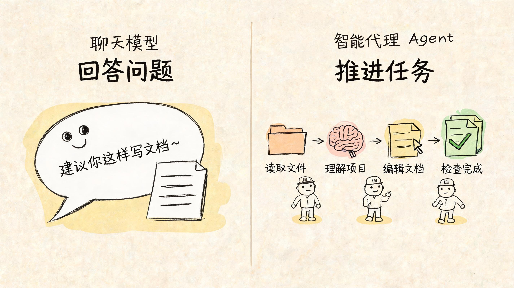
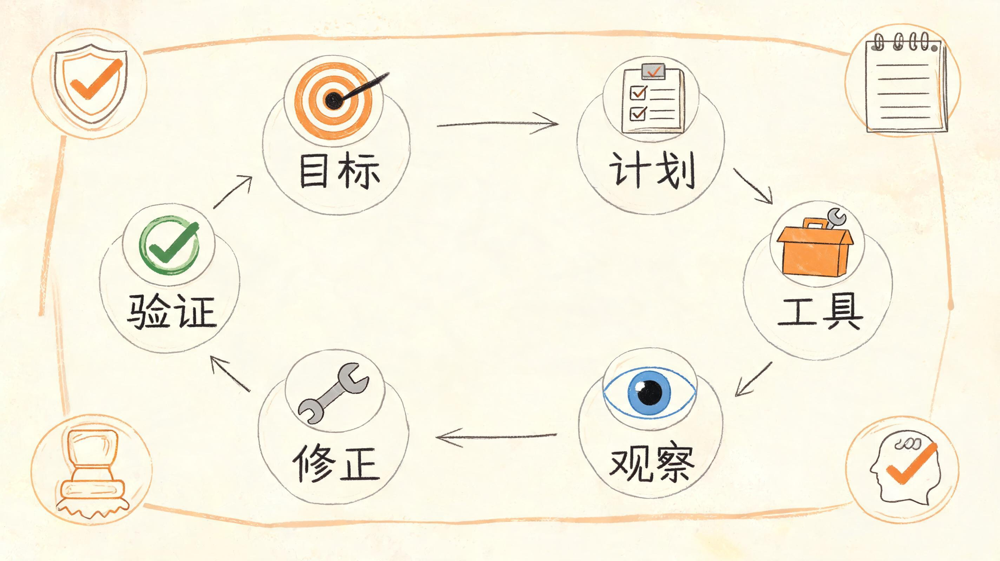
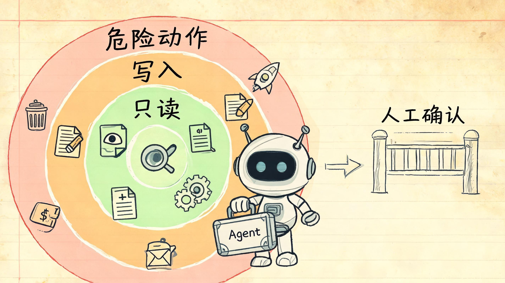
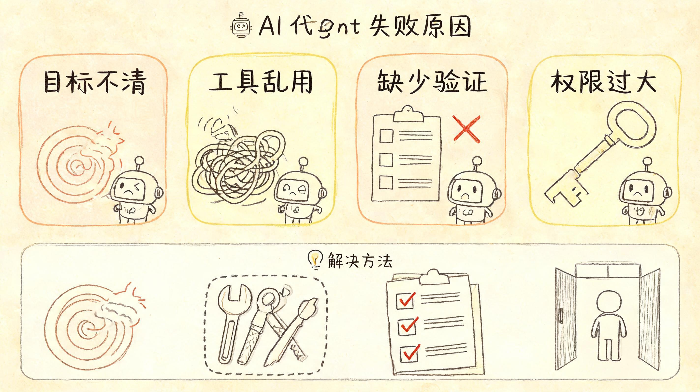

# Agent 到底是什么？它不是会聊天的 AI，而是会执行任务的系统

很多人第一次听到 Agent，会下意识把它理解成“更聪明的聊天机器人”。

这很正常。因为我们最早接触 AI，大多是从聊天开始的：你问一句，它答一句；你让它写一段文案，它立刻给你一段；你让它解释一个概念，它也能说得头头是道。

但如果只把 Agent 理解成“更会聊天的 AI”，就会错过它真正重要的地方。

**Agent 的关键不在聊天，而在执行。**

它不是只负责回答问题，而是围绕一个目标，自己拆解任务、选择工具、执行动作、观察结果、修正计划，直到把事情推进到一个可验证的状态。

换句话说，大模型更像一个“会思考和表达的大脑”；Agent 则更像一个“有目标、有工具、有反馈的执行系统”。

这篇文章，我们不用复杂公式，也不讲玄学概念，只讲清楚一件事：Agent 到底是什么，它为什么重要，又为什么很容易翻车。

## 一、会聊天，不等于会办事

先看一个简单例子。

你对一个普通大模型说：

> 帮我整理一下这个项目的 README。

它可能会告诉你 README 应该怎么写，或者给你一份模板。

但你对一个 Agent 说同样的话，它理想情况下应该能继续往下做：

1. 读取项目目录。
2. 理解代码结构。
3. 找到已有文档。
4. 判断哪些内容缺失。
5. 修改 README。
6. 检查格式。
7. 告诉你改了什么。

这就是差别。

聊天模型主要产出“回答”；Agent 追求的是“推进任务”。

它不只是说“你应该怎么做”，而是能在授权范围内真的去做一部分事。

所以判断一个系统是不是 Agent，不要只看它会不会多轮对话，而要看它有没有这几个能力：

- 有没有明确目标。
- 会不会拆解步骤。
- 能不能调用外部工具。
- 会不会观察执行结果。
- 能不能根据结果修正下一步。
- 最后是否能验证任务完成。

如果没有这些，只是聊得更久、更像人，那仍然只是对话系统。

## 二、Agent 的核心，是一个执行闭环

可以把 Agent 想象成一个不断循环的工作流。

第一步，它要理解目标：你到底想完成什么。

第二步，它要拆解计划：为了完成这个目标，需要分几步走。

第三步，它要调用工具：比如读文件、查资料、跑命令、打开网页、调用接口。

第四步，它要观察结果：工具调用之后到底发生了什么。

第五步，它要修正计划：如果结果不对，下一步该调整什么。

这几个动作连起来，就是 Agent 的基本闭环：

> 目标 → 计划 → 工具 → 观察 → 修正 → 再执行

这也是 Agent 和普通聊天机器人的本质差异。

普通聊天机器人更多是在语言空间里生成答案；Agent 则开始进入外部世界，借助工具影响真实环境。

它可以改文件、查数据库、创建草稿、调用浏览器、运行测试、整理资料。

也正因为它能“动手”，Agent 的价值和风险都会被放大。

会聊天时，它说错一句话，最多是回答不准；会执行后，它做错一步，可能就会改错文件、误发内容、泄露信息，甚至造成线上事故。

所以 Agent 不是“更自由的 AI”，而是“更需要边界的 AI”。

## 三、工具，决定了 Agent 能做什么

大模型本身并不能真的访问你的电脑、浏览器、数据库或代码仓库。

它能做到这些，是因为系统给了它工具。

比如：

- 读取文件的工具。
- 修改文件的工具。
- 搜索代码的工具。
- 打开浏览器的工具。
- 运行命令的工具。
- 调用外部 API 的工具。

工具就是 Agent 的手和脚。

没有工具，Agent 只能停留在“建议你怎么做”；有了工具，它才可能变成“我帮你做了一部分”。

但工具不是越多越好。

工具越多，Agent 的选择空间越大，出错路径也越多。一个工具描述不清楚、权限过大、返回结果含糊，都会让 Agent 走偏。

比如，一个只读工具风险较低，它只能查看信息；一个写入工具风险就高很多，因为它会改变状态；一个能删除文件、发送消息、发布文章、执行支付的工具，就必须非常谨慎。

所以工程上做 Agent，核心不是简单地“给模型接更多工具”，而是要回答三个问题：

1. 这个工具该不该给它？
2. 什么时候允许它用？
3. 用完之后怎么验证结果？

一个可靠的 Agent，不是工具越多越强，而是工具边界越清楚越可靠。

## 四、Agent 为什么容易翻车？

很多人以为 Agent 翻车，是因为模型还不够聪明。

这只说对了一部分。

模型能力确实重要，但很多 Agent 失败，其实不是“大脑不够强”，而是“系统没有边界”。

常见问题有四类。

第一，目标不清。

你只说“帮我优化一下”，Agent 不知道优化什么：性能、可读性、交互、成本，还是标题？目标越模糊，执行越容易跑偏。

第二，工具乱用。

工具说明不清楚，Agent 就可能在不该搜索的时候搜索，不该修改的时候修改，甚至把错误返回当成成功结果。

第三，没有验证。

Agent 很容易说“已经完成”，但外部结果可能根本没有成功。比如页面看起来填了正文，但平台内部字数仍然是 0；文件看起来改了，但测试其实没跑过。

第四，权限过大。

如果一个 Agent 可以随意删除、发布、推送、发消息，却没有人工确认和审计，那它不是智能助手，而是风险放大器。

所以 Agent 的真正难点，不是让它“更像人”，而是让它“更可控”。

要让 Agent 可靠，必须让每一步都能被约束、被观察、被验证、被回滚。

## 五、普通人可以怎么理解 Agent？

你可以把 Agent 想象成一个新员工。

他很聪明，学习很快，表达能力很强，也愿意干活。

但他有几个特点：

- 他可能误解你的目标。
- 他可能不知道哪些事情不能碰。
- 他可能把看起来合理的结果当成正确结果。
- 他需要明确的工具、流程和验收标准。

如果你只对他说“你自己看着办”，他很可能会做出一堆你没预期的事。

但如果你给他清楚的目标、步骤、权限、检查清单和反馈机制，他就能成为非常强的助手。

Agent 也是一样。

它不是魔法，也不是完全自主的数字员工。它更像一个需要制度、工具和监督的执行者。

真正会用 Agent 的人，不会只问“它聪不聪明”，而会问：

- 我有没有把目标说清楚？
- 我有没有给它合适的工具？
- 我有没有限制危险动作？
- 我有没有检查它的结果？
- 我有没有沉淀可复用流程？

这才是普通人理解 Agent 的关键。

## 六、工程师真正要关心什么？

从工程角度看，Agent 不是一个聊天窗口，而是一套系统。

这套系统至少要考虑：

- 目标管理：任务到底是什么，什么时候算完成。
- 计划管理：任务如何拆解，步骤是否合理。
- 工具治理：工具权限、参数校验、返回结构是否清楚。
- 上下文管理：哪些信息进入当前任务，哪些信息不能长期保存。
- 执行验证：每一步结果如何确认，而不是只听模型自述。
- 失败处理：什么时候重试，什么时候降级，什么时候人工接管。
- 日志审计：以后能不能复盘它为什么这么做。

这也是为什么 Agent 工程化不能只靠 Prompt。

Prompt 很重要，但 Prompt 只是行为约束的一部分。真正可靠的 Agent，需要权限、日志、测试、评测集、人工确认和回滚机制一起工作。

一句话总结就是：

> 人定义目标和边界，AI 在边界内执行，系统负责验证和审计。

这比“让 AI 自己发挥”慢一点，但可靠得多。

## 七、Agent 的价值在哪里？

听起来 Agent 有很多限制，那它还有价值吗？

当然有。

Agent 的价值，不是让 AI 完全替代人，而是把人从大量重复、琐碎、跨工具的操作中解放出来。

比如：

- 帮你整理资料。
- 帮你检查代码。
- 帮你生成草稿。
- 帮你跑测试。
- 帮你分析日志。
- 帮你把一个流程拆成可执行步骤。

它最适合做那些“目标清楚、步骤可拆、结果可验证”的任务。

越是这类任务，Agent 越容易发挥价值。

反过来，如果目标模糊、风险很高、结果难判断，就不应该让 Agent 独立执行，而应该让它辅助分析，由人做最终决策。

## 结语：Agent 不是替你思考，而是帮你执行

Agent 不是会聊天的模型，而是围绕目标、工具、反馈和验证构成的执行系统。

理解这一点，你就不会盲目神化 Agent，也不会简单否定它。

它既不是万能员工，也不是玩具聊天框。

它更像一种新的工作方式：人负责定义方向、边界和验收标准，AI 负责在边界内执行、反馈和迭代。

未来真正有竞争力的人，不一定是最会写 Prompt 的人，而是最会设计任务、拆解流程、设置边界、验证结果的人。

如果你想系统看懂 AI 和智能体，不妨从理解 Agent 的这个执行闭环开始。

当你知道它怎么工作，也就更容易知道：什么时候该让它做，什么时候该拦住它，什么时候必须由人来拍板。

---

### 关于 ArchAIHarness

这篇文章是「看懂 AI 与智能体」专栏的一部分，由 [**ArchAIHarness**](https://github.com/ArchAIHarness) 持续输出。

ArchAIHarness 是一套面向 AI 时代软件工程的人机协同架构哲学与公开工程资产，主张：

> **架构师定义秩序，AI 在秩序中生长。人立法，AI 执行，体系审计。**

如果你也希望 AI 在明确的架构边界内协作，而不是在混沌中碰运气，欢迎到 GitHub 上看看我们在做什么：

- **组织主页**：[github.com/ArchAIHarness](https://github.com/ArchAIHarness) — 了解完整理念与资产全景
- **本专栏**：[`zhuanlan-ai-and-agents`](https://github.com/ArchAIHarness/zhuanlan-ai-and-agents) — 所有文章的源码与发布记录
- **实践指南**：[`docs`](https://github.com/ArchAIHarness/docs) — 架构哲学、工程方法和落地指南
- **开源工具**：[`agent-workflows`](https://github.com/ArchAIHarness/agent-workflows) — 可复用的 AI 协作 Agents、Skills 与 Tools
- **工程样例**：[`framework`](https://github.com/ArchAIHarness/framework) — DDD + AI 协作的工程底座，展示如何在开发中融合 AI

> Engineered by Architects · Empowered by AI · Audited by Discipline
