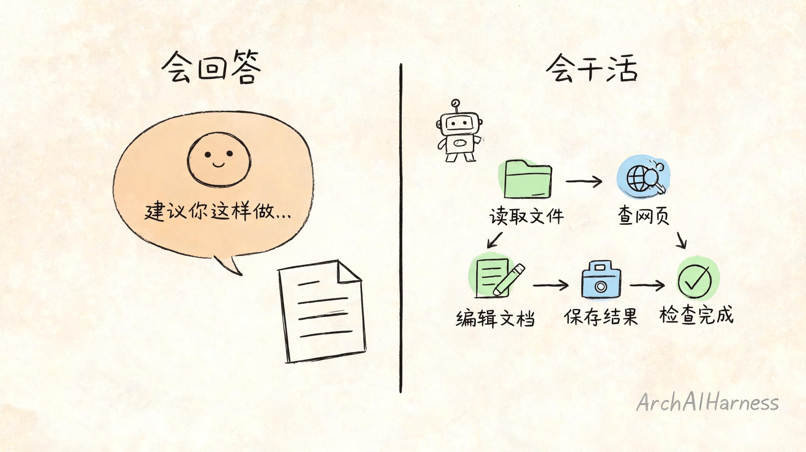
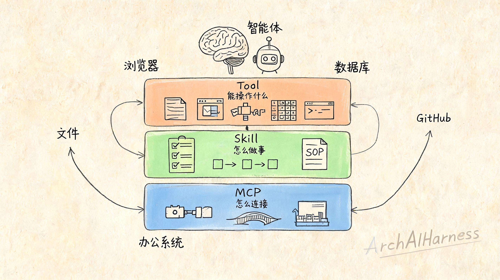
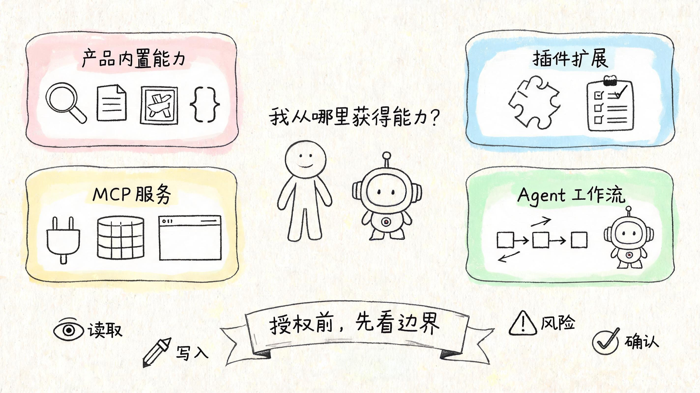
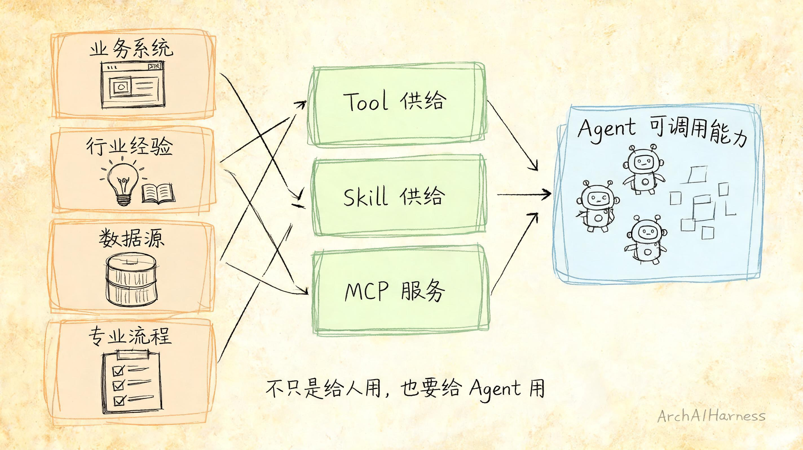
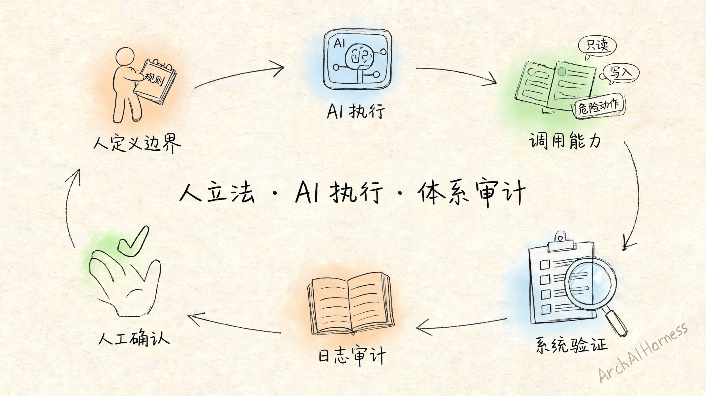

# AI 怎么从“会回答”变成“会干活”？看懂 Tool、Skill 和 MCP

前面几篇文章，我们一直在拆一个问题：AI 到底是怎么工作的。

第一篇讲了模型。它不是在真正“思考”，而是在基于上下文预测下一个最合理的片段。

第二篇讲了 Agent。它不是更会聊天的 AI，而是围绕目标、工具、反馈和验证组成的执行系统。

第三篇讲了上下文。AI 每次回答时，只能看见当下那张有限的纸。模型决定上限，上下文决定下限。

讲到这里，一个新问题就自然冒出来了。

如果 AI 只是看着上下文生成回答，那它到底怎么真的去做事？

比如：

- 帮你读一个文件。
- 查一个网页。
- 整理一份资料。
- 修改一段代码。
- 调用一个业务系统。
- 创建一篇草稿。
- 跑一次测试。
- 把结果保存到某个地方。

这些动作，显然不是模型凭空“想”出来的。

模型本身只是会理解、会生成。它不能天然访问你的电脑、浏览器、数据库、代码仓库、办公系统，也不能天然替你点击、保存、发布或调用接口。

要让 AI 从“会回答”变成“会干活”，必须给它接上外部能力。

这篇文章，我们就讲三个你以后会越来越常见的词：**Tool、Skill 和 MCP**。

不用怕它们听起来像技术名词。先用一句话理解：

> Tool 决定 AI 能操作什么；Skill 决定 AI 按什么方法做事；MCP 决定 AI 怎么标准化连接更多外部能力。

理解了这三个词，你就能看懂很多 AI 产品为什么突然“能干活”了，也能看懂未来很多行业机会会从哪里冒出来。

## 一、AI 会回答，不等于 AI 会干活

很多人刚开始用 AI 时，会有一个很自然的期待：

既然它这么聪明，那我让它“帮我整理一下电脑里的文件”、“查一下系统里的数据”、“把这段内容发出去”，它应该都能做吧？

答案是：不一定。

因为“会回答”和“会操作”是两回事。

一个普通大模型，你问它：

> 帮我整理一下这个项目的文档。

它可能会回答你：

> 你可以先梳理目录结构，再补充 README，再统一命名规范。

这个回答可能很有道理，但它仍然只是建议。

它没有真的打开你的项目目录，没有读取文件，没有修改 README，也没有检查最后结果。

要让它真的做这些事，系统必须给它额外的能力：读文件的能力、写文件的能力、搜索内容的能力、运行命令的能力、保存结果的能力。

这些能力不是模型自己长出来的，而是外部系统提供给它的。

所以判断一个 AI 能不能“干活”，不要只看模型有多聪明，还要看它背后接了什么能力。

没有外部能力，AI 再聪明，也只能停留在“告诉你怎么做”。

接上外部能力之后，它才可能进入“我帮你做一部分”。

## 二、Tool：AI 的手

先讲 Tool。

Tool，直译就是工具。

你可以把它理解成 AI 的“手”。

模型负责理解你的目标，Tool 负责把某些动作真正做出来。

比如：

- 搜索网页。
- 读取文件。
- 修改文件。
- 查询数据库。
- 调用接口。
- 执行命令。
- 生成图片。
- 打开浏览器。
- 创建日程。
- 发送消息。

这些都可以是 Tool。

如果没有 Tool，你问 AI：“这个网页最新内容是什么？”它只能基于已有知识猜，或者告诉你自己去查。

如果有了网页搜索 Tool，它就可以真的去查。

如果没有文件读取 Tool，你让 AI 总结本地文档，它根本看不到那个文档。

如果有了文件读取 Tool，它才能先读到内容，再基于内容生成总结。

所以 Tool 解决的是一个很朴素的问题：

> AI 到底能碰到外部世界里的什么东西？

但工具不是越多越好。

工具越多，AI 能做的事越多，风险也越多。

一个只能读取文件的工具，风险相对低一些。它最多看见信息。

一个可以修改文件的工具，风险就高一些。它会改变结果。

一个可以删除文件、发布文章、发送邮件、执行付款、调用生产系统的工具，就必须非常谨慎。

因为它一旦用错，就不是“回答错了”那么简单，而是真的做错了事。

所以你以后看到任何 AI 工具能力，都要先问一句：

> 这个工具能读什么？能写什么？会不会触发真实动作？

这比“它看起来很智能”重要得多。

## 三、Skill：AI 的做事方法

有了 Tool，AI 就有了手。

但只有手还不够。

一个人会用剪刀，不代表他会做衣服；会打开 Excel，不代表他会做财务分析；会搜索网页，不代表他会写一篇好文章。

AI 也是一样。

Tool 解决的是“能不能做”。

Skill 解决的是“知不知道怎么做”。

Skill 可以理解成一套可复用的任务方法。它里面通常包含：

- 什么时候该做什么；
- 先看哪些资料；
- 按什么步骤推进；
- 遇到异常怎么处理；
- 输出应该是什么格式；
- 做完之后怎么检查。

比如，同样是“写一篇知乎文章”。

Tool 能帮 AI 读取资料、搜索信息、生成文件。

但 Skill 会告诉它：

- 先明确选题。
- 再判断目标读者。
- 然后设计文章结构。
- 写作时避免夸大表达。
- 发布前检查敏感信息。
- 最后适配知乎的标题、摘要和标签。

这就不是一个单独工具能解决的事。

它更像是把一个人的经验、流程和判断标准，沉淀成 AI 可以反复使用的工作方法。

所以 Skill 的价值很大。

它不是“插件”的另一个名字，也不是简单的一段提示词。

更准确地说，Skill 是把某类任务的专家经验变成 AI 可执行流程。

代码审查可以有 Skill。

日报生成可以有 Skill。

会议纪要可以有 Skill。

接口验收可以有 Skill。

资料整理可以有 Skill。

Bug 排查也可以有 Skill。

对普通用户来说，Skill 就像你给 AI 装了一本“做某类事情的说明书”。

对行业从业者来说，Skill 更像一种新的知识产品：你不只是把经验写成文档，而是把经验写成 AI 能执行、能复用、能检查的流程。

## 四、MCP：AI 连接外部能力的标准插座

Tool 和 Skill 多起来以后，又会出现一个问题。

每个 AI 产品都想接工具。

每个工具也都想接 AI。

如果每个工具都要为每个平台单独适配一遍，整个生态会非常混乱。

就像每个电器都用不同插头，每个房间都用不同插座。能用，但成本很高。

MCP 的价值，就是尽量让 AI 连接外部工具和数据源的方式变得标准一些。

你可以先把 MCP 理解成一种“标准插座”。

它让 Agent 可以用相对统一的方式连接外部能力，比如：

- 本地文件。
- 浏览器。
- GitHub。
- 数据库。
- 企业知识库。
- 办公系统。
- 业务平台。
- 开发工具。

当然，MCP 本身不是魔法。

它不是说只要接了 MCP，AI 就自动可靠、安全、聪明。

MCP 主要解决的是“怎么连接”的问题。

但连接之后怎么用，仍然要看：

- 工具设计得好不好；
- 权限边界清不清楚；
- 返回结果 AI 能不能看懂；
- 危险动作有没有确认；
- 出错之后能不能追踪；
- 整个过程有没有审计。

所以不要神化 MCP。

它很重要，但它只是外部能力体系的一部分。

真正可靠的 Agent，不是因为接了很多 MCP 服务，而是因为它接入能力之后，仍然有清楚的目标、边界、验证和审计。

## 五、普通人从哪里获得这些能力？

讲到这里，普通用户可能会问：

这些 Tool、Skill、MCP，我到底从哪里获得？

这篇文章不做具体安装教程。因为不同产品入口不同，今天教你点哪个按钮，过几个月可能就变了。

更重要的是，你要知道以后在哪里会遇到它们。

第一类，是 AI 产品内置能力。

比如联网搜索、文件分析、图片生成、语音转写、代码执行、数据分析。这些通常已经藏在产品里，你只需要在界面里开启或选择。

第二类，是插件、扩展或 Skills。

有些平台会提供写作、总结、编程、翻译、绘图、办公、代码审查这类能力包。它们的本质，往往就是把工具和流程打包好，让你不用从零设计。

第三类，是 MCP 服务。

如果你使用的是更偏工程化的 Agent 工具，可能会看到各种 MCP 服务。它们负责把浏览器、本地文件、代码仓库、数据库、知识库、办公系统接进来。

第四类，是别人封装好的 Agent 或工作流。

普通用户不一定要自己开发工具，也不一定要自己写 Skill。你可以先使用别人已经封装好的能力，再慢慢学会判断它是否可靠。

但无论从哪里获得能力，都要记住一个原则：

> 授权之前，先看边界。

不要只看它说自己能做什么，还要看它会碰什么。

你可以用四个问题快速判断：

1. 它能读什么？
2. 它能写什么？
3. 它能不能删除、发布、付款或调用真实业务？
4. 它执行危险动作前，会不会让我确认？

如果一个 AI 能访问很多东西，却没有权限说明、没有确认步骤、没有日志记录，那就要谨慎。

真正会用 AI 的人，不是看到能力就全部打开，而是知道什么时候该打开，什么时候该拒绝。

## 六、从业者的机会：把业务能力变成 AI 能调用的能力

普通用户关心的是怎么安全使用这些能力。

行业从业者更应该关心另一个问题：

> 我能不能把自己的业务能力，变成 AI 可以调用的能力？

未来很多系统，不只是给人用，也要给 Agent 用。

过去我们做软件，主要考虑的是人怎么点按钮、怎么看页面、怎么提交表单。

但 Agent 进来之后，还要考虑另一件事：

> AI 能不能理解这个能力？能不能安全调用它？调用之后能不能拿到清楚结果？

这会带来三类新的供给机会。

第一类，是 Tool 供给。

你可以把系统里的查询、计算、创建、修改、审批、检索等能力，封装成 Agent 可以调用的工具。

但这不是简单暴露一个接口。

你要定义清楚：

- 这个工具叫什么；
- 它解决什么问题；
- 参数应该怎么填；
- 返回结果是什么结构；
- 哪些动作只读，哪些动作会写入；
- 什么情况下必须人工确认。

第二类，是 Skill 供给。

很多行业真正有价值的东西，不在某个接口里，而在流程和判断里。

比如：

- 医疗不是简单查资料，而是有问诊、排除、风险提示和转诊边界；
- 法律不是简单搜法条，而是事实梳理、适用判断和风险说明；
- 软件开发不是简单改代码，而是需求澄清、分层设计、测试验证和代码审查；
- 企业管理不是简单生成表格，而是任务拆解、责任确认、进度追踪和复盘。

这些都更接近 Skill。

如果你能把行业经验、专家流程、操作 SOP、验收标准沉淀成 AI 可执行的 Skill，你提供的就不只是内容，而是一套可以被复用的工作方法。

这也是我在 [agent-workflows](https://github.com/ArchAIHarness/agent-workflows) 里持续沉淀 Skills 和 Agents 的原因：不是把 AI 当成一次性聊天窗口，而是把可复用的任务方法、角色分工和验收规则，封装成可以被反复加载的能力。

第三类，是 MCP 服务供给。

企业系统、数据源、知识库、开发工具、办公平台，都可以通过标准方式接入 Agent 生态。

这意味着，未来一个系统的价值，不只看它有没有漂亮界面，也要看它能不能成为 Agent 的可靠能力来源。

谁能把专业能力封装成 AI 可调用、可复用、可审计的能力，谁就更容易进入新的协作网络。

这可能是很多行业从业者真正应该关注的机会。

## 七、能力越强，越需要边界和审计

AI 有了 Tool、Skill、MCP，确实会更强。

但也更需要边界。

因为它不再只是说话，而是开始行动。

能读文件，就可能读到不该读的内容。

能写文件，就可能改错东西。

能调用接口，就可能触发真实业务动作。

能发布内容，就可能把草稿直接发出去。

能连接系统，就可能把一个小错误放大成真实事故。

所以，一个可靠的 Agent，不能只追求“能做更多”。

它还必须具备：

- 权限分级；
- 操作确认；
- 日志留痕；
- 结果验证；
- 错误回滚；
- 人工接管；
- 上下文审计。

这也是为什么我一直强调：

> 人定义目标和边界，AI 在边界内执行，系统负责验证和审计。

如果没有边界，AI 的能力越强，风险越大。

如果有了边界，AI 的能力才会真正变成生产力。

Tool、Skill、MCP 都不是为了让 AI “想干什么就干什么”。

它们真正的价值，是让 AI 在明确授权、明确流程、明确审计的前提下，把任务推进到一个可验证的结果。

## 八、写在最后：提示词不是咒语，而是任务契约

现在我们可以把前几篇连起来看。

模型决定 AI 能不能生成合理回答。

上下文决定 AI 这一次看见什么。

Tool 决定 AI 能操作什么。

Skill 决定 AI 按什么方法做事。

MCP 决定 AI 怎么连接更多外部能力。

那么下一个问题才是：

当 AI 已经有了这些能力，人应该怎样把目标、边界、输入、输出和验收标准交给它？

这才是提示词真正的位置。

提示词不是咒语，也不是万能模板。

它更像一份任务契约：你要告诉 AI 目标是什么，哪些资料可以用，哪些工具可以碰，结果要长什么样，什么动作必须先确认，做到什么程度才算完成。

理解了 Tool、Skill 和 MCP，再回头看提示词，你会发现很多所谓“提示词技巧”，其实都只是一个更大系统里的小切片。

真正重要的不是把一句话写得多漂亮，而是让 AI 在正确上下文、正确工具、正确流程和正确边界里做事。

这也是 AI 从“会回答”变成“会干活”的关键。

下一篇，我们就接着讲提示词。

不是讲咒语，也不是讲套路，而是讲：当你面对一个有工具、有流程、有边界的 Agent 时，应该怎样把任务交给它。

---

### 关于 ArchAIHarness

这篇文章是「看懂 AI 与智能体」专栏的一部分，由 [**ArchAIHarness**](https://github.com/ArchAIHarness) 持续输出。

ArchAIHarness 是一套面向 AI 时代软件工程的人机协同架构哲学与公开工程资产，主张：

> **架构师定义秩序，AI 在秩序中生长。人立法，AI 执行，体系审计。**

如果你也希望 AI 在明确的架构边界内协作，而不是在混沌中碰运气，欢迎到 GitHub 上看看我们在做什么：

- **组织主页**：[github.com/ArchAIHarness](https://github.com/ArchAIHarness) — 了解完整理念与资产全景
- **本专栏**：[`zhuanlan-ai-and-agents`](https://github.com/ArchAIHarness/zhuanlan-ai-and-agents) — 所有文章的源码与发布记录
- **实践指南**：[`docs`](https://github.com/ArchAIHarness/docs) — 架构哲学、工程方法和落地指南
- **开源工具**：[`agent-workflows`](https://github.com/ArchAIHarness/agent-workflows) — 可复用的 AI 协作 Agents、Skills 与 Tools
- **工程样例**：[`framework`](https://github.com/ArchAIHarness/framework) — DDD + AI 协作的工程底座，展示如何在开发中融合 AI

> Engineered by Architects · Empowered by AI · Audited by Discipline
