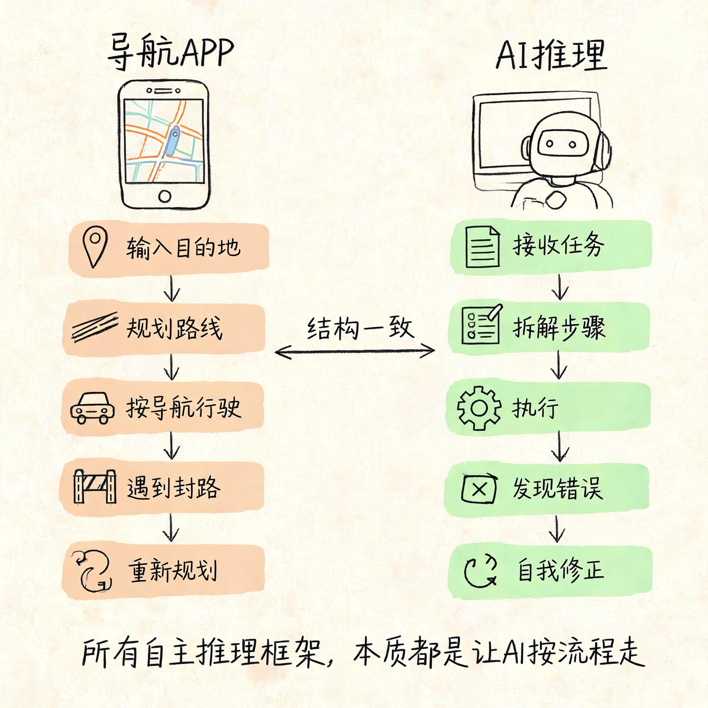

# AI 能记住了，但能自己干活吗？——看懂执行系统，你就知道它怎么完成复杂任务

你给 AI 一个任务："帮我分析一下这个项目的风险。"

十秒后，它打了一行字："我先查一下项目背景。"然后你看到它调了搜索，找到了 README 和架构文档，读完才开始回答。输出之前还补了一句：信息来源是这些。

整个过程半分钟不到。你感觉这个 AI 很靠谱——它没有直接给答案，而是先确认自己有没有足够的信息。

你再给它一个任务："把这段代码从 Vue 2 升级到 Vue 3。"

这次更复杂。你看到它先读了一遍当前代码，列了一份改动清单，然后逐个文件修改。改完一个跑一遍测试，测试过了才改下一个。中间有一个文件改完后测试没过，它停下来分析了错误信息，调整了方案，重改了一遍才过。最后还列了一份变更记录，告诉你哪些地方改了、为什么改、还有哪些风险点需要你确认。

整个过程中你没有插手一次。

你可能觉得这个 AI "太聪明了"。但仔细想想：它做的不就是把一个复杂任务拆成小步骤，按顺序执行，遇到问题做调整，搞不定的告诉你——这不就是一个人做事的流程吗？

AI 能做复杂任务，不是因为模型突破了什么极限，而是因为有人给它设计了一套"做事的方法"。这个方法有一个专门的名字：**ReAct 循环**（Reasoning + Acting，推理 + 行动）。

这篇文章就讲一件事：这套"做事的方法"到底是怎么运作的，以及你理解了它之后，能获得什么启发。

## 一、它没在想，是在跑循环

AI 收到"帮我分析项目风险"之后，不是靠灵光一闪出答案的。

它内部先走了一圈：看看自己知道什么、还缺什么信息，决定先干一件事（比如查个文件），然后看结果，再决定下一步。一圈不够跑两圈，两圈不够跑三圈。

这个过程，用术语说就是 ReAct 循环——推理（Reasoning）和行动（Acting）交替进行。

每一轮循环包含四个步骤：

**感知**：AI 看当前上下文里有什么——你的指令、之前查到的资料、刚刚跑出来的结果。它只能看到放在它"桌面"上的东西。

**推理**：结合当前信息判断该做什么——是继续收集信息，还是可以做决定了，还是需要问你。这一步不是玄学，是模型根据上下文做的概率预测。

**行动**：执行一个具体操作——查文件、写代码、跑命令、或者直接输出一段文字。每一步行动都有明确的结果。

**观察**：看行动的结果——代码有没有报错、命令有没有跑通、查到的资料够不够。观察的结果进入下一轮推理，形成闭环。

这个循环不断重复，直到满足两个条件之一：任务完成了，或者遇到搞不定的情况需要问你。

从外面看，你只看到 AI "想了想然后开始干活"。从里面看，是在跑一个又一个循环，每次循环都以前一轮的结果为起点。

## 二、复杂任务不是一次搞定的，是一步步拆开的

单轮循环只能做一件简单的事。真正的复杂任务——比如"把代码从 Vue 2 升到 Vue 3"——需要很多轮循环才能完成。

关键在第一步：**任务拆解**。

AI 接到"升级 Vue"这类复杂任务时，不会直接动手改代码。它会先生成一个计划。这个计划通常是一个步骤清单：先评估当前代码结构，然后逐个迁移组件，最后做兼容性检查。

有了计划之后，AI 才按步骤执行。每一步可能又包含多轮 ReAct 循环——改一个文件可能需要：读代码→理解逻辑→修改→跑测试→看结果→如果没过就分析错误→再改→再跑。

这样一层一层拆下去，一个大任务就变成了一棵由小任务组成的树。每一片叶子都是一轮可以执行的 ReAct 循环。

拆解质量直接决定了执行质量。一个好的拆解会让每一步都清晰可执行；一个粗糙的拆解会导致 AI 在中间迷失方向，不知道该做什么，或者做了一堆无关紧要的事。

这里有一个重要的启发：**不是所有任务都需要复杂拆解。** 简单任务应该走简单路径。AI 的一个关键能力，是判断当前任务的复杂度，选择匹配的拆解深度。给一个简单问题做过度拆解，反而浪费时间。这个判断能力需要你在系统设计时提供——通过设定规则，告诉它在什么情况下应该详细规划，什么情况下可以直接做。

## 三、它需要工具才能"干活"

说完循环和拆解，再来看看"行动"这一步里到底发生了什么。

一个只会生成文字的 AI，做不了复杂任务。它需要工具才能干实事——查文件、写代码、跑命令、读数据库。

每一次"行动"就是调一个工具。AI 决定调什么工具、传什么参数，系统拿到结果后交给 AI 观察，然后进入下一轮推理。

这里有一个很微妙但很重要的设计：**AI 用什么工具、怎么用，不是随心所欲的**。

首先，工具清单是提前注册好的。AI 只知道你给它列出来的那些工具。你给它注册了"查文件"，它就能查文件。你没给它注册"写数据库"，它就写不了——哪怕它的训练数据里知道数据库怎么用也是白搭。

其次，每个工具的参数是固定的。AI 不能自己发明参数——它只能在你定义的接口范围内调用。比如"查文件"这个工具，参数是"文件路径 + 行号范围"，AI 不能传"帮我查一下那个重要的文件"——参数不合法，工具不执行。

这听起来像约束，实际上是解放。因为参数固定，AI 不需要猜测该怎么用工具；因为清单透明，系统可以精确审核 AI 每一步操作是否合规。

对使用 AI 的人来说，这意味着你可以放心给它工具——不是因为它天生可靠，而是因为你可以精确控制它能干什么、不能干什么。给读文件的权限不给写文件的权限，它就只读不改。切到"只看不碰"的模式，它就真的只看不碰。

## 四、出错不可怕，可怕的是不会停

循环再完整、拆解再精细、工具再齐全，AI 还是会犯错。

文件查不到、代码编译不过、测试不通过、参数传递错误——这些都是 Agent 执行过程中的常态。

关键不是 AI 会不会出错，而是出错了之后怎么办。

好的执行系统在错误发生时做这三件事：

**第一，有限重试。** 出错了先试一次。可能是网络抖动导致超时，可能是状态还没就绪。但重试必须有上限——连续失败几次就停下来。停下来不是认输，是为了不浪费更多时间和 Token 在一个注定走不通的路上。

**第二，调整方案。** 一条路走不通，换一条路走。比如文件找不到，可能是路径错了，可以换个方式定位。方案调整是 ReAct 循环的精华——你不是在走一条死记硬背的路线，而是在执行中持续校正方向。

**第三，问人。** 如果试了两条路都走不通，或者进入了一个完全没见过的状态——停下来问你。一个好的 Agent 敢于承认"我搞不定"，而不是瞎编一个答案混过去。

这三件事做得好不好，是区分靠谱 Agent 和玩具 Agent 的分界线。

这里有一个值得记住的启发：**如果你在让 AI 做一件高风险的决策——改生产代码、操作数据库、发正式消息——开始之前告诉它"拿不准就问我"。** 这句话写在规则里，AI 会在每一步不确定的时候停下来问你，而不是自作主张。

## 五、如果你自己搭 Agent，先想清楚这几件事

前面讲的都是 Agent 执行系统的基本机制。但如果你真的要去搭一个，有几个设计决策必须在写第一行代码之前想清楚。

### 循环不能无限跑

ReAct 循环每跑一轮，就消耗一轮的 Token 和时间。没有上限的话，一个简单的任务可能跑到你回来发现它还在跑。

你需要定两个参数：

**最大循环次数。** 一个代码审查 10-20 轮够了，一个多文件重构可能需要 50 轮以上。根据任务复杂度设一个上限，到了就停——不是失败，是告诉你"我尽力了，还需要更多指令"。

**终止条件。** Agent 怎么判断自己做完了？三个常见模式：任务目标明确达成（比如测试全部通过）、没有更多有用的操作可以做了（比如所有文件都改完了）、或者用户说了停。三种条件都满足才停，防止做到一半自己收工。

### 工具设计的单一职责原则

工具是 Agent 执行任务的手脚，工具设计直接决定了 AI 能不能用对它们。

最重要的原则是：**一个工具只做一件事。** "读文件"和"写文件"分开，而不是一个"文件操作"工具带两个参数。前者让 AI 清晰知道该调哪个，后者让 AI 在调用时可能选错模式。

参数的边界也要清楚。路径就用字符串，不要用"帮我找一下那个文件"这种自然语言参数——AI 不会猜你要的是哪个文件，但它会试着传各种东西，然后期待你帮它兜底。

返回值尽量结构化。JSON 比纯文本好，纯文本比二进制好。结构化返回值让 AI 能直接读到关键信息，不需要再花一轮推理去解析。工具出错时，错误信息要告诉 AI 为什么失败、能不能重试——这样它才能决定下一步是重试还是换方案。

### Token 预算是硬约束

每轮 ReAct 循环都在消耗上下文。查文件占 Token，返回结果占 Token，AI 的推理过程也占 Token。跑着跑着，桌面就满了。

这意味着两件事：第一，拆解不能太细。每一步都拆成最小单位，看起来精确，但每多一轮循环就多消耗一轮的 Token。第二，你得有一个上下文管理策略——不能在每轮循环中把所有的历史都原样保留。这就是第 7 篇讲的三层记忆体系要解决的问题：工作记忆只放当前循环需要的东西，短期记忆保留会话内的上下文，长期记忆跨越会话。

你不需要从零实现这些——成熟的 Agent 框架都有内置的上下文管理。但你需要理解它的存在，否则当你的 Agent 跑了 30 轮之后开始"失忆"，你会以为是模型的问题。

### 错误处理的三级策略

Agent 执行过程中，错误是常态。设计阶段就要明确三级策略：

**第一级：重试。** 临时性错误——网络超时、服务未就绪、速率限制——重试 2-3 次。为什么是 3 次？一次可能是运气不好，两次也可能是巧合，三次大概率真有别的问题。

**第二级：换方案。** 永久性错误——文件不存在、参数不合法、权限不足——不重试，直接换方案。比如文件路径不对，换个方式找；API 调不通，换个接口。换方案是 ReAct 循环的精华，说明 AI 不是在机械执行，而是在动态调整。

**第三级：问人。** 如果所有方案都试过了还是不行，或者进入了一个完全没见过的状态——停下来问用户。问人的时候，给上下文、给选项、让用户选。不要让用户猜你的状态。

## 六、OpenCode 是怎么落地这些设计的

前面讲的这些设计决策，OpenCode 全都有对应的实现。拿它当参考系，你可以看到这些概念在真实产品里怎么落地。

**指令层 = AGENTS.md。** 你在 AGENTS.md 里写的每一行规则，都是 AI 执行循环的一部分。写"先确认资料够不够，不够先查"，AI 就会在拆解任务时先做这一步。改一行文本，行为就变了——不需要修改代码，不需要重新部署。这就是"指令即架构"的落地。

**工具系统 = 注册制。** OpenCode 的工具在 opencode.json 里注册。每个工具有明确的名称、参数、返回值。加一个工具，AI 就多一种执行能力；删一个工具，AI 就不能再调它。工具的注册清单就是 AI 的能力边界，这是你控制 Agent 最直接的入口。

**权限分层 = Plan/Build 模式。** 切到 Plan 模式，AI 只能看不能碰——能做方案、分析代码，但不能改任何一个文件。切回 Build 模式，AI 才能执行写操作。同一个模型、同一套工具，换一个权限配置，行为完全不一样。这就是前面讲的"事件与决策分离"——AI 决定做什么，系统决定能不能做。

**上下文管理 = 自动的。** OpenCode 自动管理上下文窗口。每轮调模型之前检查用了多少空间，接近 80% 就开始整理：最新内容完整保留，旧的内容压缩成摘要。整个过程后台自动完成，你在操作中完全感觉不到。从业者不需要重新实现这套机制，但需要理解它的存在——它决定了你的 Agent 能在一次会话里跑多远。

**错误处理 = 3 次上限 + 问人。** 工具调用连续失败 3 次，系统就停下来问用户："要不要换个方式？" 这就是前面讲的三级策略的具体实现：有限重试 + 人工接管。

## 七、写在最后

回到开头。AI 能做复杂任务，不是因为它"变聪明了"。是因为有人给它设计了一套做事的方法：接到任务先拆解，拆完了按步骤跑循环，每一步拿工具干实事，出错了调整，搞不定了问人。

这套方法不是灵丹妙药，但把"不确定性"控制在了可管理的范围内。你不需要预测 AI 会怎么走每一步，你只需要确保它的运作框架是对的。

这也是"看懂 AI"的最终目的：不是学会怎么跟 AI 聊天，而是知道什么场景可以放心交给它、什么场景需要你盯一下、什么场景根本不该让它碰。

下一篇，聊一个很多人都在问的问题：我的资料、文档、知识那么多，AI 怎么才能找到需要的信息？这件事有一个词叫 RAG——但它的核心可能跟你以为的不太一样。

---

### 关于 ArchAIHarness

这篇文章是「看懂 AI 与智能体」专栏的一部分，由 [**ArchAIHarness**](https://github.com/ArchAIHarness) 持续输出。

ArchAIHarness 是一套面向 AI 时代软件工程的人机协同架构哲学与公开工程资产，主张：

> **架构师定义秩序，AI 在秩序中生长。人立法，AI 执行，体系审计。**

如果你也希望 AI 在明确的架构边界内协作，而不是在混沌中碰运气，欢迎到 GitHub 上看看我们在做什么：

- **组织主页**：[github.com/ArchAIHarness](https://github.com/ArchAIHarness) — 了解完整理念与资产全景
- **本专栏**：[`zhuanlan-ai-and-agents`](https://github.com/ArchAIHarness/zhuanlan-ai-and-agents) — 所有文章的源码与发布记录
- **实践指南**：[`docs`](https://github.com/ArchAIHarness/docs) — 架构哲学、工程方法和落地指南
- **开源工具**：[`agent-workflows`](https://github.com/ArchAIHarness/agent-workflows) — 可复用的 AI 协作 Agents、Skills 与 Tools
- **工程样例**：[`framework`](https://github.com/ArchAIHarness/framework) — DDD + AI 协作的工程底座，展示如何在开发中融合 AI

> Engineered by Architects · Empowered by AI · Audited by Discipline
