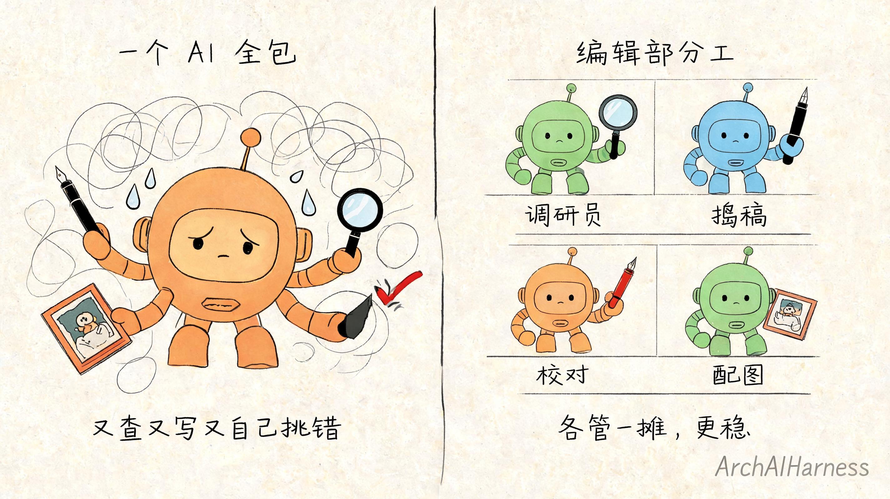
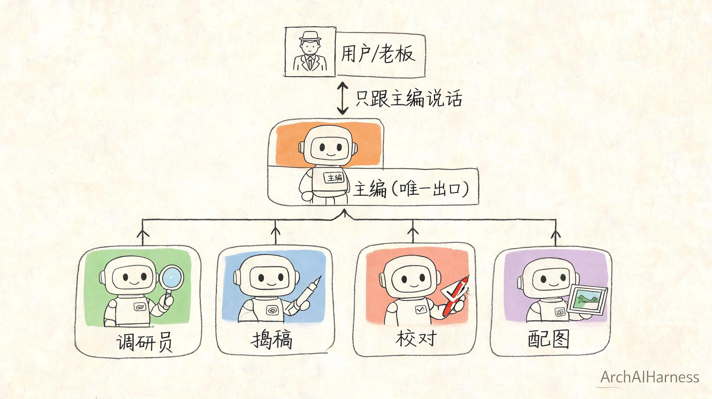
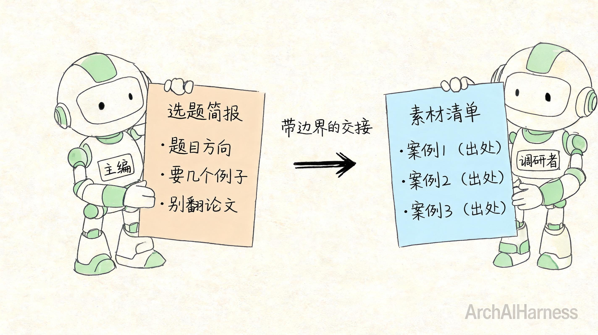
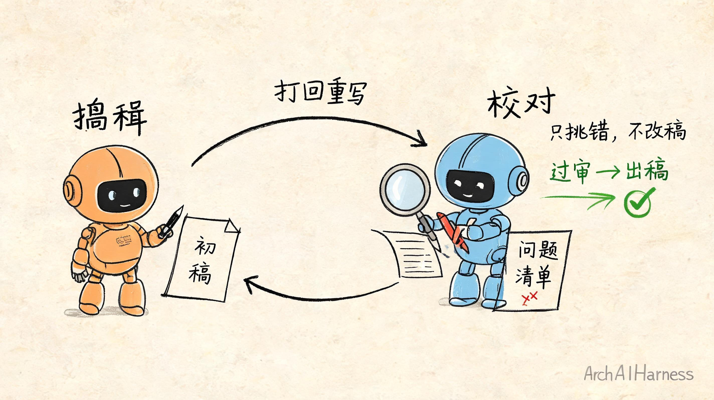
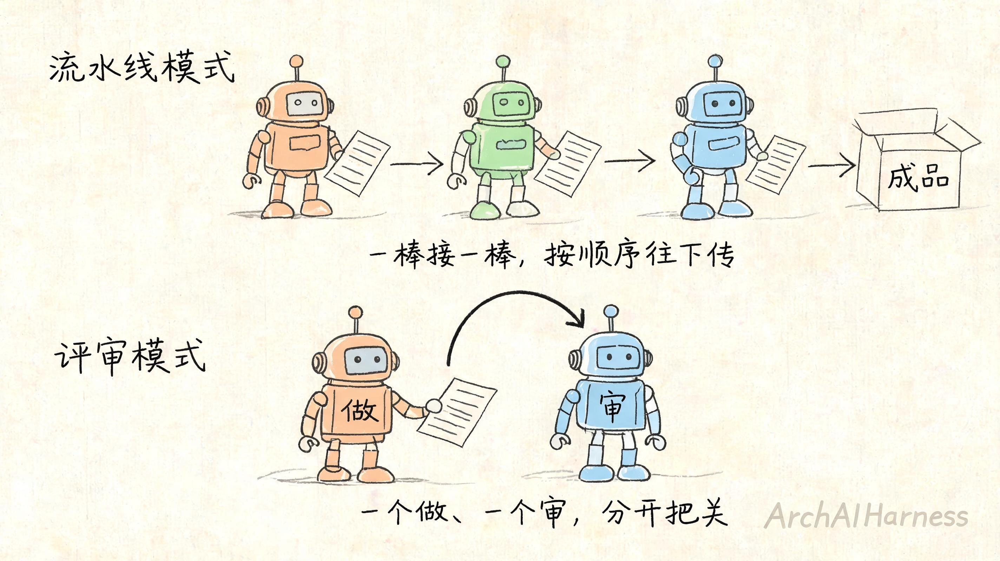

# 多智能体不是堆 AI——跟着一个"AI 编辑部"看协作怎么跑通

你大概也动过这个念头：一个 AI 不够聪明，那我多挂几个，让它们互相讨论、互相补位，是不是就更靠谱了？

网上那些"多智能体"的演示看着也确实唬人——好几个 AI 你一言我一语，自己就把活分了，最后吐出一份完整方案。

但你要真自己上手攒过几个 AI 一起干活，多半会撞上一件扎心的事：**人多了，活不一定更好，反而经常更乱。**

这一篇我想跟你把这事掰扯清楚：多个 AI 凑在一起，根本不叫团队。让一群 AI 真正协作起来、把活干成的，从来不是 AI 的数量，而是有人事先给它们定好的一套秩序——谁拍板、谁干活、活怎么交接、错了谁兜底。

说白了，**多智能体的难点不在 AI，在管理。**

## 一、一个 AI 的天花板

先说说，为什么会想到要"多个 AI"。

不是因为这玩意儿听起来高级，是因为单个 AI 真的有天花板。

你回想下前面几篇讲的：AI 每次只能看见眼前那张"纸"（上下文），纸装满了就往外挤；它做复杂任务靠的是一步步推理加调用工具（ReAct 循环）。这套机制干小活没问题，可一旦任务又大又杂，麻烦就来了。

比如让一个 AI"写一篇有数据、有案例、还得配图的深度稿子"。它得自己查资料、自己消化、自己写、自己挑错、自己配图——**所有角色一肩挑。**

结果往往是：查资料查到一半，那张纸塞满了，前面消化的东西开始往外挤；好不容易写完，让它自己检查，它对着自己写的东西怎么看怎么顺眼，根本挑不出毛病。

这不是它不努力，是**一个人又当运动员又当裁判，本来就不靠谱。**

所以很自然地，你会想——能不能把这些活拆开，交给不同的 AI 去干？

这个念头是对的。但接下来这一步，绝大多数人都走歪了。

## 二、加 AI 不等于加产能

走歪的那一步是这样的：既然一个 AI 忙不过来，那我开三个、开五个，一起上，不就快了？

我跟你说，**大概率更慢、更乱。**

你想象一个画面：三个 AI 拉进一个群，你说"写篇稿子"。

- A 开始查资料，B 也开始查资料，俩人查的还不是一回事；
- C 等不及，直接开写，方向跟 A、B 查的对不上；
- 你想问进度，三个 AI 同时回你，七嘴八舌，你都不知道该信谁；
- 最后出来三份半成品，没一份能用，还得你自己缝。

这不是科幻，这是绝大多数人第一次玩多智能体的真实翻车现场。

问题出在哪？**不是 AI 不够强，是没人定规矩。**

你把三个能力很强的人塞进一间屋子，不告诉他们谁负责什么、活怎么交接、谁说了算——你猜会怎样？一样乱。

所以多智能体真正的命门，从一开始就不是"AI 够不够多、够不够聪明"，而是**有没有一套让它们能协作的秩序。**

接下来我用一个具体例子，带你看这套秩序长什么样、怎么一步步落到活上。

## 三、先认识这个"AI 编辑部"

我们虚构一个场景：把这群 AI 组织成一个小小的**编辑部**，任务是"产出一篇靠谱的稿子"。

编辑部里有这么几个角色：

- **主编**：不亲自写稿，负责定选题、把活拆开、派给合适的人，最后拍板；
- **调研员**：按主编给的方向查资料、整理素材；
- **撰稿**：拿调研的素材，写出初稿；
- **校对**：核查事实、挑逻辑漏洞——注意，**他只挑错，不替你改稿**；
- **配图**：等稿子定了，按内容配图。

你一看就明白：这就是个正常编辑部该有的样子。但请你盯住两个最容易被忽略、却最关键的设计。

**第一，主编是唯一的出口。**

你作为"老板"，只跟主编一个人对话。你不会被五个 AI 同时轰炸，所有的协调、分派、汇总，都收口在主编这里。

这点特别重要。多智能体玩砸的，十个有九个是栽在"多头输出"——每个 AI 都想跟你说话、都想拍板，最后没人对结果负总责。**好的协作，对外永远是一个声音。**

**第二，每个角色只干一摊，分工是写死的。**

调研员不写稿，撰稿不查原始资料，校对不动手改。谁干什么，事先就定死，不靠临场抢活。

为什么要这么死板？因为**职责一含糊，就没人负责。** 你让撰稿"顺便也查查资料、顺便也校对一下"，听着灵活，实际是把第一节那个"一肩挑"的毛病又请回来了。

这就是秩序的第一层：**先把"谁拍板、谁干活"切干净。**

## 四、活是怎么交接的

角色定好了，接下来是最容易出事的一环：**交接。**

主编要把"查资料"这活派给调研员。他怎么派？

不是甩一句"去查查 AI 协作的资料"就完事。这么派，调研员能给你拉回来一火车你根本用不上的东西。

主编派的是一份**写清楚边界的简报**：

- 要查什么：多智能体协作的常见模式；
- 不要什么：不用管底层算法，不用翻论文；
- 查到什么程度：找到 3 个有代表性的案例就够，别无限发散；
- 交回什么：一份素材清单，每条注明出处。

你看出门道了吗？**交接靠的不是"让 AI 自由发挥"，是靠一份带边界的交接物。**

调研员干完，也不是把一堆原始网页甩给撰稿，而是交回一份**整理好的素材清单**。撰稿接到这份清单才能安心写——他知道边界在哪，不用自己再去判断"这资料该不该信"。

这一环为什么最容易出事？因为它最不起眼。

普通人组 AI 团队，往往特别在意"找个最强的 AI 来写稿"，却根本没想过"活是怎么从一个 AI 传到下一个 AI 的"。

结果就是：调研员查的，撰稿用不上；撰稿写的，跟主编要的不是一回事。**每一次交接没说清楚，误差就累积一次，传到最后全跑偏。**

一句话：**交接单写不清，团队就散。** 这跟带真人团队，是一模一样的道理。

## 五、谁来兜底

稿子写出来了，能直接交吗？

不能。**总得有人兜底。**

这就是校对的活。撰稿出了初稿，交给校对，校对干两件事：核查事实对不对，挑逻辑有没有漏洞。

这里有个设计，我要请你特别留意——**校对只挑错，不动手改稿。**

为什么不让校对直接改？他都看出错了，顺手改了不更快？

不行。这恰恰是整个秩序里最值钱的一条：**写的人和审的人，不能是同一个。**

你想想第一节那个毛病——AI 检查自己写的东西，怎么看怎么顺眼。一旦校对又审又改，他改完的稿子谁来审？又掉回"自己当自己裁判"的死循环了。

所以校对的输出不是"改好的稿子"，而是**一份问题清单**：哪里事实存疑、哪里逻辑断了、问题有多严重。然后**打回给撰稿重写。**

撰稿改完，再过一遍校对。没过，再打回。这就是**失败回滚**——出了问题不硬着头皮往下走，而是退回上一步重来。

这一来一回，看着慢，其实是整个团队质量的命根子。**生产和质检分开，错误才有人拦得住。** 少了这道，AI 团队就是辆一路狂奔、没有刹车的车。

## 六、最后那一下，必须是人按的

校对过了，配图也配好了，稿子齐活了。

现在，发出去吗？

**这一下，必须是你——一个真人——来按。**

不是因为 AI 干得不好，是因为"发布"这个动作**不可逆**。发出去就收不回来了。这种一旦做错代价很大、又没法撤销的关口，绝不能让 AI 自己拍板。

这在工程上有个说法，叫**人工接管点**：AI 团队平时可以自主地跑，调研、撰稿、校对、配图，一条龙不用你管；但一碰到高风险、不可逆的动作，必须停下来，等人确认。

这才是"人和 AI 协作"最该有的样子——**不是你事事盯着它（那还不如自己干），也不是甩手全交给它（那迟早出大事），而是日常放手让它跑，关键路口你来把关。**

讲到这儿，这一整套东西的内核就浮出来了：

> 人定规矩、定边界、守住关键决策；AI 在规矩里自主执行；整个过程可追溯、有人审。

**人立法，AI 执行，体系审计。** 一个 AI 是这样，一群 AI 更是这样——人越多、活越杂，这套秩序就越不能少。

## 七、两种最常用的队形

把前面拆开的环节理一理，你会发现它们其实归成了两种最常用的"队形"。搞懂这两种，你就能照着搭自己的 AI 团队了。

**第一种，流水线模式。**

选题 → 调研 → 撰稿 → 校对 → 配图，活像工厂的流水线，一道工序传给下一道，每个角色只管自己这一段。

它适合**环节清晰、顺序固定**的任务。好处是简单、好排查——哪一环出问题，回头看那一环就行。

**第二种，评审模式。**

一个负责产出，一个负责审，来回打磨直到过关。就是撰稿和校对那一对。

它适合**质量要求高、容不得错**的任务。好处是有人专门兜底，错误出不了门。

真实的 AI 团队，往往这两种混着用：主线是流水线，关键环节嵌一道评审。

## 八、别把重点押在工具上

讲到这儿，得给你一个实在的提醒：**这套东西，你不用从零造轮子。**

"主控 + 多个专员 + 一道评审"这套协作秩序，不是停留在 PPT 上的理论。已经有开源工具原生支持这么干——比如前面第 6 篇带你装的那个 AI 搭子 [OpenCode](https://opencode.ai)，它本身就支持设一个主控 Agent 去调度若干个各管一摊的子 Agent。你要是好奇，完全可以自己跑一遍，亲手验证这套秩序到底怎么落地的。

但我得把话说在前头：**别把重点放在工具上。**

这正是我想跟你掏心窝子说的一件事——别一上来就问"哪个 AI 工具最好"。工具是会换的，今天 OpenCode，明天可能是别的；真正不会过时、能被你带走的，是你脑子里这套秩序：谁拍板、谁干活、活怎么交接、谁兜底、哪一步必须人来。

**想明白了这套，给你什么工具都能搭出一个能干活的 AI 团队；想不明白，给你最强的工具，也是一群 AI 各干各的、谁都不对结果负责，照样出不了活。**

工具是手段，秩序才是本事。这也是 ArchAIHarness 一直在做的事——把"人立法、AI 执行、体系审计"这套协作秩序，沉淀成可复用的工作流（[`agent-workflows`](https://github.com/ArchAIHarness/agent-workflows)）和工程底座（[`framework`](https://github.com/ArchAIHarness/framework)），让 AI 团队的分工、交接和兜底，有章可循，而不是每次都靠运气。

## 九、写在最后

回到开头那个念头：多挂几个 AI、让它们互相讨论，会更聪明吗？

不会。**多个 AI 凑一起，只会放大混乱——除非有一套秩序。**

这套秩序，说穿了不复杂，就是你管一个真实团队会用的那几招：分好工、写清交接、留人兜底、关键的事自己拍板。AI 团队和人组成的团队，在这件事上没有本质区别。

所以多智能体的真问题，从来不是"AI 强不强"，而是"**你会不会管**"。

未来真正会用 AI 的人，不一定是手里 AI 最多、最强的人，而是**能给一群 AI 定好分工、交接和兜底的人。**

下一篇我们聊个更实在的：既然工具是会换的，那到底**怎么判断一个 AI 协作工具值不值得你长期投入**？是看它现在好不好用，还是看别的？这事儿，比挑一个"最强工具"重要得多。

---

### 关于 ArchAIHarness

这篇文章是「看懂 AI 与智能体」专栏的一部分，由 [**ArchAIHarness**](https://github.com/ArchAIHarness) 持续输出。

ArchAIHarness 是一套面向 AI 时代软件工程的人机协同架构哲学与公开工程资产，主张：

> **架构师定义秩序，AI 在秩序中生长。人立法，AI 执行，体系审计。**

如果你也希望 AI 在明确的架构边界内协作，而不是在混沌中碰运气，欢迎到 GitHub 上看看我们在做什么：

- **组织主页**：[github.com/ArchAIHarness](https://github.com/ArchAIHarness) — 了解完整理念与资产全景
- **本专栏**：[`zhuanlan-ai-and-agents`](https://github.com/ArchAIHarness/zhuanlan-ai-and-agents) — 所有文章的源码与发布记录
- **实践指南**：[`docs`](https://github.com/ArchAIHarness/docs) — 架构哲学、工程方法和落地指南
- **开源工具**：[`agent-workflows`](https://github.com/ArchAIHarness/agent-workflows) — 可复用的 AI 协作 Agents、Skills 与 Tools
- **工程样例**：[`framework`](https://github.com/ArchAIHarness/framework) — DDD + AI 协作的工程底座，展示如何在开发中融合 AI

> Engineered by Architects · Empowered by AI · Audited by Discipline
