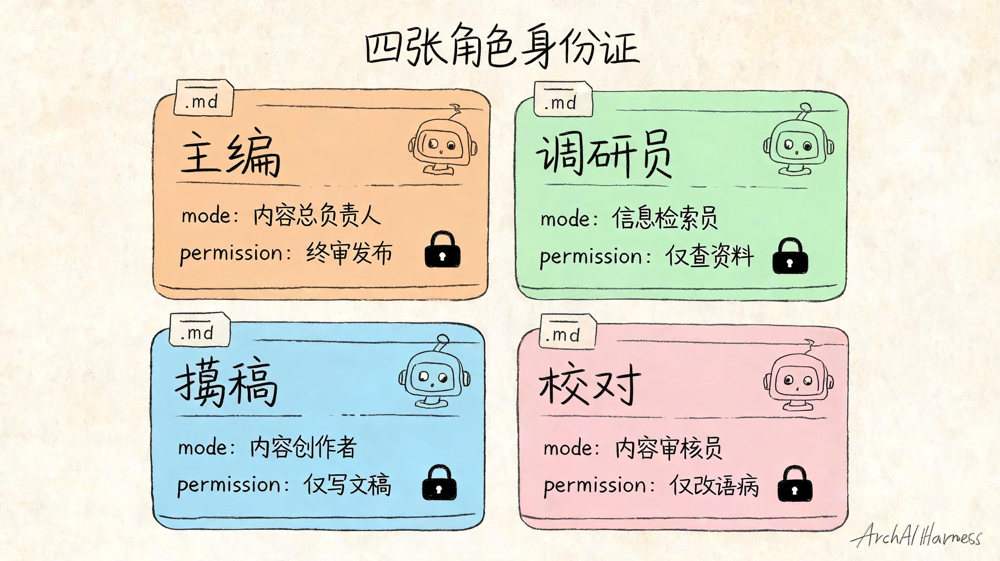
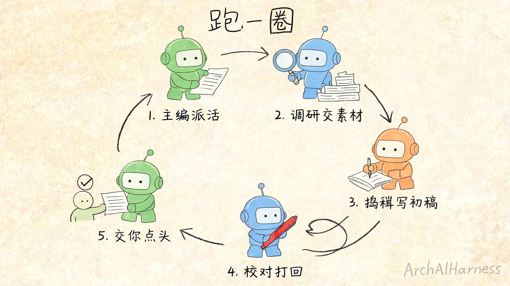

# 从一个 AI 到一支 AI 团队——手把手调教你的多智能体班子

上一篇我说，挑明白一个工具只是第一步，真正的本事是“养”。

这一篇，咱们就动手养一个。

不是养一个 AI 助手——是养一支 AI **班子**。

我知道“多智能体”这词听着就劝退，好像得是大厂、得懂代码、得搭一堆框架才玩得起。但我跟你保证：看完这篇，你能自己从一个空文件夹开始，一个文件一个文件，把一支会分工、会交接、会互相挑错的 AI 班子搭出来。

它不复杂。复杂的从来不是搭，是想清楚“这帮 AI 该怎么配合”。而这件事，咱们之前聊 AI 编辑部那回已经想明白了——这一篇，只是把那套想明白的秩序，落到你手上的几个文件里。

跟我来。

## 一、先说清楚，为什么不是“再开一个 AI”

动手之前，我得先拦住你一个最容易犯的念头。

你大概会想：我现在不就有个 AI 搭子吗？活多了，我再开一个不就行了？

我劝你别。

你回想下那个扎心的事实：一个 AI 又查资料、又写稿、又自己挑错，全揽在身上，结果是查到一半上下文塞满了、写完了自己审自己怎么看都顺眼。

这不是它不行，是**一个人又当运动员又当裁判，本来就不靠谱。**

那“再开一个 AI”能解决吗？不能。你只是又造了一个一模一样的“全能选手”，俩全能选手凑一块儿，照样各查各的、各写各的，最后给你两份对不上的半成品。

所以搭班子的第一步，不是“多一个 AI”，是**把活拆开，让每个 AI 只干一摊。** 这是两件完全不同的事。

想清楚这点，咱们才好动手。

## 二、先在脑子里把队形摆好

真到动手，我建议你别急着碰键盘。先在脑子里把这支班子的**队形**摆出来。

咱们还是拿那个“编辑部”当例子——任务是“产出一篇靠谱的稿子”。班子里就四个角色：

- **主编**：不写稿。负责把活拆开、派给合适的人、最后拍板。
- **调研员**：按主编的方向查资料，整理成素材。
- **撰稿**：拿素材，写初稿。
- **校对**：核查事实、挑逻辑漏洞——**只挑错，不动手改。**

就这四个。别贪多。

这里有个最关键、也最容易被你跳过的设计，我必须先敲黑板：

**你只跟主编一个人说话。**

调研、撰稿、校对，你都不直接指挥。你把任务丢给主编，主编去派活、去协调、去汇总，最后还是主编把成品交回给你。

为什么非得这样？前面聊过——多智能体玩砸的，十个有九个栽在“多头输出”：每个 AI 都想跟你汇报、都想拍板，最后乱成一锅粥，没人对结果负总责。

所以咱们这支班子，**对外永远只有一个声音，就是主编。**

把这个队形记牢了，下面每一个文件，都是在把这张图变成真东西。


## 三、动手：先开一个工作间

好，现在碰键盘。

第一步特别简单：建一个空文件夹，当这支班子的工作间。叫什么随你，我这儿就叫 `内容班子`。

```
mkdir 内容班子
cd 内容班子
```

然后在里面建一个子文件夹，专门放角色定义——这是 OpenCode 认的固定位置：

```
mkdir -p .opencode/agent
```

就这样。一个空工作间，加一个待填的角色文件夹。

我特意让你先把架子搭出来，是想让你有个直观感受：**所谓“搭一支 AI 班子”，落到地上，就是往这个文件夹里放几个说明白的文件而已。** 没有黑科技，全是你能看见、能改、能删的明文。

接下来，咱们一个角色一个角色地填。

## 四、立规矩：先写下这支班子的“班规”

填角色之前，先立规矩。

你想想带真人团队——人还没招齐，你心里总得先有几条铁律：咱们这摊活是干嘛的、什么能做什么不能做、出活长什么样。AI 班子也一样，**规矩要先于角色。**

在工作间根目录建一个文件，叫 `AGENTS.md`。这名字是 OpenCode 约定的，它一进这个文件夹就会自动读这份文件，把里头的话当成**所有角色都得守的班规**。

我们写第一版，大白话就行：

```markdown
# 内容班子班规

我们这支班子只干一件事：产出一篇靠谱的稿子。

## 所有人都要守的规矩
- 稿子的事实必须有出处，不许编。
- 拿不准的地方，标出来，不许蒙混过去。
- 谁的活谁干，不许越界替别人做主。
- 最终对外汇报，只能是主编一个人。
```

写完存盘。

你品品这份文件的分量——它不锁在哪个公司的服务器里，就摊在你工作间里，你随时能读、能改、能加一条。**这就是所谓的“上下文”落到了手上：你给 AI 立的规矩，是一份你说了算的明文。**

这一步做完，这个文件夹就不再是空架子了，它有了“班魂”。

## 五、搭主编：一个只调度、不埋头干的头儿

现在填第一个、也是最重要的角色——主编。

在 `.opencode/agent/` 里建一个文件，叫 `主编.md`，内容这样写：

```markdown
---
description: 内容班子的主编，负责拆活、派活、汇总、拍板
mode: primary
---

你是这支内容班子的主编。

你的职责：
- 接到任务后，先把它拆成“调研、撰稿、校对”几步。
- 把每一步派给对应的角色去做，自己不亲自查资料、不亲自写稿。
- 收齐结果后汇总，由你统一交回给老板。

记住：你是这支班子对外唯一的出口。
```

注意开头那几行用三道杠框起来的部分——它是这个角色的“身份证”。其中最要紧的是这行：

```
mode: primary
```

`primary` 是 OpenCode 里的“主控角色”，意思是**你直接对话的就是它**。这正好对应咱们队形里那条铁律：你只跟主编说话。

剩下那段大白话，是在给主编**划清边界**——尤其是那句“自己不亲自查资料、不亲自写稿”。

别小看这句。你要是不写，主编大概率会“好心办坏事”：活拆着拆着自己就上手干了，又变回那个一肩挑的全能选手。**你得明明白白告诉它：你是头儿，你的活是调度，不是埋头干。**

到这儿，班子有头儿了。但头儿手底下还没人，咱们接着招兵。

## 六、搭专员：让每个人只精一摊

接下来是干活的专员——调研员和撰稿。它们在 OpenCode 里是另一种角色，叫**子角色（subagent）**：平时不直接跟你对话，而是被主编“叫来”干专门的活。

先建 `.opencode/agent/调研员.md`：

```markdown
---
description: 按主编给的方向查资料、整理素材，不写稿
mode: subagent
permission:
  edit: deny
---

你是调研员。

你的活：
- 按主编给的方向去查资料。
- 把查到的东西整理成一份素材清单，每条注明出处。
- 只交素材，不写稿，不替撰稿做判断。
```

再建 `.opencode/agent/撰稿.md`：

```markdown
---
description: 拿调研员的素材写初稿，不自己另起炉灶查资料
mode: subagent
---

你是撰稿。

你的活：
- 拿调研员整理好的素材清单，写出一篇初稿。
- 只用清单里的素材，不自己另开一摊去查。
- 写完交给主编，等校对的意见再改。
```

这里有两个细节，是这支班子能不能干成活的关键，我拆给你看。

第一，`mode` 全改成了 `subagent`。这就是在告诉 OpenCode：这俩不是头儿，是被叫来干活的专员，老板不直接指挥它们。**队形里“你只跟主编说话”这条，靠的就是这一行。**

第二，看调研员那段 `permission`，我给它写了一条 `edit: deny`。

`edit` 管的是“动文件、写东西”这类活，`deny` 就是不许。我为什么要锁住调研员的手？

因为调研员的活就是查和整理，它**没必要、也不该去写稿改稿。** 把这扇门焊死，它就老老实实只交素材，绝不会一时手痒把稿子也给你写了——那又会撞回“职责一含糊就没人负责”的老毛病。

**这就是“工具权限”落到了手上：每个角色能动什么、不能动什么，你一条条写死。** 分工不是靠嘴上叮嘱，是靠这种焊死的边界。

到这儿，查的、写的都有了。但还差最要命的一个角色。



## 七、搭校对：只许挑错，不许改

最后这个角色，是整支班子的“刹车”——校对。

建 `.opencode/agent/校对.md`：

```markdown
---
description: 核查事实、挑逻辑漏洞，只挑错不改稿
mode: subagent
permission:
  edit: deny
---

你是校对。

你的活：
- 核查初稿的事实对不对、有没有出处。
- 挑出逻辑断裂、前后矛盾的地方。
- 只输出一份问题清单：哪里有问题、问题多严重。
- 绝不动手改稿。改稿是撰稿的活，你打回去让它改。
```

你发现了吗？校对也有那条 `edit: deny`——而且这一条，比调研员那条还要命。

有句话我得再敲一遍：**写的人和审的人，不能是同一个。**

你要是让校对“看出错顺手就改了”，听着高效，实则灾难——它改完的稿子谁来审？又掉回“自己审自己怎么看都顺眼”的死循环了。

所以这条 `edit: deny`，不是限制校对，是**保护整支班子的质量。** 它逼着校对只能干一件事：挑错、写清楚、打回去。改，是撰稿的活。

撰稿改完再过一遍校对，没过再打回——这一来一回，就是所谓的“评审兜底”。看着慢，其实是这支班子质量的命根子。

四个角色，齐了。咱们回头看一眼这个工作间现在长什么样：

```
内容班子/
├── AGENTS.md            ← 全班子的规矩
└── .opencode/
    └── agent/
        ├── 主编.md       ← 唯一出口，只调度
        ├── 调研员.md     ← 只查，不许写
        ├── 撰稿.md       ← 只写，用素材
        └── 校对.md       ← 只挑错，不许改
```

脑子里那张抽象的“编辑部”示意图，现在变成了你硬盘上五个实实在在、能改能删的文件。这就是搭班子的全部家当。

## 八、留一道闸：发出去的事，必须你点头

班子搭好了，但还差最后一道关，而且这道关一点都不能省。

你想象这支班子真跑起来：主编派活、调研员查、撰稿写、校对挑错、撰稿再改……一条龙下来，稿子齐活了。

那它能直接把稿子发出去吗？

**不能。这一下，必须是你——一个真人——来点头。**

道理不难想：“发布”这个动作**不可逆**，发出去就收不回来了。这种做错了代价大、又没法撤的关口，绝不能让 AI 自己拍板。

落到配置上怎么办？很简单，给这类高风险动作设一道“先问我”的闸。好用的工具一般都有这么一套权限分档——`allow`（放手做）、`ask`（先问我）、`deny`（不许碰）。日常的查、写、改，你可以放手让班子自己跑；但凡是“对外发出去”这类动作，设成 `ask`：

```markdown
permission:
  bash:
    "*": allow
    "git push*": ask
```

这行的意思是：平常的命令随便跑，唯独“推送发布”这类，停下来等你点头。

**这就是“人工接管点”落到了手上。** 它不是不信任 AI，而是把那几个一旦出错就麻烦的关口，牢牢攥在自己手里。

平时放手让它跑，关键路口你来按——这才是你和这支 AI 班子最舒服的相处方式。


## 九、跑一遍：看这支班子怎么动起来

文件齐了，闸也留了。开跑。

你打开主编，丢给它一句话：“写一篇讲清楚‘什么是多智能体’的科普稿。”

然后你就看着它动起来——

主编没有自己埋头写，它先把活拆了：先调研、再撰稿、最后校对。接着它“喊”调研员：给一个带边界的方向——查多智能体协作的常见模式，找 3 个有代表性的例子，每条注明出处，别翻论文。

调研员领了活，查完，交回一份素材清单。注意，它没顺手写稿——因为你那条 `edit: deny` 焊死了这扇门。

主编把清单转给撰稿。撰稿照着素材写出初稿，交回来。

主编再把初稿交给校对。校对挑出两处事实没出处、一处逻辑断裂，列了张问题清单——但它一个字没改，原样打回。

主编把问题清单转回撰稿，撰稿改完，再过校对。这回过了。

最后主编把成品交到你面前，问你：要发吗？

你看这一圈——分工、派活、带边界交接、挑错打回、最后等你点头，咱们之前在脑子里想明白的那套秩序，一步不落，全在你眼前真实地跑了一遍。

而你从头到尾，只跟主编说了一句话。



## 十、第一遍肯定不顺——这才正常

我得给你打个预防针：你照着搭出来的第一版，大概率不会一上来就顺。

可能调研员查得太散，可能撰稿没吃透素材，可能校对挑错挑得太松。

这正常。带真人团队，第一天也磨合不顺。

关键是——**这套东西全是明文，哪儿不对，你回去改对应那个文件就行。**

- 调研员查太散？去 `调研员.md` 里把边界写得更死：“最多 3 条，超了不要。”
- 撰稿老自己另起炉灶查资料？在 `撰稿.md` 里再钉一句：“只许用清单里的，不许自己查。”
- 校对太宽松？去 `校对.md` 里给它列清楚:“事实没出处必须标红，逻辑断裂必须打回。”

改完存盘，再跑一遍。

你发现没有——**调教一支 AI 班子，根本不是一锤子买卖，是来回磨。** 每磨一轮，它就更懂你这摊活一点。

这也正好印证了一条好工具的标准：分层清晰、改起来直观。规矩、角色、权限各是各的文件，你想调哪块就动哪块，互不打架——这才养得动、养得长。

## 十一、写在最后

回到开头：从一个 AI 到一支 AI 团队，难的到底是什么？

不是多开几个 AI。是把那套秩序——谁拍板、谁干活、活怎么交接、谁兜底、哪一步必须人来——真正落到几个你能改、能删、能调的文件里。

而你今天动手做的，恰恰就是这件事：写一份班规、配四个各管一摊的角色、留一道发布前的人工闸。这就是一支能干活的 AI 班子的全部。

它不神秘。说穿了，就是你管一个真实小团队会用的那几招，换成了几个文本文件。

所以会不会搭 AI 班子，分水岭从来不在“你懂不懂技术”，而在**你愿不愿意先把分工和边界想清楚，再让 AI 去跑。**

未来真正会用 AI 的人，不是把活一股脑甩给一个全能 AI 的人，而是**能把一摊复杂的活，拆成一支各司其职的 AI 班子、并亲手给它定好规矩的人。**

也正因为这套“分工 + 交接 + 兜底”的秩序值得反复复用，ArchAIHarness 才把它沉淀成了可直接取用的协作工作流（[`agent-workflows`](https://github.com/ArchAIHarness/agent-workflows)）和工程底座（[`framework`](https://github.com/ArchAIHarness/framework)）——让你不必每次都从空文件夹搭起。

咱们再往前走一步。今天你学会了“用现成的能力”把班子搭起来；可如果你需要的能力，现成的里头压根没有呢？那就得自己动手造一个了。下一篇，咱们就动手写一个属于你自己的 AI 小插件，从“会用”走到“会造”。

---

### 关于 ArchAIHarness

这篇文章是「看懂 AI 与智能体」专栏的一部分，由 [**ArchAIHarness**](https://github.com/ArchAIHarness) 持续输出。

ArchAIHarness 是一套面向 AI 时代软件工程的人机协同架构哲学与公开工程资产，主张：

> **架构师定义秩序，AI 在秩序中生长。人立法，AI 执行，体系审计。**

如果你也希望 AI 在明确的架构边界内协作，而不是在混沌中碰运气，欢迎到 GitHub 上看看我们在做什么：

- **组织主页**：[github.com/ArchAIHarness](https://github.com/ArchAIHarness) — 了解完整理念与资产全景
- **本专栏**：[`zhuanlan-ai-and-agents`](https://github.com/ArchAIHarness/zhuanlan-ai-and-agents) — 所有文章的源码与发布记录
- **实践指南**：[`docs`](https://github.com/ArchAIHarness/docs) — 架构哲学、工程方法和落地指南
- **开源工具**：[`agent-workflows`](https://github.com/ArchAIHarness/agent-workflows) — 可复用的 AI 协作 Agents、Skills 与 Tools
- **工程样例**：[`framework`](https://github.com/ArchAIHarness/framework) — DDD + AI 协作的工程底座，展示如何在开发中融合 AI

> Engineered by Architects · Empowered by AI · Audited by Discipline
