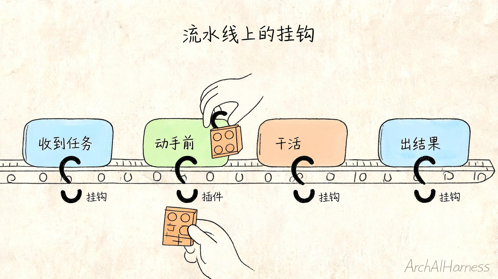
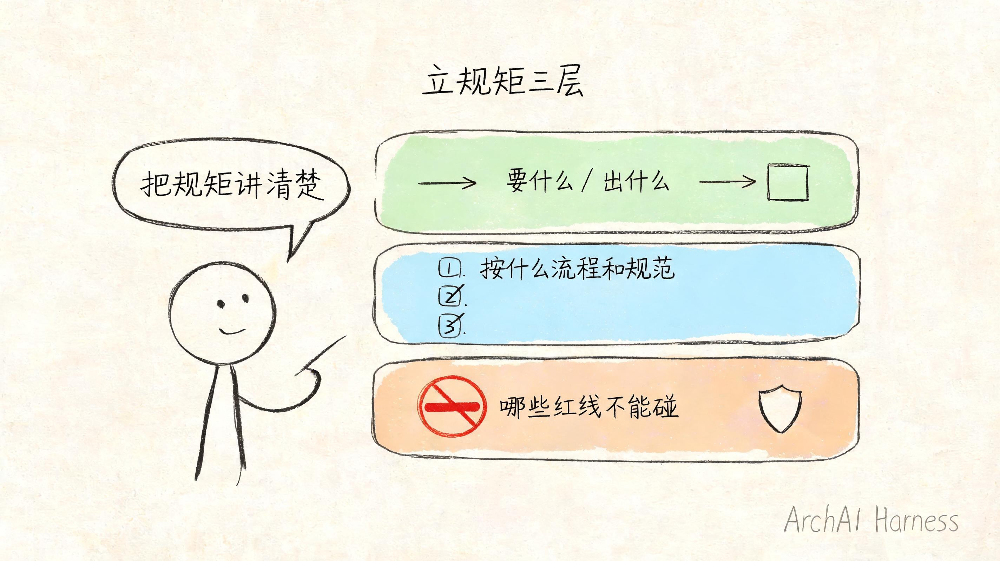
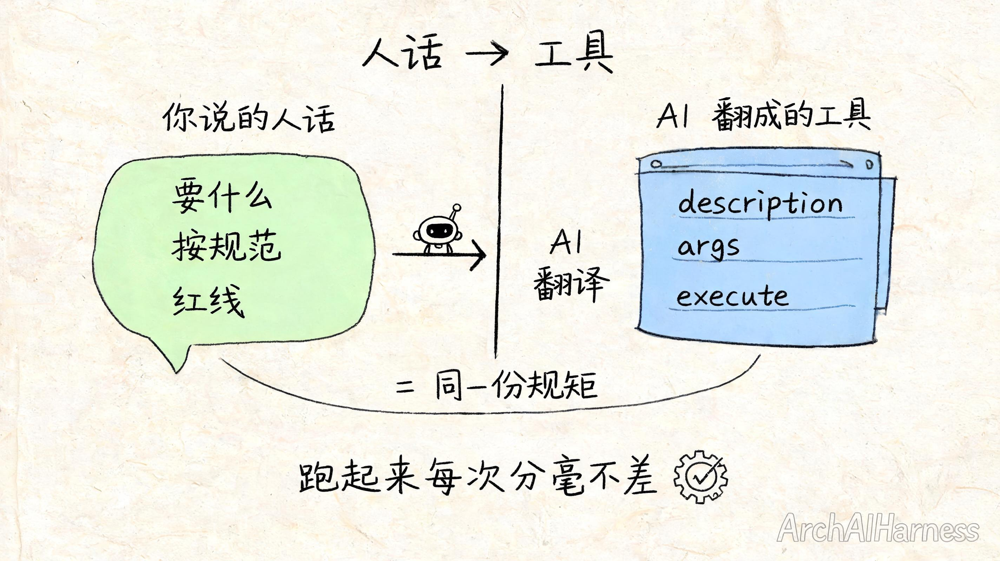

# 给 AI 长出一件新本事——插件不用敲，是聊出来的

前面几篇，咱们一直在“用”——用现成的工具、配现成的角色、调现成的能力。

这一篇，咱们换个身份：从用的人，变成造的人。

我知道“写插件”这三个字，听着就劝退：得懂代码吧？得会搭环境吧？得是程序员吧？

我跟你说件可能颠覆你认知的事——**造插件，你压根不用自己敲代码。**

你要做的，是把脑子里那套规矩讲清楚：这件事该怎么干、按什么流程走、有哪些红线碰不得。讲明白了，剩下的代码，让 AI 替你写。**你负责立规矩，它负责落地。**

所以这一篇真正难的，从来不是“写”，是**想清楚“我要给 AI 添一件什么本事、这本事得守什么规矩”。**

我想让你看完之后，脑子里冒出来的不是“哦，插件原来这么写”，而是“**等等，我那个天天重复的破活，是不是也能这么给 AI 造一件，一劳永逸？**”

那个念头，才是这篇真正想给你的东西。

来，跟我造一件。

## 一、一件烦了我很久的小事

先说个我自己的真事。

我每写完一篇文章，习惯做一道收尾工序：整理成一个规范的“发布包”——建个文件夹，正文放进去，再配一份说明，写清楚标题、一句话摘要、几个标签、准备发去哪几个平台。就这么个固定动作，每篇都得来一遍。

一开始我顺手就甩给 AI：“帮我把这篇整理成发布包。”

它干得了，但你猜怎么着——**每次干得都不太一样。**

这回摘要写两句、下回写一大段；这回标签放文件名里、下回塞进正文开头；这回老老实实建了文件夹、下回直接糊成一坨。我每次都得回去返工对齐。

我起初还怪它笨。后来才回过味来：**不是它笨，是这种活根本就不该靠它“发挥”。**

你想啊，AI 最擅长的是理解、是组织语言、是随机应变。可“每次都按同一套规范、生成同一种格式”这种活，要的恰恰是**不许发挥、分毫不差**。让一个最擅长发挥的家伙，去干一件最忌讳发挥的活，它当然每次都给你来点“惊喜”。

这就是现成本事够不着的地方——AI 自带的那些通用能力里，压根没有“**按我这套死规矩打包文章**”这一件。

没有，那就造一件。而且是——“聊”出来一件。

## 二、先破个误会：插件不是什么黑科技

动手之前，我得先把“插件”这俩字头上的光环摘掉。

你可能以为插件是个了不得的工程：一套框架、一堆配置、编译打包、再挂上去。

不是。**说穿了，一个插件就是一个能被自动加载的小文件。**

你在工作间里建一个文件夹 `.opencode/plugins/`，往里头扔一个 `.js` 文件，工具一启动就自动把它捡起来、加载上。没有编译，没有打包，存盘、重启一下就生效。

这文件里头干嘛的？就一件事：往 AI 干活的某个环节上，**挂一段你想要的逻辑**。

“挂在某个环节上”这句，是整个插件机制的命根子，我用个生活里的例子讲透。

你把 AI 干活的过程，想象成一条流水线：它读文件、它写东西、它执行命令、它一轮活干完了……每一个这样的节点，工具都给你留了一个“**挂钩**”。插件干的事，就是往某个挂钩上，挂一段你自己的逻辑。

最小的一个例子，是拦住 AI 别去读 `.env` 文件（那个存着数据库密码、密钥的敏感文件）。它的逻辑用大白话讲就一句：“**AI 动手读文件之前先过我这关，发现要读的是 `.env`，就喊一声‘不许’、拦下来。**”

落到代码，也就十行不到。但你注意——这个例子虽小，却把插件最被动的一种用法摆出来了：它只是在 AI 要犯错时喊“站住”。

这有用。但它远不是插件的本事所在。

**插件真正的力量，不是“拦住 AI 不让它干什么”，而是“给 AI 造一件它本来根本没有的新本事”。**

前者是设防，后者是创造。这一篇，我要带你干的，是后者。



## 三、换个念头：不是写按钮，是给 AI 添一道菜

回到我那个“打包文章”的烦恼。

你可能第一反应是：那写个脚本不就行了？写个程序，跑一下，把文章打包好。

可以，但那又退回老路了——**那是“我自己用的工具”，不是“AI 的本事”。** 我还得记着什么时候去跑它、怎么跑它。

插件的思路完全不一样，而且这点最反直觉，我得说清楚：

**你不是在写一个等人去点的按钮，你是在 AI 的“能力菜单”上，加一道新菜。**

什么意思？AI 本来手上就有一份能力清单：读文件、写文件、执行命令、上网搜……这些是它天生会的。你造一个插件工具，等于往这份清单上**多加了一项**，比如“打包文章”。

加上之后会发生什么？神奇就神奇在这儿——**你不用命令它“现在去打包”，它自己会判断什么时候该上这道菜。** 你只要像平时聊天那样说一句“这篇写完了，整理一下准备发”，AI 一看清单上正好有“打包文章”这道菜，自己就把它点了。

你品品这差别：

- 写脚本，是你多了一个**得自己惦记着去操作的工具**。
- 写插件工具，是 AI 多了一项**它自己会判断、自己会调用的本事**。

前者是你手更累，后者是 AI 更能干。这就是为什么同样一段打包逻辑，做成插件工具，价值完全不一样。

想通这一层，咱们才算真正站到“造”的起点上。

下面就动手——准确说，是动嘴。

## 四、第一步：把“这件事到底怎么干”讲给 AI 听

“聊”出一个插件，第一步不是打开编辑器，是打开对话框，把你要的本事**讲清楚**。

讲清楚，分三层，一层都不能含糊。我一层一层带你走，用的就是“打包文章”这个真例子。

**第一层：这件事要什么、出什么。**

你得先跟 AI 说明白这道菜的“进”和“出”：

> “我要给你加一个工具，叫‘打包文章’。它收一篇文章的正文，外加标题、摘要、标签、要发的平台；干完之后，给我建一个文件夹，里面放好正文文件和一份说明文件。”

你看，这段话里没有一个字是代码。你只是在描述一件事的输入和产出——**这恰恰是只有你（而不是 AI）才清楚的东西**，因为这是你的规矩、你的习惯。

**第二层：按什么流程、什么规范。**

光说要什么还不够，你那些藏在心里的“讲究”，得一条条抖出来：

> “摘要必须压在 80 字以内，超了你帮我截断；标签最多 5 个，多的砍掉；平台名按‘知乎、掘金、公众号’这个固定顺序排；文件夹名用文章标题，但要把空格和特殊符号换成横杠。”

这一层，才是这道菜的灵魂。前面 AI “每次干得不一样”，根子就在这些规矩从来没被白纸黑字定下来过，全靠它每次临场猜。现在你把它们钉死，AI 以后就照章办事，不再发挥。

**第三层：哪些红线不能碰。**

最后，把门禁立上——这一步千万别省：

> “动手之前先扫一遍内容，要是发现里面混进了密码、密钥、Token 这类敏感信息，立刻停下、报错提醒我，绝对不许打包出去。”

看到没——开头那个“拦 .env”的防御动作，在这儿**回来了**，但它不再是孤零零一个补丁，而是融进了你这件新本事的规矩里，成了它自带的一道安全门。

**这就是“立规矩”的全部：要什么、怎么干、什么不许干。** 三层讲完，你脑子里那套打包文章的隐性讲究，就全变成了明文。

而你会发现，这三层从头到尾，**你说的全是人话，没碰一个字的代码。**



## 五、第二步：让 AI 把规矩翻成代码

规矩立好了，下面这步，才是“不用敲代码”的关键。

你把上面那三层规矩，原原本本发给 AI，再补一句：

> “照这套规矩，给我写成一个 OpenCode 的插件工具，放进 `.opencode/plugins/`。”

然后——它就给你写出来了。

它会生成一个 `.js` 文件，里头那段代码大概长这样（我贴出来不是让你背，是让你看清“人话”是怎么变成“工具”的）：

```js
import { tool } from "@opencode-ai/plugin"

export const PackArticlePlugin = async () => {
  return {
    tool: {
      打包文章: tool({
        description: "把一篇文章整理成规范的发布包",
        args: {
          正文: tool.schema.string(),
          标题: tool.schema.string(),
          摘要: tool.schema.string(),
          标签: tool.schema.array(tool.schema.string()),
          平台: tool.schema.array(tool.schema.string()),
        },
        async execute(args) {
          // 这里是 AI 替你写的逻辑：
          // 扫敏感信息 → 截断摘要 → 砍多余标签 →
          // 建文件夹 → 写正文和说明文件
          return "打包完成：发布包已生成"
        },
      }),
    },
  }
}
```

你不用真懂这段代码，但我请你认出三个东西，因为它们**和你刚才说的人话，是一一对应的**：

- `description`（这是干嘛的）——对应你第一层说的“这道菜是什么”。AI 就靠这句话,判断什么时候该点这道菜。
- `args`（它要哪些料）——对应你说的输入：正文、标题、摘要、标签、平台。
- `execute`（它具体怎么做）——对应你第二、三层那些流程和红线，AI 把它们翻成了一步步的逻辑。

看明白这个对应关系，你就抓住了这一篇最想给你的底气：**代码不是天书，它只是你那套规矩的另一种写法。** 你立的规矩越清楚，AI 翻出来的工具就越靠谱。

规矩讲不清，它写出来的也是一团糟——所以功夫永远在“想清楚”，不在“会不会写”。

## 六、第三步：跑一遍，再调一轮

文件有了，重启一下工具，让它把这个新插件加载进来。

然后你试一次。还是平时那句话：“这篇写完了，整理成发布包，准备发知乎、掘金、公众号。”

这回你会看到不一样的光景——AI 不再自己瞎组织格式了，它直接点了“打包文章”这道菜：扫一遍内容、把摘要压到 80 字、标签砍到 5 个、平台按你定的顺序排好、建好文件夹。**每一次，分毫不差。**

第一遍大概率还不会完美。可能摘要截断的位置很生硬，可能文件夹命名你又想改个规矩。

没关系——**这恰恰是“聊出来”最大的好处：哪儿不对，回去接着聊。**

> “摘要别硬截，截到最近一个句号。”
> “文件夹名前面再加个日期。”

你提，AI 改对应那几行代码，重启，再跑。**改插件，跟当初造插件一样，还是动嘴不动手。**

你发现没有——从造到调，你全程都在干一件事：**把规矩越说越清楚。** 代码自始至终是 AI 在碰，你碰的只有规矩。

这事还有个真实的成熟样本可以印证：ArchAIHarness 那套公开的协作工具集（`agent-workflows`）里，就有一个真在用的“内容打包”能力。它比咱们这个小例子讲究得多——敏感信息扫描更严、还能适配好几个平台的不同要求——但骨架一模一样：**先把一套清清楚楚的规矩定下来，再让它长成一件 AI 随手可用的本事。** 你今天聊出来的这个小工具，跟它是同一条路上的东西，只是它走得更远。



## 七、真正的礼物：你看世界的眼光变了

到这儿，那个“打包文章”的小工具已经能跑了。但我最想给你的，不是这个工具。

是这之后，你看自己日常的眼光，会悄悄变一下。

以前你遇到一件天天重复、又烦又琐碎的破活，第一反应是“认了，自己干吧”，或者“甩给 AI 碰碰运气吧”。

现在你会下意识地多想一句：“**这件事，是不是能给 AI 立套规矩、长成一件本事，以后再不用我操心？**”

- 每天把几个群里的消息整理成一份摘要——能长一件。
- 把杂乱的报销单据按固定格式归档——能长一件。
- 把会议录音转成带行动项的纪要——能长一件。

这些活的共同点，全是“规矩明确、最忌发挥”。而你现在已经知道：**凡是这种活，都能聊出一件专属工具来收拾它。**

这就是从“会用”到“会造”真正的分水岭。它根本不在于你会不会编程——

**它在于你愿不愿意把一件事彻底想清楚，清楚到能讲给 AI 听。**

会写代码的人，多了一种把想法落地的手段；不会写代码的你，靠把规矩讲清楚，照样能让 AI 替你把工具长出来。在这件事上，你和工程师站在同一条起跑线上——**拼的是谁更想得清楚，不是谁更会敲键盘。**

## 写在最后

回到开头那个颠覆认知的说法：造插件，不用自己敲代码。

现在你该信了。你今天做的，是把一件烦人的重复活，掰成三层规矩讲给 AI 听——要什么、怎么干、什么不许干；然后让它替你翻成一件能用的工具，再聊几轮调顺。

代码全程是 AI 在碰。你碰的，只有规矩。

所以会不会“造”AI 工具，从来不是程序员的专利。它考的是一件更朴素、也更难的事：**你能不能把自己脑子里那套含糊的讲究，想到清清楚楚、讲到明明白白。**

想清楚了，AI 就能帮你把它长出来。这，才是 AI 时代最该握在普通人手里的能力——**不是会用工具，而是会把自己的需求，变成 AI 能执行的本事。**

到这儿，从“看懂”到“会用”再到“会造”，这条路咱们算是走通了。

但造，是没有尽头的。下一篇起，我会挑一个真实场景，带你亲手造一件能落地、有实用价值的东西——一个插件，或者一个小帮手。你手上要是已经有那个“天天重复、烦了很久”的活，记着它——说不定下一件，咱们造的就是它。

---

### 关于 ArchAIHarness

这篇文章是「看懂 AI 与智能体」专栏的一部分，由 [**ArchAIHarness**](https://github.com/ArchAIHarness) 持续输出。

ArchAIHarness 是一套面向 AI 时代软件工程的人机协同架构哲学与公开工程资产，主张：

> **架构师定义秩序，AI 在秩序中生长。人立法，AI 执行，体系审计。**

如果你也希望 AI 在明确的规矩里替你长出新本事，而不是在混沌中碰运气，欢迎到 GitHub 上看看我们在做什么：

- **组织主页**：[github.com/ArchAIHarness](https://github.com/ArchAIHarness) — 了解完整理念与资产全景
- **本专栏**：[`zhuanlan-ai-and-agents`](https://github.com/ArchAIHarness/zhuanlan-ai-and-agents) — 所有文章的源码与发布记录
- **实践指南**：[`docs`](https://github.com/ArchAIHarness/docs) — 架构哲学、工程方法和落地指南
- **开源工具**：[`agent-workflows`](https://github.com/ArchAIHarness/agent-workflows) — 可复用的 AI 协作 Agents、Skills 与 Tools，本文那个“内容打包”能力就在这里
- **工程样例**：[`framework`](https://github.com/ArchAIHarness/framework) — DDD + AI 协作的工程底座，展示如何在开发中融合 AI

> Engineered by Architects · Empowered by AI · Audited by Discipline
