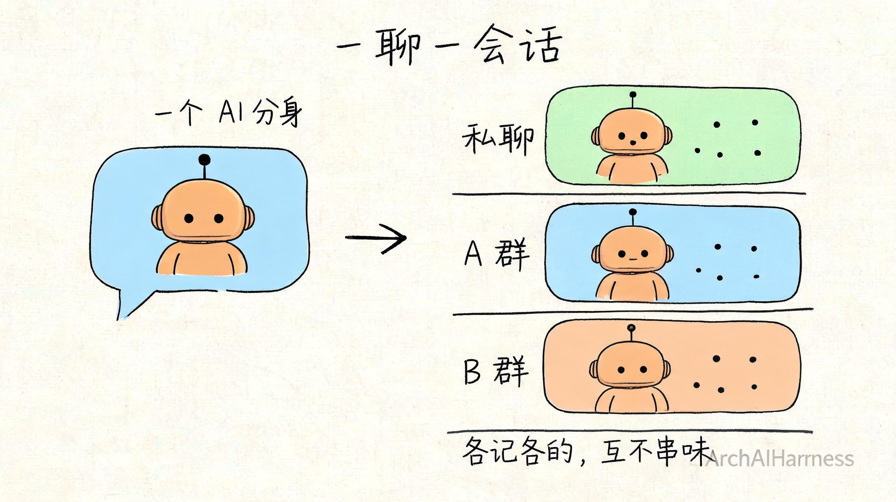
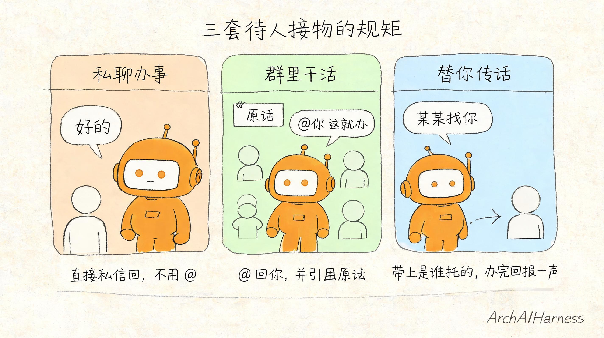
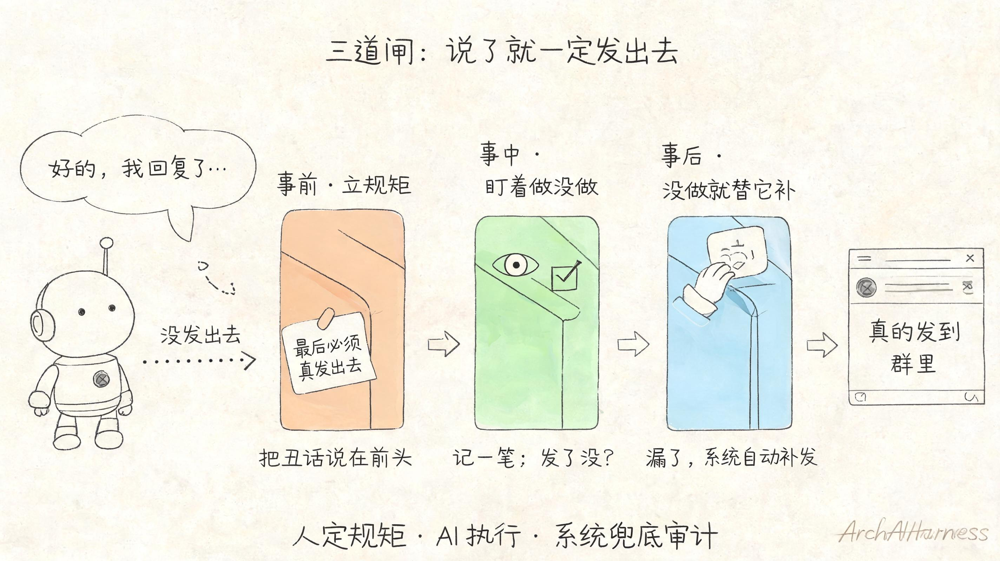

# 我在飞书里养了个"分身"——私聊喊它办事，群里 @ 它干活，还能替我传话

先给你看一个我每天都在用的画面。

我在飞书里私聊一个"人"：帮我看看今天的数据。过几秒，它把结果回给我了。

我在一个工作群里 @ 它一句：把刚才那个结论整理一下发出来。它在群里 @ 着我，引用着我那条消息，把整理好的东西回了出来。

我又跟它说：这事告诉一下隔壁那个群。它真就跑到隔壁群里，@ 上对应的人，开口第一句还带着"某某找你"——办完回来跟我说一声"已经同步过去了"。

你是不是以为我在说某个同事？

不是。这是我自己接进飞书的一个 AI——我私下管它叫"分身"。它没有工位、不用发工资，但你私聊它、群里 @ 它、让它替你传话跑腿，它都接得住，像个还挺靠谱的办事员。

这一篇，我就把这个"分身"是怎么实现的，一层一层拆给你看。不卖关子，连最容易翻车的地方，我都给你点出来。

## 一、最大的误会：以为难在"怎么接进去"

先破一个最常见的误会。

一说"把 AI 接进飞书"，大部分人第一反应是：这肯定是个大工程吧？要对接平台、要处理协议、要搭服务器……

我也是这么以为的，直到真动手才发现——**接进去，是整件事里最简单的一步。**

飞书这类平台，本来就给开发者留了官方口子：你注册一个机器人应用，拿到一对钥匙（一个应用 ID、一个密钥），然后让你的程序跟飞书建一条长连接，飞书那边一有新消息，就顺着这条线推给你。

这条线叫 WebSocket，你不用记这个词。你只要知道它的作用：**它就像给你的 AI 装了一对"耳朵"，飞书里谁说了话，它当场就听见。**

这一步要写的东西，少到出乎你意料——填上那对钥匙，把连接打开，齐活。真正费劲、真正决定这个分身"像不像个人"的，根本不在这儿。

那在哪儿？

在于：**它听见消息之后，怎么做事、怎么做人。**

## 二、凭什么它是"我的分身"，而不是个陌生人

你有没有用过那种一问一答的客服机器人？你问一句它答一句，下一句它就不记得你刚说过啥了，每次都像第一次见面。

那种东西，谈不上"分身"，顶多是个复读机。

我这个分身不一样——你能跟它**连着聊**。上一句说"看看今天的数据"，下一句直接说"那昨天的呢"，它知道"昨天的"接的是"数据"，不用你从头交代。

这事儿是怎么做到的？说穿了就一句话：**给每一个聊天，单独开一个"脑子"。**

我让它这么记账：跟我私聊，是一个独立的会话；在 A 群被 @，是另一个会话；在 B 群被 @，又是一个。每条线各记各的上下文，互不串味。

所以它在我私聊里记得我们聊到哪了，到了群里又不会把私聊的事抖出来——**这正是一个靠谱的人该有的分寸。** 它之所以像"分身"而不像"工具"，关键就在这里：它有记性，能顺着一条线把话接下去。

## 三、它的"耳朵"其实很挑——这是优点

你可能担心：把 AI 塞进群里，它会不会逮谁说话都插嘴，把群搅得鸡飞狗跳？

不会。因为它的"耳朵"是我特意调挑剔的。我给这对耳朵定了几条规矩，缺一条它都可能变成群里的灾难：

**第一，群里没 @ 它，它就装没听见。** 群是用来聊天的，大家你一言我一语，它要是句句都接，那不叫助手，那叫话痨。所以规矩很简单：群消息里没点到它的名，一律不理；只有被 @ 了，才当成是给它的活。私聊则不用 @，因为私聊里只有你俩，每句话当然都是冲它说的。

**第二，超过一分钟的旧消息，直接扔掉。** 这条特别重要。设想一下：程序半夜重启了一次，飞书把它"失联"那段时间积压的消息呼啦啦全补推过来——要是它照单全收、一条条都去回，那就是凌晨三点把整个群挨个 @ 一遍的社死现场。所以我给它定死：太旧的消息不是任务，是历史，看一眼就扔。

**第三，别人发太快，它自己踩刹车。** 它对外发消息是有节制的——每秒最多几条、每分钟最多上百条，到顶就自己等一下再发。这不是抠门，是怕一股脑发太猛被平台当成异常给限制了。一个会看场合、不刷屏的办事员，才用得长久。

你看，这三条没一条是高科技，全是"怎么做个有眼力见儿的人"。**这恰恰说明，难的从来不是技术，是分寸。**

## 四、给它立规矩：私聊、群聊、传话，各有各的章法

耳朵调好了，接下来是最花心思的部分——**教它在不同场合怎么待人接物。**

这部分我没写一行复杂代码，就是拿大白话，把规矩一条条讲给它听（专业点叫"写进它的行为说明"，但本质就是讲道理）。我把它要会的场面，归成三种：

**场景一，私聊喊它办事。** 你私信发个指令，它办完，私信把结果回给你。一对一，干脆利落，不用 @、不用引用，就跟微信上支使一个人办事一样。

**场景二，群里 @ 它干活。** 群里 @ 它发指令，它办完之后，要在群里 @ 回你，并且引用你那条原始消息——这样别人一看就知道它在回谁、回的是哪件事。这是群聊的基本礼貌：别让人猜你在跟谁说话。

**场景三，让它替你传话。** 这是最像"真人办事员"的一手。你可以让它把结果转发到另一个群、或者私信给某个人。它转过去的时候，开口会带一句"谁找你"——比如"老王找你，今天的数据是这样……"，传完再回来跟你说一声"已经同步给老王了"。

你发现没有？这三套规矩，跟你培训一个新来的助理，讲的是**一模一样的东西**：什么场合该公开说、什么场合该私下说、替人带话要报上是谁托的。AI 不会天生懂这些，得有人给它立规矩。

**立规矩的是人，照着做的是它。** 这句话，是这一路走下来我最想让你记住的。

## 五、给它几只"手"——但别让它自己瞎抓

光有规矩还不够。规矩是"该怎么做人"，可它总得有几只"手"去真的把事做了。

我给它配了几只趁手的：一只手负责发消息，一只手负责按名字找人（弄清这个人是谁、在系统里对应哪个身份），一只手负责列出它在哪些群里，还有一只手负责看某个群里都有谁。

这里有个我踩过、也最值得你记住的坑：**发消息之前，必须先把"发给谁"弄准。**

这听着是废话，但 AI 还真容易在这儿想当然。比如群里要 @ 一个人，AI 不能凭感觉去拼一个 @ 标记——那样八成 @ 错人，或者 @ 了个根本不存在的。正确的做法是：先用"找人"那只手，把这个名字背后真正对应的人查出来，拿到准确的身份，再去发。

所以我给它的铁律是：**先查清楚，再动手。** 群里 @ 人，把"@ 谁"这件事交给"找人"的手去办，它自己绝不瞎拼。这就跟一个靠谱的人发重要通知前，会先核对一遍收件人名单是一个道理——**宁可多查一步，不可错发一条。**

## 六、全篇的题眼：凭什么它说完，就一定真发出去了

现在说到我最得意、也最想掰开揉碎讲给你的一处设计。

你想过没有：AI 这东西，是出了名的会"自言自语"。你让它去群里回个话，它很可能在自己那边洋洋洒洒写了一大段"好的，我已经回复了……"——**结果一个字都没真发出去。** 它以为自己说了，群里其实一片寂静。

这要是发生在真实办公里，就是事故。

那怎么治它这个毛病？我的答案是——**不靠它自觉，靠规矩和兜底，给它焊死。**

我设了三道闸：

**第一道，把话挑明。** 我在它的行为规矩里，用最重的语气写了一条死命令：你最后一步**必须**是真的把消息发出去，绝对不许只在自己那边敲字。这是事先把丑话说在前头。

**第二道，盯着它到底做没做。** 光靠嘴说不够。我让程序在背后悄悄记一笔：这一轮活儿里，它到底有没有真的动用"发消息"那只手？动了，打个勾；没动，记下来。

**第三道，也是最关键的——它要是没做，我替它补上。** 当它这一轮活儿干完、安静下来，程序回头一查：咦，它说了一通，但"发消息"那只手压根没动过。这时候兜底机制启动，**自动把它刚才写的那段话，替它真正发到该去的地方。** 它偷的懒，系统给它补上。

你品品这三道闸的层次：先用规矩劝它（事前），再盯着它做没做（事中），最后发现没做就强制补上（事后）。**它干不干得对，不全押在它自觉上；漏了、错了，有一套机制在后面接着。**

这套思路，其实就是这一路我反复念叨的那句话，落到了实处：**人定规矩，AI 执行，系统兜底审计。** 一个真正能托付事情的 AI，靠的从来不是它有多聪明、多听话，而是哪怕它出岔子，你也有办法兜得住。

## 七、这套"分身"，换个壳照样能搭

讲到这儿你可能会问：那我不用飞书，用企业微信、钉钉、Slack，是不是就白搭了？

恰恰相反。你回头看看我们一路拆下来的东西，会发现真正值钱的部分，跟飞书几乎没关系：

- 给每个聊天单开一个"脑子"，让它有记性——这跟用哪个软件无关；
- 那对挑剔的"耳朵"——没点名就不理、旧消息就扔、发太快就刹车——换哪个平台都得这么做人；
- 三套待人接物的规矩——私聊私信回、群里 @ 着回、传话带上"谁找你"——这是做人的章法，不是飞书的功能；
- 三道闸保证"说了就一定发出去"——这更是跟平台八竿子打不着的治理思路。

真正跟飞书绑定的，其实只有最表层那一点点：怎么连上它、怎么调它的接口发消息。换成别的 IM，把这层壳一换就行，里头的"做人章法"原样照搬。

所以你别把它理解成"我做了个飞书机器人"。**你做的是一个能做事、会做人、还兜得住的 AI 分身——飞书只是它今天住的那间屋子。** 屋子可以换，人是同一个人。

这也是我特别想让你拿走的一层意思：你以后但凡想把 AI 接进任何一个你天天用的工具里，套路都是这一套——薄薄一层连接，加上厚厚一层"它在这儿该怎么做事做人"的规矩。

## 八、写在最后

回到开头那个画面：私聊喊它办事、群里 @ 它干活、让它替我传话。看着挺像科幻，拆开了你会发现，没有一处是魔法。

它能"住"在飞书里，是因为有人给它装了耳朵、开了记性；它能在群里不闯祸，是因为有人替它定了分寸；它能让你放心托付，是因为哪怕它偷懒漏发，背后还有一道闸替它补上。

**这个分身像不像个靠谱的人，从来不取决于 AI 本身有多强，而取决于你把规矩立得有多清楚、把兜底铺得有多扎实。**

未来真正会用 AI 的人，不一定是懂多少模型、会调多少参数的人，而是那种能把"这件事该怎么做、做错了怎么兜"想明白、再交给 AI 去执行的人。AI 负责长本事，你负责立规矩——这俩搭一块儿，才有那个让你眼前一亮的分身。

下一篇，我想带你看一个更野的场景：把这套"AI 分身"的思路，从一个办事员，扩成一支能从头到尾干活的队伍——一个"制片总监"带着选题、对标、写稿、剪片、发布几个专员，把一条短视频从一个念头做成成片。一个人能使唤的分身已经够爽了，那一支能协作的呢？咱们下篇见。

---

### 关于 ArchAIHarness

这篇文章是「看懂 AI 与智能体」专栏的一部分，由 [**ArchAIHarness**](https://github.com/ArchAIHarness) 持续输出。

ArchAIHarness 是一套面向 AI 时代软件工程的人机协同架构哲学与公开工程资产，主张：

> **架构师定义秩序，AI 在秩序中生长。人立法，AI 执行，体系审计。**

如果你也希望 AI 在明确的架构边界内协作，而不是在混沌中碰运气，欢迎到 GitHub 上看看我们在做什么：

- **组织主页**：[github.com/ArchAIHarness](https://github.com/ArchAIHarness) — 了解完整理念与资产全景
- **本专栏**：[`zhuanlan-ai-and-agents`](https://github.com/ArchAIHarness/zhuanlan-ai-and-agents) — 所有文章的源码与发布记录
- **实践指南**：[`docs`](https://github.com/ArchAIHarness/docs) — 架构哲学、工程方法和落地指南
- **开源工具**：[`agent-workflows`](https://github.com/ArchAIHarness/agent-workflows) — 可复用的 AI 协作 Agents、Skills 与 Tools
- **工程样例**：[`framework`](https://github.com/ArchAIHarness/framework) — DDD + AI 协作的工程底座，展示如何在开发中融合 AI

> Engineered by Architects · Empowered by AI · Audited by Discipline
