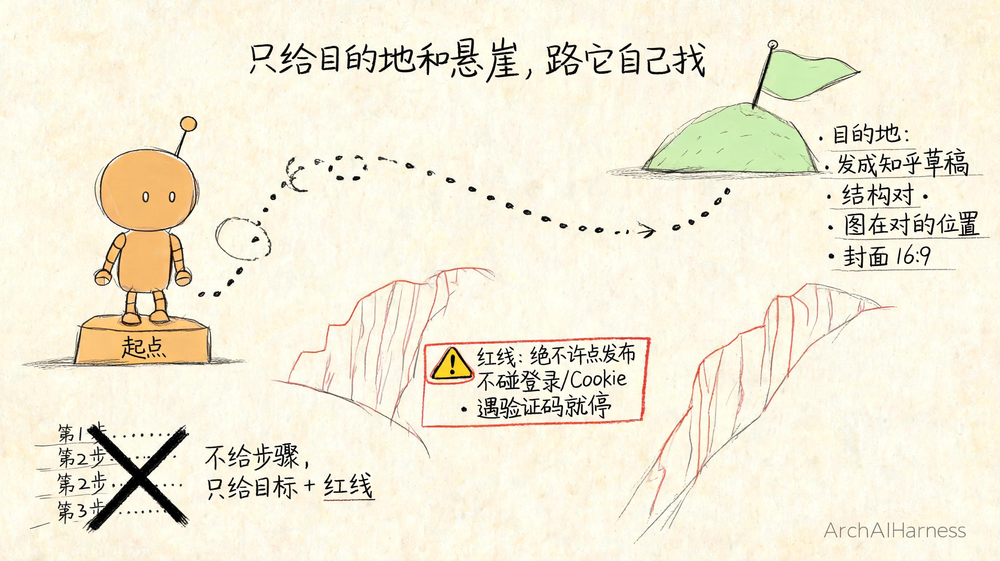
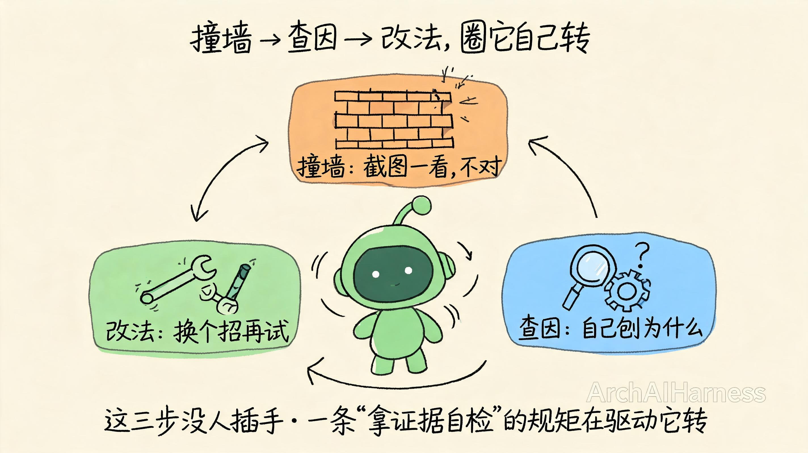
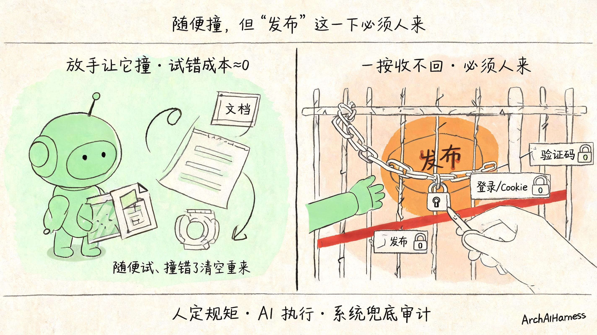

# 发文这种破事，我直接甩给 AI 了——没教它一步，只划了条红线，它自己撞出了一套手册

先说个我自己都觉得有点离谱的事实：**你正在读的这篇文章，是 AI 自己发上来的。**

我没坐下来一步步教它：先复制、再粘贴、一张张塞图、调封面、填标签——这些我一句没说。我跟它讲的大意是：你自己研究下怎么把文章发到知乎，开源社区有现成的法子，可以去翻；用浏览器打开页面，我先把账号登录好，剩下的你自己摸索。我只要一个结果——发出来得跟我期望的一样。中间遇到问题，自己查、自己修，直到弄成；弄成了，把经验总结下来，告诫自己下次怎么更快。还有一条死规矩：只许存草稿，发布我自己来，我要亲自验收。交代完，我就去干别的了。等我回来，草稿躺在那儿——标题、正文、配图位置、16:9 封面，全对。

你品品这段交代，里头没有一句是"第一步干啥、第二步干啥"。我是真把它当个工作搭子——像把一件事整个托付给一个我信得过的新人，而不是对着一个工具下十道命令。这点区别看着小，却是后面这一切能发生的起点。

更离谱的是后半句：**这套发文的本事，不是我教它的。我一行发布代码没写，一个步骤没列。** 我只给了它一个目标、一条红线，剩下的，是它自己一次次撞墙撞出来的。

所以这一篇我想跟你聊的，不是"AI 会开浏览器点点点"这件事——那不稀奇。我想聊的是那个更值钱的东西：**我到底怎么把一件烦了我很久的破事，调教到 AI 能自己摸索、自己检查、自己总结，最后沉淀成一套下次拿来就能用的方法。**

这套调教法，跟发不发文章没关系。你手上但凡有件"规矩明确、却烦人重复"的活，都能照着搬。

## 一、手把手教 AI，是个填不满的坑

我一开始，是想"教"它的。

你想想发一篇技术文章到知乎要几步：把 Markdown 弄进编辑器、等它渲染、一张张插图、插完发现位置错了再挪、设封面、填标签、选专栏……我真的坐下来，把这十几步一条条写成指令喂给它。

结果呢？第一次跑，它把 Markdown 整段粘进编辑器——满屏的 `##`、`**`、`![` 生文本，一个都没渲染。第二次我教它改用"导入"，它倒是导进去了，可图全堆在第一段。第三次图终于对了，封面又丢了。

我改一版指令、它撞一种新墙，我再改、它再撞。**更要命的是**：知乎今天能跑通的步骤，过俩月平台改个版，全废。

撞到第五六次我突然回过味来：**我这是在干一件永远干不完的事。** 平台的脾气我摸不全，它还天天变，我凭什么以为自己能替 AI 把每一步都想周全、还一直管用？

手把手教 AI 干活，听着负责，其实是个填不满的坑。

## 二、换个想法：不教它"怎么做"，只告诉它"做成什么样"

那次想通之后，我把所有教它"第一步干啥、第二步干啥"的指令，全删了。

换成两句话：

> **目标**：把这篇 Markdown 发成知乎草稿。标准是——正文结构对（几级标题就是几级）、图都在该在的位置、封面是张正经的 16:9 封面，不是正文里抠出来的某张图。
>
> **红线**：你随便试、随便撞，但**最后那一下"发布"，绝对不许你点**。还有，别碰我的登录、别碰 Cookie，遇到验证码立刻停下来喊我。

你品品这两句，跟我上一版有什么本质不同。

上一版我给的是**路**——你先走这步、再走那步。这一版我给的是**目的地和护栏**——你要到这儿，这几个地方是悬崖、绝对不能掉下去，中间的路，你自己找。

这不是偷懒，是想明白了一件事：**路是会变的（平台天天改版），目的地和悬崖是不变的。** 我把不变的东西交代死，把会变的部分交给它自己去趟——这才是能长期管用的分工。

这其实就是这个专栏从头讲到现在那句话的另一面：你把任务、边界、验收标准想清楚交给 AI，这叫给它一份说得清的"契约"。只不过这一次，契约里我特意**只写了要什么、不写怎么做**。

## 三、放它去撞第一堵墙——但不许它骗我"发好了"

定完目标和红线，我就放手了。它一头撞上了第一堵墙。

它跟大多数人一样想当然：把 Markdown 整段贴进编辑器。结果满屏生文本——知乎那个编辑器压根不解析粘进来的 Markdown。

换以前，这时候该我出手改指令了。但这次我没有。我只做了一件事：**逼它自己看清楚它干了啥。**

我给的死规矩是：**不许你看着自己的运行记录就说"我发好了"。你必须真的去看那个页面——截个图、数一数渲染出来的标题有几个、正文里还有没有没解析的 `##`——拿出证据来，再告诉我成没成。**

这一条，是整套调教里最关键的一环，没有之一。

为什么？因为 AI 有个天生的毛病：**它太容易"觉得"自己成功了。** 它在自己那边写一句"已成功导入并完成排版"，就真以为成了。可你去页面上一看，全是生文本。

所以我不许它"觉得"，我只认证据。它截了图、一数——标题数对不上、满屏 `##`——**它自己就知道这次砸了**，不用我说。

你发现没有：这一步我没教它"该怎么做对"，我只是塞给它一面镜子，逼它**自己照见自己做错了**。能看见自己错，是它能自己改对的前提。

## 四、它怎么自己爬起来：撞墙 → 查因 → 改法

照见错了之后，神奇的事情发生了——**它开始自己查原因了。**

第一堵墙（粘贴不渲染），它去翻编辑器，发现工具栏里有个"导入文档"。原来知乎这编辑器认死理：你粘贴它不认，得从"导入"那个口子把 Markdown 喂进去，它才肯渲染成正经排版。它自己改了法子，导入，成了。

紧接着撞第二堵墙：图全堆在第一段。

这个坑更隐蔽。它本来是"算好每张图该在的位置，把鼠标移过去点一下再传图"。可它自己截图一看——图怎么全挤在开头？它去刨根问底，刨出来一个特别真实的原因：**页面一滚动，它之前算好的鼠标坐标就失效了，于是每张图都怼到了同一个老地方。**

找到病根，它自己换了招：不靠"移到第几个像素"这种会飘的坐标，改成先在正文里**锚定到某一段话**（比如"插在'其实是手段'这句后面"），再把图喂进去。这下图就稳稳落在该在的地方了。

它每爬起来一次，都是同一个循环：

**撞墙**（看到不对）→ **查因**（自己刨为什么）→ **改法**（换个招再试）。

**注意，这三步从头到尾我没插手。** 我只在最开始立了一条"必须拿证据自检"的规矩，这条规矩像个发条，让它每撞一次就自动转一圈：发现错、找原因、改方法。它不是被我一步步牵着走的，是被这条规矩**驱动着自己往前滚**的。

这就是这个专栏早先聊过的那股"边想边做、做错了自己调"的劲儿——只不过这次，调的人不是我，是它自己。

## 五、关键一步：每填好一个坑，逼它写进"手册"

到这儿，它已经能把文章发对了。但故事要是停在这，它不过是"这次蒙对了"——下次重开一轮，它大概率还会再粘贴一次、再把图堆一次。

撞过的墙，得让它**记住**，才算数。

所以我又加了一条规矩：**你每填好一个坑，就把这事写下来——什么症状、为什么会这样、以后怎么避开，三句话记进一份手册里。**

于是那份手册，就一行行自己长了出来。它现在长这样（这是真的，不是我编的）：

| 症状 | 原因 | 对策 |
|---|---|---|
| 粘贴后满屏 `##`、`**` | 编辑器不解析粘贴的 Markdown | 别粘贴，走"导入文档" |
| 导入第二次，内容叠成了罗汉 | 编辑器的导入是"追加"，不是"覆盖" | 每次导入前，先把编辑器清空 |
| 所有标题都塌成同一级 | 导入文件里标题层级没弄对 | 清空重导，先把层级理对 |
| 图全堆在第一段 | 鼠标坐标滚动后就失效了 | 不用坐标，锚定到某段话再插图 |
| 点了"图片"按钮，后面每步都卡死超时 | 那个按钮会弹个浮层，挡住后续所有点击 | 干脆别点它，把图直接喂进去 |
| 封面变成了正文里的某张图 | 重新导入会把正文第一张图当封面 | 单独再传一次真正的封面图 |

你盯着这张表看一会儿，会反应过来一件事：**这张表，没有一行是我写的。** 每一行，都是它真撞过那堵墙、真栽过那个跟头，自己总结出来的。

而且——它记的早就不只是"症状和对策"这种流水账了。我挑几条它后来悟出来的东西给你看看，你品品这味儿对不对：

- 它发现知乎那个"图片"按钮一点，就弹出个浮层，这浮层会**悄悄挡住它后面想点的任何地方**，导致一连串操作莫名其妙地卡死超时。它琢磨明白之后，干脆**绕开这个按钮不点了**——直接把图片文件喂进页面里那个看不见的上传口子。这已经不是"记录哪一步会出错"，是**搞懂了出错背后的机关，然后从根上避开它**。
- 它还发现，页面上那些元素的"名字"（class）是**会变的**——今天叫这个，平台一更新就叫那个。所以它不靠名字去找上传口子，改成靠"这个口子接收什么类型的文件"来认。**它自己想到了平台会变，提前把自己的法子做得不怕变。** 这种"防着以后"的心思，我可没教过它。
- 还有一条特别像老手：**操作一旦超时，它不许自己瞎重试。** 它给自己定的规矩是先停下来、看清楚现在卡在哪、只补上真正缺的那一下——因为它撞过"一慌就瞎点、结果越点越乱"的亏。

这已经不是"记笔记"了，这是**悟**。一个新人栽过几次跟头之后，开始琢磨"这事背后到底什么道理""下次怎么从根上躲开""平台要是变了我怎么办"——这就是经验在一个人身上长出来的样子。只不过这次，长经验的是它。

更妙的是，这份它自己写的手册是**摊在明面上的**——它就躺在我那套公开的工具库里，任何人都能翻开看：每一条规矩对应它当年撞过的哪堵墙、栽过的哪个跟头。你看到的不是一份冷冰冰的说明书，是一个 AI 一路磕磕绊绊长大的成长档案。

这跟一个新人成长是一模一样的：光做对一次不算本事，**把"我当时怎么栽的、后来怎么爬起来的"记成自己的笔记，下次照着躲开，那才叫长本事。** 我做的，只是逼它养成了"栽完必须记笔记"这个习惯。

## 六、那道焊死的闸：可以随便撞，但"发布"这一下必须我来

讲到这你可能有点担心：你让一个 AI 在真实的发布后台里"随便撞、随便试"，它要是手一抖，把没弄完的草稿真发出去了呢？

问得好。这正是我一开始就划那条红线的原因。

**"随便试"是有边界的——边界就是：凡是会造成真实后果、收不回来的动作，绝对不许它自己碰。**

具体到发文章，这套发布能力被我焊死了几条铁律，它再怎么试错也越不过去：

- **最后那一下"发布"，永远停在我手上。** 它能把草稿准备得妥妥的，但点不点"发布"，是我的事，不是它的事。
- **不碰登录、不碰 Cookie、不碰密码。** 这些是钥匙，钥匙的事跟它没关系。
- **一遇到验证码、安全验证、异常提示，立刻停下喊我。** 不许它自作主张去绕。

你看出这里的分寸了吗？**我鼓励它在"改改排版、挪挪图、换个插入方法"这种试错成本几乎为零的地方放开了撞**——撞错了大不了清空重来，没人受伤。**但在"真发布出去"这种一按就收不回的地方，我一步都不让它自己做主。**

这就是这个专栏一路反复念叨的那句话，落到了最该落的地方：**人定规矩，AI 执行，系统兜底审计。** 让它自己试错、自己成长，是为了它能干活；把危险动作的闸焊死在我手上，是为了它再怎么折腾也闯不出大祸。一个你敢真正放手的 AI，靠的从来不是它有多稳，而是**哪怕它失手，最坏的结果你也兜得住。**

## 七、下次一遍过：经验沉淀成它自己能读的"说明书"

现在回到开头那个"离谱"的事实，我可以把它说清楚了。

它撞了那么多次墙、记了那么多条笔记，这些笔记最后没躺在我脑子里，也没躺在某个我会忘记的文档里——而是变成了一份**它自己每次干活前都会先翻一遍的说明书**。

于是从某一次开始，发文章这件事就变样了：我不用再盯着它撞了。我说一句"发到知乎草稿、别点发布"，它自己翻出那份手册，照着躲开所有它撞过的坑——不粘贴改导入、先理层级、锚定插图、单独传封面、最后停在发布前等我——一遍过。

**一次摸索，永久复用。** 这就是"它自己撞出一套手册"最值钱的地方：经验不是一次性的，是攒下来的资产。撞过的墙越多，它越熟练；而我，越来越不用管。

到这你大概也回过味来了：换个平台，比如 CSDN、掘金，它得重新摸一遍脾气吗？**得，但用的是同一套办法。** CSDN 的编辑器跟知乎完全是两个性子——它甚至同时存在两套不同的编辑器界面，AI 得先探一探当前是哪一套，再决定怎么把正文喂进去。脾气不一样，可"撞墙→查因→改法→记进手册"这套调教法，一模一样。摸熟一个平台，就多一份手册；多一份手册，就多一个我再也不用操心的地方。

说到这我得交代一句：这套发布的本事不是演示给你看的 demo——**它现在就在替我干真活。** 这个专栏的文章往知乎、CSDN、掘金上发，走的就是这套它自己摸出来的流程。你正在读的这一篇，也是它发的。

## 八、写在最后

回到开头那件离谱的事：一篇文章，AI 自己发的，而发文的本事不是我教的。

拆到这儿你会发现，这背后其实就五个动作，跟发文章没什么关系，搬到任何"规矩明确、却烦人重复"的活上都管用：

- 不给它步骤，**只给它一个目标和一条红线**；
- 逼它**拿证据自检**，不许它"觉得"自己成了；
- 撞了墙不喂答案，**让它自己刨原因、自己改法子**；
- 每填好一个坑，**逼它把"症状、原因、对策"记成笔记**；
- 把笔记沉淀成**它下次能自己读的说明书**，一次摸索、永久复用。

你品这五步，没有一步需要你会编程。它们考的不是技术，是另一种东西：你能不能把"什么算干成了、哪儿绝对不能碰、栽了该怎么记账"想清楚。**想清楚了讲给 AI，它能自己长本事；想不清楚，你给它再详尽的步骤，平台一改版就全白搭。**

这其实是这个专栏一路聊下来那句话的又一层意思。以前我们说"人立法、AI 执行"，好像人得把每一条法都写满。可这一篇你看到的是：**人只需要立住目标和红线这两条根本的法，剩下那些琐碎的、易变的执行细节，AI 完全可以自己试错、自己总结、自己立成规矩。** 人管不变的，AI 趟会变的——这才是真能省心的合作。

未来真正会用 AI 的人，不一定是把每一步都替它想好、喂到嘴边的人，而是那种能把目标和底线划得干净利落、然后敢放手让它自己去撞、去长本事的人。你负责定方向和红线，它负责在里头摸爬滚打攒经验——这俩搭一块儿，你才能把越来越多的破事，真正甩出去。

说到底，开头那件事之所以能发生，不是因为我有多信 AI、敢闭着眼把活一扔了之。恰恰相反——**我敢放手，是因为我先把秩序立住了**：目标划得清清楚楚，红线焊得死死的，还逼着它每一步都拿证据自检。是这套秩序在底下兜着，我才敢把它当搭子，放它去撞、去栽、去自己爬起来。

你要是规矩都没立就把活全甩给它，那不叫信任，叫撒手不管，迟早出事；可你要是先把"我要什么、什么绝对不能碰、怎么才算干成了"这套秩序立明白，再放手让它在里头摸爬滚打，它既能自己长本事，又闯不出大祸。所以这事的关键从来不是你有多信任 AI，是你有没有本事先给它立一套它撞不破的秩序——**人把秩序立住，AI 才能在秩序里放心生长。** 信任不是你撒的手，是你立的规矩替你兜的底。

下一篇，咱们把场景换得更大一点。到这儿为止，这个能干活、能自己长本事的 AI 搭子，一直只活在我自己这一台电脑、这一个文件夹里——关掉就没了，也只有我一个人用得上。可要是想让它像个真正的服务那样：开机就在、谁登录进来都能有一个属于自己的搭子，得先给它配一副标准化的"身体"，再配一个能按人把它一个个调度起来的"大脑"。这事怎么搭？咱们下篇见。

---

### 关于 ArchAIHarness

这篇文章是「看懂 AI 与智能体」专栏的一部分，由 [**ArchAIHarness**](https://github.com/ArchAIHarness) 持续输出。

ArchAIHarness 是一套面向 AI 时代软件工程的人机协同架构哲学与公开工程资产，主张：

> **架构师定义秩序，AI 在秩序中生长。人立法，AI 执行，体系审计。**

如果你也希望 AI 在明确的架构边界内协作，而不是在混沌中碰运气，欢迎到 GitHub 上看看我们在做什么：

- **组织主页**：[github.com/ArchAIHarness](https://github.com/ArchAIHarness) — 了解完整理念与资产全景
- **本专栏**：[`zhuanlan-ai-and-agents`](https://github.com/ArchAIHarness/zhuanlan-ai-and-agents) — 所有文章的源码与发布记录
- **实践指南**：[`docs`](https://github.com/ArchAIHarness/docs) — 架构哲学、工程方法和落地指南
- **开源工具**：[`agent-workflows`](https://github.com/ArchAIHarness/agent-workflows) — 可复用的 AI 协作 Agents、Skills 与 Tools，本文那套发布手册就在这里
- **工程样例**：[`framework`](https://github.com/ArchAIHarness/framework) — DDD + AI 协作的工程底座，展示如何在开发中融合 AI

> Engineered by Architects · Empowered by AI · Audited by Discipline
