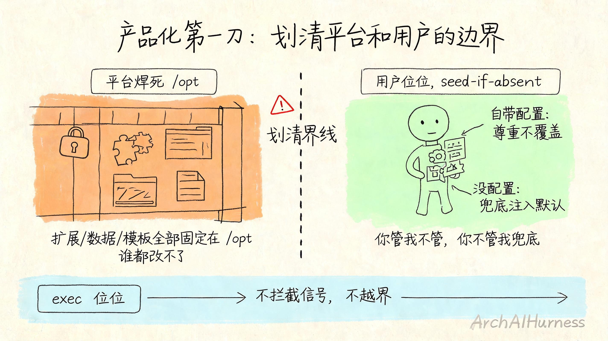
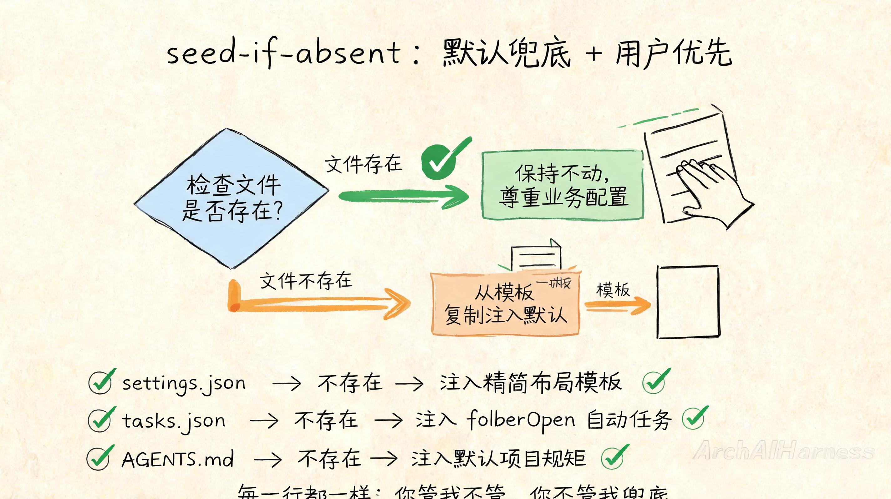
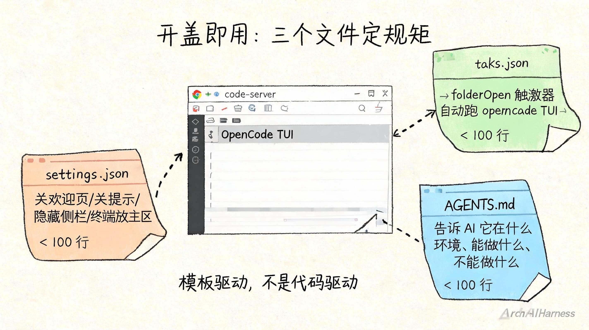

# 我把 AI 搭子封成了罐头——没自己造一个零件，只划了一条线

前面几篇我们把 AI 搭子从"只会聊天"养到了"能自己学会发文章"。可一直有个事梗在那儿：**这个搭子只活在我自己这台电脑上。** 换台机器就没了，给别人也用不了。

这不是一个人遇到的问题。你帮团队配好了一套 AI 工作流、攒了一整套规矩和工具——换个人来就从头再来一遍。不是每次都要重新教，是**那个装着搭子的环境搬不走**。

所以这一篇我想跟你聊的，不是怎么搭一个 AI 搭子（那前面几篇已经干完了），是另一件事：**怎么把这个只属于你一个人的搭子，封成一个标准化的、开箱即用的、换台机器还一模一样的——"罐头"。**

而封罐头这件事，技术含量不在"怎么封进去"，在另一件事上：**你划不划得清那条线——哪些是罐头厂焊死的、哪些是开罐人说了算的。** 这一刀，是产品化设计的第一刀。



## 一、"能跑"和"能给别人用"之间差着一刀

我们团队之前有个 AI 助手，内部跑得好好的。可要推到别的组去用，每来一个新成员就要折腾一轮：装 VS Code、装 OpenCode、配 Node.js 、拉插件、配工作目录、配规矩……光环境就折腾半天。而且 A 的配置和 B 的配置永远不完全一样——因为每个人都会按自己习惯调。

你发现问题的根了吗？**我们一直在做同一件事：把搭子出生的"环境"手动复刻到每台机器上。** 每复刻一次就多一次不一致的风险，而且效率极低——从这个组推到那个组、从一个人推到一百个人，人力成本是线性增长的。

我停下来想了一件事：**这问题的解不是"复刻环境"，而是"把搭子装进一个罐头"——开盖即用，打开什么样、谁打开都一样。** 就像超市里的罐头：你买回家打开，里面的东西是一样的，不会因为是你开的就不同。

这个念头一转，我发现自己问错了问题。不该问"怎么把这个人的环境复制给那个人"，该问另一个问题。

## 二、产品化设计的第一刀：划清一条线

所有"把一个东西标准化给别人用"，本质都是一个设计问题：**哪些是我的地盘我管死，哪些是用户的地盘我让出去。**

拿罐头来说——罐头里装什么、怎么装、保质期多久，是罐头厂说了算的（管死）；但什么时候开、怎么吃、配什么菜，是开罐人说了算的（让出去）。生产标准归你，使用方式归他。就这一刀。

我的 AI 搭子要标准化，就得先划这条线：

- **必须我自己焊死的**：编辑器本体、插件、OpenCode 运行时、默认呈现方式——这些变了，搭子就不是那个搭子了。
- **必须让用户掌控的**：工作区文件、用户配置、自定义规矩——这些都是用户自己的东西，我替用户做主就是越界。
- **灰色地带**：默认模板——用户没有这个文件时给一个最精简可用的，但用户只要自己配了，立刻让位。

这个问题想清楚，实现反而很薄。因为不需要从头造任何东西——**已经有巨人站好了，我只需要爬上去划那条线。**

## 三、三个开源巨人，我只写一层胶水

讲具体实现之前，先说个你可能更关心的事实：**我没写一行编辑器代码，没写一行 OpenCode 内核代码，没写一行插件市场代码。**

我站在三个现成的东西上：

- **code-server**（codercom 的开源项目）——把 VS Code 网页版完好地封装成一个容器镜像。自带 entrypoint、dumb-init 进程管理、鉴权开关。我一行编辑器代码没写。
- **OpenCode**（opencode.ai 的开源项目）——CLI 全局安装 + VS Code 插件，给这个"工位"配上真正的 AI 搭子运行时。我一行 Agent 内核没写。
- **open-vsx 插件市场**——社区维护的开源 VS Code 扩展市场，离线下载插件 vsix 包。我一行商店代码没写。

三个巨人，我一个都没重新造。**我做的事情只有一件：写了一个 Dockerfile 把三个巨人装在一起 + 写了一个 entrypoint.sh 划那条线。** 这就是设计——设计不是"从零到一写什么"，是"从一到十怎么组合、怎么划界"。

我接下来把这层很薄的胶水掰碎了给你看。你可能不写 Docker、不做镜像，但**这套"划界"的设计思维，能搬到任何产品化场景里。** 因为它不是在教你怎么封住一个东西，是在教你怎么想清楚"什么东西归平台、什么东西归用户"。

## 四、第一层秩序：平台的地盘焊死，谁都改不了

先说我定的第一条规矩。这句话直接写进了代码：

**扩展目录、用户数据目录、配置模板，全部焊死在 `/opt`。业务挂载工作目录或家目录，也动不了它。**

为什么要这么较真？

容器化有个经典坑：你默认把插件装在 `~/.vscode/extensions`，用户挂载了自己的家目录——插件没了。或者你把配置放在工作目录里，用户挂载了另一个项目——全部乱套。

我的解决方案特别"笨"：把所有搭子运转必须的东西，全部塞进一个目录 `/opt/code-server/`，然后用环境变量把业务"请出"这个区域：

```
EXTENSIONS_DIR=/opt/code-server/extensions
USER_DATA_DIR=/opt/code-server/user-data
TEMPLATE_DIR=/opt/code-server/templates
```

前两个很好理解：扩展和数据。第三个可能你没想到——我把**三份模板文件**也固化在这里：`settings.json`（界面布局模板）、`tasks.json`（自动启动 OpenCode 的任务模板）、`AGENTS.md`（项目规矩模板）、`opencode.json`（OpenCode 配置模板）。

这意味着什么？

意味着不管用户怎么挂载他的工作目录、怎么替换家目录，**搭子的编辑器本体、插件、默认数据、配置模板，一样都不会丢**。这就是平台的地盘——你管不了、我焊死了，谁来了都一样。

但这不是全部。另一个更重要的原因我放在下一节说。

## 五、第二层秩序：seed-if-absent，用户的事让用户做主

你可以想一下：如果镜像里把所有的配置都写死了——用户一启动，全部用我的设置，那他自己的配置放哪儿？

所以第二条规矩是：**默认注入，但你只要自己带了，我立刻让位。**

这句话落到代码里就是 entrypoint.sh 里反复出现的同一个模式：

```bash
seed_user_settings() {
    local user_dir="${USER_DATA_DIR}/User"
    mkdir -p "${user_dir}"
    if [ ! -f "${user_dir}/settings.json" ]; then
        log "seeding default settings.json -> ${user_dir}"
        cp "${TEMPLATE_DIR}/settings.json" "${user_dir}/settings.json"
    else
        log "settings.json exists, keep business config"
    }
}
```

每一行都在说同一件事：**文件存在就不覆盖，不存在才注入默认。**

工作目录的 AGENTS.md 是 seed-if-absent，.opencode/opencode.json 是 seed-if-absent，.vscode/tasks.json 也是。**每一条都是"你管我不管、你不管我兜底"。**

这才是"划地盘"的另一半——你划清了什么归平台，还要划清楚什么归用户。不是"我塞给你的你都接着"，是**我给你一个可用的默认，但你只要自己配了，你说的算。**

我见过太多产品化案例做反了的：要么压死用户的配置空间（满世界都是硬编码），要么什么都不帮用户配（开箱白屏）。真正的设计在这两者之间——**默认兜底 + 用户优先。**

这一层设计思想，拿到任何"给别人用"的场景都通：脚手架工具、配置管理器、CI/CD 模板库。核心就是同样的四个字：**seed-if-absent**。你记住这四个字，比记住我的 Dockerfile 值钱得多。



## 六、第三层秩序：exec 让位，不越界

前两层一个焊死地盘、一个让出用户空间，第三层是给我自己定的规矩。

entrypoint.sh 最后的启动是这样写的：

```bash
ARGS=(...)
exec /usr/bin/entrypoint.sh "${ARGS[@]}"
```

注意是 `exec`——它把进程控制权交给 code-server 的官方 entrypoint，而不是自己包一层、拦截信号、做额外处理。

这意味着什么？code-server 官方的 dumb-init、信号处理、存活检测全部原样透传。**我不自作主张截断任何东西。**

这一层就一句话：**把自己当成一层很薄的胶水，别把胶水当成平台。**

产品化设计里最容易犯的错就是：你做了第一层封装，觉得还不够，再加一层，再加一层——最后用户拿到的根本不是那个原汁原味的东西。但如果你能忍住，在最薄的地方停下来——提供一个标准化的"身体"，不碰用户怎么用这个身体、不碰鉴权、不碰编排——那你做的东西才是真正让别人用得放心的。

## 七、开盖即用的"呈现"：三个文件定的规矩

好了，地盘划完了。但用户最直观的感受不是地盘划得多清楚——他打开页面第一眼看到什么，才是他判断"这个好不好用"的标准。

这一篇我要做到一句话：**打开浏览器，登录进去，什么也不用点——OpenCode TUI 已经在主编辑区等着你了，界面最精简、没有多余的侧边栏。**

为了做到这一句，我只写了三个小文件：

1. **`code-server-settings.json`**（20 行）：关掉欢迎页、关掉教程、关掉提示、关掉更新提醒、把终端放到主编辑区、把 CHAT 副边栏默认隐藏。
2. **`tasks.json`**（20 行）：声明一个"folderOpen"任务——工作区一打开，自动在终端跑 `opencode` 命令。`isBackground: true` 让它常驻后台，`presentation.focus: true` 让它一启动就把焦点给到 OpenCode TUI。
3. **`AGENTS.md`**（40 行）：这是 OpenCode 读取的规矩文件，告诉 AI 助手它运行在什么环境里、能做什么、绝对不能做什么。

三份文件加起来不到一百行，就是全部"开箱即用"的工作量。



你品品这个设计思路：**我没有写代码去"调"界面的那个瞬间，而是写好模板，让模板在启动时自动生效。** 模板驱动而不是代码驱动——这是"开盖即用"产品化的核心思路。因为模板是可替换的、可维护的、可复用的——业务想改呈现方式，改模板就行，不用改我那一堆胶水代码。

## 八、写在最后

回到最开始那件让我纠结的事：一个人能用的 AI 搭子，怎么变成谁都能有一个的标准件？

技术上的答案是：封成一个镜像。但真正的答案是：**先想清楚那条线划在哪——哪些焊死归我、哪些让出去归用户、哪些默认兜底但不抢位。**

我站在三个开源巨人肩膀上，只写了一层很薄的胶水（一个 Dockerfile + 一个 entrypoint.sh）。**设计真正的功夫，不在你写了多少，在你有没有想清楚什么不该写。**

往后你看任何"产品化"的工作——把一个工具打包给团队用、把一个配置模版化给新人用、把一个流程标准化给别人复刻——都可以用这一套"划地盘"的思维去拆：

- 平台焊死的边界在哪？（什么变了搭子就不是那个搭子了）
- 用户做主的边界在哪？（什么必须让用户自己说了算）
- 默认兜底的开关在哪？（什么情况下给默认、什么情况下让位）

这三刀想清楚，你的"罐头"就封好了。

这一篇我们封好了搭子的"标准身体"。可它现在还是被动的——没有人去叫它，它不会自己醒来。下一篇，我们给这个身体装一个"大脑"——一个能在你发出请求的瞬间，自动调度一个属于你的搭子实例出来、用完再收回去的调度引擎。**一百个人同时要 AI 搭子，谁说了算？** 咱们下篇见。

---

### 关于 ArchAIHarness

这篇文章是「看懂 AI 与智能体」专栏的一部分，由 [**ArchAIHarness**](https://github.com/ArchAIHarness) 持续输出。

ArchAIHarness 是一套面向 AI 时代软件工程的人机协同架构哲学与公开工程资产，主张：

> **架构师定义秩序，AI 在秩序中生长。人立法，AI 执行，体系审计。**

如果你也希望 AI 在明确的架构边界内协作，而不是在混沌中碰运气，欢迎到 GitHub 上看看我们在做什么：

- **组织主页**：[github.com/ArchAIHarness](https://github.com/ArchAIHarness) — 了解完整理念与资产全景
- **本专栏**：[`zhuanlan-ai-and-agents`](https://github.com/ArchAIHarness/zhuanlan-ai-and-agents) — 所有文章的源码与发布记录
- **实践指南**：[`docs`](https://github.com/ArchAIHarness/docs) — 架构哲学、工程方法和落地指南
- **开源工具**：[`agent-workflows`](https://github.com/ArchAIHarness/agent-workflows) — 可复用的 AI 协作 Agents、Skills 与 Tools
- **工程样例**：[`framework`](https://github.com/ArchAIHarness/framework) — DDD + AI 协作的工程底座，展示如何在开发中融合 AI
- **本镜像**：[`build-on-vscode-opencode-image`](https://github.com/ArchAIHarness/build-on-vscode-opencode-image) — 本文封装的"标准身体"，把 VS Code 网页版 + OpenCode 打成开箱即用的容器镜像

> Engineered by Architects · Empowered by AI · Audited by Discipline
