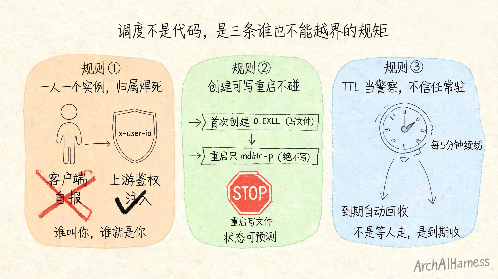
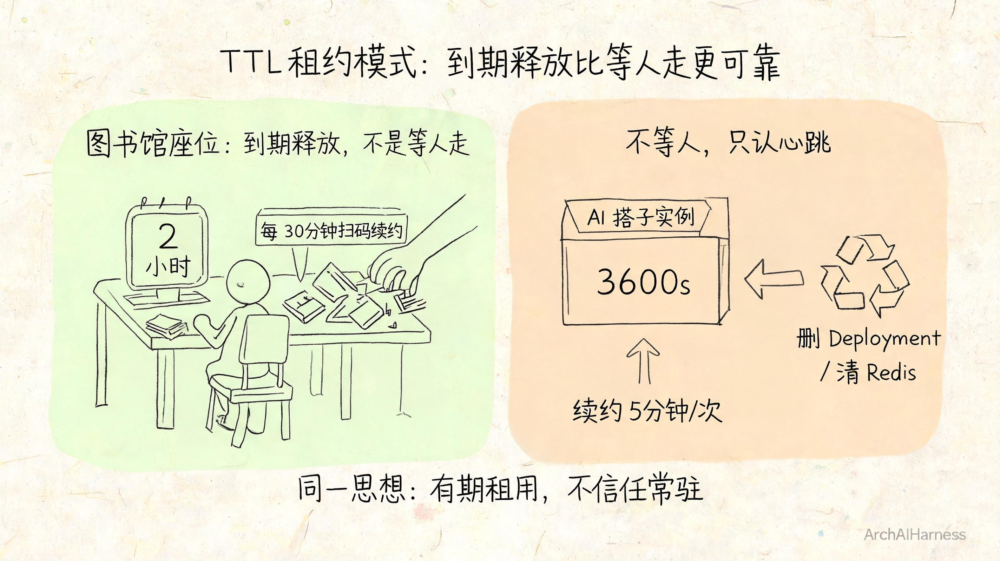
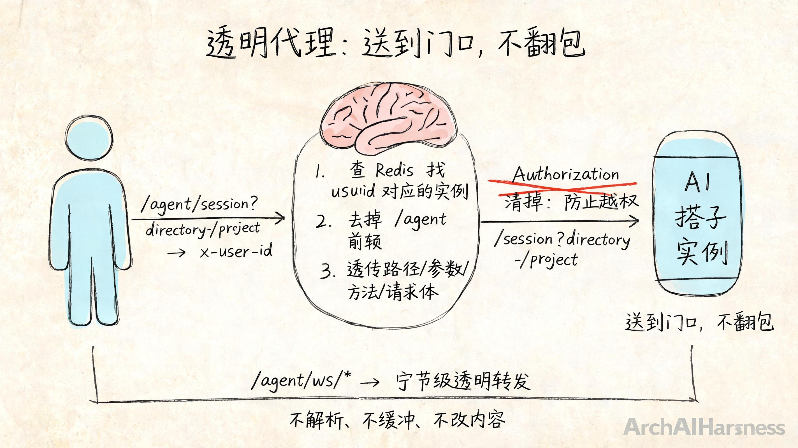

# 一百个人同时要 AI 搭子，谁说了算？——我写了个调度大脑，但真正的设计是三条死规矩

前一篇我们把 AI 搭子封成了一个标准化的"罐头"——开盖即用，谁打开都有。可你很快会遇到一个新问题：**一百个人同时打开罐头呢？**

不是技术上的"并发处理不过来"——是更本质的问题：谁来管谁什么时候能有搭子、用完了谁收、一个用户能在多少台机器上同时开着、怎么知道他还用不用、用完了资源给谁腾出来。

这不是你写几行调度代码能解决的事。这是一个**治理问题**——你怎么给"一群人要同时用搭子"这件事立一套秩序。

所以我写了一个"大脑"（一个叫 `agent-master` 的控制面服务）。但这一篇我不想跟你聊这个服务本身——我想跟你聊的是它背后的**三条设计规矩**。因为这三条规矩，才是真正的设计。没有它们，调度代码不值钱。

## 一、调度这件事，本质是管三件事

在动任何代码之前，我先问了自己三个问题：

1. **一个搭子归谁？**——两个人同时请求，是开两个实例还是复用同一个？我怎么认出"是谁在要"？
2. **什么时候能碰文件？什么时候绝对不能碰？**——第一次给一个用户开搭子，和它掉线了重新拉起来，操作能一样吗？
3. **用完了谁管收？**——用户关掉页面直接走了，那个运行着的搭子谁来关、什么时候关？

你仔细看这三个问题，没有一个是"写调度代码"能回答的。它们问的是**边界、状态和责任**——这是设计，不是实现。

想清楚了这三条，我才开始落在 Kubernetes 和 Redis 上。你让我把这三条掰碎了讲给你听。

## 二、第一条规矩：一人一个实例，归属焊死

第一条：**以一个用户为最基本的调度单位。一个用户始终只有一个活跃的 AI 搭子实例。**

这意味着什么？如果你在 A 电脑和 B 电脑上同时登录，后者会把前者的实例"顶掉"——而不是给你开两个。你的搭子始终跟着你的身份走，不跟着你的设备走。

这个选择，否决了别的选择：比如"一个会话开一个实例"（那一个人开三个标签页就有了三个搭子，各聊各的，自己跟自己打架）、"一个任务开一个实例"（频繁创建销毁，成本极高）。

怎么实现的？服务端不信任客户端自己报的身份。上游网关做完鉴权后，在请求 Header 里写死 `x-user-id`，服务端以此为唯一索引去 Redis 里查这个用户有没有正在运行的实例。`x-user-id` 缺失或空，直接拒绝。WebSocket 连接也要通过 query 或子协议传同样的 id 才能连上。**谁叫你，谁就是你的——不认客户端自己说的身份。**

这一条秩序，把"归属"这个最基本的问题焊死了。调度调度的从来不是机器，是人。想清楚"调度单位是什么"，比想清楚"怎么调度"重要一万倍。

## 三、第二条规矩：第一次创建才写文件，重启绝不碰

第二条更微妙。它管的是"状态什么时候能被改变"。

一个用户第一次请求搭子，系统要干的事情很多：创建目录、挂载 NAS 持久化空间、从模板拷贝 AGENTS.md 和 opencode.json、设权限——然后才发起 Kubernetes Deployment。

但如果这个用户之前已经有过搭子，只是 Pod 挂了需要重启——**流程完全不一样。** 重启时只做一件事：确认目录存在。**绝不写任何文件。**

AGENTS.md 即使丢了也不重新创建？对，不创建。opencode.json 即使没了也不重新写入？对，不写入。**重启就是重启，不是初始化。**

为什么要这么严格？因为一旦重启流程也可以写文件，就会引入一种极其隐蔽的 bug：用户的配置更新了（比如升级了 AGENTS.md），重启又被"覆盖"成旧的了。或者反过来，你写在重启流程里的逻辑和首次创建的逻辑冲突了——同一个用户的第一次和第二次启动，行为不一致。

这条规矩落到代码里写着就一句话：**首次创建用 `O_EXCL` 模式写文件（不存在才创建），重启只 `mkdir -p`。** 但这一条路，是设计里最难想明白的那一层——你想清楚了"什么状态下能做什么操作"，你的系统才是可预测的。

我把这条规矩也掰碎了写在服务端的文档里（`AGENTS.md` 里专门有一整节讲这个），因为这是新来的人最容易弄混的地方——他以为重启时顺手补一个文件没什么大不了，其实这一下就把"状态确定性"砸了。

## 四、第三条规矩：租约当警察，不信任任何常驻

第三条管的是"用完了谁收"。

用户打开搭子界面、用着、然后用完直接关了浏览器——或者网络断了，或者关机了。那个在 Kubernetes 上跑着的 AI 搭子 Pod 不会知道你走了。它还在那跑着、占着资源、等着你回来。

传统思路是"等用户发一个关机的信号再回收"。但这个方案有根本缺陷：你信不过那个信号。用户网络断了发不过来、浏览器崩溃了没发出去、恶意客户端假装发了但你收不到——你这个"大脑"就被动地等着一个可能永远不会来的信号。

所以我们换了一个思路：**所有搭子都是"有期"的。**

每个实例创建时配一个 TTL（生存时间），比如 3600 秒。实例必须在 TTL 内持续"续约"（告诉大脑"我还在用"），如果超过 TTL 没续约——**大脑自动回收这个实例，删 Deployment、清 Redis 映射，一个不留。**

用户真正在用的场景下，续约是 5 分钟一次的固定心跳，不会断。但用户走了、网络断了，心跳断了——TTL 一到期立刻回收。**大脑不等人，它只认心跳。**

这就像图书馆的座位管理系统：你扫了码坐下，系统给你 2 小时。你每 30 分钟刷一次码续时间，座位一直是你的。但你走了没续——时间一到，座位自动释放给下一个人。**不是"等人走了再收"，是"到期了收、你还在用就续"。** 这个区别，就是产品化调度和随缘调度的分水岭。

## 五、三个巨人打底，我只写编排和规矩

这三条规矩立住了，我只用站在三个开源巨人肩膀上，写一层很薄的调度胶水：

- **Kubernetes**：它负责把 Deployment 开出来、重启、健康检查、Service 接入。我只是告诉它"这个用户要一个搭子"，剩下的 Pod 怎么跑、怎么活、怎么重启——我不管，交给 K8s 这个巨人。
- **Redis**：它负责存实例的状态映射、租约、TTL。我只是读写 `agent-runtime:user:{userId}` 这个 Key，过期自动删除靠 Redis 的 TTL 机制。我不写状态管理引擎，Redis 就是状态管理引擎。
- **Fastify**（Node.js web 框架）：它负责接收请求、路由、插件化——大部分是胶水工作，真正的后台逻辑是 port/adapter 模式隔离开的，可以随时换巨人。

你看，又是同一个模式：**不自己造底座，爬到巨人肩膀上再划界。** 上一篇封罐头是这样，这一篇装大脑也是。

## 六、透明的边界：/agent/* 透传，不篡改

用户调过来了，找到了属于他的搭子实例——接下来"大脑"怎么把请求交给具体那个搭子？

我的设计原则就一句话：**透明代理，不篡改。**

具体到代码里就是：把请求路径的 `/agent` 前缀去掉，把剩下的路径、查询参数、HTTP 方法和请求体一次全部转发给 Target Service。不做任何拦截、修改、注入或缓存。

这跟"划地盘"的思路是一脉相承的——**我把你送到搭子门口，你自己推门进去。我不在门口翻你的包。**

但有一个例外：我清掉了一个 Header——`Authorization`。因为用户的鉴权在上游网关已经做完了，我把这个 Header 清掉，不让它被透传到 Agent 容器内部，避免 Agent 拿到一个"不该它用的凭证"去做越权的事。**这不是篡改用户请求，是替用户守一道安全门。**

同样的逻辑也用在 WebSocket 代理上：字节级透明转发，不发源于大脑内的任何帧。不解析、不缓冲、不改内容。只是把用户的字节流一分为二——它来的方向发到搭子方向，搭子方向发回用户方向。

这背后的设计思路跟上面三条规矩是一样的：**明确边界。大脑只负责把人送到，不负责人在里面做什么。**

## 七、写在最后

你仔细想想这一篇，跟上一篇封"罐头"的思路是一模一样的：

上一篇我们问的是"哪些归平台、哪些归用户"，划了三条地盘的线把它做成镜像。
这一篇我们问的是"归属怎么定、状态谁能改、资源怎么收"，定下三条死规矩把它做成调度。

**技术只是执行，设计才是决定系统好坏的那一刀。** 这一刀下去，不是切代码，是切责任边界——谁管什么、什么情况下能做什么、什么情况下绝不能做。这几件事想清楚了，用什么技术去落地只是选工具的事。

站在开源巨人肩膀上不是为了偷懒，是为了把精力省出来——不用从零造底座，可以从容想清楚那几道关键的线怎么划。

---

### 关于 ArchAIHarness

这篇文章是「看懂 AI 与智能体」专栏的一部分，由 [**ArchAIHarness**](https://github.com/ArchAIHarness) 持续输出。

ArchAIHarness 是一套面向 AI 时代软件工程的人机协同架构哲学与公开工程资产，主张：

> **架构师定义秩序，AI 在秩序中生长。人立法，AI 执行，体系审计。**

如果你也希望 AI 在明确的架构边界内协作，而不是在混沌中碰运气，欢迎到 GitHub 上看看我们在做什么：

- **组织主页**：[github.com/ArchAIHarness](https://github.com/ArchAIHarness) — 了解完整理念与资产全景
- **本专栏**：[`zhuanlan-ai-and-agents`](https://github.com/ArchAIHarness/zhuanlan-ai-and-agents) — 所有文章的源码与发布记录
- **实践指南**：[`docs`](https://github.com/ArchAIHarness/docs) — 架构哲学、工程方法和落地指南
- **开源工具**：[`agent-workflows`](https://github.com/ArchAIHarness/agent-workflows) — 可复用的 AI 协作 Agents、Skills 与 Tools
- **调度引擎**：[`agent-master`](https://github.com/ArchAIHarness/agent-master) — 本文讲的"调度大脑"，把单机 AI 搭子变成云上可服务化的控制面
- **标准镜像**：[`build-on-vscode-opencode-image`](https://github.com/ArchAIHarness/build-on-vscode-opencode-image) — 被调度的"标准身体"，VS Code 网页版 + OpenCode 的开箱即用容器镜像

> Engineered by Architects · Empowered by AI · Audited by Discipline
