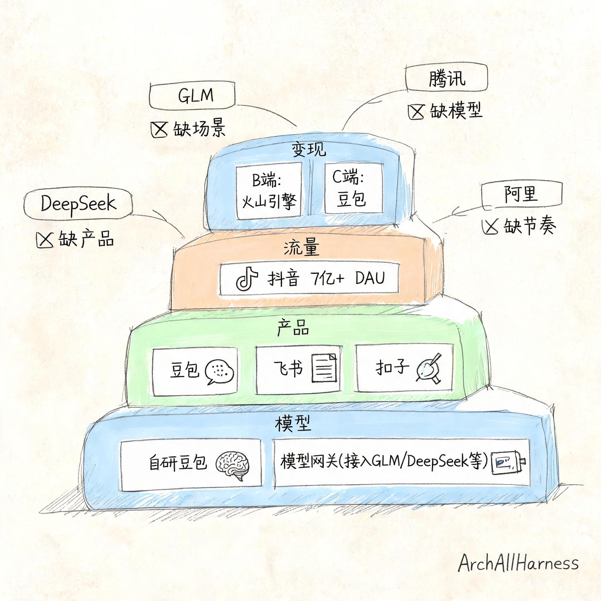
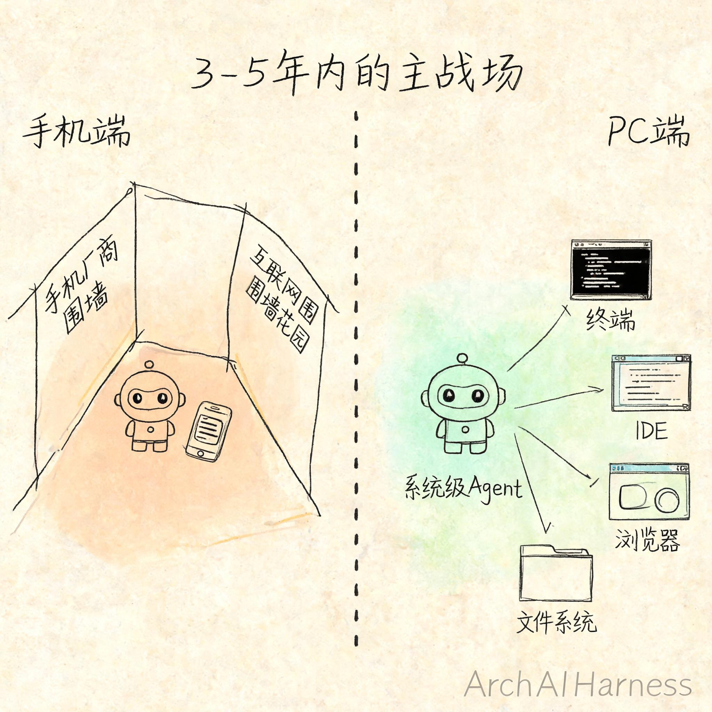
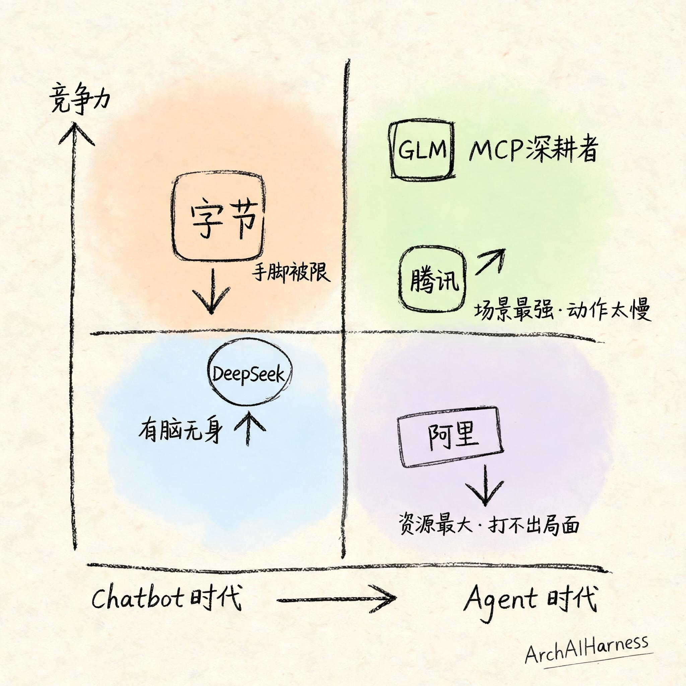
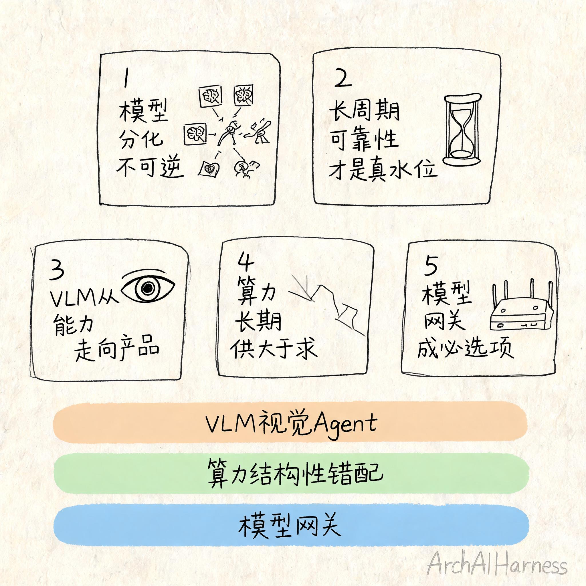

# 国内AI大模型格局重塑：从Chatbot到Agent，赢家换了

你有没有发现，去年选模型还很简单——看跑分，谁高用谁。今年已经看不懂了：有的模型编码最强、有的适合长文本、有的多模态第一，还有人告诉你"别只看模型，要看平台"。

不是选择变多了，是**底层的竞争规则变了**。

2024-2025 年 AI 竞争的核心是 Chatbot——谁的产品好用、流量大、能变现，谁就赢。但 2026 年起，竞争的核心正在切换到 Agent——谁能让 AI 真正替你干活，谁才站得住。

**Chatbot 时代的赢家，在 Agent 时代不一定还能赢。**

这不是一个渐进的演变，是一次牌桌级别的切换。

## 一、模型开始有"个性"

先说一个最基础的变化：模型本身不再是同质化的跑分工具了。

2024-2025 年各家模型像是在参加同一场考试，差异只在分数高低。到了 2026 年，这个局面已经变了——每个模型开始展现出鲜明的"个性"和生态位：

- **DeepSeek V4**：编码推理最强，且价格低到离谱。V4-Flash 输出才 $0.28/MTok，是同级的 1/5 到 1/10。
- **GLM-5.2**：长周期自主编程最稳，MIT 协议开源，1M 无损上下文。
- **豆包 Seed 2.0 Pro**：多模态/视频理解国内第一，VideoMME 89.5，且 155M WAU 验证了规模化能力。
- **Kimi K2.6**：Agent Swarm 编排独一无二，原生支持 300 子代理并行。
- **Qwen 3.7 Max**：最长连续执行纪录——35 小时、1000+ 步骤顺序工具调用。

各家 benchmark 互有胜负，但在实际使用中，选模型已经不是"挑一个最好的"，而是**按场景挑最合适的**。

这件事本身就是一个重要的信号：模型同质化竞争阶段已经过去了。能力分化意味着模型层正在走向成熟——而这是商业化落地的前提条件。

## 二、Chatbot 时代，字节为什么是赢家

上一轮的规则是"模型够用 + 产品最强 + 流量最大 + 变现最快 = 赢"。这套规则下，字节是独一档。

不是它的模型最强（它的模型够用但不是最好），而是它的**全栈整合能力**别人追不上：

- **双线模型策略**：一手自研豆包 Pro 系列，一手搭模型网关接入 GLM、MiniMax、DeepSeek。不管哪家模型迭代快，字节都能第一时间接进来。
- **C 端闭环**：豆包全系产品覆盖日常对话、内容创作、娱乐，用户规模成熟。抖音 7 亿+日活是天然的 AI 流量入口。
- **B 端生态**：扣子平台 300 万注册开发者，火山引擎 MaaS 可规模盈利。
- **飞书 + Seedance**：企业协作和 B 端收入（年化 $20 亿）形成两条稳定的商业化腿。

这套组合拳在 Chatbot 时代几乎无解。**模型不是我长的，但用户在我这永远能用上当下最好的**——这句话是字节上一轮的核心护城河。

但它的缺陷也埋在同一个模式里：**模型够用但非最好**。在 Chatbot 时代，"够用"就够了。在 Agent 时代呢？

## 三、Agent 时代的规则变了

未来是 Agent 的市场。模型是 Agent 的大脑，产品是身体。**脑子偏了，身体能正常吗？**

在 Agent 时代，模型的权重在上升。你把一个不够好的模型嵌入到用户的真实工作流里，它出的每一个错都会直接折损信任——不是"这个回答不够好"的问题，是"它帮我干的活错了"的问题。这个容忍度是完全不同的。

字节在这个切换期的位置很特殊。它的 Agent 短板不是技术做不了，而是**手脚被限住了**。

2025 年 12 月，字节发布豆包手机，内置系统级 AI Agent。发布一天后，微信、淘宝、美团、支付宝联合围剿——安全弹窗封死、外卖只能接京东、微信登录异常。一个深入系统底层的 Agent，动了所有人的流量蛋糕。

字节从此明白了：**只要你的 Agent 触到别人的核心利益，你就会成为众矢之的。**

之后它的实际策略是猥琐发育：梁汝波 2026 年关键词「勇攀高峰」，但说的是「豆包/Dola 助手应用」，不是系统级 Agent。火山引擎 FORCE 大会整场讲「客户信任」「安全体系」「版权合规」——全是防守话术。

字节不是不能做，是切太早了。手机 Agent 方向是对的，但 2025 年底冲进去的时候，手机厂商在筑墙、互联网大厂的围墙没谈拢、整个生态根本没准备好。**早了一步，就成了先烈。**

扣子的另一个问题是开发范式在落后。它本质是一个拖拽式 Agent 开发框架——你还是在「搭建」一个 Agent，然后发布出去给别人用。而 Manus 已经直接给你一个 VM + 聊天界面，Agent 在里面自己装环境、写代码、跑脚本、出结果。Kimi 也在往这个方向延展。

**开发范式正在从「搭积木式构建 Agent」变成「Agent 原生运行在 VM/终端里，你通过对话驱动它」**。扣子在过渡形态上待了太久，而别人已经进入了新范式。

## 四、真正的战场不在手机

这不是说手机不重要。手机肯定是长期战场，但至少 3-5 年内，**手机被捆得太死了**。

原因很直白，中国厂商什么调性大家都知道：

- 手机厂商控制底层权限（华为/小米/OV/荣耀），不会把系统入口让给任何人。
- 互联网大厂各自筑墙（微信/淘宝/美团），不会开放核心数据和流量给别人的 Agent。
- 豆包手机事件已经证明：谁先冲进去，谁就被联合围剿。

所以 3-5 年内，手机上跑不出真正的系统级 Agent。能跑的都是 App 级的、割裂的、被手机厂商许可的 Agent——天花板很低。

**PC 完全不同。**

操作系统开放，文件系统、终端、浏览器、IDE 全部可进。这才是能定义新范式的地方：

| 维度 | 手机端 | PC 端 |
|------|--------|-------|
| Agent 层级 | App 级——被手机厂商捆绑，只能在自家 App 间跳转 | **系统级**——操作系统开放，直进终端/IDE/浏览器 |
| 控制权 | 在手机厂商手里 | 在用户手里 |
| 天花板 | 低——聊天助手+轻任务 | **高**——读代码、改配置、跑命令、调 API、持续执行几十分钟 |
| 当前范式 | AI 聊天框争夺战 | 终端 Agent 平台正在被定义 |

看看什么产品在定义 PC 端的新范式：Claude Code、Codex、OpenCode（176K ⭐）、腾讯 WorkBuddy。这些产品的共同特征不再是「你问我答」，而是 **「你说目标，我替你干完」**。

字节在这个战场上的位置是：扣子是开发平台层的布局，但没有对标 Claude Code/Codex 的终端 Agent 产品。它在 PC 端系统级 Agent 这个真正的战场上，几乎缺席。

## 五、各家在 Agent 时代的处境

**字节**：手脚被限，扣子停留在上一代开发范式，PC Agent 新战场几乎缺席。但能力没有被否定——一旦生态破口出现，字节仍然是最有能力迅速杀回来的玩家之一。

**DeepSeek**：编码推理最强，但无产品无场景。腾讯已入股，借场景可翻盘。

**GLM/智谱**：Agent 原生适配最深，MCP 协议深耕者。在 Agent 基础设施层有独特壁垒。

**腾讯**：模型最弱（混元起步晚），但场景最强——微信是核武器。微信 Agent「小薇」若落地能量最大，但动作太慢。

**阿里**：最尴尬的一个。曾经 Qwen 是第一梯队，但迭代节奏掉了——2025 年 12 月起 Qwen-Plus 卡了半年没更新，每代都被对手压制。加上核心团队震荡（半年 4 位核心人物离职），占着第一梯队的资源打不出对应的局面。

**不是谁最强，而是竞争维度在切换。** 你的牌在上一桌好使，换了一桌就不一定了。

## 六、国内外差距的真实水位

这是争议最大的话题。

**在基准测试层面，差距已经极其接近。** Stanford HAI 2026 AI Index 给出的判断是：中美模型能力差距已缩小到 0.3%~1.7%。GLM-5.2 在 SWE-bench Pro 上甚至超过 GPT-5.5（62.1 vs 58.6），在 MCP-Atlas 上追平 Opus 4.8（77.0 vs 77.8）。

如果只看 benchmark，国内头部模型已经进入全球第一梯队。

**但在 Agent 长周期任务上，差距仍然明显。** 基准测试大多是单轮或短周期任务，而 Agent 是"长时间自主执行"：

| 长周期基准 | GLM-5.2 | Opus 4.8 | 差距 |
|-----------|---------|----------|------|
| NL2Repo（→完整仓库） | 48.9 | 69.7 | 差 20 分 |
| SWE-Marathon（马拉松编程） | 13.0 | 26.0 | 差一倍 |
| SWE-bench Pro | 62.1 | 69.2 | 差 7 分 |

任务越复杂、时间跨度越长，差距越明显。这正是"体感比跑分更真实"的体现——单轮问答看不出差别，但让 Agent 独立跑几十分钟甚至几小时的任务时，差距就出来了。

**Benchmark 可以优化，Agent 场景的泛化性和可靠性才是真实水位。**

## 七、三个你不能忽略的纵深趋势

### 1. VLM 正在从"看图说话"走向"视觉驱动的执行"

VLM（视觉语言模型）在 2026 年已经不是少数玩家的专利。豆包 Seed 2.0 Pro 的 VideoMME 89.5 国内第一，MiniMax M3 是目前唯一做到"开源+多模态+1M 上下文+桌面操作"四合一的模型。

真正的趋势在于：VLM 正在从感知层进入执行层。Desktop Agent、GUI Agent 是下一波爆发点——Agent 不再是"读文字指令执行"，而是**看屏幕、看截图、直接操作界面**。

### 2. 算力的真相是结构性错配

不是缺算力，是结构性问题：成熟算力（H100）已经过剩，价格从 $8/hr 跌到 $1.80-3.50/hr，降幅超 50%。企业端 GPU 实际利用率中位数仅 40-70%。

而高端算力（GB200 整机柜）仍然偏紧。Token 定价正在走宽带的老路——从高价按量计费，走向月租+按量混合。DeepSeek V4-Flash 输出仅 $0.28/MTok，已接近"token 当流量卖"的逻辑。

**长期看，供大于求是大概率事件。** Agent 应用的需求增长能不能追上算力供给的增长，是决定这个判断是否成立的关键变量。

### 3. 模型网关正在成为 AI 基础设施的必选项

全球模型路由市场 2026 年已达 $3.04B。字节模型网关、腾讯 TokenHub、OpenRouter 已成标准组件。

更前沿的是：模型自身正在吸收路由能力。Self-Routing（ACL 2026）和 EvoRoute 已经证明，MoE 模型可以用隐藏状态做内置路由，无需独立路由器。**"模型自带路由"和"网关+模型"两个方向会长期并存。**

## 八、写在最后

回到开头那个困惑：为什么选模型越来越难了？

因为问题本身问错了。你不需要挑一个"最好的模型"，你需要搞懂**规则已经变了**。

把全文串起来，有 5 个确定性比较高的判断：

1. **模型能力分化不可逆。** 2024-2025 年的跑分竞赛已经结束，2026 年是按场景选模型的时代。这对开发者是利好。

2. **国内外差距的真实维度是"长周期 Agent 可靠性"，不是 benchmark。** 短周期已接近抹平，但让 Agent 跑几十分钟的任务，差距还在。

3. **VLM 正在从"模型能力"走向"产品能力"。** 下一个分水岭是谁能让 VLM 在真实场景中低成本、低延迟地跑端到端任务。Desktop Agent 和 GUI Agent 是下一个爆发点。

4. **算力长期供大于求。** 成熟算力价格已腰斩，Token 定价不可逆地下降。但高端算力和 Agent 需求增速之间的赛跑，是值得持续跟踪的变量。

5. **模型网关正在成为 AI 基础设施的必选项。** 自路由和网关+模型两个方向会长期并存。

格局还在变，没人已经赢了。

下一篇，我们换一个视角——从"模型和格局"切换到"产品和人才"。AI 不只是换了一个模型内核，它正在把整个软件行业的商业模式和人才需求都翻一遍。**SaaS 从卖功能变成卖结果，工程师从写代码变成驻场交付。** 咱们下篇见。

---

### 关于 ArchAIHarness

这篇文章是「看懂 AI 与智能体」专栏的一部分，由 [**ArchAIHarness**](https://github.com/ArchAIHarness) 持续输出。

ArchAIHarness 是一套面向 AI 时代软件工程的人机协同架构哲学与公开工程资产，主张：

> **架构师定义秩序，AI 在秩序中生长。人立法，AI 执行，体系审计。**

如果你也希望 AI 在明确的架构边界内协作，而不是在混沌中碰运气，欢迎到 GitHub 上看看我们在做什么：

- **组织主页**：[github.com/ArchAIHarness](https://github.com/ArchAIHarness) — 了解完整理念与资产全景
- **本专栏**：[`zhuanlan-ai-and-agents`](https://github.com/ArchAIHarness/zhuanlan-ai-and-agents) — 所有文章的源码与发布记录
- **实践指南**：[`docs`](https://github.com/ArchAIHarness/docs) — 架构哲学、工程方法和落地指南
- **开源工具**：[`agent-workflows`](https://github.com/ArchAIHarness/agent-workflows) — 可复用的 AI 协作 Agents、Skills 与 Tools
- **工程样例**：[`framework`](https://github.com/ArchAIHarness/framework) — DDD + AI 协作的工程底座

> Engineered by Architects · Empowered by AI · Audited by Discipline
