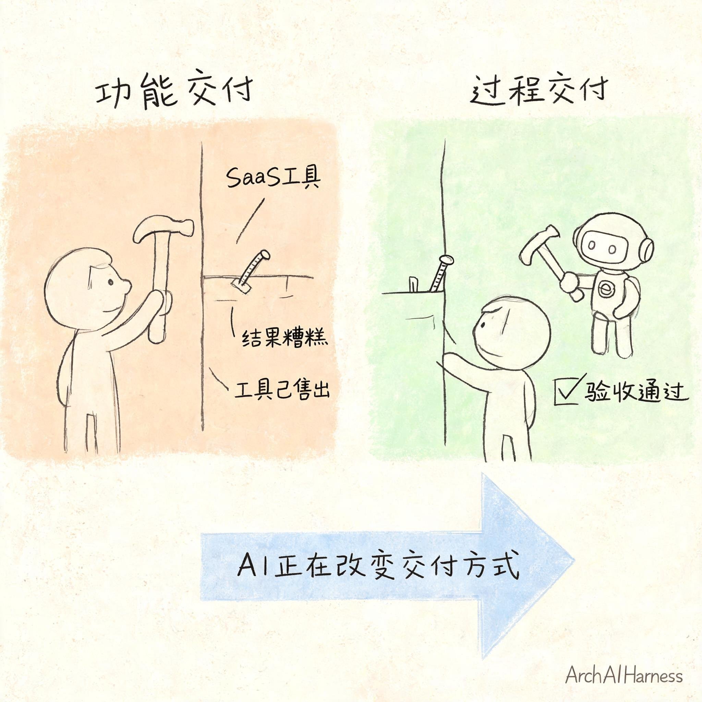
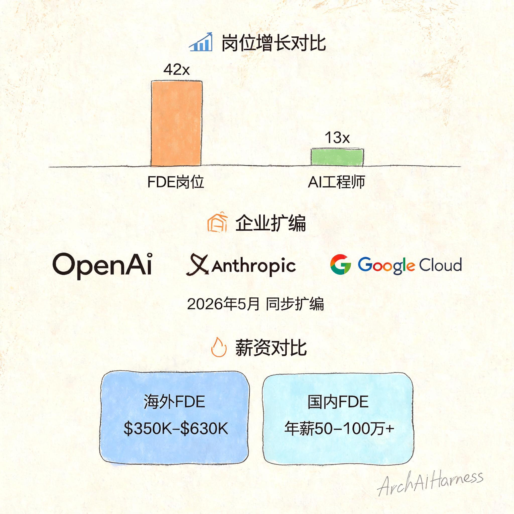
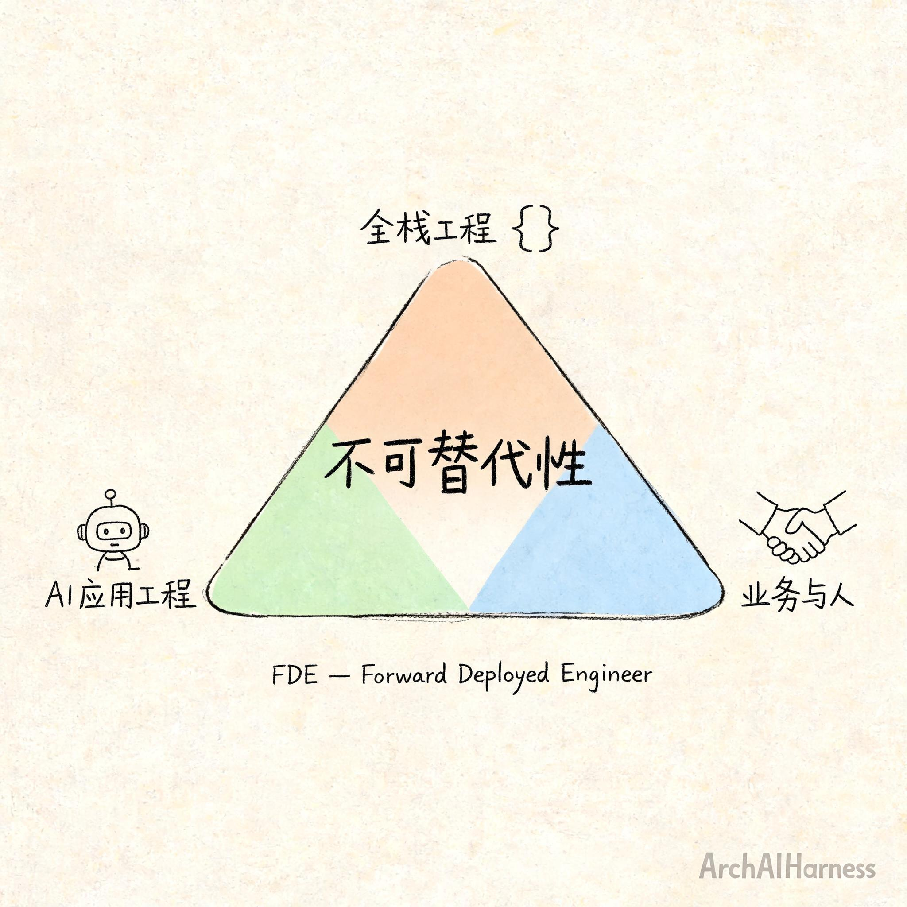

# AI 把 SaaS 的定价逻辑拆了，顺带造了一个年薪百万的新工种

你有没有注意到一个正在发生的怪现象——

Salesforce 开始按 $2/Action 收费——AI Agent 每帮你处理一个客服问题、更新一条 CRM 记录，才收两块钱。金蝶的差旅智能体按出差行程数量收费——跑了一趟收一趟的钱，没跑就不收。明略科技 2026 年报拆出一个叫 Agentic Services 的业务，不收软件许可费、不按 API 调用计费，而是跟客户签以业务指标为锚点的服务协议——首年收入破亿，续约率 96%。

SaaS 的收费方式正在集体换锚：**不是按"你能用多少功能"收，而是按"AI 帮你办成了什么事"收。**

这不是一个孤立的定价调整。它背后是两个同时发生的变化：一是 SaaS 的商业模式在被 AI 重写，二是一个叫 FDE 的新工种正在被这个变化批量制造出来。两个变化是同一件事的两个侧面。

## 一、"卖功能"为什么在 AI 面前撑不住了

传统 SaaS 的逻辑很简单：厂商开发一套标准化功能模块，客户按席位或模块付费。价值交付到"软件能用"为止——客户买了工具，自己负责用出效果。至于你买了这个 CRM 到底有没有多签两单，那不是 Salesforce 的事。

这个模式在 AI 时代遇到了根本性质疑。

金蝶中国副总裁李帆有段话说得很到位："过去我们交付工具，客户已经把钱花了。但 AI 要交付结果，更关注结果是否准确、有帮助。"

翻译一下就是：当 AI 的能力从"辅助工具"升级为"自主执行者"，按功能收费的逻辑就不再成立了。

原因很直白。传统软件客户买了功能后，需要自己投入人力去使用它、组合它、让它产生价值。但 AI Agent 的场景是"你说目标，它替你干完"——客户不需要再投入人力去操作软件，而是直接购买 AI 的执行结果。这时候按"功能"收费就变得荒谬了：你付了费，结果 AI 没跑出想要的结果，谁负责？

这背后是三股力量同时挤压：

**价值错位**——客户采购 SaaS 的初衷是"帮我解决问题"而不是"给我一个工具"。过去没有替代方案所以接受了功能订阅。现在 AI 可以直接交付结果，客户的期待变了。

**可替代性**——单一功能的 SaaS 工具（客服工单、外呼系统、ATS 等）的 AI Agent 替代路径极其清晰——每个工单/通话/简历筛选的成本都可量化，客户可以直接比价。

**议价权转移**——当 AI 能自主完成端到端任务，采购决策者从 IT 部门转向业务部门。业务部门不关心"这个系统有多少功能"，只关心"能不能帮我多赚点钱"。

## 二、从"卖工具"到"卖结果"

拿个最直观的比喻：

传统 SaaS 是卖给你一把锤子，你自己去钉钉子。你花了 99 块钱买锤子，挂了十幅画，锤子很好但你挂了五幅歪的——那是你的事，锤子厂商不管。

AI SaaS 是你说"帮我把这幅画挂墙上"，AI 自己拿锤子、找钉子、爬梯子、挂上去，挂好了检查水平，挂歪了自己调正，完事了才收你两块钱。**你买的不是锤子，是"画挂好了"这个结果。**

这就是从"功能交付"到"过程交付"的本质区别：

| 维度 | 传统功能交付 SaaS | AI 过程交付 SaaS |
|------|------------------|-----------------|
| 交付物 | 功能模块（你操作） | 业务结果（AI 执行） |
| 定价锚点 | 用户数量 / 功能模块 | 任务完成量 / 成果价值 |
| 价值责任 | 客户自己负责使用效果 | 厂商对结果负责 |
| 典型定价 | 席位订阅（$X/人/月） | 按 Action（$2/次）、按成果分成 |
| 客户采购决策者 | IT 部门 | 业务部门 |

这个转变已经发生，不是概念推演。上面提到的 Salesforce Agentforce、金蝶、明略科技只是冰山一角。

Gartner 预测 2028 年企业软件收入中 30% 将转向成果/ROI 定价；IDC 预测到 2028 年 70% 的软件供应商将重构商业模式，转向按结果计费。

**不是 SaaS 模式不行了，是"只卖功能不管结果"的那个版本到头了。**

## 三、谁去交付这个新模式的最后一公里

模式转变带来了一个现实问题：**面向过程交付的 AI SaaS，谁来执行？**

传统的销售团队不懂技术——他们能签合同，但做不了数据清洗、系统集成、效果调优。传统的研发团队懂技术但不在客户现场——他们能写好代码，但理解不了客户的业务流程和现场问题。

AI 不是传统软件。传统软件是标准化的——厂商做成什么样，客户就怎么用。AI 产品必须深度嵌入客户的业务流程、数据环境和工作习惯。这不是远程拉会对对需求就能解决的。AI 产品的交付是一个持续过程——数据要走通、效果要验证、边界要摸索、反馈要迭代。

这需要工程师驻扎在客户现场，而不是远程发版本。

这个缺口需要一个新角色来填补。它叫 **FDE——Forward Deployed Engineer，前线部署工程师。**

## 四、FDE 为什么偏偏在这个时候爆发

三个原因同时作用，不是巧合。

**第一，模型能力趋同，落地能力成了分水岭。**

2026 年，头部模型之间的基准测试差距已经很小。企业选模型不再纠结"谁跑分更高"，而是问"谁能真正解决我的问题"。这个转变让"部署"和"集成"的价值超过了"模型选择"——而这正是 FDE 的核心工作。

**第二，AI 产品的交付方式变了。**

传统软件交付是"部署上线"就结束了。AI 产品的交付是一条持续链条：数据接入 → 效果验证 → 边界摸索 → 反馈迭代。链条中的每个环节都需要有人在客户现场判断和决策。这不是一个运维岗位能覆盖的事。

**第三，SaaS 到 RaaS 的转型需要执行者。**

前面说的"面向过程交付"的 AI SaaS，本质上是把 SaaS 从软件订阅扩展为服务订阅——Result as a Service。而 RaaS 的每个交付环节都涉及技术决策和业务沟通——这正是 FDE 的能力范围。

**没有 FDE，AI SaaS 的"面向过程交付"就只能停留在 PPT 上。反过来，没有 AI SaaS 的模式转型，FDE 就只是一个昂贵的驻场工程师，不成体系。**

## 五、42 倍增长不是偶然

判断一个趋势是不是真的，看市场信号。

**信号一：全球 FDE 岗位 42 倍增长。**

LinkedIn 2026 年发布的全球劳动力市场趋势报告显示，2023 年至 2025 年，FDE 及相关岗位数量增长了 42 倍。作为对比，同期 AI 工程师岗位增长为 13 倍。全球新增 FDE 岗位约 9000 个。

**信号二：顶级 AI 实验室在 2026 年 5 月同步扩编。**

一周之内，三家顶级 AI 公司做了同一件事：

- OpenAI 宣布成立 OpenAI Deployment Company，专门帮助企业把 AI 部署到生产环境。同时计划收购应用 AI 咨询公司 Tomoro（约 150 名 FDE 和部署专家）。
- Anthropic 与 Blackstone、Goldman Sachs 合资 15 亿美元，同步扩编 FDE 团队。FDE 岗位年薪 $200K-$300K + 股权。
- Google Cloud 一次性开出 59 个 FDE 职缺。

三家公司在同一时间点做同一件事，不是巧合。它们都意识到：**模型能力不是瓶颈，部署和落地才是。**

**信号三：国内跟进。**

字节豆包已经开始招聘 FDE，月薪 3-5 万（15-16 薪），要求全栈能力 + 大模型技术原理 + Post-Training 技术。人社部能建中心与华为联合启动"AI-FDE 先锋人才计划"，定位 FDE 为"AI 产业规模化落地的核心复合型人才"。

薪酬信号也很直接：海外 OpenAI/Anthropic 的 FDE 总包 $350K-$630K，Palantir 的 Staff 级 FDE 可达 $630K+。国内字节等头部公司的 FDE 岗位年薪 50-80 万，中高阶可达 100 万+。

**部署工程师的薪资增速已经超过了 AI 工程师——这不是偶然，是行业需求结构变化的直接反映。**

## 六、FDE 到底要会什么

FDE 不是"会写代码"就能做的。它要求同时具备三种能力，缺一不可：

- **全栈工程**：Python/Java、前后端与数据库集成、云基础设施、容器化与 CI/CD
- **AI 应用工程**：RAG 架构设计与调优、Agent 框架、向量数据库、Prompt Engineering、模型微调与评估
- **业务与人**：需求拆解（从模糊的业务描述到可执行方案）、跨部门协同、客户沟通与预期管理、合规与安全

Anthropic 的 FDE 岗位说明中写得直白：FDE 需要"在 ambiguity 下做架构决策"。没有清晰的需求文档，客户给你的可能只是一句"帮我们用 AI 提升一下效率"，你要自己把它拆成可执行的方案。

这不是一个培训三个月就能上岗的岗位。**它是把"懂技术、懂业务、能落地"三种角色合并成一个的结果。**

## 七、中国市场：有机会，但快钱别想

中国市场的路径跟海外不完全一样，有几个需要单独说的约束。

**有利的一面：** 全球最完整的产业体系、最丰富的应用场景、"人工智能+"国家战略推动力，这些为 AI SaaS 提供了独特的试验场。

**不利的一面：** 数据安全法和个人信息保护法提高了合规门槛，企业付费意愿整体低于欧美，标准化 SaaS 在中国市场本就面临"定制化陷阱"。而且海外有 Salesforce、ServiceNow 等成熟的平台级 SaaS，国内缺乏同等深度的企业软件基础设施。

这意味着面向过程交付的 AI SaaS 不是一条快钱路线。它要求厂商先投入——深度理解客户业务流程、做数据清洗与系统集成、承担效果责任——然后才能被认可。成果付费意味着收入与客户成功直接挂钩，前期服务成本可能高于收入。

**能走通这条路的，不是做"AI 套壳"的公司，而是真正懂行业、能交付结果的团队。**

FDE 的未来趋势也是如此。高端 FDE 会走 OpenAI/Anthropic 的精锐路线（年薪百万级），中端 FDE 会走标准化培训 + 规模化交付路线（如华为 AI-FDE 先锋计划）。但 FDE 的内核——懂技术、懂业务、能落地——会成为 AI 时代工程师的"基础能力要求"，而不只是一个独立的岗位名称。

## 八、写在最后

回到开头那个问题：Salesforce 按 $2/Action 收费、金蝶按出差行程收费、明略科技按业务指标签约——这些不是孤立的定价实验，是一个更大的趋势的两个侧面。

一个侧面是 SaaS：**从卖功能到卖结果。** 过去你卖的是软件，现在你卖的是"问题被解决了"这件事。定价权从功能数量转移到成果质量。

另一个侧面是工程师：**从写代码到落地交付。** 过去你写完代码就算完事，现在你要驻在客户现场、梳理业务、调模型、修数据、持续迭代，直到把"AI 能干活"变成"AI 真在替客户干活"。

这两个变化是同一件事。**谁能同时理解"商业模式为什么变了"和"工程师的角色为什么变了"，谁就在下一阶段有选择权。**

无论你是做产品的、写代码的、还是考虑自己职业方向的，这个趋势都值得认真看看。它不会下个月就发生，但它正在发生。

---

### 关于 ArchAIHarness

这篇文章是「看懂 AI 与智能体」专栏的一部分，由 [**ArchAIHarness**](https://github.com/ArchAIHarness) 持续输出。

ArchAIHarness 是一套面向 AI 时代软件工程的人机协同架构哲学与公开工程资产，主张：

> **架构师定义秩序，AI 在秩序中生长。人立法，AI 执行，体系审计。**

如果你也希望 AI 在明确的架构边界内协作，而不是在混沌中碰运气，欢迎到 GitHub 上看看我们在做什么：

- **组织主页**：[github.com/ArchAIHarness](https://github.com/ArchAIHarness) — 了解完整理念与资产全景
- **本专栏**：[`zhuanlan-ai-and-agents`](https://github.com/ArchAIHarness/zhuanlan-ai-and-agents) — 所有文章的源码与发布记录
- **实践指南**：[`docs`](https://github.com/ArchAIHarness/docs) — 架构哲学、工程方法和落地指南
- **开源工具**：[`agent-workflows`](https://github.com/ArchAIHarness/agent-workflows) — 可复用的 AI 协作 Agents、Skills 与 Tools
- **工程样例**：[`framework`](https://github.com/ArchAIHarness/framework) — DDD + AI 协作的工程底座

> Engineered by Architects · Empowered by AI · Audited by Discipline
