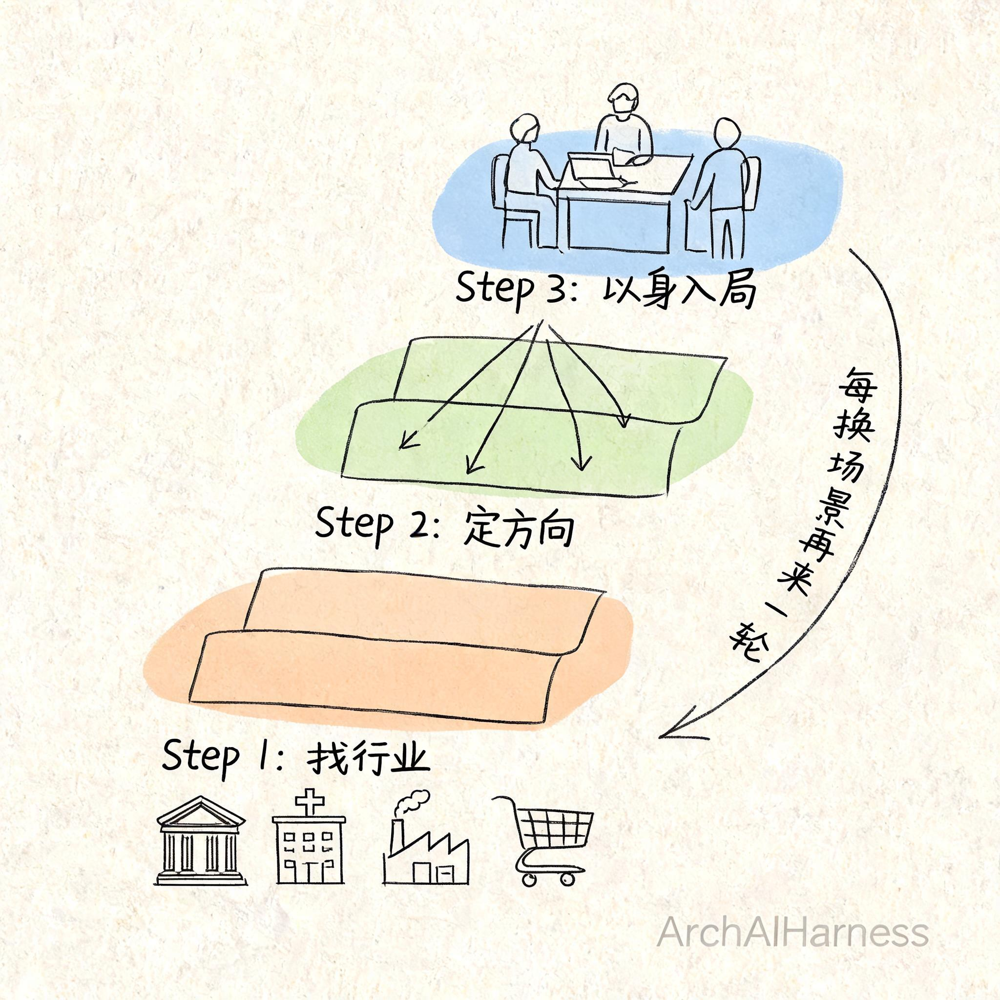
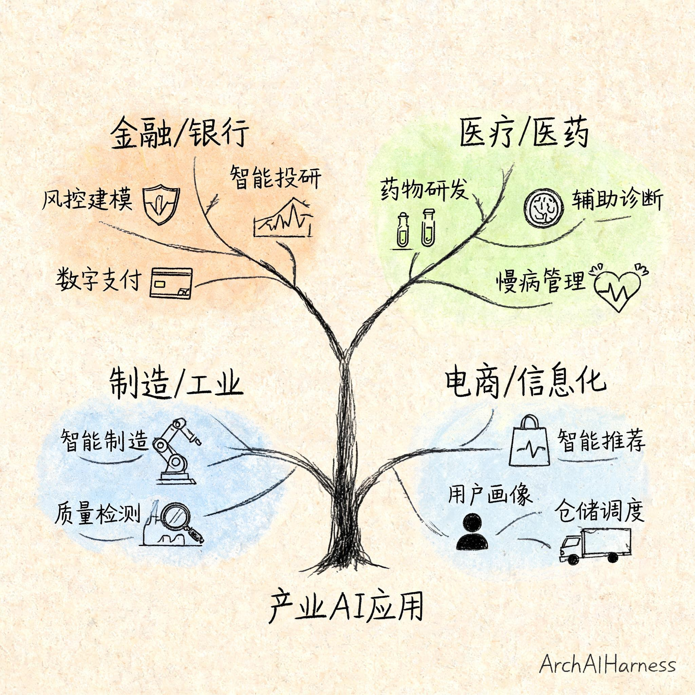
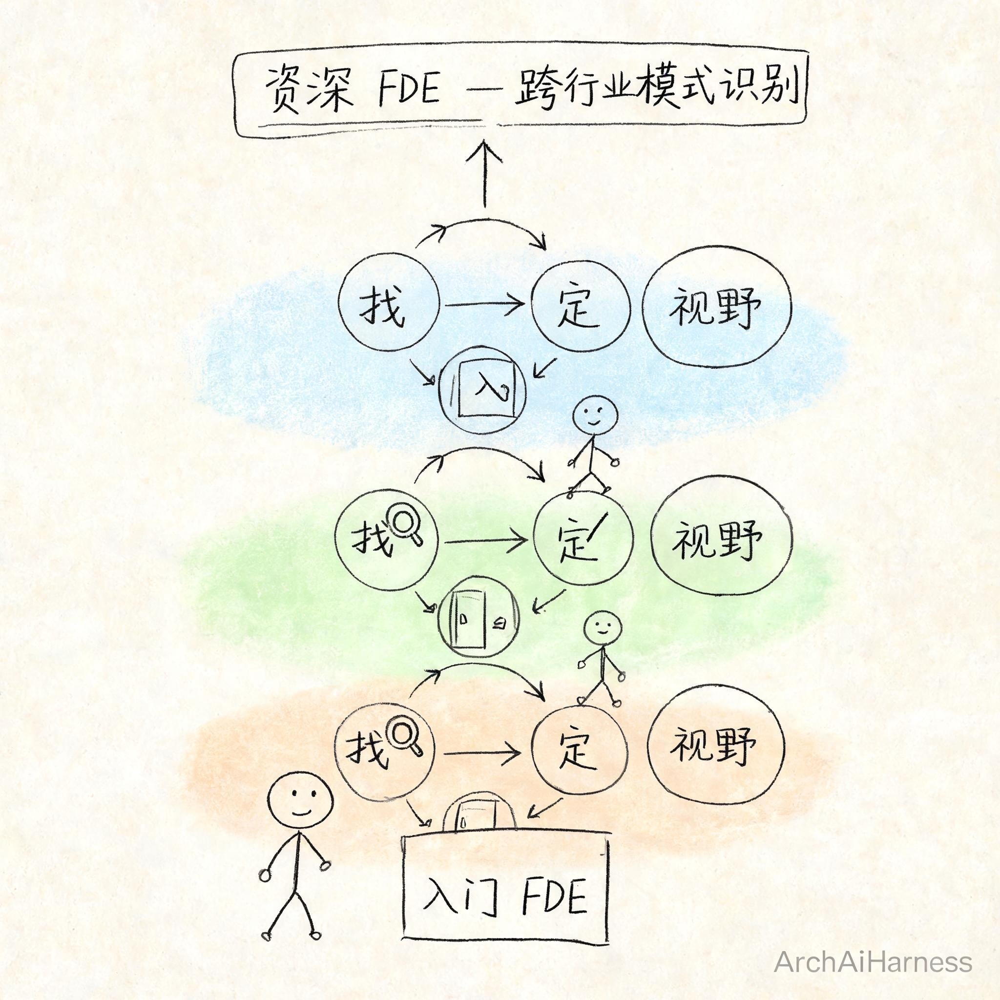

# 想做 AI 时代的 FDE？先过三关：找行业、定方向、以身入局

上篇聊了 FDE（Forward Deployed Engineer，前线部署工程师）为什么火了——42 倍岗位增长、OpenAI/Anthropic/Google 同周扩编、字节和华为争着招。但你读完可能更困惑了：**所以怎么进去？**

FDE 不是后端开发，不是刷完 LeetCode 面进去就能干活。它的工作方式是**你被派到客户现场，把 AI 系统在真实业务里跑起来**。这意味着技术只是入场券，行业认知才是真正的护城河。

没有一个"FDE 培训班"能批量制造合格的 FDE，因为这个岗位的根基不在技术栈里，在行业场景里。

但我说"没法培训"不等于"没法入门"。只是入口不在 MOOC 上，在一条更笨的路上——我把它拆成三步：**找行业 → 定方向 → 以身入局**。三步递进，缺一不可。而且你永远不会从第三步毕业——每换一个行业、每进一个新客户，就是一轮新的三部曲。

## 一、为什么 FDE 不能从"学技术"开始

先搞清楚一件事：FDE 和后端开发有本质区别。

后端开发的需求是明确的——产品经理把需求写清楚，架构师把技术方案定好，你负责实现。你的战场在编辑器里，你的交付物是代码。

FDE 的需求是模糊的——客户说"帮我们用 AI 提升一下效率"，没有需求文档，没有架构评审，没有现成的数据管道。你的战场在客户现场，你的交付物是**"AI 系统在客户的真实业务里跑起来了并能稳定产出结果"**这件事本身。

所以如果你被派到一家银行的 AI 项目，你不懂对公信贷的业务流程，你连客户在说什么都听不懂，更别说把 AI 嵌进去了。

技术可以学，一个月上手一个新框架不稀奇。但行业认知只能靠泡——你在那个行业里待过、跟业务人员开过会、看过他们的数据长什么样、理解过他们流程为什么这么绕，这些没法速成。

**所以第一步不是选技术栈，是选一个行业。**

## 二、第一关：找行业——四个赛道，先选一个扎进去

选什么行业？不是说选最火的，是选**你能扎进去的**。

FDE 适合的行业有三个特征：①正在被 AI 改造但门槛高（定制化程度高 → 需要人驻场）②客户付费意愿强 ③你有切入点或已有行业经验。

按这三个标准，国内推荐四个赛道：

### 金融/银行

为什么适合 FDE：数据合规门槛最高、定制化极强、付费意愿最强。AI 落地需求明确——风控、客服、信贷审批、精算，每条业务线都在问"AI 能不能帮我省点钱"。但数据安全法和个人隐私保护的约束，决定了你不能远程调 API 解决问题，必须到现场搞数据治理和合规方案。

可选方向：零售银行（智能风控/反欺诈/个性化推荐）、对公银行（供应链金融/信贷审批自动化）、保险（理赔自动化/精算/智能核保）、证券（量化策略/投研 AI 辅助）。

国内信号：银行 AI 投入年增 30%+，大行都在建 AI 中台，但能落地的人极度短缺。

### 医疗/医药

为什么适合 FDE：受个保法严格约束，流程极其复杂，需要深度集成到 HIS（医院信息系统）里。这不是远程部署一个模型能解决的事——你得在医院现场理解医生的工作流、在数据不出院的条件下做模型调优。

可选方向：临床决策支持（CDSS）、药物研发 AI 加速、医保控费与 DRG 分组、医院运营管理。

国内信号：国家"AI+医疗"政策强力推动，但合规门槛天然筛掉了一批只会调 API 的团队——这恰恰是 FDE 的壁垒。

### 制造/工业

为什么适合 FDE：中国制造业体量全球第一，AI 在工业场景的落地需要深度集成到产线系统里。工业质检的摄像头装在哪、节拍多少、不良品怎么回流——这些不是技术问题，是工艺理解问题。

可选方向：工业视觉质检、预测性维护、供应链优化、排产与调度。

国内信号：工信部大力推智能制造，但懂 AI 又懂工业的人才极度稀缺。

### 电商/标准化信息化

为什么适合 FDE：中国电商生态全球最复杂（平台电商、直播电商、私域电商三轨并行），背后是海量的系统集成需求——ERP、OMS、WMS、CRM，每个系统都要接入 AI。标准化程度越高，越需要有人把 AI "标准化地"嵌进去。

可选方向：智能客服与导购、供应链与仓储自动化、个性化推荐与搜索、商家运营工具 AI 化、直播电商 AI 辅助。

国内信号：电商 AI 渗透率快速提升，但深度集成到商家后台和供应链系统的 FDE 人才供给几乎空白。

**选行业的标准不是"哪个最火"，是三个问题的答案：**
1. 这个行业正在被 AI 改造吗？（正在 → 有机会）
2. 改造它需要人现场去干吗？（需要 → 才是 FDE 的活）
3. 你能找到切入点吗？（能 → 就选它）

## 三、第二关：定方向——在行业里再切一刀

行业定了不代表你能干了。同一个行业里，不同方向对能力栈的要求天差地别。

拿金融举例：

**零售银行方向**——智能风控和反欺诈。需要的能力：特征工程、图算法、实时决策引擎、理解信贷生命周期。技术栈偏机器学习 + 规则引擎。

**对公银行方向**——供应链金融和信贷审批。需要的能力：NLP 做文档解析、知识图谱做企业关联分析、理解贸易融资流程。技术栈偏 NLP + 知识图谱。

**保险方向**——理赔自动化和精算。需要的能力：多模态（理赔照片+文本）、自动化流程编排、理解保险产品设计。技术栈偏 CV + 工作流引擎。

**同一个行业，三个方向，三种不同的能力侧重。** 你不可能同时精通所有方向——找到你最愿意钻 3-5 年的那个切口就行。

其他行业同理。

| 行业 | 方向A | 方向B | 方向C |
|------|-------|-------|-------|
| 金融/银行 | 零售银行：风控+反欺诈 | 对公银行：信贷+供应链 | 保险：理赔+精算 |
| 医疗/医药 | CDSS临床决策 | 药物研发AI加速 | 医保控费与DRG |
| 制造/工业 | 工业视觉质检 | 预测性维护 | 供应链优化 |
| 电商/信息化 | 智能客服与导购 | 供应链仓储自动化 | 商家运营工具AI化 |

**定方向的本质是：在行业里找到你愿意钻 3-5 年的那个切口。**

## 四、第三关：以身入局——这也是最难的一步

前两步是做选择，这一步是真正上手。而"以身入局"不是比喻，**它是 FDE 这个词的字面意思。**

拿几个真实案例说。

**Palantir 的做法**（行业最成熟的 FDE 模式）：早期 FDE 被直接派到 CIA 和 FBI 的站点，跟情报分析师坐在一起工作。分析师怎么查数据、怎么串线索、怎么出报告，FDE 坐在旁边看，看懂了再写代码。不是"远程对需求"，是物理上坐在你旁边。后来扩展到 NHS（英国医疗系统），FDE 嵌入医院运营团队，跟医生和护士一起梳理患者数据平台怎么落地。

**Anthropic 的做法**（2025-2026 年爆发的新模式）：FDE 需要"在 ambiguity 下做架构决策"。客户说一句"帮我们提升一下效率"，没有需求文档，FDE 要去现场把这句话拆成可执行的技术方案。年薪 $200K-$300K + 股权，总包可达 $350K-$630K。

**国内字节豆包的 FDE 招聘**：月薪 3-5 万（15-16 薪），要求全栈 + 大模型 + Post-Training。这意味着什么？你不是去调 API 的——你是去客户现场，理解业务流程，回来可能要自己微调模型、搭 RAG 管道、写前端展示、做 CI/CD 部署。一个人顶一个团队。

**以身入局的核心不是"出差去客户现场"，而是：**
1. 跟业务人员一起开会，听懂他们在说什么
2. 看他们的数据长什么样，数据在哪、多脏、能不能用
3. 理解他们的流程为什么这么绕——通常不是因为没人想改，是因为有历史包袱和合规约束
4. 把"AI"这个东西，切成他们能接受的小块，一块一块塞进去

这是一个没法远程完成的过程。**FDE 的公司花几十万甚至上百万年薪雇你，不是为了让你写代码——是为了让你在现场判断。**

## 五、三部曲不会毕业——它是循环的

这一步很重要，但容易被忽视：**你永远不会从第三步毕业。**

你以为你入局了金融行业，做完一个项目就成为"金融 FDE"了？不对。下一个项目可能是保险，再下一个可能是供应链金融。同一个大行业，场景一变，又是一轮新的"找行业→定方向→以身入局"。

资深 FDE 的壁垒是什么？

不是 Python 写得多溜、LangChain 用了多久。是**他经历了多个行业的"入局—交付—复盘—再入局"周期后，形成了一种跨行业的模式识别能力。**

他看到一个新行业，能快速识别：这个场景跟之前做过的哪个案子类似？它的核心痛点是什么？什么技术方案能最快跑通 MVP？这个客户最怕什么（合规？安全？稳定性？）？

**这种能力，不在书里，不在课程里，只在循环里。**

## 六、写在最后

回到开头那个问题：FDE 怎么入门？

不是刷题，不是报课，不是追最新的 AI 框架。是认真走这三步：

**选一个行业**——花时间研究它，理解它的痛点和机会。
**在里面切一个方向**——找到你愿意钻 3-5 年的那个切口。
**然后想办法把自己放进去**——进项目、进客户现场、进业务一线。

三部曲不是理论，是你必须自己走一遍的路。走完一轮，你就是一个能独立交付的 FDE。走完三五轮，你就有跨行业的判断力。走完十轮——市场上真正能称得上"资深 FDE"的人，少之又少。

而且整个三部曲的逻辑不只是"FDE 入门指南"，你可以把它当做一个通用的方法论用在任何领域。

下一篇，我想跟你聊的，是这三部曲的反面——为什么有些看起来不错的方向，走进去才发现是个坑。以及，当你卡在某一步的时候，怎么判断是该硬扛还是该换牌。咱们下篇见。

---

### 关于 ArchAIHarness

这篇文章是「看懂 AI 与智能体」专栏的一部分，由 [**ArchAIHarness**](https://github.com/ArchAIHarness) 持续输出。

ArchAIHarness 是一套面向 AI 时代软件工程的人机协同架构哲学与公开工程资产，主张：

> **架构师定义秩序，AI 在秩序中生长。人立法，AI 执行，体系审计。**

如果你也希望 AI 在明确的架构边界内协作，而不是在混沌中碰运气，欢迎到 GitHub 上看看我们在做什么：

- **组织主页**：[github.com/ArchAIHarness](https://github.com/ArchAIHarness) — 了解完整理念与资产全景
- **本专栏**：[`zhuanlan-ai-and-agents`](https://github.com/ArchAIHarness/zhuanlan-ai-and-agents) — 所有文章的源码与发布记录
- **实践指南**：[`docs`](https://github.com/ArchAIHarness/docs) — 架构哲学、工程方法和落地指南
- **开源工具**：[`agent-workflows`](https://github.com/ArchAIHarness/agent-workflows) — 可复用的 AI 协作 Agents、Skills 与 Tools
- **工程样例**：[`framework`](https://github.com/ArchAIHarness/framework) — DDD + AI 协作的工程底座

> Engineered by Architects · Empowered by AI · Audited by Discipline
