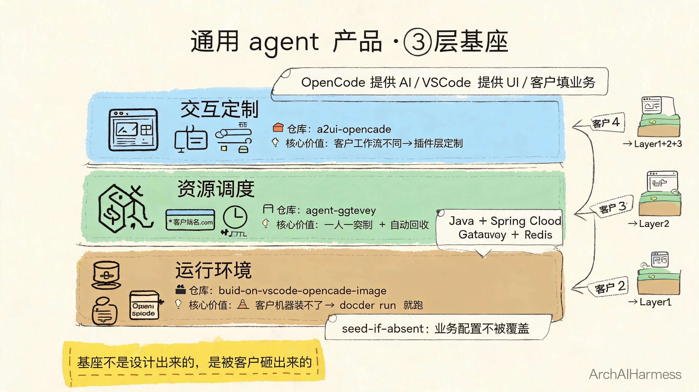

# FDE 怎么交付一个通用 agent 产品：3 个客户的 3 次沉淀

> 24 / 看懂 AI 与智能体 / FDE 系列

接电话那天，客户说："我想要个 AI 助手。"

我心里咯噔一下。

不是因为我不会做。是因为"AI 助手"这四个字，我听过一百遍了，每次的含义都不一样。

销售部想要的"AI 助手"是"帮我回客户邮件"。运营想要的"AI 助手"是"帮我写公众号"。老板想要的"AI 助手"是"帮我管项目"。

每一个都是"AI 助手"。每一个都对应完全不同的产品。

我深吸一口气，问了 3 个问题：

- **AI 帮你做什么？** 给我一个具体场景，别用"提升效率"这种词。
- **谁会用？** 一个人用？十个人用？一百个人用？人数决定复杂度。
- **现在是怎么做的？** AI 进来之前，你们是怎么处理这个场景的？

客户答完，我才知道他要的不是"AI"，是"能在我不在的时候，把这件特定的事做完"。

这才是 FDE 真正的对齐过程。

> 23 讲了 FDE 的三大核心能力：表达、业务架构力、抽象→沉淀→中台。这篇不重复理论，直接讲实操——四个客户怎么把 23 讲的三件事跑通。

## 一、第一个客户：用最笨的方法

我第一个客户是家小律所。三个律师，每天花两小时审合同。

他们要的不是"AI"，是"AI 帮我把合同里的甲方乙方金额日期全抠出来"。

我没做"通用 agent"。我写了个 Python 脚本，喂合同 PDF，输出 JSON。

三天交付。客户用了两个月，提了三个 bug，我改了。

**这就是 FDE 的真相：先做能用的，不要先做完美的。**

但我心里清楚：这个脚本换一家公司就用不了。每家律所的合同格式都不一样。

## 二、第二个客户：第一次沉淀

第二个客户是家培训机构。要 AI 帮他们改作业。

我一看需求就笑了——和律所那个完全不同。律所是"读 PDF 抽数据"，培训机构是"读作文给评分"。

但有一件事是一样的：**AI 都要在客户的电脑上跑起来**。

第一个客户的 Python 脚本要装 Python、装依赖、配环境。第二个客户也得装一遍。但客户的电脑五花八门，有的装不上。

**这一刻我意识到：环境一致性是比"AI 模型"更基础的问题。**

我花了一周写了 [build-on-vscode-opencode-image](https://github.com/ArchAIHarness/build-on-vscode-opencode-image)——一个 Docker 镜像。

这个镜像把"AI 编辑器 + OpenCode + 常用工具"打包好。客户电脑不需要装任何东西，`docker run` 一下，浏览器打开就能用 AI。

**这是第一个基座。** 不是设计出来的，是"两个客户都遇到这个问题"后自然长出来的。

但还有个坑：客户的工作目录可能被业务系统覆盖。比如客户把 `/home` 挂到了 NAS 上，我的 `.opencode` 配置就被覆盖了。

我加了一个 `seed-if-absent` 模式：默认配置只注入到不可被覆盖的 `/opt` 目录，业务自己配的 `/home` 一律尊重，不覆盖。

这个细节是踩了坑才加的。第三个客户上线时，我才发现这个问题。

## 三、第三个客户：多租户的麻烦

第三个客户是家连锁餐饮。50 个门店，每个门店要一个 AI 助手。

我直接用前面的镜像复制 50 份？不行。

- 50 个 AI 助手要能同时跑
- 每个门店的数据要隔离（门店 A 不能看门店 B 的数据）
- 有的门店今天活跃、明天不活跃，资源要回收

**多租户问题。** 这是我第一次认真面对"agent 产品"而不是"agent 工具"的差异。

工具是一个人用，自己管。产品是一群人用，要让别人管。

我用了三周写 [agent-gateway](https://github.com/ArchAIHarness/agent-gateway)——一个 Java 写的 Kubernetes 控制器。

它做三件事：

- **每个客户分配一个独立的 agent 容器**（k8s Deployment + Service）
- **每个客户有自己的子域名**（`{userId}.localhost`，路由到自己的 agent）
- **每个客户的 agent 有 TTL**（默认一小时不活跃就回收资源）

第二个客户的"环境一致性"问题，现在通过镜像解决了。第三个客户的"多租户隔离"问题，通过 gateway 解决了。

**这是第二个基座。**

## 四、第四个客户：UI 的麻烦

第四个客户是家保险公司。他们要 AI 帮客服人员查保单。

前三个客户的 agent UI 都是一样的——就是 OpenCode 自己的聊天界面。

但保险公司的客服有特殊需求：他们要在查保单时同时看客户信息、对话记录、合规提示。这些 OpenCode 都没有。

**客户要的不是"AI 助手"，是"AI 嵌进他们现有的工作流"。**

我不可能为每家客户改 OpenCode 源码。这不对。

我想了三天，解决方案是：把 UI 做成可定制的层。

我写了 [a2ui-opencode](https://github.com/ArchAIHarness/a2ui-opencode)——一个 VS Code 插件，它把 OpenCode 的 UI 嵌进 VS Code 自己的侧边栏。

这样客户就能在 VS Code 上加自己的插件、改自己的 UI，而不用动 OpenCode 核心。

OpenCode 提供 AI 能力。VS Code 提供 UI 框架。客户自己写插件填业务。

**这是第三个基座。**

## 五、沉淀的真相

做完第四个客户，我回头看：3 个 repo 构成了"通用 agent 产品"的 3 层。

| 层 | 解决什么问题 | 哪个 repo |
|---|---|---|
| 运行环境 | 客户机器装不上、跑不起来 | build-on-vscode-opencode-image |
| 资源调度 | 多客户、多租户、谁用谁不用 | agent-gateway |
| 交互定制 | 每个客户工作流不一样 | a2ui-opencode |

**这 3 层不是一开始就设计好的。是四个客户之后，沉淀出来的。**

如果你问我"为什么要做这 3 层"，我说不出"宏大愿景"。我只能说：

- 第一个客户教我"环境要能跑"
- 第二个客户教我"配置不能被覆盖"
- 第三个客户教我"多租户要隔离"
- 第四个客户教我"UI 要能定制"

每来一个客户，我就多懂一点。基座是被客户"砸"出来的，不是被"想"出来的。

回过头看，这正是 23 讲的"抽象→沉淀→中台"——不是我设计的，是被四个客户逼出来的。第一个客户教会我"表达"（把客户模糊需求翻译成具体技术问题），第二个客户教会我"业务架构"（从单点脚本升级到通用镜像），第三、第四个客户教会我"抽象→沉淀"（抽出可复用基座）。

## 六、FDE 真正的交付物

很多人以为 FDE 是"高级工程师"。

我以前也这么以为。

现在我明白：**FDE 交付的不是代码，是"客户能用的产品"。**

代码只是过程。客户付钱买的不是 `.py` 文件、不是 Dockerfile、不是 `.ts` 源码。

客户买的是：

- "我打开浏览器，AI 就在那"
- "我提需求，下周就能用"
- "业务变了，AI 跟着变"

这三件事，**没有一行代码能直接交付**。但这三件事是 FDE 的全部工作。

代码写到 git 那一刻只是中间产物。客户真的开始用，那才是交付完成。

## 七、写在最后

如果你也想做"通用 agent 产品"，我给你三个反直觉的忠告：

**别先做框架。** 先做三个客户的能用的东西。第三个客户时，框架自己会浮现。

**别先想通用。** 通用是被客户需求"砸"出来的抽象，不是工程师"想"出来的设计。

**别先写代码。** 先对齐需求。第一个客户的需求和第四个客户的需求，差距之大，会让你怀疑人生。

至于三个 repo——它们是过程，不是结果。

过程是"我用了四个客户、三个月、三层沉淀"。

结果是什么？结果是我不再为每个新客户重写代码。

结果是我能接第五个客户、第十个客户、第一百个客户。

**结果是我把"AI 助手"这四个字，做成了一份可以卖的合同。**

---

### 关于 ArchAIHarness

这篇文章是「看懂 AI 与智能体」专栏的一部分，由 [**ArchAIHarness**](https://github.com/ArchAIHarness) 持续输出。

ArchAIHarness 是一套面向 AI 时代软件工程的人机协同架构哲学与公开工程资产，主张：

> **架构师定义秩序，AI 在秩序中生长。人立法，AI 执行，体系审计。**

如果你也希望 AI 在明确的架构边界内协作，而不是在混沌中碰运气，欢迎到 GitHub 上看看我们在做什么：

- **组织主页**：[github.com/ArchAIHarness](https://github.com/ArchAIHarness) — 了解完整理念与资产全景
- **本专栏**：[`zhuanlan-ai-and-agents`](https://github.com/ArchAIHarness/zhuanlan-ai-and-agents) — 所有文章的源码与发布记录
- **实践指南**：[`docs`](https://github.com/ArchAIHarness/docs) — 架构哲学、工程方法和落地指南
- **开源工具**：[`agent-workflows`](https://github.com/ArchAIHarness/agent-workflows) — 可复用的 AI 协作 Agents、Skills 与 Tools
- **工程样例**：[`framework`](https://github.com/ArchAIHarness/framework) — DDD + AI 协作的工程底座，展示如何在开发中融合 AI

> Engineered by Architects · Empowered by AI · Audited by Discipline
