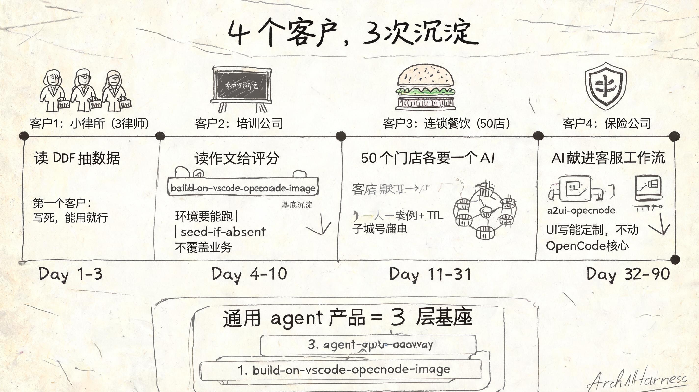
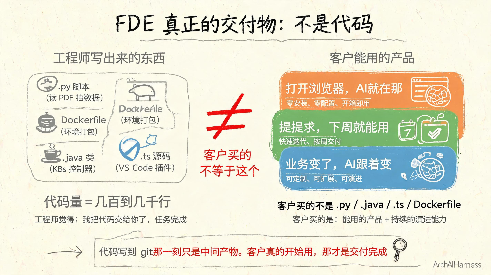

# FDE 怎么交付一个通用 agent 产品：一个客户教会我的三件事

接电话那天，客户说："我想要个 AI 助手。"

我心里咯噔一下。

不是因为我不会做。是因为"AI 助手"这四个字，我听过一百遍了，每次的含义都不一样。

销售部想要的"AI 助手"是"帮我回客户邮件"。运营想要的"AI 助手"是"帮我写公众号"。老板想要的"AI 助手"是"帮我管项目"。

每一个都是"AI 助手"。每一个都对应完全不同的产品。

我深吸一口气，问了 3 个问题：

- **AI 帮你做什么？** 给我一个具体场景，别用"提升效率"这种词。
- **谁会用？** 一个人用？十个人用？一百个人用？人数决定复杂度。
- **现在是怎么做的？** AI 进来之前，你们是怎么处理这个场景的？

客户答完，我才知道他要的不是"AI"，是"能在我不在的时候，把这件特定的事做完"。

这才是 FDE 真正的对齐过程。

但我当时不知道的是：一个"客户"后面，站着四个部门。每个部门要的"特定的事"都不一样——而且谁都觉得自己的需求才最急。

## 一、法务部先找上门

合同签完没两天，法务部打电话来了。

"听说你能让 AI 干活？帮我把加盟合同里的条款抠出来，三个律师每天花两小时审这玩意儿。"

我没聊什么"通用 agent 平台"。我写了个 Python 脚本，喂合同 PDF，输出 JSON。

三天交付。法务部用了两个月，提了三个 bug，我改了。

**这就是 FDE 的第一课：先做能用的，不要先做完美的。**

但我心里清楚：这个脚本换个部门就用不了。每家的工作流都不一样。

## 二、培训部跟进：第一次真正沉淀

法务部用了一个月，培训部找来了。

"我不管你怎么弄的，我也要一个 AI，帮我改培训作业。"

两个需求完全不同。法务是"读 PDF 抽数据"，培训是"读作文给评分"。但有一件事是一样的：**AI 都得跑在客户的电脑上**。

法务的脚本要装 Python、装依赖、配环境。培训部也折腾了一遍，但公司的电脑五花八门——有的装不上、有的权限不够、有的是 Mac 有的是 Windows。

**这一刻我意识到：环境一致性是比"AI 模型"更基础的问题。**

我花了一周写了一个 Docker 镜像，把"AI 编辑器 + OpenCode + 常用工具"打包好。任何人 `docker run` 一下，浏览器打开就能用 AI。

**这是第一个基座。** 不是设计的——是两个部门遇到同一个坑之后，自然长出来的。

但还有第二个坑：培训部的同事把 `/home` 挂到了公司共享存储上，我的 `.opencode` 配置直接被覆盖了。

我加了一个 `seed-if-absent` 模式：默认配置只注入不可被覆盖的目录，业务自己配的目录一律尊重、不覆盖。

这个细节是踩了坑才加的。第三个部门上线时，我才发现这个问题。

## 三、运营部拍桌子：多租户的麻烦

第三通电话来自运营部。他们管着 50 家门店。

"50 个店长，每人要一个 AI 助手。"

直接用前面的镜像复制 50 份？行不通。

- 50 个 AI 助手要能同时跑
- 每个门店的数据要隔离（店 A 不能看店 B 的数据）
- 有的门店今天活跃、明天不活跃，资源不能白白开着

**多租户问题。** 这是我第一次认真面对"agent 产品"和"agent 工具"的差异。

工具是一个人用，自己管。产品是一群人用，要让别人管。

我用了三周写了一个 gateway——一个轻量的调度层。它做三件事：

- **每个门店分配一个独立的 agent 容器**
- **每个门店的访问入口自动路由**，各自的数据互不可见
- **每个门店的 agent 有时效**，一段时间不活跃就回收资源

培训部的"环境一致性"问题通过镜像解决了。运营部的"多租户隔离"问题通过 gateway 解决了。

**这是第二个基座。** 仍然不是设计的——是被 50 家门店同时上线逼出来的。

## 四、客服部最后摊牌：UI 的麻烦

客服部最后一个找上我。他们听说公司有了个"AI 助手"，想给自己的客服人员用。

但客服有特殊需求：处理客诉时要同时看客户信息、对话记录、合规提示。前面所有部门的 AI 都只有聊天界面——不够用。

**客户要的不是又一个"AI 助手"，是"AI 嵌进他们现有的工作流"。**

我不可能为每个部门改 AI 核心的源码。这不对。

方案是：把 UI 做成可定制的层。写了一个插件，把 OpenCode 的 AI 能力嵌进团队现有的业务系统里。

这样业务部门能加自己的字段、改自己的界面，不用动 AI 核心。AI 提供能力，团队现有系统提供框架，业务自己填需求。

**这是第三个基座。**

## 五、回头看：沉淀的真相

做完这四个部门的需求，我回头看：三个基座不是我"设计"出来的，是四个部门、半年时间、一次次补坑补出来的。

| 层 | 解决什么问题 | 对应 repo |
|---|---|---|
| 运行环境 | 电脑五花八门装不上、跑不起来 | build-on-vscode-opencode-image |
| 资源调度 | 多门店、多部门、谁用谁不用 | agent-gateway |
| 交互定制 | 每个部门的工作流不一样 | a2ui-opencode |

一个客户教会我三件事——不是宏大愿景，是一次次翻车之后逼出来的领悟：

- 法务部教会我"先做能用的"
- 培训部教会我"环境要能跑，模型才有意义"
- 运营部教会我"多人用和一个人用，是两种产品"
- 客服部教会我"AI 要融进工作流，不是让人来找 AI"

基座是被需求"砸"出来的，不是被"想"出来的。

整个过程浓缩成四个字：**对齐→补坑→沉淀**。每一通电话都是一个对齐的新起点，每个坑都逼出一层垫脚石。

## 六、FDE 真正的交付物

很多人以为 FDE 是"高级工程师"。

我以前也这么以为。

现在我明白：**FDE 交付的不是代码，是"客户能用的产品"。**

代码只是过程。客户付钱买的不是 `.py` 文件、不是 Dockerfile、不是 `.ts` 源码。

客户买的是：

- "我打开浏览器，AI 就在那"
- "我提需求，下周就能用"
- "业务变了，AI 跟着变"

这三件事，**没有一行代码能直接交付**。但这三件事是 FDE 的全部工作。

代码写到 git 那一刻只是中间产物。客户真的开始用，那才是交付完成。

## 七、写在最后

如果你也想做"通用 agent 产品"，我给你三个反直觉的忠告：

**别先做框架。** 先做第一个部门能用的东西。第三个部门来时，框架自己会浮现。

**别先想通用。** 通用是被部门需求"砸"出来的抽象，不是工程师"想"出来的设计。

**别先写代码。** 先对齐需求。法务部和客服部的需求差距，大得让你怀疑人生。

至于那三个 repo——它们是过程，不是结果。

过程是"一个客户、四个部门、半年时间、三层沉淀"。

结果是什么？结果是新客户、新部门找上门时，我不再从头写代码。

结果是我能把"AI 助手"这四个字，做成一份可以签的合同。

---

### 关于 ArchAIHarness

这篇文章是「看懂 AI 与智能体」专栏的一部分，由 [**ArchAIHarness**](https://github.com/ArchAIHarness) 持续输出。

ArchAIHarness 是一套面向 AI 时代软件工程的人机协同架构哲学与公开工程资产，主张：

> **架构师定义秩序，AI 在秩序中生长。人立法，AI 执行，体系审计。**

如果你也希望 AI 在明确的架构边界内协作，而不是在混沌中碰运气，欢迎到 GitHub 上看看我们在做什么：

- **组织主页**：[github.com/ArchAIHarness](https://github.com/ArchAIHarness) — 了解完整理念与资产全景
- **本专栏**：[`zhuanlan-ai-and-agents`](https://github.com/ArchAIHarness/zhuanlan-ai-and-agents) — 所有文章的源码与发布记录
- **实践指南**：[`docs`](https://github.com/ArchAIHarness/docs) — 架构哲学、工程方法和落地指南
- **开源工具**：[`agent-workflows`](https://github.com/ArchAIHarness/agent-workflows) — 可复用的 AI 协作 Agents、Skills 与 Tools
- **工程样例**：[`framework`](https://github.com/ArchAIHarness/framework) — DDD + AI 协作的工程底座，展示如何在开发中融合 AI

> Engineered by Architects · Empowered by AI · Audited by Discipline
