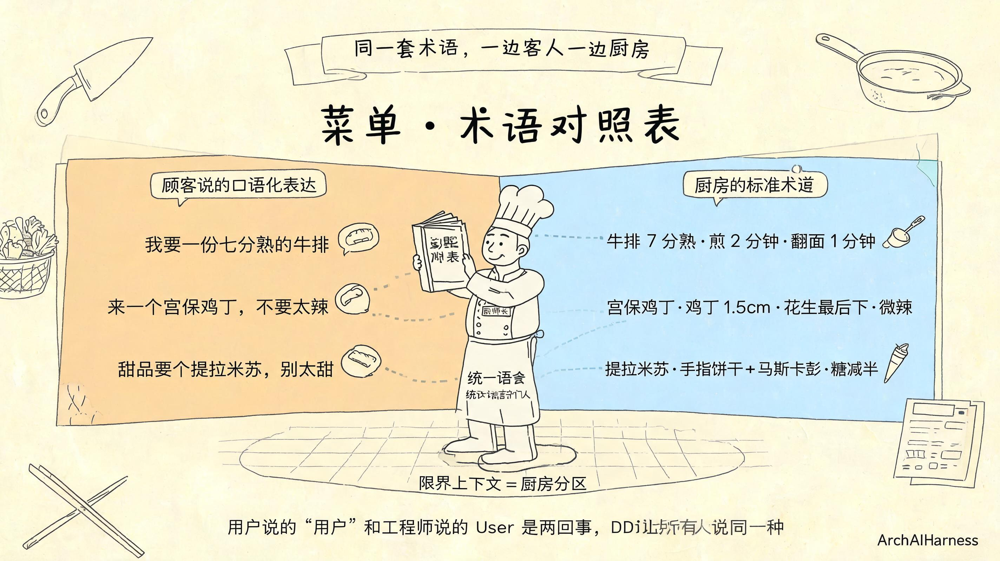
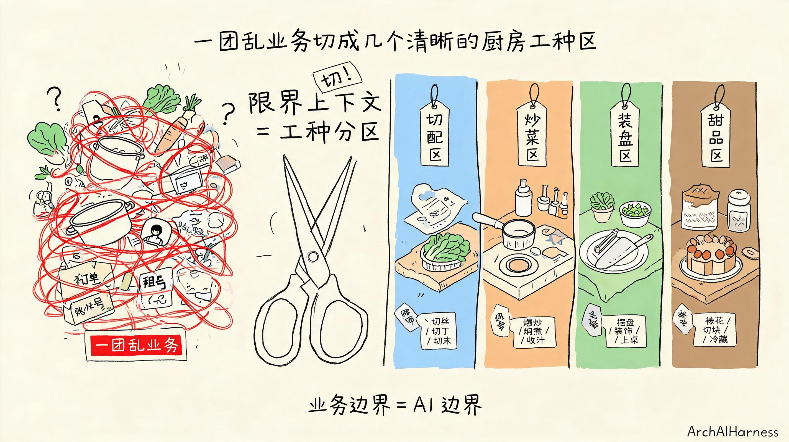
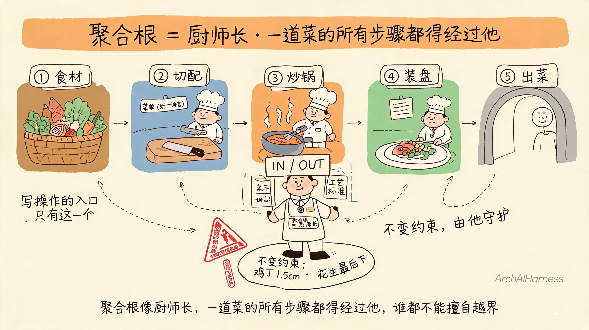
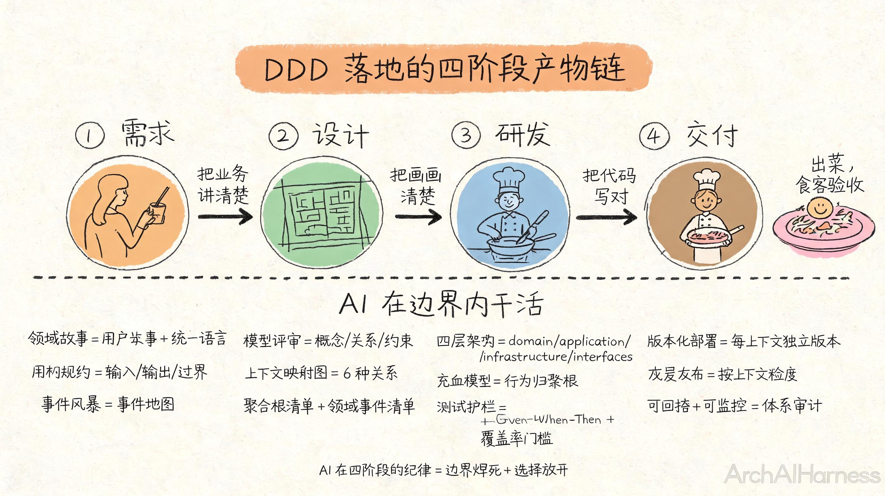
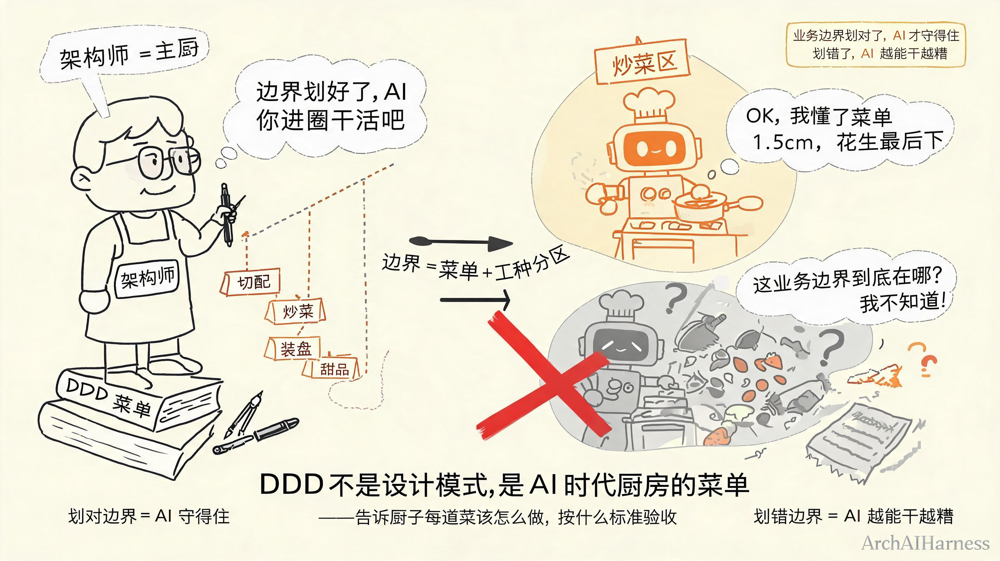

# DDD 完整指南——AI 时代工程师的第一道秩序分水岭

你越来越熟练地把活甩给 AI 了。

需求丢过去，它给你写代码；需求丢过去，它给你跑测试；需求丢过去，它给你出文档。你看着 PR 一路合，心里也越来越踏实——终于找到一个能干的搭子了。

可你最近有没有这种感觉：跑得越久，越觉得哪里不对？

不是 AI 变笨了。是它的边界变糊了。

业务规则今天是这样、明天它给改成那样；数据库的字段命名今天是这个、明天它给换了；接口签名今天能这样调、明天它又改了一种风格。你看着它学得越来越快，可你心里越来越虚——它学得太快了，快到把项目里所有"不一致"也一起学了进去。

这一篇专门解决这件事——给 AI 划第一道业务边界。也就是 DDD。

不是教你 DDD 是什么。你可能早就看过那本蓝皮的《领域驱动设计》，知道限界上下文、知道聚合根、知道通用语言。你缺的不是这些概念，是**怎么把 DDD 用到 AI 协作里**——AI 不吃概念，AI 吃规矩。你不把规矩立出来，AI 就照着自己"印象里"的样子写。

这一篇不讲 DDD 的全套理论（三十多年的方法论一篇讲不完），只讲**AI 时代最该抓住的那一段**——什么是 DDD、怎么做 DDD、如何落地 DDD。三件事讲清楚，AI 协作的"第一道秩序分水岭"就立起来了。

下面我们一段一段拆。



## 一、AI 越能干，业务边界越值钱——一个被忽视的反直觉现场

你可能觉得这个标题反了。AI 越能干，交付效率越高，业务边界应该越来越不值钱才对啊——边界越多，AI 越难快速跑通；边界越少，AI 越能放开手脚。

听起来很有道理。可真实现场不是这样。

我先把现场摆给你看。我过去一年在多个 AI 协作项目里看到的剧本，几乎都是这么演的：

**第一周**，你把 AI 拉进来。它学得飞快——你说一句"加个用户注册功能"，它给你整出 controller、service、repository、dto、测试，整整齐齐一坨。你心里乐开花——这不就是我想要的 AI 工程师吗。

**第三周**，你让它给 `Tenant` 实体加一个字段。它没问你这个 `Tenant` 在哪个限界上下文里、有没有现成的聚合根、租户成员关系是不是另一个上下文的核心，就直接照着它"印象里"的 `Tenant` 给字段补了上去。你打开一看——字段命名跟现有 `User` 不一致、缺审计字段、连主键都没跟你项目的 `TenantId` 值对象对齐。

**第六周**，你让它加一个"租户成员变更后通知"的逻辑。它又一次凭印象写——它在你这个项目的上下文里看到"租户成员关系"几个字，自己琢磨了一下，觉得这应该归 `user-center`，于是顺手把事件发送的代码写进了 `user-center` 的 `UserService`。可实际上，租户成员关系是 `tenant-center` 的核心，`user-center` 想要同步，得通过 Kafka 事件订阅，不能直接写。你打开 PR，事件发的方向都反了。

**第三个月**，你打开代码库，发现：五个领域实体的字段命名风格各不相同；三个服务的方法签名对不上 `interface` 层的约定；`tenant-center` 的核心规则被 `user-center` 写了一半；文档里还有两套"领域服务"的定义，其中一套是 AI 自己造的。

你回头看 PR 列表，三个月里没有任何一条 P0 红线被触发。每一条都是"看起来合理的小改动"。但合起来，业务边界已经悄悄糊掉了——你想重构都不知道从哪下手。

**这不是 AI 太强。这是业务边界给得太弱。**

AI 没有"业务直觉"。你看到"租户成员关系"四个字，脑子里立刻会跳出"这是 `tenant-center` 的核心，不是 `user-center` 的字段；如果 `user-center` 要查，得走事件同步或 Feign，不能直接连表"——这一整套判断是多年业务建模经验堆出来的。

AI 没有这堆经验。它看到的是字符、命名、文件位置、上下文里你最近一次提的偏好。它能写出语法正确的代码，但它写不出"业务上的对"。

更扎心的是，**它不是在犯错，它是在学得过于认真**。它在用最快的速度模仿你项目里的所有不规范，然后用同样的速度放大它们。

所以这个反直觉的结论你得先吞下去——

**AI 不怕规矩，AI 最怕没规矩——DDD 就是给 AI 划的第一道业务边界。**

这一句你得记牢。它是这一篇的底色。

**业务边界划对了，AI 才守得住；业务边界划错了，AI 越能干越糟。**

这两句合起来，就是 AI 时代 DDD 的真正价值——不是教你写更漂亮的领域代码，是给 AI 立一套它能照着走的"业务地图"。

### 为什么这件事过去没人提

你可能想问：DDD 是 2003 年的方法论，为什么二十多年过去，今天才突然被 AI 时代捧成"第一道秩序分水岭"？

因为过去不需要。

2003 年到 2022 年那段时间，DDD 是企业级复杂系统的"加分项"——你做支付、做银行、做大型电商，团队几十上百人，业务跨十几个领域，DDD 能帮你把团队理顺；你做个小博客、小 CRM，DDD 用不用差别不大，团队三五个人，谁脑子里的"用户"是什么含义，同事之间聊两句就对齐了。

AI 时代情况反过来了。

AI 进来之后，"人"和"人"的对齐问题变成了"人和 AI"的对齐问题。你脑子里以为你跟 AI 对齐了，其实你只对齐了一次——你跟它说了"这里说的用户是客户"，它点点头；下次你新开一个会话、换一个新任务，AI 又回到"语料库里的平均值"那个"用户"。

每一次新任务都得重新对齐。每一次新会话都得重新对齐。

这件事靠"口头对齐"磨不平——你不能让团队里每个工程师、每个产品经理、每次新来的 AI 都重新对齐一次"用户到底指什么"。

怎么办？**把对齐写进文档还不够，得把对齐写进 AI 的工作流里**。DDD 在 AI 时代的真正用法，是把统一语言、限界上下文、聚合根这些"地图要素"——不是写给团队新人 onboarding 用的，是**写给 AI 每次开工前自动读的**。

这件事过去没人提，是因为过去没有 AI 需要"读这份地图"。今天有 AI 进场了，地图才变成必需品。

所以 DDD 的价值从来没变——切清业务边界。变的是它今天服务的对象：过去是人，今天是 AI。**过去给人画地图，今天是给 AI 画地图**。

那到底怎么立？这套业务地图长什么样？下一节我们正式讲 DDD 是什么。

## 二、什么是 DDD——把"一团乱业务"切成"几个清晰的厨房工种"

我们把 DDD 摆到桌面上。

DDD 全名 Domain-Driven Design，领域驱动设计。Eric Evans 2003 年提出。三十多年的老方法论，今天在 AI 时代突然从"加分项"变成"必选项"——原因就是上一节说的，AI 没有业务直觉，得靠人给它画地图。

这套地图的"画法"由三件事组成——**统一语言、限界上下文、聚合根**。这三件事就是 DDD 的核心骨架。把它们讲清楚，你就看懂了 DDD 在 AI 时代的一半。

下面我们按"先讲为什么需要它，再讲它是什么"的顺序拆。整套讲述我用**餐饮后厨**作主线比喻——这套比喻不是装饰，是帮你从厨房的物理直觉直接推出 DDD 的工程结论。

### 一句话故事：沟通失真怎么发生的

我先给你讲一个真实的小故事。

有一次，我跟一个业务方的产品经理聊需求。他说："我们要做一个用户管理功能。用户可以注册、登录、改资料。"

我点点头，把这句话记下来，回到工位跟工程师说："我们要做一个 `User` 模块。`User` 实体有几个字段：`id`、`username`、`email`、`createdAt`。"

工程师开始写代码。过了两天，他给我提了个 PR，写了个"用户列表"接口。我打开一看——这个接口返回的是"系统账号"，每个"用户"对应一个 `Account`，有 `accessKey`、`secretKey`、`tenantRole` 这些字段。

我愣住了。回头找产品经理，他说："我要的不是这种用户啊。我要的是'客户'——客户有姓名、手机号、收货地址、会员等级。"

问题出在哪？

**业务方说的"用户"和工程师写的"User"根本不是同一个东西。**

业务方脑子里的"用户"是 C 端的"客户"——姓名、手机号、收货地址；工程师脑子里的"用户"是 B 端的"账号"——accessKey、secretKey、tenantRole。两个词字面完全一样，但意思差着十万八千里。

这就是典型的"沟通失真"。

更糟的是，这种失真不是某一个人的错——业务方没错（他说的就是他脑子里的"客户"），工程师也没错（他写的也是他脑子里的"账号"）。错的是**整个团队没有一套共同的语言**。每个人脑子里的"用户"都不一样，谁也没把差异讲出来。

传统开发里，这种失真靠会议、靠评审、靠产品经理一遍一遍解释，能磨平。

AI 时代磨不平。AI 看到 `User` 这个名字，它自动从语料库提取出最常见的"账号"含义，然后照着"账号"的模板写代码。你告诉它"我这里说的是客户"，它点点头，下次再写代码时，又把"客户"写成"账号"——因为它没把这次对话记成"通用语言"，只记成了"一次聊天"。

怎么办？

### 统一语言：菜单上的术语对照表

DDD 的第一个核心就是**统一语言（Ubiquitous Language）**。

什么意思？团队里所有人——业务方、产品经理、工程师、AI——**对同一个词用同一种解释**。业务方说"用户"就是指"客户"，工程师写 `User` 就是指"客户"实体，AI 看到 `User` 也立刻知道这是"客户"。这个词在哪都指同一个东西，不漂移。

怎么做到？**立一份术语对照表**——这跟后厨的**菜单术语对照表**是一回事。

每家餐厅都有一份"菜单"——左半边写"顾客的口语化表达"（"我要一份七分熟的牛排"），右半边写"厨房的标准工艺术语"（"牛排 7 分熟，煎 2 分钟，翻面 1 分钟"）。服务员拿菜单接单，厨师按菜单术语做菜。两边都对照同一份菜单，客人说"七分熟"和厨房说"7 分熟"是同一件事——谁也不用翻译。

我刚才那个真实故事，正确的做法是——业务方第一次说"用户"的时候，工程师不要立刻开始写代码，而是先停下来，跟业务方一起把这张表列出来：

> 业务方说的"用户"对齐到 `Customer`（客户）。
> 业务方说的"账号"对齐到 `Account`（账号）。

这张表就是统一语言的核心——**术语对照表**。它不是文档里的摆设，是每次开会、每次写代码、每次给 AI 下指令时都要拿出来对照的"字典"。

AI 时代这张表还多了一个用户——AI。你把这份表喂给 AI，让它每次写代码前先看一遍这张表，对照 `Customer` 是不是"客户"、对照 `Account` 是不是"账号"。AI 看到 `User`，它会去查对照表——查到了"客户"，按 `Customer` 写；查到了"账号"，按 `Account` 写。

**用户说的"用户"和工程师说的"User"是两回事——DDD 让所有人说同一种话。**

这一句你记下来。统一语言是 DDD 的第一道护栏，它解决"沟通失真"。

### 限界上下文：后厨工种分区

有了统一语言还不够。

我刚才那个故事，业务方和工程师已经对齐了"用户" = `Customer`、`"账号" = `Account`。可一个真实的系统里，**同一个词在不同业务里可能有不同含义**。

举个例子。

你在做一个电商系统。有个词叫"商品"。在"商品中心"里，`Product` 指的是 SPU（标准化产品单元，比如"iPhone 15 Pro"）；在"库存中心"里，`Product` 指的是 SKU（库存单元，比如"iPhone 15 Pro 256GB 深空黑"）；在"营销中心"里，`Product` 指的是"营销活动里的一件商品"，可能还带着优惠券、满减规则。

三个"商品"字面完全一样，意思完全不同。

如果团队里就一份"术语对照表"，这张表里"商品"只有一个解释，AI 写代码时就糊涂了——它在商品中心按 SPU 写，到库存中心一看代码不对，按 SKU 改；改完了营销中心又调用这个字段，发现又不对，按"营销活动商品"再改。一轮下来代码一团乱。

怎么办？**承认不同业务有不同的语言**。

这就引出了 DDD 的第二个核心——**限界上下文（Bounded Context）**。

限界上下文不是什么高大上的技术概念，它就是**业务的边界**——一个边界里有一套自己的语言，出边界就换另一套语言。

我用"后厨工种分区"作最直觉的比喻。

一家像样的餐厅，后厨一定是分区作业的——切配区管洗菜切菜，炒菜区管上灶翻锅，装盘区管摆盘装饰，甜品区管糕点冰品。每个区有自己的台子、自己的刀和锅、自己的食材、自己的用语。切配区说"切丝 / 切丁 / 切末"，炒菜区说"爆炒 / 焖煮 / 收汁"——两个区的用语完全不挨着。

更重要的是**各区有挡板**——切配区的人不会顺手跑到炒菜区去翻锅，炒菜区的人也不会跑来切菜。**不是因为他们不会，是因为越界会乱**。一道"宫保鸡丁"的鸡丁该多大、切配区定；该炒多久，炒菜区定；摆成什么形状，装盘区定。越界去定别人的标准，整道菜就糊。

业务也一样。你把一团乱麻的业务切成几个"工种区"，每个区有自己的术语、自己的标准、自己的挡板。"商品"在商品中心叫 SPU、在库存中心叫 SKU、在营销中心叫"营销商品"——这三个名字是三套术语，每个上下文认自己的术语。

AI 进了哪个工种区，就用哪套术语；出了工种区，停下来问人。这就是 DDD 给 AI 划的第一道业务边界——**业务边界 = AI 边界**。

**限界上下文 = 后厨工种分区——各管一段，各有各的台子、刀具、食材、用语。**

这一句也记下来。

到这里你大概有感觉了：DDD 切出的圈，就是 AI 干活的圈。AI 在圈内有规矩（统一语言），出圈就停下来。

那圈里的东西怎么组织？下一个概念上场——聚合根。

### 聚合根：厨师长管一道菜

我们再看一个例子。

你现在做电商订单系统。一个"订单"有哪些东西？

- 订单本身（订单号、下单时间、状态）
- 订单里的商品项（每个 SKU、数量、单价）
- 收货地址（姓名、电话、地址）
- 付款记录（支付方式、支付时间、支付金额）

这五个东西绑在一起，构成了"一笔完整的订单"。你改"收货地址"，不影响订单项和付款记录；你加一个订单项，得保证订单总额算对；你支付成功，得把订单状态改成"已付款"。

这五个东西是绑在一起的——**它们必须作为一个整体被改**。

这就是聚合根要解决的问题。

**聚合根（Aggregate Root）**就是这种"绑在一起、必须一起改"的圈里最核心的那个东西。订单聚合里，聚合根是"订单"本身；订单项、收货地址、付款记录都是"订单的内部成员"，不直接暴露给外部。

我用"厨师长"作聚合根的比喻——

一道菜从选材到装盘要经过切配、炒锅、装盘三个工种。每个工种区有自己的人、台子、家伙——但**谁拍板**？厨师长。

厨师长戴高帽、系围裙、双手举起"IN / OUT"双向牌子，胸牌写着"聚合根 = 厨师长"。所有工种区的人要交接，都得过他签字——切配把切好的鸡丁递给炒锅，厨师长看一眼"切得合不合格"；炒锅把炒好的菜端给装盘，厨师长尝一口"火候对不对"。装盘端出厨房门之前，还得厨师长再过一道眼。

他守什么规矩？**不变约束**。比如"宫保鸡丁的鸡丁必须 1.5 厘米见方、花生必须最后下"——这条规矩厨师长必须守，外面的人改工艺时，厨师长会自动核对；不合格就退回去重做。

为什么这么设计？因为**保证一致性**。一道菜的鸡丁大小、花生时机、摆盘形状必须协调，不能出现"鸡丁切得太大、炒得太老、摆盘散掉"这种矛盾。厨师长守在出口，所有工序都过他的检查，整道菜就一致了。

AI 改一个聚合根时，它只能在这个聚合根内部改，不能顺手把别的东西也改了。AI 改 `Order.create()`，它只能改订单聚合内的逻辑，不能顺手把支付链路也改了——那是另一个聚合根的一致性问题。

**聚合根像厨师长——一道菜的所有步骤都得经过他，谁都不能擅自越界。**

这一句也得记下来。

### 补两个概念：实体和值对象

**实体（Entity）**——有 ID 的东西。订单是一个实体（有订单号）、用户是一个实体（有用户 ID）。两个订单即使所有字段都长得一模一样，它们的订单号不同，就是不同的两个订单。实体靠 ID 区分。

**值对象（Value Object）**——没 ID 的东西。收货地址是一个值对象（北京市朝阳区某街道 123 号 = 北京市朝阳区某街道 123 号，只要字段一样就是同一个地址）。两个收货地址完全一样，可以互换。值对象不靠 ID 区分，靠"长得一样就是一样"区分。

为什么要区分？因为改的方式不同。改一个实体，你得按 ID 找到它再改；改一个值对象，你可以直接整块替换（"把旧地址换成新地址"）。

这一段你看到这里，DDD 的核心 5 个概念——**统一语言、限界上下文、聚合根、实体、值对象**——就都讲完了。再加上一个我们后面会用到的：

**领域事件（Domain Event）**——厨房里的广播。切配区喊一声"鸡丁切好了"，炒锅区听见了来接——这就是"切配完成事件"；炒锅区喊一声"菜已下锅"，装盘区听见了准备盘子——这就是"下锅事件"。事件是"过去发生了的事"，AI 通过领域事件知道"刚才哪个工种做了什么"，再决定自己要不要响应。

到这里，"什么是 DDD"这一节就讲完了。DDD 的核心不是 19 个术语，是**切工种 + 各工种各管一段 + 工种之间按规矩交接**这三件事。统一语言让工种内术语一致，限界上下文切出业务边界，聚合根守住圈内的不变约束——这三件事就是 DDD 给 AI 画的"厨房地图"。

但地图画出来还不够——工种和工种之间怎么连？下一节我们讲"怎么做 DDD"。



## 三、怎么做 DDD 之战略设计——先把大圈划清楚

DDD 的"做法"分两层——**战略设计**和**战术设计**。战略设计管"切大圈"，战术设计管"切小圈"。这一节讲战略，下一节讲战术。

战略设计只回答一个问题：**业务怎么切？**

切法分三步——**找领域、划子域、切上下文**。

### 第一步：找领域，划子域

"领域"就是你这个系统要解决的业务问题。电商系统的领域是"卖货"，银行系统的领域是"管钱"，SaaS 平台的领域是"租户服务"。

一个领域里通常包含三类子域：

- **核心子域**——你这个系统最值钱的部分，是别人抄不走的竞争力。电商系统的核心子域是"个性化推荐"，银行系统的核心子域是"风控"，SaaS 平台的核心子域是"租户隔离与权限"。
- **支撑子域**——帮你支撑核心子域但不是核心的部分。电商的"订单中心"、银行的"账户系统"、SaaS 的"认证中心"。
- **通用子域**——到处都能用、大家都在做、买现成的就行。邮件发送、短信通知、文件存储。

这三类子域的区别是**投入策略**。核心子域得花最大精力自己养；支撑子域可以团队自建但不必过度投入；通用子域直接买服务或用开源方案。

找子域的方法很多——**事件风暴**、**用户故事拆解**、**业务专家访谈**——这一节不展开（后面"如何落地 DDD"小节讲事件风暴）。这里你只要记住一件事：**子域是按"业务价值"切的，不是按"代码模块"切的**。

### 第二步：切上下文——大圈怎么划

子域找到了，下一步是把它切成限界上下文。

切的时候有三条判断标准——

- **业务能力**：一个上下文能不能独立完成一类业务？订单上下文能不能从下单到支付完成一整套？认证上下文能不能独立负责登录登出？能，就切成独立上下文。
- **团队结构**：一个团队能不能独立负责一个上下文？这个团队里有领域专家、有工程师、有测试——可以独立交付，就独立成上下文。
- **变化频率**：这块业务是不是经常变？经常变就独立成上下文，否则跟别的挤在一个上下文里，每次变动都拖一帮人。

这三条不是死的。你可以根据实际情况加第四条、第五条——但核心思想是**让每个上下文"自洽"**——有自己的语言、有自己的聚合根、能独立交付。

切错了会怎样？切得太粗——一个上下文里塞了三个业务的语言，AI 写代码时就糊涂，"这个 `User` 到底指哪边？"切得太细——一个上下文就一个实体，每次跨上下文调用比内部调用还多，性能崩、复杂度爆炸。

正确的切法是**让每个上下文像一个独立的后厨工种区**——有自己的台子、自己的刀具、自己的食材、自己的用语；规模不大不小，刚好能自给自足。

### 第三步：上下文映射——工种之间怎么交接

上下文切完了，它们之间怎么协作？

这就是**上下文映射（Context Mapping）**——圈与圈的关系。

我把最常用的 6 种关系列出来，你按场景挑。后厨工种之间的交接就是这 6 种关系的物理化身。

**1. 客户-供应商（Customer-Supplier）**

切配区把切好的菜递给炒锅区——炒锅是"客户"，切配是"供应商"。最常见的协作模式。例子：`auth-center` 是供应商，提供"token 签发"服务；`gateway` 是客户，调用 token 校验。上下游关系清楚，单向依赖。

**2. 发布-订阅（Published Language）**

后厨的对讲机广播"鸡丁切好了"——切配区不知道谁在听（也许炒锅区、也许凉菜区、也许甜品区），听见的人自己决定要不要接。例子：`tenant-center` 发"租户成员变更"事件到 Kafka，`user-center` 订阅事件同步本地缓存。发的人和收的人互不知道对方存在，谁加谁减都行。

**3. 共享内核（Shared Kernel）**

后厨工种之间共用一份"摆盘标准"——切配切什么形状、装盘就摆什么形状，这份"形状对照表"是所有工种共同遵守的。最常见的是"共享 Header 规范"——比如 `x-user-id`、`x-tenant-id`、`x-tenant-ids` 三个 Header 是四仓横着穿的，谁都不能私自扩展。共享内核是少数能"横着走"的东西，约束极严。

**4. 开放主机服务（Open Host Service）**

传菜台对外开放——任何服务员都能来取菜，传菜台的"出菜契约"焊死（出什么菜、配什么餐具、几点前送到）。例子：`gateway` 的 6 个 SPI 接口就是开放主机服务——契约焊死，谁都能接入，实现随意换。

**5. 防腐层（Anti-Corruption Layer）**

餐厅的"翻译菜单"——外国客人看不懂中文菜单，服务员用一份"翻译版"接单，送到后厨的还是中文菜单。例子：`order-center` 要跟老旧的 ERP 系统对接，ERP 里的字段命名跟 DDD 完全对不上——加一层防腐层把 ERP 的脏数据翻译成 DDD 的干净模型，不让外部污染内部。

**6. 合作关系（Partnership）**

切配和炒锅深度绑定——鸡丁切多大、炒多久、切配和炒锅得实时对齐，因为一道菜的火候一旦确定就没法改。这种关系最强，但也最脆弱——一边出问题另一边就崩。

这 6 种关系不是要你全背下来，是让你知道**圈和圈的连接方式不止一种**。你做架构时，按业务场景挑最合适的那一种。

> 一句话总结战略设计：先按业务价值切子域（核心/支撑/通用），再按业务能力/团队/变化频率切上下文，最后用 6 种上下文映射关系把圈连起来。

战略设计把大圈切清楚了，战术设计把小圈也讲完——下一节上场。

## 四、怎么做 DDD 之战术设计——再把小圈划清楚

战略设计完了，你手上有一张"厨房地图"——几个工种区、每个工种区的台子、刀具、食材、用语，以及工种之间的交接方式。

战术设计回答下一个问题：**圈内的东西怎么组织？**

战术设计的主角是三个核心概念：**聚合根、实体、值对象**——上一节"什么是 DDD"里我讲过它们的直觉比喻。这一节我们往里走一层——讲它们怎么落地、怎么编码、怎么让 AI 在圈内写得对。

剩下的几个概念（领域服务、仓储、防腐层、合作关系）我们快速过，每条一两句点住。

### 聚合根（Aggregate Root）——厨师长守在出口

聚合根是工种区里的"厨师长"，所有进出都得经过他。这一节我们讲厨师长具体怎么守。

**第一条规矩：所有写操作都从聚合根开始。**

你要改订单的收货地址，不能直接改 `Address` 这个对象，得调 `Order.changeAddress(newAddress)`。改完的逻辑由 `Order` 自己决定——校验新地址是不是有效、重新算运费、记录修改日志。所有这一切都在 `Order` 内部完成。

AI 写代码时遵守这条规矩——**所有改数据的入口都是聚合根**。AI 改一个聚合，不能直接改它的内部成员，必须通过聚合根提供的方法。

**第二条规矩：聚合内的不变约束由聚合根守护。**

"订单总额 = 订单项总和"是一条不变约束。这条规矩不能写在订单项里（订单项自己不知道总和），不能写在 service 里（service 管编排不管约束），必须写在聚合根本身——`Order.addItem()` 加完订单项后自动重算总额，不一致就抛异常。

AI 写代码时，聚合根本身的方法就是"数据不一致的最后一道闸"。AI 在边界内怎么实现都行，但出了不变约束，闸就拦住。

**第三条规矩：聚合通过 ID 引用，不直接持有引用。**

订单要关联用户，不能在 `Order` 实体里塞一个 `User` 对象——只能放一个 `UserId` 值对象。为什么？因为聚合根要保持边界清晰，引用别人家的实体就意味着跨边界。`Order` 想知道用户的名字，得通过 `UserId` 单独查 `User-center`，不能直接 `order.getUser().getName()`。

AI 写代码时遵守这条规矩——**跨圈只能拿 ID，不能直接拿对象**。这一条焊死了，AI 写不出"跨边界连表"的烂代码。

**聚合根像厨师长——一道菜的所有步骤都得经过他，谁都不能擅自越界。**

这条规矩我们上一节讲过，再敲一遍。

### 实体（Entity）——有 ID 的东西

实体有一条核心规矩：**身份由 ID 决定，不由字段决定**。

订单 `O001` 和订单 `O002`，即使所有字段一模一样，它们也是两个不同的实体。改一个不影响另一个。

这条规矩对 AI 来说特别重要——**AI 不能因为"字段长得一样就合并数据"**。你改 `O001` 的收货地址，`O002` 的收货地址绝对不能跟着变。

工程上，实体通常用一个强类型的 ID 值对象来标识——`OrderId`、`UserId`、`TenantId`——而不是直接用 `String` 或 `Long`。为什么要这样？因为强类型 ID 能让编译器帮你守边界——`UserId` 类型的方法不能传 `OrderId`，传错了编译就报错。AI 写代码时编译器这一关就拦下了。

### 值对象（Value Object）——没 ID 的东西

值对象有一条核心规矩：**相等性由字段决定**。

收货地址 `{province: "北京", city: "北京", street: "某街 123 号"}` 跟另一个完全一样的收货地址——它们相等，可以互换。换句话说，**值对象是不可变的**。

这条规矩对 AI 来说意味着——**改值对象不是改，是替换**。把旧地址换成新地址，不是 `address.setProvince("上海")`，而是 `order.changeAddress(newAddress)`。

工程上，值对象通常用 Java 16+ 的 record 类型——所有字段 `final`、自带 equals/hashCode/toString。AI 写 record 不会写错，自带不可变语义。

### 领域事件、领域服务、仓储——点到为止

剩下几个战术设计概念，我们快速过：

**领域事件（Domain Event）**——厨房里的广播。切配区喊一声"鸡丁切好了"、炒锅区喊一声"菜已下锅"，都是事件。事件是过去式的、不可变的、发出去就不能改。AI 通过领域事件知道"圈里发生了什么"，再决定自己要不要响应。

**领域服务（Domain Service）**——不属于任何聚合的逻辑。比如"转账"这件事，"转出账户"和"转入账户"是两个聚合根，"转账"逻辑不属于任何一个，得放在领域服务里。领域服务是个兜底——大多数业务逻辑应该归聚合根，归不了的才放领域服务。

**仓储（Repository）**——聚合根的存取。每个聚合根对应一个仓储，负责把它存进数据库、从数据库里读出来。仓储接口通常定义在 domain 层，实现在 infrastructure 层（依赖方向：infrastructure → domain → common）。

**防腐层（Anti-Corruption Layer）**——跟外部系统对接的翻译层。外部系统字段命名脏、数据格式乱，加一层 ACL 把脏数据翻译成 DDD 的干净模型。防腐层放在 infrastructure 层，跟外部系统的脏代码隔离。

这些概念在战术设计里都用得到，但用得最多的还是**聚合根、实体、值对象**这三个。AI 写代码时把这三个守住，DDD 的战术设计就完成了大半。

到这里"怎么做 DDD"两节就讲完了。战略设计切大圈（领域、子域、上下文、映射关系），战术设计切小圈（聚合根、实体、值对象、领域事件、领域服务、仓储）。两层合起来，就是 DDD 的完整方法论。

但方法论讲完还不够——怎么把它落到真实项目里？下面两节讲落地。



## 五、如何落地 DDD 之需求阶段——把"做什么"讲清楚

方法论讲完了，问题来了——怎么把 DDD 真的用起来？

DDD 的落地分四个阶段——**需求、设计、研发、交付**。这一节讲需求，下一节讲设计、研发、交付。

需求阶段的核心任务只有一件事：**把业务讲清楚**。

传统需求阶段，产品经理写 PRD（产品需求文档）、画原型、列用户故事。AI 时代这套流程不是不要，是要升级——升级到 DDD 风格的"领域故事"。

### 领域故事 = 用户故事 + 统一语言

用户故事大家熟——"作为一个用户，我想注册账号，以便登录系统"。这是用户视角的需求描述。

领域故事多一步——**把用户故事里的每一个词都对齐到统一语言**。

比如用户故事说"用户注册账号"——

- "用户" 对齐统一语言：是 `Customer`（C 端客户）还是 `Account`（B 端账号）？业务方第一次说"用户"的时候就得敲定。
- "注册" 对齐统一语言：是 `register`（开放注册）还是 `createByAdmin`（管理员代创建）？两种流程完全不同。

领域故事的产出物不是 PRD 那种长文档，而是一张"故事卡 + 术语对照"——每条用户故事配一份涉及到的术语确认。

AI 怎么参与这个过程？**AI 不是被动读故事，是主动问问题**。

你给 AI 一条用户故事"用户注册账号"，AI 不直接开始写代码，而是先问：

- 你这里的"用户"是 `Customer` 还是 `Account`？
- "注册"是开放注册还是邀请注册？
- 注册时要不要校验手机号、邮箱、身份证？
- 注册成功之后要不要发欢迎短信、要不要初始化默认头像？

AI 问这些问题不是在偷懒——**是在落实统一语言**。每问一次、统一一次，AI 就能少一次"凭印象写代码"。

所以这一阶段 DDD 的落地方式特别朴素——**让人和 AI 一起把术语敲定**。敲定一次，以后都按这个写。

### 用例规约：每个动作的输入/输出/边界

用户故事对齐完之后，下一步是写**用例规约**。

用例规约是什么？把用户故事里的每一个动作展开成"输入是什么、输出是什么、边界是什么、异常路径是什么"——结构化的描述。

例子：

> 用例：用户注册账号（createByAdmin）
> 前置：调用者必须是系统管理员（Role = ADMIN）
> 输入：
> - username（String，必填，长度 4-20）
> - email（String，必填，邮箱格式）
> - phone（String，必填，手机号格式）
> - initialRole（Enum，必填，可选 GUEST / MEMBER）
> 输出：
> - 新建 Account 实体（含 ID、accessKey、secretKey）
> - 返回 AccountDTO
> 边界：
> - username 全局唯一（查重）
> - email 全局唯一（查重）
> - secretKey 由系统生成（不回显明文）
> 异常路径：
> - 用户名已存在 → 抛 USERNAME_TAKEN
> - 邮箱已被注册 → 抛 EMAIL_TAKEN
> - 参数校验失败 → 抛 INVALID_ARGUMENT

用例规约的好处是**把"做什么"和"怎么做"分开**——规约只说"输入/输出/边界"，不说"用什么技术实现"。这样 AI 在写代码时知道"必须满足这些规约"，但具体怎么实现有选择空间。

AI 怎么用用例规约？**AI 把规约当验收标准**。每写完一段代码，AI 自己检查"输入参数齐不齐、输出字段对不对、异常路径全不全"。这比"AI 跑一下测试通过没"靠谱多了。

### 事件风暴：把"发生了什么事"捋清楚

最后一个需求阶段产物——**事件风暴工作坊**。

事件风暴（Event Storming）是 DDD 里一种集体讨论业务的方式：把领域专家、工程师、AI（是的，AI 可以参与）拉到一起，**用便签纸列出"过去发生了哪些事"**。

每张便签写一个事件——

- "订单已创建"
- "订单已支付"
- "订单已发货"
- "订单已完成"

按时间顺序排好，再讨论：

- 谁触发了这个事件？（找聚合根）
- 这个事件会导致什么后果？（找后续事件、找副作用）
- 这个事件需要通知谁？（找上下文映射）

事件风暴做完，你会得到一张"事件地图"——按时间顺序的事件链、每个事件背后的聚合根、聚合根之间的关系。这张地图就是后续设计阶段的输入。

AI 怎么参与事件风暴？AI 可以基于历史代码、PRD、用户故事自动生成事件清单——比如你说"帮我梳理一下订单域的事件"，AI 列出 `OrderCreated / OrderPaid / OrderShipped / OrderCompleted`，再标出每个事件的触发者和后果。人审核一下、补漏一下、改改描述，一张事件地图就出来了。

到这里需求阶段的三件产物就讲完了——**领域故事 + 用例规约 + 事件风暴**。这三件产物的共同特点是"用业务语言讲业务"——业务方看得懂、AI 也看得懂、工程师也看得懂。

下一节讲设计、研发、交付三个阶段。

## 六、如何落地 DDD 之设计、研发、交付——把"怎么做"落地

需求阶段把"做什么"讲清楚了。设计阶段回答"怎么做"，研发阶段回答"怎么写出来"，交付阶段回答"怎么上生产"。

### 设计阶段——把图、清单、边界全部画出来

设计阶段的产出物有四件——

**1. 模型评审**

需求阶段产出的领域故事、用例规约、事件地图过一遍——找概念（实体/值对象/领域事件）、找关系（聚合根的边界）、找不变约束（每个聚合根守的规矩）。模型评审不是一次会议，是反复打磨——直到每个概念清晰、每条边界清楚、每条约束可执行。

AI 怎么参与？AI 可以基于规约生成模型草稿——列概念、画聚合、标边界。人审核、补漏、改错。一轮下来，模型就稳定了。

**2. 上下文映射图**

上一节讲的 6 种上下文映射关系——落到具体项目里就是一张图。哪个上下文跟哪个上下文连、用的是哪种关系、单向还是双向、异步还是同步。AI 可以基于"上下文清单 + 关系清单"自动生成映射图，人调整细节。

**3. 聚合根清单**

每个聚合根列出来——名字、ID 类型、核心字段、核心方法、守的不变约束。这份清单是后续研发的"骨架"。AI 写代码时按清单生成聚合根类——名字照抄、字段照抄、方法照抄、约束照写。一份清单就把战术设计 80% 的活干完了。

**4. 领域事件清单**

每个事件列出来——名字、payload 字段、发布者、订阅者、是否跨上下文。这份清单是后续解耦的"接口契约"。AI 按清单生成事件类、发布代码、订阅代码。

设计阶段的四件产物加起来，就是一份"可以交给 AI 写代码的施工图"。AI 拿到这份图，按图施工，不出格、不越界。

### 研发阶段——把代码写出来

研发阶段的纪律只有一条——**分层纪律**。

经典 DDD 分四层：

```
common（零框架，纯 Java + 工具类）
  ↓
domain（领域，零 Spring，零任何框架）
  ↓
application（用例编排，事务边界）
  ↓
infrastructure（仓储、Feign、Kafka，框架依赖）
  ↓
interfaces（Controller、DTO、消息接收）
  ↓
bootstrap（启动）
```

依赖方向只有一条线：`bootstrap → interfaces → application → domain → common`、`infrastructure → domain → common`。**逆着走 = P0 红线，PR 阻塞**。

这条分层纪律为什么对 AI 特别重要？因为它把"AI 能写什么代码"焊死在边界里——

- **domain 层**：AI 只能写纯 Java 业务逻辑，不能 import Spring、不能 import 数据库、不能 import 任何框架。这是"领域纯净度"的护栏。AI 想偷懒直接在 domain 层调 repository？编译就报错。
- **application 层**：AI 在这里做用例编排——调仓储、调外部服务、发事件、跑事务。
- **infrastructure 层**：AI 在这里写数据库、Feign、Kafka 等技术实现。
- **interfaces 层**：AI 在这里写 Controller、DTO、消息接收。

AI 拿到分层纪律，写代码时自然知道"这块该放哪层"。跨层放错位置，编译就报错，不用人审代码就先拦住。

研发阶段还有三条纪律——

**充血模型 vs 贫血模型**——业务逻辑归聚合根（充血模型），service 只编排不实现（贫血模型）。AI 写代码时把行为方法写在聚合根里（比如 `Order.pay()`、`Order.cancel()`），不要写在 service 里。

**领域事件发布**——业务方法调 `registerEvent()`，事务提交后由 `@TransactionalEventListener` 触发真正的发布。AI 写代码时按这套规矩写，不用关心"什么时候发、发给谁"。

**测试护栏**——AI 写完代码必须跑测试。覆盖率门槛（domain 层 ≥ 90%、其他层 ≥ 70%）+ Given-When-Then 结构 + P0/P1/P2 分级阻塞。覆盖率不达标 = PR 阻塞。

### 交付阶段——把代码送上线

交付阶段回答"怎么上生产"——但 DDD 在这一阶段也给 AI 立规矩。

**1. 版本化部署**

每个上下文独立版本号——`auth-center v1.2.3`、`user-center v2.0.1`、`tenant-center v1.5.7`。AI 部署时按上下文独立发版，不要一个 PR 改三个仓合到一个版本号。

**2. 灰度发布**

按上下文粒度灰度——`auth-center` 先灰 10%、观察稳定后 50%、最后 100%。AI 配灰度策略时按上下文配，不要一个仓灰度覆盖其他仓。

**3. 领域变更回滚**

领域代码回滚有两种方式——**事务回滚**（单事务内的变更自动回滚）和**事件反向补偿**（已发出去的事件用反向事件抵消）。AI 写回滚逻辑时按这两种方式实现，不要直接 `DELETE` 数据。

**4. 监控指标**

每个上下文独立监控——`auth-center` 自己的 QPS、错误率、响应时间；`user-center` 自己的指标。AI 埋点时按上下文埋，不要全混在一起。

交付阶段四条规矩合起来——**版本化、灰度化、可回滚、可监控**。AI 拿到这套规矩部署代码，按规矩发版、按规矩灰度、按规矩回滚、按规矩监控，不出格、不翻车。

到这里，DDD 的四阶段落地就讲完了——**需求阶段把业务讲清楚、设计阶段把图画清楚、研发阶段把代码写对、交付阶段把上线做稳**。四个阶段各自的纪律加在一起，就是 DDD 在真实项目里的完整落地方式。



## 七、写在最后——DDD 不是设计模式，是 AI 时代厨房的菜单

回到开头那个反直觉的判断——**AI 越能干，业务边界越值钱**。

你可能还在想：以前没这么麻烦啊。DDD 是给"复杂业务系统"准备的，普通 CRUD 系统哪用得上？

这是把 DDD 当技术了。DDD 不是技术，DDD 是**给 AI 划边界的方法论**。你的系统哪怕只有一个限界上下文，AI 也得知道这个上下文里能写什么、不能写什么。DDD 不是"复杂系统的奢侈品"，是"AI 时代的基本功"。

所以 DDD 在 AI 时代的角色，**不是教你写更漂亮的领域代码，是给 AI 立一套它能照着走的"业务地图"**。

这张地图我们用"餐饮后厨"这个最日常的比喻串了一整篇——

- **统一语言** = 菜单上的术语对照表。左边是服务员接单用的"七分熟"，右边是厨房术语的"7 分熟煎 2 分钟翻面 1 分钟"——两边对照同一份菜单，谁说都是同一件事。AI 看到 `User` 也立刻知道这是 `Customer` 还是 `Account`，不会"凭印象"写。
- **限界上下文** = 后厨工种分区。切配、炒菜、装盘、甜品各管一段，各有自己的台子、刀具、食材、用语；工种之间有挡板，越界会乱。AI 进了哪个工种区就说哪个工种区的术语，出工种区停下来问人。
- **聚合根** = 厨师长。一道菜的所有步骤都得经过他，圈内的不变约束由他守护——鸡丁必须 1.5 厘米见方、花生必须最后下。AI 改一个聚合根时只能从聚合根进，跨圈只能拿 ID 不能拿对象。
- **上下文映射** = 后厨工种之间的交接。客户-供应商是切配递鸡丁给炒锅、发布-订阅是"鸡丁切好了"的对讲机广播、共享内核是"摆盘标准"、开放主机是传菜台、防腐层是翻译菜单、合作关系是切配和炒锅的深度绑定——6 种连接方式按业务挑。

**DDD 不是设计模式，是 AI 时代厨房的菜单——告诉厨子每道菜该怎么做、按什么标准验收。**

这一句你记下来。它是这一篇的核心命题，也是 AI 时代工程师的第一道秩序分水岭。

你可能会问：DDD 写进文档了，AI 真的会照着写吗？

会的——如果你按这一篇讲的四阶段流程做，需求阶段对齐了统一语言、设计阶段画出了上下文映射图、研发阶段遵守了分层纪律、交付阶段按规矩发版，AI 就会照着写。

但如果你只把 DDD 写进文档、没把 DDD 焊进 AI 工作流，AI 就会"读了一遍文档然后按自己印象写"——因为 AI 缺的不是文档，是**纪律**。纪律怎么焊？四阶段流程本身就是纪律。

光说不练假把式。下一篇，我们讲 TDD——AI 时代的全流程自动化审计。

DDD 划清了业务边界，AI 不会越界了。但还有一类问题没解决：**AI 写出来的代码，逻辑上对不对？** 比如它把"折扣叠加规则"写错了，业务边界没越，但结果是错的。DDD 管不了这种 bug，**靠 TDD 在 CI/CD 里自动拦下**。

下一篇你会看到，TDD 怎么依托 DDD 的限界上下文拆出可测单元、怎么用 Given-When-Then 结构写测试、怎么把测试集成进 CI/CD 流水线，让 AI 写错代码时**直接被拦截退回，连合并都进不去**。金融级 aiXcoder、SpecStory Studio 都是这么干的——线上缺陷 -34%，人工复审 -50%。

对了——DDD 和 TDD 听起来都是给 AI 立规矩。但你可能有个疑问：**规矩立完了，AI 哪还有发挥空间？** 这就涉及一个关键概念——**留白区**。DDD 锁业务赛道、TDD 卡审计红线，但在这两条边界之间，AI 写类拆分、选设计模式、实现工具函数，这些"纯技术实现细节"应该完全交由 AI 自主发挥，工程师不该再管。这块我们会在 31 篇讲 SDD 时专门讲——它就是这套方法论的差异化亮点。

到时候你会看到，DDD 不是一个抽象概念，是一份**跑得起来的厨房分工图**。



---

### 关于 ArchAIHarness

这篇文章是「看懂 AI 与智能体」专栏的一部分，由 [**ArchAIHarness**](https://github.com/ArchAIHarness) 持续输出。

ArchAIHarness 是一套面向 AI 时代软件工程的人机协同架构哲学与公开工程资产，主张：

> **架构师定义秩序，AI 在秩序中生长。人立法，AI 执行，体系审计。**

如果你也希望 AI 在明确的架构边界内协作，而不是在混沌中碰运气，欢迎到 GitHub 上看看我们在做什么：

- **组织主页**：[github.com/ArchAIHarness](https://github.com/ArchAIHarness) — 了解完整理念与资产全景
- **本专栏**：[`zhuanlan-ai-and-agents`](https://github.com/ArchAIHarness/zhuanlan-ai-and-agents) — 所有文章的源码与发布记录
- **实践指南**：[`docs`](https://github.com/ArchAIHarness/docs) — 架构哲学、工程方法和落地指南
- **开源工具**：[`agent-workflows`](https://github.com/ArchAIHarness/agent-workflows) — 可复用的 AI 协作 Agents、Skills 与 Tools
- **工程样例**：[`framework`](https://github.com/ArchAIHarness/framework) — DDD + AI 协作的工程底座，展示如何在开发中融合 AI

> Engineered by Architects · Empowered by AI · Audited by Discipline
