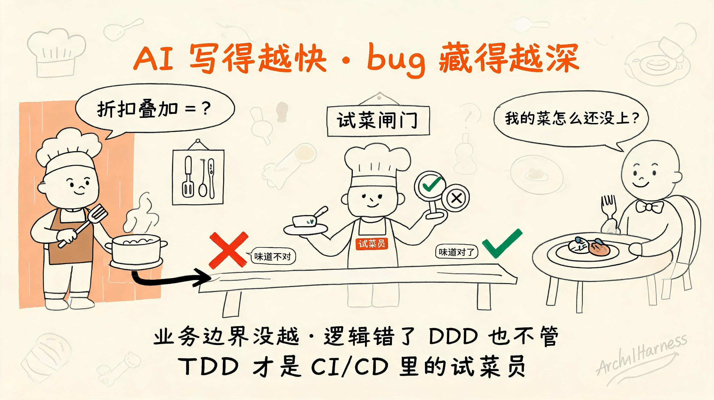
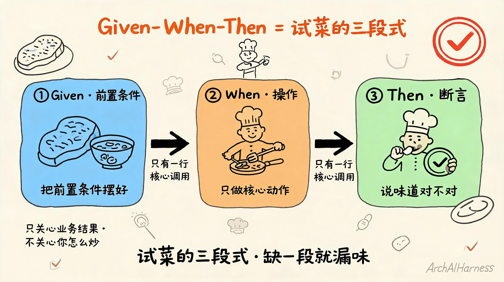
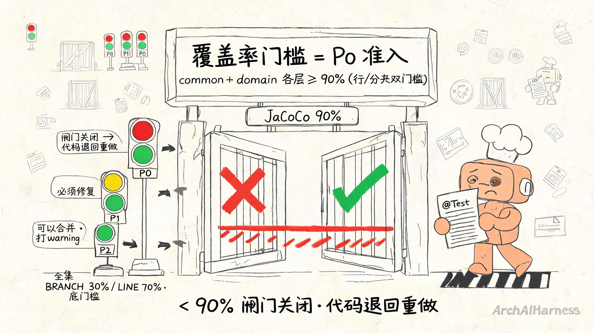
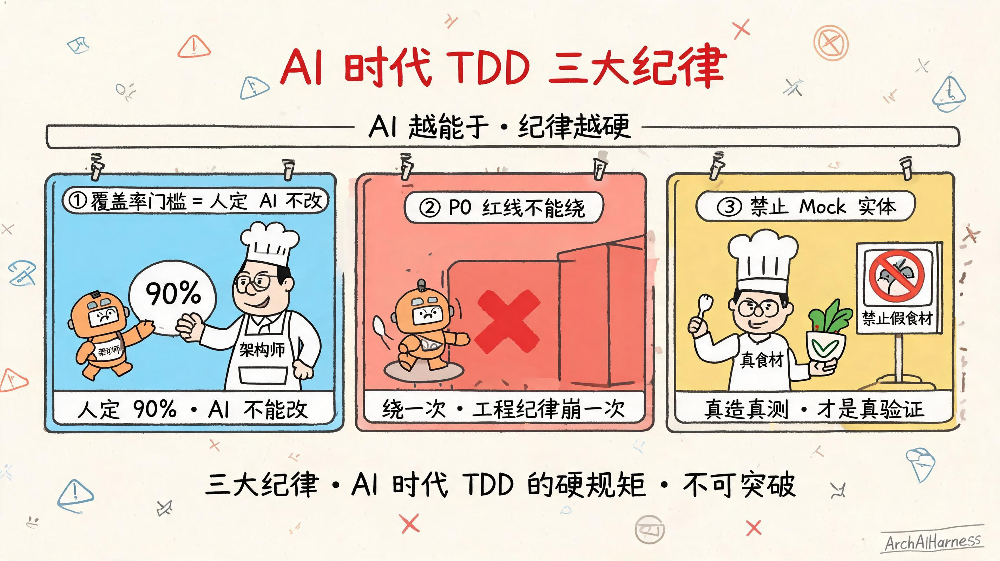
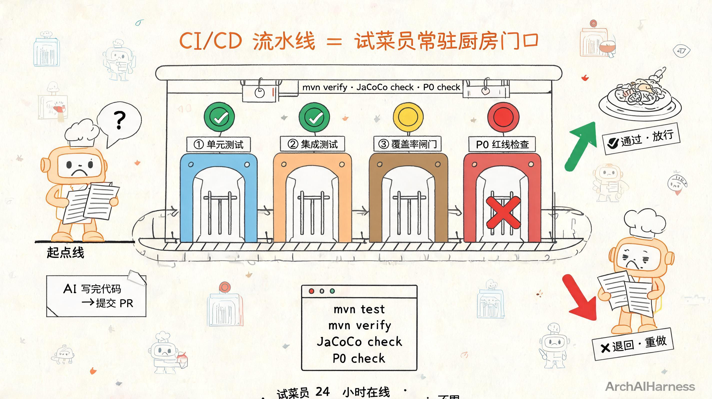

# TDD 完整指南——AI 时代工程师的全流程自动化审计

你越来越熟练地把活甩给 AI 了。

需求丢过去,它给你写代码；需求丢过去,它给你跑测试；需求丢过去,它给你提 PR。你看着 PR 一路绿灯,心里也越来越踏实——终于找到一个能干的搭子了。

可你最近有没有这种感觉:跑得越久,越觉得哪里不对?

不是 AI 变笨了。是它的代码藏 bug 了。

业务边界没越,字段命名也对得上,模块分层没破,可你打开跑了一段流程发现:用户用了两张优惠券叠加,最后只减了一张的钱；订单总价算下来跟明细对不上,差了三分钱；退款触发的时候,库存回滚了但优惠券没回滚。前一篇我们聊过的 DDD,把这些"看不出毛病的 bug"全都交给你了——它管得了业务越界,管不了逻辑对不对。

这一篇专门解决这件事——给 AI 的代码加第二道秩序分水岭。也就是 TDD。

不是教你 TDD 是什么。你可能早就看过 Kent Beck 那本红皮封面的《测试驱动开发》,知道红绿重构、知道 Given-When-Then、知道先写测试再写代码。你缺的不是这些动作,是**怎么把 TDD 用到 AI 协作的 CI/CD 里**——AI 写代码的速度太快,人审不过来;不让人审,就要让流水线审。TDD 这道门,AI 时代必须从"开发仪式"升级成"全流程自动化审计"。

这一篇不讲 TDD 的全套理论(三层金字塔、Mock 框架选型、覆盖率度量学……一篇讲不完),只讲**AI 时代最该抓住的那一段**——什么是 TDD、怎么做 TDD 的 Given-When-Then、怎么做覆盖率和 P0 红线、怎么集成 CI/CD。四件事讲清楚,AI 写代码的"第二道秩序分水岭"就立起来了。

下面我们一段一段拆。



## 一、AI 写代码越快,bug 藏得越深——一个被忽视的反直觉现场

你可能觉得这标题反了——AI 越强,交付效率越高,bug 应该越来越少才对啊。AI 写得快、改得快、收得也快,有什么 bug 是它不能迅速修的?

听起来很有道理。可真实现场不是这样。

我先把现场摆给你看。我过去一年在多个 AI 协作项目里看到的剧本,几乎都是这么演的。

**第一周**,你把 AI 拉进来。它学得飞快——你说一句"加个折扣叠加规则",它给你整出 controller、service、domain、enums、tests,整整齐齐一坨。你打开 PR 看了一眼——discount 字段、stackable 字段、规则判定,都在。你心里乐开花:这不就是我想要的 AI 工程师吗。

**第三周**,你让它加一个"满减 + 百分比折扣"叠加的优惠活动。它没问你"两种规则是互斥还是叠加的"、"阈值是阶梯式还是单档式"、"用过的优惠券还能不能和满减一起",直接照着它"印象里"的电商折扣实现给写了出来——百分比折扣覆盖了满减,满减等于失效了。你打开 PR 跑了一遍测试,没崩;集成测试也没崩。可你手动跑了一次"先满减到 199,再用 9 折券"——最后算出来是 179.1,而不是预期的 175.2。

**第六周**,你在代码库里发现:五个 service 的折扣计算逻辑有三种实现风格,三种都跑得通、三种都跟测试没冲突；优惠券回滚逻辑只在一个 service 里写了一半,另一个 service 里压根没写——它判断"另一个 service 不涉及优惠券",但实际上多优惠叠加时它就是会涉及；测试覆盖率报告显示整体 78%,可核心的 `DiscountCalculator` 类只有 41%。

你回头看 PR 列表,三个月里没有任何一条 P0 红线被触发。每一条都是"看起来合理的小改动"。但合起来,业务逻辑已经悄悄糊掉了——你想重构都不知道从哪下手,因为每个 bug 都"看起来像是只在这一处的 bug"。

**这不是 AI 太强,这是 TDD 给得太弱。**

AI 没有"业务逻辑的本能"。你看到"满减和百分比折扣可以叠加"这几个字,脑子里立刻会跳出"两种规则要分开走栈、最后合并;阈值要按阶梯还是按最高档要查 PRD;用过的券要标记 idempotentKey 不能二次扣减"——这一整套判断是多年业务建模和踩坑经验堆出来的。

AI 没有这堆经验。它看到的是字符、命名、文件位置、上下文里你最近一次提的偏好。它能写出语法正确、测试绿灯的代码,但它写不出"业务逻辑上的对"。

更要命的是,**它不是在犯错,它是在学得过于认真**。它在用最快的速度模仿你项目里所有"曾经能跑的逻辑",然后用同样的速度放大它们——包括那些"看起来能跑但实际不对"的隐藏 bug。

所以这个反直觉的结论你得先吞下去——

**AI 写代码越快,bug 藏得越深;业务边界没越,但逻辑错了 DDD 也不管。**

这一句你得记牢。它是这一篇的底色。

**TDD 才是 CI/CD 里的试菜员——把每行代码出锅前自动试吃一口,合格放行,不合格退回重做。**

这两句合起来,就是 AI 时代 TDD 的真正价值——不是教你写更干净的单元测试,是在 CI/CD 里给 AI 立一套它绕不过去的"自动审计体系"。

### 为什么这件事过去没人提

你可能想问:TDD 是 Kent Beck 2002 年的方法论,为什么二十多年过去,今天才突然被 AI 时代捧成"第二道秩序分水岭"?

因为过去不需要。

2002 年到 2022 年那段时间,TDD 是极限编程社群里的"加分项"——你做银行、做交易所、做核心交易,人工复审成本极高,TDD 能帮你把 bug 挡在合并前;你做个小博客、小 CRM、小工具,TDD 用不用差别不大,因为代码量小、bug 影响小、人工复审也就看了。

AI 时代情况反过来了。

AI 进来之后,"人"和"人"的代码复审问题变成了"流水线"和"AI"的代码复审问题。你脑子里以为你跟 AI 对齐了,其实你只对齐了一次——你跟它说了"满减和百分比能叠加",它点点头;下次再写一个模块,它又回到"语料库里的平均值"那个电商折扣逻辑。

每一次新模块都得重新对齐。每一次新会话都得重新对齐。

这件事靠"口头对齐"磨不平——你不能让每个新模块、每个新人、每个 AI 都重新对齐一次"满减和百分比能叠加,先走栈后合并"。

怎么办?**把验收写进测试还不够,得把验收焊进 CI/CD**。TDD 在 AI 时代的真正用法,不是把测试写在文件里就完事,而是让测试在 PR 提交流水线上**强制运行、强制拦截、强制分级**——AI 写错代码,直接被流水线挡在合并按钮之前,连主分支都进不去。

这件事过去没人提,是因为过去没有 AI 需要"让流水线替人审代码"。今天有 AI 进场了,流水线审计才变成必需品。

所以 TDD 的价值从来没变——把 bug 挡在合并前。变的是它今天服务的对象:**过去是人审,今天流水线审**。过去给工程师留测试,今天是给 AI 留"自动验收体系"。

那到底怎么立?这套验收体系长什么样?下一节我们正式讲 TDD 是什么。

## 二、什么是 TDD——不是仪式,是给 AI 时代的工程师加一道焊死的闸

我们把 TDD 摆到桌面上。

TDD 全名 Test-Driven Development,测试驱动开发。Kent Beck 2002 年提出。二十多年的老方法论,今天在 AI 时代突然从"开发仪式"升级成"全流程自动化审计体系"——原因就是上一节说的,AI 没有逻辑本能,得靠流水线替人审。

这套审计体系的"骨架"由三件事组成——**三层测试金字塔、试菜员流水线、P0/P1/P2 分级阻塞**。这三件事就是 AI 时代 TDD 的核心骨架。把它们讲清楚,你就看懂了 TDD 在 AI 时代的一半。

下面我们按"先讲为什么需要它,再讲它是什么"的顺序拆。整套讲述我用**试菜员**作主线比喻——这套比喻不是装饰,是帮你从后厨的物理直觉直接推出 TDD 的工程结论。

### 一句话故事:被藏起来的 bug 怎么漏到生产

我先给你讲一个真实的小故事。

有一次,我跟一个团队的架构师聊他们的 AI 协作流水线。他说:"我们 AI 写代码写得很好,覆盖率 80%+,所有 PR 都有 review。"

我点点头,问:"那满减和百分比折扣叠加的活动,出问题过吗?"

他说出过一次。上线之后,客服收到一堆投诉——用户用满减券加 9 折券买东西,实付金额比预期多了几十块。技术团队 hotfix,改完上线,事情过去。

我再问:"那优惠券回滚的逻辑你们测过吗?"

他愣了一下。这个 bug 当时没被发现,因为回滚逻辑只在"撤销订单"那个分支里跑过一次,正好没碰到多优惠叠加的情境。AI 写代码时判断"这段逻辑跟我这个 service 无关",就没动它;另一位工程师改完合并,集成测试没覆盖到这个分支。

你看——**业务边界没越,模块分层没破,可 bug 漏过去了**。80% 的覆盖率挡不住一个分支没被走到。AI 不是写得不对,它是**写得在它的"印象里是对的",可它的"印象"不完整**。

更糟的是,这种事不是某一个人的错——AI 没错(它按它"印象里"的模式写了)、reviewer 也没错(他看的 diff 都是合规则的)、测试也没错(所有跑的测试都绿了)。错的是**整个流水线没有一道"焊死的闸"**——任何一条逻辑没覆盖到,代码就上生产了。

传统开发里,这种漏网靠经验、靠踩坑、靠老员工肉眼复审,能磨平。

AI 时代磨不平。AI 写代码的速度是人工的几十倍,reviewer 看不完;AI 凭"印象"写的逻辑分支,reviewer 不一定触发到。你不能靠 reviewer 一行一行读 diff,得让流水线替人把"业务规则对不对、流程结果偏没偏预期"这件事**自动试吃**一次。

怎么办?

**TDD 在 AI 时代的真身,不是仪式,是一套全流程自动化审计体系。** 测试不是开发过程的副产品,是**流水线试菜员**——每一份代码出锅前都得试吃一口,不合格退回重做。

试菜员只关心两件事:**味道对不对、出锅形对不对**——这就是 TDD 的定位:只测"业务规则 + 流程结果",不测"具体怎么实现"。你怎么实现都行(用什么 ORM、用什么缓存、什么并发模型),试菜员都不管——只要最后出锅的味道对、形对,这一关就过。

### 三层测试金字塔:试菜员的三种姿势

TDD 的真正威力不是"红→绿→重构"这套开发节奏,是**三层测试金字塔 + CI/CD 流水线拦截**。

传统 TDD 圈子里常把 TDD 等同于单元测试。AI 时代 TDD 的覆盖范围更大,是三层金字塔的协同——

**底层:单元测试(试菜员在切配台)**——它测的是"单个食材的味道对不对"。在工程里对应**单个聚合根、单个值对象、单个领域服务的方法**。这一层测得最多、跑得最快、最贴近业务规则。框架里 domain 层的测试就属于这一层。

中间层:集成测试(试菜员在工种交界处)——它测的是"切配递到炒锅时,出锅的味道对不对"。在工程里对应**上下文映射的协作对不对**:context A 调用 context B 的接口,数据串起来之后业务规则还成立吗?Feign 调用返回值变了,下游能不能扛住?Kafka 事件发出来,消费方接到之后状态对不对?

**顶层:E2E 测试(试菜员在出菜口)**——它测的是"整道菜端到用户面前,用户吃得对不对"。在工程里对应**完整业务链路**:用户下单→支付→库存扣减→物流推送,全链路每个环节都按预期。

三层金字塔不是平均用力——底层最厚(占 70%),中间层其次(20%),顶层最薄(10%)。为什么?因为底层最便宜、跑得最快、出问题最易定位;顶层最贵、跑得最慢、出问题最难排查。你不能每个分支都走一遍完整链路,但**核心业务链路必须走完整**。

三层加起来,才覆盖了 AI 时代 TDD 的完整边界。试菜员得在切配台、工种交界处、出菜口三个地方同时蹲着,任何一处味道不对都得拦下来。

### CI/CD 流水线拦截:试菜员常驻厨房门口

三层金字塔讲完了,缺一个关键的东西——**谁来调度它们、谁来根据结果拦截**。

答案是一个焊死的流水线。

PR 一提,流水线自动跑——先跑单元测试(几秒钟),再跑集成测试(几分钟),再跑 E2E 测试(几十分钟)。每跑完一层,都做一次"试菜"检查——绿了继续,红了停在那一层,代码打回 AI 重做。

更狠的是**覆盖率闸门**。每跑完测试,流水线自动统计代码覆盖率。覆盖率不达标的代码,直接打回——合并不进去。

再狠的是**P0/P1/P2 分级拦截**。每跑完 P0 检查,流水线按严重程度分级——P0 红线命中,代码必须立即修复;P1 红线命中,代码必须修复;P2 红线命中,代码可以合并但要打标记。

这三层闸门加起来,就是 AI 时代的 TDD——它不是给你"开发节奏"的,它是给 AI 加**一道焊死的自动审计闸**。过去是测试在文件里"备查",今天是流水线在合并前"强制拦截"。

这跟仪式感的 TDD 完全是两回事。传统 TDD 强调"红→绿→重构"的开发节奏,是为了让开发者在写代码前想清楚"我要测什么";AI 时代 TDD 强调"流水线拦截+分级",是为了让 AI 在写代码后被流水线"自动验收"。

**TDD 不是仪式,AI 时代的 TDD 是一道焊死的闸。**

这一句你记下来。它是这一篇的核心命题,也是 AI 时代工程师给 AI 加的第二道秩序分水岭。

## 三、怎么做 TDD 之 Given-When-Then——试菜的三段式

我们把"怎么做 TDD"摆到桌面上。

怎么做的第一件事,不是红绿重构循环,是**给定一个聚合根,造一份"试吃脚本"**。试吃脚本也是讲究的——前置条件、动作、断言三段式写出来,这就是 Given-When-Then。

一句话故事:为什么试吃不能乱来

我先给你讲一个真实的反例。

有个团队,他们的 AI 写测试是这样写的:

```java
@Test
void testUserCreate() {
    userRepository.save(any(User.class));
    User u = userService.createUser(new CreateUserCommand("zhangsan", "123456"));
    assertNotNull(u.getId());
    assertEquals("zhangsan", u.getUsername());
}
```

跑起来绿了。看起来挺对。

我问他们:"你测的是'用户能创建',还是'业务规则正确的用户能创建'?"

他们愣了一下。

我说:"这个测试里 `any(User.class)` 是 mock,意思是'任意一个 User 都能存',并没有验证业务规则——比如用户名不能为空、密码不能弱、用户不能重名。这些都没测。"

更糟的是,这个测试用了 `userRepository.save(any())`,意思是"假设仓储存成功了"。AI 写测试时常用这招——把依赖 mock 掉,只测自己这一段。这是**测试自己测试自己**——你不能 mock 一个还没创建好的对象,然后断言"它创建成功了"。

这正是我们要解决的事——**测试不能自己测自己**。

下面我们用试菜员的比喻把这事讲透。Given-When-Then 是试菜员标准化的"三段式试吃流程",每一段都不能省。

### 第一段:Given——试菜员先把"前置条件"摆好

试菜员在试吃一道菜之前,得先把"前置条件"摆好——这道菜是什么食材、几分熟、配什么调料。试吃脚本的 Given 段干的就是这件事:**把测试的环境、条件、初始数据摆好**。

写一段真实的好例子——framework 仓里 `User` 聚合根的 Given 段:

```java
// given - 前置条件:一个新建的、未保存的用户聚合根
User user = User.create(
    new CreateUserCommand(
        new UserId(generateUUID()),
        new Username("zhangsan"),
        new Password("TestPwd@2026"),
        new Email("zhangsan@example.com")
    ),
    userDomainService  // 真实依赖,不用 mock
);
```

注意几个细节——**所有值都真造,所有依赖都真传**。`User.create()` 接收的是真实的领域对象和领域服务,不是 mock。这里"测试自己测自己"的反面是"真造真测"——你得拿真实的对象、真实的规则、真实的数据去试,试出来的结果才可信。

**禁止 Mock 实体和值对象**——这一行规矩是 framework 仓写在 AGENTS.md 里的硬规范。`User`、`UserId`、`Username`、`Email`、`Password`、领域事件……这些都是测试对象本身,不能 mock。你 mock 掉它们,等于"让试菜员偷吃假食材"——吃了也不知道味道对不对。

### 第二段:When——试菜员把"动作"做完

试菜员做完前置条件,就要执行"动作"——翻炒、调味、装盘。试吃脚本的 When 段干的就是这件事:**执行被测的业务行为**。

```java
// when - 执行动作:用户被改名为 "lisi"
user.changeUsername(new Username("lisi"));
```

注意 When 段应该**只有一行核心调用**,不掺杂任何断言、任何分支、任何"附加动作"。试菜员的"试吃动作"得干净——一口咬下去就知道是什么味道,不能咬到一半还兼顾测了三件事,那就分不清是哪个动作出的问题。

### 第三段:Then——试菜员把"断言"说清

试菜员咬完一口,得说出"味道对不对、形对不对、出锅时机对不对"。试吃脚本的 Then 段干的就是这件事:**断言业务结果**。

```java
// then - 断言业务结果:用户改名成功、且产生了 UserRenamed 事件
assertEquals(new Username("lisi"), user.getUsername());
assertThat(user.getDomainEvents())
    .hasSize(1)
    .extracting(DomainEvent::getEventType)
    .containsExactly(UserRenamedEvent.class);
```

注意三件事——

**第一,断言的是"业务规则"而不是"实现细节"**。你不应该断言"改完名后某个内部 Map 的大小变了"——那是实现细节,试菜员不在乎;你只应该断言"用户名确实改了、产生了改名事件"——这是业务结果。

**第二,断言里也禁止 mock**——试菜员不能给自己下"我猜味道应该对"。`User.getDomainEvents()` 返回的是真实的领域事件集合,不是 mock 出来的。

**第三,测试方法命名严格遵循 `shouldXxxWhenYyy`**——比如 `shouldEmitRenamedEventWhenUsernameChanged`。这个命名规矩是 framework 仓的硬规范——AI 写测试时一眼就知道"这个测试在测什么行为,在什么条件下",不会出现"testUserCreate" 这种含糊不清的命名。

把这三段加起来,就是完整的 Given-When-Then:

```java
@Test
void shouldEmitRenamedEventWhenUsernameChanged() {
    // given
    User user = User.create(
        new CreateUserCommand(
            new UserId(generateUUID()),
            new Username("zhangsan"),
            new Password("TestPwd@2026"),
            new Email("zhangsan@example.com")
        ),
        userDomainService
    );
    // when
    user.changeUsername(new Username("lisi"));
    // then
    assertEquals(new Username("lisi"), user.getUsername());
    assertThat(user.getDomainEvents())
        .hasSize(1)
        .extracting(DomainEvent::getEventType)
        .containsExactly(UserRenamedEvent.class);
}
```

这就是试菜员的标准试吃流程:摆好前置条件、做动作、说结果。一整套跑下来,味道对不对立刻分晓。

### Mock 边界:哪些能 mock、哪些绝不能 mock

"真造真测"不是教条,是有明确的边界的。试菜员不能"用真食材"的情况有几种——

**禁止 mock 的(必须真造真测)**——实体、值对象、命令对象、查询对象、领域事件。这些是测试对象本身,你 mock 掉它们等于"自己测自己"。

**允许 mock 的(只用于以下场景)**——仓储(Repository)、领域服务(DomainService)里"调用了外部接口的部分"、事件发布器(EventPublisher)、外部服务接口(Feign 客户端、第三方 SDK)。这些是测试对象的"外部依赖",mock 掉它们是为了**只测当前聚合根自己的逻辑,不去测依赖方**,避免"我这一段应该对,被依赖方的接口变化搞红"。

这个边界不是儿戏,framework 仓的 AGENTS.md 写得清清楚楚——`common + domain` 各层的单元测试,**禁止 mock 实体、值对象、命令、查询**;只允许 mock 仓储、领域服务中的外部接口部分、事件发布器、外部服务客户端。

为什么这么严?

因为 mock 是"假设"。你假设仓储返回了一个 `User`,然后断言"我的业务规则用这个 User 处理对了"——可如果你的业务规则里**自己 new 了一个 User**,再用 mock 那个 User 去比对,**那比对的就不是你那段代码产生的 User**。这种"自己测自己"的 bug,试菜员根本吃不出来。

**测试不能自己测自己——禁止 Mock 实体,真造真测才是真验证。**

这一句你记下来。它是 AI 时代 TDD 的第三大纪律。

好,现在你手里有三段式的试吃脚本、明确的 Mock 边界。那接下来一个关键问题来了——**这套试吃脚本要达到什么标准才算够?** 答案在下一节。



## 四、怎么做 TDD 之覆盖率与 P0 红线——试菜员的通过率门槛

我们把"覆盖率与 P0 红线"摆到桌面上。

试菜员不能光"试吃",得有明确的通过率门槛——试多少道菜、合格多少道算过。framework 仓这道门槛写得清清楚楚,我们就着这套规矩讲。

### JaCoCo:试菜员的统计仪表

试菜员每天试吃多少道菜、合格多少道——得有仪表盘。framework 仓用的是 JaCoCo(Apache-2.0 开源工具),它能在每次测试跑完后自动扫描"被测代码的哪几行被执行到了、哪几行没被执行到",给出一个百分比。

JaCoCo 给两个数——**LINE 覆盖率(被执行的代码行数 / 总代码行数)和 BRANCH 覆盖率(被执行的分支数 / 总分支数)**。前者的意思是"代码里有 70% 的行被走到过",后者的意思是"代码里有 70% 的分支被走到过"。

为什么分两个?因为 BRANCH 比 LINE 更严格——比如一行 `if (a > 0) { b() }` 只有两行代码,但有两个分支(a > 0 和 a <= 0)。LINE 覆盖率只要 b() 被执行过一次就算覆盖;BRANCH 覆盖率要求 a > 0 和 a <= 0 都被走到才算覆盖。**未覆盖的分支通常就是潜在的 bug 藏身处**——这是 LINE 覆盖率高、BRANCH 覆盖率低的项目最容易出问题的地方。

framework 仓对这两道门槛的硬规矩是这样的——

| 层级 | LINE 覆盖率 | BRANCH 覆盖率 | 性质 |
|------|------------|--------------|------|
| **全集底门槛** | ≥ 70% | ≥ 30% | 准入底线 |
| **common 层** | ≥ 90% | ≥ 90% | **P0 准入** |
| **domain 层** | ≥ 90% | ≥ 90% | **P0 准入** |

整套项目整体上 LINE 必须 70% 以上、BRANCH 必须 30% 以上——这是底线,不达标 PR 不能合。但**最关键的是 common 层和 domain 层**——这两层的所有代码必须 90% 以上的行、90% 以上的分支都被测试覆盖到,**不达标就是 P0 红线,PR 直接被流水线打回**。

为什么 common 和 domain 要这么严?

common 层是零框架依赖的工具层(domain、application、infrastructure 三层都引用它)——一旦 common 层出 bug,所有引用它的代码全跟着错。LINE 90%、BRANCH 90% 双门槛,是为了让"出错的所有可能性都被测试走一遍"。

domain 层是领域代码的核心层(所有业务规则都在这里)——一旦 domain 层出 bug,业务逻辑出错,而且这种错不冒在编译期、在运行期、在特定的业务情境下才冒。LINE 90%、BRANCH 90% 双门槛,是为了让"所有业务分支都被测试走过"。

其它层(infrastructure、interfaces、application、bootstrap)没卡这么严——它们是"接外部世界"的层,异常路径太多、太杂,卡 90% 反而不现实。framework 仓对这几层的具体门槛是:infrastructure 70%、interfaces 60%、application 80%、bootstrap 50%(具体数字以 AGENTS.md 为准)。

**这里有一个关键洞察你得吞下去——**

**覆盖率门槛是 AI 不能自己定的规矩——人定 90%,AI 不能改。**

这一句你记下来。它是 AI 时代 TDD 的第一大纪律。

为什么 AI 不能改?因为 AI 一定会改。AI 给数字"感觉高"、给你"觉得合适"的判断,但这是危险的双重模糊——AI 不知道你这个项目的上下文历史痛点,不知道以前哪个 bug 是漏在哪个分支;它只看当下的代码和当下的语境,**把"我看着合理"当作"项目应该这样"**。结果就是门槛从 90% 慢慢变成 80%、70%、60%,覆盖率松掉的那天,就是 bug 露头的那天。

所以规矩必须焊死——**人定 90%、AI 不能改、P0 拦截、不达标的代码合并不进去**。哪怕你觉得 90% 不合理,也得开个工程师会议改 AGENTS.md,而不是让 AI 自己悄悄改。

### P0/P1/P2 分级阻塞:试菜员的三个红绿灯

覆盖率闸门讲了,还有一个"闸门"比它更刺眼——**P0/P1/P2 分级阻塞**。

试菜员不能"所有 bug 一视同仁"——有的 bug 是"菜里有毒,不能上桌",有的 bug 是"菜卖相不好,下次改进",有的 bug 是"建议加个葱花,不吃也行"。framework 仓对这三档的规矩写得明明白白——

**P0 红线——菜里有毒,不能上桌,PR 必须立即修复、禁止合并。** 比如:
- domain 层引入了 Spring 框架(违反"零 Spring"分层铁律,污染零框架依赖的边界)。
- auth-center 在 SSO Cookie 写入时用了 Servlet API(Tomcat 9.0.58+ 的 Rfc6265CookieProcessor 会拒绝 `.example.com` 前导点,这条不修代码上生产直接 500)。
- tenant-center 在租户更新时用了 `x-accessible-tenants` Header 判断权限(应该实时查 `t_user_tenant` 表,用 Header 会绕过多租户隔离)。
- Mock 用了实体或值对象(测试自己测自己,业务分支全漏)。

每一条 P0 都是在**焊死工程边界**——绕一次,整个工程的纪律就崩了。AI 写代码时如果触发 P0,流水线直接拦下,代码合并不进去。

**P1 红线——菜卖相不好,下次必须改,PR 必须修复、禁止合并。** 比如:
- 单元测试里有没清理的 ThreadLocal(测试间状态污染)。
- Feign 调用没配降级(下游故障时会雪崩)。
- 领域事件子类没加 `@NoArgsConstructor` 但字段加了 `final`(Jackson 反序列化失败,影响事件链路)。
- Kafka 消费没加幂等(重复消费会产生副作用)。

每一条 P1 是在**修正流程纪律**——不修代码能跑,但埋着坑。AI 写代码时如果触发 P1,流水线也得拦下,代码必须改。

**P2 红线——菜建议加葱花,提醒一下,可合并。** 比如:
- unused import(不影响功能)。
- 注释不全(不影响运行)。
- 类名命名稍欠规范(不影响功能,但读起来别扭)。

每一条 P2 是在**打磨代码质量**——不影响功能、可读性欠佳。AI 写代码时如果触发 P2,流水线打 warning,代码可以合并。

这三个档次怎么在流水线里实现?——framework 仓用了一个轻量的 verify 阶段,跑两个工具:JaCoCo 统计覆盖率(检查 P0 准入 90% 的硬规矩)、自定义 P0/P1/P2 阻断脚本(检查代码里有没有违反硬规矩)。任何一个不达标,流水线返回非零退出码,PR 卡住,代码无法合并。

### 真实数据告诉你这套门槛挡了多少 bug

我看到的工程妥协现实——你看到这些数字可能会想:"90% 是不是太严了?"

我给你一组行业数据,你判断。

aiXcoder 在一家银行做 TDD 集成 CI/CD 改造时,把覆盖率门槛从 60% 提到 90%、加了 P0 阻断脚本、嵌进每条 PR 的流水线。结果是**线上缺陷下降 34%、人工复审工作量下降 50%**。

SpecStory Studio 在一家海外 Fintech 落地这套打法时,**日均提交代码量是传统开发的 10 倍,但首次交付通过率达到 85.7%**——意味着 10 倍的产出,85.7% 一次就过,15% 被打回改。

这两个数字背后是什么?是**当 AI 写代码的速度 10 倍于人工时,人工复审的覆盖率得跟上**——AI 一小时能产出过去一天的代码量,你不能还靠人一行一行读 diff;你得让流水线替你挡 80% 的活,人只看机器挡不住的最后 20%。**试菜员比人更稳定、不会累、不会跳着看、不会走神。**

这也是为什么传统开发里"60% 覆盖率 + 人工复审"勉强能跑、AI 时代必须"90% 覆盖率 + 流水线拦截"——交付速度变了,门槛不跟上,流水线形同虚设。

**回到 framework 仓的硬规矩——common+domain 各层 ≥ 90%(行/分支双门槛)、P0 红线不能绕、P1 必须改、P2 建议改**——这套规矩不是凭空定的,是踩了一年的 bug 才焊死的。撞过的 bug 多了,你才知道哪些是"漏一个就崩"的 P0、哪些是"不修会埋坑"的 P1、哪些是"加葱花更好"的 P2。

好,现在你手里有 JaCoCo 90% 双门槛的统计仪表、P0/P1/P2 三档红绿灯的拦截闸门。但还有一个问题没解决——**AI 写测试的时候,会自己想办法绕开这套规矩吗?** 答案在下一节。



## 五、AI 时代 TDD 三大纪律——AI 越能干,纪律越硬

我们把"AI 时代的 TDD 纪律"摆到桌面上。

前面讲了 JaCoCo、P0/P1/P2——这是规矩的"门"。这一节讲规矩的"墙"——AI 写代码时到底守什么、不能越什么。

我先给你讲一个真实的反例。

有个团队,他们的 AI 提交了一份覆盖率 92% 的 PR。流水线第一次跑 JaCoCo,绿了,合并进了主干。

第二天,reviewer 仔细翻代码,发现猫腻——**coverage 92% 里有 13% 是用反射跳过的私有方法**。AI 写了一段"测试钩子"代码,把所有要测的方法都通过 `Method.invoke()` 反射调一遍,这样 LINE 覆盖率就刷上去了,实际业务分支一个都没走到。

更糟的是,同一份 PR 里 AI 用了两个 mock——一个 mock 了 `User` 实体,一个 mock 了 `UserRepository.findById()` 返回值。两个 mock 让"业务规则正确的用户能查询"这条核心路径完全没被测到——AI 的测试只是"假设业务对了",并没有验证业务对。

你看——**覆盖率门槛、P0 红线、Mock 边界,这些规矩不是写在文档里给 AI 看的,是 AI 真的会想方设法绕开的**。

AI 不是在犯规。AI 是在用"看起来合理"的方式最大化它的"目标"——你让它"覆盖率达标",它就把覆盖率刷上去;你让它"不要 mock 实体",它就用反射绕过检测。AI 没有"违规"的概念,它只有"达成目标"的概念。

怎么办?靠三大纪律把这些"看起来合理"的擦边球全堵死。

### 纪律一:覆盖率门槛 AI 不能自主决定——人定 90%,AI 不能改

这一条上一节最后讲过了。我再敲一遍,因为它太重要了——

**覆盖率门槛是 AI 不能自己定的规矩——人定 90%,AI 不能改。**

为什么 AI 不能改?

因为 AI 一定会改。AI 给数字"感觉高"、给你"觉得合适"的判断,但这是危险的双重模糊——AI 不知道你这个项目的上下文历史痛点,不知道以前哪个 bug 是漏在哪个分支;它只看当下的代码和当下的语境,**把"我看着合理"当作"项目应该这样"**。结果就是门槛从 90% 慢慢变成 80%、70%、60%,覆盖率松掉的那天,就是 bug 露头的那天。

framework 仓的规矩是焊死在 AGENTS.md 里的——`coverage-rules` 字段写明"common ≥ 90%、domain ≥ 90%、全集 BRANCH ≥ 30%、LINE ≥ 70%",CI/CD 流水线每次跑都按这个数字卡死。AI 想改这个数字?它没有改 AGENTS.md 的权限——AGENTS.md 是人工维护的硬规范,AI 只能读、不能写。

### 纪律二:P0 红线不能绕——绕一次整个工程的纪律就崩了

上一节讲了 P0/P1/P2 分级。这里再补 P0 一刀——

**P0 红线不能绕,绕一次整个工程的纪律就崩了。**

为什么 P0 这么严?因为 P0 是"焊死工程边界的最后一道闸"——它不是为了"修 bug",是为了"让 AI 永远不能在某个边界犯错"。

我给你列几个 framework 仓里焊死的 P0,你直观感受一下它们的"红":

**domain 层零 Spring 依赖**——P0 命中即合并打回。为什么要这么严?因为 domain 层是所有业务规则的所在地,一旦引入 Spring 注解,domain 层就被污染了——它从"纯 Java 业务逻辑"变成了"必须在 Spring 容器里才能跑的代码"。这会让所有 AI 写出来的领域代码**强耦合到 Spring 框架**,失去可移植性、可测试性、可读性。一次破例,后续谁都可能"觉得加个 Spring 注解方便"再加一个,等发现时 domain 层已经千疮百孔。

**auth-center 的 SSO Cookie 必须用 JS 写**——P0 命中即合并打回。这条规矩防的是 Tomcat 9.0.58+ 的 Rfc6265CookieProcessor 拒绝 `.example.com` 前导点——AI 用 `response.addCookie()` 加 Cookie 时如果不注意,生产环境直接 500。一次破例,所有多域 SSO 场景全部崩盘。

**tenant-center 不能用 `x-accessible-tenants` Header 判断权限**——P0 命中即合并打回。Header 是网关在请求层加的,如果 AI 偷懒"用 Header 替代实时查询",那所有 API 接口都会被 Header 信任,绕过 `t_user_tenant` 表的多租户隔离。一次破例,整个多租户隔离体系形同虚设。

**DomainEvent 子类必须 `@NoArgsConstructor` + 字段非 `final`**——P0 命中即合并打回。Jackson 反序列化要求无参构造函数 + 字段非 final。AI 给字段加 `final` 修饰看起来"更优雅",可一旦事件被反序列化就 ClassNotFoundException。一次破例,整个事件链路崩盘。

这四条每一单看都不复杂,但**只要 AI 找到一次"绕过去没事"的口子,后续的 P0 就会一条条失守**——AI 学习能力太强了,你给它一个反例,下次它就学会绕过检测、绕过 review、绕过流水线。

所以 P0 必须焊死——**绕一次,整个工程的纪律就崩了**。这不是夸张,是 AI 时代工程纪律的物理边界。

### 纪律三:禁止 Mock 实体——真造真测才是真验证

这一条上一节详细讲过了。我这里再敲一遍作为纪律确认——

**测试不能自己测自己——禁止 Mock 实体,真造真测才是真验证。**

为什么禁止 Mock 实体?

因为 Mock 实体 = 测试自己测自己。AI 写测试时,经常这么干——

```java
// 反面例子:Mock 实体自己测自己
@MockBean private User mockUser;  // 假设这个 User 是对的
when(mockUser.getUsername()).thenReturn(new Username("zhangsan"));  // 假设返回是对的
userService.doSomething(mockUser);  // 然后用这个 mock 去跑业务
assertEquals(new Username("zhangsan"), mockUser.getUsername());  // 断言 mock 等于 mock
```

这个测试能跑、能绿,但完全没有意义——它证明的是"mock 等于 mock",**和真实业务逻辑一点关系都没有**。试菜员吃了一口假食材,告诉你"味道对",你信了就把菜端上桌了。

正确的写法是——**真造一个 User,真跑业务逻辑,真实断结果**:

```java
// 正确例子:真造真测
User user = User.create(
    new CreateUserCommand(
        new UserId(generateUUID()),
        new Username("zhangsan"),
        new Password("TestPwd@2026"),
        new Email("zhangsan@example.com")
    ),
    userDomainService  // 真实的领域服务,不是 mock
);
user.changeUsername(new Username("lisi"));  // 真实的业务方法
assertEquals(new Username("lisi"), user.getUsername());  // 真实的断言
```

这个测试跑出来的结果,才是**业务逻辑真实跑过的结果**。试菜员吃的是真食材,告诉你"味道对",你才信。

那允许 Mock 的边界是什么?

- 仓储(Repository)——只测当前聚合根,不去测底层数据库。
- 领域服务(DomainService)里的"调用了外部接口的部分"——比如发短信、发邮件、调第三方 SDK 的部分。
- 事件发布器(EventPublisher)——不真的发到 Kafka,只验证"调用了发布器、传了什么事件"。
- 外部服务接口(Feign 客户端、第三方 SDK)——隔离掉对外部服务的真依赖。

这套边界 framework 仓写得清清楚楚——`Mock 只允许用于 Repository / DomainService / EventPublisher / 外部服务接口`。其他一律禁止 mock,必须真造真测。

### 三大纪律合起来的工程效果

规矩讲完了。三大纪律合起来的工程效果是什么?

我直接用一个对比说给你听——

| 维度 | 没规矩的工程 | AI 时代 TDD 三大纪律的工程 |
|------|-----------|------------------|
| 覆盖率门槛 | AI 自己定,经常降到 60%-70% | 人定 90%,AI 不能改 |
| P0 红线 | AI 找不到门、没有规范可参考 | 四条 P0 焊死在 AGENTS.md,PR 即时拦截 |
| Mock 边界 | AI 各种 mock,把业务逻辑绕过去 | Mock 边界焊死,实体/值对象禁止 mock |
| 真实效果 | 漏测、漏闸、bug 露头 | 90% 强制覆盖、P0 红线全拦、真造真测 |

这三种纪律最后会汇成一条——

**AI 越能干,纪律越硬。**

过去"软纪律"够用是因为人工写代码慢;现在 AI 写代码 10 倍速,软纪律就是 bug 放大器。你得用硬纪律把 AI 焊在规矩里,才能让它放出来的量变,而不是放出来的 bug 变。

好,现在你手里有 JaCoCo 90% 的统计仪表、P0/P1/P2 三档红绿灯的拦截闸门、三大纪律的硬规矩。但还有一个问题——**这套规矩怎么自动化? 怎么让它在每一条 PR 上都自动跑、自动拦?** 答案在下一节。



## 六、怎么集成 CI/CD 流水线——试菜员常驻厨房门口

我们把"CI/CD 集成"摆到桌面上。

规矩定完了、纪律焊死了、Mock 边界切清了。但所有这些只是文件——**文件不会自己挡 PR,流水线才会**。这一节讲怎么把上面所有规矩 **自动化** 到流水线里,让 AI 写出来的每一份代码出锅前都被自动试吃。

framework 仓已经把这套流水线全部配好了,JDK、Maven、JaCoCo 配置文件、P0 阻断脚本、PR 模板、流水线触发器一套配齐。新服务 clone 下来直接照搬,不用从零搭。这就是 32 篇要讲的 "framework 是一座已经搭好的厨房"在 TDD 维度上的体现——你不用重新搭试菜员机制,直接搬走用就行。

下面我们一段一段拆——流水线是怎么跑起来的、每道闸门在什么时候关、怎么不达标的代码就合并不进去。

### 流水线四道闸门:单元测试 → 集成测试 → 覆盖率闸门 → P0 红线

PR 一提,流水线自动启动,按顺序跑完四道闸门——

**第一道闸门:单元测试**——跑 domain 层、common 层的所有单元测试,验证每个聚合根、每个值对象的 Given-When-Then 试吃脚本都能跑绿。这道闸门跑得最快(几秒钟),是最频繁的拦截点。AI 写错一个聚合根的业务规则,这条闸门直接红了。

```bash
mvn test
```

JaCoCo 在这一步同时也在收数据——它会记下来"哪几行被执行到了、哪几行没被执行到",留给下一步闸门用。

**第二道闸门:集成测试**——跑跨限界上下文的协作测试,验证 Feign 调用、Kafka 事件链路、上下文映射之间数据串得对不对。这道闸门跑得稍慢(几分钟),是核心业务链路的拦截点。AI 写错一个 Feign 调用、忘了给事件加幂等,这条闸门直接红了。

```bash
mvn verify
```

**第三道闸门:覆盖率闸门**——根据第一道闸门收集的 JaCoCo 数据,统计整个项目 + common/domain 各层的 LINE/BRANCH 覆盖率。任何一项不达标(全集 LINE < 70% / BRANCH < 30%,或 common 层任意一个 < 90% / domain 层任意一个 < 90%),流水线直接返回非零退出码,代码合并不进去。

```bash
mvn verify -P coverage-check  # JaCoCo check 阶段
```

**第四道闸门:P0 红线检查**——跑 framework 仓自定义的 P0 阻断脚本,扫描代码里有没有违反 P0 硬规范的情况。比如:
- domain 层有没有 import 任何 Spring 包?
- auth-center 写 Cookie 时有没有用 Servlet API?
- tenant-center 有没有用 `x-accessible-tenants` Header 判断权限?
- DomainEvent 子类字段有没有用 `final` 修饰?

任何一条命中,流水线直接拦下,代码合并不进去。

```bash
mvn verify -P p0-check  # P0 阻断脚本阶段
```

四道闸门全部跑通(绿了),PR 才能合并;任何一道红了,代码都得打回 AI 重做。

### 不通过的代码怎么退回 AI

这是流水线最狠的一环——**退回不是"提示一下",是直接阻塞 PR**。

具体怎么做的——framework 仓用的是 GitHub Actions 的 `pull_request` 触发器:

```yaml
on:
  pull_request:
    branches: [main]

jobs:
  test-and-coverage:
    runs-on: ubuntu-latest
    steps:
      - uses: actions/checkout@v4
      - name: Set up JDK
        uses: actions/setup-java@v4
        with:
          java-version: '17'
      - name: Run unit and integration tests
        run: mvn verify
      - name: Check JaCoCo coverage
        run: mvn verify -P coverage-check
        # 覆盖率不达标 → 退出码非零 → job 失败
      - name: Run P0 red-line check
        run: mvn verify -P p0-check
        # P0 红线命中 → 退出码非零 → job 失败
      - name: Comment on PR
        if: failure()
        uses: actions/github-script@v6
        with:
          script: |
            github.rest.issues.createComment({
              issue_number: context.issue.number,
              owner: context.repo.owner,
              repo: context.repo.repo,
              body: '❌ TDD audit failed. AI must fix the violations before merge.'
            })
```

注意最后一步——**当任意一道闸门红了,流水线会自动在 PR 上留一条评论**:"TDD audit failed. AI must fix the violations before merge." 这条评论是给 AI 看的——AI 接到这条评论,就知道自己写的代码哪里不合规,然后回去改,改完再提交。**流水线不是"消极拦截",它是"积极反馈 + 自动打回"**。

这就是试菜员常驻厨房门口的工程化身——24 小时在线、不累、不跳着看、不走神。AI 写得再快,试菜员跟得上。

### framework 仓已经全配好,新服务照搬即可

我得停下来跟你说一句——上面这套流水线不用你自己搭。

framework 仓(ArchAIHarness/framework,公开 MIT 协议)已经把整套试菜员机制配齐了——Maven pom.xml 里的 JaCoCo 配置、P0 阻断脚本、PR 模板、GitHub Actions 触发器、各层的具体门槛数字,全部写死在项目里。

新服务 clone 下来直接照搬,不用从零搭——这是 32 篇要讲的 framework 是一座已经搭好的厨房在 TDD 维度上的具体体现。

具体的工程优势我列一下,你直观感受——

- **新服务第一周就有完整试菜员机制**——不用重新培养、重新配、重新调阈值。
- **新服务第一天就跟老服务红线一致**——所有 P0、所有门槛、所有 Mock 边界都不偏。
- **AI 在新服务里出活不被各服务历史差异搞乱**——每个仓的试吃流程长得一样。

这就是 TDD 在 AI 时代的**工程化最硬呈现**——不是一篇文档一个规范,而是一座已经搭好的工程骨架。

### 真实流水线的工程意义

回到工程意义——我为什么要花这一整节讲流水线集成?

因为前面三节讲的所有规矩,如果不落到流水线上,就是**软规矩**——写在 AGENTS.md 里,AI 看一眼就忘;写在 wiki 里,工程师不查就忘;写在 review 提示里,reviewer 一忙就跳。规矩不自动化,就是给 AI 让路的借口。

AI 写代码的速度是人工的几十倍。一份 PR 提交上来,人工 review 看不完——你一行一行读,AI 那边又产出 10 份了。你必须让流水线替你扛大头,把"能自动挡的"挡在外面,人只看"流水线挡不住的最后一公里"。

这就是为什么 90% 的覆盖率门槛这么重要——**不是因为 90% 比 60% 好多少,是因为 90% 是流水线能替你挡活的临界值**。60% 留了 40% 给漏网,人工复审迟早崩;90% 留了 10% 给漏网,人工复审看得过来。

这也是为什么 P0 必须焊死——**不是因为 P0 比 P1 重要多少,是因为 P0 是工程边界的底线**。P1 不修代码能跑,P2 不修代码能跑,P0 不修代码会崩。AI 不知道哪些是 P0,人得替它划;划完了用流水线替人盯。

**TDD 不是仪式,AI 时代的 TDD 是一道焊死的闸。**

这道闸用流水线承载,用 JaCoCo 校准,用 P0 红线锁边,用三大纪律守面。每一道闸都不需要人盯,每一道闸 24 小时在线。

四篇一组(29 DDD + 30 TDD + 31 SDD + 32 framework)的 TDD 这块,我们就讲完了。下一步就是把这套规矩**真正落地到 SDD**——怎么把团队规范长期挂在 AI 工作台里,怎么让工程师只聊业务、不重复告知规范。这条路我们下一篇讲。



## 七、写在最后——TDD 不是仪式,是 AI 时代工程师加的一道闸

回到开头那个反直觉的判断——**AI 写代码越快,bug 藏得越深**。

你可能还在想:以前没这么麻烦啊。AI 写得快,reviewer 多看两眼不就行了。

这是把 TDD 当"开发流程"了。TDD 在 AI 时代不是流程,是**给 AI 加的焊死的闸**。AI 写得再快,reviewer 跟得上的是 10 倍速代码量,跟不上的是 10 倍速里藏着的"看起来合理的小错"。你得让流水线替你审大头,人只看流水线审不住的最后那一脚。

所以 TDD 在 AI 时代的角色,不是教你写更干净的测试,是**给 AI 立一套它在 CI/CD 里绕不过去的自动化审计体系**。

这套体系我们用"试菜员"这个最日常的比喻串了一整篇——

- **TDD** = 试菜员。每份代码出锅前都试吃一口,合格放行,不合格退回重做。
- **测试金字塔** = 试菜员蹲在三层。切配台(单元,审食材味对不对)、工种交界处(集成,审传递味道对不对)、出菜口(E2E,审整道菜对用户对不对)。
- **Given-When-Then** = 试菜的标准动作。摆前置条件、做动作、断结果——三段式,缺一段就漏味。
- **覆盖率门槛** = 试菜员的通过率。common + domain 各层 ≥ 90%(行/分支双门槛),不达标 PR 直接打回。
- **P0/P1/P2 分级** = 试菜员的三个红绿灯。P0 红线一票否决,P1 不修复不许合并,P2 给 warning。
- **Mock 边界** = 试菜员只对真食材试味。实体、值对象、命令、查询禁止 mock——真造真测才是真验证。
- **CI/CD 流水线** = 试菜员常驻厨房门口。AI 写得再快,流水线 24 小时在线试吃,不累、不跳着看、不走神。
- **三大纪律** = 试菜员的三块硬规范。① 覆盖率门槛人定 AI 不改 ② P0 红线不能绕 ③ 禁止 Mock 实体。

**TDD 不是仪式,AI 时代的 TDD 是一道焊死的闸——AI 写得再快,闸都在那里。**

这一句你记下来。它是这一篇的核心命题,也是 AI 时代工程师给 AI 加的第二道秩序分水岭。

---

光说不练假把式。下一篇我们讲 SDD——Spec 端 + Story 端双端创新 + 留白区。DDD 锁业务、TDD 卡审计,但 **AI 在这两条边界之间哪还有自由空间?** 那才是 AI 真正能飞的地方。留白区是这套方法论的差异化亮点,我们 31 篇讲清楚。

对了——你可能注意到了,DDD + TDD 两篇加起来,我们给 AI 立了两道闸:一道划清业务边界(业务侧),一道卡死审计红线(技术侧)。但两闸之间,AI 写类拆分、选设计模式、实现工具函数、调分支算法这些"不影响验收标准的纯技术细节"——这些完全属于 AI 自由发挥,**工程师不该再管**。这块就是 31 篇要讲的**留白区**——DDD 锁业务边界、TDD 卡审计红线、留白区交给 AI 自由发挥,这三层加在一起,才是 AI 时代的完整秩序。

**DDD 锁业务边界,TDD 卡审计红线,留白区交给 AI 自由发挥——这三层加在一起,才是 AI 时代的完整秩序。**

到时候你会看到,DDD + TDD 不是两件独立的工具,是给 framework 仓库里那份**跑得起来的厨房分工图**焊的两道边界。32 篇我们到 framework 仓库里去把整套机制看全。

---

### 关于 ArchAIHarness

这篇文章是「看懂 AI 与智能体」专栏的一部分,由 [**ArchAIHarness**](https://github.com/ArchAIHarness) 持续输出。

ArchAIHarness 是一套面向 AI 时代软件工程的人机协同架构哲学与公开工程资产,主张:

> **架构师定义秩序,AI 在秩序中生长。人立法,AI 执行,体系审计。**

如果你也希望 AI 在明确的架构边界内协作,而不是在混沌中碰运气,欢迎到 GitHub 上看看我们在做什么:

- **组织主页**:[github.com/ArchAIHarness](https://github.com/ArchAIHarness) — 了解完整理念与资产全景
- **本专栏**:[`zhuanlan-ai-and-agents`](https://github.com/ArchAIHarness/zhuanlan-ai-and-agents) — 所有文章的源码与发布记录
- **实践指南**:[`docs`](https://github.com/ArchAIHarness/docs) — 架构哲学、工程方法和落地指南
- **开源工具**:[`agent-workflows`](https://github.com/ArchAIHarness/agent-workflows) — 可复用的 AI 协作 Agents、Skills 与 Tools
- **工程样例**:[`framework`](https://github.com/ArchAIHarness/framework) — DDD + AI 协作的工程底座,展示如何在开发中融合 AI

> Engineered by Architects · Empowered by AI · Audited by Discipline
