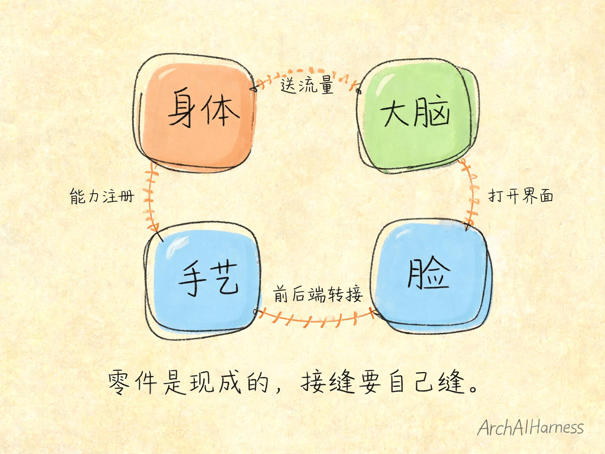
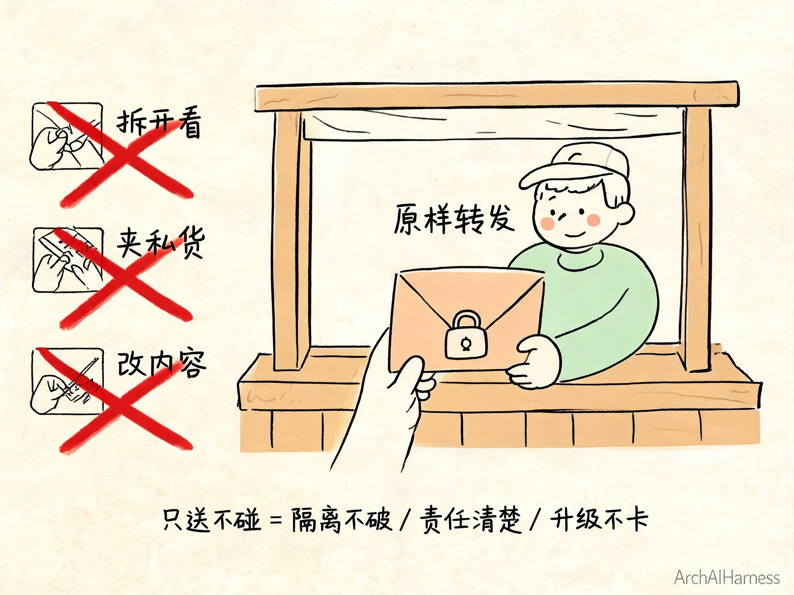
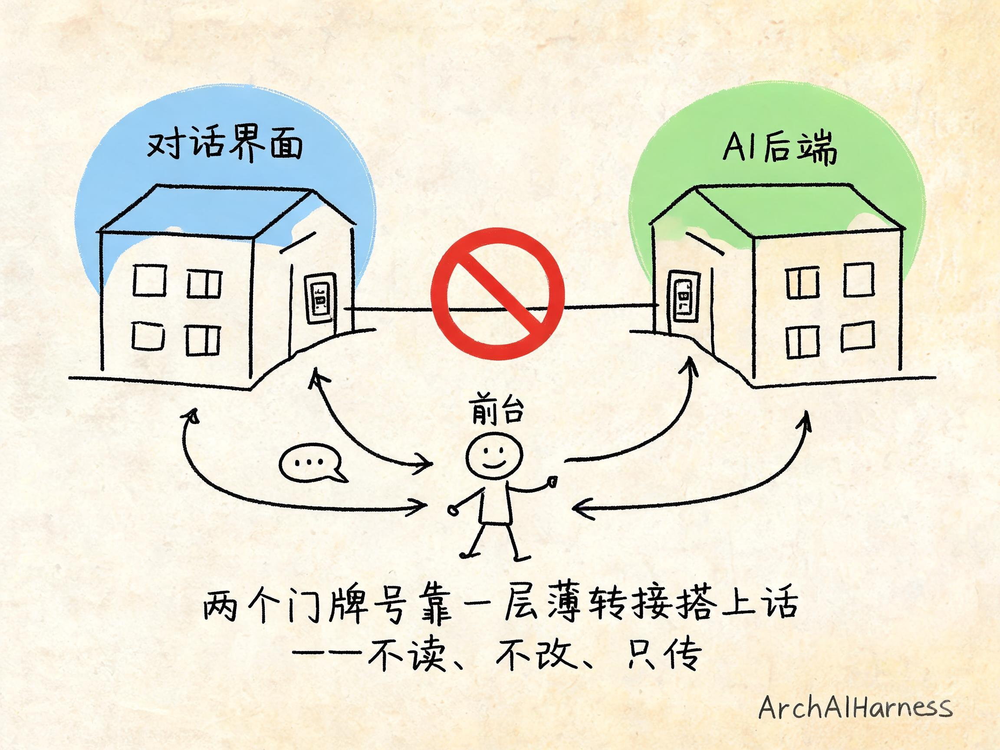
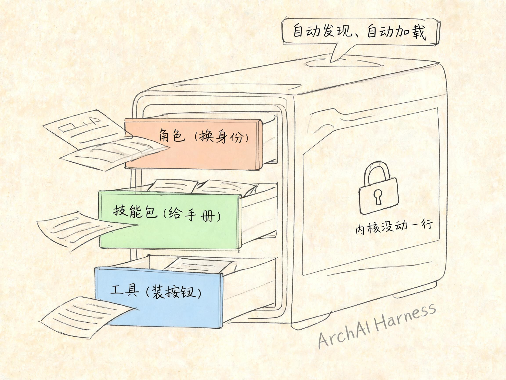
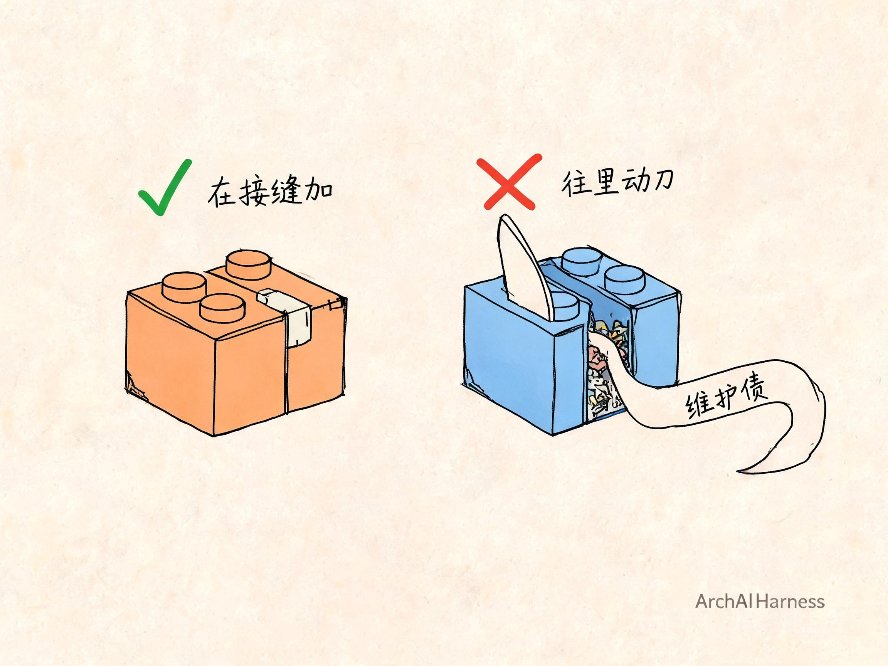

# 把四块现成积木拼成一个产品——真正的功夫，在接缝处不动刀

上一篇我们把"心里那趟路"走完了：客户要的从来不是一个系统，是一个能挡住他那几个"怕"的工具；四块积木——身体、大脑、脸、手艺——没有一块是我从零造的；最难的功夫，是想清楚哪些绝不自己造。

想清楚了，是不是就成了？

没有。想清楚离真跑起来，还差一大截。

你把四块现成的零件摆在桌上，它们互相之间可不认识——那张现成的"脸"，压根不知道你后面接的是哪套"手艺"；那个"大脑"，也不会自动就把流量送到对的地方。零件是别人造的，可**把它们咬合成一个整体、让客户打开浏览器就能顺畅用起来**，这活儿得你来。

这一篇，我就带你到工程落地的现场，一道接缝一道接缝地看：这四块凭什么能严丝合缝拼成一个整体，接缝处又有哪些取舍要拿捏。

我先把话撂这儿——**拼装的价值，不是"缝了多少条线"，而是"每一道接缝处，我都忍住了没往零件内部动一刀"。**

## 一、四块摆上桌，先看它们各管什么

动手之前，先把桌上这四块的分工捋一遍。不重讲它们怎么来的，只看它们各自守着哪一摊、彼此靠什么搭边。

**身体，是每个用户那间独立小屋。** 工作台真正跑起来的地方就在这儿，用户所有的东西都关在自己这间屋里，你的动不了我的。这块是现成的容器技术拼出来的，前面专门聊过一整篇，这里一句话带过。

**大脑，是那个调度网关。** 谁登录就给谁开一间屋、请求来了准确送到对应那间——这摊活儿归它。这块也聊过一整篇，它最值钱的是几条"谁也不能越界"的死规矩，这里同样不重讲。

**脸，是用户打开浏览器看到的那个界面。** 文件树、编辑区、还有那个跟 AI 对话的框，都长在这张脸上。这是这一单新拼的。

**手艺，是能听懂人话、能真干活、还能装进客户那一行门道的 AI 后端。** 这也是这一单新拼的，而且是最见功夫的一块。

四块摆齐了。可你盯着它们看一会儿就会发现，光摆齐没用——它们之间是有"缝"的：

大脑得把流量送进对的身体；脸得让用户一打开就看见；脸还得跟手艺搭上话，不然你在对话框里敲的字，AI 根本收不到；手艺自己，还得能把客户那一行的业务能力长进去。

**这几处"零件跟零件搭边的地方"，就是接缝。** 这一整篇讲的全部东西，就是这几道接缝——怎么缝上、缝的时候又忍住了不碰什么。

先看第一道，也是最省事的一道。

## 二、第一道缝：网关只转发，不动别人一根汗毛

第一道缝，缝在大脑和身体之间——一百个人同时来，大脑得把每个人的请求，准确送进他自己那间屋。

这活儿听着像个技术难题，可这一单里它简单得出奇。为什么简单？因为我给这道缝定了一条最狠的规矩——

**大脑只管转发，绝不拆开看、绝不动手改。**

你把它想成一个特别本分的收发室大爷。楼里一百个人，每人一间屋。信来了，大爷只干一件事：看门牌号，送到对应那间屋门口，塞进去，完事。他**不拆开你的信看里面写了啥，不往里夹私货，不把你的信改两个字再送**——他就是个纯粹的"送"。

这就是"只转发"三个字的全部意思——请求从这头进、从那头出，中间那段路它清清楚楚、原样不动。

你可能会想：不拆看、不改动，那不是把网关做傻了吗？多没技术含量。

恰恰相反。**这道缝真正的设计，不是把网关做得多聪明，而是把它管得多克制。**

我给你掰扯掰扯，网关一旦"手痒"会怎样。

它要是拆开请求看两眼——那用户的东西就等于从它眼皮子底下过了一遍，隔离这事儿立马打个问号：凭什么你一个送信的，能看我信里写的啥？它要是顺手改点内容——那出了问题你根本没法查，到底是用户发错了，还是网关送歪了？一笔糊涂账。它要是"我觉得这个请求这么处理更好"擅自加点逻辑——那哪天现成的网关能力升级了，你加的那点私货就成了升级路上的绊脚石。

所以你看，**"只转发不干预"不是偷懒，是给这道缝上了三道保险**：隔离不破、责任清楚、升级不卡。

至于"谁登录开哪间屋、屋子闲了怎么收回来"这些调度上的死规矩，前面那一单已经讲透了，这儿不重复。你只要记住这一道缝的取舍就够了——

**大脑越是老老实实只做个送信的，这套东西越稳。真正的设计，是它忍住了没去做的那些事。**

第一道缝省事，是因为规矩定得狠。接下来两道就是硬骨头了——这一单真正的新料，全在这儿。

## 三、第二道缝：把业务交互缝进现成的编辑器

第二道缝，缝在脸和手艺之间。

先说清楚这道缝要解决啥。用户打开浏览器，得看见一个能上手的界面——有文件树、有编辑区，还得有个跟 AI 唠嗑、派活的对话框。前几样，那张现成的"脸"自带；可"跟 AI 对话"这个框，是现成编辑器里没有的，得我缝上去。

这时候，一个特别容易冒出来的念头会跳出来——

"现成编辑器不够贴合，要不我自己写一个更顺手的界面？"

打住。这正是上一篇反复叮嘱的：能用现成的，绝不自己造。一个成熟编辑器把"打开就能用"这件事打磨了多少年，我从零写一个，写三个月都未必有人家稳。

所以这道缝的缝法，我给自己立了一句话——

**只缝那个对话的壳，不改编辑器的内核，也不改 AI 后端的内核。**

什么叫"只缝壳"？我给你拆成两小步，全用大白话讲。

**第一步，把已经在本地跑着的现成对话界面，直接打开给用户看。**

这话什么意思？那个 AI 对话的界面，本身也是个现成货，它已经在这间小屋里自己跑着了——就像屋里早有一台开着的电视，画面一直在那儿。我要做的不是重新造一台电视，是在编辑器里开一扇窗，把这台电视的画面照原样搬过来显示。用户以为对话框是编辑器自己长出来的，其实编辑器只是开了扇窗，让你看见了旁边那台一直开着的电视。

这一步的克制在于：**我没往编辑器内核里塞任何东西，只是借它开了扇窗。** 编辑器还是那个编辑器，升级、打补丁，跟我这扇窗一点不冲突。

**第二步，让界面和后端这两个"门牌号"，靠一层转接搭上话。**

这里有个坎儿。那个对话界面（脸的一部分）和真正干活的 AI 后端（手艺），其实是各跑各的、住在两个不同的"门牌号"下。你在界面上敲一句"帮我改改这段"，这话得送到 AI 后端那个门牌号去，它才收得到。可偏偏有条规矩挡着——**两个不同门牌号之间，默认是不让直接串门的**（这是浏览器为了安全定下的死规矩，不然谁家页面都能随便往别人后端发请求，那不乱套了）。

怎么办？我不去拆这条安全规矩，也不去改界面或后端里的任何一行。我在中间搭了个**"前台转接"**。

你就把它想成公司前台。你（界面）想找隔壁楼的某个部门（后端），但两栋楼门禁不互通，你不能直接冲过去。于是你跟自己楼里的前台说一声，前台记下你要找谁，替你把话转过去、再把回话带回来。在你看来，就像那个部门"本来就在自己这栋楼里"一样顺畅——**其实中间隔着一道转接，只是你感觉不到。**

这一层转接，就是这道缝里我唯一新加的东西。它薄得很——不读你说了啥，不改你说了啥，只负责把话从这个门牌号原样递到那个门牌号。你发现没有，它跟第一道缝那个收发室大爷，其实是一个脾气：**只转接，不干预。**

所以整道缝回头看，我到底干了啥？

我把现成的对话界面开扇窗照搬进来、在中间加了一层只管传话的转接——**就这两样，都是往接缝上"加"东西，没往任何一个零件肚子里"改"东西。**

脸还是那张现成的脸，手艺还是那套现成的手艺，它俩谁都没被我动过内核，却已经能顺顺当当对上话了。

这就是"缝壳不动内核"的手艺。它不炫，但它换来一样特别值钱的东西——**这两个零件将来各自升级，我这道缝基本不用跟着返工。** 因为我压根没伸手进它们肚子里，它们内部怎么变，跟我这层薄壳、这道转接都不搭界。

你要是当初图一时顺手，把对话逻辑硬塞进编辑器内核里改，那就惨了：编辑器每升一次级，你都得提心吊胆地看自己那摊改动会不会被冲垮。**在接缝上加东西，和往零件里改东西，看着都是"让它俩连上了"，可欠下的维护债，天差地别。**

## 四、第三道缝：能力，是靠"注册"长进去的

第三道缝，是这一单里最见功夫的一道，缝在客户的业务和那套现成的"手艺"之间。

你还记得客户那句话吗——"能装我自己的业务能力"。他这行的门道、他那摊活儿的规矩，得能装进这个 AI 后端里，让 AI 真懂他的行、真能替他干他那行的活。

那问题来了：一个现成的、通用的 AI 后端，凭什么就能长出"某一行的专门本事"？

要是搁在没想明白之前，你可能会觉得：那得去改 AI 后端的内核吧？把业务逻辑一行行焊进它肚子里？

**大错特错。真要这么干，你就把一块最不该动的零件给拆了。**

正确的缝法，不是往它肚子里焊，而是这道缝里我最想让你记住的一个词——**注册**。

我打个你一定熟的比方：往手机里装 App。

你想让手机多一个本事——比如点外卖、比如记账——你会去拆开手机、改它的操作系统吗？当然不会。你只是去应用商店下一个 App，装上，手机就多了这个本事。手机的操作系统一个字没改，可它能干的事儿变多了。

**往 AI 后端里装业务能力，就是这么个"装 App"的过程——不改它的内核，只是往它约定好的地方"放"东西进去，它自己就发现了、就用上了。**

那客户的业务能力，具体被组织成了什么样的"App"呢？说穿了就三类，我用大白话给你讲清楚每一类是干嘛的。

**第一类，角色——给 AI 换个身份和口吻。**

同样一个 AI，你让它当"严谨的法务"，它说话就字斟句酌、满口条款；你让它当"耐心的客服"，它就和和气气、有问必答。角色干的事，就是给 AI 套一个身份——它是谁、替谁说话、用什么口吻、守什么规矩。客户这行需要什么身份的 AI，就给它配一个什么角色。

**第二类，技能包——给 AI 一本按需翻的手册。**

有些活儿有固定门道，比如"给这一行写一份合规的报告，得按这么几步走、注意这么几条红线"。这套门道，就写成一本手册，平时收着，AI 一遇到这类活儿，自己把对应那本手册翻出来照着做。妙就妙在**按需翻**——手册再多，AI 也不用一直背在脑子里占地方，用得着哪本翻哪本。

**第三类，工具——给 AI 一个能真动手的按钮。**

光会说、会按手册想还不够，有些事得真去动手——查一条真实数据、生成一份真实单据、调一个真实系统。工具就是给 AI 装的一个个"真能按下去、真会发生点什么"的按钮。它想干这件实事，就去按对应那个按钮。

角色、技能包、工具——**换身份、给手册、装按钮**，这三类东西一凑，客户那一行的门道，就齐活儿了。

那这三类东西，怎么"装"进 AI 后端？

这就是全篇最关键、也最优雅的一处——**靠往约定好的"收件箱"文件夹里放文件。**

这个现成的 AI 后端，它的作者早就想到了"会有人想往我这儿加新本事"，所以专门辟了几个约定好的文件夹，就跟收件箱似的：放角色的、放手册的、放按钮的，各有各的收件箱。你把写好的角色、手册、按钮文件，往对应的收件箱里一放，**AI 后端一启动，自己就把这些收件箱扫一遍，发现里头有新东西，就自动认出来、加载好、用起来了。**

你全程一行都没改它的内核。你只是往它敞开的收件箱里，放了几份文件。

讲到这儿，上一篇埋的那条暗线，我得给你接上了。

上一篇我说：这些"能往里缝东西"的口子，不是我发明的，是这些开源工具的作者原生留好的。这道缝就是最硬的证明——**这几个收件箱文件夹，是 AI 后端的作者当初造它时就设计好、专门留给别人往里加能力的。** 我不是那个凿收件箱的人，我是那个看懂了"哦，这儿有个收件箱，是留着放角色的；那儿还有一个，是放工具的"，然后决定往里放什么的人。

至于"一个角色文件具体长啥样、一本手册怎么写"这种更细的机制，前面聊"给 AI 长出一件新本事"那一单碰过底层的路子，这儿不重复。这道缝新的地方，是**把一整行的业务能力，成建制地组织成角色 + 技能包 + 工具三类，靠注册一次性挂载进去**——这是"装一件小工具"和"给 AI 装进一整行门道"的区别。

## 五、四道缝的共同纪律：接缝处不侵入

三道缝拆完了，其实还有第四道——身体怎么装那套现成的工作环境，前面那一单已经讲透，这儿不占篇幅。我想让你抬起头，把这几道缝放一块儿看，你会发现一个特别整齐的规律。

第一道缝，网关只转发，不拆看、不改动。
第二道缝，编辑器只开扇窗、只加层转接，不动内核。
第三道缝，业务能力只往收件箱里放文件，不改内核。

看出来没有？**每一道缝，我都只在"接缝上"加东西，没往任何一个零件的"肚子里"动过刀。**

这就是我想立给你的、这一篇的取舍总纲——

**缝合的铁律，是在接缝处加东西，绝不往零件内部动刀。**

为什么这条这么重要？因为它直接连着上一篇那句话——**你每往零件肚子里改一刀，就多背一份维护债。**

我给你把这笔账再算清楚一点。

你要是没忍住，把对话逻辑焊进了编辑器内核——那从今往后，编辑器每升一次级，你都得回来看看自己那刀改动有没有被冲垮，冲垮了还得连夜补。你要是把业务逻辑硬塞进了 AI 后端内核——那 AI 后端每更新一次，你都提心吊胆。**这些债，是你自己一刀一刀给自己刨的坑。**

反过来，只要你死守"只在接缝加、不往里动刀"，这些零件的内部就永远是"别人在替你维护的、干干净净的现成货"。它们升级也好、打补丁也好，跟你那几道薄薄的接缝井水不犯河水。你缝的东西少、碰的地方浅，将来要改、要换、要升级，都轻快。

所以你别看"接缝处不侵入"听着像句轻飘飘的原则，它其实不是一句空话，而是**这套东西能长期活下去、活得省心的根**。

**缝得越浅，活得越久。这不是本事小，这是本事到家了。**

## 六、缝合式交付，到底沉淀下了什么

活干完了。客户打开浏览器，登录，一个贴他行当的 AI 工作台就在那儿等着他，好使。

我们停下来复个盘——这一单缝完，我手里到底攒下了什么？

先说个反常识的：我攒下的，**不是这一个客户的工作台**，而是一套能反复用的东西。这个工作台交出去，它就是他的了，跟我没关系了。

我真正攒下的，是**一套"怎么把这四块拼成一个整体"的拼装法。**

你顺着这一篇再想一遍：四块零件是解耦的——身体、大脑、脸、手艺，谁都不知道别人内部长啥样，全靠接缝搭边；而这几道接缝，又是标准化的——网关只转发、编辑器只开窗加转接、能力只往收件箱放文件。

**零件解耦、接缝标准，这两条加在一起，意味着什么？**

意味着下一个客户来了，我几乎不用从头再想一遍。

下个客户是另一行的？行啊——身体、大脑、脸这三块原样不动，我只需要给"手艺"换一套收件箱里的文件：换一批贴他那行的角色、换几本他那行的手册、换几个他那行要用的按钮。**换插件、换配置，就又拼出一套贴新客户的工作台。**

下个客户要的界面不太一样？那也只是在"脸"那道缝上微调，身体、大脑、手艺纹丝不动。

你看，**因为每道缝都缝得浅、缝得标准，这套东西才拆得开、换得动、拼得快。** 我第一单花力气想清楚的"缝什么、不缝什么、怎么缝"，从第二单开始，全变成了能反复用的现成打法。

这就是缝合式交付真正的复利——

**你缝出来的，从来不只是这一个产品，是一套下次还能再拼一遍的拼装法。** 第一次靠想，往后靠抄自己。客户越接越多，这套拼装法越磨越顺，你的力气越花越少、交付越来越快。

这笔账，比"我这单挣了多少"值钱多了。

## 七、写在最后

回到这一单最开始那句话——客户要个"云端 AI 工作台"，打开浏览器就能用，数据别外泄，还能装他自己的业务能力。

上一篇我把"心里那趟路"讲给你听：想清楚缝什么、不缝什么。这一篇我把"手上那趟活"拆给你看：四块现成的零件，靠一道道浅浅的接缝，真正咬合成了一个客户能用的整体。

从头到尾你数一数——

网关，我只让它转发，没让它拆看改动。编辑器，我只开了扇窗、加了层转接，没动它内核。业务能力，我只往收件箱里放了文件，没改 AI 后端一行。每一处，我都停在了接缝上，没往任何一块零件的肚子里伸手。

**我没有造一个功能，甚至没往任何一个零件里改一刀。可我交付了一个客户打开就能用、还贴着他那一行门道的产品。**

这话你要是三年前听，肯定觉得别扭——不造不改，凭什么算你的活儿、算你的价值？

可你把这一篇从头再过一遍就懂了：价值从来不是"我改了多少"，而是**"我看懂了每一道接缝该缝什么、更看懂了每一道接缝绝不能往里动刀"**这一连串的判断和克制。零件谁都能拿到，缝得浅、缝得对、缝完还拆得开能再拼一套——这才是手艺。

**未来真正会用 AI 交付的人，不一定是那个能把每个零件都改一遍、把每个功能都自己焊进去的人，而是那个知道该在哪道缝上加东西、更知道哪道缝绝不能动刀的人。**

零件越来越现成，接缝越来越多——**敢动刀的人一抓一大把，忍得住不动刀、只在接缝上做文章的人，才越来越金贵。**

---

### 关于 ArchAIHarness

这篇文章是「看懂 AI 与智能体」专栏的一部分，由 [**ArchAIHarness**](https://github.com/ArchAIHarness) 持续输出。

ArchAIHarness 是一套面向 AI 时代软件工程的人机协同架构哲学与公开工程资产，主张：

> **架构师定义秩序，AI 在秩序中生长。人立法，AI 执行，体系审计。**

如果你也希望 AI 在明确的架构边界内协作，而不是在混沌中碰运气，欢迎到 GitHub 上看看我们在做什么：

- **组织主页**：[github.com/ArchAIHarness](https://github.com/ArchAIHarness) — 了解完整理念与资产全景
- **本专栏**：[`zhuanlan-ai-and-agents`](https://github.com/ArchAIHarness/zhuanlan-ai-and-agents) — 所有文章的源码与发布记录
- **实践指南**：[`docs`](https://github.com/ArchAIHarness/docs) — 架构哲学、工程方法和落地指南
- **开源工具**：[`agent-workflows`](https://github.com/ArchAIHarness/agent-workflows) — 可复用的 AI 协作 Agents、Skills 与 Tools
- **工程样例**：[`framework`](https://github.com/ArchAIHarness/framework) — DDD + AI 协作的工程底座，展示如何在开发中融合 AI

> Engineered by Architects · Empowered by AI · Audited by Discipline
