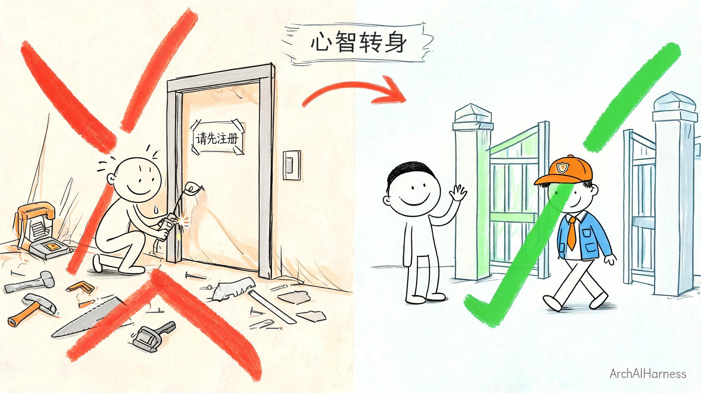
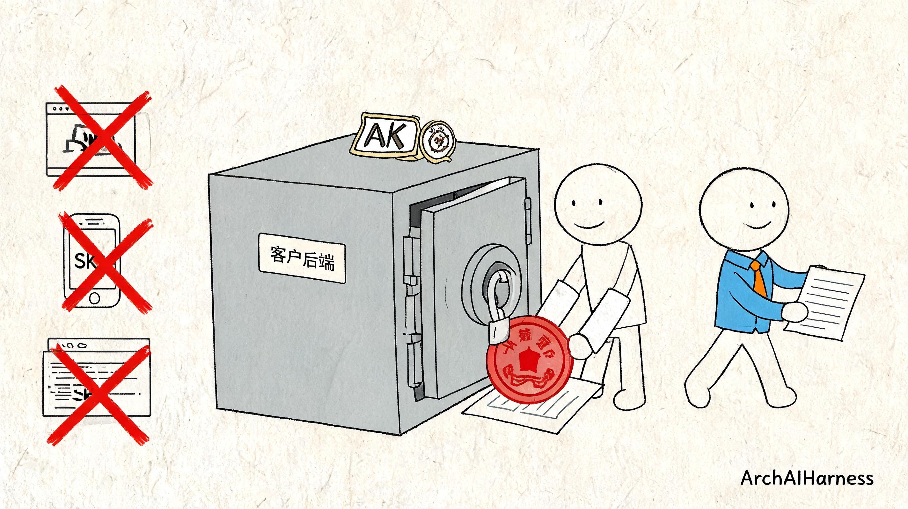
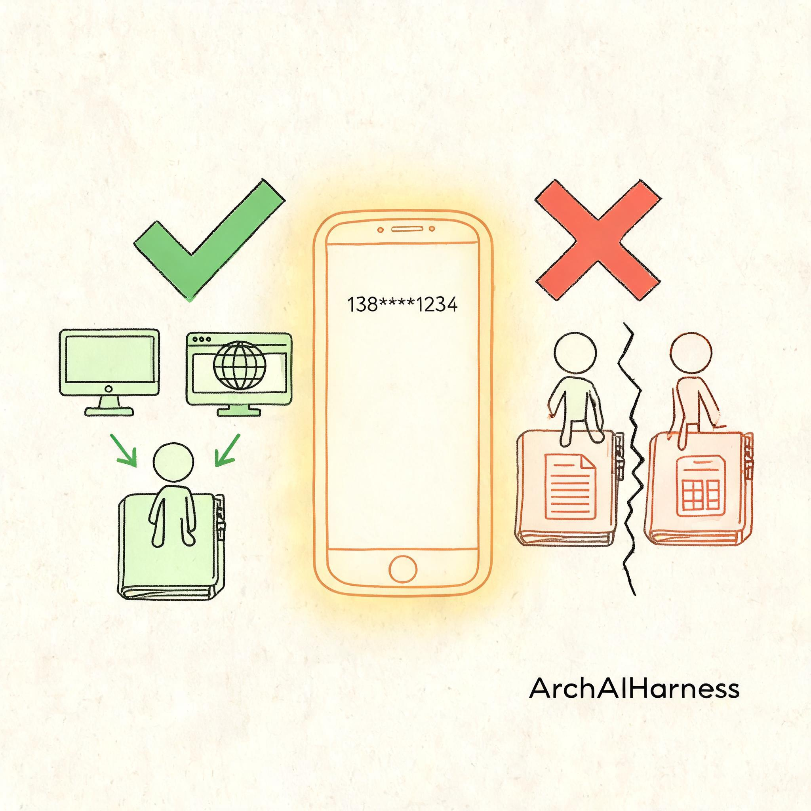
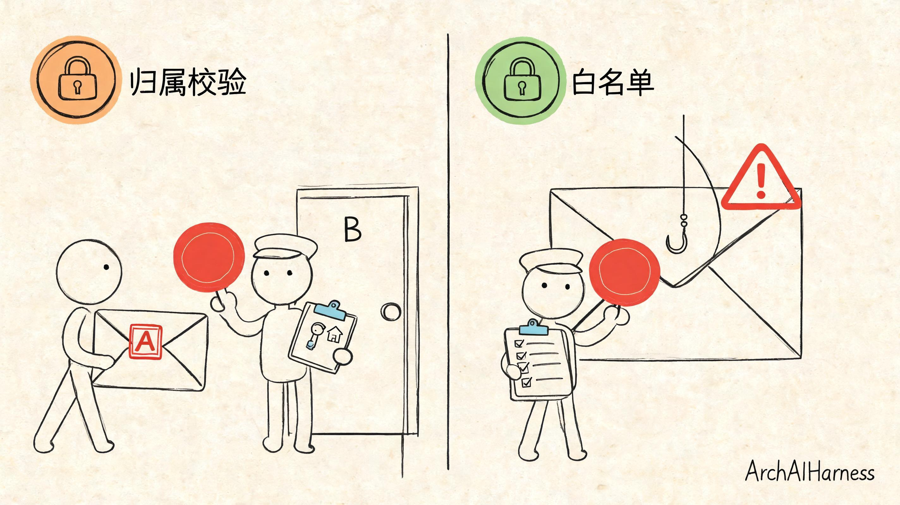

# 客户已经有身份系统，我们只负责让他们的人一秒进来——SSO 谈的从来不是登录

客户丢给我一句话：

> "我们要单点登录，员工从我们自己系统点一下，直接进你们那边的功能页。"

就这么一句。没有协议文档，没有对接手册，甚至连"他们那边用的是什么身份系统"都没说。

换成几年前的我，第一反应是打开浏览器搜 SSO 方案——OAuth 2.0 怎么接、SAML 怎么配、账号表要不要新建、登录页我这边出还是他们出。脑子里"哗"地铺开一张协议选型对比表，然后就开始盘算"这得对接多久、写多少代码、测多少轮"。

这一次我没这么干。

我先愣了一下，然后回了他一句：**"你要的到底是一套登录系统，还是——你员工点一下，别再被我这儿拦一次、直接进功能页？"**

他想了两秒，回我："当然是后者啊——我们那边 OA、HR、域账号都齐了，员工凭什么还要在你这儿再记一套密码？"

我这才把心放下。这两个听着差不多，其实差着十万八千里。当你以为客户要"一套登录系统"，你会一头扎进去造账号表、搭认证服务、搞密码找回；当你想明白客户要的是"人过来了、别再拦"，你就会先抬头问自己——**他那边已经有的那份信任，我怎么把它原样翻译过来，让他的人一秒落地。**

这一篇我想跟你聊的，就是这么个心智转弯。做完这一单，我最大的收获不是"又接完一个 SSO"，而是想明白了一件事——**SSO 交付的从来不是登录，是免登直达。** 真正值钱的不在协议文档里，在"引路人是谁、路上凭什么信、进来后认哪张脸、通行证能开哪几扇门"这四个判断里。

下面我一段一段拆给你看。

## 一、客户嘴里的"单点登录"和你眼里的"单点登录"

先说个你可能也踩过的坑。

客户说"我要单点登录"，你听进耳朵里的，往往是"登录"这两个字。于是你翻出上一次接 SSO 留下的 SDK、协议文档、账号表设计，开始盘算"这次走 OAuth 还是 SAML、密码字段怎么加密、找回密码流程我做不做"。你把自己代入成了一个"给他再造一套登录系统的人"。

可你回头品品客户那句话，他真正在乎的是什么？

他说"从我们自己系统点一下"——他怕的是"我员工在自家系统里好好待着，你别把他弹到一个陌生登录页上，他一看就烦、干脆不用了"。他说"直接进你们那边的功能页"——他怕的是"点进去还得输账号、还得绑手机、还得点确认，员工折腾一圈还没看到东西就跑了"。他说"我们已经有 OA、HR、AD 了"——他怕的是"你别再给我整一套账号系统，密码重置、离职销户这些烂事我还得维护两边"。

你看，**客户嘴里说的是"登录"，心里装的全是"别拦我人"。**

他不是要一套新的账号体系，不是要一个新的登录页，更不是要多一处密码让员工记——他要的是"我这边的人，一秒钟落到你那边的功能页上，中间什么都别问"。

这就是我想跟你立的第一个判断——

**客户嘴里的"单点登录"和你眼里的"单点登录"，从来不是同一件事。**

客户要的不是登录，是免登；不是账号，是通行；不是再造一套身份，是把他已经有的那份信任关系原样翻译过来、在我这儿一秒生效。

想通这一层，你干活的姿势就变了。

你不再问"我怎么给他搭一套登录"，你开始问"他那边的人凭什么被我信、过来了我怎么认、认了之后能碰什么"。前一个问题把你推向"从零造账号系统"，后一个问题把你推向"把客户已有的信任接过来"。

这一步转身，就是这篇要讲的全部东西的起点。

不是我夸张——这一个愣神的差别，决定了你后面三个月是在给自己刨坑，还是在干净利落地交付一件真能跑三年的东西。

## 二、把一句"单点登录"，剥成四件真需求

心智转过来了，接着干第一件正事——**把那句模糊话，剥成几件能落地的真需求。**

我没急着动手，跟客户来回聊了几轮。不是聊协议，不是聊 SDK，是聊他那边到底怎么运作：员工是从哪儿点过来的？路上会经过什么？到我这边算谁的账？进来了能碰什么不能碰什么？聊完，那句含糊的"我要单点登录"，剥出了四件清清楚楚的事。

**第一件，引路人是谁。**

员工不是自己凭空跳到我门口的，是客户那边的系统把他"领"过来的。那我凭什么信这个领路的，就真是客户他家自己的系统，不是别人冒充的？

**第二件，路上凭什么信。**

员工被领过来这一路，要经过浏览器、经过公网、经过谁都不知道的中间层。我凭什么信这一路上，这封"带人过来的介绍信"没被人改过、没被人抄走重复用、不是上周那封早就过期的？

**第三件，进来后认哪张脸。**

人到了我门口，我怎么知道"这个老王，就是之前从别的入口已经来过我这儿的那个老王"？同一个自然人，别在我系统里被拆成两个账号各干各的——那是几乎所有 SSO 翻过车的经典鬼故事。

**第四件，通行证能开哪几扇门。**

人进来了、我也认出来了——可这张通行证能开哪几扇门？会不会拿着 A 客户的通行证，串到 B 客户的房间里去？或者被人借去把员工领到钓鱼站？

四件事，一件都不能省。

你少任何一件，别管你 SDK 接得多熟、协议跑得有多顺，都算在自家门口埋了颗雷——迟早要炸，而且炸的时候一定是生产环境、一定是客户 CEO 演示那天。

接下来这四节，就一件一件拆。为了让你能真的听进去而不是当协议课背，我给你打个贯穿全文的比方——**你可以把整套 SSO，想象成一封盖了公章的介绍信。** 客户那边是发信的公司，我这边是门口的门卫；介绍信要能证明四件事：是这家公司发的、路上没被动过、抬头写着一个具体的人、这封信只能开指定的几扇门。

公章、保险柜、门卫、盖章介绍信——这一套东西你都熟。熟就对了，因为**安全协议没什么神秘的，本质上都是把现实里用了几千年的"盖章+验印"逻辑，搬到了网络上。**

## 三、第一件——引路人是谁：别把公司公章当员工工卡

先说第一件事。

员工不会自己跳过来，是客户那边的系统领他来的。那问题就变成——我凭什么信"这个领路的，真是客户家的系统"？

很多人第一反应会往歪处想："那我让员工输个用户名密码呗，再验证一遍不就完了。"

不行。这一下你就把心智又拐回"造登录系统"那条老路上了。员工在客户那边好好待着，他没义务再给你输一次密码——你要做的不是再造一道门让员工再掏一次钥匙，而是把客户那边已经在他身上的信任，直接翻译过来当通行证用。

那怎么才能确认"来领路的真是客户家系统"呢？

我们的做法是——**给客户发一对钥匙。**

一把叫 AK，公开的，可以随便出现，相当于这家公司的"公司名牌"。另一把叫 SK，秘密的，只能锁在客户后端服务器里，相当于这家公司的"公章"。

这一对钥匙不是给员工的密码，是**客户这家公司作为一个整体的信任凭证**——由我们线下或者控制台签发一次，之后 SK 就再也不出现在网络里、不出现在浏览器里、不出现在员工手上。

这里最容易犯的一个错，我得重重敲一下——

**AK/SK 是盖在公司抬头纸上的公章，不是别在员工胸口的工卡。**

公章和工卡是两回事。工卡每个员工一张，别在身上到处走，用来证明"我是这家公司的员工"。公章只有一枚，锁在行政的保险柜里，需要盖章的时候由行政亲自拿出来盖，员工出差要开介绍信，不是把公章拎出去揣兜里，是回公司找行政盖一份、再拿盖好的信出门。

你品品这个差别——**公章的命门，不是它刻得多复杂、仿得多难，是它永远不出保险柜。** 盖出来的介绍信可以满天飞，但章本身，必须锁着。

一旦 SK 跑到员工电脑上、跑到浏览器里、跑到前端 JS 代码里、甚至跑到公开的代码仓库里，那就等于行政把公章拎出去丢在大厅茶几上——从这一刻起，你后面再怎么加签名、加时间戳、加白名单，都是在给一个已经漏光的桶打补丁。

我接过这么一单，客户图省事，让前端直接拿 SK 算签名，说"反正我们内网、员工都是自己人"。结果三个月后，他们一个前端页面被挂了个恶意插件，SK 被扒出去，有人用它签了一堆假请求刷数据，半夜告警响成一片，最后全量换 SK、所有已签发链接作废，折腾了一个通宵。

这种坑，你踩一次就记一辈子。所以这第一件事定下来的时候，我跟客户交代得很死：

- **SK 只能待在你们后端服务器里**，谁碰谁负责；
- **签好名的跳转链接，由你们后端生成好再交给前端去打开**——员工浏览器里，绝不能出现 SK 的影子；
- **想换 SK 随时换**，控制台点一下就能重新签发，旧的立刻作废；
- **SK 长度别吝啬**，用高强度随机字符串，别用"company123"这种你自以为聪明的短密码。

这一节我想跟你说的，就一句话——

**引路人是谁，不是靠问员工"你是谁"来确认的，是靠认那封盖了公章的信来确认的。而公章能不能守住，全看它出不出保险柜。**

这是四件事的地基。地基松了，上面再漂亮的协议都是纸糊的。

## 四、第二件——路上凭什么信：一封介绍信要过三道防伪

第一件事解决了"是不是这家公司发的信"。可问题立刻就来了——

**就算信真是这家公司盖的，我怎么知道它从行政桌上到我门卫手里这一路上，没被人做过手脚？**

这一路可不太平。浏览器里能看到完整跳转链接，公网上抓包是常事，中间代理、恶意插件、钓鱼脚本，什么都有。你不能一厢情愿地相信"我发出去的东西到我手上还是原样"——**你要防的不是君子，是所有能碰到这封信的人；你要做的不是让信走一条绝对安全的路（那条路不存在），而是让这封信自带防伪、谁动了都立刻现形。**

一封真正能过门卫的盖章介绍信，得能证明三件事：

**第一，这信真是这家公司盖的——别人伪造不了。**

这个靠签名。客户后端把员工要过来的信息（哪家租户、员工在他们那边的 ID、手机号、叫什么、头像在哪、想落到我哪一页），按一套固定规则排好顺序、拼成一段规整的文字，再拿那把锁在保险柜里的 SK，用 HMAC-SHA256 算法算一个签名，附在跳转链接上。

我这边门卫收到信之后，翻出这家公司在我这儿登记过的 SK，把同样那段文字按同样规则再算一遍签名——两个签名对得上，说明"这信真是他们家盖的，一个字都没动过"；对不上，一律拦在门外。

这里有个不显眼但特别致命的细节——**比对两个签名的时候，必须用常量时间比较。**

什么意思？普通的字符串比较，是一个字一个字往下比的，一旦发现哪一位不一样就立刻停下来返回"不相等"。这在日常开发里是个优化，可在安全校验里这是个漏洞——因为"比较花了多长时间"本身就会泄露信息。第一位就错和最后一位才错，花的时间不一样；攻击者可以靠这个时间差，一位一位地把正确签名反推出来。

所以比对签名必须用"常量时间"的比法——不管第一位就错还是最后一位才错，都从头比对到尾、花一样长的时间，把这条"靠耗时反推签名"的旁路彻底堵死。这点东西写在代码里就一行，但少了这一行，你那道防伪门就是纸糊的。

**第二，这信不是上周那封——过期的不算数。**

光有签名还不够。假设有人截到了一封合法的介绍信，存起来，下周再拿过来用——签名照样是真的啊，章也是真的啊，可这信早就过期了。这种攻击叫"重放"，是网络安全里最古老也最常见的套路之一。

怎么防？信里带上一个"发信时刻"，我这边门卫收到后拿当前时间跟它一比，**超过前后五分钟的窗口，一律当过期作废。**

五分钟这个窗口是有物理意义的——太短了扛不住两边服务器的时钟漂移和跨机房网络延迟，几百毫秒到一两秒都是正常的；太长了又给攻击者留太多重放的空间，你给他半小时，他拿着截来的链接能试好几十次。正负五分钟是行业里打了多少年仗打出来的经验值，别自作主张改它。

**第三，这封信就是这一次用——这五分钟里也不能用第二次。**

等等——时间戳窗口是五分钟，那这五分钟之内呢？有人截了一封信，在窗口关闭之前赶紧再投递一次，怎么办？签名对、时间戳也对，门卫凭什么拦他？

所以还得再加一道——**一次性号。**

客户后端在信里塞一个随机生成的、只用一次的号（行话叫 nonce）。我这边门卫收到信，第一件事是去缓存里查——这个号我五分钟之内见过吗？见过，说明是重放，一律拒绝；没见过，就把这个号记进缓存，设个五分钟的过期时间，五分钟之后自动忘掉。这记进去的动作必须是原子的——"查有没有、没有就写进去"这两步必须合成一个不可分割的动作，不能先查再写，不然两个并发请求会同时查到"没有"然后同时放进来。

签名证明"是他们家发的"，时间戳挡住"昨天那封"，一次性号挡住"这五分钟里的第二封"。**三道防伪叠在一起，一封介绍信才能在这条不安全的公网路上走稳。**

这一节我想给你点透的是——

**路上凭什么信？不是靠某一把锁，是靠"签的是真的、过了五分钟就废、用过一次就作废"这三道锁合起来。少一道，防伪就不成立。**

别觉得"我已经有签名了够了"——你去问问银行，支票上凭什么盖了章还要写日期、还要撕存根。一件事。

## 五、第三件——进来后认哪张脸：别让同一个人在你这儿变成两个

前两件事守住了"这封信是那家公司发的、路上没被动过"。人到了门口，第三件事立刻冒出来——

**介绍信抬头写的这个人，到了我这边算谁？**

这里最容易出的不是安全问题，是**业务上的鬼故事**。而且这个鬼故事，十家做 SSO 有八家翻过车。

我给你讲个典型画面——

客户那边的员工老王，在他们系统里工号 A001，手机号 138xxxx1234。他今天从客户系统点进来，我这边门卫一看："哦，A 公司的 A001，第一次见。"于是给他建了个账号，绑上"来自 A 公司、工号 A001"。老王今天在我这边写了三份材料、发起了两个流程、改了一堆配置，所有数据全挂在这个账号下。他下班关机，今天这事儿就算过去了。

过了一周，老王闲着没事，直接打开我们这个 SaaS 的官网，用自己手机号 138xxxx1234 注册了一个账号——他自己完全没意识到，"我从公司系统点进来的那个我"和"我自己手机号注册的这个我"，在系统里是两个互不相识的账号。

于是他就在我这边分裂了。

从公司入口进来，看到的是 A001 那个号的东西；从官网入口进来，看到的是手机号注册那个号的东西。**同一个自然人，两个账号，两份数据，永远拼不回一个人。**

再过俩月，老王从公司入口进来找不到自己之前写的东西了——因为他以为自己在官网那个号里写的，其实写在了 A001 那个号里；或者反过来，他在官网那个号里改了配置，从公司入口进来一看什么都没变。工单炸了，客服懵了，研发查了三天才发现——哦，原来你们是两个人啊。

这种翻车我见过不止一次，每次场面都极其难看。客户 IT 负责人拍桌子："你们怎么回事，同一个人登进去东西不一样？"你怎么解释？你解释"因为他从两个入口进来、我们认成两个人了"——客户根本不关心你技术怎么实现的，他只知道"你们系统不好使"。

怎么防？

**你得给"同一个自然人"找一个跨系统的锚点——只要这个锚点在，两个入口进来的都能认成一个人。** 注意，这个锚点不是给系统用的技术主键，而是两边系统都认、而且能稳定指到同一个自然人的现实凭据。

这个锚点不能是工号——A 公司的工号 A001 和 B 公司的工号 A001 撞了怎么办？不能是邮箱——有人工作邮箱和私人邮箱根本不是一个，还有人根本不填邮箱。不能是昵称——昵称随时改，而且重名的一大堆。

行业里几乎公认的最佳锚点，是**手机号**。

手机号有几个别的字段都比不了的特性：一个自然人通常只有一个主号、跨平台通用、可以短信验证真实性、几乎所有 C 端和 B 端 SaaS 本身就以手机号作为账号主键。它不是最完美的——有人确实换号、有人有多个号——但在现有可用的字段里，它是最不坏的那个，是锚点的最优解。

所以我们在介绍信这套协议里，把手机号列成了一个"强烈建议传"的字段——它在协议定义里看着像"可选"，实际上是**"你不传，将来同一个人被拆成两个你别来找我哭"** 的意思。

这是整套协议里最不起眼、也最容易翻车的字段。对接方的工程师看到字段表里"可选"俩字，十有八九会跳过——毕竟多传一个字段多一件事，谁会主动给自己加活？等真翻了车才明白，那不是可选，那是救命的。

我这边门卫拿到信之后，身份合并的逻辑其实就三条清清楚楚的分支，我用大白话讲给你听：

- **信里根本没带手机号**——没办法，没有锚点就没法合并，只能给这个员工建一个跟这个客户绑定的独立账号。以后他自己再来用手机号注册，两个账号合不上，这账算在业务方当初为什么不传手机号上；
- **信里带了手机号，但我这边从没见过这个号**——说明这个人第一次来，建个新账号，把手机号一起落下来。以后他自己直接用手机号登录，一样能找到自己，不会分裂；
- **信里带了手机号，我这边已经有一个绑了这个号的账号**——不建新号，直接把"来自 A 公司、工号 A001"这重身份挂到那个已有账号上。同一个自然人，多了一重从客户系统进来的身份而已，数据还是同一份。

就这三条分支，没有第四种情况。

数据模型上还有一道数据库层面的最后防线——**"客户编码 + 客户那边的用户 ID"这个组合必须建唯一索引。** 一家公司的一个员工，最多只能挂到我这边一个账号上。不然万一代码有 bug，同一个员工被挂到了两个账号上，业务侧还是会分裂。代码会写错、服务会发癫，但数据库的唯一索引不会骗人——它是最后一道锁。

这一节我想给你敲得最响的一句话是——

**手机号看着是可选的，实际上是整套 SSO 里"同一自然人"的唯一锚点。它是四件事里最不起眼、最容易被省、最容易翻车的那一件。**

省掉它省五分钟，将来擦屁股擦三个月。这笔账，你自己算。

## 六、第四件——通行证能开哪几扇门：两把锁防越境

前三件事焊完了：信是真的、路上没被动过、人认对了。员工顺利进到我这边，也被认成了正确的老王。看似齐活了。

但还有最后一件事，很多人会漏——漏了的后果不比前面三件轻。

**这张通行证进来之后，能开哪几扇门？会不会拿着它乱串到不该去的地方？**

这一件事分两个层面，两把锁，缺一不可。

**第一把锁：客户之间不能串。**

我这边同一套 SaaS，服务着一堆客户。A 客户有 A 客户的租户空间，B 客户有 B 客户的租户空间，数据、员工、配置、文档全是隔开的。

问题来了——A 客户的后端手上有 A 客户的 SK，他能不能签一封"我是 B 客户的租户，带一个 B 客户的员工进来"这样的介绍信？

你仔细想——签名是用 A 的 SK 签的，签名校验能过，因为章是真的；时间戳也对，nonce 也没用过；可信里写的租户编码却是 B 的。

这时候如果你只校验签名、时间戳、nonce，这封信就会被你放进来，然后这个员工就被当成 B 客户的人扔进 B 客户的空间里去了。

**这不是破解密码，这是权限越界——比破解密码还危险，因为整个签名过程完全合法。**

他不是伪造了公章混进门，而是拿着自家真公章、盖了一封送别人去别人家的信——门卫要是只看章不抬头，就被他骗过去了。

所以门卫收到信、验完签名之后，必须再多问一句——**"这把 AK，到底有没有资格代表信里写的这个租户？"** 我们后台有一张 AK 和租户的归属关系表，查一下对不对得上；对不上，一律拦在门外，管你签名是真是假。

这一刀不补，前面签名、时间戳、一次性号做得再漂亮，也是白搭——门是锁了，但你没看门牌号对不对。

**第二把锁：落地页不能乱跳。**

介绍信里除了员工信息，还带了一个字段叫"落地页地址"——就是员工进来后，你把他扔到哪个具体的功能页面去。客户那边的运营从"报表入口"点进来，想直接落到报表页；从"工单入口"点进来，想直接落到工单页。这个字段本身合理。

可它同时也是一个巨大的坑——如果我不做任何限制，直接按信里写的地址往那儿一扔，攻击者就能构造这样一封信："章是真的、时间对、nonce 新、人也对——但请把这个员工扔到 http://钓鱼站.com/领奖 去。"

员工一看是从自家公司系统点过来的、跳转路径里还带着我们 SaaS 的域名，谁会怀疑？啪一下就被扔到钓鱼站去了，账号密码当场交出去。

这种攻击有个名字，叫**任意跳转**（Open Redirect）。它不偷你数据、不破你密码，它借的是你这边域名的信誉——员工信你，所以信你带他去的地方。

防法听着简单，做起来细节坑死人——**给每个客户配一份"允许落地的地址清单"，信里写的地址必须命中这份清单，否则不跳。**

清单可以配到不同粒度：最严的精确匹配，只能跳到这一个具体 URL；中等的前缀匹配，允许跳到某个域名下某个路径开头的所有页面；最松的域匹配，允许跳到整个域名下任何地方。给哪个粒度，看客户业务的实际范围。

但**清单不能没有**。只要缺了这份清单，任意跳转就是一张迟早会被点响的定时炸弹。

这里我必须多讲一句——前缀匹配你也别偷懒直接用字符串 startsWith，一定要先把 URL 解析开，单独拿 host 和 path 出来比。因为字符串 startsWith 会被骗：`https://我的SaaS.example.com` 这个前缀，会被 `https://我的SaaS.example.com.evil.com` 这个地址命中——后者看前缀是对的，可它实际上是 evil.com 这个域名下的一个子域名，跟你半毛钱关系没有。

URI 解析之后再比，这种小把戏立刻现形。这种坑都是前人踩过了无数次踩出来的，你别再自己去踩一遍。

这一节我想跟你说的是——

**通行证能开哪几扇门？靠两把锁：一把是"这把钥匙到底属于哪一家"（防客户之间串），一把是"这张通行证能把人领到哪几页"（防被借去撞钓鱼站的墙）。这两把锁不是防外人的，是防越境的。**

外人没有公章本来就进不来；真正要防的，不是那个连门都摸不到的贼，是拿着合法公章开了越境信的"自己人"、和借你家信誉把人拐走的套路。

## 七、四件事焊在一起，SSO 才叫交付

四件事讲完了，我再拉回来一起看一眼。

- **引路人是谁**——凭 AK/SK 这对不出保险柜的钥匙确认（第一件是**信任凭证**，公章和工卡别搞混）；
- **路上凭什么信**——凭签名、时间戳、一次性号三道防伪（第二件是**信道防伪**，三道锁合起来才成立）；
- **进来后认哪张脸**——凭手机号这个跨系统锚点做身份合并（第三件是**身份归一**，那个"看似可选实际必传"的字段最容易翻车）；
- **通行证能开哪几扇门**——凭 AK 租户归属 + 落地页白名单两把锁（第四件是**授权边界**，防的是越境不是防外人）。

**信任凭证、信道防伪、身份归一、授权边界**——这四件事按这个顺序焊起来，才是一次"能上生产、能过安全审计、能扛真实客户投诉"的 SSO 交付。

回到最开头那句话——客户说"我要单点登录"，你只有想清楚这四件事，你才能理直气壮地跟他说："放心，我不给你多造一套账号系统，我把你已经有的身份和信任，原样翻译过来，让你的人一秒进来。"

**不是"我给你再造一个登录页"，而是"我让你已有的身份直接在我这儿生效"。**

这两句话，隔着一整个心智的距离。

写到这儿，我最想留给你的其实不是那三道防伪、那两把锁、那个手机号锚点——是最开头那个小动作：

**接到"我要 X"的时候，先愣一下，问一句"你要的到底是 X，还是 X 背后你真正想解决的那件事"。**

这一愣，就是一整篇文章的分水岭。愣过了，你后面写的每一行代码、定的每一条规矩都在解决真问题；没愣过，你后面干的所有活都可能在给自己刨坑——坑刨完了客户还不买账，因为你解决的根本不是他怕的那件事。

客户说"登录"，他怕的不是"没有登录"，是"我的人被你拦在外面"。你看明白他怕什么，你才知道要交付什么。

## 心智讲完了，工程焊死这一趴下一篇见

心智这一层聊完了。可"想明白"离"真跑起来、跑三年不出事"还差一大截。

四件事——公章不出保险柜、三道防伪怎么写才不翻车、身份合并的数据库索引怎么建才是最后防线、白名单怎么比才不会被骗——这里头每一处都有能让人踩半年出不来的工程坑。

下一篇我们卷袖子干活，把这四件事翻成**四道纪律**，一道一道焊死：密钥不出门、路上带盖章、身份能合并、通行不越境。最后再把整条跳转链路串成一趟完整的走查——从客户后端后台开始，到员工浏览器跳转、到我这边一层一层验、到签发本地会话、到 302 落地——让你亲眼看见一次跨域跳转是怎么做到"一秒进来、三年不出事"的。

这些"怎么焊"的门道，下一篇工程落地的现场，一处一处拆给你看。

---

### 关于 ArchAIHarness

这篇文章是「看懂 AI 与智能体」专栏的一部分，由 [**ArchAIHarness**](https://github.com/ArchAIHarness) 持续输出。

ArchAIHarness 是一套面向 AI 时代软件工程的人机协同架构哲学与公开工程资产，主张：

> **架构师定义秩序，AI 在秩序中生长。人立法，AI 执行，体系审计。**

如果你也希望 AI 在明确的架构边界内协作，而不是在混沌中碰运气，欢迎到 GitHub 上看看我们在做什么：

- **组织主页**：[github.com/ArchAIHarness](https://github.com/ArchAIHarness) — 了解完整理念与资产全景
- **本专栏**：[`zhuanlan-ai-and-agents`](https://github.com/ArchAIHarness/zhuanlan-ai-and-agents) — 所有文章的源码与发布记录
- **实践指南**：[`docs`](https://github.com/ArchAIHarness/docs) — 架构哲学、工程方法和落地指南
- **开源工具**：[`agent-workflows`](https://github.com/ArchAIHarness/agent-workflows) — 可复用的 AI 协作 Agents、Skills 与 Tools
- **工程样例**：[`framework`](https://github.com/ArchAIHarness/framework) — DDD + AI 协作的工程底座，展示如何在开发中融合 AI

> Engineered by Architects · Empowered by AI · Audited by Discipline
