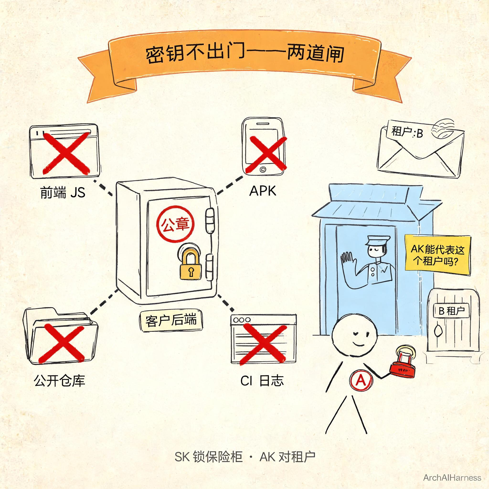
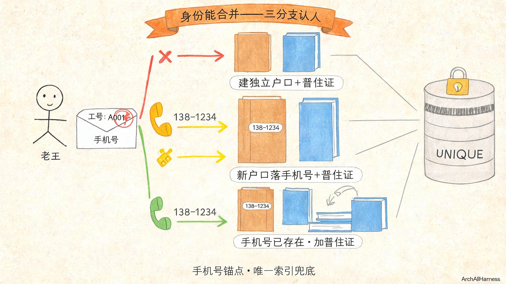
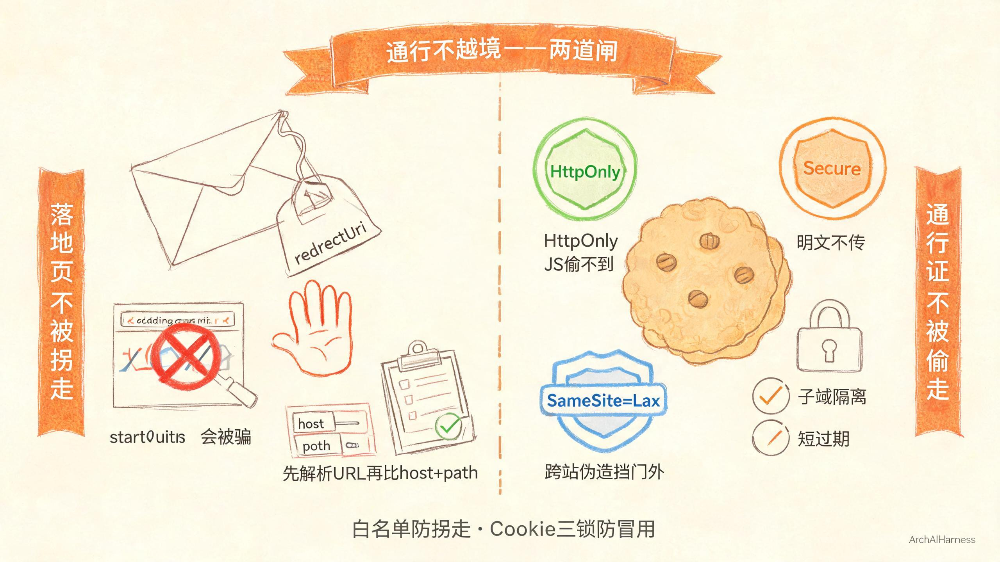
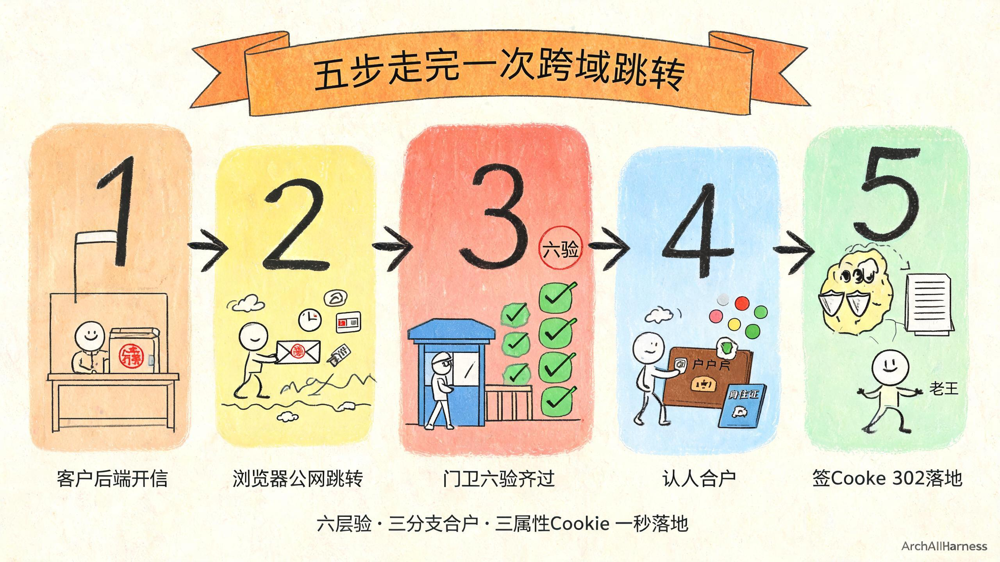

# 四道纪律焊死一次跨域跳转——密钥不出门、路上带盖章、身份能合并、通行不越境

上一篇把心智讲完了——客户要的从来不是登录，是免登直达；不是再造一套账号体系，是把他那边已经有的信任原样翻译过来。四件真需求也立住了：引路人是谁、路上凭什么信、进来认哪张脸、通行证能开哪几扇门。

心智有了，不代表活就干完了。

你把这四件事想得再透，落进代码里时，只要有一行偷懒、一个细节省了、一个边界没焊死——三年里总会有一个凌晨三点的电话打过来，告诉你它翻车了。而且翻的一定不是什么"协议没跑通"的大错，都是些看着不起眼、写的时候觉得"应该没事吧"的小口子：密钥被人从前端扒走了、一封过期的介绍信被人重放进来了、同一个员工在系统里裂成了两个账号、员工被一封合法的信拐到钓鱼站去了。

这一篇我们卷袖子干活。把上一篇那四件事，翻成四道**焊死的纪律**——每一道都讲清楚：怎么焊、焊在哪、不焊会怎么翻。

不是讲协议选型，也不是讲算法原理，是讲**工程上那几道最容易被省、省了就迟早翻车的硬规矩**。你把这四道纪律守住，HMAC 也好、OAuth 也好、SAML 也好、将来换什么新协议也好，一次跨域跳转就翻不了车。

你要明白：**能跑通一次演示，和能在生产环境跑三年，从来不是同一件事。** 前者把流程走通就成，后者靠的是每一道闸都焊死。

## 一、纪律一：密钥不出门——公章永远锁保险柜

第一道纪律，对应上一篇第一件事——引路人是谁。

上一篇打过一个比方：AK 是公司名牌，可以随便露；SK 是公司公章，只能锁保险柜里。道理不复杂，可你真去看一圈接 SSO 的项目，密钥泄露的翻车现场一个比一个经典。我随便列几个你一定见过的：

**第一种，把 SK 写进前端 JS。** 图省事，签名直接在浏览器里算。开发者自己安慰自己"我们是内网、员工都是自己人"——可前端代码是下发到每个员工浏览器里的，一个恶意浏览器插件、一个被挂马的页面、一个手滑把 JS 文件发出去的员工，SK 就没了。

**第二种，把 SK 硬编进移动端安装包。** 比写进前端 JS 还离谱，但真有人这么干。安装包是能被反编译的，字符串一搜，SK 直接躺那儿给你看。

**第三种，把 SK 提交到公开代码仓库。** 不一定是故意的，可能是某个调试用的配置文件忘了加进忽略列表、某次紧急上线把密钥贴在示例代码里忘了删。代码一旦推到公开仓库，爬虫几分钟之内就会扫到。

**第四种，CI 日志里打印 SK。** 为了排查"签名为什么算不对"，开发者在构建日志里把参与签名的字符串、甚至 SK 本身打了出来。CI 系统的日志是明文的、存半年一年的，而且很多团队里不止一个人有权限看。

这四种我全见过。每一种翻车之后的剧情都差不多：半夜告警响成一片、全量换 SK、所有已签发链接作废、客户 IT 被老板拍桌子、研发通宵擦屁股。

你发现没有——**这些翻车没有一个是因为算法被破解，全都是因为公章被人拎出了保险柜。** 从 SK 离开客户后端服务器那一刻起，你后面再怎么加签名、加时间戳、加白名单，都是在给一个已经漏光的桶打补丁。**安全事故从来不是发生在加密算法被破解的那一天，而是发生在密钥第一次离开保险柜的那一秒。**

所以这道纪律我跟客户交代得很死，也跟我们自己的工程师交代得很死——SK 只能待在客户后端服务器里，签好名的跳转链接由后端生成之后再交给前端去打开；员工的浏览器里、前端的 JS 里、安装包里、公开仓库里、CI 日志里，任何一处都不能出现 SK 的影子。这不是最佳实践，这是红线。

光守住"SK 不出门"还不够，还有一刀必须补——而且这一刀，九成接 SSO 的人第一版都会漏。

**验完签名之后、放行之前，必须再补一刀：这把 AK，到底有没有资格代表信里写的这个租户？**

什么意思？我给你讲个场景：A 客户手上有 A 客户自己的 SK，这把 SK 是合法的、是我们签发的、是没泄露的。可他能不能用这把 SK，签一封"我是 B 客户的租户，带一个 B 客户的员工进来"的介绍信？

你仔细想——签名是用 A 的 SK 算的，签名校验能过，章是真的；时间戳也对、nonce 也没用过；可信里写的租户编码却是 B 的。如果你只校验签名、时间戳、nonce，这封信就会被你放进来，然后这个员工就被当成 B 客户的人扔进 B 客户的租户空间里去了。

**这不是破解密码，这是权限越界——比破解密码还危险，因为整个签名过程完全合法。** 他不是伪造了公章混进门，而是拿着自家真公章、盖了一封送别人去别人家的信。门卫要是只看章不抬头，就被他骗过去了。

所以我们后台有一张 AK 和租户的归属关系表。门卫收到信、验完签名之后，必须多查一刀——"这把 AK 能代表信里写的这个租户吗？"对不上，一律拦在门外，管你签名是真是假。

这一刀不补，前面签名、时间戳、一次性号做得再漂亮，也是白搭——门是锁了，但你没看门牌号对不对。

最后还有个不显眼但特别致命的细节——**比对两个签名的时候，必须用常量时间比较。**

普通的字符串比较，是一个字一个字往下比的，一旦发现哪一位不一样就立刻停下来返回"不相等"。这在日常开发里是个优化，可在安全校验里这是个漏洞——因为"比较花了多长时间"本身就会泄露信息。第一位就错和最后一位才错，花的时间不一样；攻击者可以靠这个时间差，一位一位地把正确签名反推出来。

常量时间比较就是不管第一位就错还是最后一位才错，都从头比对到尾、花一样长的时间，把这条"靠耗时反推签名"的旁路彻底堵死。写在代码里就一行，但少了这一行，你那道防伪门就是纸糊的。

这一节我想跟你说的是——

**密钥不出门，不是一句口号，是两道具体的闸：第一道闸把 SK 死死锁在客户后端保险柜里，任何别的地方都不能出现；第二道闸在验签之后补一刀 AK 和租户的归属校验，防住拿着真公章开越境信的"自己人"。公章永远锁保险柜，介绍信满天飞章不动——这才是密钥这道纪律的完整意思。**

## 二、纪律二：路上带盖章——信本身要能自证"是真的、是今天的、只用一次"

第二道纪律，对应上一篇第二件事——路上凭什么信。

上一篇讲过，一封能过门卫的介绍信，得能证明三件事：是这家公司盖的、不是上周那封、这五分钟里没用过第二次。签名、时间戳、一次性号三道防伪叠在一起。这一节我们把这三道防伪翻成工程纪律——每一道都讲清楚为什么必须这么写、偷一点懒会怎么翻。

先把一封真正合格的跳转链接拆开给你看。一条 GET 请求长这样——我不写完整代码，就给你看它由哪几段拼成：

`ak + params(Base64Url编码的业务参数) + sign(Base64编码的HMAC-SHA256签名) + timestamp + nonce`

这里面有两个编码细节，是你第一次上线一定会踩的坑。

**第一个，业务参数为什么用 Base64Url，不用普通 Base64？**

普通 Base64 会出现三个字符：`+`、`/`、`=`。这三个字符放在 URL 里会出事——`+` 在 URL 查询串里会被某些浏览器和代理当成空格、`/` 是路径分隔符、`=` 是参数分隔符。一封从客户后端发出去、签名完全正确的介绍信，经过几个中间代理一跳，到我这边门卫手里的时候参数可能已经被改了字符，签名自然就对不上了——不是有人攻击你，是 URL 自己把信弄花了。

Base64Url 就是专门为 URL 设计的变种：用 `-` 代替 `+`、用 `_` 代替 `/`、去掉末尾的 `=`。这一改，整段参数在 URL 里安安全全，中间代理再怎么跳也改不了它。

**第二个，签名为什么反而用普通 Base64，不用 Base64Url？**

因为签名是一个独立的查询参数，不是嵌在 URL 本体的字符层里——它作为一个完整的参数值传过来，不需要在 URL 字符集里"安全行走"。用普通 Base64 反而更通用，各种语言的 Base64 解码库默认就是它，少一次变种转换、少一次踩坑机会。

这俩细节写在协议里就一行字，可你第一次上线不注意，上线之后会有一小部分用户"有时候能跳过来、有时候跳不过来"，而且复现不了——因为只有经过特定代理、特定浏览器版本的时候才会触发。这种 bug 查起来能把人查疯，还不如在协议里焊死。

接下来是这一节最关键的一个工程取舍——**签名算法用 HMAC 还是 RSA？**

这是个老问题。很多人第一反应会说："RSA 是非对称的呀，我不用碰客户的私钥，不是更安全更解耦吗？"

听起来对。但做工程不是听着对就选，得看场景算账。我给你掰扯掰扯这俩在 SSO 这个具体场景下的差别。

**先看密钥管理。** RSA 是非对称，客户自己留私钥，把公钥给我。听起来"我不用碰他的私钥"很干净——可现实是，我们和客户是已经建立商务信任的双向关系，SK 是我们线下或者控制台签发给客户的，不存在"我不信任他、他不信任我"的开放联邦场景。HMAC 对称一把钥匙双方各守一半，在这种已建立信任的关系里，反而比 RSA 简单得多：不用做 PKI、不用发证书、不用处理公钥轮换、不用维护证书吊销列表。

**再看性能。** HMAC-SHA256 签一次是微秒级的，RSA-SHA256 签一次是毫秒级——差了三个数量级。你别觉得几毫秒无所谓，SSO 是所有请求的入口，流量一上来，签名校验这一步的 CPU 开销会被放大成百上千倍。而且 RSA 的密钥长度动辄 2048 位，签名字符串也比 HMAC 长不少，跳转 URL 会明显变长。

**再看接入成本。** 客户工程师接 RSA，得搞密钥对生成、得处理 PEM 格式、得选对 padding、得注意字符编码——这些环节任何一个小错，签名就算不对，排查起来对客户工程师是折磨。接 HMAC？把 SK 当密码传进去，调一个加密库的 HMAC 方法，完事。接入成本的差别，直接决定了客户接入的成功率和你支持团队的工单量。

**那 RSA 什么时候该用？** 跨信任域的开放联邦——谁都能注册进来、你和接入方没有商务关系、接入方可能是不可信的第三方。这时候非对称才是对的，你只收公钥，永远不碰他的私钥。比如"用某大厂账号登录"这种开放场景，那必须是非对称协议。

回到我们这个场景——客户是和我们签了合同、我们线下签发 AK/SK 的 B2B 客户，双方在同一个信任域内。**守住第一道纪律"密钥不出门"，HMAC 就是最优解**：极简、高吞吐、接入成本低、密钥轮换一键完成。RSA 那些非对称带来的"解耦"好处，在这个场景里根本用不上，反而要付出性能、复杂度、接入成本三重代价。

不是 RSA 不好，是场景不对。**工程上选算法不是选"听起来更高级"的那个，是选"在这个具体场景里把账算明白最合适"的那个。** 安全方案的好坏从来不是比谁用的算法名头大，而是看你守不守得住自己那道信任边界。

防伪的第一道——签名是真的——讲完了。第二道，时间戳窗口。

前面说过，时间戳的窗口是正负五分钟。这五分钟不是拍脑袋定的，是有物理意义的：

太短了——比如正负三十秒——扛不住两边服务器的时钟漂移。你别觉得"服务器都配了时间同步"就万事大吉，跨大区、跨机房、跨云厂商，几百毫秒到一两秒的漂移是常态；客户那边要是有个老系统时间没配对，差个十几秒都有可能。窗口留太小，正常请求会被你误杀。

太长了——比如正负半小时——你给攻击者留的重放窗口就太大了。一封被截获的合法介绍信，他在半小时里能试几十次，撞到你哪层防御没跟上就进去了。

正负五分钟是行业里打了多少年仗打出来的经验值——扛得住时钟漂移和跨区延迟，又不给攻击者留太多尝试空间。别自作主张改它。

第三道防伪，一次性号 nonce。

时间戳挡住了"昨天那封"，但在五分钟窗口之内，有人截了一封信再投一次怎么办？签名对、时间戳也对，门卫凭什么拦他？所以还得加一道一次性号——客户后端在信里塞一个随机生成的只用一次的串，我这边收到后先去缓存里查，五分钟之内见过就拒绝，没见过就记进去。

这里有个经典并发坑——**"先查再写"是错的，必须原子操作。**

你要是写成"先去缓存里查一下这个 nonce 存不存在，不存在就写进去"，在并发下两个重复请求会同时查到"不存在"，然后同时写进去，双写双放。一次性号等于白加。

正确的做法是用缓存的原子写入——"只有 key 不存在才设置成功、并且 300 秒后自动过期"这一整句话合成一个不可分割的动作发过去，并发再来多少也不会双放。300 秒的过期时间和时间戳窗口自然对齐——五分钟之前的 nonce 本来就该忘掉，留着占内存没意义。

三道防伪叠在一起：签名证明"是他们家发的"，时间戳挡住"昨天那封"，一次性号挡住"这五分钟里的第二封"。少一道，防伪就不成立。

**HMAC 的取舍讲透了、时间戳窗口算明白了、nonce 原子操作焊死了——这一纪律才算焊完。**

这一节我想跟你说的是——

**路上带盖章，不是"签个名就完事"，是三道锁合起来：签名盖真章、时间戳卡有效期、一次性号防重复投递。每一道锁都有自己的工程细节：Base64Url 保护 URL 里的参数字符不被改、HMAC 在同信任域内比 RSA 更合适、正负五分钟是算出来的物理值不是拍脑袋、nonce 必须原子写入不能先查再写。信本身要能自证三件事——是真的、是今天的、只用一次。缺一件，这封信就在公网上裸奔。**

## 三、纪律三：身份能合并——同一个人永远是一个人

第三道纪律，对应上一篇第三件事——进来后认哪张脸。

上一篇讲过那个经典鬼故事：老王从客户系统点进来，建了个账号；过了一周他自己用手机号在官网注册了另一个账号；同一个自然人在系统里裂成两个，两份数据、两份配置、永远拼不回一个人。工单炸了、客户拍桌子、研发查三天。

这一节我们把身份合并翻成工程纪律——怎么用数据表、索引和原子操作，把"同一个人永远是一个人"这件事焊死在数据库层面，而不是寄希望于代码永远不写错。

先讲数据模型。**你在数据库里其实就三张表，我用大白话给你讲，不贴建表语句。**

**第一张，自然人户口。** 这张表记"这个人本身是谁"——主键是我们自己生成的用户 ID，字段里最关键的是手机号（可以为空，但只要有就必须是唯一的）。你把它想成一本户口本：一个人一本户口本，本子上写着他的手机号、昵称、头像这些基本信息。

**第二张，第三方面的暂住证。** 这张表记"这个人从哪个外部系统进来、在外部系统里叫什么"——字段就是"我们这边的用户 ID + 外部租户编码 + 外部用户 ID"。你把它想成一本暂住证：老王是从 A 公司系统跳过来的、在 A 公司的工号是 A001，这就给他发一本暂住证，挂在他的户口本下面。一个人可以有好几本暂住证——可以从 A 公司系统进来、可以从 B 公司系统进来、也可以自己用手机号注册——但户口本永远只有一本。

**第三张，住户名册。** 这张表记"哪家公司有哪些员工"——租户编码、用户 ID、角色、权限。你把它想成小区楼下那块黑板：哪栋哪单元住了哪几个人、谁是物业谁是住户。一个人可以同时出现在好几家公司的黑板上（比如外包人员同时接两个客户的活），但他还是那一个人、那一本户口本。

三张表就这么简单——户口、暂住证、住户名册。真正的功夫不在建表，在索引。

**暂住证这张表上，必须建一个唯一索引：UNIQUE(外部租户编码, 外部用户 ID)。** 这什么意思？就是——同一家公司来的同一个外部工号，最多只能挂到我们这边一本户口本上。

为什么这是最后一道防线？我给你讲个鬼故事。

有个团队，代码里写了这么一段逻辑：收到 SSO 请求之后，先去暂住证表里"SELECT 一下，看看这个外部工号挂过没有"；没挂过，就"INSERT 一条新暂住证"。听起来对不对？逻辑上是对的。可并发来了两个一模一样的请求——比如用户手快点了两下、或者网络重试发了两次——这两个请求同时到达、同时执行 SELECT、同时发现"没挂过"、然后同时 INSERT 两条暂住证记录。同一个外部工号，挂到了两本不同的户口本上。

于是老王又分裂了。

代码逻辑完全"正确"，可并发下就是翻车。你能怪谁？怪用户手快？怪网络重试？这种 bug 在测试环境根本复现不出来——你得靠两个毫秒级并发的请求撞在同一个毫秒上才会触发，可一旦触发就是生产事故。

**代码会写错、服务会发癫，但数据库的唯一索引不会骗人。** 不管你应用层代码写成什么样、不管并发来多少请求，数据库层面"同一租户+同一外部工号只能有一条记录"这个约束永远不会被突破。这就是我说的"最后一道锁"——你可以在代码里做各种判断，但最后一定要让数据库帮你再卡一次。

这个道理说穿了很朴素：**不要把唯一性寄托在应用层代码的判断上，要把它焊死在数据库的索引里。** 人会走神、代码会有 bug、服务会在并发下发癫，但数据库的唯一约束不讲情面。身份合并这件事，不是靠 if-else 写得周全，是靠数据库帮你守住最后一道闸。

讲完索引，再讲门卫实际拿到信之后的合并逻辑——这是站在工程视角，把上一篇那三条分支再用大白话过一遍。门卫拿到信、签名验完、租户归属校验完、时间戳和 nonce 都过了，剩下的事就是"抬头写的这个人，算我们这儿的谁"？

三个分支，没有第四种：

**第一分支：信里根本没带手机号。** 没办法，没有锚点就没法合并——不能凭空猜这个人是谁。只能给他新建一本独立的户口本，再发一本挂着这个外部工号的暂住证。这种情况下，他以后自己用手机号注册，两个账号合不上，这账算在当初业务方为什么不传手机号上。所以协议文档里手机号必须标成"强烈建议传"——它看着是可选，实际上是"不传将来别来找我哭"的意思。

**第二分支：信里带了手机号，但我们户口本里从来没见过这个号。** 说明这个人是第一次来——给他新建一本户口本，把手机号一起落下来，再发暂住证。以后他不管从哪个入口进来、不管他自己用手机号直接登录还是从客户系统跳过来，都能找到这同一本户口本，不会分裂。

**第三分支：信里带了手机号，我们这边已经有一本挂着这个号的户口本。** 不建新户口本，直接给他那本已有的户口本加发一本新暂住证就行。同一个自然人，多了一重从这个客户系统进来的身份而已，数据还是同一份、配置还是同一份、之前写的东西全在。

三条分支看着简单，可写代码的时候还有一个坑——**别自己写"先 SELECT 再 INSERT 再 UPDATE"三步曲，要用数据库的原子 upsert。**

什么意思？你要是分三步写——先查有没有、没有就 INSERT、有就 UPDATE——跟前面那个"暂住证双写"是一个病：并发下两个请求同时查到"没有"，然后同时 INSERT，唯一索引直接报错。数据库都给你提供了"有就更新、没有就插入"的原子操作，一行调用搞定，别自己动手拼三步。该让数据库干的事，别在应用层逞能。

这一节我想跟你说的是——

**身份能合并，靠的不是应用层那堆 if-else 写得多周全，是两件东西：一是手机号这个跨系统自然人锚点，二是数据库层面的唯一索引和原子操作。同一个人永远是一个人，不管他从哪扇门进来——这件事不能寄希望于代码永远不写错，要焊死在数据库不会骗人的约束里。代码会错，索引不会错。**

## 四、纪律四：通行不越境——通行证是一次性的、有边界的、不能被借去串门

第四道纪律，对应上一篇第四件事——通行证能开哪几扇门。

前三道焊完了：密钥不出门、路上带盖章、身份能合并。员工顺利进到我这边，也被认成了正确的老王。看似齐活了。但还有最后一道，也是最容易被忽略的一道——**这张通行证进来之后，能开哪几扇门？会不会被人借去乱串？**

这一道纪律分两层讲：一层讲"人进来之后，你把他往哪儿领"；一层讲"你给他发的那张进门凭证，本身安不安全"。

先讲第一层——落地页不能乱跳。

介绍信里带了一个字段叫 redirectUri，就是员工进来之后你要把他扔到哪个具体功能页去。客户运营从"报表入口"点进来，想直接落报表页；从"工单入口"点进来，想直接落工单页。这个字段本身合理，但它是个巨大的坑——如果我不做任何限制，直接按信里写的地址往那儿一扔，攻击者就能构造一封"章是真的、时间对、nonce 新、人也对，但请把这个员工扔到钓鱼站去"的信。员工一看是从自家公司系统点过来的、跳转路径里还带着我们域名，谁会怀疑？啪一下就被扔到钓鱼站去了，账号密码当场交出去。

这种攻击叫任意跳转。它不偷你数据、不破你密码，它借的是你这边域名的信誉——员工信你，所以信你带他去的地方。

防法听着简单：**给每个客户配一份"允许落地的地址清单"，信里写的地址必须命中这份清单，否则不跳。** 但做起来细节坑死人。

清单可以配到三种粒度，我给你排个序：

**最严的，精确匹配**——只能跳到这一个具体地址，差一个字符都不行。这种最安全，但客户运营起来特别麻烦：一个报表系统里几十上百个页面，每个都要配一遍，没人愿意干。

**中等的，前缀匹配**——允许跳到某个前缀开头的所有页面。比如配了"https://saas.example.com/report/"，那"/report/daily"、"/report/weekly?dept=sales"这些都合法，前缀对上就行。这是生产环境里最常用的粒度——既能放开一整个功能模块，又不至于开得太大。

**最松的，域匹配**——允许跳到整个域名下任何地方。听着省事，但我劝你生产环境别用。整个域名放开，等于把"借你信誉跳转"的权力全部交了出去；将来你这个域名下任何一个页面出了能被利用的漏洞、或者有人在同域下挂了不该挂的东西，这道白名单等于虚设。

**生产一律用前缀匹配，别图省事放整个域名。**

但是——重点来了——**前缀匹配你也别偷懒直接用字符串 startsWith，一定要先把 URL 解析开，单独拿 host 和 path 出来比。**

为什么？字符串 startsWith 有个经典老把戏，我举个例子你就懂了。你配的前缀是"https://saas.example.com"，你以为只要开头是这个就都是你家的。可攻击者构造一个地址叫"https://saas.example.com.evil.com/领奖"——你拿 startsWith 去比，哎，开头确实是"https://saas.example.com"啊，对得上！放行！可你仔细看，这个地址真正的域名是 evil.com，"saas.example.com"只是 evil.com 下的一个子域名前缀而已，跟你半毛钱关系没有。

所以正确的做法是：先用 URL 解析器把地址拆开，取出它的 host（真正的域名）和 path（路径部分），然后拿 host 跟白名单里的 host 精确比、path 跟白名单里的 path 前缀比。解析之后再比，这种小把戏立刻现形。这种坑都是前人踩了无数次踩出来的，你别再自己去踩一遍。

第一层——落地页不被拐走——讲完了。第二层讲"你发给员工的那张进门凭证本身安不安全"，也就是 Cookie。

员工验明正身之后，我方门卫会给他发一张 Cookie，以后他再访问我方页面，浏览器自动带着这张 Cookie 来，门卫一看就知道"哦，是老王，已经验过了，放进去"。这张 Cookie 要是被偷走了，别人拿着它就能冒充老王进我们系统——所以 Cookie 本身必须焊死三个属性，一个都不能少：

**第一道，HttpOnly。** 意思是这张 Cookie 不许浏览器里的 JavaScript 读到。浏览器收到 Cookie 之后，自己存着、下次请求自动带着，但是页面上跑的任何 JS 代码都拿不到它。为什么？因为偷 Cookie 最常见的手段就是 XSS 攻击——攻击者想办法在你页面上注入一段恶意 JS，这段 JS 一执行就把 document.cookie 读走发到攻击者服务器上去。HttpOnly 一开，JS 根本读不到，偷都没得偷。一句话讲物理意义：**JS 偷不到。** 你要记住：HttpOnly 防的不是攻击者注入脚本这件事本身，而是让他注入了也拿不到最值钱的那张凭证。

**第二个，Secure。** 意思是这张 Cookie 只在 HTTPS 加密连接上才会被浏览器发送，明文 HTTP 请求一律不带。为什么？因为明文 HTTP 传输是裸奔的，中间任何一个节点——同一个咖啡馆 WiFi、同一个公司网关、同一个运营商中间层——都能把流量抓下来看个精光。Secure 一开，Cookie 就只走加密通道，明文网络里看不见它。一句话讲物理意义：**明文网络不传。**

**第三个，SameSite=Lax。** 这个属性控制"别的网站跳转过来的时候，带不带这张 Cookie"。Lax 是个平衡点：顶级跳转（比如你从客户系统点链接直接跳过来）浏览器会带着 Cookie，不影响正常使用；但是跨站的伪造请求——比如攻击者在自己的钓鱼页面里藏一个自动提交的表单、偷偷往我们系统发请求——浏览器不会带 Cookie，请求就直接被拦在门外。一句话讲物理意义：**顶级跳转不挡、跨站伪造挡在门外。**

这三个属性，少一个 Cookie 就不安全。少了 HttpOnly，XSS 一把偷走；少了 Secure，HTTP 抓包裸奔；少了 SameSite，跨站请求伪造（CSRF）把员工当傀儡。

还有两个 Cookie 的纪律，比这三个属性还容易被忽略——**作用域和过期时间，必须按租户和风险切，不能偷懒一刀切。**

先说作用域。你要是图省事，把 Cookie 作用域设成根域名（比如".example.com"），那所有子域名下的页面都能读到这张 Cookie。听起来方便，可这意味着——只要你旗下任何一个子域名出了 XSS 漏洞，所有租户的 Cookie 全都能被偷走；A 租户的页面如果有漏洞，B 租户的员工凭证也能被摸到。**别一枚 Cookie 打根域让所有租户互相看见。** 按租户或者按业务模块切子域，Cookie 只挂在对应子域上，一家出事别家不连带。

再说过期时间。你要是图省事，把 Cookie 过期时间写成三个月、半年，那员工离职三个月之后，他电脑里那张 Cookie 还是活的，捡着他电脑的人照样能进。不是危言耸听——很多企业 IT 安全审计里"员工离职但系统权限没回收"是最高频的问题之一。Cookie 过期时间按业务敏感度定，高敏感系统短则几小时长则几天，员工一关浏览器就该失效的别留到下个月。**别过期时间写三个月员工离职了还能进。**

这一节这两把锁——redirectUri 白名单防被拐去钓鱼站、Cookie 三属性+作用域+过期三防被偷走冒用——合在一起，才是"通行不越境"的完整意思。

这一节我想跟你说的是——

**通行不越境，防的不是外面那个连门都摸不到的贼，是两种内鬼：一种是借你家信誉把员工拐去钓鱼站的"合法介绍信"，一种是偷了员工 Cookie 冒充本人进来的"借证串门"。落地页白名单是防被拐走，Cookie 三属性加合理作用域过期时间是防被偷走。通行证必须是一次性的、有边界的、不能被借去串门——焊死这几件事，员工进来之后的路才不会走歪。**

## 五、把四道纪律串成一条真实的跳转链

四道纪律一道一道焊完了，现在我把它们串起来，带你完整走一遍一次跨域跳转。你会看见，从员工在客户系统里点下按钮，到他看见我方功能页，中间那几秒发生了什么、每一步守的是哪条纪律。

我不用术语，就给你讲一个人从对门公司过来、我方门卫怎么一层一层查、最后放他进门的故事。

**第一步：客户后端后台里，行政把介绍信开出来。**

员工老王在客户自己的 OA 系统里点了一下"打开数据看板"。OA 系统不会自己拿着 SK 算签名——它转身去找自家后端的行政。行政锁在服务器房间里，SK 就在她保险柜里。她拿出 SK，把老王的信息——哪家公司来的、工号多少、手机号多少、叫什么、想去哪一页——按规矩排好序拼成一段规整的文字，拿 SK 算个 HMAC-SHA256 签名，再附上个当前时间戳、一个一次性随机号，把所有东西用 Base64Url 包好，拼成一封完整的介绍信，交还给 OA 前端。

这一步守的是**纪律一：密钥不出门**。SK 从头到尾没出过客户后端服务器，行政亲手盖的章，前端拿到的只是一封盖好章的信，章本身永远锁在保险柜里。

**第二步：老王的浏览器带着信，跳向我方门口。**

OA 前端拿到信，让老王的浏览器直接一个 GET 跳转——带着 ak、params、sign、timestamp、nonce、redirectUri 这一整串参数，直奔我方门口的接待处。浏览器就是个跑腿的信使，它能看见信上写了啥，但它改不了——改一个字签名就对不上。

这一步其实是最"裸奔"的一步：信在公网上走、经过各种中间节点、在浏览器地址栏里都能看见完整内容。它不怕被看，怕被改、怕被重放——而这俩靠下一层来守。

**第三步：我方门口接待处一层一层验。**

信到了我方门口（这里多说一句：我方的接待/gateway，就是做这六层验的，验完它不处理业务、只管放行）。六层验，一层都不能少：

第一层，**掏出 AK 查是哪家客户**——找不到的直接拒收。这是纪律一的前半段。

第二层，**按这家客户在我方登记的 SK，把参数重新算一遍签名**，用常量时间比法跟信上的签名对——对不上直接拒收。这是纪律二的第一道防伪：信真是他们家盖的。

第三层，**查信上的时间戳**，离当前时间超过五分钟直接拒收。这是纪律二的第二道防伪：不是上周那封。

第四层，**原子地查一次性号**——五分钟内见过这个号直接拒收，没见过就记下来、设五分钟过期。这是纪律二的第三道防伪：这五分钟里没用过第二次。

第五层，**验证 AK 和信里写的租户对不对得上**——AK 是 A 客户的就只能代表 A 客户，想开 B 客户的门直接拒收。这是纪律一的后半段：公章虽然是真的，但你不能拿自家公章开别人家的信。

第六层，**验证 redirectUri 在这家客户的允许清单里**——先把 URL 解析开比 host 和 path，不能被字符串前缀骗了，要带去钓鱼站直接拒收。这是纪律四的前半段：通行证不能把人拐走。

六层全过，信才算真的验完了。任何一层不过，门卫二话不说直接拦在门外，不往下走。

这六验合起来，不是走个过场，是把"这封信能不能信"这件事从六个不同角度全部卡死——少验一层，就是给攻击者多留一道缝。

这六验合起来，把纪律一（密钥不出门+租户归属校验）、纪律二（签名+时间戳+nonce+原子操作+常量时间比较）、纪律四（落地页白名单）全守了。

**第四步：认人——抬头写的这个人，算我们这儿的谁。**

信验完了，门卫抬头看信上写的这个人：A 客户、工号 A001、手机号 138xxxx1234、叫老王。这时候就走纪律三那三条分支——有手机号就查手机号见过没，没手机号就新建独立户口，手机号见过就往已有户口本上加一本暂住证，数据库原子 upsert、唯一索引最后兜底。

整个认人过程，门卫不看老王长什么样、不问老王密码、不让老王再输一次手机验证码——他只认信上写的、只认数据库里那个锚点。不是为了省一步验证，是客户要的就是"点一下一秒进来"，多问一句都是把他拦在外面。

这一步守的是**纪律三：身份能合并**。同一个老王，不管从哪家客户系统跳过来、不管是不是自己注册过，永远是一个人一本户口本，不会裂成俩。

**第五步：签发本地会话，302 落地。**

人认准了，门卫给老王发一张我方的进门凭证——Cookie。这张 Cookie 挂在正确的子域上、HttpOnly、Secure、SameSite=Lax，过期时间按规矩来，不偷懒打根域、不偷懒写仨月。然后给浏览器回一个 302 重定向，告诉浏览器"带着这张 Cookie，去信里写的 redirectUri 那个地址吧"。

浏览器带着新签发的 Cookie 跳向功能页，功能页一看 Cookie 认识，直接渲染已登录的页面——老王眼睛一眨，已经站在他想去的那张报表前面了。

从点按钮到看见报表，一秒钟。中间六层验、三步合并、一次签发，全在那一秒里走完了。老王什么都不用做，他甚至不知道中间发生了这么多事。

这一步守的是**纪律四的后半段：通行不越境**。Cookie 发得规矩，它就只能在我这边起作用、只能在规定时间内生效、JS 偷不到、明文不传、别的网站伪造请求带不走。

五步走完了。我带你回头数一遍：密钥没出过服务器、信自带三层防伪、人被认成同一个、通行证有边有界、Cookie 焊死三属性。**四道纪律没有一道被绕过，没有一道靠代码自觉，每一道都是焊死的闸。**

这就是一次完整的、能上生产、能跑三年不出事的跨域跳转。

## 六、写在最后

上一篇开篇我写了一句话——"客户说 SSO 不是要登录，是要免登直达。"这一整篇讲下来，你再回头品这句话，会有不一样的味道。

免登直达这四个字，听起来像是个用户体验问题。员工点一下就进来，多简单——可真要让这一下点下去三年不出事，背后是四道焊死的纪律在兜底。密钥不出门，公章就永远安全；路上带盖章，信就永远能自证真假；身份能合并，人就永远不会裂成两个；通行不越境，证就永远不会被借去串门。

你注意到没有——**这四道纪律跟具体用什么协议没关系。**

今天用 HMAC 对称签名，你守这四道；明天客户要求换成 RSA 非对称，你还是要守这四道——SK 不出门换成"私钥不出门"而已，章的形状变了，公章锁保险柜这个道理没变。后天换成 OAuth 2.0、换成 SAML、换成 JWT、换成将来什么新出的协议，你照样要守这四道——协议是流动的，纪律是稳定的。

很多人学安全、学认证、学 SSO，抱着厚厚的协议文档啃，以为把算法流程背下来就会了。**不是的。协议是武器，纪律是用武器的姿势——姿势不对，拿着再先进的武器也会走火。** 你见过多少系统，OAuth 2.0 接得规规矩矩，结果 redirectUri 没做白名单校验被人拐去钓鱼站？你见过多少系统，JWT 签得漂漂亮亮，结果密钥硬编在前端 APK 里被反编译扒走？武器是新的，翻车翻的是那些几千年都没变的老坑。

焊这四道纪律，不是为了让协议看起来正规、不是为了过安全审计、不是为了在架构评审会上能讲出漂亮的图。**是为了让那个员工点一下的时候，真的能一秒钟落到他想去的那张报表上；是为了他落进去之后，三年里不会因为某道闸没焊死而出事；是为了凌晨三点你家的告警电话不会因为"某个几年前偷的懒"而响起。**

回到最开始那个心智——客户要的从来不是一套登录系统，是"别拦我人，让他一秒进来"。四道纪律焊死了，你才能拍着胸脯跟他说这句话。否则你签多少合同、做多少演示、给他看多少架构图，都是虚的。

**协议轮着换，公章永远要锁保险柜。会焊纪律的人，比会选协议的人金贵。**

---

### 关于 ArchAIHarness

这篇文章是「看懂 AI 与智能体」专栏的一部分，由 [**ArchAIHarness**](https://github.com/ArchAIHarness) 持续输出。

ArchAIHarness 是一套面向 AI 时代软件工程的人机协同架构哲学与公开工程资产，主张：

> **架构师定义秩序，AI 在秩序中生长。人立法，AI 执行，体系审计。**

如果你也希望 AI 在明确的架构边界内协作，而不是在混沌中碰运气，欢迎到 GitHub 上看看我们在做什么：

- **组织主页**：[github.com/ArchAIHarness](https://github.com/ArchAIHarness) — 了解完整理念与资产全景
- **本专栏**：[`zhuanlan-ai-and-agents`](https://github.com/ArchAIHarness/zhuanlan-ai-and-agents) — 所有文章的源码与发布记录
- **实践指南**：[`docs`](https://github.com/ArchAIHarness/docs) — 架构哲学、工程方法和落地指南
- **开源工具**：[`agent-workflows`](https://github.com/ArchAIHarness/agent-workflows) — 可复用的 AI 协作 Agents、Skills 与 Tools
- **工程样例**：[`framework`](https://github.com/ArchAIHarness/framework) — DDD + AI 协作的工程底座，展示如何在开发中融合 AI

> Engineered by Architects · Empowered by AI · Audited by Discipline

