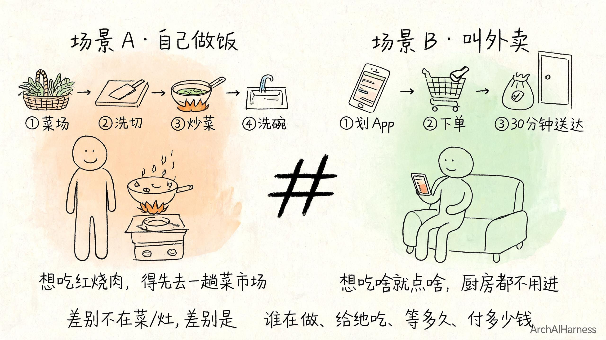
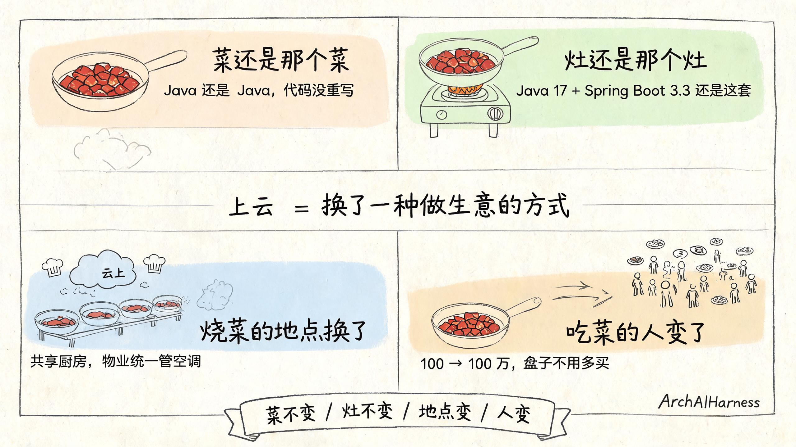
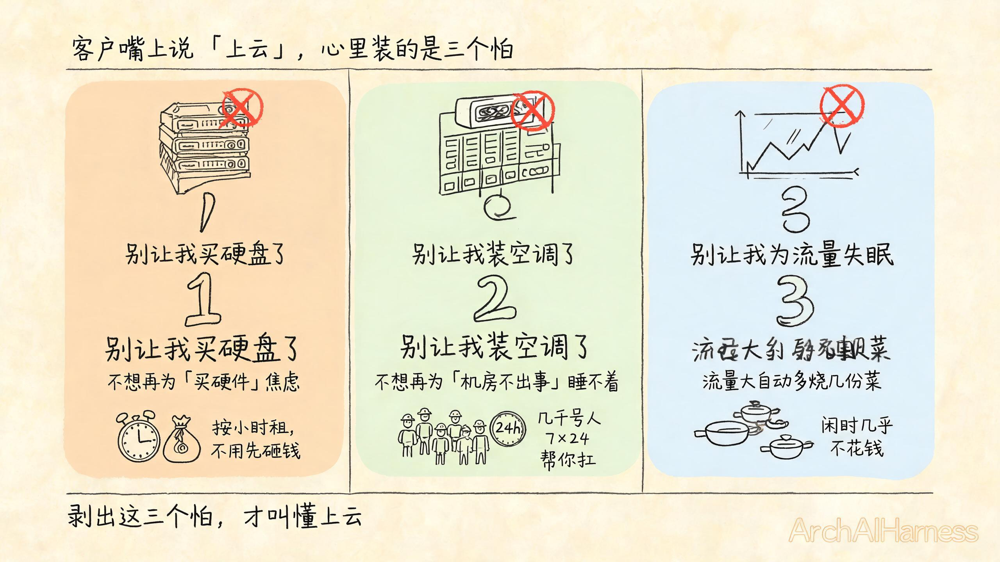
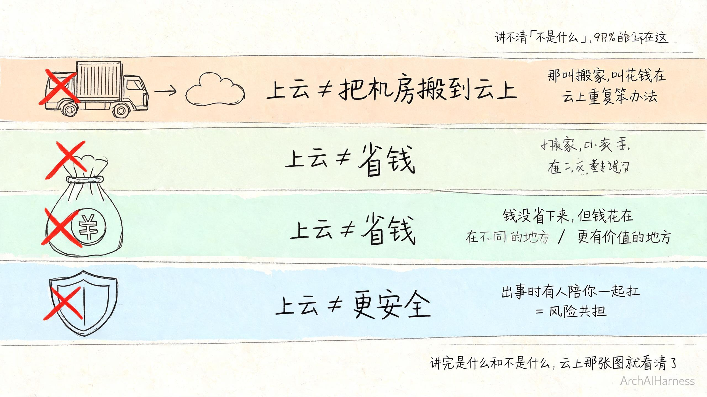
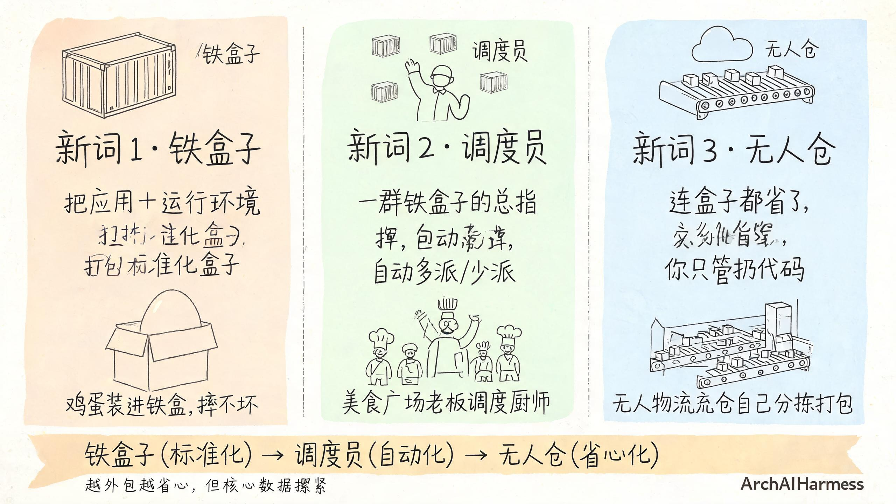

# 客户问"我们要不要上云"——上云不是搬家，是把厨房开成外卖档口

客户老板又问："我们要不要上云？"

你心里想翻白眼。这问题他问了 100 遍了。每次你给他讲一遍，他点头嗯嗯，回去三个月又问。老板不是烦你，是真没听懂。

不是你讲得不好。是你讲的那句话，本身就错。

我敢打赌，你说"上云就是把机房搬到云上"的那一秒，他脑子里就糊涂了。

为啥？因为这句话听起来对，其实讲反了。

这一篇我不想跟你聊"上云有什么好处、上云要多少钱、上云选哪家"——这种文章网上一堆，没一篇能让老板真听懂。

我想跟你聊的是**上云这两个字，到底是什么意思**。

老板嘴里说的"上云"，和你脑子里想的"上云"，根本不是一回事。你俩没在同一张图上对话，怎么可能聊到一起去。

往下读，我给你剥清楚。

## §一、客户问的"上云"和你说的"上云"不是一回事

先说一句扎心的——客户嘴里说的"上云"，根本不是你想的那个上云。

客户听到"上云"两个字，他想的是：

> "是不是不用再自己买服务器了？是不是不用再半夜爬起来修机器了？是不是再也不用担心机房断电了？"

他想的是省钱、省心、不被机房绑死。

你听到"上云"两个字，你想的是：

> "是不是要把应用拆成容器？要不要上 K8s？要不要把数据库迁到云上？要不要重新写一遍 CI/CD？"

你想的是换一套做事方式。

这两种"上云"，差着十万八千里。

为啥会差这么多？因为你们俩心里那两张"上云图"根本不是一张图。

客户的图是一张"省事图"——上云 = 把麻烦事甩给别人。
你的图是一张"换轨图"——上云 = 把整套生产关系换掉。

你给客户讲省事图，他听不懂；客户给你讲换轨图，他也不想听。

**两个人各画各的图，怎么聊都是错位。**

我给你打个生活里的比方，你一辈子忘不了。

**场景 A：自己在家做饭。**

你每天下班买菜。回到家洗菜、切菜、开火、炒菜、煮饭、盛盘、吃完、洗碗、擦灶台、倒垃圾。一整套流程你自己扛。菜是新鲜的，灶是熟悉的，但你被拴在了厨房里——想吃顿红烧肉，得先去一趟菜市场。

**场景 B：叫外卖。**

你打开 App，划两下，看一眼菜单，下单。30 分钟后红烧肉送上门。你不用买菜，不用切菜，不用开火，不用洗碗。你想吃啥就点啥——想吃川菜就川菜馆子，想吃粤菜就粤菜馆子。厨房都不用进。

这两个场景差别在哪儿？

差别不在"菜"——红烧肉都是红烧肉。
差别不在"灶"——烧法都差不多。
差别在"谁在做饭、给谁吃、花多久等、付多少钱"。

绝大多数客户嘴上说的"我们要不要上云"，其实是想要场景 B 的好处——省钱、省心、不被机房绑死。

但他脑子里想的"上云"，是场景 A 的延伸——把"自己家厨房"原样搬到"云上的厨房"。菜还是自己洗，灶还是自己开，只是厨房换了个地方。

这两件事根本不是一回事。

你给老板讲"把机房搬到云上"，他点头嗯嗯；回到办公室他脑子里的画面，是他把公司那台用了 8 年的 IBM 服务器拆了，连夜寄到云厂商的机房里。

这不叫上云。这叫搬家。

更扎心的是——客户这种误解特别顽固。你给他解释一次，他点头；下个季度他又问一遍。为啥？因为他从来没用对那张图。你跟他解释再多，不如直接换一张他秒懂的图。

啥图？下面这张图。

## §二、上云就是"把厨房开成外卖档口"

那到底啥叫上云？

一句话——**把厨房开成外卖档口。**

啥叫外卖档口？你去过商场美食城吧。没有堂食，没有服务员，没有装修，就一扇取餐窗口。外面排着队的人付了钱，取了就走。灶还是那个灶，菜还是那个菜，但烧菜的人不一样了，吃菜的人也不一样了。

我用四个画面给你拆开讲，每一个画面配一句金句，刻进脑子里。

**画面 1：菜还是那个菜。**

你写的代码还是那个代码。

Java 还是 Java，Python 还是 Python，Go 还是 Go。数据库表还是那些表，接口路径还是那些路径，配置项还是那些配置项。

上云这件事，**不是把你写的逻辑重新写一遍**。

菜的味道不能变。逻辑的味道不能变。

我见过太多团队栽在这一点上——他们一听说要上云，第一反应是把代码全部按"云上最佳实践"重写一遍。改完上线，跑起来一堆 bug，老板问"为啥上云之后事更多了？"——不是上云的事多，是他们把"搬家"理解成了"重装修"，结果整个家都拆了重建。

**上云不是重新装修，是搬到新厨房照常做菜。**

**画面 2：灶还是那个灶。**

操作系统还是 Linux，端口还是 8080，配置文件还是 yaml。

上云这件事，也不是把你的运行环境大换血。

灶的火力还得够，锅铲还得顺手。

举个例子——你之前用 Java 17 + Spring Boot 3.3，上云之后还是 Java 17 + Spring Boot 3.3；你之前把日志写本地文件，上云之后改成写云上的日志服务。底层运行环境能不变就不变，能少改就少改。

为啥？因为改运行环境就意味着你的代码要重测一遍，重测一遍就意味着 QA 又得跑一遍，跑一遍就意味着上线又要延期一个月。

**上云这件事，少改一行代码，就少一份风险。**

**画面 3：烧菜的地点换了。**

这是上云的真动作——从"你家厨房"到"云上共享厨房"。

在共享厨房里，灶不是你一个人用，旁边还有别人家的灶；厨房不是你一个人装修，是云上统一装修；做菜的人不是你一个人，是云上一群厨师轮流值班；灶坏了有人修、空调坏了有人管、煤气罐空了有人换。

你只管烧菜。

云厂商就是那个共享厨房的物业——他管装修、管空调、管消防、管煤气罐。你租他一个灶位子，按月付租金，灶坏了打个电话就修。

**画面 4：吃菜的人变了。**

这是上云的隐藏动作——从"你自己吃"到"全城的人随时叫"。

你以前烧一道菜只能自己吃，或者请几个朋友来家里吃。现在烧一道菜可以被几百万人同时点。你半夜想吃红烧肉，再也不用自己去菜场，App 一点就送上门。

你的菜，从"给自己吃"变成"给不认识的客人吃"。

这件事的意义很多人看不到——

你以前服务 100 个客户，得买 100 套盘子；上云之后服务 100 万个客户，**盘子不用多买**，云上多开几个铁盒子就行；再多 1000 万，也不用多买盘子，再开铁盒子就行。

这就是"弹性"的最朴素意思。

四个画面叠在一起，就是上云。

**不是搬家。是换了一种做生意的方式。**

上云这件事，菜还是那个菜，灶还是那个灶，但烧菜的人不一样了，吃菜的人也不一样了。

## §三、客户真想要的是哪三件事

回到客户那句"我们要不要上云"。

他嘴上说的是上云，心里装的是三个怕。

这三个怕剥出来，才是客户真正想买的东西。剥不出这三个怕，你跟客户聊一年也是鸡同鸭讲。

**第一件，他不想再买硬盘了。**

硬盘是啥？是服务器。是机房里那些嗡嗡响的铁柜子。

这些铁柜子占地方、费电、要人 24 小时盯着。一块 4T 硬盘几千块，一台能用的服务器几万块，攒一个能撑业务的机房少说几百万。这笔钱砸进去，三五年就折旧成废铁。

客户真正想要的，是**不要再为"买硬件"这件事焦虑**。

云上的解决方案很简单——你要多大硬盘、按小时租、随时扩容、不用了退。从"先砸钱再挣钱"变成"用多少付多少"。

我打个比方：

> 以前是你自己买菜放冰箱，菜坏了就扔钱没了；现在是外卖档口按单结算，没人来吃饭你也不用买菜。

这个比喻客户秒懂。

你再补一句："以前你买 100 台服务器是按业务最高峰算的，平时 70 台空转；云上按实际用量算钱，闲时几乎不花钱。"客户听完立刻知道为啥上云省钱了。

**第二件，他不想再装空调了。**

空调是啥？是机房的运维。

温度高了不行，湿度大了不行，断电了不行，空调外机漏水不行，UPS 跳闸不行，光纤断了要修，磁盘坏了要换。

这一摊子事，最少得养两三个工程师，365 天 × 24 小时盯着。半夜服务器宕了，工程师也得爬起来。

客户真正想要的，是**不要再为"机房不出事"睡不着觉**。

云上的解决方案是——你不用管空调。云厂商有几千号人 24 小时帮你盯着机房、帮你修、帮你换零件、帮你应对地震断电。

> 以前是你自己开厨房，夏天自己装空调自己维护；现在是外卖档口统一中央空调，你只管烧菜。

这个比喻客户也秒懂。

更狠的一刀切在这里——你跟客户说："你知道云厂商一年在机房上投多少钱吗？几十亿、上百亿。你一个公司花几百万买几十台服务器、雇两三个工程师，那点投入跟云厂商根本不在一个量级。云厂商养几千号顶尖工程师 7×24 帮你看着机房，你付的那点云服务费，就是花这点钱买几千号人替你扛事。"

客户秒懂。

**第三件，他不想再为流量睡不着觉了。**

流量是啥？是用户。

哪天突然爆了一篇公众号文章，10 万人同时进来抢一个优惠券——你之前的服务器瞬间挂掉，页面 502，白屏，投诉电话被打爆。第二天热搜变笑话——"某某 SaaS 崩了"。

反过来，营销活动一过，流量只剩高峰期的 1%，你那一百台服务器空转 90%，电费照交、折旧照算。

客户真正想要的，是**流量大时自动多烧几份菜，流量小时自动少烧几份菜**。

云上的解决方案是——客人多时云厨房自己多派几个厨师，客人少时让厨师回家。从"按最高峰值买机器"变成"按当前人数付钱"。

> 以前是你开一家店，客人多你愁、客人少你也愁；现在是云厨房全国调度，客人涌向哪家哪家自动多派人。

这个比喻，客户懂完当场就拍板。

你再补一句狠的："你以前为双十一准备 100 台机器撑三天，平时 360 天就浪费了 99 台的钱；云上只在你需要的时候多派机器，三天高峰一过，机器自动回家。"

客户听到这一句，钱袋子就松了。

三件剥出来，客户心里那张模糊的"上云"图，一下就清楚了。

**客户要的"上云"，是三件具体的事：别让我买硬件、别让我管机房、别让我为流量失眠。**

不是抽象的"上云"，是这三条死线。

## §四、上云不是什么

讲完客户想要什么，反过来必须讲清楚——**上云不是什么**。

这件事比"上云是什么"还重要。

为啥？因为 99% 的上云误区，都卡在这。你以为上云是 A，结果它是 B 的反面。讲不清"不是什么"，客户就永远在误解里打转。

我给你三句反常识金句，句句扎心，你记一辈子。

**第一句——上云不是"把机房搬到云上"。**

这句话听着对，做起来错得离谱。

你把机房"原样"搬到云上，意思就是——照着以前买服务器的样子，再去云上"买"一堆虚拟机；照着以前装操作系统的方式，再去云上"装"一遍；照着以前拉专线的姿势，再去云上"拉"一根——

这不叫上云。这叫**花钱在云上重复了你以前所有的笨办法**。

上云的真动作不是搬，是**外包**。

把"造机房"这件最苦最累的活外包给云厂商，你只管烧菜。灶是云上的人焊好的，空调是云上的人装好的，零件是云上的人换的。

**不是搬家，是把厨房交给档口管。**

你给客户举个小例子："你以前买 100 台服务器跑业务，每台机器你要挑品牌、挑配置、谈折扣、走采购流程、签合同、付款、收货、上架、装机、配网络——光这一圈下来三个月没了。云上点一下按钮，3 分钟开 100 台，按小时付钱，下班前删掉都不浪费一分钱。这才叫外包。"

**第二句——上云不是"省钱"。**

这句话最扎心。

你上云之前算一笔账：买服务器 + 拉专线 + 招运维 + 24 小时值班 + 空调电费 + 折旧。

你上云之后算另一笔账：云服务的月租 + 流量费 + 数据存储费 + 部分运维费。

**短期看，账单可能比之前还高。**

为啥？因为你之前那台用了 5 年的旧服务器，已经折旧完了，那台机器的"沉没成本"是 0；你上云之后按月付钱，每一分钱都是真金白银。

那为啥还上云？

因为钱花在**不同的地方**。

旧钱花在：买铁、装空调、雇人看机房。
新钱花在：买算力、买存储、买弹性、买"出事时有人陪你扛"。

第二份钱，听起来更贵，但你不用再半夜爬起来修服务器。

**上云不是"省钱"，是"钱花在不同的地方"。**

客户最爱反驳这一句。"那我为啥要上云？"

你的回答是——"上云是让你**把省下的钱花在更有价值的地方**。你以前养三个运维工程师一年几十万，这笔钱现在可以拿去请两个产品经理；你以前买服务器占压的几百万资金，现在可以拿去投研发。钱没省下来，但钱花得更值了。"

**第三句——上云不是"更安全"。**

这句话客户最爱反驳。"我们上云就是因为云上更安全！"

我的回答是——**云上不是更安全，是出事时有人陪你一起扛**。

你的服务器被攻击了，你一个人扛；
云上的服务器被攻击了，云厂商几千号安全工程师陪你扛。

你硬盘坏了，数据丢了，你自己哭；
云上的硬盘坏了，99.9999999999%（12 个 9）的数据持久性承诺陪你兜底——这块硬盘坏了数据还在那块硬盘上。

但这不叫"更安全"。这叫**风险共担**。

你把一部分风险转嫁给了云厂商，你付的是保费，云厂商替你扛的是代价。

**上云不是"更安全"，是"出事时有人陪你一起扛"。**

你给客户再补一刀："你自己扛，扛出事是全部你自己亏；云厂商陪你扛，扛出事是大家分担。你付的保费换的是几千号顶尖工程师的陪扛。你说值不值？"

客户听完，沉默了。

这三句反常识金句刻进脑子里，你就不会被客户的"我们要省钱、要安全、要省心"忽悠，也忽悠不了自己。

讲完"是什么"和"不是什么"，云上那张图大致能看清了。但光看清还不够，你还得偷看一眼云上的世界到底长啥样。

## §五、上云后世界长啥样——三个新词第一次出场

云上的世界有三个新词，这三个词你迟早要遇到。

今天我只给画面，不给定义。定义太枯燥，画面才刻骨。等你看过画面，下次再有人跟你讲这三个词，你会"哦"一声——原来就是这个。

**新词 1：铁盒子。**

以前你装一个应用，是装在一台服务器上。这台服务器有自己的操作系统、自己的配置、自己的脾气。换一台机器，同样的应用可能要重新装一遍、重新配一遍、重新调一遍。

云上有个东西叫"铁盒子"——**把整个应用连同它的运行环境，打包塞进一个标准化的盒子里**。

这个铁盒子在哪台机器上都能跑。换台机器？盒子还是那个盒子，应用还是那个应用，不用重装、不用重配。

啥叫铁盒子？我举个生活画面你就懂——

> 你寄一个鸡蛋怕碎，以前是用稻草包、报纸垫、棉花塞，每家快递公司要求还不一样。现在有了标准化的"铁盒子"（集装箱），鸡蛋往里一塞，全国任何一辆卡车、任何一艘船、任何一架飞机都能装，途中摔也摔不坏。

云上的"铁盒子"就是这个意思。把应用和它依赖的环境焊死在盒子里，搬到哪都是同一份。

**铁盒子的本质，是把应用和环境焊死，搬到哪都是同一份。**

**新词 2：调度员。**

光有铁盒子不够。一群铁盒子摆在云上，谁来管？

云上有个东西叫"调度员"——**一群铁盒子的总指挥**。

客人多时，调度员自动多拉几个铁盒子出来接客；客人少时，调度员自动让几个铁盒子回家睡觉；某个铁盒子挂了，调度员立刻拉一个新的顶上，不用你半夜爬起来。

啥叫调度员？我再举个生活画面——

> 你去过美食广场吧？中午客人爆满，档口老板立刻从后面叫出几个备用的厨师；晚上客流少了，老板让一半厨师回家。档口老板自己不炒菜，只管调度几个厨师——这就是"调度员"。

云上的"调度员"就是这个意思。它不烧菜，它管一群烧菜的盒子。

**调度员的本质，是把"人看着运维"换成"机器自己看着运维"。**

**新词 3：无人仓。**

铁盒子 + 调度员还是有点重——你得自己装盒子、自己设调度、自己写运维规则。

云上还有个更省事的东西叫"无人仓"——**连盒子都省了，你只管扔代码，云帮你跑**。

啥叫无人仓？我举最后一个生活画面——

> 你寄快递，最传统的是你打包、贴单、叫快递员上门取。现在阿里有个"无人物流仓"，你只管下单，连包装都不用自己打——无人仓自己分拣、自己打包、自己贴单、自己上车。

云上的"无人仓"就是这个意思。你只管写代码，云负责找机器、装环境、跑代码、按调用收钱、闲时关掉。

**无人仓的本质，是把"养一群铁盒子"这件事再外包一次。**

三个新词刻进脑子里——**铁盒子、调度员、无人仓**——云上的世界你就算见过一面了。

我再给你一个全景图——这三个新词是怎么串起来的。

你想开外卖档口，先**装铁盒子**——把每一道菜的灶具、调料、流程焊死在盒子里，搬到哪都是这一道菜。

盒子上线之后，**调度员**在背后默默帮你看着——客人多了自动多派盒子，客人少了自动少派盒子，盒子坏了自动换新的。

如果你连盒子都懒得养，那就上**无人仓**——你只管写菜单（代码），云厨房自动给你烧菜、自动给你送、自动给你收钱。

**铁盒子解决"标准化"，调度员解决"自动化"，无人仓解决"省心化"——三层递进，越外包越省心，但你也越要把核心数据握紧。**

再往后深入讲这三个东西怎么用，那是下一篇的事。

## §六、上云这条路的三个坑

客户听完前面那些话，通常会心动。

但紧接着他会冒出三个隐忧。这三个隐忧不解开，他签约的时候还是会犹豫；犹豫完拖半年，又从头问起。

你最好提前把这三个坑摆出来，让他心里有数。

**坑 1：上云不是所有事都能外包。**

我跟你说句大实话——**你的核心账本（数据库），不一定适合直接上云**。

数据库这种"账本式"东西，对稳定性的要求远高于对弹性的要求。每多写一笔账都得记牢、记准、不许丢、不许错。

云上的数据库服务当然有，但你要做的是**选型**，不是无脑迁。

无脑迁数据库，结果就是账本丢字、查账查不到、对账对不齐。

云上的数据库，**不是你"买"个产品那么简单**——你要考虑它能不能扛住双十一那种峰值、跨城容灾够不够用、备份保留多久、出了事能不能秒级切换。

数据库是上云里最难的一件事，没有之一。

你反过来跟客户说："你最重要的那本账（订单、用户、支付），别急着搬云上，先让它在自己机房多待一段时间；先把不那么重要的资料、临时计算、测试环境扔到云上。等你摸熟云上那些服务的脾气，再回来搬账本。"

客户一听就知道这是真心话。

**坑 2：上云不是今天上明天省钱。**

迁云这件事，**少则几个月，多则一两年**。

为啥这么久？因为你得做一堆工程活——

- 把代码适配云上的环境
- 把数据从老机房搬到云上
- 把外部依赖（数据库、缓存、文件）一个一个迁
- 把流水线接到云上
- 把监控、告警、日志全配一遍

每一件事都是工程活，不是按按钮。

迁云还要花钱。迁错了还得花双倍钱回滚。

**迁云最贵的成本，不是云服务的账单，是"迁错了一次再迁回来"的人力成本。**

你得提前给客户打预防针："你问我们'今天签合同、明天能省钱吗'？答：不能。迁云是一场持久战，不是闪击战。预算要先按'业务并行期'准备半年到一年，这段时间你的新账单和老账单是叠加付的。"

客户听完心里有数，签约的时候就不会 3 个月后又来骂你。

**坑 3：上云不是云上就完事。**

云上一样会出事。

你以前在家烧饭会糊，云上烧饭一样会糊。

云上出事的姿势和你家厨房不一样——

- 以前是硬盘坏了，现在是云厂商某个区停电；
- 以前是网线被挖断，现在是云上某个 API 临时挂掉；
- 以前是机房空调漏水，现在是云上的某个依赖服务出问题连带影响你；
- 以前是单机重启就好，现在是云上的某个共享组件升级波及所有租户。

**上云不保证不出事。上云保证的是出事时有人陪你扛。**

你以前自己扛，加班到半夜；现在云厂商几千号人陪你扛，几分钟发个公告说明，几小时发个修复。

但你还是得盯着。云上的世界不是保险箱，是另一种"出事的姿势"。

你跟客户补一刀："云上出事你不用一个人修，但你得会看告警。云厂商发了告警邮件你得读，云厂商发了故障公告你得查。你以前不看的告警，上云之后照样不会看——上云不治'告警疲劳'。"

---

三个坑讲完，你应该明白一件事——

**上云这事，没有 100% 该上，但有 100% 该懂。**

这句话是我今天最想让你带走的。

客户问"我们要不要上云"，你别再问"你预算多少""你想用哪家云"。你先问自己——**我能不能用一句话，让老板听懂上云到底是个啥**。

能，他就懂了。懂了，决策就清晰。决策清晰，钱才不白花。

**上云不是搬家，是把厨房开成外卖档口。** 菜还是那个菜，灶还是那个灶，但烧菜的人不一样了，吃菜的人也不一样了。

下一篇我们卷袖子干活——把"开外卖档口"这件事，从打包铁盒子到扔代码云帮你跑，三步走给你拆开。**一句话说透，上云这件事，没有 100% 该上，但有 100% 该懂。**

---

### 关于 ArchAIHarness

这篇文章是「看懂 AI 与智能体」专栏的一部分，由 [**ArchAIHarness**](https://github.com/ArchAIHarness) 持续输出。

ArchAIHarness 是一套面向 AI 时代软件工程的人机协同架构哲学与公开工程资产，主张：

> **架构师定义秩序，AI 在秩序中生长。人立法，AI 执行，体系审计。**

如果你也希望 AI 在明确的架构边界内协作，而不是在混沌中碰运气，欢迎到 GitHub 上看看我们在做什么：

- **组织主页**：[github.com/ArchAIHarness](https://github.com/ArchAIHarness) — 了解完整理念与资产全景
- **本专栏**：[`zhuanlan-ai-and-agents`](https://github.com/ArchAIHarness/zhuanlan-ai-and-agents) — 所有文章的源码与发布记录
- **实践指南**：[`docs`](https://github.com/ArchAIHarness/docs) — 架构哲学、工程方法和落地指南
- **开源工具**：[`agent-workflows`](https://github.com/ArchAIHarness/agent-workflows) — 可复用的 AI 协作 Agents、Skills 与 Tools
- **工程样例**：[`framework`](https://github.com/ArchAIHarness/framework) — DDD + AI 协作的工程底座，展示如何在开发中融合 AI

> Engineered by Architects · Empowered by AI · Audited by Discipline