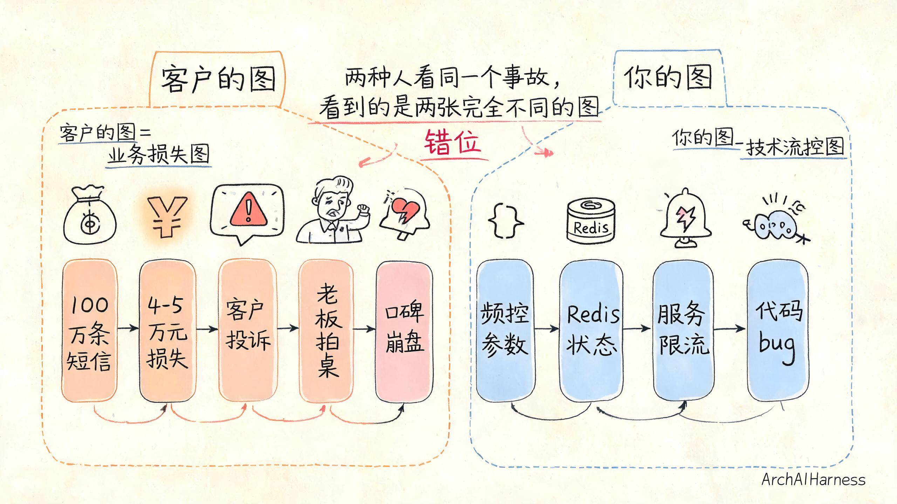
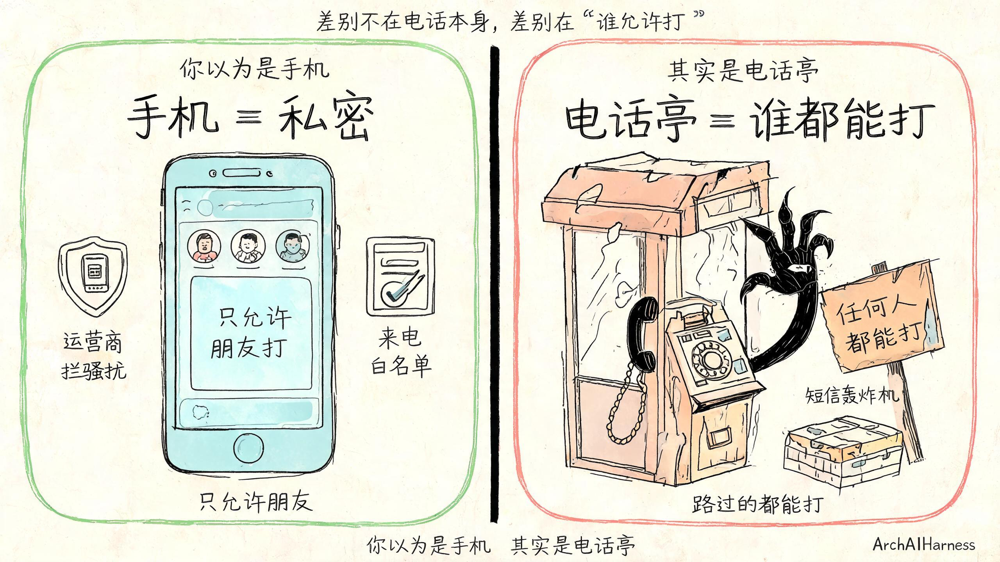
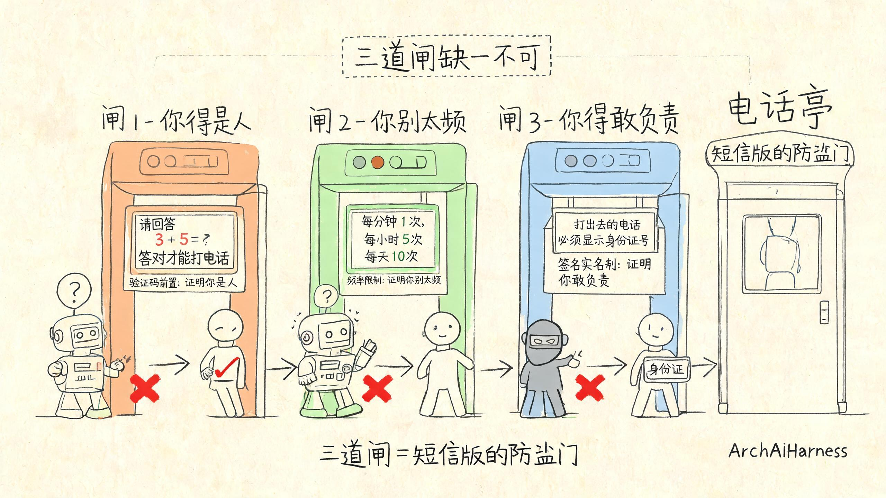
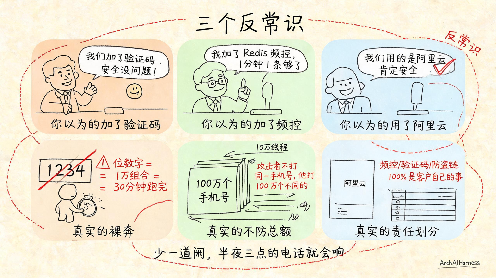
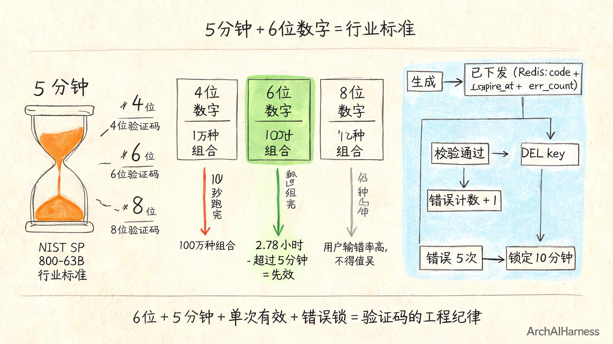

# 客户半夜打电话"我们 100 万条短信没了"——短信防刷不是技术活，是短信版的防盗门

凌晨三点，你的手机响了。

你迷迷糊糊接起来，对面是客户的运维总监，声音有点发颤：

> "兄弟，我们短信被打爆了。一晚上打出去 100 万条。你能不能看看怎么回事？"

你一骨碌坐起来。

打开后台一看，告警已经红了一片：单手机号 1 分钟被打 60 次、单租户 5 分钟被打 50 万次、短信账户余额亮红灯。

你心里第一个念头是："不可能啊，我代码里加了频率限制的。"

你又看一眼频控日志，愣了——**频控根本没生效**。

**问题出在哪？**

问题出在：**你加的频率限制，是给"正常用户"设计的；攻击者打的频率，根本不在你这个量级。**

你以为你的短信接口是手机——只允许朋友打。

其实你的短信接口是**露天的电话亭**——谁都能打，谁都能打到打爆。

这一篇我就跟你聊清楚：**短信接口为什么会被打爆、防刷为什么不是"加个验证码"那么简单、真正的短信防刷到底长什么样。**

下面我会用一个生活化的比喻——**电话亭**——带你把这事刻到脑子里。

---

## §一、客户问的"短信没了"和你问的"短信没了"不是一回事

先说一句扎心的——客户说"短信没了"和你说"短信没了"，根本不是一回事。

客户听到"短信没了"，他想的是：

> "我们的用户收不到验证码、收不到通知。客户正在投诉、老板正在骂人、营销活动正在砸钱。这一晚上过去，公司口碑要赔多少钱？"

他想的是**业务损失**。

你听到"短信没了"，你想的是：

> "频控是不是没配对？是不是短信服务商出了问题？是不是我的代码有 bug？是不是 Redis 挂了？"

你想的是**技术问题**。

这两种"短信没了"，差着十万八千里。

客户关心的是**赔钱**——一晚上 100 万条短信，按行价 4 分一条算，差不多是 **4 万到 4.5 万元**。这事摊到客户那，老板是要拍桌子的。

你关心的是**代码**——频控参数配错了、服务商限流了、Redis 没命中。技术问题有技术答案，调就完了。

为啥会差这么多？因为你们俩心里那两张"短信图"根本不是一张图。

**客户的图是一张"业务损失图"——短信被打 = 钱被打。**

**你的图是一张"技术流控图"——短信被刷 = 代码有 bug。**

你给客户讲技术流控图，他听不懂；客户给你讲业务损失图，你也不关心。

**两个人各画各的图，怎么聊都是错位。**

我给你打个生活里的比方，你一辈子忘不了。

**场景 A：你的手机。**

你的手机只允许朋友打。你存了朋友电话簿，未接陌生号你不回，响两声就挂。你被骚扰了，运营商会帮你拦一部分。

**场景 B：露天的电话亭。**

你家小区门口那个公用电话亭，谁都能打。不投币、不登记、不要身份证。半夜三点都能路过打电话。打给谁都行，打多少次都行。

这两件事的根本差别在哪儿？

**差别不在电话本身——打出去的都是电话。**

**差别在"谁允许打"——手机只允许朋友打，电话亭谁都能打。**

绝大多数客户的短信接口，本质上就是**露天的电话亭**。

工程师脑子里以为自己的接口是"手机"——加了频率限制、加了校验、只允许正常用户访问。

但在攻击者眼里，它就是**电话亭**——没有门槛、没有身份、没有次数限制，谁路过都能打。

为啥？因为短信接口天然是**开放接口**——任何人都能拿到一个手机号 + 一个 URL，POST 一下就发出去了。

攻击者有一堆工具，叫"短信轰炸机"——网上能下，免费。脚本一跑，一个晚上打你 100 万条，跟玩一样。

**你以为你做的是手机，其实是电话亭。**

更扎心的是——客户这种误解特别顽固。你跟他解释一次"我们加了频控"，他点头；下个季度他又被打爆一次。

为啥？因为他从来没用对那张图。你跟他解释再多，不如直接换一张他秒懂的图。

啥图？

---

## §二、短信防刷就是"给电话亭装三道闸"

那到底啥叫短信防刷？

一句话——**给电话亭装三道闸。**

啥叫电话亭装三道闸？去过火车站的安检吧？进去先验身份证，再过安检门，最后扫一遍包。每一道闸都拦住一类人，三道闸合起来才把"谁都能进"变成"只有合法乘客能进"。

短信防刷是一样的逻辑——任何一道闸缺了，都有人会测。

我用四个画面给你拆开讲，每个画面配一句金句，刻进脑子里。

**画面 1：第一道闸——验证码前置。**

想象电话亭前面立了一块电子屏，写着"请先回答一个数学题：3 + 5 等于几？答对才能打电话"。

这道闸干嘛的？**证明你是人，不是机器人**。

为啥要这道闸？因为绝大多数短信轰炸机是脚本——只会机械地 POST 请求，不会算数。让它先算一道题，9 成 9 的脚本就过不去。

短信场景里这道闸叫"图形验证码"或"滑动验证码"。极验、网易易盾、腾讯天御，都有现成的。

**没有这道闸，任何"加验证码"的短信接口，在攻击者眼里都是裸奔。**

**画面 2：第二道闸——频率限制。**

电话亭旁边挂了一块电子表，写着"同一手机号每分钟只能打 1 次，每小时 5 次，每天 10 次"。

这道闸干嘛的？**证明你别太频**。

为啥要这道闸？因为就算攻击者过了第一道闸，它也无法在短时间内打爆你。

阿里云对验证码短信的硬上限：**1 条/分钟、5 条/小时、10 条/天**——这是同一签名下、同一手机号的硬天花板。

注意，**这是阿里云给定的**——你再调代码也绕不过去。触发拦截后，**24 小时自动解除**。

工程实现也很简单——Redis 计数，第一条发出去就 +1，超过阈值就拒。Redis `INCR + EXPIRE` 两行命令搞定。

**画面 3：第三道闸——签名实名制。**

电话亭前面立了一块牌子，写着"打出去的电话号码必须显示你的身份证号（实名登记）"。

这道闸干嘛的？**证明你敢负责**。

为啥要这道闸？因为任何短信出去，运营商那头都要追溯——"这是谁发的、用了什么签名、走的是哪个模板"。**签名不规范 = 短信发不出去**。

工信部从 2016 年起就强制要求短信签名实名报备——**新业务预留至少 10 个工作日**完成报备（阿里云官方原文）。运营商审核平均要 5-7 个工作日，实际观测 7-10 个。

更狠的是：**已上线 APP 名、公众号/小程序名、电商平台店铺名——这些曾经能当签名的，2026 年起已不再被支持**。

也就是说——你的签名必须是"**企业全称**"或"**已注册商标名**"。中性词（"客服通知""客户您好"）审核直接打回。

**三道闸合起来 = 短信版的防盗门。**

第一道闸证明你是**人**，第二道闸证明你**别太频**，第三道闸证明你**敢负责**。

三道闸缺一不可——少一道，攻击者就有一类办法能进。

**少第一道闸**——脚本机器人能直接冲进来。

**少第二道闸**——哪怕是真人在操作，他也能一分钟打 60 条。

**少第三道闸**——签名不合规，短信发不出去，业务直接停摆；或者发了被运营商拉黑，全公司短信号废。

---

## §三、短信接口的三类风险——攻击者打什么

你心里可能在想：攻击者打短信，到底图啥？

**三类风险，按损失递增排序**：

**风险 1：短信轰炸——把你当群发器。**

攻击者最常见的玩法：随便找个能调到的短信接口，写个脚本，一晚上打你 100 万条。

他图啥？**给某个特定目标发垃圾短信**——比如他想让你某个客户的手机上收到 1 万条"您的验证码 123456"的短信。

为啥用你的接口？因为攻击者自己没有短信通道，他借你的"通道"发。

这种攻击对你**直接经济损失最大**——按 4 分一条算，100 万条 4 万到 4.5 万元一晚上。

> **短信防刷就是：你不发攻击者要发的，他就没法借你的通道。**

**风险 2：验证码暴力破解——把验证码跑出来。**

攻击者的进阶玩法：拿到你的注册/登录接口，不停试验证码。

如果你的验证码是**4 位数字**，**总共就 10000 种组合**——单线程跑，30 分钟就能跑完。

跑出来之后——他就能登录任意用户的账户、改绑手机、提现余额、刷优惠券。

这种攻击对你**次生损失最大**——客诉"账号被盗刷"、赔偿 + 公关 + 法务一起来。

> **短信防刷就是：验证码空间够大、过期够快、错误够多次就锁，让他跑不出来。**

**风险 3：短信费用盗刷——把你的额度刷光。**

攻击者最阴险的玩法：不打自己要的，就打你客户的手机号，把你客户的短信余额刷光。

为啥？因为很多 SaaS 系统的短信是**按余额扣费**——攻击者把你的余额刷到 0，你真正的客户就发不出验证码。

客户的老板不会怪攻击者，**会怪你**——"为什么你们的短信这么脆弱？"

这种攻击对你**客户信誉损失最大**——客户拒付、企业信誉受损、SLA 违约。

> **短信防刷就是：限制每个手机号能被打的次数，他刷光你一个客户的额度，刷不爆你整个平台。**

三类风险合起来，就是攻击者打你短信的全部动机。

你不一定一开始就被打中，但你**迟早会被打中**——网上有"短信轰炸机"工具，攻击者不需要懂代码、不需要 0day、只需要一个能调到的接口 URL。

**所以"被刷"是早晚的事，关键是工程架构能不能扛住。**

---

## §四、为什么大多数公司短信防刷做错了

我跟你聊几个反常识的事实，你可能看了会扎心。

**反常识 1："加了验证码就以为安全"。**

客户老板最爱说这句话："我们加了验证码，安全没问题。"

真的吗？

**4 位数字验证码 = 10000 种组合 = 单线程 30 分钟能跑完。**

哪怕加了图形验证码，如果验证码位数是 4 位、有效时间 30 分钟、错误次数无限——攻击者只要稍微绕一下图形验证码（OCR 识别、滑动轨迹伪造），就能在半小时内把 10000 种组合跑光。

**短信防刷的"加了验证码"，跟你以为的"加了验证码"，根本不是一回事。**

你以为的"加验证码"是——只要有这个功能就行。

真正的"加验证码"是——**6 位数字 + 5 分钟过期 + 单次有效 + 错误 5 次锁**。

少了任何一个，验证码就是裸奔。

**反常识 2："加了频率限制就以为安全"。**

客户工程师最爱说这句话："我代码里加了 Redis 频控，1 分钟 1 条够了吧？"

真的吗？

**1 分钟 1 条够吗？攻击者手里有 100 万个手机号。**

攻击者不打你的同一个手机号——他打**不同的手机号**。

按 1 分钟 1 条/手机号计算，他开 10 万线程打 100 万个手机号，**一晚上照样打你 100 万条**。

频控是必要的，但只防"同一手机号被打爆"——**不防"被打爆的总额"**。

要防总额，得加另一道闸：**单租户 5 分钟调用 > 阈值（基线 × 5）告警**。出了告警运维介入。

**反常识 3："用阿里云就以为安全"。**

客户老板最爱说这句话："我们短信是用阿里云的，阿里云肯定安全。"

真的吗？

**阿里云只防 DDoS，频控、验证码、签名——100% 是客户自己的事。**

阿里云《云通信短信服务安全白皮书 V1.0》白纸黑字地划分：

**阿里云负责的**：平台物理安全、DDoS 防护、三层过滤体系（实时规则拦截 + 人工审核 + 处罚中心）、RAM 多因素认证、ActionTrail 记录 OpenAPI 调用。

**客户负责的**：**频控、验证码、防盗链、风控、业务规则——这些 100% 是客户的职责**。

攻击者真把你的短信接口打爆了，**阿里云没有法律责任**——合同里写得清清楚楚。

任何"我们的短信被打了，阿里云有责任"的客户投诉，**需要法务 + 合同 + 白皮书共同应对**——这句话反过来讲就是：你没法靠阿里云。

**短信防刷不是"阿里云替你做"的事，是你自己工程上必须做对的事。**

---

## §五、验证码的"5 分钟过期"是行业标准

说到验证码的位数和过期时间，这是**最容易踩坑**的地方。

我用三句话帮你把这件事刻到脑子里。

**金句 1："验证码不是密码，密码可以长期用，验证码只能用一次。"**

密码是**长期凭证**——你设一次，可以一直用，丢了还能找回。

验证码是**一次性凭证**——你用一次，**立刻删掉**（Redis `DEL key`）。

校验通过就删，**绝不允许复用**。这是工程纪律，不是建议。

**金句 2："5 分钟不是拍脑袋定的，是 NIST SP 800-63B 行业标准。"**

美国 NIST 在《Digital Identity Guidelines》（SP 800-63B）里明确把 SMS 验证码定位为"带外设备验证器"——它需要独立通道传输敏感信息，并且必须**有合理过期时间**。

行业事实标准是 **5 分钟过期**——这个时间不是阿里云拍脑袋定的，也不是腾讯云拍脑袋定的，是 NIST 标准的工业落地。

国内主流云厂商（阿里云、腾讯云、容联）的默认模板都是 5 分钟。

**短信防刷就是：你跟标准对齐了，你的事故就少了。**

**金句 3："6 位数字 = 100 万组合 = 攻击者 30 分钟跑不完（如果限速了）。"**

为啥是 6 位，不是 4 位、不是 8 位？

**4 位数字 = 10000 种组合**：单线程 30 分钟跑完——等于不设防。

**6 位数字 = 1000000 种组合**：哪怕攻击者一秒试 100 次，也要跑 **2.78 小时**——超过 5 分钟过期时间，验证码已经失效。

**8 位数字 = 1 亿种组合**：用户输入成本陡升（手抖一下输错一位），得不偿失。

**6 位是安全 vs 易用的最优解**——这是行业经过多次事故沉淀下来的共识，不是某个具体厂商的规定。

**记住这三句话：**

- 验证码是**一次性**的，过期就**作废**。
- 5 分钟是**NIST 标准**，不是拍脑袋。
- 6 位是**安全 vs 易用的最优解**，不是越安全越好。

---

## §六、客户问"我短信被打了怎么办"——这是事故复盘

客户半夜打电话的最后一句永远是："现在怎么办？"

我给你三个字——**先复盘**。

事故复盘不是开会甩锅，是用**审计日志**回答三个问题：

**问题 1：谁打的？**

查**ActionTrail**（阿里云操作审计）——短信接口每条调用都有记录：手机号、IP、签名、模板、发送时间、状态码。

5 分钟内能查到——是哪个 IP 段打的、用的是哪个签名、走的是哪个模板。

**问题 2：能不能撤回？**

**5G 消息可撤回（5 分钟内）**——运营商支持。

**2G 时代不能撤回**——发了就发了，泼水难收。

所以 5G 是真香的——出事能补救。但你得用 5G。

**问题 3：损失了多少？**

短信 SDK 返回的回执告诉你：哪些发了、哪些没发、哪些被运营商拦截、哪些余额不足。

按单价乘以实际发送量，**5 分钟内能算出精确损失**。

**短信防刷的最后一道闸，不是代码，是审计。**

代码防的是"还没发生的攻击"，审计回答的是"已经发生的事故怎么复盘"。

**出事前**：频控 + 验证码 + 签名 = 三道闸。

**出事中**：ActionTrail 查 5 分钟内的请求记录 + RAM 子账号权限排查。

**出事后**：5G 消息撤回（如果来得及）+ 报警 + 应急通道 + 给客户写事故报告。

这就是完整的"半夜三点的电话"应该有的反应链路——

**不是先去查代码**，**是先去查日志**。

**不是先去甩锅给阿里云**，**是先告诉客户我们在做什么**。

**不是先去定责**，**是先止损**。

---

## 写在最后

回过头看开头那个凌晨三点的电话——客户说"我们 100 万条短信没了"，工程师说"我代码里加了频控啊"。

**这俩对话的人，脑子里那两张"短信图"完全不一样。**

客户脑子里是"业务损失图"——钱被打光了、口碑要赔了。

工程师脑子里是"代码问题图"——频控配错了、Redis 挂了。

你看完这一篇，应该能在脑子里换上第三张图——

**"电话亭三道闸图"。**

你的短信接口不是一个手机，是个**露天的电话亭**。谁都能打，谁都能打爆。

防刷不是"加个验证码"那么简单，是**给电话亭装三道闸**——

**验证码前置**证明你是**人**、**频率限制**证明你**别太频**、**签名实名制**证明你**敢负责**。

三道闸合起来，才是**短信版的防盗门**。

少一道，半夜三点的电话就会响。

我再敲一遍——

**短信防刷不是"加一个验证码"那么简单，是给电话亭装三道闸。**

**验证码前置证明你是人、频率限制证明你别太频、签名实名证明你敢负责——三道闸合起来才是短信版的防盗门。**

**下一次我们卷袖子，把"怎么装"这件事——Redis 滑动窗口、6 位数字 + 5 分钟过期、图形验证码前置、阿里云签名实名制、ActionTrail 审计——一步步拆给你看。**

---

### 关于 ArchAIHarness

这篇文章是「看懂 AI 与智能体」专栏的一部分，由 [**ArchAIHarness**](https://github.com/ArchAIHarness) 持续输出。

ArchAIHarness 是一套面向 AI 时代软件工程的人机协同架构哲学与公开工程资产，主张：

> **架构师定义秩序，AI 在秩序中生长。人立法，AI 执行，体系审计。**

短信防刷这套"电话亭三道闸"的核心，跟 ArchAIHarness 主张的"边界焊死、选择放开"是同一条线——**验证码/频控/签名/审计/责任共担，是 SaaS 工程上的硬边界**。把硬边界焊死，让产品在边界内自由跑，正是 `framework` 仓库与 `agent-workflows` 在做的事。

如果你也希望 AI 在明确的架构边界内协作，而不是在混沌中碰运气，欢迎到 GitHub 上看看我们在做什么：

- **组织主页**：[github.com/ArchAIHarness](https://github.com/ArchAIHarness) — 了解完整理念与资产全景
- **本专栏**：[`zhuanlan-ai-and-agents`](https://github.com/ArchAIHarness/zhuanlan-ai-and-agents) — 所有文章的源码与发布记录
- **实践指南**：[`docs`](https://github.com/ArchAIHarness/docs) — 架构哲学、工程方法和落地指南
- **开源工具**：[`agent-workflows`](https://github.com/ArchAIHarness/agent-workflows) — 可复用的 AI 协作 Agents、Skills 与 Tools
- **工程样例**：[`framework`](https://github.com/ArchAIHarness/framework) — DDD + AI 协作的工程底座，展示如何在开发中融合 AI

> Engineered by Architects · Empowered by AI · Audited by Discipline