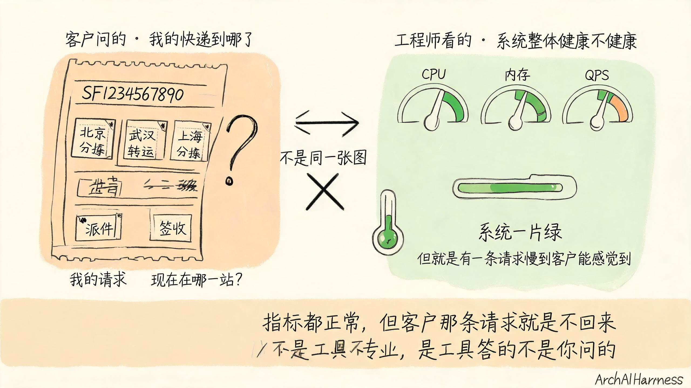
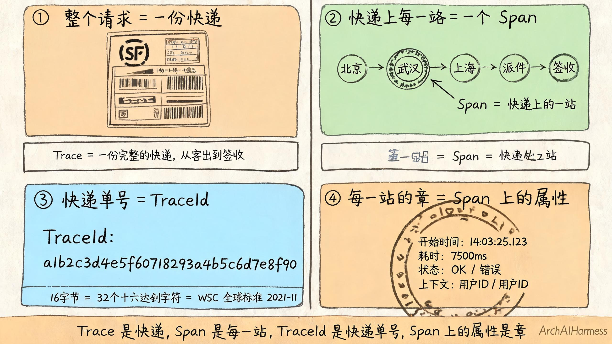
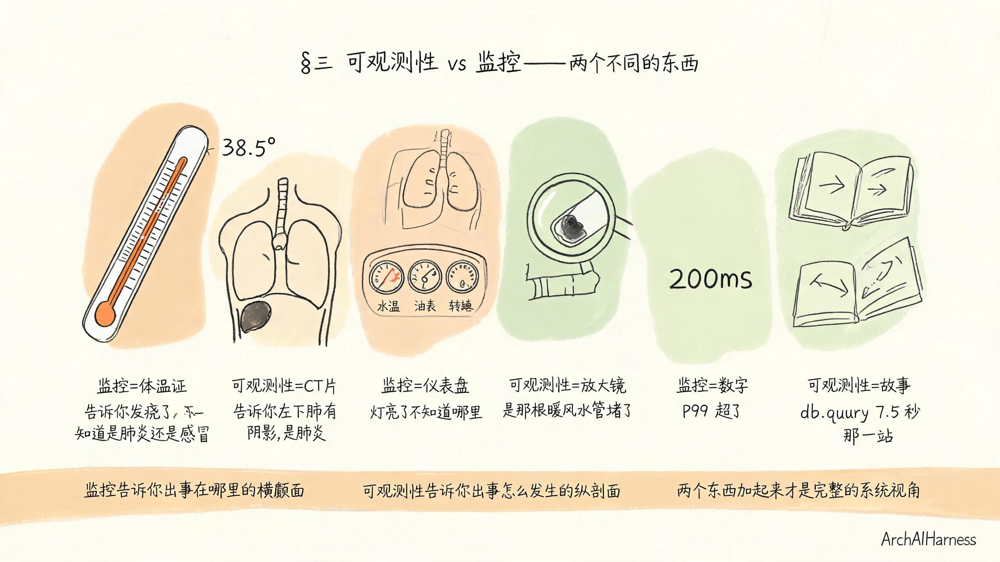
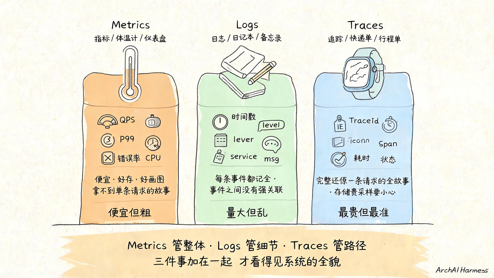
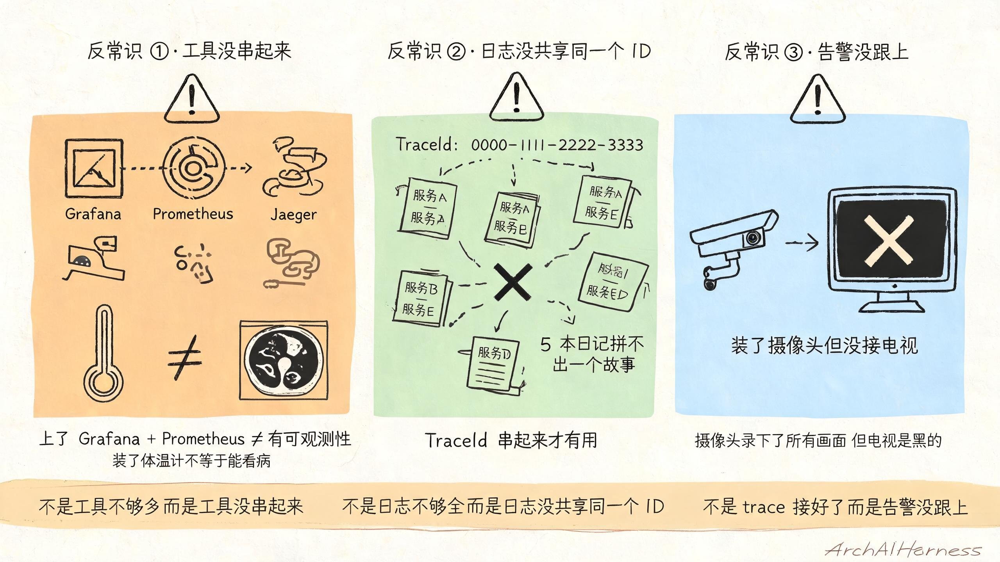

# 客户问"为什么这个请求这么慢"——可观测性不是给你看数字，而是给每个请求一封顺丰快递单

凌晨两点，你手机响了。客户老板又来了。

> "你们这个接口今天下午三点就开始慢了，到现在客户投诉不断。你们这边到底怎么回事？"

你赶紧爬起来，打开电脑。

第一件事，看仪表盘。QPS 2000、CPU 60%、内存 40%、磁盘 IO 没满、网络没拥塞——所有的数字都正常，都绿。

你心里咯噔一下：所有指标都没坏，但客户就是慢。

第二件事，看日志。翻了三十分钟的日志，没找到"这一条"具体慢的请求到底走了哪条路。日志全有，5 个微服务，5 种日志格式，但你不知道"这条慢的请求"对应的是哪几行。

第三件事，看告警。告警都是绿的，没响。

客户在催，老板在催，老板的老板的老板在催。

你开始怀疑人生——指标全绿、日志全在、告警全没响，但就是有一条请求真的慢，慢到客户能感觉到。

**问题出在哪？**

出在——**你只看了仪表盘，没看每一份快递到底走到了哪一站。**



这一篇不打算跟你聊"可观测性有什么组件、有哪些开源工具、Prometheus 怎么配"。

这种文章网上能搜到一万篇，没一篇能让一个被客户半夜叫醒的工程师真的睡个好觉。

这一篇只想说清楚一件事：**可观测性是干什么的。**

可观测性不是给你看数字。**可观测性是给每一个请求，发一张顺丰快递单。**

往下读，我把"为什么慢"这件事剥到底，让你一辈子忘不了。

## 一、客户问的"为什么慢"和你问的"为什么慢"不是一回事

我想让你先停下来，对照自己的日常工作，承认一件扎心的事——

**客户问的"为什么慢"和你问的"为什么慢"，根本不是同一件事。**

客户的"为什么慢"，是想知道——

> "我那个请求，到底卡在哪儿了？是哪一站？是 5 秒没动还是 30 秒没动？是数据库慢还是网络慢？"

客户的脑子里，画的是一张**"我的快递到哪了"的图**。他想看到的是他那张快递单——SF1234567890 现在到哪一站了，是到了分拣中心，还是在派件，还是卡在哪个转运中心。

你问的"为什么慢"，是想知道——

> "哪个服务的 P99 升高了？CPU 是不是打满了？数据库慢查询多不多？"

你的脑子里，画的是一张**"哪个分拣中心出了问题"的图**。你想看到的是整体系统的健康度，是平均温度，是总流量。

你俩心里那两张图，根本不是同一张。

所以客户问你"你那个接口为什么慢"，你只能告诉他"我们这边指标都正常"。

你的指标都正常，但客户的请求就是不回来。

为啥不回来？因为**指标告诉你的是"系统健康"，而客户想知道的不是"系统健康不健康"，而是"我那条请求还在不在路上"。**

这两个问题都重要，但工具不一样。没人能用体温计告诉你"今天我第 87 顿饭为什么没吃饱"。

我再打个比方，让你一辈子记得这件事。

**你是寄件的客户，你下午三点寄了一个顺丰快递。**

下午五点，你打客服："我的快递到哪了？"

客服说："我们分拣中心今天非常顺畅，平均处理时间 12 分钟，全国网络指标一片绿。"

你会怎么想？

你会想——"我没问你分拣中心顺不顺畅，我问的是**我的快递到哪了**。"

这就是你给客户看仪表盘时客户心里的 OS。

**不是客服不专业，而是客服答的不是你问的——你问的是"我的快递"，他答的是"系统健康"。监控也一样：监控答的不是你问的"这条请求还在不在路上"，而是"系统整体健康不健康"。**

那到底什么叫可观测性，怎么把"这条请求还在不在"这件事搞清楚？

## 二、可观测性就是"给每个请求发一张顺丰快递单"

我直接告诉你答案，简单到你一辈子忘不了——

**可观测性 = 给每一个请求发一张顺丰快递单。**

啥意思？我把它拆成四个画面，每一个画面配一句金句，刻进脑子里。



**画面 1：每个请求 = 一份快递。**

一个用户在你的 App 上点了一下"查订单"，这一次点击在系统里会变成一个请求。

这个请求穿过 API 网关、订单服务、库存服务、用户服务、数据库、缓存，最后拼出一份订单数据返回给用户。

请求完成之后，系统里什么都看不见——日志刷了几行、指标涨了一根曲线，仅此而已。

事故发生的时候，你打开后台翻日志，看到的只是"一堆日志"，不是"这一条请求走过的路径"。

可观测性的第一件事——**把每一次"用户的点击"翻译成一份快递**。从用户点下去的那一秒，到用户拿到结果的那一秒，这段时间里请求做的所有事，都串成一份快递。

这一份快递，行业里有个专门的名字——**Trace**。

**Trace = 一份完整的快递，从寄出到签收的全过程。**

**画面 2：快递上每一站 = 一个 Span。**

一份快递从北京寄到上海，会经过——北京分拣中心、武汉转运中心、上海分拣中心、派件员、签收。

每一站都做一件事，每一站都盖一个章。

一个请求从用户点下去到拿到数据，会经过——API 网关、订单服务（查订单 ID）、用户服务（查用户信息）、数据库（查订单表）、数据库（查商品表）、JSON 拼装、HTTP 返回。

每一站也做一件事，每一站也应该盖一个章。

**Span = 一份快递上的"一站"。**

Span 是 Trace 里最小的记录单位——一个 Span 记"我访问了什么服务、用了多长时间、出了什么错、有没有什么上下文"。

你打开后台，看到一条 Span 信息：

```
Span: db.query
服务：order-service
DB：mysql
SQL：SELECT * FROM order_items WHERE order_id = ?
耗时：7500ms
状态：OK
```

你就知道了——这一站是数据库查询，名字叫 db.query，花了 7.5 秒。

这就是快递上盖的那一个章——**章上写了"我这一站花了多久、是出错还是正常、干的是啥活"，而不是只盖个"已到"两个字**。

**画面 3：快递单号 = TraceId，整条快递全程一个号。**

你寄顺丰快递，客服给你一个单号——SF1234567890。

你打客服只要报这个单号，客服就告诉你这一份快递现在在哪一站。

请求也一样。从用户点下去到拿到数据，**这个请求的全程，必须用同一个编号贯穿**。

这个编号，行业里叫 TraceId，**16 字节、32 个十六进制字符**——这是 W3C 在 2021 年 11 月正式发布的全球标准。

举例：

```
TraceId：a1b2c3d4e5f60718293a4b5c6d7e8f90
```

这个 32 位的字符串从用户点下去那一刻就被打上，跟随请求走过 API 网关、订单服务、用户服务、数据库、缓存，一直到最后拼装返回。

**任何一个服务拿到这个 TraceId，都知道"哦，这是同一份快递"**。

这就像你寄出去的那份快递，无论经过北京、武汉、上海哪个分拣中心，每一站扫码都看到"SF1234567890"——它能告诉下游，"你是从我这一站中转过来的"。

**画面 4：每一站的章 = Span 上的时间戳、状态、错误。**

顺丰快递的章，不会只盖一个"已到"。它会盖——

- 到了武汉分拣中心，时间戳 11:23
- 武汉扫码出库，时间戳 11:25
- 上海分拣中心入库，时间戳 11:50
- 派件员张三接单，时间戳 13:15
- 签收成功，时间戳 14:02

一张快递单上盖满章，每一章记录"在什么时候、做了什么、状态是啥、出没出错"。

请求里每一站也一样——**每一个 Span 都自带一组属性**：开始时间、结束时间、花了多久、状态码、错误信息、有没有特殊标记（比如用户 ID、租户 ID、版本号）。

把四个画面叠在一起——

**Trace 是快递，Span 是快递上的每一站，TraceId 是快递单号，Span 上的属性是每一站盖的章。**

这就是可观测性的"请求侧"全貌。

**出事的时候你打开后台，看到这条 TraceId，把 5 个服务里所有带这个 TraceId 的 Span 拉出来一拼——从用户点下去到拿到结果的完整旅程，每一站花了多久、哪一站出错、哪一站最慢，全摆在你面前。**

这就是给每个请求发一张顺丰快递单的真正含义。

你不是看不到系统——你是看不到**这条具体的请求**在系统里到底经历了什么。可观测性让你看见那条具体的路径。

## 三、可观测性 vs 监控——两个不同的东西

讲到这里有人会冒出来反驳："我已经在用 Grafana + Prometheus 做监控了，CPU、内存、QPS、P99 全都有，你说的这不就是监控吗？"

不是。**可观测性不是监控的升级，而是监控的完全不同的那一层。**

我给你三对金句对比，一对比一对比地让你记住这两个东西不是一回事。

**第一对金句——"监控是体温计，可观测性是 CT 片"。**

你发烧了，去医院。

医生先让你量体温。体温计告诉你——**"你发烧了，38.5 度"**。

但医生光凭体温计，不知道你为啥发烧。是感冒？是肺炎？是吃坏肚子？

医生让你去做个 CT。CT 告诉你——**"你左下肺有一块阴影，是肺炎"**。

监控（Metrics）就是体温计——**它告诉你"系统有问题了"，但不知道是哪里、为什么。**

可观测性就是 CT 片——**不是用来替代体温计的，而是用来补充体温计够不到的那一层——哪里、为什么有问题，甚至告诉你"是哪一行代码、哪一站、哪个数据库慢查询"。**

体温计便宜，CT 片贵。但关键时刻，你不能只靠体温计。

**第二对金句——"监控是仪表盘，可观测性是放大镜"。**

你家车有个仪表盘。油表、转速表、水温表、速度表。

仪表盘告诉你——**"水温过高了，灯亮了"**。

但你打开引擎盖看一圈，才能发现——"哦，**那根暖风水管堵了**"。

监控就是车里的仪表盘。仪表盘亮灯，告诉你有地方出问题。

可观测性就是你打开引擎盖时手里那只放大镜。放大镜能让你看见——是哪根管堵了，是堵了什么，是要换还是能通。

**没仪表盘不行——你不亮灯就不知道车子出问题。**

**但光有仪表盘也不行——你看到灯亮了不知道是哪个管堵的。**

**第三对金句——"监控告诉你'指标超了'，可观测性告诉你'为什么超了'"。**

监控的核心是"数字超了"——CPU 80% 了、P99 超过 200ms 了、错误率超过 1% 了。

可观测性的核心是"为什么超了"——CPU 80% 是因为哪个线程、哪个函数、哪个数据库查询；P99 超过 200ms 是因为哪一站、哪个 Span、哪个 SQL。

**监控给你的是"出事在哪里"的横截面，可观测性给你的是"出事是怎么发生的"的纵剖面。**

把三对金句叠在一起，你记住三件事——

**监控是体温计 / 仪表盘 / 数字，告诉你"系统有事"。**

**可观测性是 CT 片 / 放大镜 / 故事，告诉你"系统哪里有事、为什么有事"。**

**不是监控没用，监控非常重要——告警靠监控、配 SLO 靠监控、定容量靠监控。**

**不是可观测性是监控的替代——可观测性是监控够不到的那一层。**

两个东西加起来，才是完整的系统视角。



## 四、可观测性三支柱——三个角度看同一件事

上一节把可观测性和监控拆开了，这一节把可观测性自己拆开。

可观测性不是"一个东西"，而是**三种东西的合体**。

行业内有个统一说法——**可观测性三支柱（Three Pillars of Observability）**：Metrics、Logs、Traces。

这三件事各有各的脾气、各有各的用处，不能用一个替代另一个。

我用一个生活化的比喻让你一辈子忘不了。

**你要搞清楚"你家小孩今天怎么样"，你得从三个角度看。**

**支柱一：Metrics（指标）—— 体温计 / 仪表盘。**

你每天早上给小孩量一次体温——36.5 度，正常。

你不用一直盯着小孩，只要每天量一次体温，就知道"今天大致健康"。

Metrics 就是体温计。

**它给你一个聚合的、能长期看的数字**——你的服务现在 QPS 多少、P99 多少、错误率多少、CPU 多少。

优点：**便宜、好存、好画图、好做 SLO、好配告警。**

缺点：**拿不到单条请求的故事。** 你知道"今天系统平均 P99 是 200ms"，但你不知道"那条慢的请求为什么是 8000ms"。

OpenTelemetry 官方明确说——"如果需要 100% 精度（比如按请求计费），Prometheus 不是好选择，因为采集的数据可能不够详细。"

**指标是体温计，便宜但粗。**

**支柱二：Logs（日志）—— 日记本 / 备忘录。**

小孩回家跟你讲了今天在学校做了啥："我上午上了数学课，中午吃了红烧肉，下午跟小明打了一架。"

你听完，知道了今天发生的事，但这些事是分散的、不成体系的——你得自己拼起来才能还原"今天小孩的完整剧情"。

Logs 就是日记本。

**它把每一条单独的事件记下来——"我在这一刻打了什么字、遇到了什么"。**

优点：**每条事件都记全了，能全文检索、能查 N 年前的具体一句话。**

缺点：**事件之间没有强关联。** 你知道"订单服务 14:03 出错了"，但不知道"这一条错误是哪条具体请求引发的"。

OpenTelemetry 官方明确说——"日志不足以追踪代码执行，因为通常缺少上下文信息（如被调用的位置），它们在与 trace/span 关联时更有用。"

**日志是日记本，量大但乱。**

**支柱三：Traces（追踪）—— 快递单 / 行程单。**

你给小孩装了一个带 GPS 的手表。

一整天下来，手表记录了小孩的完整行程——8:00 出门、8:10 到学校、12:00 出校门吃饭、13:30 回学校、16:00 放学。

你打开手机一看，小孩今天完整的路径、每个节点花了多长时间、每个节点停在哪，一目了然。

Traces 就是行程单。

**它把一次请求的完整路径串起来——从用户点下去到拿到数据，每一站都盖了章，每一章都有时间戳和状态。**

优点：**能完整还原一条请求的全故事、能定位"这一条具体的请求为什么慢"。**

缺点：**量大、存储贵、采样策略要小心。**

**追踪是行程单，最贵但最准。**

三个支柱叠在一起，你记住三件事——



**Metrics 是体温计，便宜但粗——告诉你"系统整体健康"和"指标超了"。**

**Logs 是日记本，量大但乱——告诉你"那一刻系统说了什么字"。**

**Traces 是行程单，最贵但最准——告诉你"这一条具体的请求怎么走过来的"。**

**不是有了 Metrics 就可以不要 Logs——温度正常了不等于没有症状。**

**不是有了 Logs 就可以不要 Traces——日记本里有错不等于看清整个故事。**

**不是有了 Traces 就可以不要 Metrics——定位到那一站不等于 SLO 没超。**

**三件事分工不同——体温计管整体、日记本管细节、行程单管路径。三件事加在一起，才看得见系统的全貌。**

## 五、为什么大多数公司做错了"可观测性"

讲到这里按理说大家都懂了——可观测性是三支柱 + TraceId 串起来。

但现实中你去任何一家互联网公司的工程师群里聊"可观测性"，90% 的回答是这样的：

> "我们上了 Grafana。"
>
> "我们接了 Prometheus。"
>
> "我们接了 Jaeger。"

好——他们做错的三种姿势，被我总结成三句反常识金句，句句扎心。

**反常识金句 1："上了 Grafana + Prometheus 不等于有可观测性。"**

很多团队花了一个季度，把 Grafana、Prometheus、Node Exporter 都装上，仪表盘画得漂漂亮亮。

然后呢？然后事故发生的时候，他们打开仪表盘，看着一片绿的 CPU/内存/QPS/P99，还是不知道"那条具体的请求卡在了哪里"。

为啥？因为他们装的只是**体温计**——体温计装得再多，你也不知道左下肺那块阴影在哪。

**不是工具不够多，而是工具没串起来。装了体温计不等于能看病。**

真正能看病的，是 CT 片（Traces）。

很多公司是——开了三次体检（CPU、内存、网络）、每次都正常，但就是没拍 CT。等真出事时他们才发现：他们的可观测性，从来没真正观测过。

**反常识金句 2："日志打全了不等于能定位。"**

另一个常见误区：觉得自己把日志打全就够了。

"我的服务出错的时候会打印'error: xxx'，这行字串起来不就能看出问题了吗？"

不行。

**5 个微服务的日志，怎么串起来？** 用时间戳？时间戳会重叠、时钟会漂移、并发会把时间戳彻底打乱。

**靠 IP？** 同一个用户的多次请求会从同一个 IP 出来，分不清是哪一条。

**靠 UserId？** 用户的多条并发请求会共享一个 UserId。

唯一能精确串起来 5 个服务日志的，是 TraceId。

**没有 TraceId 的日志再多，也只是 5 本各记各的日记——你想知道"今天我家小孩到底怎么过的"，得自己拼 5 本日记。**

工作量巨大，拼出来还错。

**打全日志不等于拼得出故事。**

**反常识金句 3："链路追踪接好了不一定用得上。"**

第三个误区更隐蔽——很多团队花了大力气接 OpenTelemetry 接 Jaeger 接 Zipkin，链路数据全采了，链路后端也搭起来了。

但是！**告警没接上。**

他们只在 trace 后端里配了几条"trace 报错就告警"——结果每次发布、每次健康检查、每次心跳都触发告警，真出事故的时候，告警风暴把值班工程师淹了。

更要命的是：**没有把 trace 上的关键指标回灌成 Metrics**——比如"订单创建接口 P99 延迟"、"关键接口 5xx 错误率"。

所以即便你接了 trace，告警还是只能靠 CPU/内存这些老指标。

事故来了——CPU 正常、内存正常、告警不响，你只能对着 trace 数据手工翻。

**不是 trace 没接好，而是告警没跟上。等于装了摄像头但没接电视。**

摄像头录下了所有画面，但电视是黑的。

事故发生后你想看录像，得等运维给你接电视。等电视接好，事故现场早就被人踩没了。

**接好 trace 不等于告警接得上。**

三个反常识金句叠在一起——

**不是工具不够多，而是工具没串起来。**

**不是日志不够全，而是日志没共享同一个 ID。**

**不是 trace 接好了，而是告警没跟上。**

把这三件事拆开来看，绝大多数公司的可观测性，实际的可观测性处于"半成品"或者"摆设"状态。

讲到这里顺嘴插一句——**这件事不是孤立的。**

之前我们聊过那个 SSO 审计日志系列——每一条登录跳转都要带一个 trace_id 字段，那个字段就是 W3C 标准那 32 字符。

我们还聊过上云系列——上云之后所有请求都进云原生节奏，K8s 上 5 个服务 1 个数据库 1 个缓存，请求路径更复杂，定位更难，没可观测性根本顶不住。

SSO 那套是"用什么字段"——可观测性这套是"用什么存"——两边用同一个 trace_id 串起来，审计日志能反查请求路径，trace 能反查登录跳转。

**所以这一篇不是新主题，而是前面那几个系列在排查那一环的延伸。** 没看过前面几篇的，回去补补；看过的，这一节往下读会更连贯。

但是你也别慌——这件事到底有没有一个能让你心里有底的"判断标准"？

有，且只有一个。

## 六、客户问"我出事时能多快定位"——这是可观测性唯一指标

讲到这里你应该有个问题想问——"你说这么多，公司到底要怎样才算真的做好了可观测性？装了几个工具算？接了几个后端算？画了几张仪表盘算？"

不算。

真正算的指标只有一个——**MTTR（Mean Time To Repair，平均修复时间）**。

啥叫 MTTR？就是从"事故发生"到"事故修复"中间花了多久。

客户凌晨三点打电话来投诉，你凌晨 3:05 接到告警，凌晨 3:30 修好事故——你的 MTTR 是 25 分钟。

MTTR 越短，可观测性越好。MTTR 越长，可观测性越差。

**可观测性做得好不好，不看工具多贵，看凌晨三点告警到你清醒定位要多久。**

为啥 MTTR 是唯一指标？因为它回答的问题就是你最关心的问题——"事故来了我能不能快速搞定"。

**MTTR 越短，意味着——**

**告警能命中真事故**（不是健康检查/不是发布、不是心跳）。

**定位能到具体一站**（不是 CPU 80%、不是内存 70%、是"db.query 这一站 7.5 秒"）。

**修复能拿到完整上下文**（TraceId 把所有日志、所有 Span、所有指标串起来）。

把这三件事各自拆开，你会看到"做好可观测性"和"装作可观测性"差在哪儿——

**特征一，告警这件事——真事故能命中、假警报别命中。** 装好的指标应该一上来就只盯用户能感知的入口（订单创建、登录、支付），只盯 5xx 错误，别动不动 CPU 超 90% 就叫。

**特征二，定位这件事——能从告警钻到那一站。** 接到"订单创建 P99 升到 8 秒"的告警，第一步看告警对应接口，第二步开 trace 后端按接口名过滤 P99 区间，第三步找出汇聚最多慢请求的那个 Span——常见的会是 db.query 这种 DB 调用、redis.get 这种缓存、http.client 这种出站请求。**每一种都对应一类根因，不用猜、不用猜到第三次。**

**特征三，修复这件事——能拿到那一次的完整上下文。** 拿到那一条 trace 之后，把它的 TraceId 复制到 Logs 后端，能看到那个 Span 在那个服务里打的每一行日志原文（前提是日志带了 trace_id 字段）。**Logs 是眼睛看到的细节，Traces 是手伸进去摸到的位置——两者用 TraceId 串起来，故事和位置都在你眼前。**

**特征四，复盘这件事——能找到那一次的复现路径。** 修好之后做复盘，你不需要问同事"那天你怎么做的"，trace 已经替你记下了所有 Span 的执行顺序、耗时分布、状态码。**你想给老板讲清楚"那天 25 分钟我们怎么定位的"，打开 trace 一边讲一边走，每一站都摆出来。**

四个特征叠在一起——**告警准、定位准、上下文准、复盘准**。

反过来说——如果你的可观测性装得很漂亮，但事故来了你还要花 4 小时翻日志、问同事、找版本，那就是没做好。

**没做好可观测性的本质，是把工具当成仪式，而不是当成手术刀。**

## 写在最后

可观测性这件事，不复杂。

你不需要懂 Prometheus、Grafana、Jaeger 怎么装、怎么配、怎么调优——那是工程师的事。

你只需要记住一件事——

**可观测性不是给你看数字，是给每个请求一封顺丰快递单。**

寄出的时候，盖一个章；每一站，盖一个章；签收的时候，盖一个章。

出事的时候，翻开那张单——就知道哪一站卡了。



下篇我们卷袖子干活——把"三支柱 + OpenTelemetry 怎么落"这件事，从 Metrics 体温计到 Traces 行程单，从采样率怎么不漏关键事故到告警怎么配才不疲劳，一步步拆给你看。

---

### 关于 ArchAIHarness

这篇文章是「看懂 AI 与智能体」专栏的一部分，由 [**ArchAIHarness**](https://github.com/ArchAIHarness) 持续输出。

ArchAIHarness 是一套面向 AI 时代软件工程的人机协同架构哲学与公开工程资产，主张：

> **架构师定义秩序，AI 在秩序中生长。人立法，AI 执行，体系审计。**

如果你也希望 AI 在明确的架构边界内协作，而不是在混沌中碰运气，欢迎到 GitHub 上看看我们在做什么：

- **组织主页**：[github.com/ArchAIHarness](https://github.com/ArchAIHarness) — 了解完整理念与资产全景
- **本专栏**：[`zhuanlan-ai-and-agents`](https://github.com/ArchAIHarness/zhuanlan-ai-and-agents) — 所有文章的源码与发布记录
- **实践指南**：[`docs`](https://github.com/ArchAIHarness/docs) — 架构哲学、工程方法和落地指南
- **开源工具**：[`agent-workflows`](https://github.com/ArchAIHarness/agent-workflows) — 可复用的 AI 协作 Agents、Skills 与 Tools
- **工程样例**：[`framework`](https://github.com/ArchAIHarness/framework) — DDD + AI 协作的工程底座，展示如何在开发中融合 AI

> Engineered by Architects · Empowered by AI · Audited by Discipline
