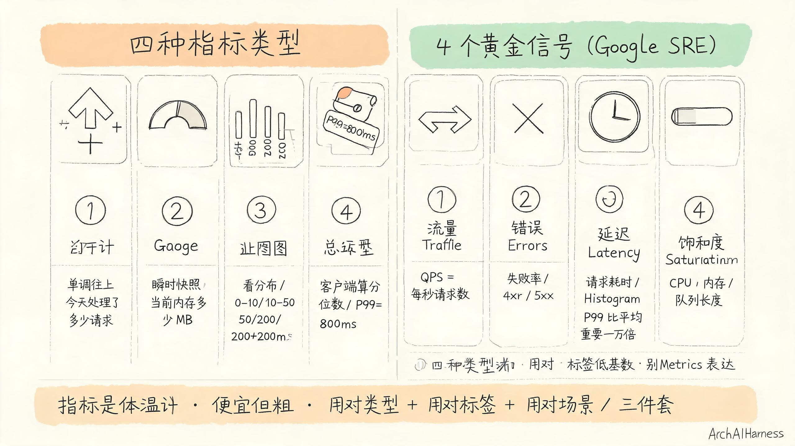
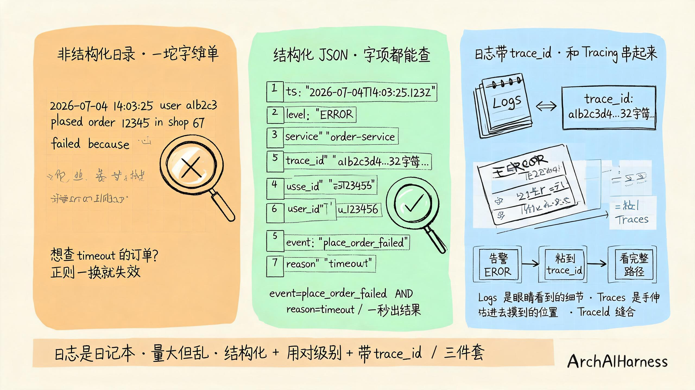
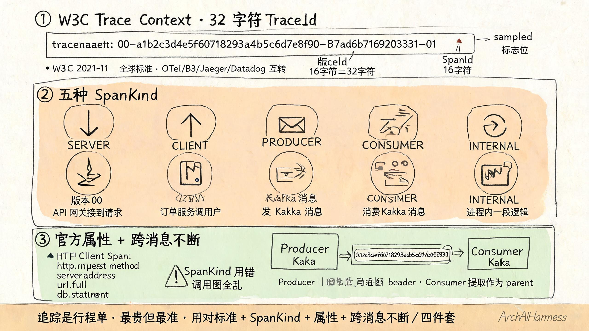
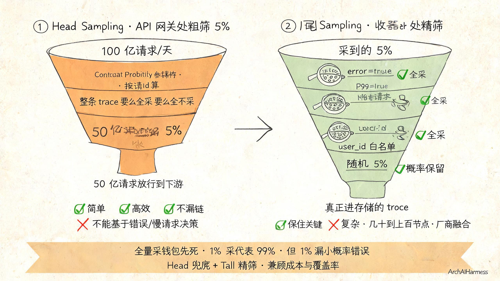
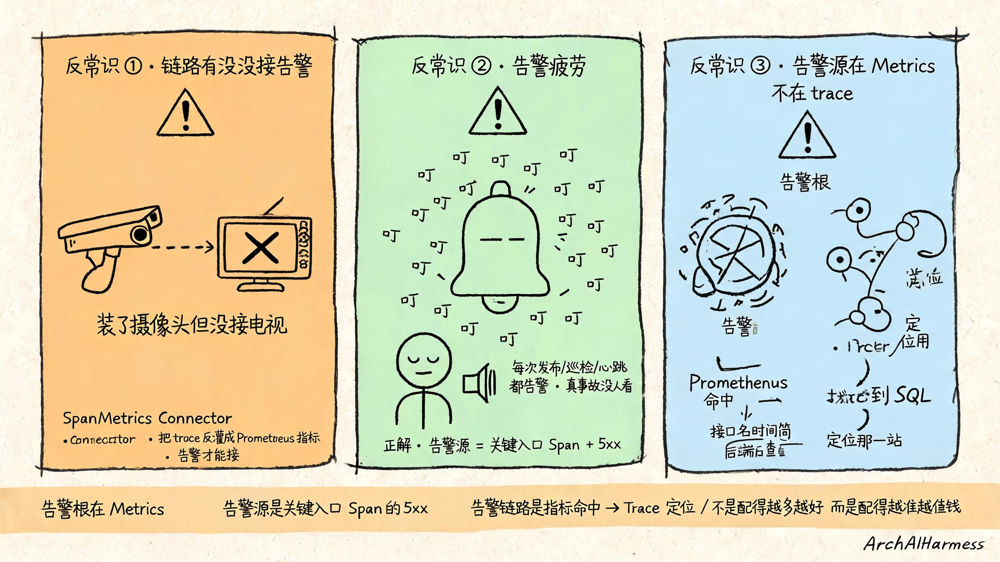

# 可观测性不是装个工具——三支柱 + OpenTelemetry，把每一站都装上监控

上面一节把可观测性的心智讲透了——给每个请求发一张顺丰快递单，从寄出到签收每一站都盖个章。

你大概看得很爽，但你脑子里一定还有一句话没说出来：

> "道理我都懂，落到工程上呢？"

这一节就是来干这事的。

**这一节不重复心智，只卷袖子干活。**

我会把可观测性拆成五道工程纪律，每道纪律对应一个具体的取舍、一个具体的反常识、一个具体的坑。

最后用一次"25 分钟定位到一行 SQL"的事故复盘把这五道纪律串起来，让你看一遍就忘不了。



开始之前，先把贯穿的比喻定死——

**整个可观测性就是顺丰快递公司的"运营系统"。**

Metrics 是 GPS 心跳——车在哪里、车速多少、车还活着吗。

Logs 是扫描记录——每一站扫码员扫了哪一票、打了什么字、出了什么事。

Traces 是完整行程单——这一票从北京寄到上海，每一站、每一秒、每一个章都串起来。

三件事是三个**不同的监控系统**，**各自有自己的用处、各自有自己的坑、各自有自己的纪律**。

五道纪律，一道一道来。

## 一、纪律一：Metrics 装体温计——体温计每个服务都有一根

第一道纪律是关于指标——Metrics。

上一节把 Metrics 比喻成体温计，体温计的纪律只有一条："**指标是体温计，便宜但粗。**"

为啥说便宜？因为 Metrics 就是一堆数字 + 标签（label），结构简单、好画图、好存、便宜。

为啥说粗？因为它只能告诉你"这一秒系统整体的体温"，不能告诉你"哪一条请求走的哪条路"。

但你不能因为它粗就不要它——**不是 Metrics 没用，而是 Metrics 够不到"具体哪一条请求"那一层。你不能光拍 CT 不量体温，那去医院就乱套了。**

怎么让 Metrics 真的发挥作用？我给你三个具体的纪律。

**纪律 1.1：四种指标类型搞明白，别混着用。**

行业里 Metrics 一共就四种：

- **Counter（计数器）—— 单调往上走的数。**
  比如"今天一共处理了多少请求"。这个数字只能加不能减，不会往下掉。

- **Gauge（瞬时值）—— 当前这一刻的快照。**
  比如"现在内存用了多少 MB"、"现在队列里有几条消息待处理"。这个数字随时变。

- **Histogram（直方图）—— 看分布的。**
  比如"过去一小时请求延迟有多少落在 0-10ms、多少落在 10-50ms、多少落在 50-200ms、多少落在 200ms 以上"。这是你最该用的——因为你需要知道"**到底是大部分请求快、少数请求慢，还是所有请求都慢**"。

- **Summary（摘要）—— 客户端算好的分位数。**
  比如"P99 = 800ms"。它和 Histogram 都能算分位数，区别是 Summary 在客户端算、Histogram 在服务端算。

四种类型你怎么用？有个标准建议叫**"4 个黄金信号"（4 Golden Signals）**——Google SRE 团队总结的，所有服务的 Metrics 都至少包含这四个：

> **流量（Traffic）** — 每秒请求数 QPS。
>
> **错误（Errors）** — 失败请求率（4xx/5xx）。
>
> **延迟（Latency）** — 请求耗时（用 Histogram，不是 Gauge，**P99 比平均值重要一万倍**）。
>
> **饱和度（Saturation）** — 服务有多"挤"，比如 CPU 利用率、内存使用率、队列长度。

把这四件事装上去，你就有了一根完整体温计。

**纪律 1.2：标签低基数原则——标签别打太多。**

指标不光有数字，还有标签（label）——比如 `service=order-service`、`region=us-east-1`、`http_status=200`。

标签让指标可以分组筛选——你想看"order 服务 us 区域 5xx 错误率"就 filter 这三个标签。

但有一个铁律——**标签的取值数量（基数）必须低**。

反例：

```
user_id=123456
request_id=abc-def-ghi
order_id=987654321
```

这种标签每个取值都不重复，标签基数可能上百万。时间序列数据库会被这种标签挤爆——它的内部数据结构是为低基数设计的，**基数一高就查不动**。

OpenTelemetry 官方在 Span 命名规范里说的话同样适用于 Metric——名字应当"a (statistically) interesting class of Spans"，**统计上有意义的类别，不是单个实例**。

好名字长这样：`get_account`、`http_request`、`db_query`。

坏名字长这样：`get_account_42`、`http_request_abc-def`、`db_query_987654321`。

**纪律 1.3：别什么都用 Metrics 表达。**

OpenTelemetry 官方有一句话非常清醒——"如果需要 100% 精度（比如按请求计费），Prometheus 不是好选择，因为采集的数据可能不够详细"。

啥意思？意思是——**Metrics 是聚合的，它故意丢精度换便宜**。

如果你要"按请求计费"，要"把每一条请求的金额都算清"，你不能光靠 Metrics——得用 Logs 或者 Traces 把每一条请求都记下来。

把三个纪律叠在一起——

**指标是体温计，便宜但粗；用对类型 + 用对标签 + 用对场景，三件套。**

## 二、纪律二：Logs 写日记——记下每一步但要会查

第二道纪律是关于日志——Logs。

上一节把 Logs 比喻成日记本。日记本的纪律只有一条："**日志是日记本，量大但乱。**"

为啥量大？每个服务、每个实例、每秒钟都可能在记日志。一个中型互联网公司一天能产生几 TB 日志。

为啥乱？因为每条日志之间没有强关联——除非你主动给它们串一个号。

怎么让 Logs 真的能帮你定位？三个具体的纪律。



**纪律 2.1：结构化日志，别再写人类自然语言。**

很多团队的日志长这样：

```
2026-07-04 14:03:25 user a1b2c3 placed order 12345 in shop 67 failed because timeout
```

工程师看着挺舒服。但你想用脚本查"今天下午所有 timeout 的订单有多少"——你怎么查？你得用正则把这一行里的"timeout"抠出来。但日志格式稍一变化（多了一个空格、换成了"timed out"、换了时区），你的正则就失效。

结构化日志长这样：

```json
{
  "ts": "2026-07-04T14:03:25.123Z",
  "level": "ERROR",
  "service": "order-service",
  "trace_id": "a1b2c3d4e5f60718293a4b5c6d7e8f90",
  "span_id": "b7ad6b7169203331",
  "user_id": "u_123456",
  "order_id": "o_987654321",
  "shop_id": "s_67",
  "event": "place_order_failed",
  "reason": "timeout",
  "duration_ms": 8250
}
```

每一条日志都有字段，每个字段都有名字，每个名字都能直接被查。

你想查"今天 timeout 的订单"？直接 `event=place_order_failed AND reason=timeout`。一秒出结果。

Loki、ELK、ClickHouse 这些专业日志系统都是按结构化字段建的，**你别给它们喂非结构化的字符串。**

**纪律 2.2：日志级别别乱用——INFO/DEBUG 才是日常。**

日志级别（log level）一共几种——DEBUG、INFO、WARN、ERROR、FATAL。

行业的纪律是：

- **DEBUG** — 调试用，写给开发人员看的细节。
  比如"这里用了 3 次连接池重试"。平时别开，事故排查时再开。

- **INFO** — 正常事件，记录"系统做了啥"。
  比如"订单创建成功"、"用户登录成功"。日常主要靠它。

- **WARN** — 警告但还能跑。
  比如"缓存没命中，慢了一倍"、"重试一次成功"。记下来但别告警。

- **ERROR** — 真出错，影响业务。
  比如"订单创建失败"、"支付失败"。**这种才是需要 SRE 看的**。

- **FATAL** — 致命错误，服务挂了。
  这种通常一出现就要 P0 告警，立刻拉人。

常见的反模式——把所有日志都打成 INFO 让 Dashboard 好看、要不就是把所有日志都打成 ERROR 让告警频繁。

ERROR 太多会污染告警——每一次告警都像狼来了，最后一次真狼来了 SRE 已经不信了。

**纪律 2.3：日志带 trace_id 字段——和 Tracing 串起来。**

这是上一节埋的钩子，也是这一节最关键的一刀。

**Logs 和 Traces 不是两个孤岛，它们必须用 TraceId 串起来。**

具体怎么串？

每一条日志都加 `trace_id` 字段（就是 Traces 里那个 32 字符串）。OpenTelemetry 标准属性是 `otelTraceID`，但很多团队把它简写成 `trace_id` 方便查。

这样你以后定位的时候——

- 从告警里看到一个 ERROR 日志 → 拿到 `trace_id=a1b2c3d4...`
- 把这个 TraceId 粘到 Traces 后端 → 看到这条请求在所有服务里的完整路径 + 每一站耗时
- 在 Traces 后端看到某个 Span 标了 ERROR → 找到对应的 `span_id`
- 把这个 span_id 粘到 Logs 后端 → 看到这个 Span 在那个服务里打印的所有日志原文

**不是 Logs 替代 Traces，也不是 Traces 替代 Logs——Logs 是眼睛看到的细节，Traces 是手伸进去摸到的位置，二者用 TraceId 缝合，就能让你"看见故事 + 摸到位置"。**

记得上一节第三段提到的——OpenTelemetry 官方明说"日志在与 trace/span 关联时更有用"。

把三个纪律叠在一起——

**日志是日记本，量大但乱；结构化 + 用对级别 + 带 trace_id，三件套。**

## 三、纪律三：Traces 发快递单——每一站都盖章

第三道纪律是关于追踪——Traces。

上一节已经把 Traces 的比喻铺开了——每一站盖一个章，全程一个快递单号。

这一节换比喻——**整个 Traces 系统就是顺丰快递的"扫描 + 调度 + 单号追踪"那套运营系统**。

三个具体的纪律。



**纪律 3.1：认死一个标准——W3C Trace Context，32 字符的 TraceId。**

Traces 这件事好几年都是各家自己玩——Jaeger 用自己的格式、Zipkin 用 B3 格式、OpenTracing 又一套格式，跨厂商追踪根本串不起来。

直到 2021 年 11 月 23 日——**W3C 正式发布 Trace Context 推荐标准**。

这个行业标准规定：

```
traceparent: 00-a1b2c3d4e5f60718293a4b5c6d7e8f90-b7ad6b7169203331-01
              |  TraceId(16字节=32字符)   SpanId(8字节=16字符)  | 标志位
              版本(00)
```

- **TraceId：16 字节 = 32 个十六进制字符**。这个数值在一整条请求里全程一个号，从用户点下去到拿到结果都带着。
- **SpanId：8 字节 = 16 个十六进制字符**。每次跨进程调用重写一次（parent-id 跟着变），标记"我这一站在哪"。
- **TraceFlags：8 位**。当前版本（`00`）只用了最低位的 `sampled`——告诉下游"我这一站要不要被采"。

这是全球统一标准，OpenTelemetry、B3（Zipkin 的协议）、Jaeger、Datadog 全都支持互转。

但有个**关键反常识金句**——

**TraceId 不是某家厂商自己的私有字段，而是 W3C 标准 32 字符——和上一节 SSO 审计日志里那个 trace_id 是同一个字段。**

你前面读完那个 SSO 系列章节——里面要求每条 SSO 跳转日志都带 `trace_id` 字段（32 字符 16 字节）。这件事和可观测性里的 TraceId 用的是同一个标准、同一个字段名。

这意味着——客户报障说"登录跳不过去"，你从 SSO 审计日志里抠出 TraceId，粘到 Tempo / Jaeger / Honeycomb 搜索框里，**可以直接看到这条请求在下游所有服务的完整 trace**。往下能看到数据库、缓存、MQ、下游 API 哪一站卡了。

反过来——在 trace 里看到某个 Span 标了 ERROR，回到 SSO 审计日志，用同一个 trace_id 拿到那次跳转的入站、出站、验证、合并、落地的全过程。

**不是 Audit 替代 Trace，也不是 Trace 替代 Audit——Logs 和 Traces 用同一个 TraceId 串起来，是这一整套可观测性体系最值钱的那条缝合线。**

**纪律 3.2：五种 SpanKind 各管各的——SERVER/CLIENT/PRODUCER/CONSUMER/INTERNAL。**

上面那张 trace 流程图里有五种 SpanKind，你得用对。

OpenTelemetry 官方定义：

- **SERVER** — 入站，处理别人发来的请求。  
  比如"API 网关接到客户端的请求"，"用户服务接到别的服务发来的 RPC"。

- **CLIENT** — 出站，发起请求给别的服务。  
  比如"订单服务调用用户服务"，"订单服务调用数据库"。

- **PRODUCER** — 异步消息的发送方。  
  比如"订单服务发一条 Kafka 消息"。

- **CONSUMER** — 异步消息的接收方。  
  比如"下游服务消费一条 Kafka 消息"。

- **INTERNAL** — 进程内部，不涉及任何跨服务通信。  
  比如"业务逻辑里的一段循环、一段缓存计算"。

用对 SpanKind 有什么用？

- 在 trace 后端里能区分"哪些是入口、哪些是出口、哪些是中间"。
- 能区分"一次调用是一次同步 RPC 还是一次异步消息"。
- 后端的可视化能正确显示树状结构——SERVER 在最上面，CLIENT 在下面调用 SERVER，PRODUCER 一边、CONSUMER 另一边。

**SpanKind 用错，trace 后端画出来的调用图全是乱的、根本看不出问题在哪。**

**纪律 3.3：HTTP/gRPC/DB 全部按官方属性集填——别自定义。**

OpenTelemetry 在 HTTP、gRPC、DB、Messaging 上都规定了**统一的 Span 属性**。

举几个必填例子：

- **HTTP Client Span**：`http.request.method`、`server.address`、`server.port`、`url.full`
- **HTTP Server Span**：`http.request.method`、`url.path`、`url.scheme`
- **DB Span**：`db.system`、`db.statement`

这些属性看着是技术细节，但**它们是后端存储的索引字段**。

如果你填了自定义属性 `sql_text=...`、不填官方要求的 `db.statement`，那你的 trace 后端根本不知道这是一条 SQL。

为啥？**因为 Tempo / Jaeger / Honeycomb 这些后端都是按官方属性建索引的。**

OpenTelemetry 自己说得很清楚——"任何不带这些约定的'私有 span 属性'都是 anti-pattern"。

**纪律 3.4：TraceId 跨消息别断——Kafka/RocketMQ 也得传。**

很多团队 trace 接得很好，HTTP 同步调用串得很完整。但一到 Kafka 这种异步消息就掉了链。

为啥？因为消息没有 HTTP header。

OpenTelemetry 在 messaging 语义约定里说得很明确——

> "Consumer traces cannot be directly correlated with producer traces if the message creation context is not attached and propagated with the message."

啥意思？意思是——**Producer 端必须把当前 SpanContext 注入到消息 header 里，Consumer 端从消息 header 提取出来作为 parent**。

如果这件事忘了做，整个 trace 在发消息那一步就从中间断了，下游消费就串不回来。

最典型的反常识金句——**"接好了同步调用不算接好了 trace，跨消息不断才是真的接好。"**

把四个纪律叠在一起——

**追踪是行程单，最贵但最准；用对标准 + 用对 SpanKind + 用对属性 + 跨消息不断，四件套。**

## 四、纪律四：采样率不是 100% 才安全

第四道纪律是关于采样——sampling。

你说——"道理我都懂，全采不就行了？"

不行。**全量采集，钱包先死。**

我给你算一笔账。

一个中型互联网公司，每天 100 亿次请求。如果每条请求都采完整 trace，平均每条 trace 包含 30 个 Span、每个 Span 平均 2 KB。

一天下来就是 100 亿 × 30 × 2 KB = 600 TB。

存储 600 TB trace 数据，按云厂商对象存储 0.02 美元/GB/月算，单月就是 600,000 × 0.02 = **1.2 万美元**。光存储这一项。

还没算网络、解析、后端算力。

**全量采集，钱包先死。**

那么采多少合适？OpenTelemetry 官方文档里直接给了答案——

> "For high-volume systems, it is quite common for a sampling rate of 1% or lower to very accurately represent the other 99% of data."

**1% 采样在统计意义上仍然是"代表样本"。**

啥意思？意思是——如果你的服务每秒有 10000 条请求，采 1% 就是每秒 100 条。这 100 条在统计上和全部 10000 条的趋势长得几乎一样。

但有个**关键反常识**——

**1% 采样能代表 99% 的健康请求，但 1% 之内发生的小概率错误会全漏。**

啥意思？意思是——如果你的错误率只有 0.1%，1% 采样意味着大约每 10000 次才有 0.1 条错误进入采样池——直接被丢光。

**FDE 第一年最常踩的"采样率 1% 但生产事故偏偏是那 1%"，就是这么来的。**

怎么办？

业内的事实标准姿势——**Head 粗筛 + Tail 精筛**。



**Head Sampling（头部采样）—— as early as possible 做决策。**

意思是在请求刚开始的地方——比如 API 网关——就决定"这一条采不采"。

最常见的做法：**Consistent Probability Sampling / Deterministic Sampling**——按 TraceId 与目标百分比算出来一个固定决策。

为啥按 TraceId 算？因为同一 TraceId 算出来的结果一致——**保证整条 trace 要么全采、要么全不采**，不会断链。

**优点**：简单、高效、低开销。

**缺点**：不能基于错误、慢请求、特殊属性做决策。

所以光有 Head 不够——

**Tail Sampling（尾部采样）—— 等所有 Span 到齐之后再做决策。**

意思是让所有 Span 在一个中间组件里汇齐，然后看"这条 trace 全貌如何"，决定采不采。

按这条 trace 全貌决定意味着什么——

**你可以说"采所有出错的 trace、所有 P99 慢请求的 trace、所有带特定 attr 的 trace"。**

**优点**：能基于错误率、延迟、特殊属性做决策——能保住关键 trace 不漏。

**缺点**：OpenTelemetry 官方明确指出三大劣势——

1. 实施复杂（策略要随系统演化）
2. 运维复杂（必须是有状态组件，可能需要几十到上百节点，资源利用率各不相同）
3. 厂商耦合（往往依赖 vendor 自家实现）

**OpenTelemetry Collector 的 tailsamplingprocessor 是社区事实标准实现。**

把两边加在一起——

**Head 兜底（保证不漏链、保证成本可控）+ Tail 精筛（保证关键 trace 不漏）。**

具体到一个生产配置长这样——

```
第一步：API 网关处 Head 采样 5%
（保证 95% 的请求不传到下游，省钱）

第二步：下游 Collector 处 Tail 精筛
（用 tailsamplingprocessor 保留以下 trace）
  - 所有标了 error 的 trace → 全采
  - 所有 P99 延迟的 trace → 全采  
  - 所有带特定 attr（如 user_id 白名单）的 trace → 全采
  - 其余的 → 5% 概率保留
```

最后真正进存储的 trace，是"采样到的 5%"中的"筛出的关键"。

**不是 100% 采，而是有讲究地采。**

OpenTelemetry 官方最后一个清醒的提醒——**当你每秒只有几十条 trace，完全不需要采样**。

这时候采样带来的间接工程成本（误删关键 trace）反而高于存储成本。

**别为了装酷硬上采样，小流量全采、大流量分层采，这是工程取舍。**

把四道纪律叠在一起——

**全量采钱包先死，1% 采足矣代表 99%，但 1% 漏小概率错误；Head 兜底 + Tail 精筛，是兼顾成本与覆盖率的事实标准姿势。**

## 五、纪律五：告警配错等于没配

第五道纪律也是最容易被忽视的——告警（alerting）。

很多团队的可观测性做到了 80%——Metrics 全采、Logs 写全、Traces 接好、采样也配上了。

但是事故发生的时候，告警没响，或者告警风暴把值班淹了。

为啥？因为最后一道纪律——**告警配错了**。

具体三件事。



**反常识金句 1："链路有了但没接告警 = 装摄像头但不接电视。"**

很多团队 trace 后端搭得漂漂亮亮，事故来了一翻 trace 啥都有。

但是他们的告警还是只能配老指标——CPU、内存、QPS、P99。

为啥？因为——

**告警的根源不是 Trace，而是 Metrics。**

Trace 是用来"定位"的，不是用来"告警"的。

为啥？因为 trace 是"事后定位"用的数据，它的查询延迟通常以秒计——足够你事后翻，但不够你实时告警。

告警要秒级响应，靠的是已经聚合好的时间序列库——Prometheus、VictoriaMetrics 这些。

**怎么让 trace 数据接上告警？** 一句话——用 **SpanMetrics Connector**。

它做的事是——把 trace 后端接到的数据反向转成 Prometheus 指标——比如"这个 Span 名字的调用次数、P99 延迟、错误率"，然后灌进 Prometheus，告警就能配了。

**链路接好了但告警没接 = 装摄像头但不接电视。摄像头有，但电视是黑的。**

**反常识金句 2："每次发布都告警、每次事故都不告警 = 告警疲劳。"**

另一种错配——把所有 Span 一报错就告警。

结果每次发布（健康检查、就绪探针、心跳一报错）、每次定时任务（数据库巡检、缓存清理）都会触发告警。

告警风暴一晚上响 200 次。值班工程师第 3 次开始不看，第 50 次开始静音，第 100 次开始卸钉钉。

等真事故来了，告警混在噪音里没人看见。

**正解——告警源 = 关键入口 Span + 5xx 错误码。**

啥意思？意思是——

**告警不配在"系统的每一个动作"上，而是配在"用户能感知到的业务入口"上。**

比如"订单创建"、"登录"、"支付"——这些是关键入口。它们的 5xx 错误一升高就告警。

而"健康检查"、"定期巡检"、"心跳"——这些不该进告警源。出错就让它错，最多加点 metric 自查。

**告警不是配得越多越好，而是配在"用户能感知的入口的 5xx"上，告警才是信号。**

**反常识金句 3："告警配在指标上不是配置在 trace 上。"**

很多工程师一来就直接在 trace 后端里配告警——结果发现 trace 后端告警延迟几秒、规则支持很少、配起来还复杂。

正解——**告警源接在 Metrics（Prometheus / Alertmanager）上，Traces 只是当告警命中后你去 trace 后端查"那条请求具体走了哪一站"的入口**。

具体工作流——

```
Prometheus 告警命中 → 拿到告警对应的接口名 + 时间窗
  → 打开 trace 后端 → 按接口名过滤 → 找到这一时段内的所有 trace
  → 按 P99 排序 → 看到最慢的那条 trace
  → 进 trace 看每个 Span 的耗时
  → 定位到 db.query 这一站 / Span 上的 db.statement 属性
  → 找到那行慢 SQL
```

**告警配得对 = 用户能感知的入口出 5xx 告警 → 查到那条 trace → 定位到那一站。**

把三件事叠在一起——

**告警根在 Metrics、告警源是关键入口 Span 的 5xx、告警链路是"指标命中 → Trace 定位"。**

**不是告警配得越多越好，而是告警配得越准越值钱。**

## 六、把五道纪律串起来——25 分钟定位到一行 SQL

五道纪律全讲了，但你不一定信真能落地。

我用一次真实的事故复盘把五件事串起来——**25 分钟定位到一行慢 SQL**。

事故时间线：

- **T+00:00** 业务告警：订单创建接口的 P99 延迟从 200ms 升到 8 秒。
- **T+00:02** On-call 工程师接到告警，从 Grafana 看 Metrics：CPU/内存/网络都正常，QPS 没变。
  → 第一道纪律起作用：**告警源配在关键入口 Span（P99 延迟），不是配在 CPU/内存**。
- **T+00:05** 打开 trace 后端，按"订单创建"标签过滤 P99 区间，看到所有慢请求都汇聚到一个 DB 调用 Span：`db.query: SELECT * FROM order_items WHERE order_id = ?`
  → 第三道纪律起作用：**TraceId 是 W3C 标准 32 字符、用对 SpanKind、用对 db.statement 属性**。
- **T+00:08** Span 上的 `db.statement` 属性显示这个查询；SpanMetrics 指标转出来显示这个 Span 的 P99 从 50ms 升到 7.5 秒。
  → 第一 + 第三道纪律起作用：**SpanMetrics 把 trace 转回指标，能定位是哪个 Span 出问题**。
- **T+00:12** 同事在群里说"昨天给 order_items 加了个新索引，但今天早上又回滚了"。
  → 第二道纪律起作用：**Logs 带 trace_id，能在群消息里反查完整上下文**。
- **T+00:15** 翻 git log，确认回滚 SQL 漏掉了 drop index 步骤，导致查询走全表扫描。
  → 第五道纪律起作用：**告警命中后翻 trace，能拿到这条 SQL**。
- **T+00:25** 手动补 drop index，告警恢复。
- **全程 25 分钟 = 5 分钟看告警 + 5 分钟看 Metrics + 10 分钟看 Trace + 5 分钟看 SQL**

25 分钟定位到一行 SQL。

**没有 Trace，至少要 1 小时（翻 5 个服务的日志）。**

**没有告警，至少要半小时（等用户投诉）。**

**没有 Metrics 入口，至少要 2 小时（从用户反馈倒推）。**

**关键能力 = Tail Sampling 保留了错误 / P99 的 trace + Head 兜底保证不漏链 + SpanMetrics 把 trace 反灌成指标接告警。**

这三件事就是这一节第四道纪律的实战应用。

把整套串起来——

**Metrics 拿数字 → 告警源配在关键入口 → 告警命中 → Trace 定位那一站 → Logs 拿现场上下文 → 找到那行 SQL。**

**五道纪律不是 5 个孤立的事，而是一个连贯的"手术流程"。**

## 写在最后

讲到这里，五道纪律讲完了，事故复盘也讲完了。

我猜你可能还在想一件事——"那我今天回去要怎么开始？"

别贪全。我的建议：

**先把告警接上。** 告警是最容易出事故那一环——其他几件事慢慢搞，告警先保证真事故能响。

然后把 Traces 接上——用 OpenTelemetry 这一套标准，**TraceId 选 W3C 那 32 字符**，跨服务跨消息全程带着。

然后给日志加上 trace_id 字段——Logs 能和 Traces 互查。

然后上采样——Head 兜底 + Tail 精筛，保护钱包，保护关键 trace。

然后配告警——**告警源放在关键入口 Span 的 5xx、用户能感知的接口上**。

每件事花一两周，五件事做完基本就齐了。

可观测性这东西，**不是装个工具，而是给每一站都装上监控。**

> 体温计装得多但找不到病灶——Metrics 没接 Traces。
>
> 日记写得勤但拼不成故事——Logs 没带 trace_id。
>
> 行程单盖得全但没人看——Traces 没接告警。

**三件事没串起来，再贵的工具也救不了凌晨三点。**

凌晨三点来电话的不是指标不是日志也不是追踪——是三件事没串起来的那一刀。**那一刀叫"告警"。**

可观测性不是装个工具——它是一套**完整的临床流程**。量体温、看日记、拍 CT、看 X 光、接监护仪，每一步都有它的位置。**不是体温计替代 CT，也不是 CT 替代 X 光，更不是 X 光替代监护仪——每一步都不能省，每一步都不能替代另一步。**

什么叫做好了可观测性？

**不是装了多少钱的工具，而是出事故时从告警到定位到修复，够不够快。**

那句老话——"**可观测性做得好不好，不看工具多贵，看凌晨三点告警到你清醒定位要多久**"。

---

### 关于 ArchAIHarness

这篇文章是「看懂 AI 与智能体」专栏的一部分，由 [**ArchAIHarness**](https://github.com/ArchAIHarness) 持续输出。

ArchAIHarness 是一套面向 AI 时代软件工程的人机协同架构哲学与公开工程资产，主张：

> **架构师定义秩序，AI 在秩序中生长。人立法，AI 执行，体系审计。**

如果你也希望 AI 在明确的架构边界内协作，而不是在混沌中碰运气，欢迎到 GitHub 上看看我们在做什么：

- **组织主页**：[github.com/ArchAIHarness](https://github.com/ArchAIHarness) — 了解完整理念与资产全景
- **本专栏**：[`zhuanlan-ai-and-agents`](https://github.com/ArchAIHarness/zhuanlan-ai-and-agents) — 所有文章的源码与发布记录
- **实践指南**：[`docs`](https://github.com/ArchAIHarness/docs) — 架构哲学、工程方法和落地指南
- **开源工具**：[`agent-workflows`](https://github.com/ArchAIHarness/agent-workflows) — 可复用的 AI 协作 Agents、Skills 与 Tools
- **工程样例**：[`framework`](https://github.com/ArchAIHarness/framework) — DDD + AI 协作的工程底座，展示如何在开发中融合 AI

> Engineered by Architects · Empowered by AI · Audited by Discipline
