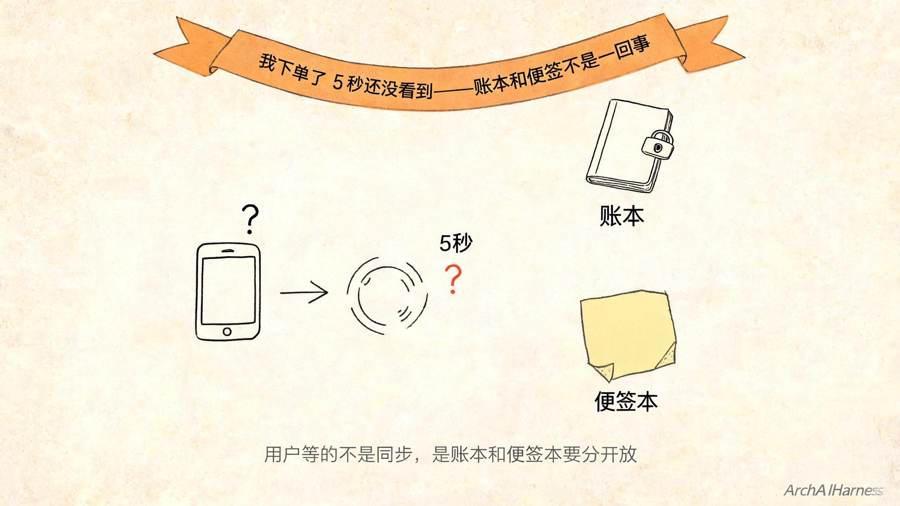
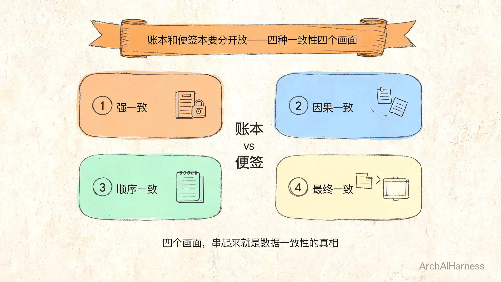
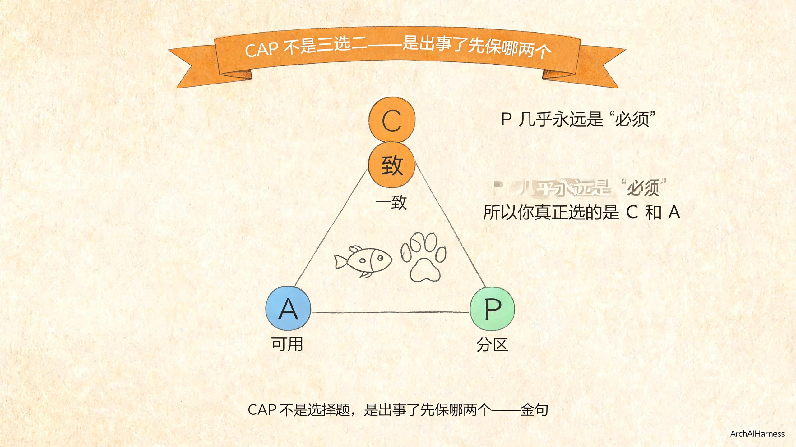
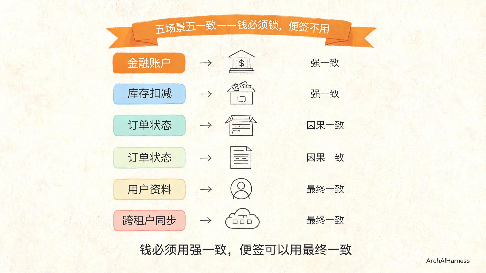
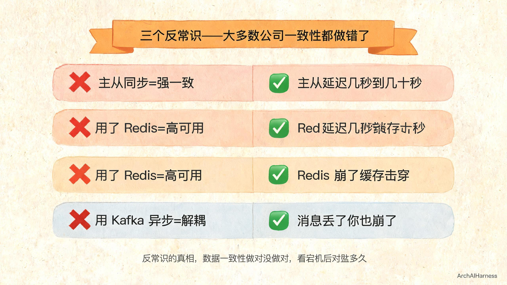

# 客户说"我下单了 5 秒还没看到"——数据一致性不是"同步一下"那么简单

> 账本要锁，便签本不用锁

你正在办公室喝水，运营同事冲进来喊你：

> "客户投诉！刚下的单子 5 秒还没看到订单详情页。你这边不是写着'同步'的吗？怎么不快？"

你放下水杯，打开后台瞄一眼。

代码里清清楚楚写着 `insertOrder` 同步落库，主库一条返回成功再返回给前端。

同步了啊。

但客户的"同步"和你的"同步"，根本不是同一件事。

你写的"同步"是——这一行 SQL 写进数据库，立刻告诉你成功。

客户理解的"同步"是——我点完"提交订单"，立刻在"我的订单"页面看到这条新订单。

**问题出在哪？**

出在——你说的"同步"是**数据库内部的同步**，客户说的"同步"是**用户能看到的同步**。中间隔着缓存、副库、查询路由、页面刷新策略……这一串环节里每一个都有"延迟"，每一个都可能在用户眼里"看不到"。

这一篇不打算跟你聊"什么是事务、什么是 ACID、什么是分布式系统"——这种文章网上能搜到一万篇。

这一篇只想把一件事刻到你脑子里：**数据一致性不是你写的"同步一下"那么简单，是要把账本和便签本分开放、把强一致和最终一致分场景、把 CAP 选对。**

往下读，我把这件最容易让人翻车的事，一层层剥给你看。

你不是写不出"同步一下"——你是没想清楚"同步"到底是给谁看的，不是给数据库看的，而是给用户看的。

## 一、客户问的"看不到"和你问的"看不到"不是一回事

我想让你先停下来，对照自己的日常工作，承认一件扎心的事——

**客户问的"看不到"和你问的"看不到"，根本不是同一件事。**

客户的"看不到"，是想知道——

> "我刚下的单，立刻能在'我的订单'里看到。5 秒看不到，用户就走，去别家下单了。"

客户的脑子里，画的是一张**"我的订单现在到哪儿"的图**。他想看到的是他那张订单——订单号 `OD20260704001`，下单时间 `14:23:15`，商品、金额、地址，全部齐整地立在他眼前。

你问的"看不到"，是想知道——

> "主库写入成功了没？主从同步延迟多少？Redis 缓存有没有失效？查询走的是主还是从？索引命中没命中？分页有没有把这条新数据过滤掉？"

你的脑子里，画的是一张**"数据复制链路"的图**。你想看到的是写入路径、复制路径、查询路径，每一段花了多久、卡没卡住。

你俩心里那两张图，根本不是同一张。

所以客户问你"我下单了怎么还看不到"，你只能告诉他"数据库这边写入成功"。

你的数据库写入成功，但客户的"我的订单"就是不显示。

为啥不显示？因为**你答的是"数据写到主库了没"，客户问的是"我这条订单在我的页面上是不是能看见"**。

这两个问题都重要，但工具不一样。没人能用体温计告诉你"今天我第 87 顿饭为什么没吃饱"。

我再打个比方，让你一辈子记得这件事。

**你去银行存了一笔钱。**

办完业务，柜员递给你一张回单，上面盖了红章，写着"存款成功，金额 10000 元"。

你问柜员："我回家在手机银行里能立刻看到吗？"

柜员说："我们这边都成功了啊，主账本已经记上了。"

你会怎么想？

你会想——"我没问你主账本记没记上，我问的是**我回家打开手机能不能看到**。"

你回到家，打开手机银行，余额显示——还是上个月的数。差 1 万。

你是不是立刻打 95566 投诉？

**你打投诉电话时说的不是"你们主账本记错了"，你说的是"我的 1 万块钱呢？"**

这就是你给客户拍胸脯"主库同步成功"时客户心里的 OS。

**不是柜员不专业，而是柜员答的不是你问的——你问的是"我的钱在我这儿能不能看到"，他答的是"钱在银行的账上记没记上"。数据一致性也一样：你的"同步成功"答的是"数据库这边写入成功"，客户问的是"我这条订单在我的页面上是不是立刻能看到"。**

再打个比方，让你彻底记住。

**你给孩子在幼儿园办入园。**

入园手续齐了——户口本、出生证、疫苗本、父母身份证，老师收齐了，在入园登记表上写了孩子的名字，盖了章。

老师告诉你："入园手续齐了，已经登记。"

你问："孩子明天能来上幼儿园吗？"

老师说："我们这边都登记好了。"

你心里想："我没问你登没登记，我问的是**明天早上 8 点我把孩子送过去，他能不能进去**。"

万一明天送去——保安说"系统里没这孩子"。

你会怪老师还是怪保安？

你怪的是"办入园这件事从头到尾"——不管你登记得多齐整，只要孩子明天进不去，就是"入园这件事没办成"。

**数据一致性的本质就是这个——客户不关心你的"系统内部状态"，客户关心的是"他能不能立刻看到他要的东西"。**

你的代码写成"数据库同步成功"不代表客户能立刻看到。

你的代码写成"Redis 缓存 1 秒失效"不代表客户能立刻看到。

你的代码写成"主从延迟 50 毫秒"——客户可能真的 5 秒看不到（因为前端轮询每 5 秒一次）。

**数据库内部的一致性是一回事；用户看到的一致性是另一回事；中间的距离叫做"延迟"，延迟的容忍度叫做"一致性等级"。**

把这件事刻进脑子里——一致性不是数据库的事，是**用户感知**的事。

你可能还会反驳——"那我把所有路径都优化到 0 延迟不就行了？"

不行。

**0 延迟 = 0 副本 = 单点 = 一挂就全挂。**

你为了"用户立刻看到"，把所有数据放一台机器、所有请求打一台机器——机器一崩，全完。

分布式系统的本质就是**多副本 + 副本之间有延迟**。

你要的是——**多副本 + 延迟可接受 + 出事能恢复**。

一致性等级就是在"延迟多长"、"副本几个"、"出事多快"之间做取舍。

**取舍不等于妥协——取舍是把对的资源用在对的地方——钱（账本）用强一致，闲事（便签）用最终一致。**

把这件事刻进脑子里——一致性不是数据库的事，是**用户感知**的事；一致性等级也不是拍脑袋选的，是按数据重要性分的。

那到底什么叫数据一致性，怎么把"用户能看到"和"数据库能查到"这两件事的关系搞清楚？

往下。

## 二、数据一致性就是"账本和便签本要分开放"

我直接告诉你答案，简单到你一辈子忘不了——

**数据一致性 = 你的钱应该记在哪本账上。**

啥意思？我把它拆成四个画面，每一个画面配一句金句，刻进脑子里。

**画面 1：强一致 = 账本。**

你去银行存 1000 块、提 1000 块、转账 1000 块。

每一笔，银行都得在那个金库里的大账本上**立刻记下来**。

你这边刚按下"确认"，全球任何一家银行网点立刻能查到——你这张卡上少了 1000 块，对方那张卡上多了 1000 块。

**强一致 = 账本 = 记下来就立刻到处能查。**

这件事**绝对不能容忍延迟**，因为延迟一秒就是钱可能错配、可能就是两个人的钱记反了。

想象一下——你去 ATM 取 1000 块，ATM 告诉你"成功"。但账户实际只扣了 800 块。你立刻再去另一台 ATM 取 1000 块——账户还有 200 块可以扣，但 ATM 告诉你"账户余额不足"。你是不是立刻报警？

这就是"账本记错"的恐怖。

**所以账本记的是钱——每记一笔，全球立刻能查——这就是强一致。**

**画面 2：最终一致 = 便签本。**

你在朋友圈给同事点赞。

你点完"赞"，手机立刻显示这个赞亮起来了。

但你同事那边——可能要等几秒、十几秒、可能几十秒——才看到那个赞。

为啥？

因为点赞这种数据，**不需要立刻让全世界同步**。你点完赞，系统先把赞写在你的便签本上，过一会儿再统一贴到朋友圈那个共享白板上。

**最终一致 = 便签本 = 我先记在我这儿，晚点再贴出去。**

你会不会等这十几秒？绝对不会。你甚至不知道这件事发生过。

你打开朋友圈，同事的赞已经亮在那里——你完全没意识到"它晚到了几秒"。

但如果你的银行卡余额是这样"晚点再贴出去"——你敢用吗？

**绝对不敢。**

**所以便签本记的是闲事——点赞数、评论数、浏览数——晚点贴出去也没人在意——这就是最终一致。**

**画面 3：因果一致 = 同事的便签。**

你在论坛上发了一条评论："这个方案不太行。"

你的同事在底下回了一句："我也觉得，最好换个思路。"

你刷新页面——**自己的评论、自己同事的回复，立刻能看到**。

但这条评论底下的"点赞数"呢？可能要过几秒才更新完。

为啥？

因为**有因果关系的几件事必须顺序一致**——你的评论和同事的回复是一组，有先后顺序；但点赞数是另一组，**和评论没有强因果关系**，可以晚一点。

**因果一致 = 同事的便签 = 有先后顺序的几件事必须顺序对，但其他无关的事可以稍后再说。**

这就是为什么你刷论坛时，自己的对话总能连贯，但点赞数偶尔慢半拍——不是系统故障，是它们本来就不需要一起到。

如果论坛是"强一致"——每条评论必须立刻让所有人看到、每条点赞必须立刻让所有人看到——系统会卡成 PPT。

**所以因果一致记的是"有顺序的事"——评论和回复必须按顺序对，但点赞数可以稍微慢一点——这就是因果一致。**

**画面 4：顺序一致 = 班级点名册。**

班主任在班级点名册上记名字——张三、李四、王五。

不管谁来查这本点名册，顺序都一样：张三在第 1 行、李四在第 2 行、王五在第 3 行。

不会说"我从我这边看，张三在第 3 行，李四在第 1 行"。

**顺序一致 = 班级点名册 = 不管谁查，顺序都对，不漏不重。**

这比强一致弱一点（不要求"立刻"），但比最终一致强一点（顺序必须对）。

四个画面叠在一起，你记住三件事——

**钱要锁——账本——强一致。**

**闲事不锁——便签本——最终一致。**

**账本和便签本要分开放——这就是数据一致性的灵魂。**

你可能想问——"为什么不能所有数据都用强一致？把所有数据都锁起来，都立刻同步，不就完事了吗？"

答案是——**性能成本**。

强一致意味着每次写入要等所有副本同步完。每加一个副本，同步时间翻倍。

你发一条朋友圈点赞，如果要等全球所有副本都同步完再返回"成功"——你等 30 秒。

强一致的代价是**慢**。而慢到用户放弃使用——比"晚几秒看到点赞"还糟糕。

**所以你必须把数据分两类——账本（强一致）和便签本（最终一致）——账本锁起来，便签本不锁——这就是数据一致性的工程精髓。**

**数据一致性不是"同步一下"那么简单，是"这本账用哪种一致性、那本便签用哪种一致性"。**

你可能还要问——"这四种一致性，工程上到底怎么落地？"

工程上落地的金句——

**强一致 = 数据库单库 ACID 事务 + 分布式锁 + XA 两阶段提交。**

**最终一致 = 主从异步复制 + 读写分离 + 消息队列异步广播。**

**因果一致 = 本地事务 + 领域事件 + Saga 补偿。**

**顺序一致 = 共识算法（Paxos / Raft）。**

**这一层你不需要现在懂——你只需要知道"不同的账本有不同的开法"。**

下一节我们把 CAP 这个被误解最深的词讲透。

## 三、CAP 不是"三选二"——是"你看问题的角度选哪两个"

讲到这里按理说大家都懂了——数据一致性是分场景的。

但现实中你去任何一家互联网公司的技术群里聊"数据一致性"，90% 的回答是这样的：

> "我们用了 MySQL 主从同步。"
>
> "我们接了 Redis 缓存。"
>
> "我们用了 Kafka 异步解耦。"

好——他们踩的三个坑，被我总结成三句反常识金句。但在我们说"怎么选错"之前，必须先把"CAP 到底是个啥"讲清楚。

因为这是行业里**被误解最深的一个词**。

**CAP 是一个分布式系统的定理，由 Eric Brewer 在 1998 年提出猜想，2002 年由 MIT 的 Seth Gilbert 和 Nancy Lynch 给出严格证明**。

CAP 三个字母是三个英文单词首字母——

**C** = Consistency（一致性）：每次读都能拿到最近的写或错误；所有客户端同时看到同样数据。

**A** = Availability（可用性）：非失败节点的每个请求必须得到响应（但响应不保证是最新版本）。

**P** = Partition tolerance（分区容错）：网络丢消息/延迟时系统仍能继续运行。

好多文章告诉你——"CAP 是三选二，C、A、P 三个里面你只能选两个"。

这是错的。

Brewer 本人在 2012 年 IEEE Computer 杂志发文亲自澄清——"**系统设计者只需要在分区发生时才需要在一致性与可用性之间二选一**；在没有分区时，三者可同时满足。'二选三'的简单说法被业界长期误读"。

我把这句官方澄清翻译成你能记一辈子的话——

**金句一："CAP 不是说'你只能在三个里选两个'，而是说'出事了先保哪两个'。"**

**金句二："P 几乎永远是'必须'——网络一定会出问题，只是早晚的事。所以你真正选的是 C 和 A。"**

**金句三："C 和 A 是鱼的熊掌——出了事你必须扔一个。"**

**金句四："一致性 vs 可用性 = 账本锁着 vs 账本开着——锁了就严格，开了就乱。"**

四句金句叠在一起，你一辈子忘不了 CAP——

**不是三选二，是"出事了先保哪两个"。**

**不是三选二，是"P 几乎永远在，你真正选的是 C 还是 A"。**

**不是三选二，是"账本要锁就别想开着，账本要开着就别想严格"。**

讲清楚这四句，关于 CAP 你已经超过了 80% 的面试者。

那 CAP 落到真实的数据库选型上呢？我再用两个事实让你记住：

**MongoDB、Redis 是 CP——分区时它们宁可拒绝你的请求，也要保证数据一致。**

**Cassandra、CouchDB 是 AP——分区时它们宁可给你一份可能稍微旧一点的数据，也要让你能查到东西。**

**没有 CA 类型的数据库——因为 P 几乎是必然，所以"不分区"的纯 CA 不存在。**

这就是为什么你公司用了 Redis 不能算"高可用就是 CAP 里选了 A"——它是 CP，崩了它宁可拒绝你也不给你错数据。

你可能会问——"既然 P 几乎永远在，为什么还有人选 C 选 A 这么纠结？"

因为——**出事的频率不同**。

你的系统如果部署在同一机房、同一交换机、同一机架——P 几乎不会出，CP/AP 区别不大。

你的系统如果跨机房、跨城市、跨国——P 经常出（光缆断了、海底光缆坏了、运营商切换），CP/AP 区别就大了。

**所以 CAP 不是"抽象概念"——是"你的系统部署在多分散的网络上，决定了你出事时只能选一个"。**

PACELC 是 CAP 的扩展——

**PACELC 在 CAP 的基础上加了"没分区时"也要做权衡——Latency（延迟）vs Consistency（一致性）。**

翻译成人话——

**就算不出事，你也得选——响应快还是要数据绝对新。**

你查一条订单详情，系统"几秒钟返回可能稍旧的数据"——你选响应快。

你查一条订单详情，系统"立刻返回绝对新的数据，但要多等 0.5 秒"——你选一致性。

**这是你没出事时也要做的取舍——PACELC 告诉你"选型不是一次性的、是天天要选的"。**

讲完 CAP 你应该明白——CAP 不是选一次完事，是**每次架构决策都要选**。

还有一个更反常识的澄清——

**CAP 的 C 不是 ACID 的 C。**

很多人把 CAP 里的 Consistency 等同于数据库 ACID 里的 Consistency——这是错的。

CAP 的 C 是**多节点之间的可见性**——所有节点同一时刻看到同样的数据。

ACID 的 C 是**单库事务的完整性**——一个事务要不全部成功要不全部失败。

**这是两件不同的事——CAP 的 C 是"分布式多副本同步"，ACID 的 C 是"单库事务不出错"。**

你不能用 ACID 的 C 来理解 CAP 的 C，否则你会得出"我用了 MySQL ACID 事务就是 CAP 里选了 C"——错。MySQL 单库 ACID 没错，但 MySQL 主从集群就是分布式问题。

**金句——"CAP 的 C 是分布式多副本同步，ACID 的 C 是单库事务完整性——两件事别混。"**

讲到这里，关于 CAP 你已经超过 95% 的面试者——你懂 CAP 不是三选二、懂 PACELC 的延展、懂 C 不等于 ACID 的 C。

不是刷题刷出来的，而是被分布式系统坑过无数次才会懂这些。

但光懂还不够，工程上更现实的一个问题是——**MongoDB/Redis 是 CP，Cassandra/CouchDB 是 AP**——这些具体选型怎么挑？

**不是看哪个火，而是看你的业务是账本还是便签本——账本选 CP（Redis/MongoDB），便签选 AP（Cassandra/CouchDB）。**

## 四、哪些场景用什么一致——五大场景的金句

讲完 CAP 你会问——"那我到底怎么知道我这个场景应该用哪种一致性？"

我给你五个场景的金句，每个场景配一句话，让你一辈子对得上号。

**场景一：金融账户余额 = 强一致（账本）。**

**金融账户余额用强一致，因为钱错了不能补救。**

你账户上有 1000 块，转账给同事 500 块。任何一个时刻——无论你查、无论他查、无论柜员查、无论手机银行查——必须都是"我这边少了 500，他那边多了 500"。

如果强一致做不到，你敢用这家银行吗？

不敢。

所以金融账户余额永远是**强一致 + 账本**。

实现方式——单库 ACID 事务、或者分布式锁、或者 XA 两阶段提交（2PC）。

这些方式的代价是**慢**——因为要等所有副本同步。

但金融场景不在乎慢——在乎"对"。

**场景二：库存扣减 = 强一致（避免超卖）。**

**库存扣减用强一致，因为卖超会引发客诉和法务。**

100 件库存，1 万人在抢。1 万个人下单如果都是"强一致"，最后只会卖出 100 件，剩下 9900 个都看到"已售罄"。

如果换成"最终一致"——10 个人可能都买到第 100 号库存，最后超卖 10 件。

超卖 10 件意味着——要么你补货（亏钱）、要么你给客户退款 + 道歉（亏钱 + 口碑差）、要么你硬扛（法务纠纷）。

**所以库存扣减永远是强一致 + 账本。**

实现方式——Redis 原子扣减 + 数据库行锁；或者 Seata AT 全局锁（Apache Seata 是国内最常用的分布式事务中间件，提供 AT/TCC/SAGA/XA 四种模式）。

**场景三：订单状态机 = 因果一致。**

**订单状态用因果一致，因为状态有先后顺序，但可以容忍延迟。**

订单从"已下单"到"已付款"到"已发货"到"已完成"——这是一个**因果链**。

用户必须按这个顺序看，不能跳。你下了单立刻看到"已发货"，你会懵。

但"已发货"这个状态晚几秒到达——用户能接受。

**因果一致——不是账本，不是便签本，是"顺序对、但时间可以稍微慢一点"。**

实现方式——本地事务 + 领域事件 + Saga 补偿（Saga 是 1987 年 Hector Garcia-Molina 提出的长事务拆分模式，把一个大事务拆成多个小事务，每个小事务有补偿机制）。

**场景四：用户资料 = 最终一致。**

**用户资料（昵称、头像、个性签名）用最终一致，因为用户能接受 1 秒级延迟。**

你改了昵称"张三"，刷新页面——可能 0.5 秒、可能 1 秒才看到。

你能接受吗？能。

**这种"用户可以晚一点看到"的场景，就是便签本——最终一致。**

实现方式——主从异步复制 + 读写分离。读请求走从库，1 秒延迟可以接受。

**场景五：跨租户数据同步 = 最终一致。**

**跨租户数据同步用最终一致，因为强一致没必要还贵。**

你做 SaaS，给 100 个客户跑同一套代码。一个客户的"用户头像"改了，要同步到另一个客户的"汇总报表"——这事**完全没必要秒级同步**。

延迟 1 分钟、5 分钟、30 分钟都行——报表本来就是给老板看的，不是给用户秒看的。

**这种"老板看报表"的场景，就是便签本——最终一致。**

实现方式——消息队列异步广播（Kafka / RocketMQ）。

五个场景叠在一起，你记住五句话——

**金融账本用强一致，因为钱不能错。**

**库存用强一致，因为卖超要赔钱。**

**订单状态用因果一致，因为顺序不能乱、但时间能慢。**

**用户资料用最终一致，因为用户能等。**

**跨租户同步用最终一致，因为本来就不急。**

**不是所有数据都用同一种一致性，是"账本和便签本要分开放"。**

讲到这里你可能还想问——"那强一致到底怎么实现？分布式事务怎么落地？"

讲下去就太工程化了，但有一句金句你必须记住——

**分布式事务没有银弹——2PC/3PC 学术完整但工程上被诟病（2PC 是阻塞协议、协调者挂了就永久卡住；3PC 要求网络延迟有界实际系统很少用）；Saga 是工业首选但没有自动回滚、没有 ACID 隔离性；Seata AT 是国内最常用中间件方案；TCC 侵入业务但性能最好。**

这一段你不用现在懂——只需要记住"分布式事务是个深坑、别选错坑"。

## 五、为什么大多数公司做错了"一致性"

讲到这里按理说大家都懂了——一致性是分场景的，账本和便签本要分开放。

但现实中你去任何一家公司的工程师群里聊"数据一致性"，90% 的回答是这样的：

> "我们用了 MySQL 主从同步。"
>
> "我们用了 Redis 缓存。"
>
> "我们用了 Kafka 异步解耦。"

好——他们踩的三个坑，被我总结成三句反常识金句，句句扎心。

**反常识金句 1："用了 MySQL 主从同步就以为强一致"——主从延迟是几秒到几十秒。**

MySQL 主从同步是这么回事——你写主库，主库写完了告诉你"成功"，然后异步把这次写入复制到从库。

这个"异步"——通常延迟是 **几毫秒到几秒**，网络抖动时是**几十秒甚至几分钟**。

如果你认为"主从同步就是强一致"，那你就完了。

**金融账户余额敢用 MySQL 主从同步？** 客户存了 1000 块，你去从库查余额——还是 0 块。客户立刻投诉。

**库存敢用主从同步？** 1 万个人抢 100 件——最后超卖几百件。法务找你喝茶。

主从同步是**最终一致**——不是强一致。

但绝大多数公司把它当强一致用——这是错的。

**判断标准——"主库写入后，从库立刻能查到吗？" 能，就是强一致；不能，就是最终一致。**

**反常识金句 2："用了 Redis 就以为高可用"——Redis 崩了缓存击穿。**

Redis 是缓存。它承诺的是"比数据库快"。

但 Redis 一崩，所有请求直接打回数据库——数据库扛不住，被打挂。这就是"缓存击穿"。

很多公司以为——"我用了 Redis，系统就高可用了"。

不是。

**Redis 是用来加速的，不是用来扛可用性的。** 你以为你买了把伞就下雨不淋了——伞被风吹走了，你还是淋。

**判断标准——"Redis 崩了系统能继续跑吗？" 能，就是高可用；不能，就是只有缓存没有高可用。**

**反常识金句 3："用 Kafka 异步就以为解耦了"——消息丢了你就崩了。**

Kafka 是消息队列。它承诺的是"消息一定会送到"——但这是"几乎一定"，不是 100%。

如果你认为"用了 Kafka 就万事大吉"——你等着消息丢吧。

订单支付成功的消息丢了——用户付了钱，你这边没收到，最后用户的订单状态卡在"已下单"。

**Kafka 是用来解耦的，不是用来当唯一证据的。** 重要的支付消息、重要的资金流水——必须在数据库里也记一笔，Kafka 只作辅助。

**判断标准——"Kafka 消息丢了业务能不能恢复？" 能，就是解耦了；不能，就是还有隐患。**

三个反常识金句叠在一起——

**主从同步不是强一致——是最终一致。**

**Redis 不是高可用——是缓存加速。**

**Kafka 不是唯一证据——是解耦辅助。**

把这三件事拆开来看，绝大多数公司的"数据一致性"，实际处于"半成品"或者"摆设"状态。

你可能还想反驳——"我们公司用 MySQL 主从同步，几年了也没出事。"

没出事不是"做对了"，是"还没出事"。

主从延迟一旦抖动——你的"商品详情页"可能展示已经下架的商品；你的"账户余额"可能少一块钱；你的"排行榜"可能显示上一小时的数据。

**不是没出事，是你还没遇到出事的那一天。**

**金句——"没出事不等于做对了，没出事只是还没出事。"**

把这一句刻进脑子里，你再也不会被"我们用了 XX 所以一致性好"这种话忽悠了。

但你也别慌——这件事到底有没有一个能让你心里有底的"判断标准"？

有，且只有一个。

## 六、客户问"我出事时能多快恢复"——这是数据一致性的另一面

讲到这里你应该有个问题想问——"你说这么多，公司到底要怎样才算真的做好了数据一致性？用了 Redis 算？接了 Kafka 算？上了主从同步算？"

不算。

真正算的指标只有一个——**客户看到数据的延迟 + 系统恢复时能多快对得上账**。

啥意思？我把它拆成两面来看——

**第一面：用户看数据的延迟。**

客户说"我下单了 5 秒还没看到"——他问的是**前端体验**。

好的数据一致性，在用户眼里是——"我点完，立刻看到"。

这不一定是"强一致"——很多场景下是"最终一致 + 用户感知不到延迟"。

比如用户资料——你改了昵称，**只要 0.5 秒内用户能看到**，用户就觉得"一致"。即使后台是"主从异步复制"，用户根本不知道。

**用户感知不到延迟 = 用户感受到的一致。**

**第二面：系统恢复时能多快对得上账。**

服务器崩了、数据库崩了、网络断了——系统恢复后，你能多快确认"用户付过的钱都进了账"？

金融行业把这条叫"**RTO（恢复时间目标）**"——出事到系统恢复允许多久。

还有一条叫"**RPO（恢复点目标）**"——出事时最多能丢多少数据。

好的数据一致性在出事时——RTO 短（系统能快速恢复）+ RPO 短（数据没丢）。

**金句："数据一致性做得好不好，看用户看数据的延迟 + 出事后多快对得上账。"**

**两面都短，才是好的数据一致性。**

**光说"我用了 MySQL"没用——你用了 MySQL，但主从延迟 30 秒，用户看数据就是慢。**

**光说"我用了 Redis"没用——Redis 一崩，缓存击穿，数据库被打挂，恢复起来 RTO 一个小时。**

把这两个标准卡住，你评价任何架构就一个问句——"用户看数据多快？出事恢复多快？"

问完这一句，你就知道这个架构是账本还是便签本——是强一致还是最终一致。

我用一个真实场景收束这一节——

**金融客户问："我支付成功了但订单状态没更新，多久能恢复？"**

**正确答案不是"立刻"——是"RTO 30 分钟 + RPO 0 笔"。**

什么意思？

RTO 30 分钟 = 系统崩了 30 分钟内能恢复。

RPO 0 笔 = 系统崩了没丢任何一笔支付。

**这个答案不是工程师拍脑袋——是分布式系统天然的不可能性决定的。**

任何系统都不可能"不出事 + 恢复快 + 数据不丢"——这是工程上的不可能性。

**工程上能做的是——把 RTO 和 RPO 压到业务可接受的范围内——账本（金融）必须 RPO 接近 0，便签本（点赞）RPO 几分钟都行。**

**金句："数据一致性的真相不是'立刻同步'——是'把 RTO 和 RPO 压到业务可接受的范围'。"**

这一句你必须记住——它比 CAP 还实用。

你可能还会问——"工程上具体怎么落地？"

这一篇先不展开——工程那一层是下篇的重点。

但有一句工程金句你必须记住——

**"工程上数据一致性的三大基础件：分布式 ID（Snowflake/Leaf/UID Generator）+ 分布式锁（ZooKeeper/etcd/Redis/Chubby/Consul）+ 事务消息（RocketMQ 事务消息 / Kafka 事务 API）——三件东西用对了，一致性才站得住。"**

这一段你不需要现在懂——下篇讲多租户隔离时会用到。

现在你只需要把"数据一致性"这件事刻进脑子里——

**账本要锁，便签本不用锁。**

**强一致 / 最终一致 / 因果一致 / 顺序一致——四种一致性分场景用。**

**CAP 不是三选二，是出事了先保哪两个。**

**用户看数据延迟短 + 出事恢复对得上账 = 好的数据一致性。**

---

## 写在最后

数据一致性这件事，不复杂。

你不需要懂 CAP 怎么证明、BASE 怎么定义、Saga 怎么补偿——那是工程师的事。

你只需要记住一件事——

**数据一致性不是"同步一下"那么简单，是把账本和便签本分开放、把强一致和最终一致分场景、把 CAP 选对。**

钱（账本）必须强一致。

闲事（便签本）可以最终一致。

出事了——账本要锁就别想开着，账本要开着就别想严格。

用户看数据延迟短 + 出事恢复对得上账——才是好的数据一致性。

下篇我们卷袖子干活，把"多租户数据隔离"这件事——三种隔离模式怎么选、tenant_id 怎么注入不漏、跨租户查询怎么挡——一步步拆给你看。

**多租户数据隔离不是"加一列 tenant_id"那么简单——是三把锁选对、五道防线焊死、跨租户不漏一单。下篇见。**

---

### 关于 ArchAIHarness

这篇文章是「看懂 AI 与智能体」专栏的一部分，由 [**ArchAIHarness**](https://github.com/ArchAIHarness) 持续输出。

ArchAIHarness 是一套面向 AI 时代软件工程的人机协同架构哲学与公开工程资产，主张：

> **架构师定义秩序，AI 在秩序中生长。人立法，AI 执行，体系审计。**

如果你也希望 AI 在明确的架构边界内协作，而不是在混沌中碰运气，欢迎到 GitHub 上看看我们在做什么：

- **组织主页**：[github.com/ArchAIHarness](https://github.com/ArchAIHarness) — 了解完整理念与资产全景
- **本专栏**：[`zhuanlan-ai-and-agents`](https://github.com/ArchAIHarness/zhuanlan-ai-and-agents) — 所有文章的源码与发布记录
- **实践指南**：[`docs`](https://github.com/ArchAIHarness/docs) — 架构哲学、工程方法和落地指南
- **开源工具**：[`agent-workflows`](https://github.com/ArchAIHarness/agent-workflows) — 可复用的 AI 协作 Agents、Skills 与 Tools
- **工程样例**：[`framework`](https://github.com/ArchAIHarness/framework) — DDD + AI 协作的工程底座，展示如何在开发中融合 AI

> Engineered by Architects · Empowered by AI · Audited by Discipline