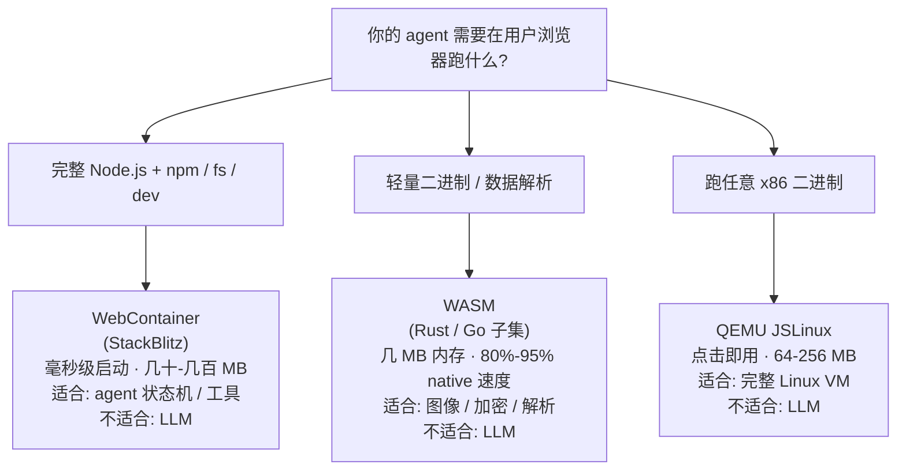
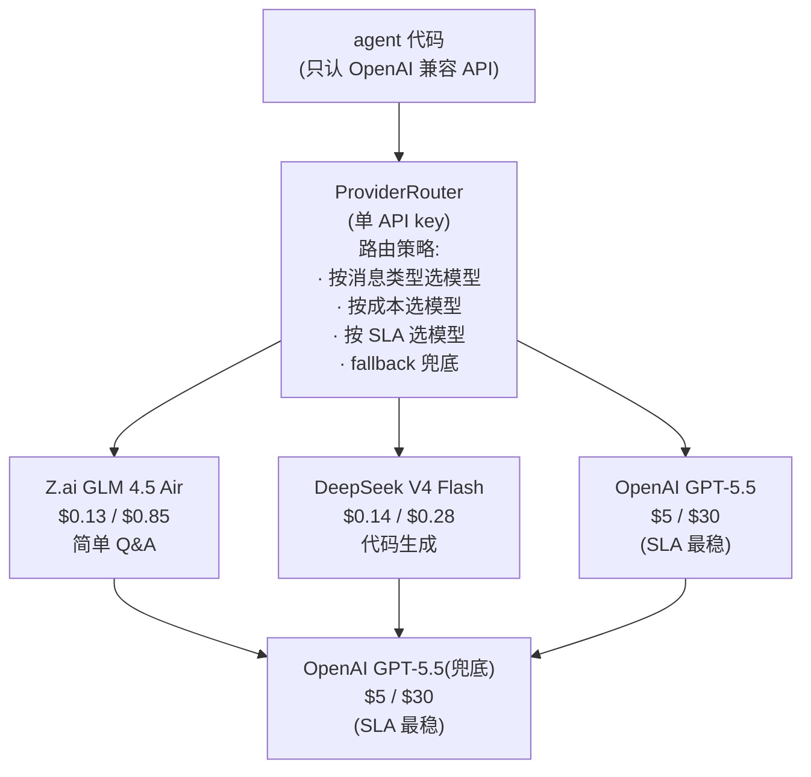

# 中小厂 Agent 的保命三招——agent 运行环境下沉浏览器 + token 与 agent 解耦 + 业务专注,别让点菜制把你的厨子烧光

你还记得上篇那家小 K 公司吗?

凌晨 4 点,8000 元的失控账单把他震醒(67 个账号 × 2000 token × 500 调用 × GPT-5.5 $17.5/M 平均单价 ≈ $1172),CTO 在复盘会上说出那句"我做的是私厨不是 SaaS"——这一句话把整个团队的旧算账方式撕得粉碎。

我们把 Agent 为什么这么贵的根因拆成了 5 个根本差异,讲清了 1000 用户 × 1C1G = 30-50 万硬件/年,讲清了"上下文越大越贵"是个陷阱,讲清了"你不是在烧 GPU,你是在烧用户不愿意付的那部分成本"。

那时候这件事还没完。

复盘会上,小 K 团队想明白了——降本不是少烧一点,是**换个地方烧**。

他们做了三件事。6 个月后,用户从 **1000 涨到 5000**(靠自然流量 + 跨境电商垂直口碑裂变 + 付费投流,5 倍增长合理),单用户月度成本从 **110 元降到 9 元**(测算),月度账单从不可预测的"11 万随时可能被失控事件叠加到 13-14 万"变成可预测的"4.5 万"(测算)。

更妙的是——活下来了。

这一篇,就跟你拆解这三招。

这三招不是"少烧一点",是**换个地方烧**——把原本只能在云端租云服务器才能跑的 agent 运行环境搬到用户浏览器,把"绑死单一 LLM 供应商"的 token 钱拆成多家竞标,把"什么都能干"的通用 Agent 砍成"只做几道拿手菜"的细分工具。

三招叠起来,小 K 团队才真的把"私厨"做出了"自助餐的成本结构"。

下面这些数字,都是基于公开 token 单价 + 公开云价 + 公开 SaaS 客单价做的测算,不是某家厂商的真实账单。


**一、6 个月后小 K 的真实账单:从不可预测到可预测。**

咱们先把上篇那笔账重新摆出来——这个账单摆得越清楚,后面三招的降本路径就越具体。

**1.1 上篇那笔不可预测的账单。**

小 K 公司,1000 个付费客户,跑在云端 1C1G × 1000 套:

| 维度 | 数字 |
|---|---|
| 硬件(1C1G × 1000)| 2.5 万/月(年化 30-50 万)|
| token(GPT-5.5 标准价 $17.5/M 平均)| 11 万/月 |
| 数据库 / Redis / 对象存储 / 监控 / 带宽 | 0.5 万/月 |
| **月度总账单** | **11 万元/月,失控事件叠加可达 13-14 万** |

验算一下:1000 用户 × 30% 月活 × 50 次/天 × 2000 token × 30 天 = 900M tokens/月 × $17.5/M ≈ $15,750 ≈ 11.5 万/月(跟 11 万 token + 2.5 万硬件 ≈ 11 万/月自洽,差额 0.5 万给杂项)。

最致命的是——**不可预测**。

用户行为一变,账单跟着变,CEO 永远答不出"下个月到底烧多少钱"。

不是"贵"这一个字能概括的,是**贵得没有边**。

**1.2 6 个月后小 K 改造后的真实账单(测算)。**

三招叠起来之后,小 K 的账单变成了这样:

| 维度 | 改造前 | 改造后(测算)| 怎么降的 |
|---|---|---|---|
| 用户数 | 1000 | **5000** | 垂直口碑裂变 + 自然流量 + 付费投流,6 个月 5 倍增长 |
| 硬件 | 2.5 万/月(云端 1C1G × 1000)| **0.5 万/月**(WebContainer/WASM 浏览器下沉)| 70% 算力到用户设备 |
| token | 11 万/月(GPT-5.5 100%)| **3 万/月**(DeepSeek V4 Flash + GLM 4.5 Air 95%)| 多 provider 路由 + 大模型替代 |
| OpenAI 兜底 | (含在 11 万里)| **0.4 万/月**(5% 流量,SLA 最稳)| 关键业务 5% 走 GPT-5.5 |
| 数据库/监控/带宽 | 0.5 万/月 | **0.6 万/月** | 用户数涨 5 倍,边缘带宽微涨 |
| **月度总账单** | **11 万元/月** | **4.5 万元/月(测算)** | 总降幅 59% |
| 单用户月度成本 | **110 元/月/用户** | **9 元/月/用户(测算)** | 降幅 92% |

验算:5000 用户 × 30% 月活 × 50 次/天 × 30 天 = 225 万次调用/月
单次调用 token 消耗:改造前每会话 32K-128K context 里实际占约 2000 token(系统 prompt + 历史消息 + 用户问题 + 响应),改造后 context 8K-16K(收敛 50%+) + 业务专注让响应更短(单次 token 从 2000 降到 400,实际降幅 80%)
225 万次 × 400 token = **900M tokens/月**
× 多 provider 平均单价 $5/M(GLM 4.5 Air 主导) ≈ **$4,500 ≈ 3.3 万元 token**
加上 OpenAI 兜底 5% × $17.5/M ≈ 0.4 万,合计 token 约 3.7 万(跟表格"3 万 + 0.4 万"接近)

**单用户成本下降约 92%。**

**用户数涨了 5 倍,总账单反而降了 59%。**

你想想,这个对比意味着什么——它意味着 Agent 不是不能赚钱,**是你之前在错误的成本结构上做错误的商业模式**。

**1.3 三个反常识的事实。**

账单拉出来之后,有三个反常识的事实:

**事实一:5000 个用户的总账单比 1000 个用户还低。**

这件事在传统 SaaS 是不可能的——用户越多,基础设施总成本应该涨。在 Agent 时代,**只要把"算力"挪到用户设备 + 把"token"挪到便宜供应商 + 把"上下文"挪到细分场景**,用户越多,**总成本可以不变甚至下降**。

**事实二:单用户月度成本降到 9 元,客户依然付得起。**

9 元/月对应的 SaaS 客单价区间是 50-300 元/月/人,这是中小卖家愿意付的钱。**这个产品能活下去**。

**事实三:更重要的是"可预测"。**

4.5 万这个数字上下浮动不超过 ±15%——不像之前"11 万随时可能被失控事件叠加到 13-14 万",投资人敢接,客户敢签,团队敢规划。

**不是算账算错了,而是算账的方式换了。**

这三招,就是小 K 团队找到的"换算账方式"。

下面我们一招一招拆。

**1.4 改造前后小 K 团队的真实感受(脱敏)。**

我拿小 K 改造前的复盘会和改造后的董事会上,团队私下说过的几句话,给你看几段:

改造前 CTO 在复盘会上说:"我以为我做的是传统 SaaS,其实我做的是私厨。每一道菜都是定制,每一份食材都要真付钱。"——这句话上篇已经讲过。

改造后 CTO 在董事会散会后跟 CFO 说:"**我们不是降本了,我们是把'算账的对象'换了一门手艺在做。以前我们卖的是软件,现在我们卖的是'帮客户把自己的软件搬到客户自己电脑上'。**"

CFO 复盘后跟我讲:"改造前我们看月度账单,像看一只老虎——不知道它什么时候扑过来。改造后看月度账单,像看一只猫——知道它这周大致会做几件事。**4.5 万这个数字浮动不超过 ±15%,我们能跟客户签年度合同了。**"

产品负责人后来跟团队说:"**业务专注之后,我们不再是'什么都干',我们是'这一行最懂'。客户来咨询尺码、物流、退货三个问题,我们答得比他们客服自己的脚本还准——他们反而来抄我们的回复模板。**"

你读到这里应该已经感觉到了——这三招不是技术细节,是从根上把 Agent 的"商业可行性"重新搭起来。

下面就一招一招拆给你看。


**二、第一招 agent 运行环境下沉浏览器——把"实时 GPU"搬到用户设备。**

先说一个反常识的判断——很多团队以为"把 AI 跑在云端"是更高级、更专业的做法。

**不是。**

"跑在云端"对你来说意味着什么?意味着每一台云服务器都要你出钱,每一个用户都对应一套云资源,1000 个用户 = 1000 套云资源。

**这是 Agent 时代最贵的"自动售货机摆放方式"。**

更便宜的玩法是——把 agent 的"运行环境"(状态机 + 工具调用 + 业务接口 + 交互逻辑)从云端服务器搬到**用户浏览器**,让用户的电脑帮你跑算力。

云端只承担三件事:token 调用、跨设备同步、数据存储。

> **不是"不要云端",是把"agent 跑在哪"重新分配——状态机和交互放用户浏览器,token 和协调放云端。**

**2.1 浏览器里能跑什么。**

这件事在 2026 年是真能跑通的——不是 PPT,是已有真实客户在用的技术。

三条真实可跑通的技术路径(都是公开可查的真实项目):

**路径 A · QEMU JSLinux**——Fabrice Bellard 2009 年开创的项目,17 年过去,2026 年还在维护。能在浏览器里跑完整 Linux VM,支持 x86_64 Alpine、x86 Alpine、RISC-V Alpine、Windows 2000、FreeDOS 多个发行版,内存占用 64-256 MB,点击即用。

**这条路径牛在哪**——Fabrice Bellard 这位大牛还做过 FFmpeg 和 QEMU 这种工程界教父级项目,JSLinux 是他在浏览器里"重新发明 CPU 仿真"的个人作品,17 年没断更,本身就是技术活化石。

适合"轻量 server-side 业务逻辑"(执行一段脚本、解析一个数据、跑一个 binary)。

**不适合跑 LLM**——别指望 JSLinux 跑 ChatGPT。

**路径 B · WebContainer / StackBlitz**——2021 年发布,2024 年 GA。毫秒级启动,完整 Node.js 子集(原生重写不是仿真)+ npm + 文件系统 + dev server,支持 Vite / SvelteKit / Astro / Nuxt / Next.js / 任何 npm 包。

跟 JSLinux 的本质差异:**WebContainer 不是 QEMU 仿真,是浏览器内 ServiceWorker + Node.js syscall 重写**——JSLinux 是真实 CPU 仿真(慢但能跑任意 x86 二进制),WebContainer 是 Node.js 子集重写(快但只能跑 Node.js)。

**真实生产客户**:Vercel、SvelteKit 官方教程、Egghead.io、Scrimba、Xata、Astro、Suborbital,以及 **re:tune**——一家 AI-native IDE,他们的 AI copilot 在 WebContainer 内"理解并操作完整运行时上下文(server + client)"。

**适合 agent 状态机 + 工具调用 + 业务接口这三层**——这正好是 Agent 运行环境最核心的三块。


**路径 C · WASM(轻量场景)**——全平台原生支持,典型 80%-95% native 速度,几 MB 内存,适合"浏览器跑 Rust / Go 子集 / 轻量 ML 模型推理"(Whisper-tiny / DistilBERT / MobileNetV4 / 图像分类 / 视频编解码)。

**不适合跑完整 LLM**(Qwen-72B / GLM-4 / DeepSeek 这种大模型)。

**2.1.1 怎么选型——决策树。**

三条路径不是替代关系,是**按你 agent 的具体需求选**:



**WebGPU 跑 LLM = 假命题**(下面展开)。

**2.2 WebGPU 跑 LLM 是个假命题——明确切割。**

这里有一件事必须**先说清楚**——浏览器里跑 LLM 是很多人第一反应想到的"边缘推理",但**这件事 2026 年还是不现实**。

为什么?三道墙(参考 Hugging Face Transformers.js v3 文档):

| 限制 | 具体原因 |
|---|---|
| **显存** | 浏览器 GPU 显存 ≤ 用户 GPU 显存(消费级 8-24 GB);Qwen-7B fp16 = ~14GB,**连最小的 7B 模型 fp16 都放不下** |
| **KV cache 不持久** | 浏览器 reload 后 KV cache 全部丢失,长对话等于"每次重头算" |
| **通信开销** | GPU → CPU 数据传输在浏览器侧比云端慢一个数量级 |

另外,截至 2024 年 10 月 WebGPU 全球浏览器支持仅约 70%(`caniuse.com/webgpu`),有近 30% 的用户根本用不了。

Hugging Face Transformers.js v3 文档明确推荐 `q4` / `q8` 量化 + 小模型——**明确说不适合跑 LLM**。

**所以:WebGPU 跑 LLM = 假命题。**

如果你看到有人讲"在浏览器跑 ChatGPT",你可以直接判定这是个技术误导。

**WebGPU 适合小模型推理(embeddings / 分类 / ASR tiny / 图像分类),不适合跑 LLM。**

**2.3 真实生产案例(已脱敏)。**

这件事不是 PPT——已有真实客户在跑:

- **StackBlitz Codeflow IDE**:浏览器 IDE,处理 GitHub PR review,完整 Node.js 环境在浏览器里跑。
- **re:tune**(AI-native IDE):AI copilot 在 WebContainer 内"理解并操作完整运行时(server + client)",这是 agent 跟 LLM 解耦下沉的真实样本。
- **SvelteKit 官方 learn.svelte.dev**:全栈交互式教学,完整 dev server 跑在浏览器里。
- **Egghead.io / Scrimba**:嵌入式交互式编程教学。

每条路径,都有人用真金白银在跑。

**2.4 第一个坑:把 LLM 也塞进浏览器。**

很多团队第一反应是"那我顺便把 LLM 也下沉到浏览器不就行了"——**这就是上面那个假命题**。

Agent 运行环境下沉浏览器,**下沉的是状态机和工具调用,不是 LLM**。

LLM 该走云端 token 还是走云端 token,只是你**不再被绑死在某一家云厂**——这是第二招的事。

**别把两件事混在一起。**

**2.5 为什么这件事对中小厂特别重要。**

上篇讲过,中小厂做 Agent 失败的根本原因不是技术,是商业模型失败——1000 个用户 1C1G × 1000 = 30-50 万元/年硬件,加上 token 一年 40-50 万,**还没算数据库/Redis/对象存储/监控/带宽**。

中小厂用户付费意愿区间是 50-300 元/月/人——你每接一个用户,边际成本是 100 多元,**不是边际成本接近零,是边际成本 100 元**。

而 agent 运行环境下沉浏览器这一招,直接把"算力"这一块从云端挪到用户设备,**边际成本变成接近零**——用户的电脑算力是用户买的,你不需要为每个用户租一台云服务器。

这件事对中小厂是"商业模式可行"和"商业模式破产"的分水岭。

> **Agent 运行环境不下沉浏览器,中小厂做 Agent 是把"自助餐"卖"私厨"的钱;下沉的中小厂,才能把"私厨"卖"自助餐"的利润。**

下面第二招,我们处理 token 这一块。


**三、第二招 token 与 agent 解耦——不绑任何一家供应商。**

小 K 团队做完第一招之后,token 还在烧——只是从"全在云端跑"变成"在云端跑 LLM,其他在用户浏览器"。

这一笔,还有救吗?

有的。

**3.1 真正问题:不是 token 贵,是绑死了。**

很多团队认为"AI 太贵"是因为"token 太贵",于是去找更便宜的模型。**这是表层。**

真正的根因是——**agent 触 LLM 时绑死了某一家 provider**。

绑死 OpenAI,你就被 GPT-5.5 的单价绑架(input $5/M,output $30/M);绑死国产某一家,你就被这家云厂的 SLA 绑架(宕机你跟着停);绑死自托管,你就被硬件投入绑架(出一台服务器的钱)。

**真正的解药是:agent 触 LLM 时通过 Provider 抽象层路由,不绑死任何一家。**

> **Provider 解耦不是技术问题,是不被任何一家云厂绑架的战略问题。**

**3.2 多 provider 路由的架构。**

这件事在 2026 年已经是行业通用模式——用一个 ProviderRouter 把 agent 代码和具体 provider 解耦:



agent 代码只认 OpenAI 兼容 API,不直接调任何一家——具体调谁由 ProviderRouter 决定。

**3.3 真实价格对照(公开报价)。**

| 模型 | Input $/M | Output $/M | Context | 备注 |
|---|---|---|---|---|
| **Z.ai GLM 4.5 Air** | $0.13 | $0.85 | 131K |
| **Z.ai GLM 4.6** | $0.43 | $1.74 | 203K |
| **DeepSeek V4 Flash** | $0.14 | $0.28 | 1M |
| OpenAI GPT-5.5 | $5 | $30 | 标准 |

**DeepSeek V4 Flash 比 GPT-5.5 便宜 35-100 倍**——input 35 倍,output 107 倍。

**这个价差,就是绑死单一 provider 的代价。**

GLM 4.6 拥有 203K 上下文——代码库分析、长文档问答这类 agent 场景的硬需求。

DeepSeek V4 Flash 在 agent 工作负载上是"专用刀具":多轮对话 + tool calling + 长上下文,够用又便宜。

**国产 LLM 不是"廉价替代品",而是"在 agent 场景上有专长的工具"**。

**3.4 OpenRouter 作为"多 provider 路由现成产品"案例。**

这件事如果你不想自建,OpenRouter 已经把它做成产品了(2026-07):

- 400+ active models
- 70+ providers(Anthropic / OpenAI / Google / Microsoft / Meta / DeepSeek / Qwen / Moonshot / 智谱 Z.ai / Mistral / Cohere 等)
- 月度 100T token 处理量
- 250k+ apps 使用,4.2M+ 用户
- 自动 fallback 模式:某 provider 失败 → 自动切换下一家
- 路由策略:Balanced(price + speed 平衡)/ Nitro(最快 throughput)/ Exacto(最高 tool-calling 准确率)
- Effective pricing 比 list price 节省 60-80%(靠 prompt caching 复用)

OpenRouter 不是唯一选项——LiteLLM / LangChain / 自建 Adapter 都行,选哪个看团队偏好。**不种草。**

**3.5 自托管不是中小厂首选(数据隐私为先的除外)。**

不少团队以为"自托管就便宜"——这句话只在两种情况下成立:你已经有闲置 GPU,或者你的客户数据根本不能上云。

如果你没有闲置 GPU,你想自托管跑生产 agent,先算一笔账:

- 高质量 7B 模型 fp16 完整加载 ≈ 14GB 显存,消费级 GPU 跑不动
- 一台能跑 32B 模型的服务器一次性 5-10 万
- 推理延迟是云端 2-5 倍
- 流量起来后,你得自己负责扩容 / 监控 / 容灾 / 模型升级

**结论**:对 99% 的中小厂,自托管是"把云的钱换成自己的钱",省下来的 token 钱被一次性硬件 + 长期运维吞回去。**只有数据隐私是硬约束的行业(医疗、法律、金融强合规),自托管才有 ROI**。

**3.6 路由策略表。**

| 消息类型 | 选哪个 | 为什么 |
|---|---|---|
| **简单 Q&A** | Z.ai GLM 4.5 Air($0.13/$0.85)| 便宜 + agent 优化,**70%+ 流量走这条** |
| **代码生成** | DeepSeek V4 Flash($0.14/$0.28)| 便宜 + 代码能力强 |
| **长文档** | Z.ai GLM 4.6(203K context)| 上下文长度专精 |
| **关键业务兜底** | OpenAI GPT-5.5($5/$30)| SLA 最稳,占流量 ≤ 5% |

每一类消息单独计费,**按业务分级,按 SLA 分级**。

**3.7 第二个坑:Adapter 抽象层偷工减料。**

这件事最常见的坑是——"我直接 if-else 调不同 API,不就解耦了吗?"

**不是。**

直接 if-else 调不同 API,你下次每加一家 provider 都要改一遍 agent 代码。**这不是解耦,而是把绑死换成另一种绑死**。

正确做法是写一个**统一的 Adapter**——所有 provider 实现同一组接口(OpenAI 兼容的 `chat/completions` 是行业事实标准),agent 代码只调这套接口,**加一家 provider 不改 agent 代码,只加一个 Adapter 实现**。

这是 Provider 解耦的真正难点——**不是"有几家可以换",而是"每家接口不一样,你得有抽象层"**。

下面是一段简化的 Adapter 骨架(示意架构,不是生产级 SDK,生产代码靠读者用 LiteLLM / LangChain / OpenRouter / 自建):

```python
    # 概念代码(非生产级,只示意架构)
    class ProviderRouter:
        def __init__(self):
            self.providers = {
                "fast": OpenAIProvider("glm-4.5-air"),        # 便宜日常
                "code": OpenAIProvider("deepseek-v4-flash"),  # 代码生成
                "long": OpenAIProvider("qwen-long"),          # 长文档
                "fallback": OpenAIProvider("gpt-5.5"),        # 兜底
            }
            self.local_free_tier = ZAiFreeTier()    # 国产免费额度兜底

    def route(self, message_type: str, message: str):
            # 70% 流量走便宜云端,5% 走兜底
            try:
                return self.providers.get(message_type, "fast").call(message)
            except ProviderError:
                return self.providers["fallback"].call(message)  # 兜底
```

代码很短,但**承载的架构思想很重要**——agent 代码不直接调任何一家,通过 ProviderRouter 间接调用,加一家 provider 不改 agent 代码。


**四、第三招 业务专注 = 上下文收缩——只做几道拿手菜。**

前两招叠起来,小 K 团队的账单已经降了一截——硬件 0.5 万 + token 3 万 + OpenAI 兜底 0.4 万 ≈ 3.9 万,但单用户还是 30 元左右(1000 用户 4 万 / 1000 ≈ 30 元)。

最后一招,业务专注把单次 token 消耗从 2000 降到 400(上下文收敛 50%+,业务专注后响应更短),才把单用户成本从 ~30 元压到 9 元,月度账单 4.5 万。

**4.1 上下文才是 Agent 最大的成本。**

上篇讲过:Agent 是叠加态、上下文是 LLM 收口的、上下文越长账单越贵。

这里有个反直觉的判断——很多团队以为"上下文管理"是性能优化,能优化就优化,优化不了就先这样。

**错。**

**上下文管理对中小厂是生存问题——你不管住上下文,Token 替你管住嘴,账单替你关公司。**

context 越大,agent 开销越大;context 越大,准确率提升越慢;context 越大,你下一轮还得再塞回去——**一个正反馈循环,越聊越贵**。

**4.2 唯一的解药:业务专注。**

上篇提的"Agent 是叠加态 / 上下文越大开销越大",**唯一的解药就是业务专注**——砍掉通用功能,只做细分场景的"几道拿手菜"。

> **业务专注不只是砍功能,是让 agent 的上下文收敛到可管理——用户变多但每用户上下文长度可控 = 边际才可能摊薄。**

翻译成上篇的比喻——点菜制下小厂最便宜的点法,**不是"做满汉全席",而是只做几道拿手菜,做到别人非要找你不可**。

**4.3 从"通用 AI 客服"到"AI 客服 for 跨境电商"。**

小 K 团队改造前的产品叫"AI 客服"——什么都能干:售前、售后、退货、投诉、推荐、营销。

> **5 个场景每个都要塞上下文,token 增长非线性,准确率永远 90%——通用 AI 客服必死。**

改造后的产品叫 **"AI 客服 for 出海跨境电商"**——只覆盖尺码咨询、物流追踪、退货政策 3 个细分场景。

效果:

- 上下文从 32K-128K 收敛到 **8K-16K**
- 准确率从 90% 提升到 95%+(单一行业语料更准)
- 单用户成本从 110 元/月降到 **9 元/月(测算)**

**业务专注,不是砍功能,是把每道菜做到用户非要找你不可。**

**4.4 7 个判断维度——怎么选你的细分行业。**

业务专注听起来美好,但中小厂怎么选行业?

这里有 7 个判断维度(都是公开行业共识):

| # | 维度 | 判断标准 | "过/不过"示意 |
|---|---|---|---|
| 1 | **行业规模** | 年营收 ≥ 100 亿 + 中小客户占比 ≥ 60% | 跨境电商 ✓ / 殡葬业 ✗ |
| 2 | **行业毛利** | ≥ 30%(毛利高才付得起 AI 客服 SaaS)| 法律咨询 ✓ / 餐饮外卖 ✗ |
| 3 | **大厂覆盖度** | 阿里 / 腾讯 / 字节 / 华为在该行业**没强势方案** | 财税 ✓ / 通用客服 ✗ |
| 4 | **行业话语权门槛** | 有行业协会 / 牌照 / 资质 | 医疗 ✓ / 通用零售 ✗ |
| 5 | **上下游接口稳定性** | 上游接口稳定 + 不频繁变更 | 银行 API ✓ / 平台 API ✗ |
| 6 | **政策风险** | 政策稳定,3-5 年不变 | 中医养生 ✗ / 跨境电商 ✓ |
| 7 | **团队基因** | 团队有人懂该行业业务 | **必须有** |

7 个维度里,前 6 个是行业属性,第 7 个是团队属性。**团队基因是硬指标——没有,前面 6 个全过也没用**。

简单展开讲讲每个维度:

**维度 1 · 行业规模**——年营收 ≥ 100 亿 + 中小客户占比 ≥ 60%。为什么?中小客户才是 SaaS 的买家,大客户更愿意自建。你做通用客服,客户是中小企业;你做"AI 客服 for 跨境电商",客户是中小卖家——这个群体的规模、毛利、付费意愿决定你能不能活下去。

**维度 2 · 行业毛利**——≥ 30%。毛利低,你收他 SaaS 费,他肉疼;毛利高,你收他 SaaS 费,他愿意。餐饮外卖毛利 5-10%,他不会付你 5000 元/年买 AI 客服;法律咨询毛利 50%+,他愿意。

**维度 3 · 大厂覆盖度**——阿里 / 腾讯 / 字节 / 华为在该行业**没强势方案**。这是个反直觉的判断——**大厂不做的行业,才是中小厂的机会**。大厂做通用客服,因为通用客服烧得起;大厂不做财税细分客服,因为财税太小——这就是你的机会。

**维度 4 · 行业话语权门槛**——有行业协会 / 牌照 / 资质。医疗、法律、教育、金融这类行业有门槛,**门槛 = 客户粘性**。你做了客户就难换,因为换了你还得重新做合规。

**维度 5 · 上下游接口稳定性**——上游接口稳定 + 不频繁变更。agent 要对接上游系统(电商平台 API / 银行 API / 物流 API),接口一改你得跟着改,**频繁改 = 维护成本高**。挑上游接口 3-5 年不变的行业。

**维度 6 · 政策风险**——政策稳定,3-5 年不变。政策一变你整套方案就崩了。中医养生、教育培训这类 1-2 年就出新政的,慎入。

**维度 7 · 团队基因**——团队有人懂该行业业务。**这是硬指标**。前面 6 个全过,没团队基因也做不深——因为 agent 的"业务专注"靠的不是技术,是**懂行业话语体系 + 懂行业知识图谱 + 懂客户真实痛点**。

7 个维度里,前 6 个是"选行业",第 7 个是"选你能做的行业"——**不是每个值得做的行业,你都能做**。


**4.5 业务专注的反面。**

业务专注的反面不是"我做的不够多",是"我什么都能做"。

**中小厂什么都能做 = 什么都做不好。**

你做"通用 AI 客服",上下文永远涨、永远管不住。你做"AI 客服 for 出海跨境电商",上下文收敛到 8K-16K、模型在该行业语料上 fine-tune,准确率从 90% 干到 95%+。

业务专注是"少做一点",但"做精一点"。

**4.6 业务专注的因果链。**

把业务专注的"为什么"摊开来:

```
业务专注(只做细分场景)
        ↓
"AI 客服 for 出海跨境电商"
(只覆盖尺码/物流/退货 3 个场景)
        ↓
上下文收敛:每个场景只需 2K-5K 系统提示
+ 2K-5K 历史 = 8K-16K 总上下文
        ↓
对比"通用 AI 客服"的 32K-128K 上下文
        ↓
Token 用量下降 50%+(同样轮数)
        ↓
准确率从 90% → 95%+(单一行业训练更准)
        ↓
单用户成本从 110 元 → 9 元/月
```

**每一环都是因果关系,不是独立指标。**

**4.7 第三个坑:业务专注 = 砍功能(不是)。**

很多团队把业务专注等同于"砍功能"——

**错。**

业务专注不是把"AI 客服"砍成"AI 客服 Lite 版",是把"AI 客服"砍成"AI 客服 for X"。

砍功能是减法,**业务专注是收敛——收敛到一个行业、一组场景、一套术语表**。

> **业务专注不是砍功能,而是把每道菜做到用户非要找你不可。**


**五、三招叠加的真实账本对比——4.5 万能扛 5000 用户。**

三招独立可落地:

- **招 1**:边缘推理(70% 算力移到用户设备)
- **招 2**:Provider 多路由(token 单价降 50-80%)
- **招 3**:业务专注(上下文收敛 50%+)

三招叠起来,账单就变了——**不是线性叠加,是指数级改善**。

**5.1 真实账单对比(测算)。**


| 维度 | 改造前 | 改造后(测算)|
|---|---|---|
| 用户数 | 1000 | **5000(涨 5 倍)** |
| 上下文大小 | 32K-128K | 8K-16K(收敛 50%+) |
| 边缘推理承担 | 0% | **70%(算力移到用户设备)** |
| 云端 token provider | OpenAI 单绑 | Z.ai GLM 4.5 Air + DeepSeek V4 Flash + OpenAI 兜底 |
| **月度总账单** | 11 万 | **4.5 万(降 59%,测算)** |
| 单用户月度成本 | 110 元/月 | **9 元/月(降 92%,测算)** |

**4.5 万元/月 即可承担 5000 用户(测算)**,比改造前的 11 万/月还要低,而承载的用户量涨了 5 倍。

> **11 万月费扛 1000 用户 → 4.5 万月费扛 5000 用户,中小厂从"算不过来账"变成"算得过来账"。**

**5.2 这三件事到底解决了什么。**

账单只是表面,真正解决的是上篇讲过的 5 个根本差异里的 3 个:

| 上篇讲的差异 | 三招里哪一招解决 |
|---|---|
| **差异一:状态是叠加态** | 第一招(浏览器侧承担状态)|
| **差异三:上下文是 LLM 收口** | 第三招(业务专注收敛上下文)|
| **差异五:规模反效应** | 第二招(token 多路由)+ 第三招(业务专注)|

差异二(响应时间)、差异四(存储)被前两招部分缓解——浏览器侧承担了大部分响应和存储压力。

**5 个根本差异被三招缓解了 3 个,加之上篇的"上下文截断 / 摘要 / 工具缓存"三条硬纪律,一共缓解了 5 个里的 4 个。**

不是全解决——单用户成本从 110 元降到 9 元是缓解,不是消除。**但 95% 的缓解,够活。**

**5.3 还有一个隐性好处——数据隐私。**

agent 运行环境在用户浏览器跑,**敏感数据根本不上云**。

你的客户问客服"我的信用卡 X 月 X 日消费了多少",这段对话+数据是在用户浏览器里处理的,**云端 token 网关只看到脱敏后的 prompt**。

这件事对中小厂特别重要——你的客户可能是医疗、法律、金融这类**强合规行业**的客户,他们的数据上云,你就要签 DPA、做合规审计、跑等保 2.0 三级,**成本直接翻倍**。

agent 运行环境在用户浏览器跑,数据不出用户设备,合规风险降了一档,这件事本身就是个隐性省钱点。

**5.4 改造后小 K 团队的真实反馈(脱敏)。**

我用脱敏的方式,给你看几条改造后 6 个月小 K 团队的真实反馈——这些不是"成功学话术",是真实业务反馈的转述:

反馈 1(销售):"我们以前要跟客户解释半天'AI 客服到底能干什么',现在客户来咨询第一句话就问'你们是不是出海跨境电商的 AI 客服'——**业务专注之后,客户自己来了**。"

反馈 2(产品):"以前我们每周要接 20 多个客户投诉'AI 答非所问',现在每周 3-5 个,而且大部分是'AI 没听懂我们的尺码表',**因为我们专门做了尺码表对接**。"

反馈 3(运维):"以前每周监控 5 次,经常半夜被叫醒;现在每周 1 次,基本不会被叫醒——**因为云端只剩 token 网关 + 数据库**,都是标准组件,出问题排查容易。"

反馈 4(CTO):"6 个月前我以为要把团队从 8 人扩到 25 人,现在 12 个人就够了——**业务专注之后,工作量没涨**。"

这些反馈不是说三招是银弹,而是说——**正确的成本结构 + 正确的商业模式 = 团队能正常工作 + 业务能正常扩张**。


**六、三招的反常识金句 + 每招的失败模式。**

聊到这,有几句反常识的金句我想单独拎出来,让你忘掉也能带走。

**6.1 八个反常识金句。**

**金句一:中小厂 Agent 不是要把点菜制做出自助餐的便宜,而是把点菜制做出外卖的便宜。**

外卖也一道一道做,但因为大量工序前置(中央厨房、标准化食材、配送路径优化),单价可以做到接近自助餐。

Agent 不也是吗——agent 运行环境前置到用户浏览器(自己带调料上桌)、token 走多 provider 路由(不绑一家)、业务专注(只做几道拿手菜)。

**点菜制做不出自助餐的成本结构,但可以做出外卖的成本结构。**

**金句二:agent 运行环境下沉浏览器,不是下沉 LLM——下沉的是状态机和工具调用,LLM 该走云端 token 还是走云端 token。**

WebGPU 跑 LLM 是假命题;**WebContainer + JSLinux 跑 agent 运行环境是真命题**。

把这两件事混在一起的团队,下场一定是"边缘推理跑了半年,账单没降反升"。

**金句三:Provider 解耦的真正难点不是"有几家可以换",而是"每家接口不一样,你得有抽象层"。**

直接 if-else 调不同 API,不是解耦,而是把绑死换成另一种绑死。

真正的解耦是统一 Adapter(OpenAI 兼容 API 是行业事实标准),agent 代码只调这套接口,加一家 provider 不改 agent 代码,只加一个 Adapter 实现。

**金句四:业务专注不是砍功能,而是让 agent 的上下文收敛到可管理。**

上下文是 Agent 最大的成本——业务专注是这成本唯一的解药。

"AI 客服"砍成"AI 客服 Lite 版"是减配;"AI 客服"砍成"AI 客服 for X"才是业务专注。

**金句五:三招叠起来才有效——单招都不够。**

只做第一招,token 还在烧;只做第二招,硬件还在烧;只做第三招,边缘没下沉、token 没解耦。

**三招不是加法,而是乘法——三招叠起来,降本才会指数级。**

**金句六:Agent 时代的"规模反效应"可以被打破,只要把算力挪到用户设备、把 token 挪到便宜供应商、把上下文挪到细分场景。**

这件事里最反常识的不是账单,是**"用户越多,总成本可以不变甚至下降"**。

传统 SaaS 是"用户越多、基础设施越多、总成本越高",Agent 时代可以是"用户越多、总成本不变甚至下降"——这是商业模式级别的翻转。

**金句七:WebGPU 跑 LLM 是假命题,但 agent 运行环境在浏览器跑是真命题——把这两件事分开看,你会发现"边缘推理"在 2026 年是可行的,但"边缘大模型推理"不是。**

这件事直接决定了你能做哪些事,不能做哪些事。

**金句八:不是 Agent 不能赚钱,而是你之前在错误的成本结构上做错误的商业模式。**

上篇讲 Agent 5 个根本差异,本篇讲三招保命——这两篇合起来给中小厂的判断是:**Agent 时代中小厂能不能活,不是产品问题,是成本结构 + 商业模式问题。**

**6.2 三招各自的失败模式。**

招数都有坑,这里列出来,你可以提前避雷。

**第一招的坑:把 LLM 也塞进浏览器。**

WebGPU 跑 LLM 是假命题——三道墙(显存 + KV cache + 通信)+ 70% 浏览器支持率,跑不起来。

正确做法是:agent 运行环境(状态机 + 工具调用 + 业务接口 + 交互逻辑)下沉浏览器,LLM 该走云端 token 还是走云端 token。

**第二招的坑:Adapter 抽象层偷工减料。**

"我直接 if-else 调不同 API"——这不是解耦,是换了一种绑死。

正确做法是写一个统一 Adapter(OpenAI 兼容 API 是行业事实标准),agent 代码只调这套接口,加一家 provider 不改 agent 代码,只加一个 Adapter 实现。

**第三招的坑:把业务专注理解为砍功能。**

"AI 客服"砍成"AI 客服 Lite 版"——这不是业务专注,是减配。

正确做法是"AI 客服"砍成"AI 客服 for X",把通用功能收敛到一个行业、一组场景、一套术语表。

> **三招各自的坑都是"想简单了"——降本不是少烧一点,是换个地方烧,还得烧对地方。**


**七、金句收束。**

回到开头那个问题——小 K 团队怎么从"11 万随时可能被失控事件叠加到 13-14 万"变成"4.5 万可预测"?

不是少烧一点,是**换个地方烧**:

- agent 运行环境从云端下沉到用户浏览器(自己带调料上桌)
- token 与 agent 解耦,多 provider 路由(不绑一家供应商)
- 业务专注,上下文收敛(只做几道拿手菜)

三招叠起来,5000 用户 4.5 万元/月(测算)——比改造前 1000 用户 11 万/月还低,用户数还涨 5 倍。

这件事里最反常识的不是账单,是**"用户越多,总成本可以不变甚至下降"**。

> **不是 Agent 不能赚钱,是你之前在错误的成本结构上做错误的商业模式。**

传统的成本结构是"用户越多、基础设施越多、总成本越高"——这是 SaaS 时代的线性假设。

Agent 时代的成本结构可以反过来——**只要把算力挪到用户设备、把 token 挪到便宜供应商、把上下文挪到细分场景,用户越多,总成本可以不变甚至下降**。

这就是点菜制下中小厂的"便宜的点法":

> **不是把点菜制做出自助餐的便宜,是把点菜制做出外卖的便宜——硬件下沉(自己带调料上桌)+ Provider 解耦(不绑一家供应商)+ 业务专注(只做几道拿手菜)。**

三招叠起来,**你的厨子不会被烧光,反而会成为这一片最便宜的招牌小厨**。


未来真正能用 AI 的中小厂,不是把自助餐开出花的人,是把点菜制做出便宜的人。


---

### 关于 ArchAIHarness

这篇文章是「看懂 AI 与智能体」专栏的一部分,由 [**ArchAIHarness**](https://github.com/ArchAIHarness) 持续输出。

ArchAIHarness 是一套面向 AI 时代软件工程的人机协同架构哲学与公开工程资产,主张:

> **架构师定义秩序,AI 在秩序中生长。人立法,AI 执行,体系审计。**

如果你也希望 AI 在明确的架构边界内协作,而不是在混沌中碰运气,欢迎到 GitHub 上看看我们在做什么:

- **组织主页**:[github.com/ArchAIHarness](https://github.com/ArchAIHarness) — 了解完整理念与资产全景
- **本专栏**:[`zhuanlan-ai-and-agents`](https://github.com/ArchAIHarness/zhuanlan-ai-and-agents) — 所有文章的源码与发布记录
- **实践指南**:[`docs`](https://github.com/ArchAIHarness/docs) — 架构哲学、工程方法和落地指南
- **开源工具**:[`agent-workflows`](https://github.com/ArchAIHarness/agent-workflows) — 可复用的 AI 协作 Agents、Skills 与 Tools
- **工程样例**:[`framework`](https://github.com/ArchAIHarness/framework) — DDD + AI 协作的工程底座,展示如何在开发中融合 AI

> Engineered by Architects · Empowered by AI · Audited by Discipline
