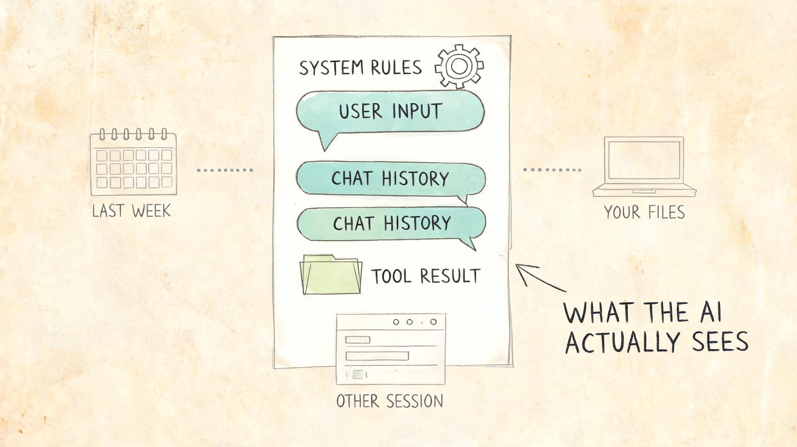
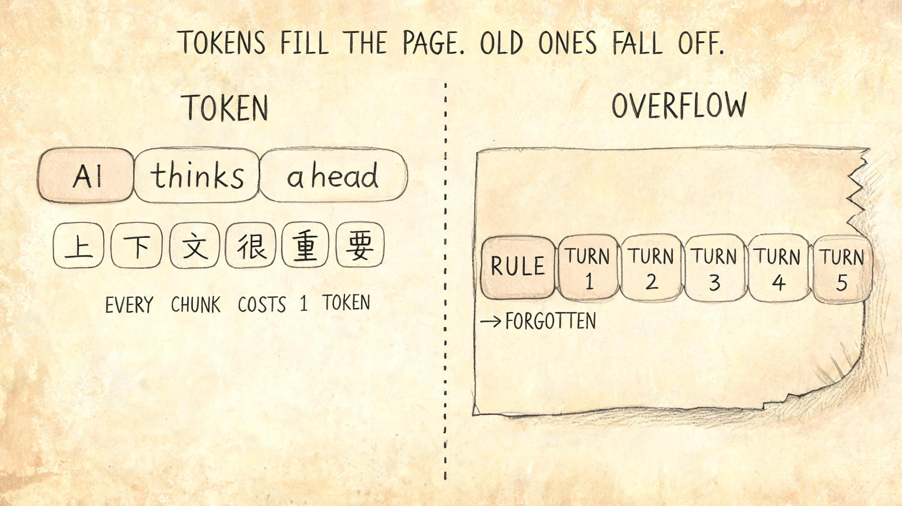
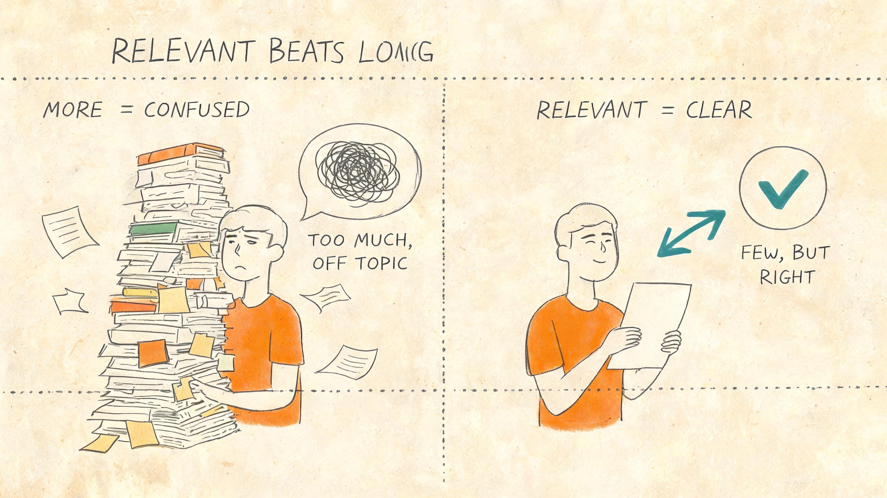
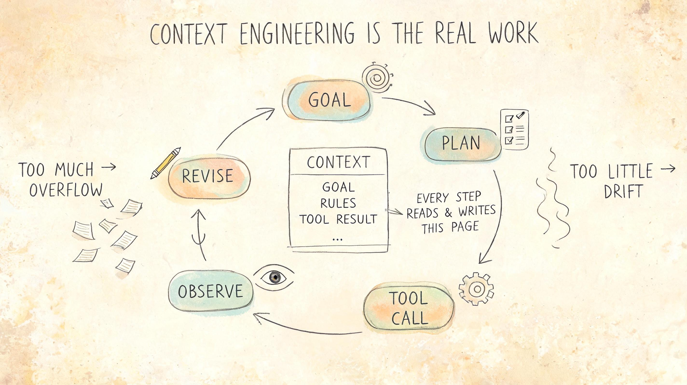

# AI 很强，但为什么还会"忘"？看懂上下文，你就知道怎么和它合作

AI 现在确实很强。

它能写代码、能写文案、能解释复杂概念，甚至能像上一篇讲的 Agent 那样，自己拆任务、调工具、跑出结果。

但同时你也会有一种困惑——这么强的 AI，为什么转头就忘了你刚说的话？为什么给它一堆资料反而越答越乱？为什么换个会话窗口，它就像从来没认识你一样？

到底是哪里出了问题？

是模型不够聪明？是提示词没写好？还是 AI 本来就这样反复无常？

都不是。

真正的原因藏在一个很多人没听过、但又决定了 AI 表现下限的概念里——**上下文**。

理解了上下文，你就会发现：很多看起来"AI 不行"的时刻，其实是"上下文没给对"。模型决定了 AI 能力的上限，上下文决定了它每一次回答的下限。

## 一、AI 不是没记性，它每次只看眼前这张纸

先打破一个常见误解。

很多人以为 AI 像个人，有"记忆"——你今天告诉它的事，它明天还能记得。

不是的。

更准确的画面是这样：每次你向 AI 提问，它面前都摆着一张**有限大小的纸**。它能用来回答你的，**只有这张纸上写着的内容**。

这张纸上写了什么？

- 你这一次输入的问题；
- 这次会话里前面已经说过的话；
- 系统在背后偷偷塞进去的一些设定，比如它的角色、它的规则；
- 如果接了工具或知识库，工具返回的结果、检索到的资料。

仅此而已。

不在这张纸上的东西，对它来说就**不存在**。

你上周和它聊过的话题，不在；你电脑里的文件，不在；你公司内部的文档，不在；甚至同一个产品的另一个会话窗口里说过的话，也不在。

这张纸，就是**上下文**。它是 AI 在这一次回答里能看到的全部世界。

所以"AI 忘了"其实是个误解。它不是忘了，而是**这一次根本没看到**。

## 二、它看到的不是"字"，而是 Token

这张纸有多大？

很多人听过一个词叫"上下文窗口"，比如 8K、32K、128K、200K。这些数字指的不是字数，而是 Token 数。

Token 是 AI 处理语言的最小单位。

你可以粗略地理解成：**Token 是 AI 眼里的"字符块"**。一个英文单词大致是 1 个 Token，一个汉字大致是 1 到 2 个 Token，一段标点、一个换行也都要算。

为什么要讲这个？

因为这决定了两件实际的事。

第一，**这张纸是用 Token 计价的**。你贴进去的每一段资料、每一次对话历史，都在消耗这张纸的容量。

第二，**这张纸装满了就装不下了**。容量到顶之后，旧的内容会被挤出去。被挤出去的部分，就是 AI"忘掉"的部分。

所以你会看到一种典型场景：你和 AI 聊了几十轮之后，它突然开始答非所问，或者反复问你"你之前提到的那个 X 是什么"。

不是它笨了，是最早那段你以为它"记住了"的内容，已经被挤出纸面了。

## 三、会话和上下文，不是一回事

讲到这里，有一个特别容易混淆的地方需要说清楚：**会话不等于上下文**。

什么是会话？就是你打开的这个聊天窗口、这次对话。

什么是上下文？就是 AI 这一次回答时，那张纸上实际写着的内容。

很多人以为，只要在同一个会话窗口里，AI 就"自动记得"前面说过的所有话。

实际上不是。它每次回答你新一句话之前，系统都会把这次会话的历史**重新拼到那张纸上**，再交给模型。如果历史太长，超出纸的容量，就会被截掉。

更扎心的是：

- 换一个会话窗口，那张纸就是**全新的白纸**；
- 关掉 App 重开，那张纸**也可能是全新的**；
- 同一个产品的不同入口，比如手机端和网页端，上下文经常**完全不互通**。

你以为你在和"同一个 AI"聊天，其实每一次它都是一个**没有过去**的临时存在。

它的"个性"和"风格"看起来稳定，是因为模型本身的训练让它在所有会话里都倾向于那种表达方式。但具体的事实、你的偏好、你给它的资料——这些**只存在于当前这张纸上**。

理解了这一点，你就不会再问"AI 怎么又忘了我昨天说的"，而会问：

> 我这次有没有把它该看到的内容放进它的上下文里？

## 四、为什么资料越多，反而越糊涂？

知道纸有限之后，很多人的第一反应是：那我就把所有资料都塞进去，让它看个够。

这恰恰是另一个常见错误。

上下文**不是越长越好，而是越相关越好**。

道理其实很朴素。

想象你请一个专家帮你判断一份合同里的风险点。如果你只递给他这份合同，他会专心看这份合同；但如果你顺手把过去十年的所有合同、邮件、聊天记录、甚至和合同无关的会议纪要，全都塞到他面前，对他说"你随便看，里面有用的你自己挑"——他会怎么样？

他会被淹没。重要的细节会被次要信息稀释，他的注意力会被无关内容拉走，他甚至会把不同合同里的条款搞混。

AI 也一样。

上下文里塞的内容越多越杂，模型就越容易：

- **抓不住重点**：把次要信息当主要信息回答；
- **被无关内容带偏**：你贴了一段示例代码，它就开始模仿那段示例的风格，哪怕和你的问题无关；
- **混淆事实**：把多份资料里的细节张冠李戴；
- **挤掉真正关键的部分**：前面真正重要的那条规则被挤出纸了。

所以**好的上下文不是"塞得多"，而是"塞得准"**。只放和当前任务有关的内容，把无关的信息留在纸外。

## 五、Agent 为什么必须做"上下文管理"

回到上一篇我们讲的 Agent。

一个 Agent 在执行任务时，会经历目标、计划、工具调用、观察、修正这一整个闭环。每一步都会产生新的内容：

- 你给它的目标和指令；
- 它的中间思考；
- 它调用工具的请求；
- 工具返回的结果；
- 它对结果的解读；
- 下一步的计划。

这些内容统统都要回到那张纸上。

问题来了：

- 工具返回的内容动辄几千字，纸很快就装满；
- 中间思考越多，越容易把最初的目标挤出去；
- 几轮之后，它可能已经忘了你最早说的"不要改那个文件"。

所以一个真正可靠的 Agent，工程上做的事不是"让模型变聪明"，而是**主动管理这张纸**：

- 哪些资料该一直留着，比如目标、约束、用户偏好；
- 哪些信息看完就可以丢，比如某次工具返回里的冗余数据；
- 什么时候该把过去的对话**压缩成摘要**再放回纸上；
- 什么时候该**主动检索**外部资料补进来；
- 什么时候该意识到"纸快满了，我需要收尾"。

这件事有个专门的名字，叫**上下文工程**（Context Engineering）。

它比提示词工程更底层。提示词只是上下文的一部分。真正决定 AI 表现的，是这张纸**整体怎么被组织、被管理、被更新**。

## 六、普通人怎么用这个认知

理解了上下文，你和 AI 协作的方式会发生几个具体变化。

**第一，不要指望它"记得"，要主动给它看。**

如果你昨天和它聊过一个项目，今天接着聊，最好把昨天的关键结论简短复述一遍。别假设它知道。

**第二，长任务里，主动开新会话。**

一个会话聊得太久，旧内容被挤出去，AI 表现会变差。如果你已经聊了几十轮，效果开始下滑，开个新会话，把当前结论整理一下重新喂进去，往往比继续在旧会话里挣扎更高效。

**第三，喂资料要"少而准"。**

需要它判断 A 文档，就只贴 A 文档；不要顺手把 B、C、D 都贴进去"以防万一"。无关资料只会稀释它的注意力。

**第四，关键约束要重复说。**

你最在意的那条要求，比如"不要修改这个字段""所有金额都要保留两位小数"，写在最前面，必要时在后续提问里再提一次。AI 不会自动加粗你的偏好，是你需要让它一直看见。

**第五，别在错误的会话里硬撑。**

如果一个会话已经把你的指令理解偏了，反复纠正往往没用——错误的上下文已经在那张纸上扎根了。直接开新会话，比在旧会话里"再解释一次"高效得多。

## 七、工程师真正要关心什么

如果你是要做 AI 应用、Agent、工作流的工程师，那么"写好提示词"远远不够。你真正要做的事，是**把上下文当成一个一等公民来设计**。

需要回答的几个问题：

1. **上下文里有什么？** 系统设定、用户输入、对话历史、检索结果、工具返回，这些内容的优先级和顺序是怎么排的？
2. **谁负责更新它？** 是模型自己决定要不要检索，还是上层编排器主动塞进去？
3. **什么时候压缩、什么时候丢弃？** 长对话怎么摘要，工具返回的冗余字段怎么裁剪？
4. **谁来约束它？** 哪些内容是任何时候都不能被挤出去的硬约束，比如安全策略、用户身份、租户隔离？
5. **怎么审计它？** 出了问题，能不能复盘当时那张纸上到底写着什么？

在这套实践里，回答这些问题的工程载体之一就是 **AGENTS.md**。

它不是一份说明书，而是**一份会被 AI 每次都读到的、稳定写在上下文里的"法条"**。它定义了任务边界、写作口径、工具权限、验收标准；模型在它的约束下执行，系统负责验证和审计。

换句话说：

> Prompt 是临时的指令；上下文是 AI 看到的世界；AGENTS.md 是这个世界里稳定不变的那部分约束。

理解上下文之后，你就理解了为什么 AI 工程化不能只靠"写更好的 Prompt"。Prompt 解决的是这一次怎么说，AGENTS.md 解决的是每一次都该看到什么。

如果你想看这套思路在工程上长成什么样，可以直接读我们维护的几个公开样例：

- [`framework`](https://github.com/ArchAIHarness/framework)：DDD 分层、多租户、领域事件与 `AGENTS.md` 契约结合的工程底座。
- [`gateway`](https://github.com/ArchAIHarness/gateway)：网关层如何把鉴权、租户上下文透传、反应式纪律显式化。
- [`agent-workflows`](https://github.com/ArchAIHarness/agent-workflows)：把代码审查、质量评估、知识整理封装成可加载的 Skills 与 Agents。

这些仓库本身就是"上下文工程"的产物——每一个 `AGENTS.md`，都在尝试把架构判断变成 AI 每次都能稳定看到的那部分上下文。

## 八、写在最后

回到最开始那个困惑：AI 为什么有时候像聪明助手，有时候又像失忆的同事？

现在你有答案了。

不是它忘了，是**它每次只看眼前那张纸**。

那张纸的大小，由模型决定；
那张纸上写什么，由你和系统决定。

模型决定上限，**上下文决定下限**。

这也是为什么，未来真正会用 AI 的人，不一定是最会写 Prompt 的人，而是最懂得**怎么管理这张纸**的人：

- 知道什么该放上去，什么不该；
- 知道什么时候该清空重来，什么时候该继续；
- 知道哪些约束必须一直在，哪些信息可以丢。

下一篇，我们会接着聊这张纸上最重要的一类内容——**提示词**。它不是技巧，也不是咒语，而是你主动写给 AI 的那部分上下文。理解了上下文，再看提示词，你会发现很多所谓的"提示词技巧"，其实只是上下文工程的一个小切片。

---

### 关于 ArchAIHarness

这篇文章是「看懂 AI 与智能体」专栏的一部分，由 [**ArchAIHarness**](https://github.com/ArchAIHarness) 持续输出。

ArchAIHarness 是一套面向 AI 时代软件工程的人机协同架构哲学与公开工程资产，主张：

> **架构师定义秩序，AI 在秩序中生长。人立法，AI 执行，体系审计。**

如果你也希望 AI 在明确的架构边界内协作，而不是在混沌中碰运气，欢迎到 GitHub 上看看我们在做什么：

- **组织主页**：[github.com/ArchAIHarness](https://github.com/ArchAIHarness) — 了解完整理念与资产全景
- **本专栏**：[`zhuanlan-ai-and-agents`](https://github.com/ArchAIHarness/zhuanlan-ai-and-agents) — 所有文章的源码与发布记录
- **实践指南**：[`docs`](https://github.com/ArchAIHarness/docs) — 架构哲学、工程方法和落地指南
- **开源工具**：[`agent-workflows`](https://github.com/ArchAIHarness/agent-workflows) — 可复用的 AI 协作 Agents、Skills 与 Tools
- **工程样例**：[`framework`](https://github.com/ArchAIHarness/framework) — DDD + AI 协作的工程底座，展示如何在开发中融合 AI

> Engineered by Architects · Empowered by AI · Audited by Discipline
