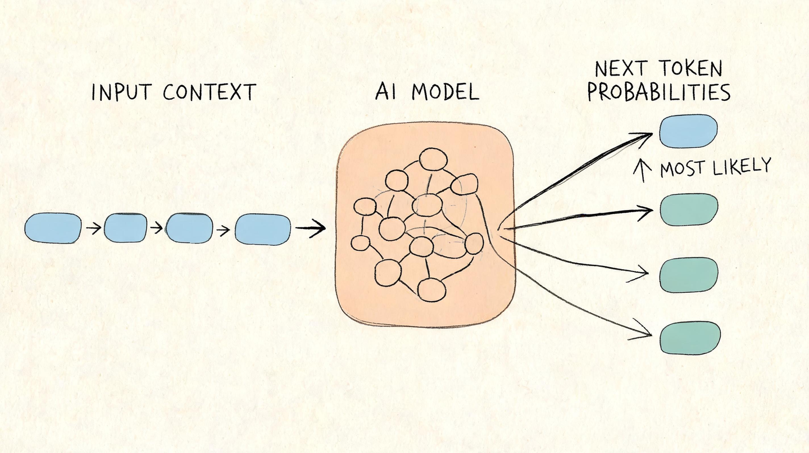
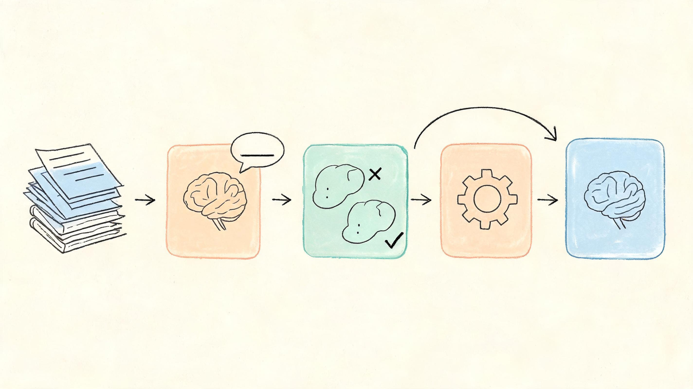
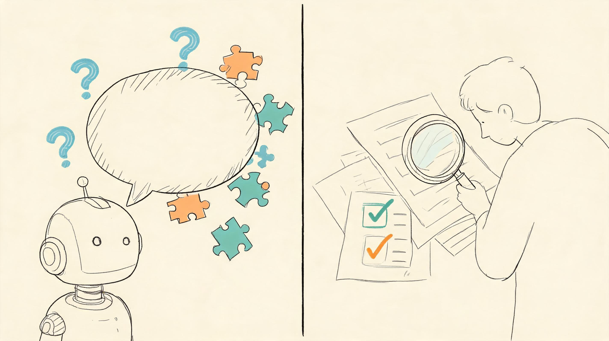

# AI 模型到底是怎么“思考”的？看懂这个，你就超过了大多数人

很多人第一次用 AI，都会有一种错觉：它好像真的懂我。

你问它：“帮我写一封请假邮件。”

它立刻写出来。

你问它：“为什么天空是蓝色的？”

它也能解释得头头是道。

你甚至让它模仿某种语气、总结一篇文章、写一段代码，它都能接住。

于是问题来了：AI 模型到底是怎么工作的？它真的在“思考”吗？

答案可能有点反直觉：大多数 AI 模型并不是像人一样理解世界，而是在做一件极其复杂的事——根据上下文预测接下来最可能出现的内容。

听起来很简单，但这正是它厉害的地方。

## 一、AI 模型像一个“超级接话高手”

你可以把 AI 模型想象成一个读过海量书籍、网页、代码、问答和文章的人。

当你输入一句话：

> “人工智能正在改变……”

它会根据过去见过的大量语言模式，判断后面最可能接什么。

可能是：

> “我们的工作方式。”

也可能是：

> “教育、医疗和金融行业。”

如果你继续追问，它会继续根据上下文预测下一句话、下一个词，甚至下一个段落。

所以，从表面看，它像是在回答问题；从底层看，它其实是在根据上下文不断生成“最合理的下一个片段”。

这就是很多大语言模型的基本工作方式。

## 二、为什么它能回答得这么像人？

关键在于两个字：训练。

AI 模型在正式使用前，会先经历一个漫长的学习过程。工程师会把大量文本数据交给模型，让它反复练习一件事：

给定前面的内容，猜后面会出现什么。

比如：

> “春眠不觉晓，处处闻……”

模型一开始可能乱猜。

但猜错了，就会被调整；猜对了，就会被强化。

经过无数轮训练后，它开始掌握语言里的规律：什么词常常一起出现，什么句子更符合逻辑，什么回答更像人类会说的话。

这有点像小孩学说话。小孩并不是先学语法公式，再开口说话，而是在大量听、模仿、反馈中，逐渐形成语言能力。

AI 也是类似，只不过它的“阅读量”和“练习次数”远远超过普通人。

## 三、AI 真的“懂”内容吗？

这要看你怎么定义“懂”。

如果“懂”指的是像人一样拥有感受、经验和意识，那现在的 AI 并不具备。

它不知道什么叫饿，也没有真正看过天空，更没有人生经历。

但如果“懂”指的是能识别语言关系、总结信息、迁移知识、生成合理回答，那它确实表现出了某种“理解能力”。

举个例子。

你问它：

> “如果一个人下雨天没带伞，他可能会怎样？”

它能回答：

> “可能会被淋湿，或者找地方避雨。”

这不是因为它真的站在雨里，而是因为它从大量文本中学到了“下雨、没伞、淋湿、避雨”之间的关系。

所以更准确地说：AI 不是用人的方式理解世界，而是用数据和概率建立了一套语言世界的地图。

## 四、为什么有时候 AI 会胡说？

既然 AI 是根据概率生成内容，它就可能遇到一个问题：它生成的是“看起来合理”的答案，而不一定是真实答案。

这就是很多人说的“AI 幻觉”。

比如你让它引用一本不存在的书、编一个专家观点、解释一个模糊概念，它可能会一本正经地编出内容。

原因不是它故意骗人，而是它的目标并不是“保证事实完全正确”，而是“生成最符合上下文的回答”。

这也是为什么我们使用 AI 时，不能把它当成绝对权威。它更像一个效率很高的助手，而不是一个永远正确的老师。

真正会用 AI 的人，一定会做三件事：

- 会提清楚问题

- 会判断回答质量

- 会验证关键信息

不会用的人，只会复制粘贴；会用的人，能让 AI 放大自己的能力。

## 五、普通人为什么应该学一点 AI 原理？

很多人觉得，AI 原理是程序员、算法工程师才需要懂的东西。

其实不是。

你不需要一上来就学公式、写模型、看论文。但你至少要明白：AI 擅长什么，不擅长什么；它为什么能回答，为什么会出错；什么样的问题能得到好结果，什么样的提问会让它胡说。

这就像开车不一定要会造发动机，但你最好知道油门、刹车、方向盘怎么配合。

未来几年，AI 会越来越像办公软件一样普及。写作、设计、编程、数据分析、客服、运营、教育，都会被它改变。

真正的差距，不是“用不用 AI”，而是“会不会正确地用 AI”。

## 六、看懂 AI，其实没那么难

AI 模型的工作原理，可以先记住这句话：

它通过大量数据学习语言规律，再根据你的输入，生成最可能、最符合上下文的回答。

这句话不复杂，但它能帮你避开很多误区。

你不会再神化 AI，觉得它无所不能；也不会轻视 AI，觉得它只是高级搜索框。

你会开始知道：什么时候该让它帮你发散，什么时候该让它总结，什么时候该让它检查，什么时候必须自己判断。

这才是普通人学习 AI 的真正价值。

如果你也想系统看懂 AI 模型的底层逻辑，但又不想一开始就被数学公式劝退，可以从一门面向零基础的 AI 原理课开始。

先把核心概念讲明白，再理解模型训练、提示词、幻觉、多模态和实际应用。当你知道 AI 是怎么工作的，你使用它的方式会完全不一样。

因为未来最有竞争力的人，不一定是最懂技术的人，而是最先学会和 AI 协作的人。

---

### 关于 ArchAIHarness

这篇文章是「看懂 AI 与智能体」专栏的一部分，由 [**ArchAIHarness**](https://github.com/ArchAIHarness) 持续输出。

ArchAIHarness 是一套面向 AI 时代软件工程的人机协同架构哲学与公开工程资产，主张：

> **架构师定义秩序，AI 在秩序中生长。人立法，AI 执行，体系审计。**

如果你也希望 AI 在明确的架构边界内协作，而不是在混沌中碰运气，欢迎到 GitHub 上看看我们在做什么：

- **组织主页**：[github.com/ArchAIHarness](https://github.com/ArchAIHarness) — 了解完整理念与资产全景
- **本专栏**：[`zhuanlan-ai-and-agents`](https://github.com/ArchAIHarness/zhuanlan-ai-and-agents) — 所有文章的源码与发布记录
- **实践指南**：[`docs`](https://github.com/ArchAIHarness/docs) — 架构哲学、工程方法和落地指南
- **开源工具**：[`agent-workflows`](https://github.com/ArchAIHarness/agent-workflows) — 可复用的 AI 协作 Agents、Skills 与 Tools
- **工程样例**：[`framework`](https://github.com/ArchAIHarness/framework) — DDD + AI 协作的工程底座，展示如何在开发中融合 AI

> Engineered by Architects · Empowered by AI · Audited by Discipline
