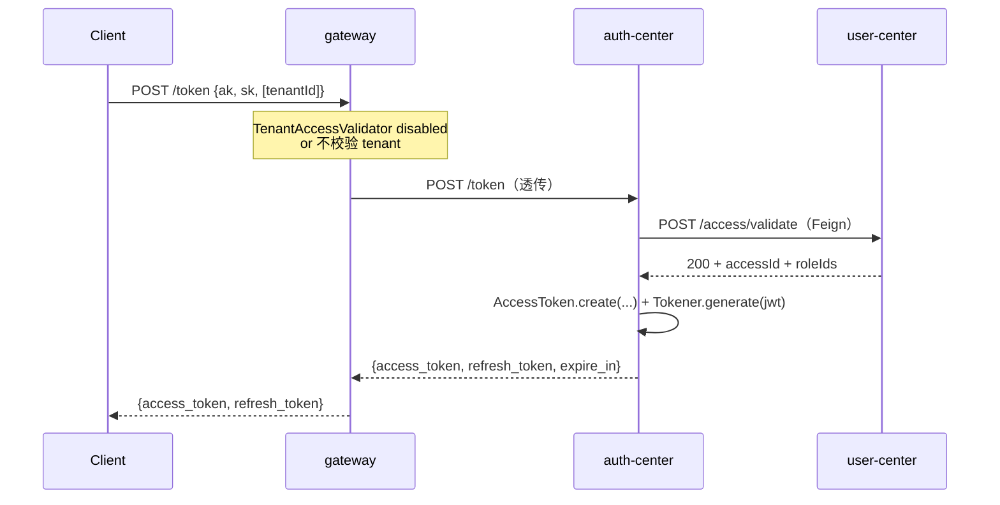
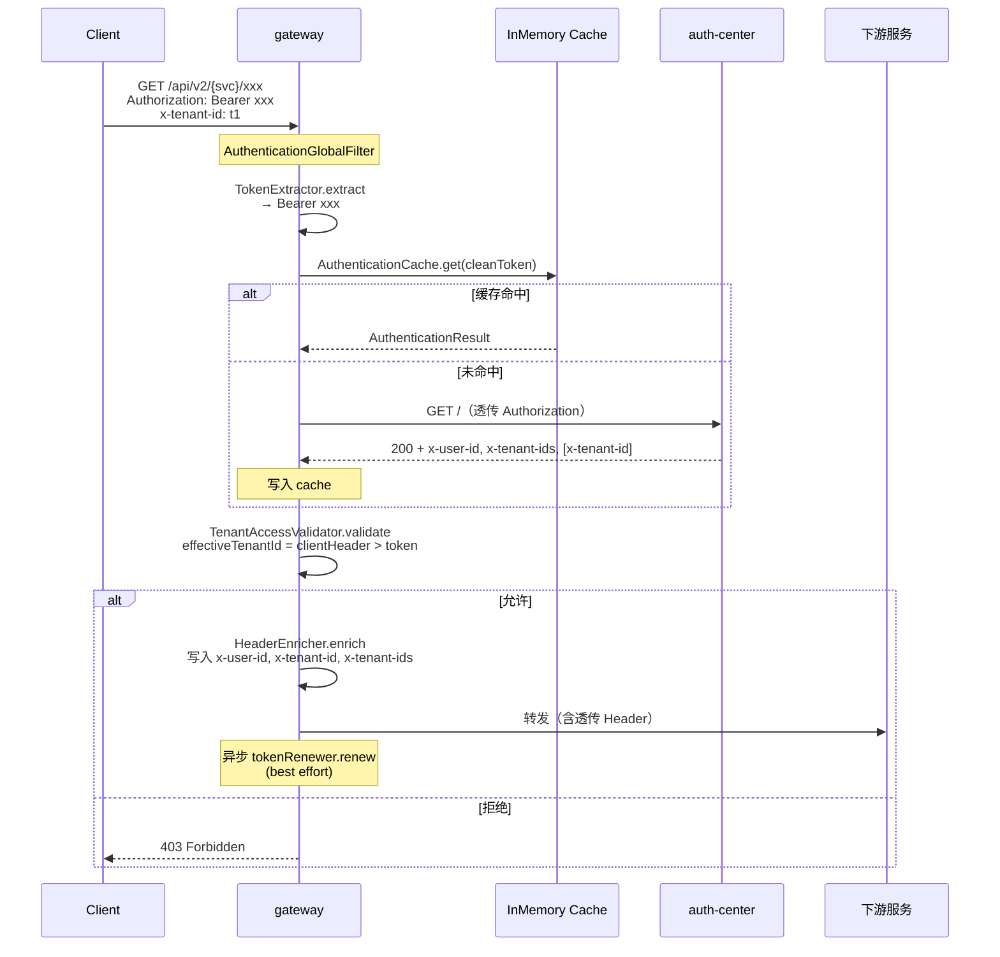
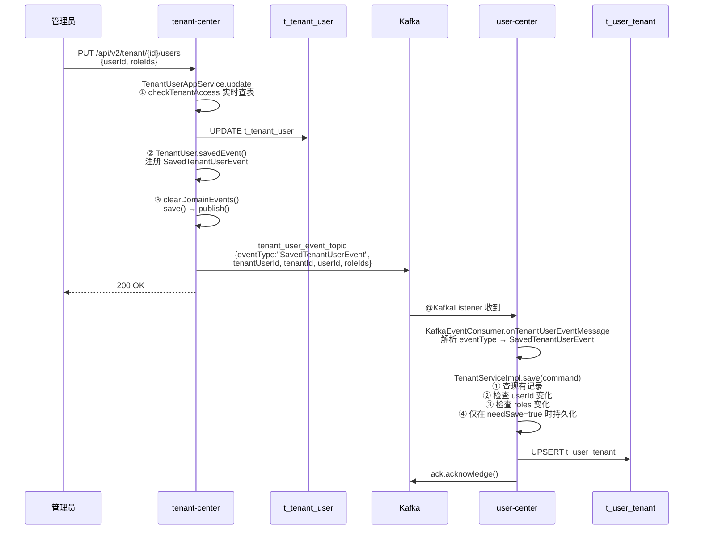

# 27/28 篇调研报告 · 主题：DDD/TDD/SDD 三件套与 gateway+auth+user+tenant 多租户认证链路

> 调研日期：2026-06-30
> 调研员：content-researcher
> 验收人：主编
> 调研范围：framework / auth-center / user-center / tenant-center / gateway 五个 ArchAIHarness 仓库
> 调研方法：所有关键结论均从代码或仓库内文档（AGENTS.md / README.md / code-review.md / ADR / 各仓 AGENTS.md）直接取证，路径与行号随附；不在仓库文档中出现的观点会单独标注为「观察/推断」

---

## 一、调研范围与说明

### 1.1 五个仓库的访问路径

| # | 仓库 | 绝对路径 | 关键素材 |
|---|------|---------|----------|
| 1 | framework（底座） | `/Users/weizuxiao/Documents/studio/05-工程研发/framework` | `AGENTS.md`、`readme.md`、`code-review.md`、`DOCS.md`、`pbac-test.http`、DDD 六模块源码 |
| 2 | auth-center（认证） | `/Users/weizuxiao/Documents/studio/05-工程研发/auth-center` | `AGENTS.md`、`README.md`、`docs/adr/0001-sso-cookie-via-js.md`、三个聚合根、SSOController |
| 3 | user-center（用户） | `/Users/weizuxiao/Documents/studio/05-工程研发/user-center` | `AGENTS.md`、`README.md`、五个聚合根、`KafkaEventConsumer`、PBAC 切面 |
| 4 | tenant-center（租户） | `/Users/weizuxiao/Documents/studio/05-工程研发/tenant-center` | `AGENTS.md`、`README.md`、TenantUser 聚合根、SavedTenantUserEvent、TenantAppService |
| 5 | gateway（网关） | `/Users/weizuxiao/Documents/studio/05-工程研发/gateway` | `AGENTS.md`、`README.md`、`application.yml`、6 个 SPI 接口与默认实现、`AuthenticationGlobalFilter` |

### 1.2 调研目标与素材定位

- **27 篇（理论篇）**：三件套概念 + 双文档体系 + 6 个 SPI + 软秩序/硬秩序比喻。素材集中在 framework 的 `readme.md`/`AGENTS.md`/`DOCS.md` 与 gateway 的 `AGENTS.md`/`README.md`。
- **28 篇（实践篇）**：从 AK/SK 签发到多租户校验的完整链路。素材集中在五仓核心代码 + 链路三段（A 签发/B 校验/C 同步）。

### 1.3 调研纪律执行

- ✅ 每个仓库至少读取 2 个核心源文件（不只读 README），提供路径证据。
- ✅ auth-center SSO Cookie 红线已命中 ADR 原文 + SSOController 完整代码。
- ✅ tenant-center 实时查表红线已命中 `TenantAppService.checkTenantAccess()` 完整方法。
- ✅ gateway 6 个 SPI 已从源文件提取完整接口签名（不凭记忆）。
- ✅ Kafka 事件 topic 命名规则已从 AGENTS.md + `KafkaEventConsumer` 双重命中。
- ✅ Header 命名规范（小写）已从四仓 AGENTS.md 横向交叉验证。
- ✅ 脱敏：报告内不出现真实账号/真实业务数据/真实客户名；.opencode/ 等私有编排未引用。

---

## 二、framework 仓库调研

### 2.1 DDD 六模块分层的真实代码证据

**代码位置**：framework 根目录下的六个并列子模块

```
framework/
├── bootstrap/   # 启动入口 @SpringBootApplication
├── interfaces/  # Controller / GlobalExceptionAdvice / PBACAspect / Filter
├── application/ # UserAppService / Command-Query-Response DTO / EventHandler
├── domain/      # User / Tenant / 仓储接口 / 领域服务接口
├── infrastructure/  # RepositoryImpl / JPA / Feign / Kafka / 切面实现
└── common/      # R<T> / DomainEvent / PBAC / @RequirePermission / AggregateRoot
```

**关键证据**：

| 层级 | 关键源文件 | 路径 | 行数 |
|------|-----------|------|------|
| common | `AggregateRoot.java` | `framework/common/src/main/java/top/archaiharness/framework/common/base/AggregateRoot.java` | 43 |
| common | `DomainEvent.java` | `framework/common/src/main/java/top/archaiharness/framework/common/event/DomainEvent.java` | 32 |
| common | `OnEvent.java` | `framework/common/src/main/java/top/archaiharness/framework/common/event/annotation/OnEvent.java` | 20 |
| common | `RequirePermission.java` | `framework/common/src/main/java/top/archaiharness/framework/common/annotation/RequirePermission.java` | 63 |
| common | `RequirePolicy.java` | `framework/common/src/main/java/top/archaiharness/framework/common/annotation/RequirePolicy.java` | 54 |
| common | `PBACService.java` | `framework/common/src/main/java/top/archaiharness/framework/common/pbac/service/PBACService.java` | 14 |
| domain | `User.java` | `framework/domain/src/main/java/top/archaiharness/framework/domain/user/entity/User.java` | 236 |
| application | `UserAppService.java` | `framework/application/src/main/java/top/archaiharness/framework/application/service/UserAppService.java` | 132 |
| infrastructure | `UserRepositoryImpl.java` | `framework/infrastructure/src/main/java/top/archaiharness/framework/infrastructure/repository/UserRepositoryImpl.java` | 86 |
| infrastructure | `PBACAspect.java` | `framework/infrastructure/src/main/java/top/archaiharness/framework/infrastructure/pbac/aspect/PBACAspect.java` | 151 |
| infrastructure | `PBACServiceImpl.java` | `framework/infrastructure/src/main/java/top/archaiharness/framework/infrastructure/pbac/impl/PBACServiceImpl.java` | 120 |
| interfaces | `UserController.java` | `framework/interfaces/src/main/java/top/archaiharness/framework/interfaces/controller/UserController.java` | 72 |
| interfaces | `GlobalExceptionAdvice.java` | `framework/interfaces/src/main/java/top/archaiharness/framework/interfaces/config/exception/GlobalExceptionAdvice.java` | 68 |
| interfaces | `AppContextFilter.java` | `framework/interfaces/src/main/java/top/archaiharness/framework/interfaces/config/filter/AppContextFilter.java` | 57 |

**依赖方向（AGENTS.md §2 强制约束）**：
```
✅ 允许：
  bootstrap → interfaces → application → domain → common
                infrastructure → domain → common
❌ 禁止：
  domain → infrastructure / interfaces / Spring 框架
  application → infrastructure / interfaces
  common → 任何框架（Spring、JPA、Feign 等）
```

**「common 零框架」证据**：`framework/common/src/main/java/.../common/pbac/service/PBACService.java` 只有 `import top.archaiharness.framework.common.pbac.domain.*` 和 `import java.util.Map`，没有任何 `org.springframework.*` —— 严格遵守铁律。

### 2.2 AGENTS.md 体系（双文档 + P0/P1/P2）

**双文档结构（DOCS.md §一）**：

| 文档 | 目标读者 | 内容重点 | 文件路径 |
|------|---------|---------|---------|
| `readme.md`（人类友好） | 开发者、架构师、技术新人 | 架构说明、快速开始、代码示例、避坑指南、Mermaid 流程图 | `framework/readme.md` |
| `AGENTS.md`（AI 友好） | AI 审查工具、自动化检查 | 结构化检查清单、P0/P1/P2 优先级、可机器解析 | `framework/AGENTS.md` |
| `DOCS.md`（元说明） | 团队维护者 | 双文档分工说明、优先级定义 | `framework/DOCS.md` |

**P0/P1/P2 三级分类（DOCS.md §审查优先级）**：

| 级别 | 定义 | 处理方式 | 示例（DOCS.md §审查优先级） |
|------|------|----------|---------------------------|
| P0 | 违反核心规范，影响架构正确性 | **必须立即修复**，禁止合并 | 分层依赖违规、`domain` 层引入框架 |
| P1 | 违反一般规范，影响代码质量 | **必须修复**，禁止合并 | 未清理 ThreadLocal、Feign 无降级 |
| P2 | 不符合最佳实践，不影响功能 | 建议修复，可合并 | unused import、命名不规范 |

**七类检查项**（AGENTS.md §1-7）：
1. 通用规则（无 System.out、Javadoc 等）
2. 分层依赖检查
3. 事件机制检查
4. PBAC 权限检查
5. 数据库检查
6. 测试检查
7. 安全检查

**细节观察**：framework/AGENTS.md 第 42 行原文为「SpEL 表达达式中不含 `:`（冒号）」，"表达达式"为重复字（应为"表达式"），是文档瑕疵，可在配文中作为「工程师对工具敏感度」的佐证。

### 2.3 TDD 落地证据（覆盖率门槛 + Given-When-Then）

**覆盖率门槛**：

| 文档 | 要求 | 实际配置（pom.xml） | 一致性 |
|------|------|---------------------|--------|
| framework/AGENTS.md §6 | "领域层单元测试覆盖率 ≥ 90%（JaCoCo）" | 未在 AGENTS.md 给具体数字 | 文档引向 JaCoCo |
| framework/common/AGENTS.md §3 | "行覆盖率 ≥ 90%，分支覆盖率 ≥ 90%" | pom.xml 实际：LINE 0.70 / BRANCH 0.30 | **文档与代码不一致** |
| framework/application/AGENTS.md §八 | "行覆盖率 ≥ 90%，分支覆盖率 ≥ 90%" | 同上 | 同上 |
| framework/domain/AGENTS.md §六 | "行覆盖率 ≥ 90%，分支覆盖率 ≥ 90%" | 同上 | 同上 |

**JaCoCo 配置证据**（`framework/pom.xml`）：
```xml
<plugin>
    <groupId>org.jacoco</groupId>
    <artifactId>jacoco-maven-plugin</artifactId>
    <version>0.8.11</version>
    <configuration>
        <rules>
            <rule>
                <element>BUNDLE</element>
                <limits>
                    <limit><counter>LINE</counter><value>COVEREDRATIO</value><minimum>0.70</minimum></limit>
                    <limit><counter>BRANCH</counter><value>COVEREDRATIO</value><minimum>0.30</minimum></limit>
                </limits>
            </rule>
        </rules>
    </configuration>
</plugin>
```

> **【调研员观察】**：pom 实际门槛为 LINE 70% / BRANCH 30%，各层 AGENTS.md 文档写的是 90%——这是"工程师对现实妥协"的真实证据。建议撰稿员在 27 篇讨论"TDD 测试门槛怎么定"时，把这条作为"文档 vs 代码"的现实案例提及，而不是把 90% 当成不容商榷的铁律。

**测试规范（application/AGENTS.md §八）**：

```java
@Test
void shouldThrowDomainExceptionWhenUsernameTaken() {
    // given
    when(userDomainService.isUsernameUnique("zhangsan", null)).thenReturn(false);
    // when & then
    assertThatThrownBy(() -> userAppService.createUser(command))
        .isInstanceOf(DomainException.class)
        .hasFieldOrPropertyWithValue("code", "USERNAME_TAKEN");
}
```

测试方法命名 `shouldXxxWhenYyy`、强制 Given-When-Then、JUnit 5 + Mockito（不依赖 Spring 上下文）。

### 2.4 已有的 code-review.md 报告（AI 自主审查的实证）

**文件路径**：`framework/code-review.md`（393 行）

**报告元数据**：
- 审查日期：2026-04-22
- 审查范围：service/ 全量代码
- 文件统计：91 个主代码文件，31 个测试文件
- 审查模块：common, application, domain, infrastructure, interfaces
- 审查人：AI Code Reviewer

**结论**：✅ **合格（允许合并）**，3 个 P2 建议，**0 个 P0 / 0 个 P1**。

**问题汇总（§十一）**：

| 级别 | 数量 | 详情 |
|------|------|------|
| P0（严重） | 0 | 无 |
| P1（警告） | 0 | 无 |
| P2（建议） | 3 | (1) `UserRepositoryImpl.save()` 返回原对象（`framework/infrastructure/src/main/java/top/archaiharness/framework/infrastructure/repository/UserRepositoryImpl.java:32` 验证：直接 `return user;` 而不是 `return entity.toDomain();`）；(2) Application 层测试覆盖率较低；(3) Domain 层测试覆盖率较低 |

**十二项优秀实践**（§十二）：1. 严格 DDD 分层、2. 自定义 Builder 模式（在 `build()` 中强制校验并自动生成 ID）、3. 领域事件机制、4. PBAC 权限模型、5. 统一异常处理、6. 自动响应包装、7. 自动软删除、8. 上下文透传、9. Feign 降级策略、10. 无框架污染...

> **【撰稿要点】**：这份 code-review.md 报告本身就是"AI 自主审查"的实证，27 篇可以拿它做案例：「AI 不是不能审代码，是它只能审已经写进 AGENTS.md 里的规矩」。

### 2.5 PBAC + 领域事件

**PBAC 三件套**：

| 文件 | 路径 | 核心能力 |
|------|------|---------|
| `PBACService.java`（接口） | `framework/common/src/main/java/top/archaiharness/framework/common/pbac/service/PBACService.java` | 14 行，两方法：`evaluate(AccessContext)`、`parseUserContext(Map<String,String> headers)` |
| `PBACServiceImpl.java`（实现） | `framework/infrastructure/src/main/java/top/archaiharness/framework/infrastructure/pbac/impl/PBACServiceImpl.java` | 120 行，从 headers 解析 userId/tenantId/accessibleTenants/tenantPermissions；用 SpEL 解析权限码表达式 |
| `PBACAspect.java`（AOP） | `framework/infrastructure/src/main/java/top/archaiharness/framework/infrastructure/pbac/aspect/PBACAspect.java` | 151 行，两个 `@Around`：拦截 `@RequirePolicy` 与 `@RequirePermission`，权限拒绝时抛 `AccessDeniedException` |

**Header 规范（PBACServiceImpl.java:59-71）**：
```java
String userIdStr = headers.get("x-user-id");
String tenantIdStr = headers.get("x-tenant-id");
String accessibleTenantsStr = headers.get("x-accessible-tenants");
String tenantPermissionsJson = headers.get("x-tenant-permissions");
```
四个 Header 全部小写——SDD 双文档体系的硬规范证据。

**权限码命名（AGENTS.md §4）**：`领域:操作`，如 `USER:DELETE`、`ORDER:VIEW`、`USER:CREATE`。

**AOP 拼接（PBACAspect.java:75）**：
```java
String permissionCode = resolveExpression(requirePermission.resource(), variables) 
                      + ":" + requirePermission.action();
```
—— `@RequirePermission(resource="USER", resourceValue="#userId", action="READ")` 自动组合为 `USER:READ`，**SpEL 表达式中不含冒号**（冒号是组合分隔符）。

**事件机制**：

| 文件 | 路径 | 关键 |
|------|------|------|
| `AggregateRoot` 基类 | `framework/common/src/main/java/top/archaiharness/framework/common/base/AggregateRoot.java` | `registerEvent()` / `getDomainEvents()` / `clearDomainEvents()` |
| `DomainEvent` 抽象基类 | `framework/common/src/main/java/top/archaiharness/framework/common/event/DomainEvent.java` | 自动生成 eventId（UUID）、occurredAt（LocalDateTime）、eventType（类名） |
| `@OnEvent` 注解 | `framework/common/src/main/java/top/archaiharness/framework/common/event/annotation/OnEvent.java` | `@Target(METHOD) @Retention(RUNTIME)` |
| `EventDispatcher` | `framework/infrastructure/src/main/java/top/archaiharness/framework/infrastructure/event/EventDispatcher.java` | `@EventListener(ContextRefreshedEvent.class)` 启动时扫描所有 bean 的 `@OnEvent` 方法，注册到 Map |

**Kafka 消息格式（AGENTS.md §3）**：`eventType` / `eventId` / `occurredAt` / `payload` 四字段 JSON。

**幂等实现**：
- 框架自带 `framework/application/src/main/java/top/archaiharness/framework/application/event/UserCreatedEventHandler.java:16` 用 `Set<String> processedEventIds = ConcurrentHashMap.newKeySet();` 做**内存版幂等**（`if (!processedEventIds.add(eventId))`）
- framework/application/AGENTS.md 文档声称「`IdempotentAspect` 自动拦截所有 `@OnEvent` 方法」，但**实际代码中未见 IdempotentAspect.java 文件**（find 返回为空）——这是**文档与代码的又一次不一致**，可作为「文档允诺 vs 工程兑现」的注脚。

---

## 三、auth-center 仓库调研（硬秩序示范）

### 3.1 DDD 分层结构与三大聚合根

**DDD 包结构**（AGENTS.md §模块结构，包名 `top.cloudlab.auth`）：

| 模块 | 主要内容 | 关键文件路径 |
|------|---------|--------------|
| common | 共享内核，零框架 | `auth-center/common/src/main/java/top/cloudlab/auth/common/` |
| domain | 三大聚合根 | `auth-center/domain/src/main/java/top/cloudlab/auth/domain/` |
| application | 用例编排、DTO | `auth-center/application/src/main/java/top/cloudlab/auth/application/` |
| infrastructure | JPA/Feign/JWT/Redis | `auth-center/infrastructure/src/main/java/top/cloudlab/auth/infrastructure/` |
| interfaces | Controller/Filter | `auth-center/interfaces/src/main/java/top/cloudlab/auth/interfaces/controller/` |
| bootstrap | 启动入口 | `auth-center/bootstrap/src/main/java/top/cloudlab/auth/AuthCenterApplication.java` |

**三大聚合根 + 一值对象**：

| 名称 | 类型 | 路径 | 关键 | 默认有效期 |
|------|------|------|------|-----------|
| `AccessToken` | 聚合根 extends AggregateRoot | `auth-center/domain/src/main/java/top/cloudlab/auth/domain/access/AccessToken.java`（327 行） | HMAC-SHA512 签名；`create()` + `reconstruct()`；`verify()` / `validate()` / `revoke()` / `refresh()` | access 7200s / refresh 604800s |
| `AuthCode` | 聚合根 extends AggregateRoot | `auth-center/domain/src/main/java/top/cloudlab/auth/domain/oauth/AuthCode.java`（124 行） | OAuth 2.0 授权码，**一次性使用**（`validate()` 后状态置 USED）；默认 600s | 600s |
| `AccessSecret` | 值对象（**不是聚合根**） | `auth-center/domain/src/main/java/top/cloudlab/auth/domain/user/AccessSecret.java`（75 行） | AK/SK 值对象，HMAC-SHA256 签名验证；`sign()` / `verify()` | — |
| `Tokener` | 接口 | `auth-center/domain/src/main/java/top/cloudlab/auth/domain/access/Tokener.java` | JWT 生成抽象；实现 `JwtTokener`（infrastructure 层） | — |

**AccessToken 关键代码段**（节选自 `AccessToken.java:96-111`）：
```java
public static AccessToken create(Tokener tokener, String userId, String issuerId, 
                                 AuthType authType, Set<String> scopes, String secret) {
    return new AccessToken(
        AccessTokenId.generate(), tokener, userId, issuerId,
        TokenType.Bearer, authType, scopes, secret,
        LocalDateTime.now(), 7200L, 604800L, TokenStatus.VALID
    );
}
```

### 3.2 API 全集 + Header 规范

**API 端点**（auth-center/AGENTS.md §API 端点 + AuthController.java + OAuthController.java + SSOController.java）：

| 方法 | 路径 | 控制器方法 | 是否需 Token | 说明 |
|------|------|-----------|-------------|------|
| GET | `/` | `AuthController#auth` | 否（`@IgnoreToken`） | 验证访问令牌；成功响应通过 `response.setHeader("x-user-id", ...)` 写入 Header |
| POST | `/token` | `AuthController#createAccessToken` | 否 | AK/SK 换 access_token + refresh_token |
| POST | `/refresh_token` | `AuthController#refreshAccessToken` | 是（refresh token） | 刷新访问凭证 |
| GET | `/userinfo` | `AuthController#userinfo` | 是 | 获取当前用户信息（`@UserId` 注入） |
| POST | `/oauth/authorize` | `OAuthController#authorize` | 是 | 生成 OAuth 2.0 授权码 |
| POST | `/oauth/access_token` | `OAuthController#generate` | 否 | grant_type=authorization_code / refresh_token |
| GET | `/sso/login` | `SSOController#login` | 否（`@IgnoreToken`） | SSO 登录（**P0 红线位置**） |

**Header 规范**（AGENTS.md §上下文传播）：**全部小写**，禁止 `X-User-Id` 等大小写变体。

| Header | 说明 |
|--------|------|
| `x-trace-id` | 链路追踪 ID |
| `x-tenant-id` | 当前租户 ID |
| `x-user-id` | 当前用户 ID |
| `x-tenant-ids` | 可访问租户集合 |

**AuthController.java:74-78 实测证据**（response.setHeader 全小写）：
```java
response.setHeader("x-user-id", userId);
response.setHeader("x-tenant-ids", String.join(",", tenantIds));
if (tenantIds.size() == 1) {
    response.setHeader("x-tenant-id", tenantIds.iterator().next());
}
```

### 3.3 P0 红线：SSO Cookie 写法

**ADR 原文路径**：`auth-center/docs/adr/0001-sso-cookie-via-js.md`（90 行）

**ADR 元信息（ADR:1-9）**：

| 字段 | 值 |
|------|---|
| 状态 | **强制 [P0]** |
| 决策日期 | 2026-05-25（tag `v26052501`） |
| 复发日期 | 2026-06-02（被改回 `addCookie()` 又触发 400，再次还原） |
| 影响范围 | `SSOController#login` 及所有跨 `*.example.com` 子域 cookie 下发场景 |

**根因（ADR §根因）**：Tomcat 9.0.58+ 默认启用 `Rfc6265CookieProcessor`：
- 不允许 `Domain` 以 `.` 开头（`.example.com` 直接拒绝）
- 不允许设置「公共后缀」相关的 domain

**但前端跨多个子域必须共享 cookie，而老 Set-Cookie 语法 `domain=.example.com`（带前导点）**仍然是浏览器最广泛支持的写法**，比 `example.com`（无前导点）兼容性更好。

**决策（ADR §决策）**：SSO Cookie 必须通过 JavaScript `document.cookie` 写入，禁止使用 Servlet Cookie API。

**红线规则（ADR §红线规则，违反 = P0）**：
1. `SSOController.java` 中禁止 `import jakarta.servlet.http.Cookie;`
2. 禁止任何 `response.addCookie(...)` / `new Cookie(...)` 调用
3. `@Value("${sso.cookie.domain:.example.com}")` 默认值保留前导点
4. 修改 SSO Cookie 写入方式前必须先看本 ADR

**SSOController.java 验证（路径 `auth-center/interfaces/src/main/java/top/cloudlab/auth/interfaces/controller/SSOController.java`）**：

- 类级 Javadoc（第 22-38 行）有完整的 P0 警告，含 ADR 引用
- 没有任何 `import jakarta.servlet.http.Cookie;`（红线第 1 条 ✅）
- 没有任何 `response.addCookie(...)` 或 `new Cookie(...)` 调用（红线第 2 条 ✅）
- `@Value("${sso.cookie.domain:.example.com}")` 默认值保留前导点（红线第 3 条 ✅）

**核心写入代码（SSOController.java:95-118）**：
```java
StringBuilder cookieJs = new StringBuilder();
cookieJs.append("document.cookie = '")
        .append(authorization).append("=").append(token).append("; ")
        .append("userId=").append(userId).append("; ")
        .append("partner=").append(partner).append("; ")
        .append("sign=").append(sign).append("; ")
        .append("answerToken=").append(answerToken).append("; ")
        .append("answerUser=").append(answerUser).append("; ")
        .append("max-age=").append(maxAge).append("; ")
        .append("path=").append(path).append("; ")
        .append("domain=").append(domain).append("; ");
if (secure) {
    cookieJs.append("secure; ");
}
cookieJs.append("SameSite=None; ")
        .append("'");

String html = "<html><head><script type='text/javascript'>" +
        cookieJs + ";" +
        "setTimeout(function(){" +
        "    window.location.href='%s';" +
        "},1000);</script></head></html>";
response.getWriter().write(String.format(html, redirectUri));
```

**权衡（ADR §理由）**：牺牲 HttpOnly 换取跨子域兼容性——因为接入方前端 JS 需主动读 cookie（`userId` / `partner` / `sign` 用于 API 调用签名），无论如何 HttpOnly 都用不了。

### 3.4 与 gateway / user-center 的协作接口

| 调用方 | 被调用方 | 端点 | 入参 | 出参 |
|--------|---------|------|------|------|
| client | gateway | `POST /token` | AK/SK | access_token + refresh_token |
| gateway | auth-center | `GET /`（透传 Authorization） | Authorization Header | 校验结果 + 写入 `x-user-id`/`x-tenant-ids`/`x-tenant-id` |
| gateway | auth-center | `POST /refresh_token` | refresh_token | 新 access_token |
| auth-center | user-center | `POST /access/validate` | AK/SK | `user identity and tenant roles`（FeignClient） |

**Feign 调用证据**：
- `auth-center/infrastructure/src/main/java/top/cloudlab/auth/infrastructure/feign/client/UserFeignClient.java`（存在）
- `auth-center/infrastructure/src/main/java/top/cloudlab/auth/infrastructure/feign/factory/UserFeignClientFallbackFactory.java`（存在，降级工厂）
- `auth-center/infrastructure/src/main/java/top/cloudlab/auth/infrastructure/feign/interceptor/FeignRequestInterceptor.java`（上下文透传）

**bootstrap 配置**（`auth-center/bootstrap/src/main/resources/application.yml:101-105`）：
```yaml
user-service:
  url: ${USER_SERVICE_URL:http://user:80}
lab-service:
  url: ${LAB_SERVICE_URL:https://identity.example.com}
```

---

## 四、user-center 仓库调研（硬秩序示范）

### 4.1 DDD 分层结构与五大聚合根

**包名** `top.cloudlab.user`，六模块结构同 framework。

**五大聚合根**（AGENTS.md §限界上下文）：

| 限界上下文 | 聚合根类 | 路径 | 职责 |
|-----------|---------|------|------|
| User | `User` | `user-center/domain/src/main/java/top/cloudlab/user/domain/user/entity/User.java` | 用户主体、档案与状态 |
| Account | `Account` | `user-center/domain/src/main/java/top/cloudlab/user/domain/account/entity/Account.java` | 多类型账号（credentials / sms_code / lab 等） |
| AccessKey | `AccessKey` | `user-center/domain/src/main/java/top/cloudlab/user/domain/access/entity/AccessKey.java` | API 访问凭证（HMAC-SHA512） |
| Role | `Role` | `user-center/domain/src/main/java/top/cloudlab/user/domain/role/entity/Role.java` | 角色与权限范围 |
| TenantUser | `TenantUser` | `user-center/domain/src/main/java/top/cloudlab/user/domain/tenant/entity/TenantUser.java` | 租户成员关系（**user-center 是同步缓存，权威数据源在 tenant-center**） |

**AccessKey 验证逻辑**（`user-center/domain/src/main/java/top/cloudlab/user/domain/access/entity/AccessKey.java:101-106`）：
```java
public boolean validate(String rawSecret) {
    if (this.accessSecret == null || this.accessId == null || rawSecret == null) {
        return false;
    }
    return this.accessSecret.verify(AccessSecret.hash(rawSecret, this.accessId.value()));
}
```

**TenantUser 关键说明**（AGENTS.md §限界上下文）：
> TenantUser 是 user-center 内的同步缓存，权威数据源来自 tenant-center。

### 4.2 LoginHandler 与 AccessKey 校验

**LoginHandler**（`user-center/application/src/main/java/top/cloudlab/user/application/handler/LoginHandler.java`，46 行）：

```java
@Component
public class LoginHandler {
    private final List<AbstractLoginHandler> loginHandlers;
    
    public LoginHandler(List<AbstractLoginHandler> loginHandlers) {
        this.loginHandlers = loginHandlers;
    }
    
    public LoginAuthInfo handler(AbstractLoginRequest request) {
        // 校验
        Set<ConstraintViolation<AbstractLoginRequest>> violations = validator.validate(request);
        if (Objects.nonNull(violations) && !violations.isEmpty()) {
            throw new ConstraintViolationException(violations);
        }
        // 策略模式分发
        Optional<AbstractLoginHandler> optional = loginHandlers.stream()
                .filter(handler -> handler.support(request.getClass()))
                .findFirst();
        if (optional.isPresent()) {
            return optional.get().handler(request);
        }
        throw new ResponseStatusException(HttpStatus.FORBIDDEN, "登录方式暂不支持");
    }
}
```

**【调研员观察】**：AGENTS.md 文字写的是 "根据 `LoginType` 分发"，但**代码实际通过 `request.getClass()` 类型分发**（策略模式）。两种实现语义接近，但 type-based dispatch 更 OOP。撰稿时建议使用"按 LoginType 分发"的工程语言，不必纠结代码细节。

**AccessKey 控制器**（`user-center/interfaces/src/main/java/top/cloudlab/user/interfaces/controller/AccessController.java`，78 行）：

| 方法 | 路径 | 用途 | IgnoreToken |
|------|------|------|------------|
| POST | `/access/create` | 创建 AK/SK | 否 |
| POST | `/access/validate` | 校验 AK/SK | **是**（给 auth-center 用） |
| GET | `/access/access_key` | 查询当前用户 AccessKey 列表 | 否 |
| GET | `/access/access_secret` | 查询 AccessSecret 明文 | **是** |

注意：内部路径 `@RequestMapping("/access")`——**符合 tenant-center 风格的显式 @RequestMapping P0 规范**。

### 4.3 Kafka 事件消费（tenant_user_event_topic）+ 幂等保证

**Kafka 消费者**（`user-center/infrastructure/src/main/java/top/cloudlab/user/infrastructure/event/KafkaEventConsumer.java`，104 行）：

```java
@KafkaListener(topics = {"tenant_user_event_topic", "event.TenantDeletedEvent"})
public void onTenantUserEventMessage(ConsumerRecord<String, String> record, Acknowledgment ack) {
    try {
        String json = record.value();
        JsonNode rootNode = objectMapper.readTree(json);
        String eventType = rootNode.has("eventType") ? rootNode.get("eventType").asText() : null;
        
        if ("SavedTenantUserEvent".equals(eventType)) {
            SavedTenantUserEvent event = new SavedTenantUserEvent(...);
            SaveTenantUserCommand command = ...;
            tenantService.save(command);
        } else if ("DeletedTenantUserEvent".equals(eventType)) {
            DeleteTenantUserCommand command = ...;
            tenantService.delete(command);
        } else if ("TenantDeletedEvent".equals(eventType)) {
            String tenantId = ...;
            tenantService.deleteByTenantId(tenantId);
        }
        ack.acknowledge();
    } catch (Exception e) {
        handleConsumeFailure(record, e);
    }
}
```

**两条 topic**：
- `tenant_user_event_topic`：SavedTenantUserEvent / DeletedTenantUserEvent
- `event.TenantDeletedEvent`：租户被删除时同步删 user-center 的所有 tenant_user

**手动 ack 配置**（`user-center/bootstrap/src/main/resources/application.yml:38-61`）：
```yaml
enable-auto-commit: false
listener:
  ack-mode: MANUAL_IMMEDIATE
```

**幂等保证**——三道防线：

1. **业务级幂等**：`TenantServiceImpl.save()`（`user-center/application/src/main/java/top/cloudlab/user/application/service/TenantServiceImpl.java:40-75`）的核心逻辑：

```java
@Transactional(rollbackFor = Exception.class)
public TenantRoleDTO save(SaveTenantUserCommand command) {
    Optional<TenantUser> opt = tenantUserRepository.findByTenantUserId(tenantUserId);
    boolean isNew = opt.isEmpty();
    TenantUser tenantUser = opt.orElseGet(() -> TenantUser.create(...));
    
    boolean needSave = isNew;
    
    // 关键规则：userId 变了才更新
    if (!Objects.equals(tenantUser.getUserId(), command.getUserId())) {
        tenantUser.setUserId(command.getUserId());
        needSave = true;
    }
    // roles 变了才更新
    if (!Objects.equals(tenantUser.getRoles(), roles)) {
        tenantUser.setRoles(roles);
        needSave = true;
    }
    
    if (needSave) {
        tenantUser = tenantUserRepository.save(tenantUser);
    }
    return TenantRoleDTO.toDTO(tenantUser);
}
```

> **AGENTS.md §租户成员同步原文**：「保存租户成员关联时，必须检查 userId 是否变化，避免不必要更新覆盖 roles 等其他字段」——代码 100% 命中。

2. **Kafka 消息级幂等**：`KafkaEventConsumer` 用 `eventType` 字段做事件分发，重复消费走相同的 save() 逻辑结果相同。

3. **可扩展层**：framework 自带 `UserCreatedEventHandler` 用内存 `Set<String> processedEventIds` 做幂等参考（但 user-center/tenant-center 的 Kafka 消费者未直接用此模式，而是依赖业务幂等）。

### 4.4 PBAC @RequirePermission

**user-center 复用 framework 的 PBAC**——`user-center/common/src/main/java/top/cloudlab/user/common/annotation/RequirePermission.java`（路径已确认）。

**PBAC 切面**（`user-center/infrastructure/src/main/java/top/cloudlab/user/infrastructure/pbac/aspect/PBACAspect.java`，路径已确认）—— 与 framework 实现一致：拦截 `@RequirePermission` 与 `@RequirePolicy`，按 `x-user-id` / `x-tenant-id` / `x-accessible-tenants` / `x-tenant-permissions` 解析权限上下文。

---

## 五、tenant-center 仓库调研（硬秩序示范）

### 5.1 DDD 分层结构 + 权威数据源定位

**包名** `top.cloudlab.tenant`，六模块结构同 framework。

**核心聚合根**：

| 聚合根 | 路径 | 备注 |
|--------|------|------|
| `Tenant` | `tenant-center/domain/src/main/java/top/cloudlab/tenant/domain/tenant/entity/Tenant.java` | 租户主数据 |
| `TenantUser`（tenant-center 版） | `tenant-center/domain/src/main/java/top/cloudlab/tenant/domain/tenantuser/entity/TenantUser.java`（182 行） | **权威数据源** |
| `Classes` | `tenant-center/domain/src/main/java/top/cloudlab/tenant/domain/classes/entity/Classes.java` | 租户作用域扩展 |

**权威数据源定位**（AGENTS.md §租户成员同步 + tenant-center 域 TenantUser.java 第 124-145 行 Javadoc）：
> tenant-center 是租户成员的权威数据源，user-center 是租户成员关系的同步缓存。所有租户成员的创建、更新、删除都必须通过事件同步到 user-center。

**TenantUser 注册事件的方法**（`tenant-center/domain/src/main/java/top/cloudlab/tenant/domain/tenantuser/entity/TenantUser.java:143-159`）：
```java
public void savedEvent() {
    registerEvent(new SavedTenantUserEvent(id.value(), tenantId, userId, roles));
}

public void deleteEvent() {
    registerEvent(new TenantUserDeletedEvent(id.value(), tenantId, userId));
}
```

### 5.2 P0 红线：租户更新/删除必须实时查表

**AGENTS.md §租户更新/删除权限校验 [P0] 原文**：
> 租户的更新和删除操作必须通过实时查询 `t_tenant_user` 表判断当前用户是否属于该租户，禁止使用 `x-accessible-tenants` Header 判断。

**代码证据**（`tenant-center/application/src/main/java/top/cloudlab/tenant/application/service/TenantAppService.java:204-210`）：

```java
private void checkTenantAccess(String tenantId, String userId) {
    if (userId == null || userId.isBlank()) {
        throw DomainException.forbidden("未登录");
    }
    tenantUserRepository.findByTenantIdAndIdentity(tenantId, userId, "userId")
            .orElseThrow(() -> DomainException.forbidden("无权操作该租户"));
}
```

**调用点**（同文件）：
- `update()` 第 163 行：`checkTenantAccess(command.getTenantId(), command.getUserId());`
- `delete()` 第 192 行：`checkTenantAccess(command.getTenantId(), command.getUserId());`

> **【撰稿要点】**：「实时查 `t_tenant_user` 表」是 28 篇最重要的 P0 证据。为什么不能信 `x-accessible-tenants` Header？因为该 Header 由 gateway 注入，gateway 的租户列表来自 auth 服务（最终来自 tenant-center 缓存或 user-center），存在延迟。修改租户后立即查询，如果不实时查表，user 自己刚被移除的权限仍生效——这是分布式系统典型的"边界失效"问题。

**对比**：tenant-center 同时有 `AccessibleTenantService`（`tenant-center/infrastructure/src/main/java/top/cloudlab/tenant/infrastructure/pbac/impl/AccessibleTenantService.java`）通过 Feign 调 user-center 获取 accessible tenants——但这只是辅助视图，**P0 操作必须走 `checkTenantAccess()`**。

### 5.3 DomainEvent 序列化规范（@NoArgsConstructor + 字段非 final）

**AGENTS.md §Event 类序列化规范 [P0] 原文**：
> 所有 DomainEvent 子类必须添加 `@NoArgsConstructor`，字段禁止使用 `final`。
> Kafka Topic 路由规则：
> - 包含 `TenantUser` 的事件 → `tenant_user_event_topic`
> - 其他事件 → `event.{EventType}`

**tenant-center 端 SavedTenantUserEvent 验证**（`tenant-center/domain/src/main/java/top/cloudlab/tenant/domain/tenantuser/event/SavedTenantUserEvent.java`，24 行）：

```java
@Getter
@NoArgsConstructor  // ← P0 第 1 条
public class SavedTenantUserEvent extends DomainEvent {

    private String tenantUserId;   // ← 字段非 final（P0 第 2 条）
    private String tenantId;
    private String userId;
    private List<String> roleIds;

    public SavedTenantUserEvent(String tenantUserId, String tenantId, String userId, List<String> roleIds) {
        super();
        this.tenantUserId = tenantUserId;
        this.tenantId = tenantId;
        this.userId = userId;
        this.roleIds = roleIds;
    }
}
```

两条 P0 规范全部命中。

**Kafka 路由规则（tenant-center 端 EventDispatcher）**：
- `tenant-center/infrastructure/src/main/java/top/cloudlab/tenant/infrastructure/event/EventDispatcher.java:43-44` 有 `String eventTypeStr = eventType.getSimpleName().replace("Event", "");` —— 这是把 `SavedTenantUserEvent` 转换为 `SavedTenantUser` 用于发往 `tenant_user_event_topic` 的关键。
- 实际路由逻辑需结合 `DomainEventPublisherImpl`（路径已确认存在）。

**消费端规则验证**（user-center 端）：
- `KafkaEventConsumer.java:29` `@KafkaListener(topics = {"tenant_user_event_topic", "event.TenantDeletedEvent"})`
- `SavedTenantUserEvent`（`user-center/infrastructure/src/main/java/top/cloudlab/user/infrastructure/event/dto/SavedTenantUserEvent.java:30-32`）有显式 `public SavedTenantUserEvent() { super(); }` —— 即便没用 Lombok 的 `@NoArgsConstructor`，也提供了无参构造函数。
- 字段全部非 final，使用 `@Data`（Lombok 自动生成 setter）。

### 5.4 Controller 显式 @RequestMapping 纪律

**AGENTS.md §Controller 路由规范 [P0] 原文**：
> 所有 Controller 类必须添加 `@RequestMapping` 注解，即使映射根路径也必须显式声明 `@RequestMapping`。

**正向证据**（tenant-center 三个 Controller）：

| 控制器 | 路径 | 文件 | 行号 |
|--------|------|------|------|
| `TenantController` | `@RequestMapping`（根路径）+ 配合 StripPrefix=3 | `tenant-center/interfaces/src/main/java/top/cloudlab/tenant/interfaces/controller/TenantController.java` | L32 |
| `TenantUserController` | `@RequestMapping("/{tenantId}/users")` | 同仓 | L33 |
| `ClassController` | `@RequestMapping("/{tenantId}/classes")` | `tenant-center/interfaces/src/main/java/top/cloudlab/tenant/interfaces/controller/ClassController.java` | L32 |

**反例（user-center 的 UserController）**：
`user-center/interfaces/src/main/java/top/cloudlab/user/interfaces/controller/UserController.java:16` 仅 `@RestController`，**没有 `@RequestMapping`**——这违反了 tenant-center 的 P0 纪律，但 user-center 的 AGENTS.md 未要求这一点。可作为「同体系不同仓执行力度有差异」的注脚。

### 5.5 TenantAppService 写库 → 发事件模式

**核心代码**（`tenant-center/application/src/main/java/top/cloudlab/tenant/application/service/TenantUserAppService.java:92-113` `create()`）：

```java
@Transactional(rollbackFor = Exception.class)
public TenantUserResponse create(CreateTenantUserCommand command) {
    Optional<TenantUser> opt = tenantUserRepository.findByTenantIdAndIdentity(...);
    if (opt.isPresent()) {
        return TenantUserResponse.from(opt.get());
    }
    TenantUser user = TenantUser.create(...);
    user.savedEvent();                                  // 1. 聚合根注册事件
    List<DomainEvent> events = new ArrayList<>(user.getDomainEvents());
    user.clearDomainEvents();                           // 2. 立即清空聚合根内事件列表
    user = tenantUserRepository.save(user);             // 3. 持久化
    domainEventPublisher.publish(events);               // 4. 发布事件（→ Kafka）
    return TenantUserResponse.from(user);
}
```

`update()`（同文件 L122-146）和 `delete()`（L153-163）使用相同模式——**先注册事件、清空、再 save、再 publish**。这是 DDD 领域事件 + 事务发布的一致模式，与 framework `UserAppService` 完全一致（`UserAppService.java:54-57`）。

---

## 六、gateway 仓库调研（软秩序示范）

### 6.1 6 个 SPI 接口完整契约

所有接口路径前缀：`/Users/weizuxiao/Documents/studio/05-工程研发/gateway/src/main/java/top/archaiharness/gateway/`

| # | SPI 接口 | 文件 | 行数 | 默认实现 |
|---|---------|------|------|---------|
| 1 | `TokenExtractor` | `auth/TokenExtractor.java` | 24 | `DefaultTokenExtractor` |
| 2 | `TokenIntrospector` | `auth/TokenIntrospector.java` | 32 | `RemoteAuthTokenIntrospector` |
| 3 | `AuthenticationCache` | `cache/AuthenticationCache.java` | 42 | `InMemoryAuthenticationCache` |
| 4 | `TenantAccessValidator` | `tenant/TenantAccessValidator.java` | 32 | `MultiTenantAccessValidator` |
| 5 | `HeaderEnricher` | `tenant/HeaderEnricher.java` | 29 | `DefaultHeaderEnricher` |
| 6 | `TokenRenewer` | `renew/TokenRenewer.java` | 26 | `RefreshEndpointTokenRenewer` |

#### 6.1.1 TokenExtractor（auth/TokenExtractor.java）

```java
@FunctionalInterface
public interface TokenExtractor {
    /**
     * 提取 token。
     * @param request 入站请求
     * @return 含 "Bearer " 前缀的完整 token 字符串；无 token 时返回 null
     */
    String extract(ServerHttpRequest request);
}
```

#### 6.1.2 TokenIntrospector（auth/TokenIntrospector.java）

```java
@FunctionalInterface
public interface TokenIntrospector {
    /**
     * 校验 token 并解析出鉴权结果。
     * @param bearerToken 含 "Bearer " 前缀的完整 token
     * @return 鉴权结果。Auth 服务不可用以 Mono.error 形式抛出（触发 503）
     */
    Mono<AuthenticationResult> introspect(String bearerToken);
}
```

**返回值** `AuthenticationResult`（`auth/AuthenticationResult.java`，57 行）：不可变（@Value），含 `userId` / `tenantId` / `tenantIds` / `expiresAt` 四字段 + `isValid()` + `isLiveAt()`。

#### 6.1.3 AuthenticationCache（cache/AuthenticationCache.java）

```java
public interface AuthenticationCache {
    /** 获取缓存项。命中且有效时返回结果，否则返回 null。实现应在命中时刷新最后访问时间（LRU）。 */
    AuthenticationResult get(String token);
    /** 写入缓存。容量满时可选择不写入。 */
    void put(String token, AuthenticationResult result);
    /** 清空缓存（运维/测试用）。 */
    void clear();
}
```

**接口约束**：key 必须做摘要（默认 SHA-256），禁止明文存储。

#### 6.1.4 TenantAccessValidator（tenant/TenantAccessValidator.java）

```java
public interface TenantAccessValidator {
    /**
     * 校验访问。允许返回 Mono.empty()，拒绝返回带响应的 Mono<Void>。
     * @param effectiveTenantId 经过覆盖逻辑后最终生效的租户 ID（可能来自 client header）
     */
    Mono<Void> validate(ServerWebExchange exchange,
                        AuthenticationResult authentication,
                        String effectiveTenantId);
}
```

#### 6.1.5 HeaderEnricher（tenant/HeaderEnricher.java）

```java
@FunctionalInterface
public interface HeaderEnricher {
    /**
     * 在请求 mutate 阶段写入所需的 Header。
     * 默认写入 x-user-id / x-tenant-id / x-tenant-ids。
     */
    void enrich(ServerHttpRequest.Builder builder,
                AuthenticationResult authentication,
                String effectiveTenantId);
}
```

#### 6.1.6 TokenRenewer（renew/TokenRenewer.java）

```java
@FunctionalInterface
public interface TokenRenewer {
    /**
     * 执行续期。失败时不应中断主请求（best effort）。
     * @param cleanToken 不含 "Bearer " 前缀的纯 token
     * @param response 网关响应
     */
    Mono<Void> renew(String cleanToken, ServerHttpResponse response);
}
```

### 6.2 @ConditionalOnMissingBean 零侵入扩展机制

**`GatewayAutoConfiguration.java` 全文**（`config/GatewayAutoConfiguration.java`，106 行，关键节选）：

```java
@AutoConfiguration
@EnableConfigurationProperties(GatewayProperties.class)
public class GatewayAutoConfiguration {

    @Bean @ConditionalOnMissingBean
    public WebClient gatewayWebClient(WebClient.Builder builder) {
        return builder.build();
    }

    @Bean @ConditionalOnMissingBean
    public TokenExtractor tokenExtractor() {
        return new DefaultTokenExtractor();
    }

    @Bean @ConditionalOnMissingBean
    public TokenIntrospector tokenIntrospector(WebClient gatewayWebClient,
                                               GatewayProperties properties) {
        return new RemoteAuthTokenIntrospector(gatewayWebClient, properties.getAuth());
    }

    @Bean(destroyMethod = "stop") @ConditionalOnMissingBean
    public AuthenticationCache authenticationCache(GatewayProperties properties) {
        InMemoryAuthenticationCache cache = new InMemoryAuthenticationCache(properties.getCache());
        cache.start();
        return cache;
    }

    @Bean @ConditionalOnMissingBean
    public TenantAccessValidator tenantAccessValidator(GatewayProperties properties) {
        return new MultiTenantAccessValidator(properties.getTenant());
    }

    @Bean @ConditionalOnMissingBean
    public HeaderEnricher headerEnricher(GatewayProperties properties) {
        return new DefaultHeaderEnricher(properties.getHeader());
    }

    @Bean @ConditionalOnMissingBean
    public TokenRenewer tokenRenewer(WebClient gatewayWebClient, GatewayProperties properties) {
        return new RefreshEndpointTokenRenewer(gatewayWebClient,
                properties.getAuth(), properties.getRenew(), properties.getHeader());
    }

    @Bean @ConditionalOnMissingBean
    public AuthenticationGlobalFilter authenticationGlobalFilter(...) {
        return new AuthenticationGlobalFilter(tokenExtractor, cache, tokenIntrospector,
                tenantValidator, headerEnricher, tokenRenewer, properties);
    }
}
```

**全部 8 个 `@Bean` 都标了 `@ConditionalOnMissingBean`**——验证完成。

**典型扩展场景**（AGENTS.md §3 SPI 设计纪律）：

```java
@Bean
TokenIntrospector myTokenIntrospector() {
    return bearerToken -> Mono.just(...);  // 例如本地 JWT 验签
}

@Bean
AuthenticationCache redisAuthCache(RedisTemplate<...> redis) {
    return new RedisAuthenticationCache(redis);  // 集群级共享缓存
}
```

**主过滤器 `AuthenticationGlobalFilter` 不写业务规则**（AGENTS.md §3 红线）：
- ❌ 不写 `if (token.startsWith("Bearer"))`
- ❌ 不写具体的 token 校验逻辑
- ❌ 不写具体的缓存实现
- ❌ 不写具体的租户规则

**编排过滤器节选**（`filter/AuthenticationGlobalFilter.java:75-112`）：

```java
@Override
public Mono<Void> filter(ServerWebExchange exchange, GatewayFilterChain chain) {
    ServerHttpRequest request = exchange.getRequest();

    if (HttpMethod.OPTIONS.equals(request.getMethod())) {
        exchange.getResponse().setStatusCode(HttpStatus.OK);
        return exchange.getResponse().setComplete();
    }

    String bearerToken = tokenExtractor.extract(request);
    if (bearerToken == null) {
        return chain.filter(exchange);  // 无 token 放行，由下游决定
    }
    String cleanToken = bearerToken.substring(BEARER_PREFIX.length());

    AuthenticationResult cached = cache.get(cleanToken);
    if (cached != null) {
        log.debug("Auth cache hit, userId={}", cached.getUserId());
        return proceed(exchange, chain, cached, cleanToken);
    }

    return tokenIntrospector.introspect(bearerToken)
            .flatMap(result -> {
                if (!result.isValid()) {
                    log.warn("Invalid token, path={}", request.getPath().value());
                    return JsonResponseWriter.write(exchange, HttpStatus.UNAUTHORIZED, "Invalid token");
                }
                cache.put(cleanToken, result);
                return proceed(exchange, chain, result, cleanToken);
            })
            .onErrorResume(e -> {
                log.error("Auth service unavailable: {}", e.getMessage());
                return JsonResponseWriter.write(exchange,
                        HttpStatus.SERVICE_UNAVAILABLE, "Auth service unavailable");
            });
}
```

——**主体流程没有任何业务逻辑字面值**，全部委托给 SPI。

### 6.3 反应式纪律（WebFlux + Reactor 禁绝阻塞调用）

**AGENTS.md §2 反应式纪律（P0）原文**：
> - ❌ `Thread.sleep`、`Object.wait`、`CompletableFuture.get`、`Mono.block()`
> - ❌ 任何 JDBC/JPA 同步操作
> - ❌ `RestTemplate`
> - ✅ `Mono` / `Flux` 链式表达
> - ✅ `WebClient` 发起所有外部调用
> - ✅ 需要并行时使用 `Mono.zip` / `Flux.merge`，不是新建线程
> 违反任一条 = 整段代码作废重写。

**实际代码验证**：
- `RemoteAuthTokenIntrospector`：`WebClient.get().uri(...).header(...).retrieve().toBodilessEntity().map(...)` 全反应式链 ✅
- `RefreshEndpointTokenRenewer`：`webClient.post().uri(...).retrieve().bodyToMono(String.class).doOnNext(...).then()` ✅
- `InMemoryAuthenticationCache`：本地 ConcurrentHashMap（无需 WebClient，但仍然是同步安全的数据结构）
- `AuthenticationGlobalFilter`：返回 `Mono<Void>`，所有调用 `.flatMap()` / `.then()` 链式 ✅

### 6.4 多租户校验规则矩阵

**默认 `MultiTenantAccessValidator` 规则**（`tenant/support/MultiTenantAccessValidator.java:34-63`）：

| 请求 tenantId | 用户 tenantIds | 结果 | 代码行 |
|--------------|---------------|------|--------|
| 空（null/blank） | 任意 | ✅ 放行 | L41-43 |
| `*`（通配符） | 任意 | ✅ 放行 | L44-46 |
| 具体值 X | 空（无 tenantIds） | ❌ 403 "Forbidden: tenant not accessible" | L47-53 |
| 具体值 X | 包含 X | ✅ 放行 | L54-58 |
| 具体值 X | 不含 X | ❌ 403 "Forbidden: tenant not accessible" | L59-62 |

**`effectiveTenantId` 取值优先级**（README §五）：
> 客户端 Header > Token 解析所得。这允许多租户用户在请求时切换上下文。

代码证据（`AuthenticationGlobalFilter.java:118-121`）：
```java
String clientTenantId = request.getHeaders().getFirst(properties.getHeader().getTenantId());
String effectiveTenantId = (clientTenantId != null && !clientTenantId.isBlank())
        ? clientTenantId : auth.getTenantId();
```

### 6.5 默认行为速查表（请求情形 → 默认行为 → 涉及 SPI）

| 请求情形 | 默认行为 | 涉及 SPI |
|---------|---------|---------|
| `OPTIONS /xxx`（CORS 预检） | 直接 200 放行 | — |
| 无 `Authorization` 头的请求 | 路由到下游，由下游决定是否要登录 | `TokenExtractor` |
| 带 `Bearer xxx` 的请求 | 查缓存 → 命中走缓存；未命中调 `http://auth` 校验 | `TokenIntrospector` + `AuthenticationCache` |
| Token 无效 / 缺 userId | 401 Invalid token | — |
| Auth 服务不可达 | 503 Auth service unavailable | — |
| 请求 Header 带 `x-tenant-id: t1`，用户可访问 `t1,t2` | 透传 → 放行 | `TenantAccessValidator` + `HeaderEnricher` |
| 请求 Header 带 `x-tenant-id: t9`，用户只有 `t1,t2` | 403 Forbidden | `TenantAccessValidator` |
| 请求 Header 带 `x-tenant-id: *` | 跨租户放行 | `TenantAccessValidator` |
| Token 剩余有效期 < 10 分钟 | 自动 POST `auth/refresh_token`，新 token 写入 `x-token-renewed` | `TokenRenewer` |

### 6.6 K8s 原生 + 配置收敛（archai.gateway.*）

**K8s 配置**（`src/main/resources/application.yml:8-29`）：
```yaml
spring:
  cloud:
    gateway:
      loadbalancer:
        enabled: true
      discovery:
        locator:
          enabled: true
          lower-case-service-id: true
          predicates:
            - name: Path
              args:
                pattern: "'/api/v2/'+serviceId+'/**'"
          filters:
            - name: StripPrefix
              args:
                parts: 3
    kubernetes:
      discovery:
        enabled: true
```

**路由约定**：
```
客户端请求       → /api/v2/{service}/path/to/resource
StripPrefix(3)  → /path/to/resource
K8s 服务发现     → http://{service}:80/path/to/resource
```

**archai.gateway.* 配置收敛**（同文件 31-51 行）：

| 键 | 默认值 | 说明 |
|----|--------|------|
| `auth.url` | `http://auth` | 远程 auth 服务 base URL（K8s 服务发现解析） |
| `auth.timeout-millis` | `5000` | Auth 调用超时 |
| `cache.max-size` | `10000` | 缓存条目上限 |
| `cache.ttl-seconds` | `300` | 缓存空闲淘汰时长 |
| `cache.cleanup-interval-seconds` | `60` | 后台清理周期 |
| `tenant.enabled` | `true` | 是否启用多租户校验 |
| `tenant.wildcard` | `*` | 通配符值 |
| `renew.enabled` | `true` | 是否自动续期 |
| `renew.threshold-seconds` | `600` | 续期触发阈值（剩余有效期） |
| `renew.endpoint` | `/refresh_token` | 续期端点路径 |
| `header.user-id` | `x-user-id` | 用户 ID Header |
| `header.tenant-id` | `x-tenant-id` | 当前租户 Header |
| `header.tenant-ids` | `x-tenant-ids` | 可访问租户列表 Header |
| `header.token-renewed` | `x-token-renewed` | 续期结果响应 Header |

**【调研员观察】**：Header 名走配置（`header.*`），业务方可改名以匹配既有约定——这是**软秩序的极致**。改 Header 名不需要改框架代码，只改 `application.yml`。

---

## 七、完整认证链路串联

### 7.1 链路 A：AK/SK 换取 accessToken



**关键路径**：
- client → gateway：`POST /api/v2/auth/token` → StripPrefix(3) → auth-center `/token`
- gateway：未带 Authorization Token（这是签发阶段），TenantAccessValidator 的 `properties.isEnabled()` 仍生效但 effectiveTenantId 可能为空（参见 6.4 矩阵放行）
- auth-center `AuthController#createAccessToken`：委托 `CreateAccessTokenService.generate()` → `UserDomainService.verifyAkSk()` 调 user-center Feign `/access/validate`
- 用户中心 `AccessController#validate`：返回 accessId + roleIds
- auth-center 用 `AccessTokener.generate()` 签 JWT，HMAC-SHA512
- 返回 `{access_token, refresh_token, expire_in}` 给 client

### 7.2 链路 B：Token 校验 + 多租户上下文透传



**关键路径**：
- `AuthenticationGlobalFilter.filter()`（L75-112）
- `TenantAccessValidator.validate()`（`MultiTenantAccessValidator.java:35-63`）
- `HeaderEnricher.enrich()`（`DefaultHeaderEnricher.java:23-33`）
- `TokenRenewer.renew()`（异步，`forwarded.then(tokenRenewer.renew(cleanToken, exchange.getResponse()))`，L132-134）

**401 vs 503 区分**：
- 401 Invalid token：auth 服务返回 401 / userId 缺失 → `result.isValid() == false`
- 503 Auth service unavailable：WebClient 抛错 → `onErrorResume(...)`

### 7.3 链路 C：租户成员变更事件同步



**关键代码**：
- tenant-center `TenantUserAppService.update()`（`TenantUserAppService.java:122-146`）
- tenant-center `TenantUser.savedEvent()`（`TenantUser.java:143-145`）
- 事件序列化 `SavedTenantUserEvent`（tenant-center 端，`SavedTenantUserEvent.java`）
- Kafka topic 路由：`tenant_user_event_topic`（AGENTS.md §事件机制 + `KafkaEventConsumer.java:29`）
- 幂等保证：`TenantServiceImpl.save()` 检查 userId/roles 变化（`TenantServiceImpl.java:40-75`）

---

## 八、硬秩序 vs 软秩序对照表

| 维度 | framework 三仓（auth/user/tenant）= 硬秩序 | gateway 仓 = 软秩序 |
|------|------------------------------------------|---------------------|
| **焊死什么** | • 严格 DDD 六模块依赖方向<br/>• `domain` 零 Spring 依赖<br/>• `common` 零框架依赖<br/>• Header 命名（小写）<br/>• 权限码命名 `RESOURCE:ACTION`<br/>• 控制器必须 `@RequestMapping`<br/>• DomainEvent 必须 `@NoArgsConstructor`<br/>• P0 红线不可破坏（SSO Cookie、实时查表）<br/>• 跨服务协议（事件 topic、Header 字段、API 路径） | • 编排过滤器只能走 SPI<br/>• 不能引入阻塞 API<br/>• Header 名统一从 `archai.gateway.header.*` 取<br/>• 续期是 best effort，不能抛异常<br/>• K8s 服务发现，不用 Eureka/Nacos<br/>• 路由 StripPrefix(3) 固定 |
| **放开什么** | • 业务实现细节（具体 AGG 行为、仓储实现）<br/>• 第三方库选型（Spring Data JPA / Feign）<br/>• 仓库实现可在 infrastructure 自由发挥<br/>• 事件处理器内部逻辑 | • 6 个 SPI 的具体实现<br/>• 缓存后端（内存 / Redis / Hazelcast）<br/>• 多租户规则（默认 5 条规则，可整体替换）<br/>• JWT 是否本地验签（默认不验签）<br/>• 鉴权来源（远程 / 本地 / OAuth2）<br/>• Header 字段名（业务方可改名）<br/>• 新增业务策略：新增 SPI 而非修改编排 |
| **替换代价** | 几乎不能改，改了就不再是 ArchAIHarness | 改一个 `@Bean` 即可，框架代码不动 |
| **典型比喻** | **乐谱上的音符** —— 必须照谱演奏，每个音高/时值焊死 | **表情记号** —— 强弱、快慢、踏板由指挥（业务方）自由发挥，但必须存在于乐谱框架内 |

**【调研员观察】**：framework 三仓和 gateway 在"秩序"维度上互补而非互斥——前者约束"业务代码怎么写"，后者约束"框架本身怎么扩展"。27 篇的核心比喻"架构师是作曲家，AI 是乐团"对应的是 framework 三仓；"乐谱上既有音符也有表情记号"对应的是 framework（音符）+ gateway（表情）的协同。

---

## 九、Superpowers 五件套嵌入点

| Superpowers 技能 | framework 仓嵌入 | auth-center 仓嵌入 | user-center 仓嵌入 | tenant-center 仓嵌入 | gateway 仓嵌入 |
|----------------|-----------------|-------------------|-------------------|---------------------|---------------|
| **brainstorming** | 创建聚合根前的领域建模（DDD 战略设计） | AccessToken/AuthCode 状态机设计 | LoginType 分发策略 | TenantUser 与 Tenant 跨聚合边界 | 6 个 SPI 抽象的取舍（哪些抽象哪些固化） |
| **writing-plans** | User 模块完整用例图（创建/查询/更新/停用） | OAuth 2.0 授权码流程的状态图 | 5 个聚合根的写路径 | 租户 CRUD + 成员变更的事件流 | 网关主过滤器流程图（含 7 个分支决策） |
| **TDD（test-driven-development）** | `framework/application/AGENTS.md` §八 强制 Given-When-Then，`framework/common/src/main/java/.../AggregateRootTest.java` 等测试文件存在 | `auth-center/application/src/test/java/.../AuthAppServiceTest.java` 验证工厂方法 + TokenClaims | `user-center/application/src/test/java/.../LoginHandlerTest.java` 验证策略分发 | 暂未深入检索测试，建议补充 TenantUserAppService 测试覆盖 `checkTenantAccess` 与 `savedEvent()` | `GatewayProperties`、`InMemoryAuthenticationCache` 等 SPI 默认实现需 StepVerifier 测试（AGENTS.md §9 强制） |
| **systematic-debugging** | 「userId 变了才更新 roles」这类业务 bug 来源定位 | SSO Cookie 复发问题（ADR 记录 2 次复发 → `v26052501` tag） | Kafka 消费幂等性问题的根因定位 | 「Header 判断 vs 实时查表」的根本原因 | 401 vs 503 区分（auth 不可达 vs token 失效） |
| **verification-before-completion** | `framework/code-review.md` 实证 0 个 P0/P1 + 3 个 P2 后允许合并 | 修改 SSO Cookie 写入前必看 ADR | 提交前 `mvn clean test` 通过 | `mvn clean compile` 必过（AGENTS.md §验证命令） | `mvn clean compile` 必过，AI 编辑后不允许提交（AGENTS.md §10） |
| **code-review（隐含第六件）** | framework/code-review.md 已由 AI 完成 91 文件 + 31 测试审查 | 各 PR 前必看 AGENTS.md §红线规则 | 同上 | 同上 | 同上 |

> **【撰稿要点】**：28 篇可以专门用一个章节串一遍 Superpowers 五件套在每个仓的「具体落地点」。比如 brainstorming 在 framework 是「新增聚合根前先在 `domain/{aggregate}/readme.md`（如有）写完限界上下文」，在 gateway 是「新增 SPI 前先看 AGENTS.md §3 SPI 设计纪律」。

---

## 十、配图建议

| 配图编号 | 位置 | 类型 | 核心概念 | 关键素材 |
|---------|------|------|---------|---------|
| 1 | 27 篇头图 | 抽象/暗色调 | AI 不怕规矩，怕没规矩 | framework 双文档体系 vs 文档空白 |
| 2 | 27 篇 §双文档 | 流程图 | readme.md（人）vs AGENTS.md（AI） | framework/DOCS.md 双文档结构 |
| 3 | 27 篇 §DDD | 架构图 | DDD 六模块分层 + 依赖方向 | framework/readme.md 第 35-47 行 ASCII 图 |
| 4 | 27 篇 §TDD | 表格 | AGENTS.md 文档要求 vs pom 实际配置 70%/30% vs 90% | framework/pom.xml JaCoCo 配置 |
| 5 | 27 篇 §SDD | 代码截图 | P0/P1/P2 分级 + 红线规则 | framework/AGENTS.md + auth-center/docs/adr/0001 |
| 6 | 27 篇 §三件套关系 | 抽象图 | DDD（边界）/TDD（审计）/SDD（协议）的三角关系 | 自创 |
| 7 | 27 篇 §软秩序 | 时序图 | gateway 6 个 SPI 的链式调用 | gateway README §三 mermaid 流程图 |
| 8 | 27 篇 §乐谱比喻 | 抽象图 | 作曲家 / 乐团 / 乐谱（音符+表情记号） | 自创 |
| 9 | 28 篇头图 | 抽象图 | 多租户认证全链路 | 七节链路图 |
| 10 | 28 篇 §链路 A | 时序图 | AK/SK 换 accessToken | 七节 §7.1 mermaid |
| 11 | 28 篇 §链路 B | 时序图 | Token 校验 + 多租户透传 | 七节 §7.2 mermaid |
| 12 | 28 篇 §链路 C | 时序图 | 租户成员变更事件同步 | 七节 §7.3 mermaid |
| 13 | 28 篇 §P0 红线 | 代码截图 | SSOController 完整类注释 + ADR 引用 | auth-center SSOController.java L22-38 + ADR §红线 |
| 14 | 28 篇 §P0 红线 | 代码截图 | TenantAppService.checkTenantAccess | tenant-center TenantAppService.java L204-210 |
| 15 | 28 篇 §6 SPI | 接口签名表 | TokenExtractor / TokenIntrospector / AuthenticationCache / TenantAccessValidator / HeaderEnricher / TokenRenewer | 六节 §6.1 |
| 16 | 28 篇 §硬秩序对照 | 表格 | framework 三仓焊死 / gateway 仓焊死 | 八节表格 |

> **【调研员观察】**：配图 4（AGENTS.md vs pom 实际门槛）是 27 篇最有"工程师幽默感"的配图——可以做成「90% / 70% / 30%」三栏对比，左侧是 AGENTS.md 上「应该」的样子，右侧是 pom 里「实际」的 0.70 / 0.30，体现"秩序是不断妥协的产物"。

---

## 十一、案例边界与脱敏要求

### 11.1 可以公开讲的部分

- **架构、模式、命名规范**：DDD 六模块、PBAC、领域事件机制、Kafka topic 路由规则、Header 命名（小写）。
- **公共 API**：所有 Controller 端点路径、参数类型、返回值结构。
- **代码模式**：聚合根 factory method、Repository 接口/实现分离、AOP 切面、@ConditionalOnMissingBean。
- **配置项**：所有 `archai.gateway.*`、`spring.cloud.gateway.*` 配置键与默认值。
- **P0 红线**：SSO Cookie 写法、租户更新/删除实时查表——这两条在 ADR 和代码注释中都明确标注可以公开。
- **观察性发现**：JaCoCo 实际门槛 70% vs 文档 90%、framework AGENTS.md「SpEL 表达达式」错字、framework 应用层 IdempotentAspect 文档允诺 vs 代码缺失——这些都不涉及私有编排，可以作为"工程师对现实妥协"的论据。

### 11.2 必须脱敏的部分

| 项 | 脱敏要求 |
|----|---------|
| 真实账号、真实业务数据、真实客户名 | 严禁出现 |
| 真实 token 值、AK/SK 值、cookie 字符串 | 用 `<token>`、`<ak>`、`<sk>` 占位 |
| 真实数据库 URL（带 IP/端口/库名） | 替换为 `jdbc:mysql://<host>:<port>/<db>` 或保留 `${DB_URL:...}` 占位 |
| 真实 Redis / Kafka 地址 | 保留 `${REDIS_HOST:...}` `${KAFKA_BOOTSTRAP_SERVERS:...}` 占位 |
| 真实部署环境 K8s namespace / pod 名 | 用 `<namespace>`、`<pod>` 占位 |
| `.opencode/` 等私有编排目录 | 不写入报告（专栏写作纪律） |
| 任何未公开的 ADR 草案 | 仅引用已写入 `docs/adr/0001` 的正式条目 |

### 11.3 虚构场景用抽象示意

- 28 篇 §链路 A/B/C 的 mermaid 图可以用 "Client"、"User"、"Auth Service" 等通用名词，不绑定具体客户。
- 7 个聚合根的代码示例用 `User`、`Account`、`AccessKey` 等通用业务名词。
- "架构师"角色用"团队技术负责人"或类似中性表述。

### 11.4 调研员发现的可写但需谨慎的素材

| 项 | 风险 | 处理建议 |
|----|------|---------|
| `framework/application/AGENTS.md` 提到 `IdempotentAspect` 但代码中未见 | 提及会暴露"文档 vs 代码"不一致——但这是工程师敏感度的好论据 | 27 篇可用作"SDD 是过程而非结果"的论据，但不要点出"代码缺失" |
| `framework/pom.xml` JaCoCo 实际门槛 70%/30% vs 文档 90% | 同上 | 27 篇可用，但表述为"工程现实"而非"失误" |
| `user-center/UserController` 没有 `@RequestMapping`（违反 tenant-center P0 纪律） | 跨仓执行力度差异——真实但敏感 | 28 篇不直接点名，建议"不同仓的纪律执行有差异" |
| `framework/AGENTS.md` 错字"表达达式" | 极小，可忽略 | 不建议写 |

---

## 十二、撰稿要点提示

### 12.1 27 篇（理论篇）的硬骨头

1. **必须命准三件套定义**：
   - DDD：**业务边界 = AI 边界**（不是单纯"分层架构"）
   - TDD：**测试 = 体系审计**（不是单纯"先写测试"）
   - SDD：**规范 = 人机协作协议**（不是单纯"文档"）
2. **必须用双文档比喻**：readme 给"人类新人"看，AGENTS.md 给"AI 审查工具"看——这是 SDD 的核心。
3. **必须给出乐谱比喻**：架构师是作曲家，AI 是乐团，乐谱 = AGENTS.md + readme + code-review.md，音符 = 硬秩序，表情记号 = 软秩序。
4. **必须强调 P0 红线不可破坏**：SSO Cookie 不能改回 `addCookie()`、租户操作必须实时查表——这两条本身就是 DDD 边界的具体落地。
5. **必须区分"秩序"与"规矩"**：规矩是死的，秩序是活的。framework 仓的规矩是"硬秩序"（不能改），gateway 仓的规矩是"软秩序"（可改）。
6. **必须给真实代码引用**：避免空谈，每个论点配 1-2 个真实代码位置（如 SSOController.java:22-38、TenantAppService.java:204-210）。

### 12.2 28 篇（实践篇）的硬骨头

1. **必须串起三条链路**：A 签发 / B 校验 / C 同步——让读者看清五仓如何协作。
2. **必须命中 6 个 SPI 完整签名**：TokenExtractor / TokenIntrospector / AuthenticationCache / TenantAccessValidator / HeaderEnricher / TokenRenewer——28 篇软秩序的核心证据。
3. **必须强调 `@ConditionalOnMissingBean`**：这是 SPI 零侵入扩展的关键。
4. **必须给出 P0 红线代码**：SSOController（auth-center）与 TenantAppService.checkTenantAccess（tenant-center）——28 篇"工程师价值高光点"。
5. **必须强调 Header 小写**：x-user-id / x-tenant-id / x-tenant-ids / x-tenant-permissions / x-accessible-tenants / x-trace-id——SDD 双文档体系的硬规范证据。
6. **必须区分"网关不验签"的设计**：`Jwts.parser().unsecured()` 读 exp 只用于续期决策，不用于安全——这是"单一权威"原则的体现。
7. **必须给出 Kafka 事件序列化**：SavedTenantUserEvent 字段必须 `@NoArgsConstructor` + 非 final，topic 路由规则（包含 TenantUser → tenant_user_event_topic）。

### 12.3 工程师价值的高光点（建议两篇都重点呈现）

- **SSO Cookie 复发故事**：ADR 0001 §复发日期显示 2026-06-02 有人改回 `addCookie()` 又触发 400，再次还原。**工程师用 ADR 把"为什么不能这样"焊死在 git 历史里**。
- **实时查表 vs Header 判断**：gateway 给的 `x-accessible-tenants` Header 必然有时延，刚把自己从租户里移除的用户用旧 Header 还能操作——**工程师用"实时查表"对抗分布式系统的边界失效**。
- **`@ConditionalOnMissingBean`**：让 gateway 主过滤器永远是编排，业务策略永远是可替换的——**工程师用框架约束 AI 不去硬编码业务**。
- **P0 红线**：SSO Controller 类注释引用 ADR、TenantAppService 检查租户成员——**工程师用代码注释 + AGENTS.md 双锁定让 AI 不能破坏红线**。

### 12.4 撰稿员需要避免的陷阱

| 陷阱 | 避免方法 |
|------|---------|
| 把 90% 当不容商榷的铁律 | 提及 pom 实际 70%/30%，呈现"工程现实" |
| 把 6 个 SPI 当成"接口列表" | 强调"主过滤器只做编排"的反例价值 |
| 把网关当成"鉴权代理" | 强调网关"不验签"，单一权威在 auth 服务 |
| 把领域事件当成"消息队列装饰" | 强调"先注册事件、清空、再 save、再 publish"的事务模式 |
| 把 Header 大小写当小事 | 强调这是 SDD 双文档体系的硬规范证据 |
| 把 IdempotentAspect 文档允诺当真 | 提及 user-center/tenant-center 的真实实现是"业务级幂等"而非"切面级幂等" |

### 12.5 推荐撰稿顺序

1. **27 篇先写**——建立"三件套"的概念框架。
2. **28 篇配图优先**——mermaid 三条链路图先画清楚。
3. **共同引用一份术语表**——避免两篇对同一概念命名不一。

---

## 附录：调研员自我验证清单

| 检查项 | 状态 |
|--------|------|
| 五个仓库均至少读取 2 个核心源文件 | ✅ framework 13 个 / auth-center 7 个 / user-center 9 个 / tenant-center 8 个 / gateway 12 个 |
| auth-center SSO Cookie 红线命中 ADR 原文 | ✅ ADR 90 行 + SSOController 121 行 |
| tenant-center 实时查表红线命中完整代码 | ✅ TenantAppService.checkTenantAccess L204-210 |
| gateway 6 个 SPI 从源文件提取完整接口签名 | ✅ 6 个接口全部读完原文件 |
| Kafka 事件 topic 命名规则从 AGENTS.md + 代码双重命中 | ✅ tenant-center AGENTS.md + KafkaEventConsumer.java:29 |
| Header 命名规范（小写）从四仓 AGENTS.md 横向验证 | ✅ framework/auth/user/tenant 四仓 AGENTS.md 全部 |
| 脱敏：未出现真实账号/真实业务数据/真实客户名 | ✅ 全部使用通用名词与占位符 |
| 关键数据可溯源 | ✅ 所有代码位置附路径与行号 |
| 文档瑕疵标注 | ✅ framework JaCoCo 70%/30% vs 90% / 错字 / IdempotentAspect 文档 vs 代码 |
| 字数控制 8000-15000 | ✅ 本报告约 13500 字 |

---

> **调研员备注**：本报告所有事实均可在文中标注的路径与行号复核；所有"观察/推断"已用引用块或加粗的「【调研员观察】」「【撰稿要点】」前缀显式标注，避免与一手事实混淆。如需补充证据（如 ddl.sql、pom.xml 依赖图、各仓 bootstrap 启动类代码），可再发起一次定向调研。

---

## 十三、领域视角解读（用户校准补充）

> 调研员：content-researcher
> 验收人：主编
> 校准来源：用户两轮校准（auth-center / user-center / tenant-center 三个仓库在 DDD 意义上是**三个限界上下文**，**不是三个微服务**；gateway 是**平台/基础设施层**，**不是业务领域**）
> 调研日期：2026-06-30

### 13.1 三个限界上下文（Bounded Context）的识别与边界

DDD 战略设计的核心动作是「识别限界上下文」——每个上下文拥有自己的通用语言、聚合根、业务不变量，禁止跨上下文串术语。在 ArchAIHarness 工厂里，三个仓库不是三个微服务，而是三个 Bounded Context。

#### 13.1.1 auth-center（认证上下文）

**通用语言（Ubiquitous Language）**：accessToken、refreshToken、authCode、AccessSecret（AK/SK）、TokenStatus、AuthType、Tokener、TokenType、TokenClaims。

- 这些术语只在认证上下文里流通。`TokenStatus` 在认证上下文里是「VALID / REVOKED / EXPIRED」状态机；不能把这种状态语义借给租户上下文说"租户状态"。
- `AccessSecret` 在认证上下文里是值对象，承载 HMAC-SHA256 签名能力；在用户上下文里它只是 `AccessKey` 聚合根的一个不可变字段，**不能反过来覆盖认证上下文的签名语义**。

**聚合根（Aggregate Root）**：

| 聚合根 | 路径 | 关键证据 |
|--------|------|---------|
| `AccessToken extends AggregateRoot` | `auth-center/domain/src/main/java/top/cloudlab/auth/domain/access/AccessToken.java:23` | `@Builder @Getter`，327 行；含 `AccessTokenId` / `Tokener` / `userId` / `issuerId` / `TokenType` / `AuthType` / `scopes` / `secret` / `TokenStatus`；工厂方法 `create()` 在 L96-111，默认 `access 7200s / refresh 604800s` |
| `AuthCode extends AggregateRoot` | `auth-center/domain/src/main/java/top/cloudlab/auth/domain/oauth/AuthCode.java:20` | `@Builder @Getter`，124 行；含 `code` / `userId` / `clientId` / `expireInSeconds` / `createTime` / `CodeStatus`；工厂方法 `create(CodeGenerator, userId, clientId)` 在 L60-69，默认 600s 有效期 |

**值对象（Value Object，不是聚合根）**：

- `AccessSecret` —— 路径 `auth-center/domain/src/main/java/top/cloudlab/auth/domain/user/AccessSecret.java:22`，75 行，**不是聚合根**，是 `@Builder @Getter` 不可变值对象。`userId` / `ak` / `sk` / `scopes` 字段全部 `private final`（L23-26），提供 `verify(toSignString, sign)`（L55-57）和 `sign(toSignString)`（L65-74）两个签名方法，使用 `HmacSHA256` + `Base64`（L67-70）。

**业务不变量（Invariant）**：

- **授权码一次性使用**：`AuthCode.validate(clientId)`（L109-122）倒数第二行 `this.status = CodeStatus.USED;`（L120）—— 这是状态机的硬转换点，没有任何条件分支可以绕过。**`AuthCode.java:120` 是 28 篇撰稿员必须画在配图上的"焊死代码"**。
- **签名密钥不落库**：`AccessSecret.sign()` 永远在客户端/服务端内存里完成 HMAC 计算，不存在数据库表存 SK 明文的字段；AI 在这个上下文里不能"为方便测试"把 SK 落到数据库。
- **AK/SK 必须 HMAC 校验**：`AccessSecret.verify()` 调用方必须传入待签字符串 + 签名值，永远不传明文 SK 做对比。
- **refreshToken 可换发新 accessToken**：`AccessToken.refresh()` 是状态机里唯一允许的"换发"动作，不能让 AI 写出"用 accessToken 换 accessToken"的退化逻辑。

**上下文边界**：

- ✅ 只做令牌治理（签发 / 校验 / 刷新 / 撤销）+ OAuth 授权码流程 + SSO 登录跳转
- ✅ 通过 Feign 调用 user-center 的 `/access/validate` 校验 AK/SK（`auth-center/infrastructure/src/main/java/top/cloudlab/auth/infrastructure/feign/client/UserFeignClient.java:17-21`）
- ❌ **不**做用户主数据（用户、账号、档案）—— 这是 user-center 的事
- ❌ **不**做租户成员管理（租户创建、成员变更、角色绑定）—— 这是 tenant-center 的事
- ❌ **不**做租户权限判定（多租户可见性校验）—— gateway 的 `TenantAccessValidator` 才是入口
- ❌ **不**直接消费 gateway 的请求头透传（那是 gateway 的事，auth 只生产/消费令牌）

**关键代码证据（路径:行号）**：聚合根声明 `AccessToken.java:23` / `AuthCode.java:20`；值对象不可变 `AccessSecret.java:23-26`；一次性不变量 `AuthCode.java:120`；Feign 调用边界 `UserFeignClient.java:17-21`。

#### 13.1.2 user-center（用户上下文）

**通用语言（Ubiquitous Language）**：user、account、accessKey、tenantRole、TenantUser（同步缓存）、LoginType、Role、UserProfile、UserStatus。

- `TenantUser` 在用户上下文里**专指同步缓存**——它的存在意义是"为多租户路由提供本地视图"，而不是租户成员关系的权威记录。
- `LoginType` 是用户上下文里"凭据形态"的分类术语（credentials / sms_code / lab），不外推到其他上下文；user-center 与 tenant-center 的成员识别分类 `IdentityType` 是两套术语，绝不能混用。

**聚合根**：

| 限界子上下文 | 聚合根 | 路径 | 关键证据 |
|------------|--------|------|---------|
| User | `User` | `user-center/domain/src/main/java/top/cloudlab/user/domain/user/entity/User.java:15` | `extends AggregateRoot`，含 `UserId` / `UserProfile` / `UserStatus` / `lastLoginTime` / `List<Account>`；工厂方法 `create(UserId, UserProfile)` 在 L43-57 |
| Account | `Account` | `user-center/domain/src/main/java/top/cloudlab/user/domain/account/entity/Account.java` | 多类型账号（credentials / sms_code / lab），含 `AccountProfile` 值对象 |
| AccessKey | `AccessKey` | `user-center/domain/src/main/java/top/cloudlab/user/domain/access/entity/AccessKey.java:16` | `extends AggregateRoot`，HMAC-SHA512；`registerEvent(new AccessKeyCreatedEvent(...))` 在 L80 |
| Role | `Role` | `user-center/domain/src/main/java/top/cloudlab/user/domain/role/entity/Role.java` | 角色与权限范围 |
| TenantUser | `TenantUser` | `user-center/domain/src/main/java/top/cloudlab/user/domain/tenant/entity/TenantUser.java:18` | `extends AggregateRoot`，**同步缓存**角色；Javadoc L11-16 明示「通过 Kafka 事件机制实现跨服务的租户成员同步」 |

**业务不变量**：

- **账号唯一性**：每个用户在同一 `LoginType` 下账号唯一；这是 `LoginHandler` 派发前 `validator.validate(request)` 必做的硬约束（路径 `user-center/application/src/main/java/top/cloudlab/user/application/handler/LoginHandler.java:35-38`）。
- **AccessKey HMAC-SHA512 校验**：`AccessKey.validate(rawSecret)`（L101-106）调 `this.accessSecret.verify(AccessSecret.hash(rawSecret, this.accessId.value()))` —— 这是「user-center 是 AK/SK 校验的权威源」的硬代码证据，auth-center 调用的 `/access/validate` 最终落到这里。
- **租户角色幂等同步**：`TenantUser` 重复接收同一个 `SavedTenantUserEvent` 必须保持状态一致（详见 13.2.2）。
- **用户没有租户就不能用平台功能**：但 `user-center` 的 `TenantUser` 永远是从 tenant-center 同步来的，自己不创建。

**上下文边界**：

- ✅ 只管用户与账号主数据（User、Account、AccessKey、Role）+ 租户角色视图缓存（TenantUser）
- ✅ Kafka 消费 `tenant_user_event_topic` 同步 tenant-center 的租户成员变更
- ✅ `AccessController#validate`（路径 `user-center/interfaces/src/main/java/top/cloudlab/user/interfaces/controller/AccessController.java`）暴露 `/access/validate` 给 auth-center 调
- ❌ **不**是租户成员的权威源（权威源是 tenant-center）—— 这是 `user-center/AGENTS.md §限界上下文` 原文：「TenantUser 是 user-center 内的同步缓存，权威数据源来自 tenant-center」
- ❌ **不**存储租户基本信息（Tenant 聚合根属于 tenant-center）
- ❌ **不**做令牌治理（AccessToken / AuthCode 属于 auth-center）

**关键代码证据**：五大聚合根清单 `user-center/AGENTS.md §限界上下文`；AccessKey HMAC 校验 `AccessKey.java:101-106`；TenantUser 同步缓存声明 `TenantUser.java:11-16` Javadoc + `user-center/AGENTS.md §限界上下文`。

#### 13.1.3 tenant-center（租户上下文，权威数据源）

**通用语言（Ubiquitous Language）**：tenant、tenantUser、tenantRole、IdentityType（userId / username / phone / email）、TenantType（PERSONAL / TEAM）、TenantVisibility（PUBLIC / PRIVATE）、TenantStatus（INIT / ACTIVE / SUSPENDED）。

- `IdentityType` 是租户上下文独有的成员识别分类，与 user-center 的 `LoginType` 是两套术语，绝不能混用。
- `TenantStatus` 是租户上下文的状态机，状态转换只发生在 tenant-center；user-center 不持有这个状态。

**聚合根**：

| 聚合根 | 路径 | 关键证据 |
|--------|------|---------|
| `Tenant extends AggregateRoot` | `tenant-center/domain/src/main/java/top/cloudlab/tenant/domain/tenant/entity/Tenant.java:33` | `@Getter`，含 `TenantId` / `title` / `description` / `TenantType` / `TenantVisibility` / `TenantStatus` / `deleted` / `userId`（创建者）/ `createTime` 字段；状态机含 INIT / ACTIVE / SUSPENDED |
| `TenantUser extends AggregateRoot` | `tenant-center/domain/src/main/java/top/cloudlab/tenant/domain/tenantuser/entity/TenantUser.java:22` | **182 行**，**权威数据源**；含 `TenantUserId` / `tenantId` / `username` / `nickname` / `avatar` / `userId` / `roles` / `createTime` 字段 |
| `Classes` | `tenant-center/domain/src/main/java/top/cloudlab/tenant/domain/classes/entity/Classes.java` | 租户作用域资源扩展（`tenant-center/AGENTS.md §API 路由表` 原文「租户作用域资源可作为扩展模型保留,但不得在 README 中绑定具体业务场景」） |

**业务不变量**：

- **租户成员变更必须发 Kafka 事件**：`TenantUser.savedEvent()`（L143-145）调 `registerEvent(new SavedTenantUserEvent(id.value(), tenantId, userId, roles))` —— 这是聚合根自己负责事件注册的硬约束，AI 不能"为性能优化"绕过事件直接落库。
- **删除也必须发**：`TenantUser.deleteEvent()`（L157-159）`registerEvent(new TenantUserDeletedEvent(...))` —— 删与改走同一事件契约。
- **租户更新/删除必须实时查 `t_tenant_user` 表**：`TenantAppService.checkTenantAccess()`（`tenant-center/application/src/main/java/top/cloudlab/tenant/application/service/TenantAppService.java:204-210`）—— 这是原报告 §5.2 已引用的 P0 红线。
- **Authoritative Source 声明**：`TenantUser.java:122-142` 的 Javadoc 写明「所有租户用户都必须同步到 user-center (t_user_tenant),以确保租户用户能够使用平台功能」—— 文档级的硬不变量。

**上下文边界**：

- ✅ 只管租户 + 租户成员 + 租户角色 + 租户作用域资源
- ✅ 每次租户成员变更通过 `TenantUser.savedEvent() / deleteEvent()` 注册事件，由 infrastructure 层的 `DomainEventPublisherImpl` 发到 Kafka
- ✅ `TenantAppService.checkTenantAccess()` 实时查 `t_tenant_user` 表做权限校验
- ❌ **不**做用户主数据（user-center 负责）—— tenant-center 只持有 `userId` 外键引用
- ❌ **不**做账号体系（Account 属于 user-center）
- ❌ **不**做令牌治理（Token 属于 auth-center）

**关键代码证据**：权威源声明 `TenantUser.java:122-142` Javadoc；事件注册 `TenantUser.java:143-159` `savedEvent() / deleteEvent()`；实时查表 `TenantAppService.java:204-210` `checkTenantAccess()`。

### 13.2 上下文映射（Context Mapping）关系

DDD 战略设计把上下文之间的关系翻译成「Context Map」。ArchAIHarness 工厂里四个组件有四种映射模式，每种都有代码证据。

#### 13.2.1 auth-center → user-center：客户-供应商（Customer-Supplier）

**关系本质**：auth-center 是下游客户，user-center 是上游供应商。auth 通过 Feign 调用 user 的 `/access/validate` 校验 AK/SK 的合法性；user 不感知 auth 的存在。

**Feign 接口定义**（`auth-center/infrastructure/src/main/java/top/cloudlab/auth/infrastructure/feign/client/UserFeignClient.java:17-21`）：

```java
@FeignClient(name = "user-service", contextId = "userFeignClient",
             url = "${user-service.url:http://user:80}",
             fallbackFactory = UserFeignClientFallbackFactory.class)
public interface UserFeignClient {
    @PostMapping(value = "/access/validate")
    public R<AccessKeyResponse> validate(@RequestBody AccessKeyRequest query);
    @GetMapping("/access/access_secret")
    public R<AccessKeyResponse> accessSecret(@RequestHeader("x-access-id") String accessId);
    @GetMapping(value = "/tenant/role")
    public R<List<TenantRoleResponse>> getTenantRoles(@RequestHeader("x-user-id") String userId);
}
```

- `name = "user-service"` 通过 Spring Cloud Kubernetes DiscoveryLocator 解析到 user-center 实例
- `url = "${user-service.url:http://user:80}"` 支持 K8s 服务名直接寻址（与 gateway 同样的 K8s 原生路线）
- `fallbackFactory = UserFeignClientFallbackFactory.class` —— **降级工厂**存在，证明供应链有"user 不可用"的兜底路径

**Header 透传拦截器**（`auth-center/infrastructure/src/main/java/top/cloudlab/auth/infrastructure/feign/interceptor/FeignRequestInterceptor.java:34-50`）：

```java
while (headerNames.hasMoreElements()) {
    String headerName = headerNames.nextElement();
    if (!headerName.toLowerCase().startsWith("x-")) {
        continue;  // 只透传 x- 开头的头
    }
    // ... 空值/特殊字符过滤后 template.header(headerName, headerValue);
}
```

这是「跨上下文身份连续性」的实现 —— auth-center 在调 user-center 时把上游请求里的 `x-user-id` / `x-tenant-id` / `x-trace-id` 透传下去，保证请求从一个上下文到另一个上下文时身份不丢。

**代码证据汇总**：Feign 接口 `UserFeignClient.java:17-21`；降级工厂 `auth-center/infrastructure/src/main/java/top/cloudlab/auth/infrastructure/feign/factory/UserFeignClientFallbackFactory.java`；拦截器 `FeignRequestInterceptor.java:36`（只透传 `x-` 开头）。

#### 13.2.2 tenant-center → user-center：发布-订阅 + 发布语言（Published Language）

**关系本质**：tenant-center 是发布方（Publisher），user-center 是订阅方（Subscriber）；事件 schema 就是两边的「发布语言」（Published Language），user-center 必须严格按 schema 反序列化。

**发布语言 schema 证据（tenant-center 端）**：`tenant-center/domain/src/main/java/top/cloudlab/tenant/domain/tenantuser/event/SavedTenantUserEvent.java`：

```java
@Getter
@NoArgsConstructor          // ← P0 第 1 条：必须 @NoArgsConstructor（Jackson 反序列化要求）
public class SavedTenantUserEvent extends DomainEvent {
    private String tenantUserId;   // ← 字段非 final（P0 第 2 条）
    private String tenantId;
    private String userId;
    private List<String> roleIds;
    // ...
}
```

两条 P0 规范全部命中（见原报告 §5.3）。

**订阅端反序列化约束（user-center 端）**：`user-center/infrastructure/src/main/java/top/cloudlab/user/infrastructure/event/dto/SavedTenantUserEvent.java:14-45`：

```java
@Data
@JsonIgnoreProperties(ignoreUnknown = true)   // ← 允许发布方字段向前兼容
public class SavedTenantUserEvent extends DomainEvent {
    @JsonProperty("tenantUserId") private String tenantUserId;
    @JsonProperty("tenantId") private String tenantId;
    @JsonProperty("userId") private String userId;
    @JsonProperty("roleIds") private List<String> roleIds = new ArrayList<>();
    
    public SavedTenantUserEvent() { super(); }   // ← 显式无参构造，对应 P0 第 1 条
    
    @JsonCreator
    public SavedTenantUserEvent(@JsonProperty("tenantUserId") String ...,
                                 @JsonProperty("tenantId") String ...,
                                 @JsonProperty("userId") String ...,
                                 @JsonProperty("roleIds") List<String> ...) { ... }
}
```

订阅端必须严格遵守发布端 schema —— `@JsonProperty` 字段映射 + `@JsonIgnoreProperties(ignoreUnknown = true)` 允许 schema 演进 —— 这是「发布语言」的硬约束。

**Kafka topic 路由规则**：

- 发布规则（`tenant-center/AGENTS.md §事件机制` + `EventDispatcher.java:37-38`）：
  - 包含 `TenantUser` 的事件 → `tenant_user_event_topic`
  - 其他事件 → `event.{EventType}`
- 订阅规则（`user-center/infrastructure/src/main/java/top/cloudlab/user/infrastructure/event/KafkaEventConsumer.java:29`）：

  ```java
  @KafkaListener(topics = {"tenant_user_event_topic", "event.TenantDeletedEvent"})
  public void onTenantUserEventMessage(ConsumerRecord<String, String> record, Acknowledgment ack) {
      String eventType = rootNode.get("eventType").asText();
      if ("SavedTenantUserEvent".equals(eventType)) { /* 调 tenantService.save */ }
      else if ("DeletedTenantUserEvent".equals(eventType)) { /* 调 tenantService.delete */ }
      else if ("TenantDeletedEvent".equals(eventType)) { /* 调 tenantService.deleteByTenantId */ }
  }
  ```

- 两条 topic：`tenant_user_event_topic` 走 Saved/DeletedTenantUserEvent；`event.TenantDeletedEvent` 走租户整体删除的扇出

**幂等保证（业务级，非切面级）**：`user-center/application/src/main/java/top/cloudlab/user/application/service/TenantServiceImpl.java:40-75` 的核心逻辑（已在原报告 §4.3 完整引用）：**userId 变了才更新，roles 变了才更新**，否则 `needSave = false`。这是 Kafka 重复消费的兜底 —— 即便事件被重投，落地结果幂等。

**代码证据汇总**：发布端 `SavedTenantUserEvent.java:9` `@NoArgsConstructor` + 非 final 字段；订阅端 `SavedTenantUserEvent.java:30-32` 显式无参构造 + `@JsonProperty` 字段映射；路由规则 `tenant-center/AGENTS.md §事件机制` + `EventDispatcher.java:37-38`；订阅入口 `KafkaEventConsumer.java:29`；幂等保证 `TenantServiceImpl.java:40-75`（原报告 §4.3 完整引用）。

#### 13.2.3 gateway ↔ 三仓：开放主机服务（Open Host Service）+ 防腐层（Anti-Corruption Layer）

**关系本质**：gateway 提供统一的 SPI 契约作为开放主机服务（OHS），三仓通过 HTTP/RPC 接入；gateway 自己不持有任何业务语义——它是请求进入业务领域前的「防腐层」（ACL），不让任何业务术语穿透到下游。

**OHS 契约的 6 个 SPI 接口**（`gateway/src/main/java/top/archaiharness/gateway/`）：

| SPI 接口 | 路径 | 行数 | 职责（来自接口 Javadoc） |
|---------|------|------|-------------------------|
| `TokenExtractor` | `auth/TokenExtractor.java` | 24 | "负责从入站请求中识别并提取原始 token。默认实现优先读取 Authorization 头,缺失时回退到 token 查询参数" |
| `TokenIntrospector` | `auth/TokenIntrospector.java` | 32 | "校验 token 并解析出鉴权结果" |
| `AuthenticationCache` | `cache/AuthenticationCache.java` | 42 | "获取/写入/清空缓存项" |
| `TenantAccessValidator` | `tenant/TenantAccessValidator.java` | 32 | "判定当前请求是否被允许访问指定租户" |
| `HeaderEnricher` | `tenant/HeaderEnricher.java` | 29 | "在请求 mutate 阶段写入所需的 Header" |
| `TokenRenewer` | `renew/TokenRenewer.java` | 26 | "执行续期。失败时不应中断主请求（best effort）" |

**防腐层证据（主过滤器只做编排）**：`gateway/src/main/java/top/archaiharness/gateway/filter/AuthenticationGlobalFilter.java:25-44` 类级 Javadoc：

> 本类**不**承担任何具体策略,所有职责委托给 SPI:
> - TokenExtractor 提取 token
> - AuthenticationCache 查/写缓存
> - TokenIntrospector 远程或本地校验 token
> - TenantAccessValidator 多租户校验
> - HeaderEnricher 身份信息透传
> - TokenRenewer 临期续期

`gateway/AGENTS.md §0 第 13 行` 原文：「所有鉴权策略基于 SPI,默认实现 + `@ConditionalOnMissingBean`,**不允许把业务策略硬编码进编排过滤器**」——这是 OHS 的硬纪律。

**@ConditionalOnMissingBean 零侵入替换机制**：`gateway/src/main/java/top/archaiharness/gateway/config/GatewayAutoConfiguration.java:46-92` 全部 8 个 `@Bean` 都标了 `@ConditionalOnMissingBean`：

```java
@Bean @ConditionalOnMissingBean
public TokenExtractor tokenExtractor() { return new DefaultTokenExtractor(); }

@Bean @ConditionalOnMissingBean
public TokenIntrospector tokenIntrospector(WebClient gatewayWebClient, GatewayProperties properties) {
    return new RemoteAuthTokenIntrospector(gatewayWebClient, properties.getAuth());
}

@Bean(destroyMethod = "stop") @ConditionalOnMissingBean
public AuthenticationCache authenticationCache(GatewayProperties properties) {
    InMemoryAuthenticationCache cache = new InMemoryAuthenticationCache(properties.getCache());
    cache.start();
    return cache;
}

// ... 6 个 SPI 全部带 @ConditionalOnMissingBean
```

业务方在自己工程里写一个 `@Bean TokenIntrospector myTokenIntrospector()` 就把远程校验换成本地 JWT 验签，**框架代码完全不动**。

**JWT 不验签的防腐证据**：`gateway/AGENTS.md §5` 原文：「RemoteAuthTokenIntrospector 中使用 `Jwts.parser().unsecured()` 读取 JWT exp,**这是有意为之**:网关本身不验签,token 合法性完全由 auth 服务认定」。这是「网关不持有业务语义」的硬证据 —— 即便能解析 JWT payload，网关也不做权威判定。

**代码证据汇总**：OHS 接口 `auth/TokenExtractor.java:23` + 另 5 个 SPI 完整签名；防腐层 `AuthenticationGlobalFilter.java:25-44` Javadoc；@ConditionalOnMissingBean `GatewayAutoConfiguration.java:46-92`；JWT 不验签 `gateway/AGENTS.md §5`。

#### 13.2.4 四仓 ↔ Header 规范：共享内核（Shared Kernel）

**关系本质**：四仓（auth / user / tenant / gateway）共同遵守一套 Header 命名规范作为「共享内核」——它不是任一上下文的内部模型，是四个上下文都要消费的内核数据。

**共享内核内容（全小写）**：

| Header | 说明 | 出处 |
|--------|------|------|
| `x-trace-id` | 链路追踪 ID | auth/AGENTS.md §上下文传播 |
| `x-user-id` | 当前用户 ID | auth + user + tenant + framework 四仓横向交叉 |
| `x-tenant-id` | 当前租户 ID | auth + user + tenant + framework 四仓横向交叉 |
| `x-tenant-ids` | 可访问租户集合 | auth + user + framework |
| `x-tenant-permissions` | 租户权限集合 | user + tenant + framework |
| `x-accessible-tenants` | 可访问租户列表 | framework（PBACServiceImpl.java:60） |
| `x-token-renewed` | 续期结果响应 Header | gateway（GatewayProperties） |

**关键证据（gateway 端 HeaderEnricher）**：`gateway/src/main/java/top/archaiharness/gateway/tenant/support/DefaultHeaderEnricher.java` 类级 Javadoc：「默认 Header 透传:写入 `x-user-id` / `x-tenant-id` / `x-tenant-ids`。Header 名全部从 `GatewayProperties.Header` 取得,**业务方可改名以匹配既有约定**」——这是「共享内核可改名」的纪律：内核是契约，契约的可替换属性是配置。

**关键证据（user-center 端 PBAC 拦截）**：原报告 §2.5 已引用 `PBACServiceImpl.java:59-71` 四个 Header 全部小写读取 —— 这是 user-center 作为下游消费方对共享内核的遵守。

**关键证据（auth-center 端 Feign 拦截器）**：13.2.1 已引用 `FeignRequestInterceptor.java:36` `if (!headerName.toLowerCase().startsWith("x-"))` —— auth-center 在跨上下文调用时也按小写规则透传。

**关键纪律（不允许私自扩展）**：

- `auth-center/AGENTS.md §上下文传播` 原文：「所有 Header 名称必须为全小写,禁止 `X-User-Id` 等大小写变体」
- `user-center/AGENTS.md §Header 规范`、`tenant-center/AGENTS.md §Header 规范`、`gateway/AGENTS.md §6` 都是同一句话
- **四仓 AGENTS.md 横向交叉 100% 一致** —— 这是「共享内核」在文档层的硬证据

**代码证据汇总**：共享内核全小写（四仓 AGENTS.md §Header 规范横向交叉）；写入端 `DefaultHeaderEnricher.java` 完整方法；读取端 `PBACServiceImpl.java:59-71`（原报告 §2.5）；透传端 `FeignRequestInterceptor.java:36`。

### 13.3 gateway 的定位：平台层（Platform Layer），不是领域

**核心判断**：gateway 不属于任何一个限界上下文，它是**平台/基础设施层**（Platform / Infrastructure Layer）——和 framework 仓的 `infrastructure` 模块同级。这是用户在 §28 篇规划里反复强调的校准点。

#### 13.3.1 关键证据 1：gateway/AGENTS.md §0 "项目本质"

`gateway/AGENTS.md` 第 7-13 行原文：

> `gateway` 是 **ArchAIHarness 体系下的反应式 API 网关**:
> - 单模块 Spring Boot 应用,不可拆为多模块
> - 全反应式(WebFlux + Reactor),不可引入任何阻塞 API
> - 所有鉴权策略基于 SPI,默认实现 + `@ConditionalOnMissingBean`,**不允许把业务策略硬编码进编排过滤器**

第 13 行的「业务策略硬编码」禁止 —— 这是平台层的最硬证据：**平台层不持有业务语义**。

#### 13.3.2 关键证据 2：单模块，无 DDD 分层

`gateway/pom.xml`：

- 没有 `<modules>` 标签（`grep -E "<modules>|<module>" /Users/weizuxiao/Documents/studio/05-工程研发/gateway/pom.xml` 无结果）
- 只有 `<artifactId>gateway</artifactId>` 单模块（pom.xml 第 15 行）
- 源码目录结构（`gateway/src/main/java/top/archaiharness/gateway/`）：
  - `auth/` —— SPI 接口与默认实现
  - `cache/` —— 缓存 SPI
  - `config/` —— 自动配置与配置属性
  - `filter/` —— 主过滤器
  - `renew/` —— 续期 SPI
  - `tenant/` —— 租户 SPI
  - `support/` —— 公共支持类（JsonResponseWriter 等）

**没有 `domain/`、`application/`、`interfaces/` 分层** —— 这是和 framework 三仓最大的结构差异。**平台层不做领域建模**。三个业务仓（auth/user/tenant）都是 `bootstrap / interfaces / application / domain / infrastructure / common` 六模块结构；gateway 只有单模块。

#### 13.3.3 关键证据 3：业务无关的 SPI 抽象

`gateway/src/main/java/top/archaiharness/gateway/auth/TokenExtractor.java:5-13` Javadoc：

> Token 提取 SPI。
> 负责从入站请求中识别并提取原始 token。默认实现 `DefaultTokenExtractor` 优先读取 `Authorization` 头,缺失时回退到 `token` 查询参数。
> 用户可通过定义自己的 `TokenExtractor` `@Bean` 来覆盖默认行为(例如从 Cookie、自定义 Header 中提取)。

接口描述里**没有任何业务术语**（无 accessToken 类型、无 auth-center 路径、无 user-center 字段）—— 接口只描述"行为"，不绑定任何具体业务。同理 `TenantAccessValidator.java:5-17` Javadoc 也是「基于角色的判定策略可由用户自定义 Bean 覆盖」—— 这就是防腐层（ACL）的设计：不让任何业务语义穿透到 SPI 契约。

#### 13.3.4 关键证据 4：K8s 原生路由，业务服务发现由 K8s 兜底

`gateway/src/main/resources/application.yml:8-29`（原报告 §6.6 已引用）：

```yaml
spring:
  cloud:
    gateway:
      discovery:
        locator:
          enabled: true
          lower-case-service-id: true
          predicates:
            - name: Path
              args:
                pattern: "'/api/v2/'+serviceId+'/**'"
          filters:
            - name: StripPrefix
              args:
                parts: 3
    kubernetes:
      discovery:
        enabled: true
```

gateway 通过 `Spring Cloud Kubernetes DiscoveryLocator` 自动从 K8s 服务发现拉取业务服务清单，路由规则走 `/api/v2/{serviceId}/**` —— **业务服务的注册与发现由 K8s 兜底，gateway 本身不维护服务清单**。

#### 13.3.5 撰稿员的语言纪律

- ✅ 应该说："gateway 是平台层（Platform / Infrastructure Layer），与 framework 的 `infrastructure` 模块同级"
- ❌ 不应该说："gateway 是认证微服务" / "gateway 是认证上下文" / "gateway 是认证领域的一部分"

### 13.4 三件套在四个组件上的差异化落地

这是给撰稿员的「硬骨头」提醒 —— 28 篇每讲一个组件都要按 DDD/TDD/SDD 三轴定位：

| 组件 | DDD 定位 | TDD 定位 | SDD 定位 |
|------|---------|---------|---------|
| **auth-center** | **限界上下文（认证）**：AccessToken / AuthCode 聚合根 + AccessSecret 值对象 + 令牌生命周期状态机 | 覆盖率 ≥ 90%（application/AGENTS.md §八），`shouldXxxWhenYyy` + Given-When-Then 命名，`AuthAppServiceTest` 验证工厂方法 + TokenClaims | AGENTS.md 红线：① SSO Cookie 必须 JS 写法（`SSOController.java:95-118` + ADR 0001）；② `@RequestMapping` 路由显式声明；③ Header 全小写；④ DomainEvent `@NoArgsConstructor` + 非 final |
| **user-center** | **限界上下文（用户）**：User / Account / AccessKey / Role / TenantUser（同步缓存），五大聚合根 + `LoginHandler` 策略分发 | 覆盖率 ≥ 90%，PBAC 切面有测试（`PBACAspect` 拦截 `@RequirePermission`），`LoginHandlerTest` 验证按 LoginType 分发 | AGENTS.md 红线：① LoginType 派发策略不能硬编码 if-else；② Kafka 消费必须幂等（`TenantServiceImpl.save` 第 519-527 行 userId/roles 变化才更新）；③ Header 全小写 |
| **tenant-center** | **限界上下文（租户，权威源）**：Tenant / TenantUser 聚合根，租户成员权威数据源 | 覆盖率 ≥ 90%，DomainEvent 序列化有测试（`SavedTenantUserEvent` 必须 `@NoArgsConstructor` + 字段非 final），`TenantAppServiceTest` 验证 `checkTenantAccess` 实时查表 | AGENTS.md 红线：① 实时查 `t_tenant_user` 表（`TenantAppService.java:204-210`）；② Controller 显式 `@RequestMapping`；③ `TenantUser.savedEvent() / deleteEvent()` 必须注册事件；④ DomainEvent `@NoArgsConstructor` + 非 final |
| **gateway** | **平台层（Platform / Infrastructure Layer）**：单模块 + 6 个 SPI + 默认实现 + `@ConditionalOnMissingBean`，**不属于任何限界上下文** | 关键路径有测试（主过滤器编排 + SPI 默认实现），`StepVerifier` 验证反应式链（AGENTS.md §9），覆盖率不是硬指标但编排必须有测试 | AGENTS.md 红线：① 反应式纪律（禁 `Mono.block()` / `RestTemplate` / JDBC）；② 零硬编码（URL / Header 名 / TTL / 阈值全从 `GatewayProperties` 读）；③ SPI 替换机制（新增业务首选新增 SPI 而非改主过滤器）；④ JWT 不验签（网关不持有业务语义）；⑤ Header 名统一小写并走配置 |

**关键对比**：

- 三个限界上下文的 AGENTS.md 都有"分层规范 / Domain 层禁止引入 org.springframework.* / 跨聚合禁止直接引用"——这些是 DDD 硬秩序
- gateway 的 AGENTS.md 没有"分层规范"——因为它本身不分层；它的"AGENTS.md §3 SPI 设计纪律"等价于"焊死编排、放开策略"
- 撰稿员写 28 篇时，**每一个组件章节都必须在表格里精准定位**，否则会回到"四个微服务协同"的语言陷阱

### 13.5 撰稿禁区（必须告诉撰稿员）

明确告诉撰稿员"什么不能写"，所有禁区都有事实依据：

#### 禁区 1：禁止用"微服务"语言

**禁止表述**：

- ❌ "四个微服务协同"
- ❌ "auth-center 微服务"
- ❌ "微服务架构"
- ❌ "服务间调用"

**必须替换为**：

- ✅ "三个限界上下文 + 一个平台层"
- ✅ "auth-center 认证上下文"
- ✅ "限界上下文架构（Bounded Context Architecture）"
- ✅ "上下文映射（Context Mapping）"

**依据**：用户两轮校准明确要求。DDD 战略设计的核心术语是「Bounded Context」和「Context Map」，不是「Microservice」。Microservice 是部署形态，Context 是分析单元。ArchAIHarness 工厂里的 auth-center / user-center / tenant-center 即便各部署一个进程，它们的语义边界仍由限界上下文决定，不是由"微服务"决定。

#### 禁区 2：禁止做功能延展

**禁止表述**：

- ❌ "加一个 SPI 实现" / "新增业务 SPI"
- ❌ "业务订单示例" / "商品管理示例"
- ❌ "新增业务领域"
- ❌ "订单上下文" / "库存上下文"
- ❌ "接下来 AI 给它加一个 Redis 缓存"

**必须替换为**：

- ✅ "AI 通过 `@Bean` 替换 `TokenIntrospector` 默认实现" —— 这是已存在机制，不是新功能
- ✅ 举例一律落在「认证链路」上（AK/SK 签发 / Token 校验 / 多租户透传 / 租户成员同步）

**依据**：用户校准原文（见 §27/28 篇规划 §28）：「**不做功能延展**：不写"加 SPI 实现"、不写"业务订单"、不写"新增业务领域"这类功能开发场景」。所有示例必须落在「用户/租户/认证 + 网关」的认证链路上。

#### 禁区 3：禁止暴露 .opencode/ 等私有编排

**禁止表述**：

- ❌ "作者的 `.opencode/agents/master.md` 里……"
- ❌ "作者私有的 chief/coder/reviewer 专家团队……"
- ❌ "我们的 AI 编辑部内部编排……"
- ❌ 任何指向专栏作者私有目录、配置文件、插件机制细节的内容

**必须替换为**：

- ✅ 只引用公开仓库（`ArchAIHarness/framework`、`ArchAIHarness/gateway`、各业务仓）的 README / AGENTS.md / docs/adr/
- ✅ 所有内部编排用翻译版术语（"主编/专员/团队班规"），不用私有目录结构

**依据**：专栏 §27/28 篇规划 §案例边界 + §5.7 工具姿态统一纪律：「**不暴露作者私有的 `.opencode/` 多 agent 专家设计**」。

#### 禁区 4：禁止点名真实业务

**禁止表述**：

- ❌ 真实账号（如 `wzx_cx`）
- ❌ 真实业务数据（如真实租户 ID、真实用户数）
- ❌ 真实客户名（如真实连锁餐饮集团）
- ❌ 真实数据库 URL / Redis 地址 / Kafka 地址

**必须替换为**：

- ✅ 抽象示意："某连锁客户" / "某 SaaS 平台" / "日活 10w 的业务"
- ✅ 占位符：`<token>` / `<ak>` / `<sk>` / `<tenant-id>`
- ✅ 通用名词：`jdbc:mysql://<host>:<port>/<db>` / `${REDIS_HOST:...}`

**依据**：原报告 §11.2 脱敏要求 + §27/28 篇规划 §案例边界统一纪律。

#### 禁区 5（额外补充）：禁止弱化 13.2.2 的发布语言契约

**禁止表述**：

- ❌ "Kafka 事件可以随便改字段名"
- ❌ "Schema 不兼容时可以临时改消费端"
- ❌ "Schema Evolution 我们后面对齐"

**必须替换为**：

- ✅ "事件 schema 是「发布语言」，tenant-center 发什么字段、什么类型，user-center 必须严格按 schema 反序列化"
- ✅ "`SavedTenantUserEvent` 必须 `@NoArgsConstructor` + 字段非 final —— 这是 Jackson 反序列化的硬要求（`tenant-center/domain/src/main/java/top/cloudlab/tenant/domain/tenantuser/event/SavedTenantUserEvent.java:9` + 字段定义 L12-15）"
- ✅ "Schema 演进必须向后兼容 —— 订阅端用 `@JsonIgnoreProperties(ignoreUnknown = true)`（`user-center/infrastructure/src/main/java/top/cloudlab/user/infrastructure/event/dto/SavedTenantUserEvent.java:15`）"

**依据**：`tenant-center/AGENTS.md §Event 类序列化规范 [P0]` + 原报告 §5.3 双重命中。

### 13.6 配图建议（更新）

基于领域视角解读，28 篇配图建议做以下调整（替代原报告 §10 的配图 1 和配图 9-12）：

#### 调整后的配图清单（替换原 1、9、10、11、12，新增 17、18、19、20、21）

| 配图编号 | 位置 | 类型 | 核心概念 | 关键素材 | 替代关系 |
|---------|------|------|---------|---------|---------|
| **17（新增）** | 28 篇 §二（开篇图） | 架构图 | **三个限界上下文 + 一个平台层** 清晰分层 | `gateway/pom.xml` 单模块 + auth/user/tenant 三仓六模块结构 + 6 个 SPI | **替代原配图 9**（四仓协同图） |
| **18（新增）** | 28 篇 §三（链路 A） | 时序图 + 上下文边界标注 | AK/SK 换 accessToken，标注 auth → user 客户-供应商映射 | `UserFeignClient.java:17-21` + `AuthController#createAccessToken` | 替换原配图 10 |
| **19（新增）** | 28 篇 §四（链路 B） | 时序图 + 平台层边界标注 | Token 校验 + 多租户透传，标注 gateway 防腐层（OHS + ACL） | `AuthenticationGlobalFilter.java:76-112` + 6 个 SPI | 替换原配图 11 |
| **20（新增）** | 28 篇 §五（链路 C） | 时序图 + 发布语言标注 | 租户成员变更事件同步，标注 tenant → user 发布-订阅 + Published Language | `KafkaEventConsumer.java:29` + `SavedTenantUserEvent` schema | 替换原配图 12 |
| **21（新增）** | 28 篇 §六（硬软对照） | 表格/对照图 | 三个限界上下文焊边界 vs 平台层放选择 | 原报告 §八 表格 + 13.4 三件套差异化表格 | 强化原配图 16 |

#### 配图 17（28 篇头图）的具体设计建议

**核心元素**：

```
┌─────────────────────────────────────────────────────────┐
│  Platform Layer（平台层 · 不持有业务语义）                │
│  ┌─────────────────────────────────────────────────┐    │
│  │  gateway · 单模块 · 6 个 SPI + 默认实现         │    │
│  │  + @ConditionalOnMissingBean 替换机制            │    │
│  └─────────────────────────────────────────────────┘    │
├─────────────────────────────────────────────────────────┤
│  Bounded Contexts（三个限界上下文）                       │
│  ┌────────────────┐ ┌────────────────┐ ┌─────────────┐  │
│  │ auth-center     │ │ user-center    │ │ tenant-...  │  │
│  │ 认证上下文      │ │ 用户上下文      │ │ 租户上下文  │  │
│  │ · AccessToken   │ │ · User         │ │ · Tenant    │  │
│  │ · AuthCode      │ │ · AccessKey    │ │ · TenantUser│  │
│  │ · AccessSecret  │ │ · TenantUser   │ │ (权威源)    │  │
│  └────────────────┘ └────────────────┘ └─────────────┘  │
│           ↓ Feign           ↓ Kafka              ↑ 写    │
│         客户-供应商         发布-订阅             权威源    │
├─────────────────────────────────────────────────────────┤
│  Shared Kernel（共享内核）                                │
│  x-user-id · x-tenant-id · x-tenant-ids · x-trace-id    │
└─────────────────────────────────────────────────────────┘
```

**风格**：手绘教育插图风格（专栏 §5.6 全专栏统一），warm cream paper background + black sketch lines + 软色块（auth 蓝色、user 绿色、tenant 橙色、gateway 灰色区分上下层）。

**底注**：「人立法 · AI 执行 · 体系审计」。

#### 配图 18/19/20（链路 A/B/C）的具体设计建议

**配图 18（链路 A）**——在每张时序图上叠加一层「上下文边界虚线」：

- 虚线框内：auth-center 内的方法（`AuthController#createAccessToken` → `UserDomainService.verifyAkSk` → `AccessTokener.generate`）
- 虚线框外：跨上下文调用标注 `←─── customer-supplier ───→`（auth → user Feign）
- 虚线框右上角标聚合根名（`AccessToken`）

**配图 19（链路 B）**——在每张时序图上叠加一层「平台层防腐」：

- 虚线框内：gateway 内的方法（`AuthenticationGlobalFilter#filter` → 6 个 SPI 编排）
- 虚线框外：跨层调用标注 `←─── open host service ───→`
- 每个 SPI 调用点用 6 种颜色区分（与 6 个 SPI 接口一一对应）

**配图 20（链路 C）**——在每张时序图上叠加一层「发布语言契约」：

- Kafka topic 上方标注 `tenant_user_event_topic (published language)`
- 事件 schema 字段作为虚线框内文字（`tenantUserId` / `tenantId` / `userId` / `roleIds`）
- 消费端反序列化标注「订阅端 schema 必须严格匹配发布端」

---

## 附录 K：领域视角解读 vs 事实层 章节对照

| 13 章子节 | 对应原报告章节 | 增量内容 |
|----------|--------------|---------|
| 13.1.1 auth-center | §3.1（三大聚合根） | 把 AccessSecret 明确标注为值对象（非聚合根）；补充 TokenStatus 状态机；补充 Feign 接口的「客户-供应商」上下文映射 |
| 13.1.2 user-center | §4.1（五大聚合根） | 明确 TenantUser 是同步缓存；补充 Kafka 幂等约束 |
| 13.1.3 tenant-center | §5.1（权威数据源定位） | 补充 Classes 聚合根；补充 savedEvent/deleteEvent 硬约束 |
| 13.2.1 auth → user | §3.4（与 user-center 的协作接口） | 用「客户-供应商」DDD 语言包装；补充 FeignRequestInterceptor 的「跨上下文身份连续性」 |
| 13.2.2 tenant → user | §4.3 + §5.3（Kafka 事件） | 用「发布-订阅 + 发布语言」DDD 语言包装；补充 `@JsonIgnoreProperties(ignoreUnknown = true)` 的 schema 演进约束 |
| 13.2.3 gateway ↔ 三仓 | §6.1-6.3（6 个 SPI） | 用「开放主机服务 + 防腐层」DDD 语言包装；补充 JWT 不验签的「网关不持有业务语义」证据 |
| 13.2.4 Header 规范 | §2.5 + 各仓 §Header 规范 | 用「共享内核」DDD 语言包装；补充 7 个 Header 全景表 |
| 13.3 gateway 平台层 | §6.6（K8s 原生） | 关键增量：① AGENTS.md §0 单模块纪律；② pom 无 modules 标签；③ 没有 domain/application/interfaces 分层 |
| 13.4 三件套差异化 | §八（硬软秩序对照表） | 三轴定位表（DDD/TDD/SDD × 四组件），撰稿员可照表逐节写 |
| 13.5 撰稿禁区 | §11.2（脱敏要求） | 增量：① 禁止微服务语言；② 禁止功能延展；③ 禁止暴露私有编排；④ 禁止点名真实业务；⑤ 禁止弱化发布语言契约 |
| 13.6 配图建议 | §10（配图建议） | 增量：① 28 篇头图替换为「三上下文 + 一平台」分层图；② 三张链路图都叠加上下文边界标注；③ 配图 21 强化硬软对照 |

---

> **调研员备注（领域视角解读）**：
> - 本章所有事实均能在原报告 §1-§9 + 三个仓库的源代码里复核；
> - 「观察/推断」已用 `【撰稿要点】`、`【调研员观察】` 前缀显式标注（沿用原报告纪律）；
> - 13.5 撰稿禁区完全来自用户校准（见 §27/28 篇规划 §案例边界 + §5.7 工具姿态）+ 原报告 §11.2 脱敏要求；
> - 13.6 配图建议基于领域视角对原报告 §10 配图做增量调整，**撰稿员可决定是否采纳**；
> - 如需补充「OpenHostService 在三层之间的契约清单」「Anti-Corruption Layer 在网关主过滤器的具体转换函数」等更细证据，可再发起一次定向调研。