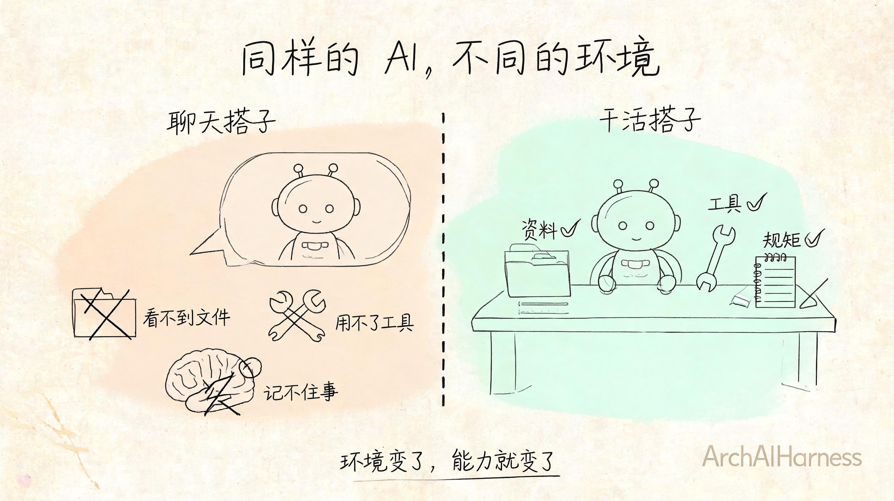
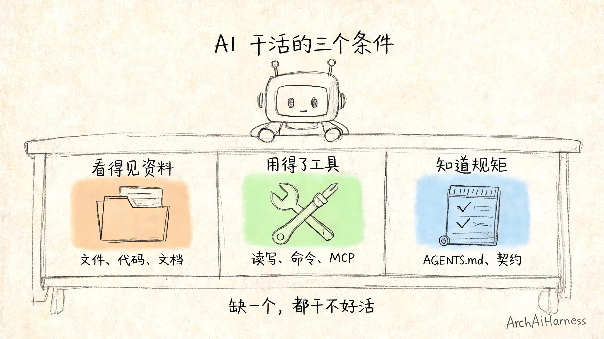
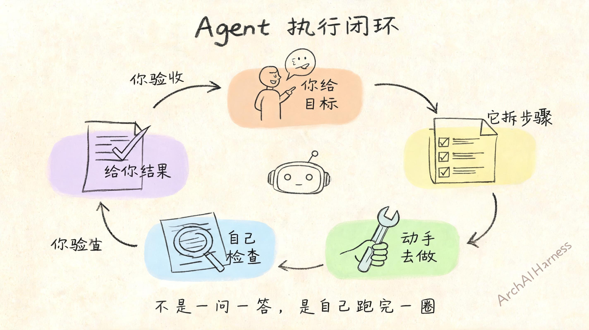
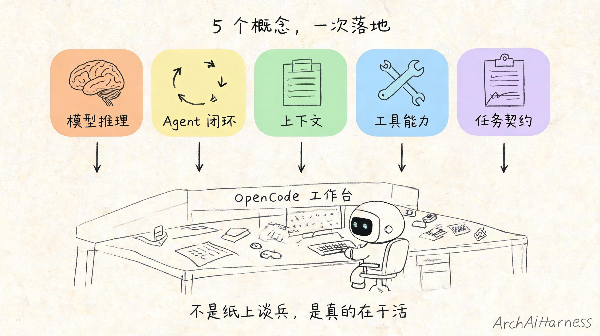
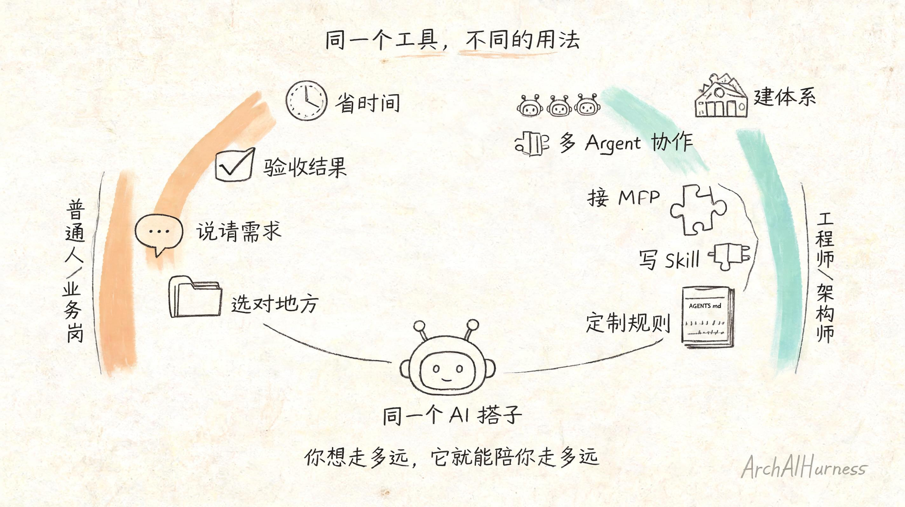

# 从"会聊天"到"能干活"：用 OpenCode 给自己找个 AI 搭子

你肯定有过这种感觉：

和 AI 聊了半天，说的都对，但就是落不了地。

让它写文案，改了五版还是不对味；让它分析问题，分析得头头是道但解决不了；让它帮忙整理资料，它说"你把资料贴给我"——你有几十份资料，贴到什么时候？

问题出在哪？

出在你一直在和 AI **聊天**，从来没让它真的**干活**。

聊天框里的 AI，再聪明也只是"嘴上说说"。真要做事，你得给它找一个能干活的地方。

这篇文章，我们就来聊聊这件事。

---

## 一、为什么聊天框里的 AI 干不了活

先打破一个常见误解：不是 AI 不够聪明，是你把它放错了地方。

你想想，一个人再能干，你把他扔在一个空房间里，只给一部手机跟他聊天，他能干成什么事？

他看不到你的文件，用不了你的工具，不知道你的规矩。

他除了跟你聊天，啥也干不了。

AI 也是一样。聊天框里的 AI，就像被关在空房间里的人——它只有你刚说的那几句话，别的什么都不知道，什么都碰不到。

那要让 AI 真的干活，得给它什么？

说穿了就三样。

第一，它得能看到你的资料。不用你每次手动粘贴，它自己能找、能翻、能读。

第二，它得能用你的工具。能改文件、能跑命令、能接外部系统，不是光嘴上说。

第三，它得知道你的规矩。做事的方式是什么、输出的格式是什么、什么能做什么不能做，心里得有数。

有了这三样，AI 才从"陪你聊天的"变成"跟你一起干活的"。

---

## 二、OpenCode 是什么

OpenCode 就是这么一个能让 AI 真干活的地方。

你可以把它理解成——**给你的 AI 搭子准备的一张工作台**。

这张工作台上，有它干活需要的所有东西：

- 你的项目文件、代码、文档，它都能看到；
- 读写文件、执行命令、调用工具，它都能做；
- 你定的规矩、写的 AGENTS.md，它会照着来。

感兴趣的话，可以直接去看[官方文档](https://opencode.ai/docs/zh-cn/)，这里就不多展开了，我们重点说——为什么有了这张工作台，AI 就能干活了？

听起来好像也没什么特别的？不就是个 AI IDE 吗？

不对。

区别在于——**聊天框里的 AI 是被动的，你问一句它答一句；OpenCode 里的 AI 是主动的，你给它一个目标，它会自己想办法做完。**

你给它一个目标，它会自己拆步骤、自己动手、自己检查，做完了告诉你结果。中间走偏了它会自己调整，做错了它会自己修正。

这就是 Agent 的执行闭环——目标、计划、行动、观察、修正、验证。

聊天框里没有这个闭环。你说一步，它走一步。你不说，它就停着。

这不是"更强的 AI"，这是**不同的工作方式**。

就像同一个人，在路边跟你唠嗑是一个状态，坐在工位上干活是另一个状态。人还是那个人，环境变了，行为模式就变了。

---

## 三、跟着跑一遍：让搭子帮你整理项目文档

说再多不如跑一遍。

我们拿一个所有人都能理解的场景来试：**让 AI 帮你整理一个项目的 README。**

别小看这个任务——它包含了读文件、理解项目结构、组织语言、输出结果，是一个完整的小闭环。

### 第一步：告诉搭子你要做什么

打开 OpenCode，选好你的项目目录，然后说一句话：

> 帮我把这个项目的 README 重新整理一下。按"项目定位、目录结构、快速开始、维护约定"四段来写，语言要简洁，不要废话。

就这么一句话。

注意，你不需要把项目介绍一遍，也不需要把文件贴给它。

为什么？因为它**自己能看到工作区里的文件**。

这就是和聊天框最大的区别。

### 第二步：看搭子怎么干活

说完之后你就看着——

它会先翻一翻项目里的文件，看看这是个什么项目；
然后它会读现有的 README，看看写了什么、缺了什么；
接着它会根据项目结构，重新组织内容；
最后它直接改 README 文件，改完告诉你哪里改了、为什么这么改。

整个过程，你不用插一句话。

它自己找资料、自己判断、自己动手。

你最后做一件事就行：**检查结果，告诉它哪里不对。**

### 第三步：你验收，它修改

如果你觉得哪段不对，直接说：

> 第三段"快速开始"写得太简单了，把环境要求也加上，再补一个常见问题列表。

它马上就改。

改完再给你看，你再验收。

来来回回几次，直到你满意为止。

发现没有？这才是**搭子**的感觉——不是你问一句它答一句，是你们一起把一件事做完。

---

## 四、这个搭子为什么能干活？

看到这你可能会说：不就是 AI 能读文件吗？有什么了不起的？

还真不只是"能读文件"。

能读文件只是第一步，真正让它从"聊天的"变成"干活的"，是三件事同时凑齐了：

**看得见你的资料、用得了你的工具、知道你的规矩。**

缺了任何一样，它都干不了活。

### 先说看得见资料这件事

还记得我们前面说过，AI 每次只能"看一张纸"吗？

那张纸上有什么，直接决定了它能干成什么样。

聊天框里的 AI，那张纸上只有你刚敲进去的几句话——你不说，它就不知道。你不贴资料，它就没资料可用。

OpenCode 里的 AI 呢？

那张纸上塞得满满的——整个项目的目录结构它扫得到，README 它读得到，代码文件它翻得着，你写的 AGENTS.md 它也看在眼里，甚至前面聊了什么它都记得。

**完全不是一个量级的上下文。**

所以你不用反复解释"这个项目是干嘛的"，不用把资料一份份贴给它，不用每次从头讲背景。

它自己找、自己看、自己用。

这事儿说穿了不值钱，但真用起来差别巨大——就像你跟一个完全不了解情况的人聊天，和跟一个已经在项目里待了半年的同事聊天，效率能一样吗？

### 再说用得了工具这件事

光有资料还不够。

你让它整理文档，它总不能在聊天框里给你"口述"一遍怎么改吧？你还得自己复制粘贴、自己找文件、自己改。

那叫什么干活？那叫你指挥，它出主意，最后活还是你干。

在 OpenCode 里不一样——它有手有脚。

读写文件是基础操作，改代码、跑命令都不在话下。你让它整理 README，它直接就把文件改好了，你打开看就行，不用你手动搬运。

这还只是最基础的 Tool。

再往上一层是 Skill——比如它知道怎么按你的风格整理文档，怎么对齐团队的代码规范，怎么做代码审查。这些不是天生就会的，是别人把经验封装好，变成了 AI 能调用的专业能力。

再接上 MCP 就更夸张了——它能直接连你的飞书、连你的数据库、连你公司的内部系统。你让它"把整理好的文档发去飞书群"，它直接就发了，不用你下载下来再上传。

你看，AI 从"会说"到"会干"，中间差的不是更聪明的大脑，是**能碰到真实世界的手和脚**。

### 最后是知道规矩这件事

有资料、有工具，就一定能干好活吗？

不一定。

你肯定遇到过这种情况：明明说清楚了要干嘛，结果 AI 给出来的东西就是不对味——格式不对、风格不对、重点也不对。

为什么？因为它不知道你的规矩。

你说"帮我整理一下文档"，你心里的"整理"是"按我们团队的模板来，分四个部分，语言要简洁"，但 AI 理解的"整理"可能是"把内容重新排一排，加点润色"。

信息差就在这里。

那规矩怎么来？

**小规矩，写在你说的那句话里。** 比如"按四段来写，语言要简洁"——这就是单次任务的契约，你写清楚了，它就按这个来。

**大规矩，写在 AGENTS.md 里。** 比如这个项目用什么架构、代码风格是什么、提交信息怎么写、文档模板长什么样——这些长期有效的规矩，写一次，AI 每次都照着来。

小契约 + 大契约，合起来就是 AI 做事的边界。

边界越清楚，它干的活越靠谱。

边界越模糊，它就越容易"自由发挥"——发挥出来的结果嘛，大概率不是你要的。

这也是为什么我们前面说，别再找 Prompt 模板了——模板解决不了根本问题。根本问题是，你有没有把任务的边界、格式、验收标准，清清楚楚地告诉 AI。

在 OpenCode 里，这个逻辑被放大了。

不止 Prompt 是契约，整个工作区的规则都是契约。

---

## 五、这个搭子还能干嘛？

整理 README 只是最简单的一个例子。

只要你愿意试，它能帮你干的活多了去了。

随便说几个日常能用的：

一堆杂乱的笔记扔进去，让它按主题分类整理，最后给你一个索引；会议录音转成文字稿了，扔给它，帮你提炼成结构化的会议纪要，谁要做什么、deadline 是什么，列得清清楚楚。

改简历、改文案、改邮件这种事就更不用说了——你把你要的风格告诉它，它帮你调，来来回回改几版，总能找到你想要的感觉。

甚至你读一篇长文章嫌累，扔给它，让它给你总结核心观点，有什么具体问题直接问，它能在文章里找答案给你。

如果你是工程师，那用法就更多了。

刚接手一个新项目？让它帮你梳理代码结构，把核心流程和关键模块给你讲明白，比自己瞎翻代码快多了。

写代码的时候，跟它说清楚这个项目的架构约定和代码风格，它写出来的东西至少在格式和结构上不会跑偏。

出 Bug 了？把报错信息和相关代码扔给它，让它帮你定位问题、分析原因、给出修复思路——不一定每次都对，但至少能给你一个方向，比自己闷头想快。

还有写单元测试、写接口文档、做代码审查……这些重复劳动，都可以丢给它先打个底，你最后过一遍就行。

当然，不是说 AI 什么都能干。

它能干得好的，都是那些**有明确目标、有明确规则、结果能验证**的事。

越是模糊的、需要拍板的、没有标准答案的事，它越干不好——至少现在还不行。

但话说回来——我们每天的工作里，有多少是真正需要"拍板定方向"的？

大部分时候，我们缺的不是创意，是有人帮我们把那些繁琐但重要的事，踏踏实实干完。

这就是搭子的价值。

---

## 六、普通人怎么上手，工程师能玩多深

不同的人，用这个搭子的方式完全不一样。

如果你只是想用它省点时间，不用学什么复杂的东西，记住三件事就够了。

**第一件事：别啥都在一个对话框里聊。**

写文章就在文章的工作区，做项目就在项目的工作区，个人生活的事单独开一个。不同的事放不同的地方，搭子才不会搞混。

**第二件事：说清楚你要啥。**

别只说"帮我整理一下"——整理成什么样？给谁看？要多长？按什么结构？

你说得越清楚，它干得越靠谱。你模棱两可，它就只能瞎猜。

**第三件事：会验收，会提修改意见。**

第一版不满意太正常了，别用了一次觉得不行就放弃。

你告诉它哪里不对、要怎么改，它马上就能调。来来回回几次，总能调到你想要的样子。

就这三件事，不用学编程，不用懂技术，普通人都能用好。

如果你是工程师或者想玩得更深一点，那能折腾的东西就多了。

最基础的，你可以给每个项目写一份 AGENTS.md，把这个项目的架构约定、代码风格、提交规范都写进去。写一次，以后 AI 在这个项目里干活都会照着来。

再进一步，你可以写自己的 Skill。什么意思呢？就是把你擅长的工作方法、检查清单、专业流程，封装成 AI 能调用的能力。以后它干活就用你的方法，而不是它自己瞎摸索。

再接上 MCP 呢？它就不只是你代码里的搭子了——它能直接操作你的数据库、调用你的接口、发消息到飞书、查 Jira 工单。整个研发流程里的重复劳动，都可以交给它。

玩到最后，你甚至可以搭多 Agent 工作流。一个负责写代码，一个负责做审查，一个负责写文档，各司其职，你最后拍板就行。

从"用它省点时间"到"让它帮你搭一个 AI 团队"，中间的空间很大。

你想走多远，就看你自己了。

---

## 写在最后

回到开头的问题：为什么你和 AI 聊天总觉得差点意思？

因为 AI 的价值从来不在聊天里，而在做事里。

你不需要一个更能聊的 AI。

你需要的是一个**能跟你一起把事做成的搭子**。

未来真正会用 AI 的人，不一定是最会"写 Prompt"的人，也不一定是最懂技术的人。

而是最懂得**怎么给 AI 找对位置、定好规矩、分好工**的人。

就像找搭子一样——不是找最厉害的，是找最合适的、能一起把事干成的。

下一篇，我们聊一个更深入的问题：这个搭子干完了活，它能记住吗？难道每次都要从头开始？

这就是分层记忆要解决的事。

---

### 关于 ArchAIHarness

这篇文章是「看懂 AI 与智能体」专栏的一部分，由 [**ArchAIHarness**](https://github.com/ArchAIHarness) 持续输出。

ArchAIHarness 是一套面向 AI 时代软件工程的人机协同架构哲学与公开工程资产，主张：

> **架构师定义秩序，AI 在秩序中生长。人立法，AI 执行，体系审计。**

如果你也希望 AI 在明确的架构边界内协作，而不是在混沌中碰运气，欢迎到 GitHub 上看看我们在做什么：

- **组织主页**：[github.com/ArchAIHarness](https://github.com/ArchAIHarness) — 了解完整理念与资产全景
- **本专栏**：[`zhuanlan-ai-and-agents`](https://github.com/ArchAIHarness/zhuanlan-ai-and-agents) — 所有文章的源码与发布记录
- **实践指南**：[`docs`](https://github.com/ArchAIHarness/docs) — 架构哲学、工程方法和落地指南
- **开源工具**：[`agent-workflows`](https://github.com/ArchAIHarness/agent-workflows) — 可复用的 AI 协作 Agents、Skills 与 Tools
- **工程样例**：[`framework`](https://github.com/ArchAIHarness/framework) — DDD + AI 协作的工程底座，展示如何在开发中融合 AI

> Engineered by Architects · Empowered by AI · Audited by Discipline
