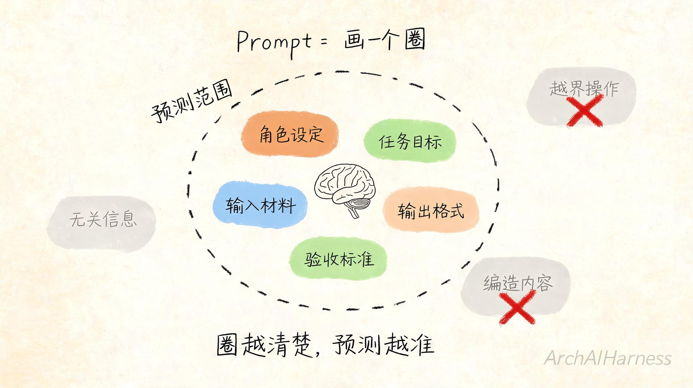
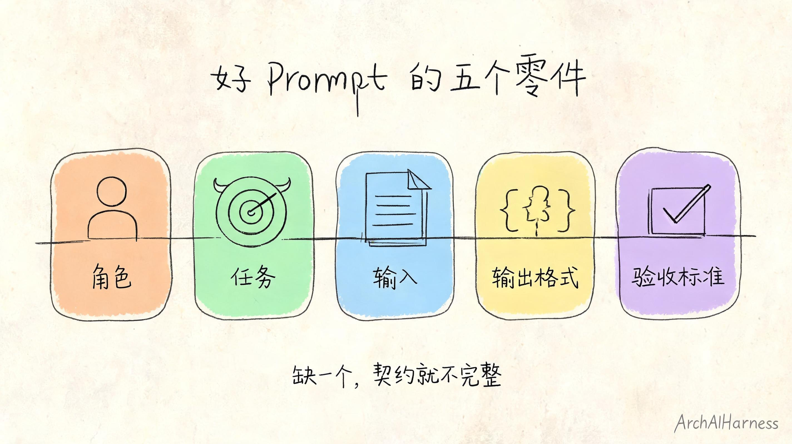
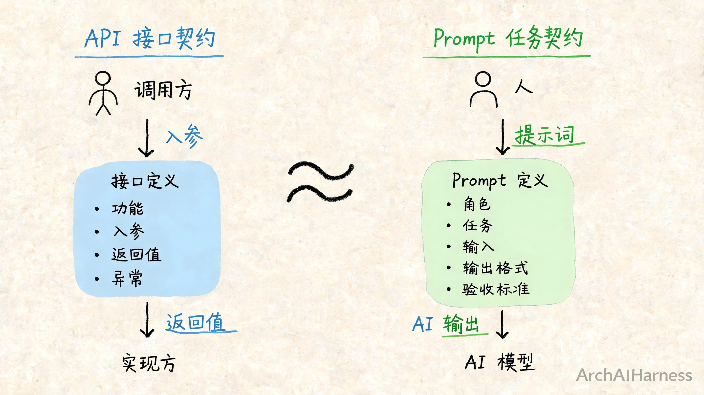

# 别再找 Prompt 模板了：提示词的本质，是你和 AI 的任务契约

你肯定见过这种东西：

"万能 Prompt 公式"、"100 个神级 Prompt"、"让 AI 效率翻倍的 20 句话术"。

你可能也收藏过。

但真要用的时候，套上去发现不是那么回事——要么 AI 还是答不到点子上，要么换个场景模板就废了。

问题出在哪？

出在你把提示词当成了"咒语"，以为找到那句正确的话，AI 就会乖乖听话。

但实际上，提示词根本不是咒语。

它是你和 AI 之间的一份**任务契约**。

这篇文章，我们就把这件事讲透。理解了提示词的本质，你不需要收藏一百个模板，也能写出好用的提示词。

## 一、为什么"帮我写个文案"总是写不到点子上

先从一个最常见的场景说起。

你打开 AI，输入：

> 帮我写个产品宣传文案。

AI 刷刷刷写了几百字。你一看，觉得哪里不太对：

- 语气太浮夸了，我们品牌不是这个风格；
- 重点放错了，我们最核心的优势它一句话没提；
- 目标用户也不对，它写的是给小白看的，但我们面向的是专业用户；
- 最后连文案要多长、发布在哪，它都没搞清楚。

你很失望，觉得"这个 AI 不太行"。

但换个角度想：如果你的同事过来跟你说"帮我写个文案"，你能直接写好吗？

你肯定会追问：

- 写什么产品的文案？
- 给谁看的？
- 发在哪的？朋友圈？公众号？还是海报？
- 要什么风格？正式的？活泼的？专业的？
- 重点想突出什么？
- 大概要多少字？

你问的这些问题，本质上是在**补全任务的边界条件**。

没有这些边界，你写不出来；同样，没有这些边界，AI 也写不出来。

AI 不是没能力，是你给的信息太少了。

模糊的输入，只能得到模糊的输出。

## 二、提示词到底在干什么

那提示词到底在干什么？

很多人以为提示词是在"命令 AI 做什么"，就像给下属派活一样，你说什么它做什么。

不是的。

回到我们第一篇讲的原理：AI 模型的本质，是基于上下文预测下一个最合理的片段。

那上下文里有什么？

有系统设定、有对话历史、有工具返回的结果——还有，就是你写的提示词。

所以提示词真正在做的，是**给模型划定一个"预测的前提范围"**。

你写的每一句话、每一个要求、每一个例子，都在缩小模型的预测空间：

- 你说"你是一个资深架构师"——它就会往架构师的表达方式上靠；
- 你说"用简洁的中文回答"——它就不会写长篇大论、也不会蹦英文；
- 你说"输出格式是 JSON"——它就会按 JSON 的结构来生成；
- 你说"只基于提供的资料回答，不要编造"——它就会尽量只在你给的资料里找答案。

提示词不是咒语，也不是命令。

它更像是你给 AI 画的一个**圈**：圈里是你允许它用的信息、规则、格式和目标，圈外是它不该碰的东西。

圈画得越清楚，AI 的预测就越准，输出就越接近你想要的。

圈画得越模糊，AI 就只能靠猜。猜出来的东西，大概率不是你要的。

## 三、一个好 Prompt 的五个零件

既然提示词是任务契约，那一份清楚的契约，至少应该包含哪些内容？

不用记什么复杂公式。你只要记住五个零件就行：**角色、任务、输入、输出格式、验收标准**。

我们一个个说。

**第一个：角色。**

你希望 AI 以什么身份来回答这个问题？

是小学老师？还是资深工程师？是产品经理？还是文案策划？是你的同事？还是你的教练？

角色决定了 AI 的表达方式、知识深度和看问题的视角。

同样是解释"什么是数据库"，面对小学生和面对工程师，讲法完全不一样。

角色不是装饰，它是在给 AI 定一个**基准视角**。

**第二个：任务。**

你到底要它做什么？

是总结？是改写？是翻译？是写代码？是分析问题？还是列计划？

任务要具体，不要笼统。"帮我看看这段文字"不是任务，"帮我找出这段文字里的逻辑漏洞，并说明理由"才是任务。

**第三个：输入。**

它做这件事，需要用到什么材料？

是一段文字？一个文件？一组数据？还是一个问题描述？

输入要明确，不要让 AI 猜你说的是什么。如果你要它分析一份文档，就把文档贴进去，或者明确告诉它从哪里读。

**第四个：输出格式。**

你希望结果长什么样？

是一段话？一个列表？一个表格？一段代码？一个 JSON？还是一篇完整的文章？

格式越明确，AI 越不容易跑偏。尤其是你后面还要用程序处理输出的时候，格式约定就是接口约定。

**第五个：验收标准。**

做到什么程度，算"做好了"？

这是很多人最容易忽略的一步。

你说"写得专业一点"——什么叫专业？
你说"简洁一点"——多简洁算简洁？
你说"别太啰嗦"——多少字算啰嗦？

验收标准不是非要量化，但至少要给出判断方向：

- "只基于提供的资料回答，不要编造信息"
- "每一点不超过 50 字"
- "先给结论，再给理由，最后给建议"
- "如果信息不足，直接说不知道，不要猜"

验收标准的作用，是让 AI 在生成的时候有一个**自我检查的依据**。

## 四、为什么"模板拼凑"迟早会失效

讲完这五个零件，你大概就能明白，为什么网上很多 Prompt 模板不好用。

因为模板的问题，不在于它错，而在于它**脱离了你的具体任务**。

一个"万能写作模板"，可能包含了角色设定、任务描述、输出格式，但它不知道你的产品是什么、你的用户是谁、你的品牌风格是什么、你这次发布的目的是什么。

你把模板套上去，就像拿别人的药方抓自己的药——方子可能没问题，但不对症。

更本质的问题是：

> 模板是别人的业务理解的沉淀，不是你的。

真正好用的 Prompt，从来不是"一句话写得多巧妙"，而是它背后**对任务的拆解有多清楚**。

你让 AI 写代码，写得好不好，取决于你有没有把需求、约束、接口规范说清楚，而不是你用了什么"神级 Prompt"。

你让 AI 做数据分析，做得准不准，取决于你有没有把数据口径、业务背景、分析目标讲明白，而不是你背了什么"数据分析万能公式"。

你让 AI 写方案，方案靠不靠谱，取决于你有没有把问题定义清楚、把边界划明白，而不是你说了几句"你是一个顶级专家"。

Prompt 的上限，是你对任务的理解深度。

模板只能帮你表达，不能帮你思考。

所以别再到处找模板了。

你真正该练的，是**把模糊需求拆成清晰任务的能力**。这个能力，不管有没有 AI，都很重要。AI 只是把它的重要性放大了而已。

## 五、普通人三步法：把模糊需求拆成清晰输入

说起来容易，具体怎么做？

给你一个普通人也能直接用的三步法。不用记复杂术语，就三步。

**第一步：你先说清楚"我是谁、我要干什么"。**

不要一上来就甩材料，也不要一上来就问问题。

先给 AI 一个最基本的背景：

> 我是一个做 SaaS 产品的市场经理，现在要写一篇公众号文章的标题，文章内容是讲我们新上线的 AI 助手功能。

就这么一句话，AI 就知道了你的角色、你的场景、你要做的事。它就不会给你写出完全不着调的东西。

**第二步：把你手里的材料和你要的结果，说清楚。**

你有什么？你想要什么？

> 我把产品功能介绍贴在下面（材料），帮我想 10 个标题，风格要专业但不生硬，每个标题不超过 25 个字（结果要求）。

材料和结果都要明确。材料是输入，结果是输出。输入输出都清楚了，任务的边界就立住了。

**第三步：告诉它"怎么算合格"。**

这一步是拉开差距的关键。

大多数人说到第二步就停了，但真正让输出质量上一个台阶的，是验收标准。

> 要求：
> 1. 每个标题要能让目标读者一眼看懂是什么；
> 2. 不要用"颠覆"、"革命性"、"神级"这类夸大的词；
> 3. 如果有不清楚的地方，直接问我，不要编。

验收标准不用很多，两三条就够，但每一条都要具体。它会让 AI 在生成的时候有一个"自我校对"的标尺。

就这三步：**说清身份和目标 → 说清输入和输出 → 说清验收标准。**

你拿这个方法去试，绝大多数日常场景的 Prompt 质量，都会比你之前收藏的那些模板好用。

因为它不是套话，是帮你把自己的需求想清楚。

AI 只是放大器。你想清楚了，它才能帮你做得更好。你自己都没想清楚，它就只能瞎猜。

## 六、工程师视角：Prompt 是接口契约，不是文案

如果你是工程师或者做产品的，我还想多说一层。

对工程师来说，Prompt 是什么？

它不是文案工作，是**接口设计工作**。

你想一下：你设计一个 API 的时候，会关心什么？

- 这个接口是干什么的？（功能定义）
- 入参有哪些？分别是什么类型？什么格式？（输入约定）
- 返回值是什么结构？什么字段？什么类型？（输出约定）
- 什么情况会报错？错误码是什么？（异常约定）
- 有哪些使用约束？频率限制？权限要求？（边界约定）

你看，一个好的 Prompt，和一个好的 API 设计，结构是一样的。

角色 ≈ 接口的使用场景和调用方身份。
任务 ≈ 接口的功能定义。
输入 ≈ 接口的入参。
输出格式 ≈ 接口的返回结构。
验收标准 ≈ 接口的成功条件和异常处理。

这不是巧合。

因为从本质上说，**Prompt 就是人和 AI 之间的接口契约**。你把任务按约定的格式交给 AI，AI 按约定的格式返回结果。

理解了这一层，你再看很多事情就通了：

- 为什么 Prompt 写得含糊，AI 就容易出错？因为接口定义不清晰，调用方和实现方的理解就会有偏差。
- 为什么换个模型，同一个 Prompt 效果不一样？因为换了实现方，对契约的理解和执行能力变了。
- 为什么复杂任务要拆成多步 Prompt？因为一个接口做太多事就不好维护，拆成多个小接口，每个职责单一，更可靠。
- 为什么需要 AGENTS.md？因为系统级的约束不能靠每次调用都传一遍，要有一份稳定的、全局的契约。

这也是我们在 [`framework`](https://github.com/ArchAIHarness/framework) 工程样例里强调的思路：把架构判断、任务边界、验收标准，沉淀成像 `AGENTS.md` 这样的稳定契约。它不是一次性的 Prompt，而是 AI 每次执行任务时都能看到的"系统级接口约定"。

DDD 里说"限界上下文"，说的是每个领域有自己的边界和语言。放到 AI 这里，其实是一回事：**每个任务有自己的边界和契约，Prompt 就是这份契约的文本形式。**

真正的 Prompt 工程，不是琢磨怎么把一句话写得更"神"，而是像设计接口一样，把任务的输入、输出、边界、异常、验收标准定义清楚。

## 七、写在最后

为什么很多人找了一堆 Prompt 模板，还是觉得 AI 不好用？

因为因果搞反了。

不是"找到好模板，AI 就好用"。

而是"你把任务想清楚了，AI 才好用"。模板只是帮你表达清楚的工具而已。

提示词的本质，是你和 AI 之间的任务契约。

这份契约里，有角色、有任务、有输入、有输出格式、有验收标准。

契约写得越清楚，AI 执行得越可靠。

契约写得越模糊，AI 就越容易"自由发挥"——发挥出来的结果，大概率不是你要的。

未来真正会用 AI 的人，不一定是最会"写 Prompt"的人，而是最会**拆解任务、定义边界、明确验收**的人。

这些能力，在没有 AI 的时代就很重要。AI 没有创造它们，只是让它们的价值变得更大了。

下一篇，我们聊一个很多人都关心的问题：自己的资料、文档、知识那么多，怎么让 AI 能用好？总不能每次都手动贴进去吧。

这件事，有个词叫 RAG。它不是给 AI 装硬盘，而是给 AI 一个会找书的图书管理员。

---

### 关于 ArchAIHarness

这篇文章是「看懂 AI 与智能体」专栏的一部分，由 [**ArchAIHarness**](https://github.com/ArchAIHarness) 持续输出。

ArchAIHarness 是一套面向 AI 时代软件工程的人机协同架构哲学与公开工程资产，主张：

> **架构师定义秩序，AI 在秩序中生长。人立法，AI 执行，体系审计。**

如果你也希望 AI 在明确的架构边界内协作，而不是在混沌中碰运气，欢迎到 GitHub 上看看我们在做什么：

- **组织主页**：[github.com/ArchAIHarness](https://github.com/ArchAIHarness) — 了解完整理念与资产全景
- **本专栏**：[`zhuanlan-ai-and-agents`](https://github.com/ArchAIHarness/zhuanlan-ai-and-agents) — 所有文章的源码与发布记录
- **实践指南**：[`docs`](https://github.com/ArchAIHarness/docs) — 架构哲学、工程方法和落地指南
- **开源工具**：[`agent-workflows`](https://github.com/ArchAIHarness/agent-workflows) — 可复用的 AI 协作 Agents、Skills 与 Tools
- **工程样例**：[`framework`](https://github.com/ArchAIHarness/framework) — DDD + AI 协作的工程底座，展示如何在开发中融合 AI

> Engineered by Architects · Empowered by AI · Audited by Discipline
