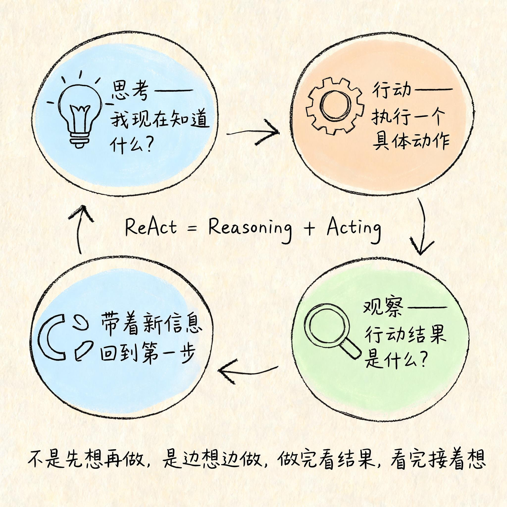
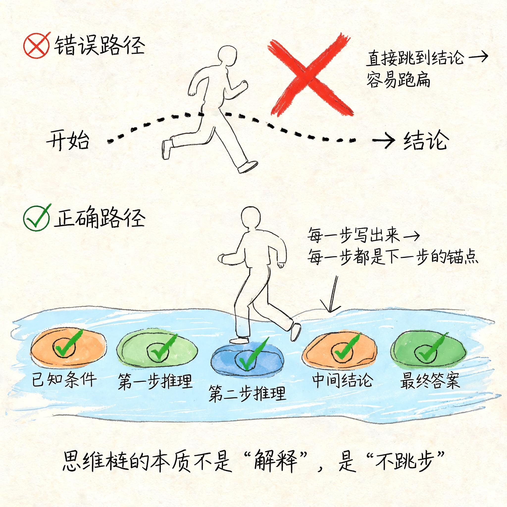
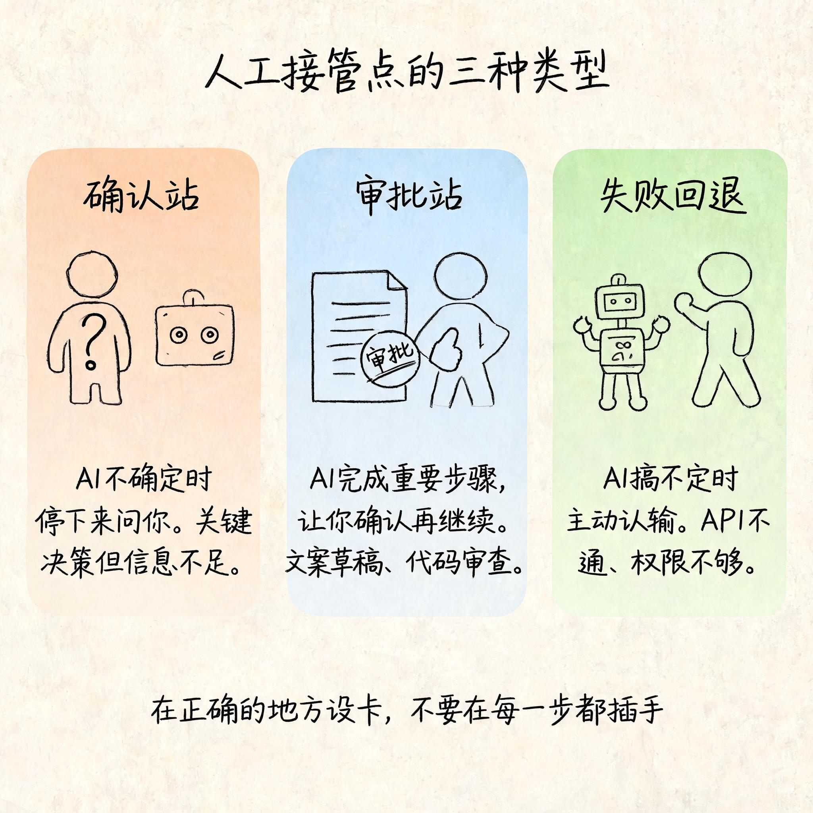

# 自主推理框架——AI 怎么自己拆任务、自己修正

你肯定有过这种体验。

让 AI 做一件复杂的事——比如"帮我分析一下这个项目的风险"——它刷刷刷给你列了一二三四，分步骤、有逻辑、头头是道。

你第一反应：AI 真聪明。

但你再让它做一件别的事，稍微绕一点，它可能就原地打转——反复说差不多的话，出不来，最后给你一句"抱歉我搞错了"。

聪明是同一台 AI，笨也是同一台 AI。

问题出在哪？

出在你以为它"自己会想"，但实际上它只是在按一套框架执行。框架对了，它就显得很聪明；框架不对，它就卡住。

**自主推理不是 AI 变聪明了，是它用了一套思考框架来拆任务、做行动、自己纠错。**

这篇文章就把这套框架拆开给你看。

## 一、像用导航一样理解自主推理

先给你一个最熟悉的东西：导航 App。

你打开导航，输入目的地，它做三件事：

1. **规划路线**——根据当前路况选一条最优路径；
2. **按路线行驶**——你跟着导航走，遇到路口它告诉你左转还是右转；
3. **实时调整**——前面封路了，它立刻重新规划，给你一条新路。

整个过程就是一个持续的循环：**规划 → 执行 → 观察 → 再规划**。

现在把导航 App 替换成 AI 模型，把"目的地"替换成你给它的任务——你会发现，自主推理的结构一模一样：

| 导航 | AI 自主推理 |
|------|------------|
| 输入目的地 | 你给 AI 一个任务 |
| 规划路线 | AI 拆解任务步骤 |
| 按导航行驶 | AI 一步步执行 |
| 遇到封路重新规划 | AI 发现错误后自我修正 |
| 问"你还要继续按新路线吗" | AI 不确定时请求人工确认 |

这不是巧合。**所有自主推理框架，本质上都在做同一件事——把"怎么把任务做完"这件事，从"让 AI 自己猜"变成"让 AI 按流程走"。**


## 二、ReAct：最主流的推理框架长什么样

这套"规划→执行→观察→再规划"的循环，在 AI 领域有一个专门的名字——**ReAct**。

ReAct = Reasoning + Acting。推理 + 行动。

不是先想再做，而是**边想边做，做完看结果，看完接着想**。

拆开来看，一个标准的 ReAct 循环是四步：

**第一步：思考（Think）**
AI 根据当前状态判断：我现在知道了什么？我还缺什么？下一步应该做什么？
比如："用户让我分析项目风险，我需要先了解这个项目的背景信息。当前上下文里没有，我应该先问清楚，还是先基于已有信息分析？"

**第二步：行动（Act）**
AI 执行一个具体动作。可能是调用一个工具、查一个文件、写一段代码、或者直接输出一段文字。
比如："先查一下项目文档，看看有没有风险相关的记录。"

**第三步：观察（Observe）**
AI 看行动的结果——工具返回了什么、文件里写了什么、代码有没有报错。
比如："查到一份风险评估报告，里面提到了三个已知风险点。"

**第四步：循环（Loop）**
AI 带着新信息回到第一步，继续思考。直到任务完成，或者确定自己做不下去了。



这就是为什么你有时候觉得 AI "自己想了一会儿"——它不是真的在想，它是在跑这个循环。一圈、两圈、三圈，每圈推进一点。

这个机制的厉害之处，不是让 AI 变得多聪明，而是**让 AI 的行为变得可预测、可追踪、可干预**。每一圈想了什么、做了什么、看到了什么，都是可以回放的。这在工程上意味着什么？意味着你可以审计它。

## 三、思维链：让 AI 把"心里话"写出来

ReAct 解决了"边想边做"的问题，但还有一个更基础的机制——**Chain of Thought，思维链**。

你可能在 ChatGPT 上见过这个效果：你问它一个复杂的数学题，它会先写"好的，我们一步步来看"，然后列出推理过程，最后给出答案。

大多数人觉得这只是在"解释给你听"。不是的。

**思维链不是为了让人类看懂，而是为了让 AI 自己不出错。**

原因很简单：AI 模型每次预测下一个词的时候，参考的是它前面写过的东西。如果它直接跳到一个结论，中间的推理步骤缺失，它后面就很容易跑偏——因为没有中间结果作为"路标"来校准方向。

但如果它把每一步推理都写出来：

> "已知 A=10，B=20。第一步，计算 A+B=30。第二步，计算 A×B=200。第三步，比较 30 和 200，200 更大，所以答案是 B。"

每一步写出来的结果，都会成为下一步推理的"锚点"。哪怕中间某一步算错了，你也能看到它错在哪一步，而不是得到一个不知道从哪里来的数字。

**思维链的本质不是"解释"，是"不跳步"。**

对普通人来说，怎么用这个？

很简单：让 AI **一步一步来**。不需要什么高级 Prompt 技巧，就在任务后面加一句"请一步步推理，把过程写出来"，效果立竿见影。

对工程师来说，要关心的是另一件事：**思维链的输出长度会不会爆掉上下文**。每一步推理都写出来，意味着 Token 消耗显著增加。如果任务复杂，光推理过程就能吃掉大半上下文窗口。这意味着你需要为推理留出额外的上下文预算，或者在设计流程时加一个"推理摘要"步骤。



## 四、自我修正：AI 怎么知道自己错了

ReAct 管"做"，思维链管"想"。但还有一个问题：**AI 做完之后，怎么知道自己做得对不对？**

答案是：它不知道。

模型本身没有"对错感"。它只能通过外部反馈来判断。这就是自我修正机制要解决的问题。

目前最主流的做法，叫 **Self-Reflection（自我反思）**。流程是这样的：

1. AI 输出一个结果；
2. AI 把自己的输出拿过来，重新读一遍；
3. 按照你给的验收标准，逐条检查自己有没有做到；
4. 发现没做到的，再补一轮修正。

听起来有点绕？其实就是两步：**写 → 查 → 改**。

举个例子。你让 AI 写一段代码，要求：
- 用 Python 3
- 不超过 50 行
- 包含异常处理

AI 写完第一版之后，不要直接交给你。让它自己先检查一遍：

> "现在请你检查上面的代码：是不是 Python 3？有没有超过 50 行？有没有异常处理？如果有问题，修正后重新输出。"

这一查，大概率能发现一些问题——比如忘了加 try-except，或者行数超了。然后它自己改，改完再检查，直到满足条件或达到最大尝试次数。

**自我修正不是 AI 变严谨了，是你在流程里加了一道"自查门禁"。**

对工程师来说，这是最有价值的一层：**AI 不需要一次写对，但可以通过循环逼近正确**。这意味着你可以降低对单次输出质量的要求，转而通过设计检查-修正循环来保障最终质量。

但要注意：自我修正是有成本的。每一轮检查-修正都意味着额外的 Token 消耗和时间开销。而且 AI 对自己的检查并不是 100% 可靠的——它可能会漏掉自己的错误，也可能会把正确的东西改错。所以还需要一个兜底机制。

## 五、什么时候该让人介入

AI 不是万能的。再好的框架也有搞不定的时候。

自主推理框架里有一个经常被忽略的设计——**人工接管点（Human-in-the-Loop）**。

不是说 AI 卡住了才找人，而是在设计流程的时候，就预先设好几个"检查站"：

**第一类：确认站。**
AI 不确定的时候，停下来问你。典型场景：AI 需要做关键决策但信息不足。比如拆任务时发现有两种可能性，不知道该走哪条路。

**第二类：审批站。**
AI 做完一个重要步骤后，停下来让你检查结果，确认没问题再继续。典型场景：AI 生成了一个对外发布的文案草稿，让你过目一下再发。

**第三类：失败回退。**
AI 执行失败且自我修正无效时，主动认输，告诉你"这件事我搞不定，需要你处理"。典型场景：API 调不通、权限不够、或者任务本身超出了它的能力范围。

这三种接管点的设计原则是一样的：**在正确的地方设卡，不要在每一步都插手。**

对普通人来说，你只需要记住一条：**如果一件事风险很高、或者你也不确定怎么做才对，不要让 AI 自己搞。在开始之前就告诉它——"这一步做完先给我看，我再告诉你下一步。"**

对工程师来说，人工接管点是一个架构设计问题：接管点的触发条件是什么？超时怎么办？信息如何传递给人类？人类反馈后如何接回流程？这些都需要在 Agent 的设计文档里写清楚，而不是写代码的时候临时补。



## 六、工程师视角：怎么给 Agent 设计思考流程

前面讲的都是原理和机制。最后这一层，是给工程师看的。

你理解了 ReAct、思维链、自我修正、人工接管点，然后呢？怎么把它们落地成一个可执行的 Agent？

核心思路只有一条：**把思考流程写成一份你可以修改的文档，而不是写死在代码里。**

为什么？

因为当前没有一个框架是万能的。ReAct 适合需要反复试错的场景，Plan-and-Execute 适合步骤明确的流程，CoT 适合需要深度推理的问题。你要做的不是选一个"最好的"，而是**根据你的任务类型组合使用**。

具体落地方式就是 AGENTS.md——专栏第 3 篇就讲过的东西。

在工程实践里，你可以在 AGENTS.md 里定义：

```
## 任务执行流程

1. 收到任务后，先拆解为不超过 5 个子步骤（ReAct 规划阶段）
2. 每执行一步，输出推理过程（思维链）
3. 执行完成后，按验收标准做自我检查（自我修正）
4. 如果连续失败 3 次，标记为"无法完成"并请求人工介入（失败回退）
```

这不是一篇指导文档，是一份 AI 每次执行任务时都能读到的**系统级约定**。AI 会按这个流程执行，而不是靠"猜你想让我怎么做"。

这就是我们在 [`agent-workflows`](https://github.com/ArchAIHarness/agent-workflows) 和 [`framework`](https://github.com/ArchAIHarness/framework) 里持续实践的方向——把人的思考方法，变成 AI 可执行的流程。不是让 AI 更像人，是**让 AI 按一套你能理解、能修改、能审计的流程工作**。

这也是 ArchAIHarness 一直主张的：

> **人立法，AI 执行，体系审计。**

AI 不需要变得更聪明。它只需要在正确的框架里执行。框架是你定的，不是它猜的。

## 七、写在最后

回到开头的问题。

AI 做复杂任务的时候，看起来"很会想"——这不是因为它突然变聪明了。是因为它在按一套框架执行：拆任务、做行动、看结果、自己纠错，搞不定的时候找你。

你真正该关心的，不是"AI 能不能自己思考"，而是"我怎么给 AI 设计一套它能执行的思考流程"。

未来真正会用 AI 的人，不一定是最会"调教模型"的人，而是**最会设计流程、定义边界、安排检查站**的人。

下一篇，我们聊一个很多人都在问的问题：我的资料、文档、知识那么多，AI 怎么才能用得好？总不能每次都手动贴吧。这件事，有个词叫 RAG——但你可能不知道，它的核心不是检索技术，而是你怎么组织你的资料。

---

### 关于 ArchAIHarness

这篇文章是「看懂 AI 与智能体」专栏的一部分，由 [**ArchAIHarness**](https://github.com/ArchAIHarness) 持续输出。

ArchAIHarness 是一套面向 AI 时代软件工程的人机协同架构哲学与公开工程资产，主张：

> **架构师定义秩序，AI 在秩序中生长。人立法，AI 执行，体系审计。**

如果你也希望 AI 在明确的架构边界内协作，而不是在混沌中碰运气，欢迎到 GitHub 上看看我们在做什么：

- **组织主页**：[github.com/ArchAIHarness](https://github.com/ArchAIHarness) — 了解完整理念与资产全景
- **本专栏**：[`zhuanlan-ai-and-agents`](https://github.com/ArchAIHarness/zhuanlan-ai-and-agents) — 所有文章的源码与发布记录
- **实践指南**：[`docs`](https://github.com/ArchAIHarness/docs) — 架构哲学、工程方法和落地指南
- **开源工具**：[`agent-workflows`](https://github.com/ArchAIHarness/agent-workflows) — 可复用的 AI 协作 Agents、Skills 与 Tools
- **工程样例**：[`framework`](https://github.com/ArchAIHarness/framework) — DDD + AI 协作的工程底座，展示如何在开发中融合 AI

> Engineered by Architects · Empowered by AI · Audited by Discipline
